# RESA Power - Architecture Diagrams

## System Architecture Overview

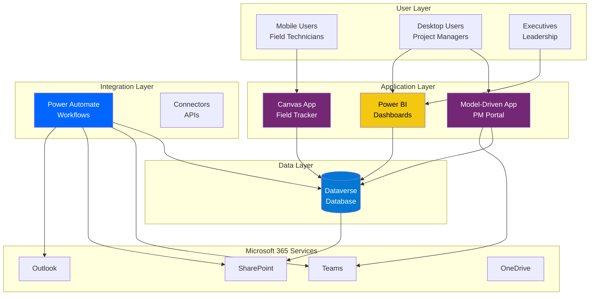

## Dataverse Entity Relationship Diagram

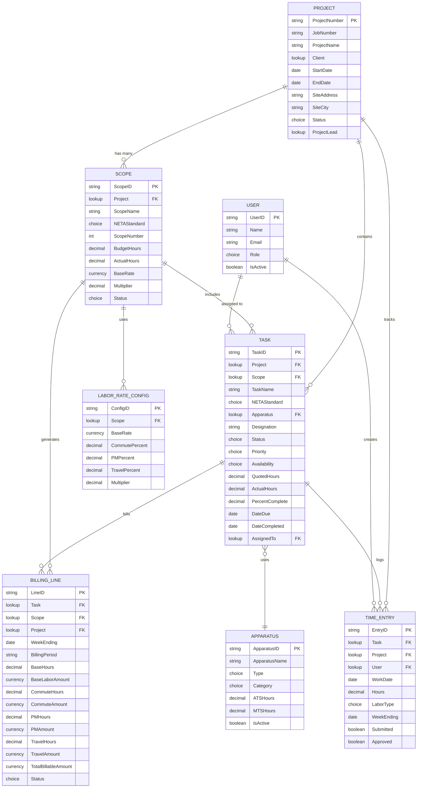

## Application Flow Diagram

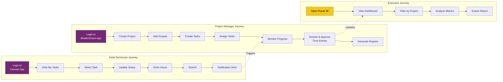

## Power Automate Workflow Architecture

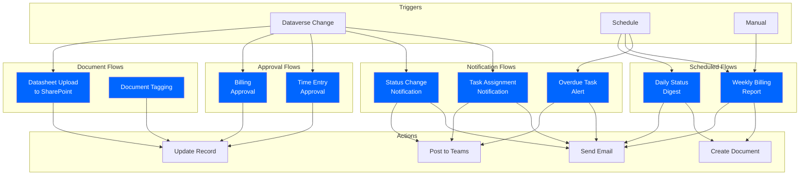

## Data Migration Flow

```mermaid
graph LR
    subgraph "Source"
        Excel[Excel XLSM<br/>9 Worksheets]
    end
    
    subgraph "Extraction"
        Python[Python Script<br/>Data Extraction]
    end
    
    subgraph "Transformation"
        CSV[CSV Files<br/>Clean & Transform]
    end
    
    subgraph "Validation"
        Review[Manual Review<br/>& Validation]
    end
    
    subgraph "Import"
        Import[Dataverse<br/>Data Import]
    end
    
    subgraph "Target"
        Dataverse[(Dataverse<br/>Tables)]
    end
    
    Excel -->|Read| Python
    Python -->|Generate| CSV
    CSV -->|Review| Review
    Review -->|Approve| Import
    Import -->|Load| Dataverse
    
    style Excel fill:#217346,color:#fff
    style Python fill:#3776AB,color:#fff
    style Dataverse fill:#0078D4,color:#fff
```

## Security Model

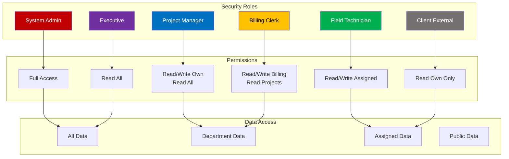

## Integration Architecture

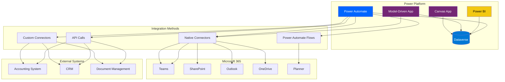

## Canvas App Screen Flow

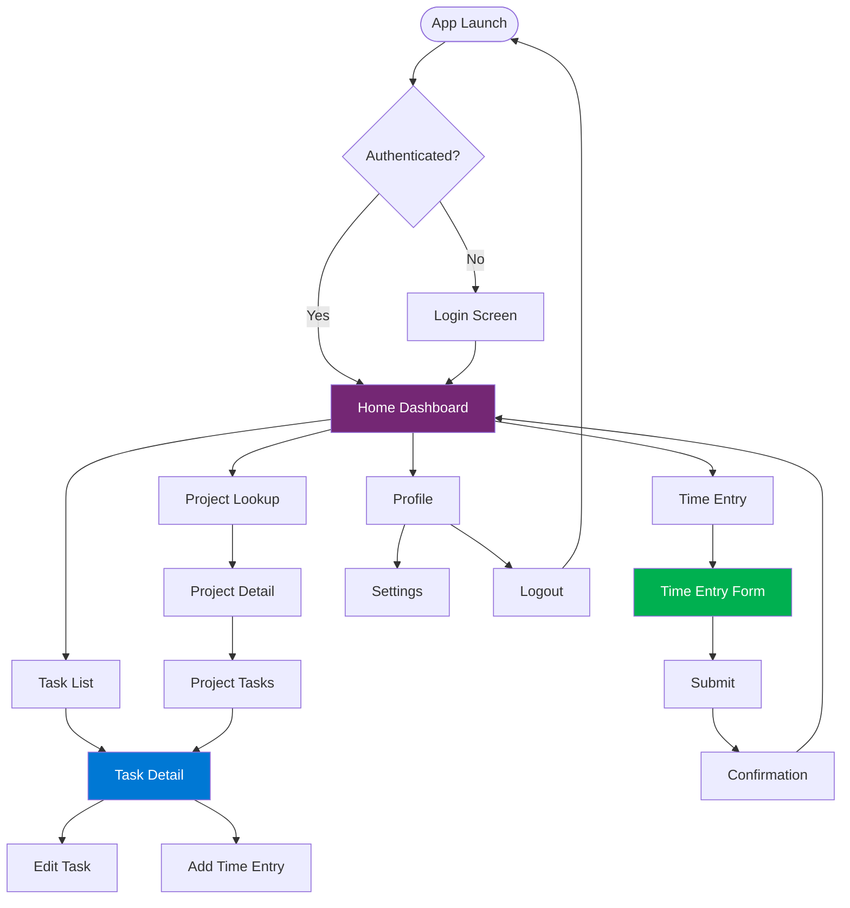

## Model-Driven App Sitemap

```mermaid
graph TB
    Root[RESA Power PM Portal]
    
    Root --> Projects[Projects]
    Root --> Tasks[Tasks]
    Root --> Billing[Billing]
    Root --> Resources[Resources]
    Root --> Admin[Administration]
    
    Projects --> P1[Active Projects]
    Projects --> P2[All Projects]
    Projects --> P3[My Projects]
    Projects --> P4[Project Calendar]
    Projects --> P5[Archived Projects]
    
    Tasks --> T1[My Tasks]
    Tasks --> T2[All Tasks]
    Tasks --> T3[Overdue Tasks]
    Tasks --> T4[By Status]
    Tasks --> T5[By Priority]
    
    Billing --> B1[Time Entries]
    Billing --> B2[Billing Lines]
    Billing --> B3[Weekly Billing]
    Billing --> B4[Invoicing]
    Billing --> B5[Rate Configuration]
    
    Resources --> R1[Team Members]
    Resources --> R2[Apparatus Catalog]
    Resources --> R3[Resource Calendar]
    Resources --> R4[Capacity Planning]
    
    Admin --> A1[Users & Teams]
    Admin --> A2[Security Roles]
    Admin --> A3[Reference Data]
    Admin --> A4[System Settings]
    Admin --> A5[Audit Logs]
    
    style Root fill:#742774,color:#fff
    style Projects fill:#0078D4,color:#fff
    style Tasks fill:#00B050,color:#fff
    style Billing fill:#FFC000,color:#000
    style Resources fill:#C00000,color:#fff
    style Admin fill:#767171,color:#fff
```

## Business Process Flow - Project Lifecycle

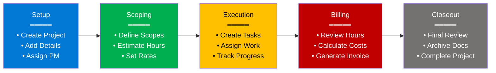

## Deployment Pipeline

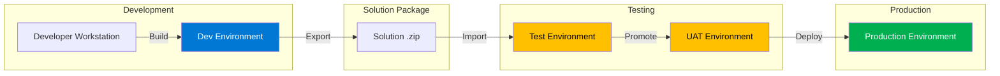

## Power BI Report Architecture

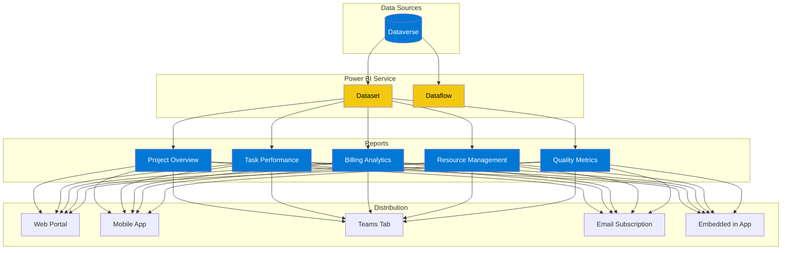

## Timeline - Implementation Phases

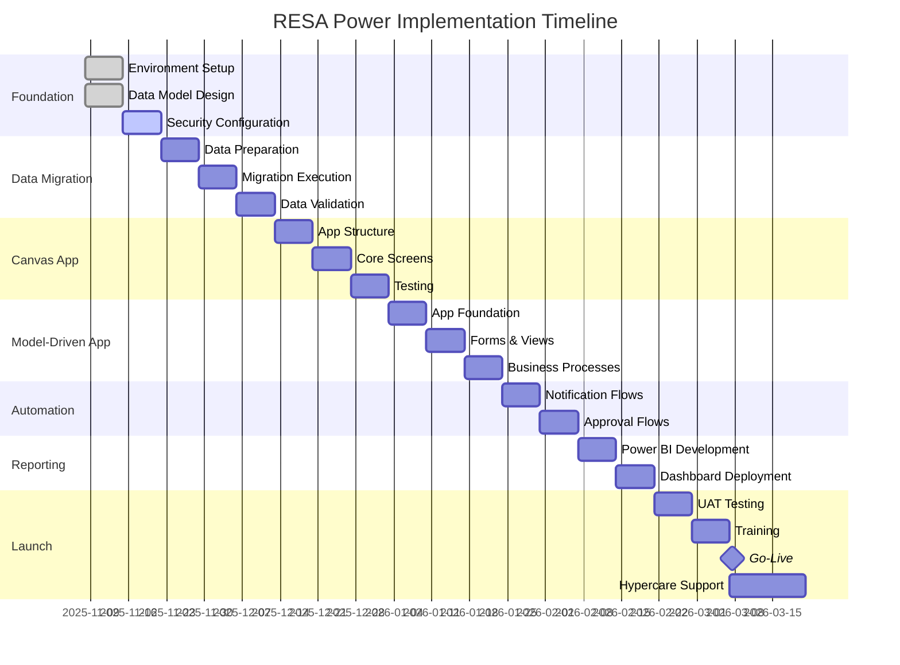

---

## How to Use These Diagrams

### Viewing Mermaid Diagrams

These diagrams use Mermaid syntax and can be viewed in:

1. **GitHub/GitLab**: Renders automatically in markdown files
2. **VS Code**: Install "Markdown Preview Mermaid Support" extension
3. **Online**: Copy to https://mermaid.live for interactive viewing
4. **Documentation sites**: Most modern doc platforms support Mermaid
5. **Export**: Use mermaid-cli to export as PNG/SVG

### Editing Diagrams

- Modify the text between \`\`\`mermaid and \`\`\` blocks
- Use Mermaid documentation: https://mermaid.js.org/
- Test changes at https://mermaid.live before committing

### Printing Diagrams

1. Open in mermaid.live
2. Click "Actions" → "Export PNG/SVG"
3. Use in presentations or documentation

---

*Document Version: 1.0*
*Created: November 7, 2025*
*For: RESA Power Architecture Documentation*
