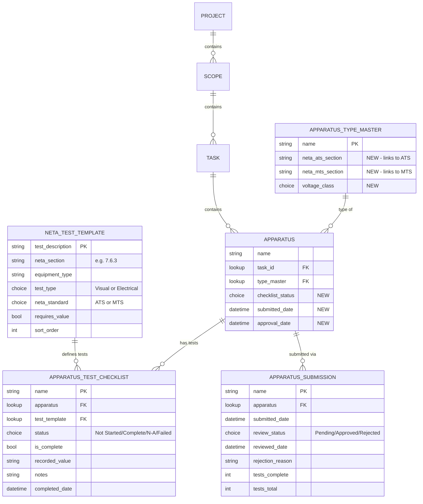
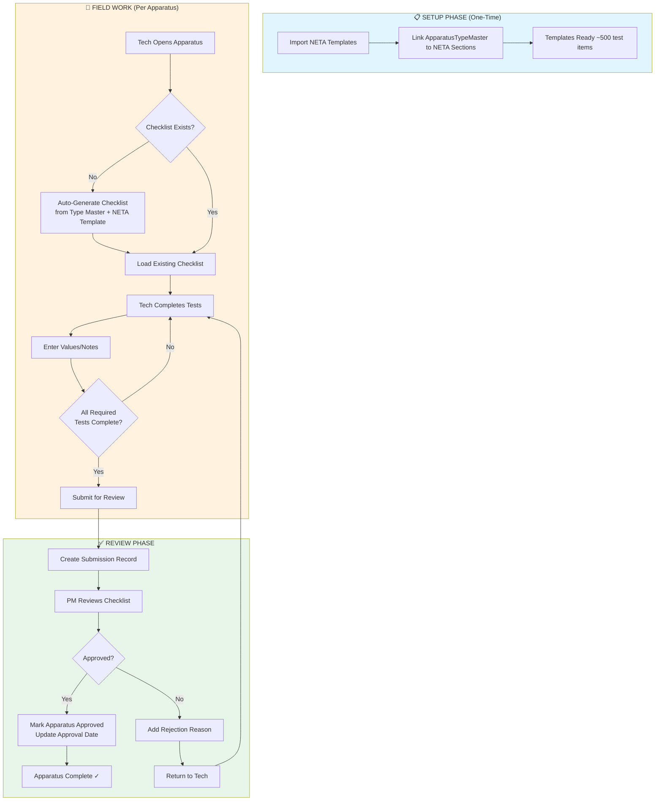
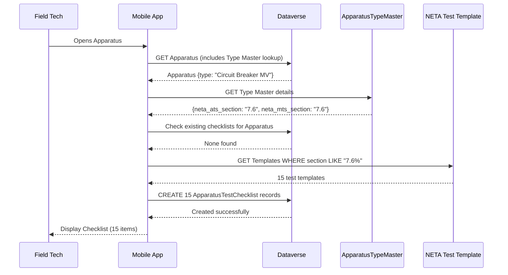
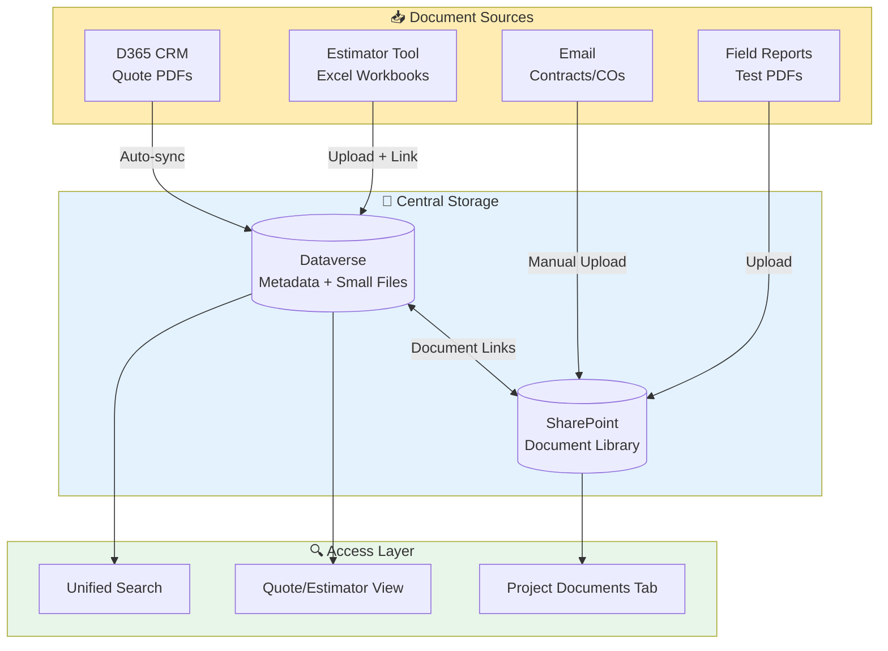
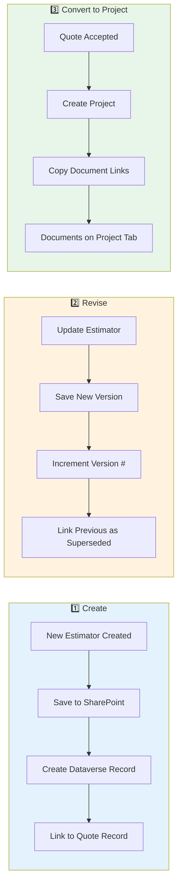

# Dataverse Build Requirements: NETA Checklist System
## Version 1.6.0.0 Schema Additions

**Date:** November 28, 2025  
**Author:** Jason Swenson / Claude  
**Status:** READY TO BUILD  
**Prerequisite:** v1.5.x deployed

---

## Overview

These additions enable NETA-based test checklists for field technicians with approval workflow.

**New Tables:** 3  
**Modified Tables:** 2  
**New Relationships:** 5  
**Estimated Build Time:** 2-3 hours  
**Build Status:** ✅ COMPLETE (Nov 28, 2025)

---

## System Architecture Diagram



---

## Workflow Flow Diagram



---

## Data Flow: Test Generation



---

## Gap Analysis

### ✅ Implemented (v1.6.0.0)
| Component | Status | Notes |
|-----------|--------|-------|
| NETA Test Template table | ✅ Created | Ready for data import |
| Apparatus Test Checklist table | ✅ Created | Lookups working |
| Apparatus Submission table | ✅ Created | Review workflow ready |
| Apparatus new fields | ✅ Added | Checklist status, dates |
| ApparatusTypeMaster NETA fields | ✅ Added | ATS/MTS section links |

### 🔄 Pending Implementation - NETA Checklists
| Component | Priority | Owner | Notes |
|-----------|----------|-------|-------|
| Import NETA Templates (~500 items) | HIGH | Script | `Import-NETATemplates.ps1` needed |
| Link ApparatusTypeMaster to NETA sections | HIGH | Manual/Script | Map equipment types |
| Auto-generate checklist flow | MEDIUM | Power Automate | When apparatus created |
| Submission notification flow | MEDIUM | Power Automate | Email PM on submit |
| Rollup fields (Tests Complete/Total) | LOW | Dataverse | Need calculated fields |
| Mobile UI for tech checklist | HIGH | Next.js App | Primary use case |

### ⚠️ Potential Gaps Identified - NETA
| Gap | Risk | Mitigation |
|-----|------|------------|
| No offline support yet | HIGH - Field work | PWA with local storage |
| No photo attachment on tests | MEDIUM | Add attachment field later |
| No signature capture | MEDIUM | Phase 2 feature |
| Bulk test completion | LOW | UI enhancement |

---

## 📁 CRITICAL GAP: Document Management System

### Problem Statement
**Current State:** Estimators (Excel) and Quotes (PDFs from CRM) are scattered across:
- Individual SharePoint folders
- Local drives
- Email attachments
- CRM (quotes only)
- Unknown locations (older documents)

**Impact:** 
- Cannot find historical estimators or quotes
- No version control on estimator revisions
- No central search capability
- Duplicate work when re-quoting similar projects

### Document Types to Manage

| Document Type | Format | Source | Current Location | Volume |
|---------------|--------|--------|------------------|--------|
| **Estimator Workbooks** | Excel (.xlsm) | Internal Tool | Scattered/Unknown | ~50-100/year |
| **Quote PDFs** | PDF | CRM Export | CRM + SharePoint | ~100-200/year |
| **Signed Contracts** | PDF | Client | Email/SharePoint | ~30-50/year |
| **Change Orders** | PDF/Excel | Internal | Email/SharePoint | ~20-40/year |
| **Test Reports** | PDF | Field Generated | SharePoint | ~500+/year |

### Proposed Solution Architecture



### Recommended Implementation

#### Option A: Dataverse File Columns (Simpler)
- Store files directly in Dataverse (up to 128MB per file)
- Pros: Single source, automatic versioning, easy queries
- Cons: Storage costs, 128MB limit

#### Option B: SharePoint + Dataverse Metadata (Recommended)
- SharePoint stores actual files in document library
- Dataverse stores metadata + links
- Pros: Unlimited storage, Office integration, existing SharePoint
- Cons: Two systems to manage

### Required Schema Changes

#### Modify: Quote Table
| Field | Type | Purpose |
|-------|------|---------|
| `cr950_estimator_file` | File/URL | Link to estimator workbook |
| `cr950_estimator_version` | Whole Number | Version counter |
| `cr950_quote_pdf` | File/URL | Link to quote PDF |
| `cr950_quote_source` | Choice | CRM / Manual / Import |
| `cr950_signed_contract` | File/URL | Link to signed contract |

#### New Table: Project Documents
| Field | Type | Purpose |
|-------|------|---------|
| `cr950_name` | Text | Document name |
| `cr950_project` | Lookup | FK to Project |
| `cr950_quote` | Lookup | FK to Quote (optional) |
| `cr950_document_type` | Choice | Estimator/Quote/Contract/CO/Report |
| `cr950_file` | File | Actual file or URL |
| `cr950_version` | Whole Number | Version number |
| `cr950_uploaded_by` | Lookup | User who uploaded |
| `cr950_uploaded_date` | DateTime | When uploaded |
| `cr950_description` | Text | Notes/description |
| `cr950_supersedes` | Lookup | Previous version (self-ref) |

### Document Workflow



### Implementation Priority

| Phase | Deliverable | Effort | Value |
|-------|-------------|--------|-------|
| **Phase 1** | Add file fields to Quote table | LOW | HIGH |
| **Phase 2** | Create Project Documents table | MEDIUM | HIGH |
| **Phase 3** | Build upload UI in web app | MEDIUM | HIGH |
| **Phase 4** | Migrate historical documents | HIGH | MEDIUM |
| **Phase 5** | Search/filter UI | MEDIUM | HIGH |

### Migration Strategy for Historical Documents
1. **Inventory** - Survey all known storage locations
2. **Categorize** - Match documents to projects/quotes where possible
3. **Bulk Upload** - Script to upload to SharePoint with metadata
4. **Link** - Create Dataverse records linking to files
5. **Validate** - Spot check critical projects

---

## NEW TABLE 1: NETA Test Template

### Table Configuration
| Property | Value |
|----------|-------|
| Display Name | NETA Test Template |
| Plural Name | NETA Test Templates |
| Schema Name | `cr950_netatesttemplate` |
| Table Type | Standard |
| Ownership | Organization |
| Primary Column | `cr950_test_description` |
| Enable Auditing | Yes |

### Fields

| Display Name | Schema Name | Type | Required | Description |
|--------------|-------------|------|----------|-------------|
| Test Description | `cr950_test_description` | Text (500) | Yes | Primary column - test instruction |
| NETA Section | `cr950_neta_section` | Text (20) | Yes | e.g., "7.6.3" |
| Equipment Type | `cr950_equipment_type` | Text (200) | Yes | e.g., "Circuit Breakers, Vacuum, MV" |
| Test Type | `cr950_test_type` | Choice | Yes | Visual/Mechanical, Electrical |
| Test Number | `cr950_test_number` | Text (10) | Yes | e.g., "A.1", "B.3" |
| NETA Standard | `cr950_neta_standard` | Choice | Yes | ATS, MTS |
| Is Optional | `cr950_is_optional` | Boolean | Yes | Default: No |
| Requires Value | `cr950_requires_value` | Boolean | Yes | Default: No |
| Sort Order | `cr950_sort_order` | Whole Number | No | Display sequence |
| Active | `cr950_active` | Boolean | Yes | Default: Yes |

### Choice: Test Type (`cr950_test_type`)
| Value | Label |
|-------|-------|
| 864340000 | Visual/Mechanical |
| 864340001 | Electrical |

### Choice: NETA Standard (`cr950_neta_standard`)
| Value | Label |
|-------|-------|
| 864340000 | ATS (Acceptance) |
| 864340001 | MTS (Maintenance) |

### Views
1. **Active Templates** (Default) - Filter: Active = Yes
2. **By NETA Section** - Group by NETA Section
3. **ATS Templates** - Filter: NETA Standard = ATS
4. **MTS Templates** - Filter: NETA Standard = MTS

### Business Rules
- NETA Section + Test Number + NETA Standard must be unique

---

## NEW TABLE 2: Apparatus Test Checklist

### Table Configuration
| Property | Value |
|----------|-------|
| Display Name | Apparatus Test Checklist |
| Plural Name | Apparatus Test Checklists |
| Schema Name | `cr950_apparatustestchecklist` |
| Table Type | Standard |
| Ownership | User/Team |
| Primary Column | `cr950_name` (auto-generated) |
| Enable Auditing | Yes |

### Fields

| Display Name | Schema Name | Type | Required | Description |
|--------------|-------------|------|----------|-------------|
| Name | `cr950_name` | Text (100) | Yes | Auto: "{Test Number} - {Apparatus}" |
| Apparatus | `cr950_apparatus` | Lookup | Yes | FK to Apparatus |
| Test Template | `cr950_test_template` | Lookup | Yes | FK to NETA Test Template |
| Status | `cr950_status` | Choice | Yes | Default: Not Started |
| Is Complete | `cr950_is_complete` | Boolean | Yes | Default: No |
| Recorded Value | `cr950_recorded_value` | Text (100) | No | Measured value |
| Notes | `cr950_notes` | Text (500) | No | Tech notes |
| Completed By | `cr950_completed_by` | Lookup | No | FK to User |
| Completed Date | `cr950_completed_date` | DateTime | No | When marked complete |

### Choice: Status (`cr950_status`)
| Value | Label |
|-------|-------|
| 864340000 | Not Started |
| 864340001 | Complete |
| 864340002 | N/A |
| 864340003 | Failed |

### Relationships
1. **Apparatus** (N:1) - Many checklist items per apparatus
2. **NETA Test Template** (N:1) - Many instances per template
3. **User** (N:1) - Who completed

### Views
1. **My Pending Tests** - Filter: Assigned to me, Status = Not Started
2. **By Apparatus** - Group by Apparatus
3. **Completed Today** - Filter: Completed Date = Today
4. **Failed Tests** - Filter: Status = Failed

### Business Rules
- When Status changes to Complete → Set Completed Date = Now(), Completed By = Current User
- Apparatus + Test Template must be unique

---

## NEW TABLE 3: Apparatus Submission

### Table Configuration
| Property | Value |
|----------|-------|
| Display Name | Apparatus Submission |
| Plural Name | Apparatus Submissions |
| Schema Name | `cr950_apparatussubmission` |
| Table Type | Standard |
| Ownership | User/Team |
| Primary Column | `cr950_name` (auto-generated) |
| Enable Auditing | Yes |

### Fields

| Display Name | Schema Name | Type | Required | Description |
|--------------|-------------|------|----------|-------------|
| Name | `cr950_name` | Text (100) | Yes | Auto: "Submission - {Apparatus}" |
| Apparatus | `cr950_apparatus` | Lookup | Yes | FK to Apparatus |
| Submitted By | `cr950_submitted_by` | Lookup | Yes | FK to User |
| Submitted Date | `cr950_submitted_date` | DateTime | Yes | When submitted |
| Review Status | `cr950_review_status` | Choice | Yes | Default: Pending |
| Reviewed By | `cr950_reviewed_by` | Lookup | No | FK to User |
| Reviewed Date | `cr950_reviewed_date` | DateTime | No | When reviewed |
| Rejection Reason | `cr950_rejection_reason` | Text (500) | No | If rejected |
| Tests Complete | `cr950_tests_complete` | Whole Number | No | Count at submission |
| Tests Total | `cr950_tests_total` | Whole Number | No | Total tests |

### Choice: Review Status (`cr950_review_status`)
| Value | Label |
|-------|-------|
| 864340000 | Pending |
| 864340001 | Approved |
| 864340002 | Rejected |
| 864340003 | Returned for Revision |

### Relationships
1. **Apparatus** (N:1) - Many submissions possible (if rejected)
2. **User (Submitted By)** (N:1)
3. **User (Reviewed By)** (N:1)

### Views
1. **Pending Review** (Default) - Filter: Review Status = Pending
2. **My Submissions** - Filter: Submitted By = Current User
3. **Approved This Week** - Filter: Approved, Reviewed Date in last 7 days
4. **Rejected** - Filter: Review Status = Rejected

### Business Rules
- When Review Status = Approved → Update Apparatus.Completion_Status = Complete
- When Review Status = Rejected → Require Rejection Reason

---

## MODIFIED TABLE: Apparatus

### New Fields to Add

| Display Name | Schema Name | Type | Required | Default | Description |
|--------------|-------------|------|----------|---------|-------------|
| Checklist Status | `cr950_checklist_status` | Choice | Yes | Not Started | Overall test status |
| Submitted Date | `cr950_submitted_date` | DateTime | No | - | When submitted for review |
| Approval Date | `cr950_approval_date` | DateTime | No | - | When approved |
| Tests Complete | `cr950_tests_complete` | Rollup | No | - | Count of complete checklist items |
| Tests Total | `cr950_tests_total` | Rollup | No | - | Count of all checklist items |
| Tests Percent | `cr950_tests_percent` | Calculated | No | - | tests_complete / tests_total |

### Choice: Checklist Status (`cr950_checklist_status`)
| Value | Label |
|-------|-------|
| 864340000 | Not Started |
| 864340001 | In Progress |
| 864340002 | Submitted |
| 864340003 | Approved |
| 864340004 | Rejected |

### Rollup Definitions

**Tests Complete:**
- Related Entity: Apparatus Test Checklist
- Aggregate: COUNT
- Filter: `cr950_is_complete = true`

**Tests Total:**
- Related Entity: Apparatus Test Checklist
- Aggregate: COUNT
- Filter: None

---

## MODIFIED TABLE: Apparatus Type Master

### New Fields to Add

| Display Name | Schema Name | Type | Required | Description |
|--------------|-------------|------|----------|-------------|
| NETA ATS Section | `cr950_neta_ats_section` | Text (20) | No | ATS section (e.g., "7.6.3") |
| NETA MTS Section | `cr950_neta_mts_section` | Text (20) | No | MTS section (e.g., "7.6.3") |
| Voltage Class | `cr950_voltage_class` | Choice | No | LV, MV, HV |
| Default ATS Hours | `cr950_default_ats_hours` | Decimal | No | Default labor for ATS |
| Default MTS Hours | `cr950_default_mts_hours` | Decimal | No | Default labor for MTS |

### Choice: Voltage Class (`cr950_voltage_class`)
| Value | Label |
|-------|-------|
| 864340000 | Low Voltage (< 1kV) |
| 864340001 | Medium Voltage (1-38kV) |
| 864340002 | High Voltage (> 38kV) |

---

## Power Automate Flows Required

### Flow 1: Create Checklist on Apparatus Create

**Trigger:** When Apparatus record is created

**Steps:**
1. Get Apparatus record (include Apparatus Type, Scope)
2. Get Scope → get `testing_standard` (ATS or MTS)
3. Get Apparatus Type Master → get NETA section based on standard
4. Query NETA Test Template where section matches and standard matches
5. For each template:
   - Create Apparatus Test Checklist record
   - Set Apparatus = trigger record
   - Set Test Template = current template
   - Set Status = Not Started

### Flow 2: Update Apparatus on Checklist Change

**Trigger:** When Apparatus Test Checklist is updated (Status field)

**Steps:**
1. Get parent Apparatus
2. Check if all checklist items are Complete/N/A
   - If any are Not Started → Set Apparatus.Checklist_Status = In Progress
   - If all complete → Set Apparatus.Checklist_Status = In Progress (ready to submit)
3. Update Tests Complete count (or rely on rollup)

### Flow 3: Process Submission Approval

**Trigger:** When Apparatus Submission Review Status = Approved

**Steps:**
1. Get related Apparatus
2. Set Apparatus.Checklist_Status = Approved
3. Set Apparatus.Approval_Date = Now()
4. Set Apparatus.Completion_Status = Complete (existing field)
5. Trigger revenue recognition (existing flow if any)

---

## Data Import Plan

### Step 1: Populate Apparatus Type Master
1. Review `neta_dataverse_templates.json`
2. Create/update ApparatusTypeMaster records
3. Set NETA section references

**Sample Mapping:**
| Equipment Type (JSON) | Apparatus Type Name | ATS Section | MTS Section |
|----------------------|---------------------|-------------|-------------|
| Switchgear and Switchboard Assemblies | Switchgear - LV | 7.1.1 | 7.1.1 |
| Switchgear and Switchboard Assemblies | Switchgear - MV | 7.1.1 | 7.1.1 |
| Circuit Breakers, Vacuum, MV | Circuit Breaker - Vacuum MV | 7.6.3 | 7.6.3 |
| Transformers, Liquid-Filled | Transformer - Oil Filled | 7.2.2 | 7.2.2 |

### Step 2: Import NETA Test Templates
1. Read `neta_dataverse_templates.json`
2. For each equipment section:
   - Determine if ATS or MTS based on source file
   - Create NETA Test Template record per test item

**Sample Data:**
```json
{
  "neta_section": "7.1.1",
  "test_type": "Visual/Mechanical",
  "test_number": "A.1",
  "description": "Compare equipment nameplate data with drawings.",
  "is_optional": false,
  "requires_value": false,
  "neta_standard": "ATS"
}
```

### Step 3: Verify with Test Apparatus
1. Create test apparatus with known type
2. Verify checklist items auto-created
3. Complete checklist, submit, approve
4. Verify completion status updated

---

## Security Configuration

### Role: Field Technician
| Table | Create | Read | Write | Delete |
|-------|--------|------|-------|--------|
| Apparatus Test Checklist | No | Own | Own | No |
| Apparatus Submission | Yes | Own | Own | No |
| NETA Test Template | No | All | No | No |

### Role: Job Lead / Supervisor  
| Table | Create | Read | Write | Delete |
|-------|--------|------|-------|--------|
| Apparatus Test Checklist | Yes | All | All | No |
| Apparatus Submission | Yes | All | All | No |
| NETA Test Template | No | All | No | No |

### Role: Administrator
| Table | Create | Read | Write | Delete |
|-------|--------|------|-------|--------|
| All Tables | Yes | All | All | Yes |

---

## Build Checklist

### Phase 1: Tables (Do First)
- [x] Create NETA Test Template table ✅ Nov 28, 2025
- [x] Create Apparatus Test Checklist table ✅ Nov 28, 2025
- [x] Create Apparatus Submission table ✅ Nov 28, 2025
- [x] Add new fields to Apparatus table ✅ Nov 28, 2025
- [x] Add new fields to Apparatus Type Master table ✅ Nov 28, 2025

### Phase 2: Choices (With Tables)
- [x] Create Test Type choice ✅ Nov 28, 2025
- [x] Create NETA Standard choice ✅ Nov 28, 2025
- [x] Create Checklist Status choice ✅ Nov 28, 2025
- [x] Create Review Status choice ✅ Nov 28, 2025
- [x] Create Voltage Class choice ✅ Nov 28, 2025

### Phase 3: Relationships
- [x] Apparatus Test Checklist → Apparatus (N:1) ✅ Nov 28, 2025
- [x] Apparatus Test Checklist → NETA Test Template (N:1) ✅ Nov 28, 2025
- [x] Apparatus Submission → Apparatus (N:1) ✅ Nov 28, 2025

### Phase 4: Views & Forms
- [ ] Create views for each new table
- [ ] Update Apparatus form to show checklist items
- [ ] Create submission review form

### Phase 5: Data Import
- [ ] Import NETA Test Templates (ATS) - ~350 items from 33 sections
- [ ] Import NETA Test Templates (MTS) - ~450 items from 32 sections
- [ ] Map ApparatusTypeMaster to NETA sections

### Phase 6: Automation
- [ ] Create Flow: Auto-create checklist on apparatus create
- [ ] Create Flow: Update apparatus on checklist change
- [ ] Create Flow: Process submission approval
- [ ] Create Flow: Notify PM on submission

### Phase 7: Testing
- [ ] Create test apparatus
- [ ] Verify checklist auto-created
- [ ] Complete and submit
- [ ] Approve and verify completion

---

## 📋 MASTER GAP/BACKLOG LIST

### Category: Document Management (NEW - High Priority)
| ID | Gap | Priority | Effort | Status | Notes |
|----|-----|----------|--------|--------|-------|
| DOC-001 | Estimator workbooks not centrally stored | CRITICAL | MEDIUM | 🔴 Not Started | Add file fields to Quote table |
| DOC-002 | Quote PDFs not linked to Dataverse | HIGH | LOW | 🔴 Not Started | Sync from CRM or manual upload |
| DOC-003 | No Project Documents table | HIGH | MEDIUM | 🔴 Not Started | Create table for all project docs |
| DOC-004 | Historical document migration | MEDIUM | HIGH | 🔴 Not Started | Survey + bulk upload script |
| DOC-005 | Document search UI | MEDIUM | MEDIUM | 🔴 Not Started | Next.js search interface |
| DOC-006 | Version control for estimators | HIGH | MEDIUM | 🔴 Not Started | Track revisions, supersedes |
| DOC-007 | Signed contracts not tracked | MEDIUM | LOW | 🔴 Not Started | Add to Quote or Project |

### Category: NETA Checklists (v1.6.0.0)
| ID | Gap | Priority | Effort | Status | Notes |
|----|-----|----------|--------|--------|-------|
| NETA-001 | Import NETA test templates | HIGH | MEDIUM | 🟡 Ready | Script + data ready |
| NETA-002 | Map ApparatusTypeMaster to sections | HIGH | LOW | 🔴 Not Started | Manual mapping needed |
| NETA-003 | Auto-generate checklist flow | MEDIUM | MEDIUM | 🔴 Not Started | Power Automate |
| NETA-004 | Mobile checklist UI | HIGH | HIGH | 🔴 Not Started | Next.js primary use case |
| NETA-005 | Offline support/PWA | HIGH | HIGH | 🔴 Not Started | Critical for field work |
| NETA-006 | Photo attachments on tests | MEDIUM | LOW | 🔴 Not Started | Add file field |
| NETA-007 | Signature capture | MEDIUM | MEDIUM | 🔴 Not Started | Phase 2 |
| NETA-008 | Submission notification flow | MEDIUM | LOW | 🔴 Not Started | Email PM |

### Category: CRM Integration
| ID | Gap | Priority | Effort | Status | Notes |
|----|-----|----------|--------|--------|-------|
| CRM-001 | Quote sync from D365 CRM | MEDIUM | HIGH | 🔴 Not Started | API or Dataflow |
| CRM-002 | Contact/Account sync | LOW | MEDIUM | 🔴 Not Started | Client table alignment |
| CRM-003 | Opportunity visibility | LOW | MEDIUM | 🔴 Not Started | Pre-quote tracking |

### Category: Reporting & Analytics
| ID | Gap | Priority | Effort | Status | Notes |
|----|-----|----------|--------|--------|-------|
| RPT-001 | Project financial dashboard | HIGH | MEDIUM | 🔴 Not Started | Power BI or Next.js |
| RPT-002 | Tech productivity metrics | MEDIUM | MEDIUM | 🔴 Not Started | Tests/day, completion rate |
| RPT-003 | Estimator accuracy tracking | MEDIUM | HIGH | 🔴 Not Started | Quoted vs actual comparison |
| RPT-004 | Quote win/loss analysis | LOW | MEDIUM | 🔴 Not Started | Needs CRM data |

### Category: User Experience
| ID | Gap | Priority | Effort | Status | Notes |
|----|-----|----------|--------|--------|-------|
| UX-001 | Mobile-first tech interface | HIGH | HIGH | 🟡 Started | Next.js scaffolded |
| UX-002 | PM dashboard | HIGH | MEDIUM | 🔴 Not Started | Project overview |
| UX-003 | Quick apparatus search | MEDIUM | LOW | 🔴 Not Started | By serial, tag, etc. |
| UX-004 | Bulk operations UI | LOW | MEDIUM | 🔴 Not Started | Mass update status |

### Category: Automation & Workflows
| ID | Gap | Priority | Effort | Status | Notes |
|----|-----|----------|--------|--------|-------|
| AUTO-001 | Revenue recognition on completion | MEDIUM | MEDIUM | 🟢 Exists | Verify working |
| AUTO-002 | Project status rollup | MEDIUM | MEDIUM | 🟢 Exists | Verify working |
| AUTO-003 | Overdue apparatus alerts | LOW | LOW | 🔴 Not Started | Email notifications |
| AUTO-004 | Weekly status emails | LOW | LOW | 🔴 Not Started | Auto-generated |

### Priority Matrix

```
                    HIGH EFFORT          LOW EFFORT
              ┌─────────────────────┬─────────────────────┐
   HIGH       │ NETA-004 Mobile UI  │ DOC-001 Estimator   │
   PRIORITY   │ NETA-005 Offline    │ DOC-002 Quote PDFs  │
              │ UX-001 Mobile       │ NETA-002 Mapping    │
              │ DOC-004 Migration   │ DOC-003 Docs Table  │
              ├─────────────────────┼─────────────────────┤
   LOW        │ CRM-001 Quote Sync  │ AUTO-003 Alerts     │
   PRIORITY   │ RPT-003 Accuracy    │ AUTO-004 Emails     │
              │ UX-004 Bulk Ops     │ NETA-006 Photos     │
              └─────────────────────┴─────────────────────┘
                    DO LATER              QUICK WINS
```

### Recommended Next Actions (Top 5)
1. ~~**DOC-001/DOC-003** - Add document fields to Quote, create Project Documents table~~ ✅ DONE
2. **NETA-001** - Run NETA template import script
3. **NETA-002** - Map ApparatusTypeMaster to NETA sections
4. **NETA-004** - Build mobile checklist UI in Next.js
5. **DOC-005** - Document search/upload interface

---

## Document Management Fields (Added Nov 28, 2025)

### Quote Table (cr950_quote) - 6 Fields Added ✅

| Field | LogicalName | Type | Description |
|-------|-------------|------|-------------|
| Estimator URL | `cr950_estimator_url` | URL (2000) | Link to Estimator Excel in SharePoint |
| Estimator Version | `cr950_estimator_version` | Text (20) | Version number (e.g., "v1.2") |
| Estimator Filename | `cr950_estimator_filename` | Text (255) | Original filename |
| Quote PDF URL | `cr950_quote_pdf_url` | URL (2000) | Link to generated quote PDF |
| Quote Source | `cr950_quote_source` | Text (50) | Origin (Estimator, CRM, Manual) |
| Signed Quote URL | `cr950_signed_quote_url` | URL (2000) | Link to customer-signed quote |

### Project Table (cr950_projects) - 3 Fields Added ✅

| Field | LogicalName | Type | Description |
|-------|-------------|------|-------------|
| Contract URL | `cr950_contract_url` | URL (2000) | Link to signed contract in SharePoint |
| Contract Number | `cr950_contract_number` | Text (50) | Client contract or PO number |
| SharePoint Folder URL | `cr950_sharepoint_folder_url` | URL (2000) | Link to project folder in SharePoint |

---

## Power Automate: Estimator to Project Flow

### Overview
Automated flow that creates project records when Estimator Excel files are saved to SharePoint.

### Components Created
1. **Office Script**: `Scripts/OfficeScripts/ParseEstimator.ts`
   - Extracts project header, scope sheets, apparatus data
   - Returns structured JSON for Power Automate

2. **Flow Template**: `Documentation/06_Implementation_Guides/POWER_AUTOMATE_ESTIMATOR_FLOW.md`
   - Complete step-by-step flow design
   - JSON schema for data parsing
   - Error handling guidance

3. **Folder Script**: `Scripts/PowerShell/SharePoint/Create-ProjectFolders.ps1`
   - Creates standardized project folder structure
   - Can be called from Power Automate or run directly

### Flow Summary
```
SharePoint Trigger → Parse Excel → Create Project
                                 → Create Scopes
                                 → Create Apparatus
                                 → Create Folder Structure
                                 → Update URLs
                                 → Move to Processed
                                 → Notify Team
```

### SharePoint Folder Structure
```
/Projects/{ProjectNumber}/
├── 01_Estimator/
├── 02_Quotes/
├── 03_Contracts/
├── 04_Field_Data/
│   ├── Photos/
│   ├── Test_Reports/
│   └── DTAX_Files/
├── 05_Datasheets/
├── 06_Reports/
│   ├── Draft/
│   └── Final/
├── 07_Invoicing/
└── 08_Correspondence/
```

---

## Version History

| Version | Date | Changes |
|---------|------|---------|
| 1.0 | 2025-11-28 | Initial specification |
| 1.1 | 2025-11-28 | Phases 1-3 COMPLETE - Tables, choices, relationships created via PowerShell API |
| 1.2 | 2025-11-28 | Added Document Management gap analysis and Master Backlog |
| 1.3 | 2025-11-28 | Added Document URL fields to Quote (6) and Project (3) tables |
| 1.4 | 2025-11-28 | Added Power Automate Estimator→Project flow template, Office Script, SharePoint folder script |
