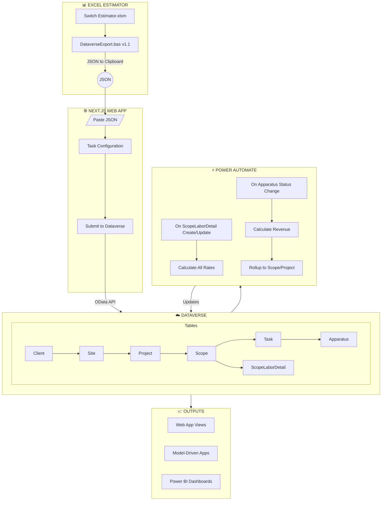
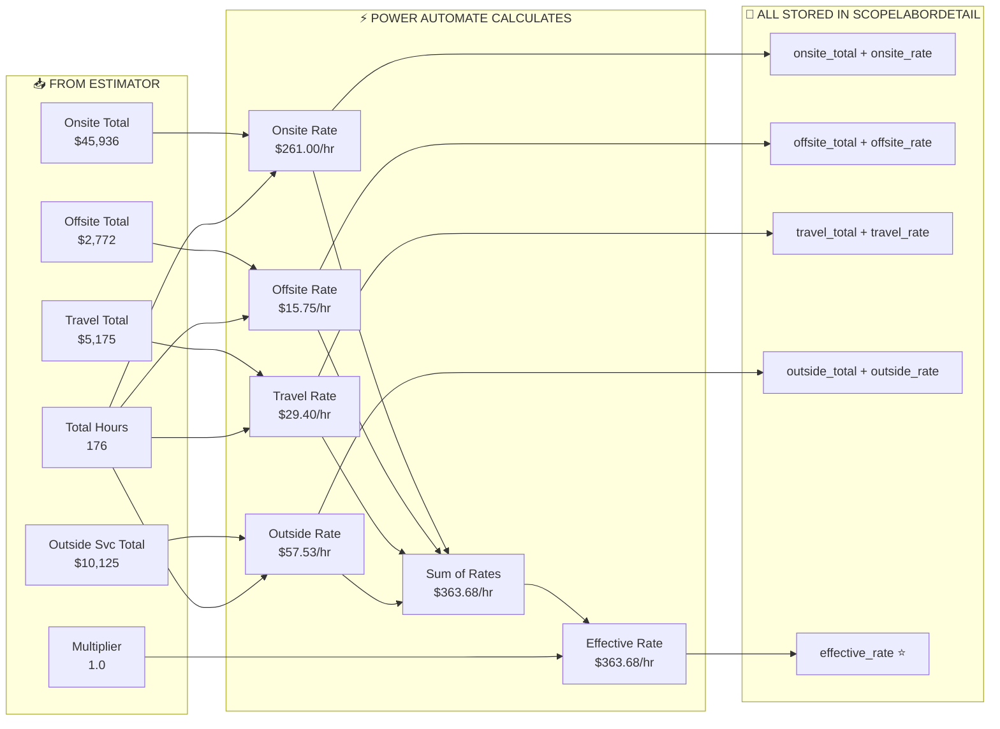
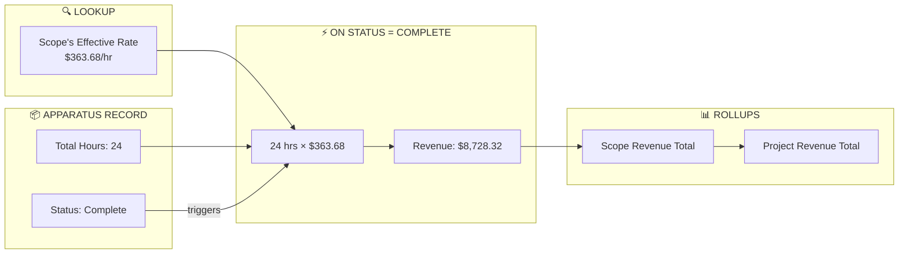
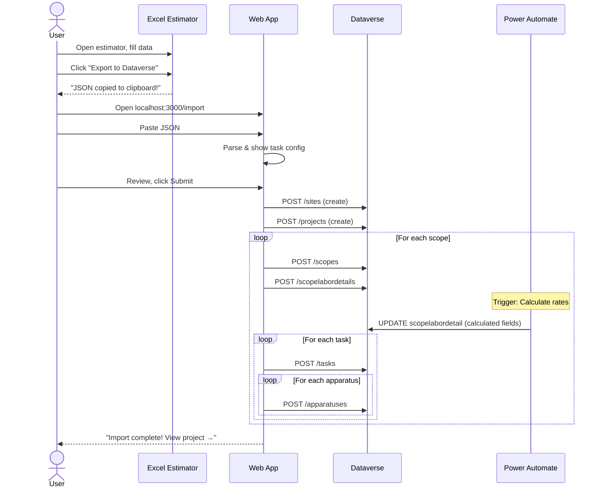

# RESA Power System Architecture v2.0

## Core Principles

1. **Anyone can do it** - No technical knowledge required to operate
2. **Optimal first** - Design for ideal, accommodate reality later
3. **No process lock-in** - System adapts to workflow, not the reverse
4. **Reliability** - Works every time, no babysitting

---

## Complete System Overview



---

## Data Model

```mermaid
erDiagram
    CLIENT ||--o{ SITE : has
    SITE ||--o{ PROJECT : contains
    PROJECT ||--o{ SCOPE : includes
    SCOPE ||--o{ TASK : defines
    SCOPE ||--|| SCOPE_LABOR : "has config"
    TASK ||--o{ APPARATUS : tests

    CLIENT {
        guid id PK
        string client_name
        string client_code
        string client_address
        string client_city
        string client_state
        string client_zip
        string client_phone
        string client_email
        boolean client_active
    }

    SITE {
        guid id PK
        lookup site_client FK
        string site_name
        string site_code
        string site_address
        string site_city
        string site_state
        string site_zip
        string site_contact_name
        string site_contact_phone
        boolean site_active
    }

    PROJECT {
        guid id PK
        lookup project_site FK
        lookup project_client FK
        string project_name
        string project_number
        string project_status
        datetime project_start_date
        datetime project_end_date
        currency project_contract_value
        string project_po_number
        boolean project_active
    }

    SCOPE {
        guid id PK
        lookup scope_project FK
        string scope_name
        string scope_number
        string scope_type
        string scope_status
        datetime scope_due_date
        currency scope_labor_total
        currency scope_revenue_total
        decimal scope_margin_percent
        boolean scope_active
    }

    TASK {
        guid id PK
        lookup task_scope FK
        string task_name
        string task_number
        string task_type
        string task_status
        int task_quantity
        currency task_unit_price
        currency task_total
        decimal task_labor_hours
        int task_sequence
        boolean task_active
    }

    APPARATUS {
        guid id PK
        lookup apparatus_task FK
        string apparatus_name
        string apparatus_type
        string apparatus_section
        int apparatus_quantity
        decimal apparatus_hours_per_unit
        decimal apparatus_total_hours
        string apparatus_manufacturer
        string apparatus_model
        string apparatus_serial
        string apparatus_location
        string apparatus_voltage
        string apparatus_status
        datetime apparatus_test_date
        string apparatus_result
        currency apparatus_revenue
        int apparatus_sequence
        int apparatus_row
        boolean apparatus_active
    }

    SCOPE_LABOR {
        guid id PK
        lookup scopelabor_scope FK
        decimal scopelabor_total_hours
        decimal scopelabor_multiplier
        currency scopelabor_quoted_amount
        currency scopelabor_onsite_total
        currency scopelabor_offsite_total
        currency scopelabor_travel_total
        currency scopelabor_outside_total
        currency scopelabor_onsite_rate
        currency scopelabor_offsite_rate
        currency scopelabor_travel_rate
        currency scopelabor_outside_rate
        currency scopelabor_sum_of_rates
        currency scopelabor_effective_rate
        currency scopelabor_not_adjusted
        currency scopelabor_adjusted
        string scopelabor_source
    }
```



---

## Revenue Calculation Flow



---

## Apparatus Revenue Recognition



---

## Import Flow (User Experience)



---

## Power Automate Flows

### Flow 1: Calculate Scope Labor Rates
**Trigger:** When ScopeLaborDetail is created or updated

```
IF scopelabor_total_hours > 0 THEN
    onsite_rate = onsite_total / total_hours
    offsite_rate = offsite_total / total_hours
    travel_rate = travel_total / total_hours
    outside_rate = outside_total / total_hours
    
    sum_of_rates = onsite_rate + offsite_rate + travel_rate + outside_rate
    effective_rate = sum_of_rates × multiplier
    
    not_adjusted = onsite_total + offsite_total + travel_total + outside_total
    adjusted = not_adjusted × multiplier
    
    UPDATE ScopeLaborDetail with all calculated values
END IF
```

### Flow 2: Calculate Apparatus Revenue
**Trigger:** When Apparatus status changes to "Complete"

```
GET parent Task
GET parent Scope  
GET ScopeLaborDetail for Scope

apparatus_revenue = apparatus_total_hours × effective_rate

UPDATE Apparatus with revenue

ROLLUP: Update Scope.scope_revenue_total
ROLLUP: Update Project totals (if needed)
```

---

## What Gets Stored vs Calculated

| Field | Stored from Import | Calculated by Power Automate |
|-------|-------------------|------------------------------|
| Onsite Total | ✅ | |
| Offsite Total | ✅ | |
| Travel Total | ✅ | |
| Outside Services Total | ✅ | |
| Total Hours | ✅ | |
| Multiplier | ✅ | |
| Quoted Amount | ✅ | |
| Onsite Rate | | ✅ |
| Offsite Rate | | ✅ |
| Travel Rate | | ✅ |
| Outside Services Rate | | ✅ |
| Sum of Rates | | ✅ |
| Effective Rate | | ✅ |
| Not Adjusted Total | | ✅ |
| Adjusted Total | | ✅ |
| Apparatus Revenue | | ✅ (on status change) |
| Scope Revenue Total | | ✅ (rollup) |

---

## Reporting Possibilities

Because all 4 categories are stored AND their rates calculated:

- **What's our blended rate per project?** → effective_rate
- **What % of cost is travel?** → travel_total / not_adjusted
- **Travel cost per hour across all projects?** → SUM(travel_total) / SUM(total_hours)
- **Which scopes have highest outside services %?** → outside_total / not_adjusted
- **Revenue recognized this month?** → SUM(apparatus_revenue) WHERE status = Complete AND test_date in range

---

*Last Updated: November 30, 2025*
