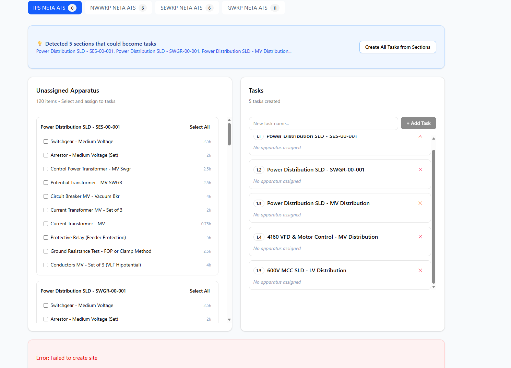
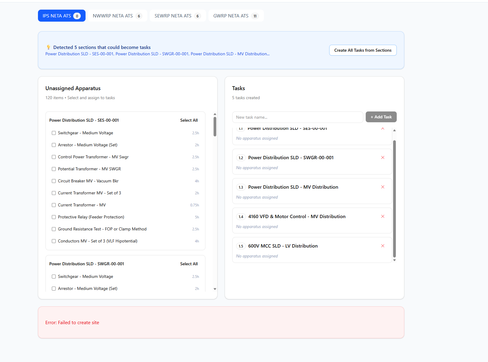

# VBA Automation Analysis & Dataverse Strategy

> **Analysis Date**: November 30, 2025  
> **Source**: Project Tracker VBA Modules  
> **Goal**: Replace Excel-based automation with Dataverse + Power Automate

---

## I. Current Excel Automation - What You Built

### The Workflow You Automated

```
                        CURRENT EXCEL WORKFLOW
┌─────────────────────────────────────────────────────────────────────────┐
│                                                                         │
│  1. ESTIMATOR (GSL - Switch Estimator.xlsm)                            │
│     └── Creates apparatus list with hours (ATS/MTS based)              │
│         └── Tasks shown in BOLD FONT (manual identification)           │
│                                                                         │
│  2. TASK_ENTRY SHEET                                                   │
│     ├── Col A: Scope name (e.g., "LAS16.PPM01")                       │
│     ├── Col B: NETA Standard (PPM, GDB, MV)                            │
│     ├── Col C: Task_ID (1.1.1 format - manually entered)              │
│     ├── Col D: Task Header (bold rows = section headers)              │
│     ├── Col E: Apparatus type                                          │
│     ├── Col F: Designation                                             │
│     ├── Col G: Drawing                                                 │
│     └── Col H: Apparatus Hours                                         │
│                                                                         │
│  3. BUILD_ALL MACRO                                                    │
│     ├── Reads Task_Entry row by row                                   │
│     ├── Detects PARENT rows (has Task text)                           │
│     ├── Detects CHILD rows (has Apparatus)                            │
│     ├── Clones Scope_Template sheet                                   │
│     ├── Applies template formatting (row 6=parent, row 7=child)       │
│     ├── Generates formulas for rollups                                │
│     └── Creates new scope sheet (e.g., "LAS16.PPM01")                │
│                                                                         │
│  4. POPULATE_ALL_TASKS                                                 │
│     ├── Loops through all scope sheets                                │
│     ├── Extracts apparatus items (3-digit Task_IDs)                   │
│     ├── Maps to All_Tasks columns (22 fields)                         │
│     └── Updates All_Tasks_Billing for financials                      │
│                                                                         │
│  5. POWERBI_EXPORT                                                     │
│     └── Creates PowerBI_Data table for reporting                      │
│                                                                         │
│  6. FIELD_WORKBOOK_EXPORT                                              │
│     └── Creates read-only field version (strips VBA)                  │
│                                                                         │
└─────────────────────────────────────────────────────────────────────────┘
```

### Key VBA Module Functions

| Module | Function | Purpose |
|--------|----------|---------|
| **Global_Constants** | All column mappings | Single source of truth for column positions |
| **Build_All** | BuildAll() | Creates scope sheets from Task_Entry |
| **Build_All** | FixExistingSheets() | Updates existing scope sheets |
| **PopulateAllTasks** | PopulateAllTasks_FromSheets() | Aggregates all scopes → All_Tasks |
| **modApparatusEntry** | ShowApparatusEntry() | Quick apparatus add UI |
| **PowerBIExport** | ExportToPowerBIData() | Creates PowerBI_Data with formulas |
| **Field_Workbook_Export** | Create_Field_Workbook_Final() | Export for field techs |
| **ThisWorkbook** | Date completion auto-fill | Auto/Manual mode for date handling |

### The Pain Points You Identified

1. **Manual Task ID Assignment** - Estimator doesn't generate Task_IDs
2. **Bold Font = Task** - Requires manual recognition of section headers
3. **Every Project = New Workbook** - Can't scale for multiple projects
4. **No Central Visibility** - Data trapped in individual Excel files
5. **Field Updates Don't Sync Back** - Field workbooks are one-way exports

---

## II. The Bold Font Problem

In your estimator, **BOLD text indicates a section/task header** (like "Main Switchgear", "PDU", "Grounding"). Normal text is apparatus items.

### Current Detection Logic (from Build_All.bas)
```vba
' PARENT row (Task text present in column D)
If Len(taskHdr) > 0 Then
    inGroup = True
    ' ... create parent row with 2-digit ID (1.1)
End If

' CHILD row (has apparatus info)
If inGroup And (Len(app & des & drw) > 0 Or Len(CStr(ahrs)) > 0) Then
    ' ... create child row with 3-digit ID (1.1.1)
End If
```

### The Issue
The estimator puts TASK names in one column and APPARATUS in another. But when you copy to Task_Entry, you need to:
1. Recognize bold = section header
2. Manually assign Task_IDs like 1.1, 1.2, 1.3
3. Keep apparatus items as children (1.1.1, 1.1.2, etc.)

---

## III. Proposed Dataverse Solution

### Option A: Modify Estimator → Export JSON

Add a VBA function to the estimator that exports to a structured JSON that Power Automate can consume:

```json
{
  "project": {
    "name": "LASNAP16",
    "client": "Garney Construction",
    "site": "Central Mesa",
    "standard": "ATS"
  },
  "scopes": [
    {
      "name": "LAS16.PPM01",
      "type": "PPM",
      "sections": [
        {
          "name": "Main Switchgear",
          "apparatus": [
            { "type": "Switchboard - Low Voltage", "hours": 4 },
            { "type": "Circuit Breaker LV - Draw-Out", "designation": "5000AF/4200AT", "hours": 4 },
            { "type": "Circuit Breaker LV - Draw-Out", "designation": "5000AF/4200AT", "hours": 4 }
          ]
        },
        {
          "name": "PDU",
          "apparatus": [
            { "type": "Circuit Breaker LV - Secondary Injection", "designation": "1600AF", "hours": 2 },
            { "type": "Transformer (Dry Type 500kVA & larger)", "hours": 4 }
          ]
        }
      ]
    }
  ]
}
```

**Power Automate then:**
1. Parses JSON
2. Creates/finds Client → Site → Project
3. Creates Scopes with auto-numbering (Scope 1, 2, 3...)
4. Creates Sections with auto-numbering (1.1, 1.2, 1.3...)
5. Creates Tasks with auto-numbering (1.1.1, 1.1.2...)

### Option B: Estimator → Dataverse Direct (via Power Automate HTTP)

Add a button to the estimator that:
1. Detects bold rows (sections) vs normal rows (apparatus)
2. Calls Power Automate via HTTP webhook
3. Power Automate handles all Dataverse creation

### Option C: Canvas App for Task Entry (Replace Excel entirely)

Build a Canvas App that:
1. Shows apparatus list from Dataverse (cr950_apparatustype)
2. Lets user select section → add apparatus
3. Auto-generates Task_IDs on save
4. No Excel needed for project creation

---

## IV. Dataverse Schema to Support This

### New Tables Needed

```
┌────────────────────────────────────────────────────────────────┐
│                    DATAVERSE SCHEMA                            │
├────────────────────────────────────────────────────────────────┤
│                                                                │
│  cr950_apparatuscategory (MASTER)                              │
│  ├── cr950_name: "Circuit Breakers - Primary"                 │
│  └── cr950_displayorder: 1                                     │
│                                                                │
│  cr950_apparatustype (MASTER)                                  │
│  ├── cr950_name: "Circuit Breaker LV - Draw-Out"              │
│  ├── cr950_atshours: 4.0                                       │
│  ├── cr950_mtshours: 3.0                                       │
│  └── cr950_category: → cr950_apparatuscategory                │
│                                                                │
│  cr950_section (NEW - Between Scope and Task)                  │
│  ├── cr950_name: "Main Switchgear"                            │
│  ├── cr950_sectionnumber: 1 (auto-number within scope)        │
│  ├── cr950_scope: → cr950_projectscope                        │
│  └── cr950_sectionid: "1.1" (calculated: ScopeSeq.SectionNum) │
│                                                                │
│  cr950_projecttask (RENAME cr950_apparatus)                    │
│  ├── cr950_taskid: "1.1.1" (auto-calculated)                  │
│  ├── cr950_tasknumber: 1 (auto-number within section)         │
│  ├── cr950_section: → cr950_section                           │
│  ├── cr950_apparatustype: → cr950_apparatustype               │
│  ├── cr950_designation: "5000AF/4200AT"                        │
│  ├── cr950_quotedhours: 4.0 (from type, editable)             │
│  ├── cr950_remaininghours: 4.0 (calculated)                   │
│  ├── cr950_actualhours: 0.0                                    │
│  ├── cr950_status: Choice (Not Started, In Progress, etc.)    │
│  └── ... (all other tracking fields)                          │
│                                                                │
└────────────────────────────────────────────────────────────────┘
```

### Auto-Numbering Strategy

**Option 1: Plugin (C#)**
```csharp
// On Task Create
var section = GetRelatedSection(task.cr950_section);
var scope = GetRelatedScope(section.cr950_scope);

var scopeSeq = scope.cr950_sequencenumber;  // 1, 2, 3...
var sectionNum = section.cr950_sectionnumber;  // 1, 2, 3...
var taskNum = GetNextTaskNumber(section.Id);  // 1, 2, 3...

task.cr950_taskid = $"{scopeSeq}.{sectionNum}.{taskNum}";
```

**Option 2: Power Automate (Low-code)**
```
Trigger: When a row is added (cr950_projecttask)

Get parent Section
Get parent Scope  
Count existing tasks in section + 1
Set cr950_taskid = Scope.Seq + "." + Section.Num + "." + TaskNum
```

---

## V. Migration Path

### Phase 1: Master Data (Week 1)
1. ✅ Create cr950_apparatuscategory table
2. ✅ Create cr950_apparatustype table with hours
3. ✅ Import 34 apparatus types from Apparatus_List_w_Hours
4. ✅ Import 19 categories

### Phase 2: Schema Updates (Week 1-2)
1. Create cr950_section table
2. Modify cr950_apparatus → cr950_projecttask with new fields
3. Set up relationships
4. Create auto-numbering flow

### Phase 3: Estimator Integration (Week 2-3)
**Choose one:**
- **Option A**: Add JSON Export button to estimator
- **Option B**: Add "Send to Dataverse" button to estimator
- **Option C**: Build Canvas App to replace estimator input

### Phase 4: Model-Driven App (Week 3-4)
1. Add Section entity to navigation
2. Create Task entry views with hours tracking
3. Build rollup calculations (Section → Scope → Project)
4. Add status/completion tracking

### Phase 5: Field Access (Week 4+)
1. Canvas App for field technicians
2. Hours entry with auto-completion
3. Sync to Dataverse in real-time

---

## VI. Estimator JSON Export VBA (Proposed)

Add this to the estimator workbook:

```vba
'================================================================================
' MODULE: ExportToDataverse
' PURPOSE: Convert estimator data to JSON for Power Automate import
'================================================================================

Public Sub ExportToJSON()
    Dim ws As Worksheet
    Dim lastRow As Long
    Dim r As Long
    Dim json As String
    Dim currentSection As String
    Dim sectionNum As Long
    Dim taskNum As Long
    Dim inSection As Boolean
    
    Set ws = ActiveSheet
    lastRow = ws.Cells(ws.Rows.Count, 1).End(xlUp).Row
    
    ' Start JSON
    json = "{"
    json = json & """project"": {"
    json = json & """name"": """ & GetProjectName() & ""","
    json = json & """standard"": """ & GetStandard() & """"
    json = json & "},"
    json = json & """scopes"": [{"
    json = json & """name"": """ & ws.Range("ScopeName").Value & ""","
    json = json & """sections"": ["
    
    sectionNum = 0
    taskNum = 0
    
    For r = 2 To lastRow  ' Adjust start row
        Dim cellValue As String
        Dim isBold As Boolean
        
        cellValue = Trim(ws.Cells(r, 1).Value)  ' Adjust column
        isBold = ws.Cells(r, 1).Font.Bold
        
        If Len(cellValue) > 0 Then
            If isBold Then
                ' Close previous section if exists
                If inSection Then
                    json = Left(json, Len(json) - 1)  ' Remove trailing comma
                    json = json & "]},"
                End If
                
                ' New section
                sectionNum = sectionNum + 1
                taskNum = 0
                inSection = True
                currentSection = cellValue
                
                json = json & "{""name"": """ & currentSection & """, ""apparatus"": ["
            Else
                ' Apparatus item
                If inSection Then
                    taskNum = taskNum + 1
                    json = json & "{""type"": """ & cellValue & ""","
                    json = json & """designation"": """ & GetDesignation(ws, r) & ""","
                    json = json & """hours"": " & GetHours(ws, r) & "},"
                End If
            End If
        End If
    Next r
    
    ' Close JSON
    json = Left(json, Len(json) - 1)  ' Remove trailing comma
    json = json & "]}]}]}"
    
    ' Write to file
    Dim filePath As String
    filePath = Application.GetSaveAsFilename("project_import.json", "JSON Files (*.json), *.json")
    
    If filePath <> "False" Then
        Dim fso As Object, f As Object
        Set fso = CreateObject("Scripting.FileSystemObject")
        Set f = fso.CreateTextFile(filePath, True)
        f.Write json
        f.Close
        
        MsgBox "JSON exported to: " & filePath & vbCrLf & vbCrLf & _
               "Next: Run the Power Automate import flow", vbInformation
    End If
End Sub
```

---

## VII. Recommended Next Steps

1. **Immediate**: Create the two master tables (ApparatusCategory, ApparatusType)
2. **This Week**: Import the 34 apparatus types with hours
3. **Decision Point**: Choose estimator integration approach (A, B, or C)
4. **Implementation**: Build the Section table and auto-numbering
5. **Testing**: Import one scope from LASNAP16 data

**Which approach appeals to you most?**
- **A** = Keep Excel estimator, add JSON export → Power Automate
- **B** = Keep Excel estimator, add direct HTTP call to Power Automate
- **C** = Build Canvas App to replace manual entry entirely
