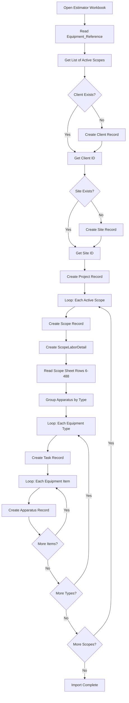

# Estimator to Dataverse Field Mapping

**Version:** 1.0  
**Created:** November 23, 2025  
**Author:** VS Code Claude  
**Purpose:** Map Excel Estimator workbook data to Dataverse tables for automation

---

## 📋 Executive Summary

This document maps fields from the RESA Power Estimator Excel workbook to the Dataverse data model. The Estimator is used to generate quotes for electrical testing projects. When a quote is won, this data needs to flow into Dataverse to create:

- Client & Site records (if new)
- Project record
- Scope records (1-20 per project)
- Task records (organized by apparatus type)
- Apparatus records (individual equipment items)
- ScopeLaborDetail records (financial configuration)

---

## 📐 Estimator Workbook Architecture

### Sheet Structure

| VBA Code Name | User-Visible Name | Purpose |
|---------------|-------------------|---------|
| `Equipment_Reference` | Equipment Reference | Master equipment list, rates, totals |
| `Scope1` - `Scope20` | (User-named per scope) | Individual scope estimating sheets |

### Key Cell Locations (Scope Sheets)

| Cell/Range | Content | Maps To |
|------------|---------|---------|
| `A1` | Project Name | `cr950_projectses.cr950_name` |
| `C4` | Job Type (MTS/ATS) | `cr950_projectscopeses.cr950_scopetype` |
| `E6:E488` | Equipment Name (Scope of Work) | `cr950_apparatus.cr950_name` |
| `C6:C488` | Quantity | Used for Apparatus count |
| `D6:D488` | Hours per Unit (XLOOKUP formula) | Base hours reference |
| `I6:I488` | Base Hours (calculated) | `cr950_apparatus.cr950_apparatus_hours` |
| `J6:J488` | Total Hours (Qty × Hours) | Aggregated |
| `J3` | Total Onsite Hours (scope) | `cr950_scopelabordetails.cr950_onsite_labor_hours` |
| `M4` | Scope Multiplier | Revenue multiplier |
| `P3` | Grand Total (revenue) | `cr950_scopelabordetails.cr950_total_scope_revenue` |
| `P4` | Adjusted Total | With margin/markup |
| `R3` | Total Onsite Hours | Cross-check |
| `S3:U6` | Scheduling Calculator | Crew planning |

### Financial Sections (Scope Sheets)

| Section | Rows | Purpose | Maps To |
|---------|------|---------|---------|
| Billable Adders | 6-13 | Per diem, mobilization, etc. | `cr950_scopelabordetails` |
| Additional Items | 16-18 | Extra charges | `cr950_scopelabordetails` |
| Expenses | 21-25 | Travel, materials | `cr950_scopelabordetails` |
| Additional Expenses | 28-32 | Other costs | `cr950_scopelabordetails` |

### Equipment Reference Sheet Locations

| Cell/Range | Content | Purpose |
|------------|---------|---------|
| `L4:L23` | Scope Sheet Names | Links to scope sheets |
| `M3:M23` | Scope Totals | Grand total summaries |
| `B3:F486` | tblEquipment | Equipment master list |
| `H3:H486` | Total Hours Used | Sum across all scopes |
| `R3:R8` | Total Onsite Hours | Overall hours by category |

---

## 🗄️ Dataverse Table Mappings

### 1. Projects Table (`cr950_projectses`)

| Estimator Source | Dataverse Field | Logic |
|------------------|-----------------|-------|
| Sheet A1 (Project Name) | `cr950_name` | Direct |
| Workbook filename | `cr950_project_number` | Extract (e.g., "434469") |
| Client selection | `cr950_clientid` | Lookup or create |
| Site selection | `cr950_siteid` | Lookup or create |
| `Equipment_Reference!M3` | -- | Total across all scopes |
| User input | `cr950_startdate` | User provides |
| User input | `cr950_targetcompletion` | User provides |
| BusinessUnit | `owningbusinessunit` | Default or selected |

### 2. Project Scopes Table (`cr950_projectscopeses`)

| Estimator Source | Dataverse Field | Logic |
|------------------|-----------------|-------|
| Scope sheet name | `cr950_name` | e.g., "MCC-1 Testing" |
| Parent project | `cr950_projectid` | Lookup to project |
| Cell C4 (MTS/ATS) | `cr950_scopetype` | Choice field |
| Cell P3 | `cr950_quoted_amount` | Scope grand total |
| Cell J3 | `cr950_total_estimated_hours` | Total hours |
| Cell M4 | `cr950_multiplier` | Scope multiplier |

**Logic:** One scope record per non-empty Scope1-Scope20 sheet

### 3. Tasks Table (`cr950_taskses`)

| Estimator Source | Dataverse Field | Logic |
|------------------|-----------------|-------|
| Equipment category | `cr950_name` | Group by equipment type |
| Parent scope | `cr950_projectscopeid` | Lookup to scope |
| Derived | `cr950_tasktype` | Based on equipment category |

**Logic:** Tasks are groupings of apparatus by type. For example:
- "Transformers" task contains transformer apparatus
- "Switchgear" task contains breaker/switch apparatus

### 4. Apparatus Table (`cr950_apparatus`)

| Estimator Source | Dataverse Field | Logic |
|------------------|-----------------|-------|
| Cell E (Scope of Work) | `cr950_name` | Equipment designation |
| Parent task | `cr950_taskid` | Lookup to task |
| Cell I (Hours) | `cr950_apparatus_hours` | Hours per unit |
| Cell C (Qty) | -- | Create N records (one per qty) |
| tblEquipment lookup | `cr950_apparatustypemasterid` | Match to master |

**Logic:** If Quantity = 3, create 3 apparatus records with:
- `cr950_name`: "Transformer 1", "Transformer 2", "Transformer 3"
- Or use original name + suffix

### 5. Scope Labor Detail (`cr950_scopelabordetails`)

| Estimator Source | Dataverse Field | Logic |
|------------------|-----------------|-------|
| Cell J3 | `cr950_onsite_labor_hours` | Total hours |
| Calculate | `cr950_onsite_labor_rate` | Rate from billing table |
| Rows 6-13 (P) | Various adders | Sum billable adders |
| Rows 21-25 (P) | `cr950_travel_expenses` | Expenses total |
| Cell P3 | `cr950_total_scope_revenue` | Grand total |

---

## 🔄 Import Workflow



---

## 📊 Data Extraction Logic

### Identifying Active Scope Sheets

```python
# Pseudocode for identifying active scopes
active_scopes = []
for i in range(1, 21):  # Scope1 to Scope20
    scope_sheet = workbook[f"Scope{i}"]
    total_hours = scope_sheet["J3"].value
    if total_hours and total_hours > 0:
        active_scopes.append({
            "sheet_name": scope_sheet.title,
            "code_name": f"Scope{i}",
            "total_hours": total_hours,
            "job_type": scope_sheet["C4"].value,
            "grand_total": scope_sheet["P3"].value
        })
```

### Extracting Equipment from Scope Sheet

```python
# Pseudocode for reading equipment
equipment_list = []
for row in range(6, 489):  # Rows 6-488
    qty = scope_sheet[f"C{row}"].value
    name = scope_sheet[f"E{row}"].value
    hours = scope_sheet[f"I{row}"].value
    
    if name and qty and qty > 0:
        equipment_list.append({
            "name": name,
            "quantity": int(qty),
            "hours_per_unit": hours,
            "total_hours": scope_sheet[f"J{row}"].value
        })
```

### Matching to Apparatus Type Master

```python
# Match equipment name to Apparatus Type Master
def match_apparatus_type(equipment_name: str, apparatus_types: list) -> str:
    """
    Match Estimator equipment name to Dataverse ApparatusTypeMaster
    Returns: GUID of matching apparatus type or None
    """
    for apt in apparatus_types:
        if equipment_name.lower() in apt["name"].lower():
            return apt["id"]
    return None  # Will need manual mapping
```

---

## ⚡ Automation Approaches

### Option 1: VBA Button in Excel (Recommended)

**Pros:**
- Users stay in familiar Excel environment
- Direct access to all workbook data
- No external dependencies

**Cons:**
- Requires VBA HTTP client (WinHTTP)
- Authentication complexity
- Version control challenges

**Implementation:**
1. Add "Export to Dataverse" button to Equipment_Reference sheet
2. VBA module calls Dataverse Web API
3. Uses OAuth2 authentication

### Option 2: Python Script

**Pros:**
- Full openpyxl access to Excel
- Better error handling
- Can run from command line or scheduled

**Cons:**
- Requires Python environment
- Separate from Excel workflow

**Implementation:**
1. Python reads `.xlsm` file with openpyxl
2. Extracts data using cell mapping above
3. Calls Dataverse via MSAL authentication

### Option 3: Power Automate with Excel Connector

**Pros:**
- Native Power Platform integration
- No code deployment

**Cons:**
- Excel Online required
- Complex flow for nested data
- Performance concerns with large workbooks

### Option 4: Windows-MCP Automation

**Pros:**
- Can automate existing workflows
- Good for testing/validation

**Cons:**
- Requires Claude Desktop
- Not suitable for production

---

## 🧪 Validation Rules

### Pre-Import Checks

| Check | Rule | Action if Failed |
|-------|------|------------------|
| Project Number | Must be unique | Prompt for update |
| Client Name | If new, validate format | Create or select existing |
| Site Name | Must have client | Create or select existing |
| Scope Count | 1-20 active scopes | Proceed |
| Equipment Hours | > 0 | Skip if zero |

### Post-Import Validation

| Check | Rule | Action |
|-------|------|--------|
| Scope Total Hours | Sum of apparatus hours = scope J3 | Log warning if mismatch |
| Financial Totals | Sum of scopes = project total | Log warning if mismatch |
| Apparatus Count | Matches sum of quantities | Verify count |

---

## 📁 File References

### VBA Modules Analyzed

| File | Purpose | Relevance |
|------|---------|-----------|
| `clsScopeSheet.cls` | Scope sheet event handling, formula protection | Cell locations, formula patterns |
| `RefreshSheetNamesTotals.bas` | Gets scope sheet names, updates totals | Sheet enumeration logic |
| `SumIfsbySheet.bas` | Sums equipment hours across scopes | Aggregation logic |
| `UpdateTotalOnsiteHours_.bas` | Calculates total hours | Hours calculation |
| `FormulaPersistance.bas` | Restores formulas if overwritten | Formula definitions |

### Estimator Files

| File | Type |
|------|------|
| `Estimator PHX 112125 (Master).xlsm` | Template (current) |
| `434469 REV6 - Garney Central Mesa Reuse.xlsm` | Example with data |

---

## 📝 Next Steps

1. **Choose Automation Approach** - VBA or Python recommended
2. **Create Apparatus Type Master Mapping** - Match Estimator equipment names to Dataverse
3. **Build Prototype** - Start with single scope, expand
4. **Test with Example Data** - Use Garney estimator file
5. **Add UI/UX** - Button, progress bar, validation feedback

---

## 🔗 Related Documentation

- [PROJECT_OVERVIEW.md](../../PROJECT_OVERVIEW.md) - Data model reference
- [SESSION_SUMMARY_20251123_ROLLUP_COMPLETION.md](../03_Progress_Tracking/SESSION_SUMMARY_20251123_ROLLUP_COMPLETION.md) - MCP server details
- [TABLE_NAMES_REFERENCE.md] - Dataverse table naming conventions

