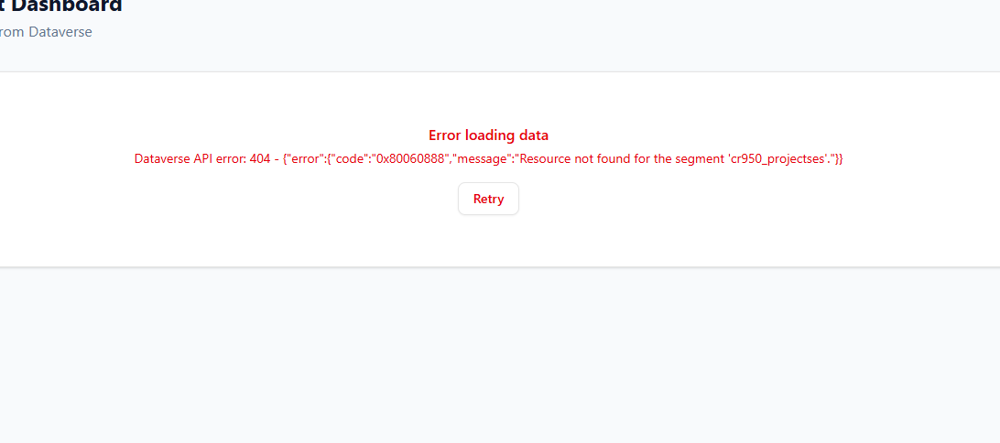
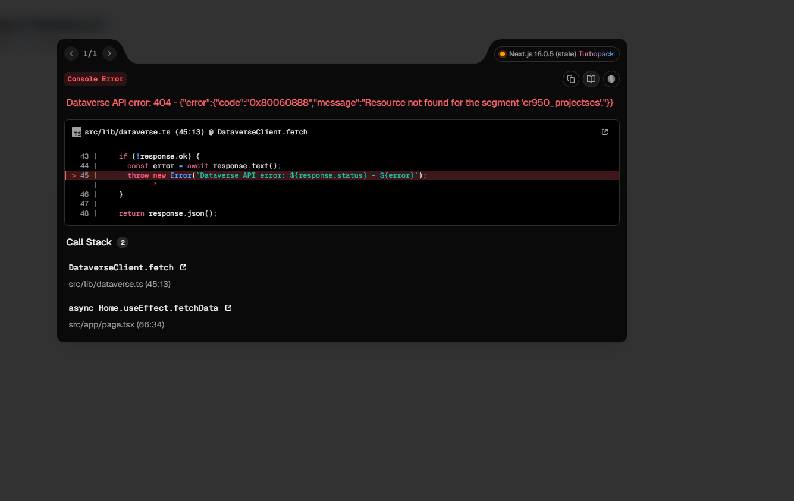
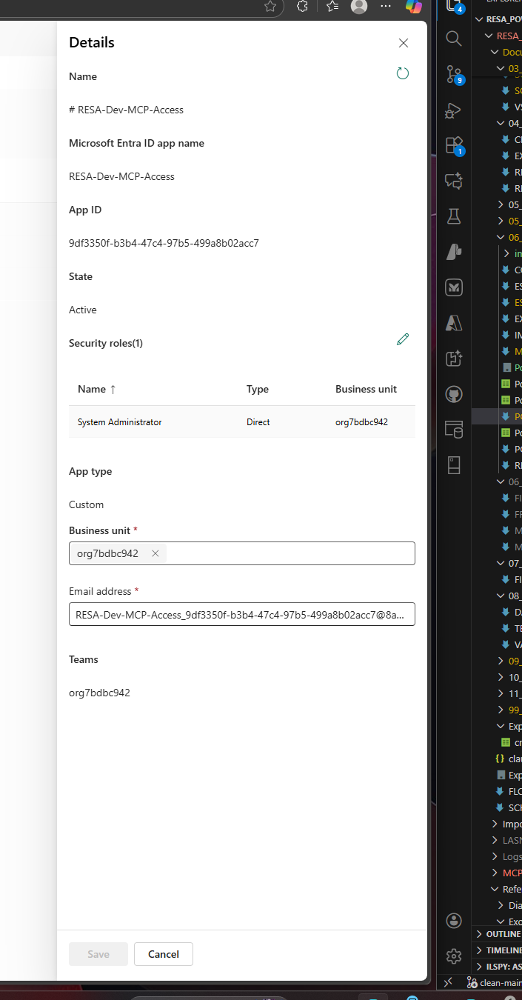
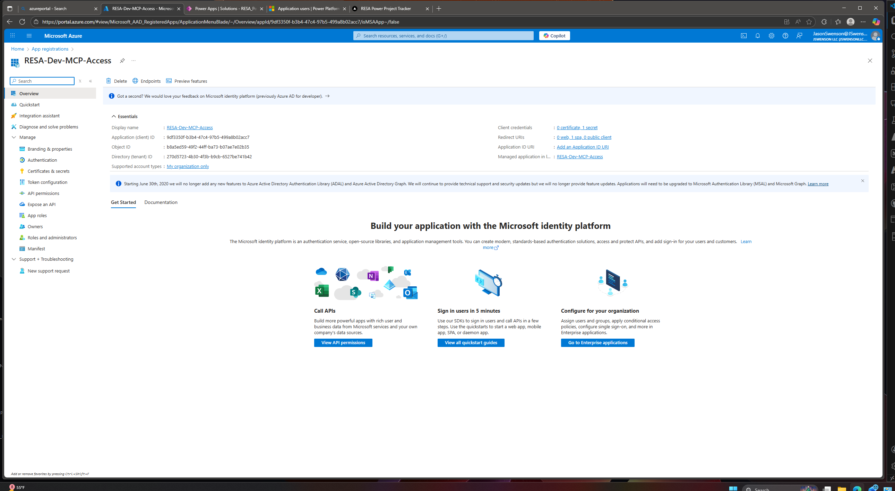

# PowerDB Integration Discussion Summary
## Session Context: November 30 - December 2, 2025

---

## 📋 Executive Summary

During recent sessions, we explored the feasibility of integrating RESA Power's **PowerDB** test form database with the Dataverse project management solution. Using the SQL Server MCP tools, we successfully queried the local PowerDB database and discovered key schema insights that enable future integration.

**Key Outcome:** We can link Dataverse records to PowerDB via the `JobNumber` field (human-readable, shared identifier) rather than needing complex GUID mapping.

---

## 🎯 Business Context

### The Problem
PowerDB is the industry-standard software for electrical testing datasheets. RESA technicians:
1. Create jobs manually in PowerDB
2. Re-enter customer, site, and equipment data (already exists in Estimator/Dataverse)
3. This happens 3-4 times across different systems
4. **Data entry and datasheets are the biggest bottleneck**

### The Vision
- **Eliminate duplicate data entry** - When a project is created in Dataverse, auto-create the job in PowerDB
- **Pre-populate test forms** - Apparatus data from estimator flows directly to PowerDB assets
- **Sync test results back** - Completion status and deficiencies flow back to Dataverse

---

## 🔍 Technical Discovery

### PowerDB Architecture
- **Database Type:** SQL Server (`.mdf` files)
- **Sync Model:** Local copies per technician, manual sync to master
- **Master Server:** `resa.sync.powerdb.us:45037` (read-only access confirmed)
- **Region Database:** `prod_rgn_Services-Phoenix` (our test database)

### Connection String Used
```
Server=resa.sync.powerdb.us,45037;Database=prod_rgn_Services-Phoenix;User Id=resaphx;Password=[redacted];TrustServerCertificate=True
```

---

## 🗄️ PowerDB Schema Discovery

### Key Tables Identified

| PowerDB Table | Purpose | Key Columns | Maps To Dataverse |
|---------------|---------|-------------|-------------------|
| **PdbJob** | Jobs/Projects | `JobGUID`, `JobNumber`, `CustAddrGUID`, `EqmtAddrGUID` | `cr950_projects` |
| **Results_Header** | Assets/Test Results | `ResultsGUID`, `JobGUID`, `SerialNum`, `EquipmentLocation`, `DeviceGuid` | `cr950_apparatus` |
| **Device_Type** | Equipment/Form Types | `DeviceGUID`, `DeviceName`, `Manufacturer`, `Family` | PM Type / NETA Template |
| **PdbAddrInfo** | Addresses (Customer/Site) | `AddrGUID`, `AddrLn1`, `City`, `State` | `cr950_clients`, `cr950_sites` |

### Table Relationships Discovered

```
┌─────────────────┐         ┌─────────────────┐
│ PdbJob          │         │ Results_Header  │
│ (Jobs)          │◄────────│ (Assets)        │
├─────────────────┤  JobGUID├─────────────────┤
│ JobGUID (PK)    │         │ ResultsGUID (PK)│
│ JobNumber       │         │ JobGUID (FK)    │
│ CustAddrGUID    │         │ DeviceGuid (FK) │
│ EqmtAddrGUID    │         │ SerialNum       │
│ Description     │         │ EquipmentLocation│
└─────────────────┘         └────────┬────────┘
        │                            │
        │ AddrGUID                   │ DeviceGuid
        ▼                            ▼
┌─────────────────┐         ┌─────────────────┐
│ PdbAddrInfo     │         │ Device_Type     │
│ (Addresses)     │         │ (Form Types)    │
├─────────────────┤         ├─────────────────┤
│ AddrGUID (PK)   │         │ DeviceGUID (PK) │
│ AddrLn1         │         │ DeviceName      │
│ City, State     │         │ Manufacturer    │
│                 │         │ Family          │
└─────────────────┘         └─────────────────┘
```

---

## 🔑 Critical GUID Mapping Insight

### The Discovery
Initially, we thought we'd need to map complex GUIDs between systems. **The breakthrough:** 

> **JobNumber is the universal link!**

PowerDB uses `JobNumber` (varchar) as the human-readable project identifier - the SAME number used in:
- Estimator filenames (e.g., `677562 REV1 - Garney Central Mesa.xlsm`)
- Dataverse `cr950_jobnumber` field
- PowerDB `PdbJob.JobNumber`

### Practical Implication
```sql
-- Find PowerDB job matching Dataverse project
SELECT * FROM PdbJob WHERE JobNumber = '677562'
```

No complex GUID synchronization needed - just store `JobNumber` consistently.

---

## 📊 SQL Queries Executed

### 1. List All Tables
```sql
SELECT TABLE_NAME FROM INFORMATION_SCHEMA.TABLES WHERE TABLE_TYPE = 'BASE TABLE'
```
**Result:** ~40+ tables discovered

### 2. PdbJob (Projects) Schema
```sql
SELECT COLUMN_NAME, DATA_TYPE 
FROM INFORMATION_SCHEMA.COLUMNS 
WHERE TABLE_NAME = 'PdbJob'
```
**Key columns:** `JobGUID`, `JobNumber`, `Description`, `CustAddrGUID`, `EqmtAddrGUID`, `bIsDel`

### 3. Results_Header (Assets) Schema
```sql
SELECT COLUMN_NAME, DATA_TYPE 
FROM INFORMATION_SCHEMA.COLUMNS 
WHERE TABLE_NAME = 'Results_Header'
```
**Key columns:** `ResultsGUID`, `JobGUID`, `DeviceGuid`, `SerialNum`, `EquipmentLocation`, `bIsDel`

### 4. Device_Type (Equipment Types)
```sql
SELECT d.DeviceName, d.Family, COUNT(*) as AssetCount 
FROM Results_Header r 
JOIN Device_Type d ON r.DeviceGuid = d.DeviceGUID 
WHERE r.bIsDel = 0 
GROUP BY d.DeviceName, d.Family 
ORDER BY AssetCount DESC
```
**Insight:** Top equipment types mapped to NETA test form families

### 5. Sample Asset with Job Link
```sql
SELECT r.SerialNum, r.EquipmentLocation, d.DeviceName, d.Manufacturer, j.JobNumber 
FROM Results_Header r 
LEFT JOIN Device_Type d ON r.DeviceGuid = d.DeviceGUID 
LEFT JOIN PdbJob j ON r.JobGUID = j.JobGUID 
WHERE r.bIsDel = 0 
ORDER BY r.DateCreated DESC
```

---

## 📈 Data Statistics (Phoenix Region)

| Metric | Count |
|--------|-------|
| Active Jobs | ~150+ |
| Total Assets/Results | 13,000+ |
| Equipment Types | 100+ unique forms |

---

## 🛠️ Proposed Integration Architecture

### Option A: Read-Only Sync (Recommended First Step)
```
Dataverse → Query PowerDB → Display test status in Dataverse
```
- Add `powerdb_job_guid` to Projects table
- Query PowerDB for completion status
- No write access needed

### Option B: Write Integration (Future)
```
Dataverse → Create Job in PowerDB → Technicians test → Results sync back
```
- Requires write access to PowerDB (vendor approval needed)
- Would eliminate manual job creation

### Dataverse Schema Changes Proposed

| Table | New Field | Type | Purpose |
|-------|-----------|------|---------|
| **Project** | `cr950_powerdb_job_guid` | GUID | Link to PdbJob.JobGUID |
| **Apparatus** | `cr950_powerdb_results_guid` | GUID | Link to Results_Header.ResultsGUID |
| **Apparatus** | `cr950_powerdb_device_guid` | GUID | Link to Device_Type.DeviceGUID |

---

## ⚠️ Important Considerations

### 1. Access Limitations
- Current access is **read-only** to sync server
- Write operations require PowerDB vendor (Megger) approval
- Each region has separate database

### 2. Sync Complexity
- Technicians have local copies that sync periodically
- Changes made locally won't appear until sync
- Need to handle sync delays in any integration

### 3. Schema Stability
- PowerDB schema is controlled by Megger
- Any schema changes could break integration
- Need version checking in production

---

## 🔜 Next Steps (When Ready to Implement)

### Phase 1: Read Integration
1. [ ] Add PowerDB GUID fields to Dataverse schema
2. [ ] Create Power Automate flow to query PowerDB for test status
3. [ ] Display completion status in Dataverse/Power Apps

### Phase 2: Apparatus Mapping
1. [ ] Map Device_Type to NETA test templates
2. [ ] Link apparatus records via JobNumber + AssetID
3. [ ] Pull test results and deficiencies to Dataverse

### Phase 3: Write Integration (Requires Vendor)
1. [ ] Contact Megger about API/write access
2. [ ] Develop job creation from Dataverse
3. [ ] Automate apparatus pre-population

---

## 📚 Related Files

| File | Purpose |
|------|---------|
| `Reference_Files/PowerDB/Job Export.csv` | Sample job data export |
| `Reference_Files/PowerDB/Asset Export.csv` | Sample asset data export |
| `Reference_Files/PowerDB/Result Export.csv` | Sample test results export |
| `Reference_Files/PowerDB/prod_rgn_Services-Phoenix.mdf` | Local database copy (gitignored) |

---

## 💡 Key Insights from Discussion

1. **JobNumber is the universal key** - No complex GUID sync needed
2. **PowerDB is industry standard** - Worth the integration effort
3. **Read-only is safe first step** - Can add value without write risk
4. **Device_Type = Test Form** - Maps to our NETA template concept
5. **Sync delays exist** - Design for eventual consistency

---

*Document created: December 2, 2025*
*Source: Chat session discussion and SQL exploration*
