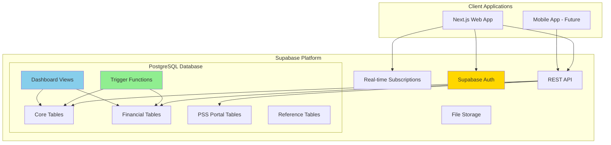
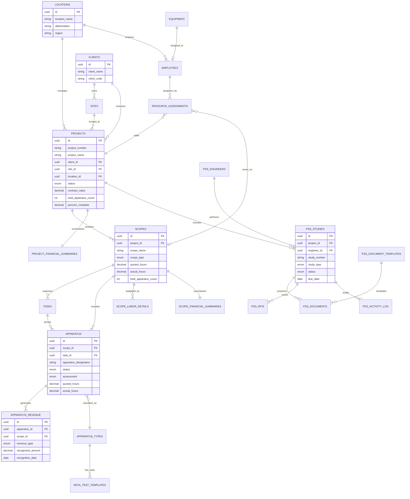
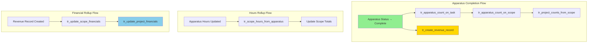
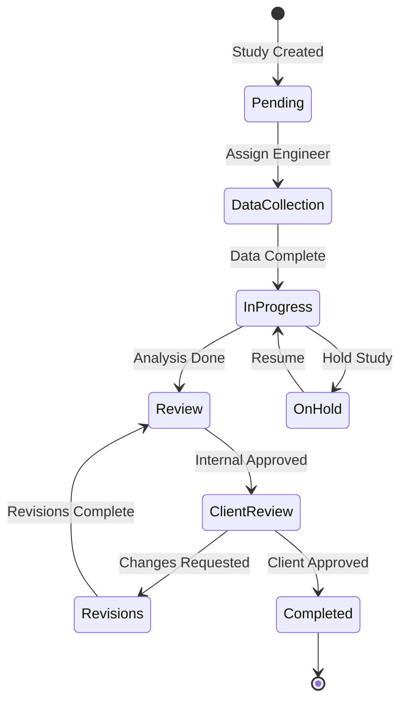
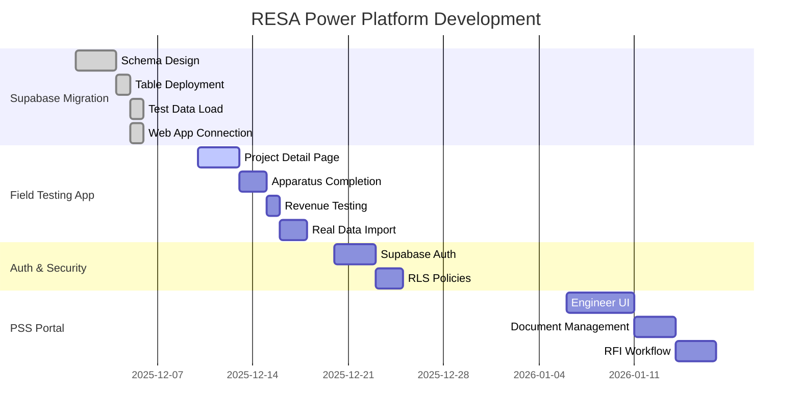

# RESA Power Project Tracker - System Overview

**Version:** 2.0.0 (Supabase)  
**Last Updated:** December 10, 2025  
**Project Lead:** Jason Swenson  
**Repository:** [github.com/jasonlswenson-sys/RESA-Power-Project-Management](https://github.com/jasonlswenson-sys/RESA-Power-Project-Management)

---

## 🎯 Executive Summary

Modern PostgreSQL/Supabase-based project management system for electrical testing projects with NETA standards compliance. **Migrated from Dataverse to Supabase in December 2025** for improved flexibility, lower cost, and better developer experience.

**Platform:**
- **Database**: Supabase (PostgreSQL) - `resa-power-db`
- **Web App**: Next.js 16 + React 19 + shadcn/ui
- **API**: Supabase REST + Real-time subscriptions
- **Auth**: Supabase Auth (planned)

**System Scale (v2.0.0):**
- **23 Tables**: Core + Financial + PSS + Reference
- **31 ENUM Types**: Type-safe status values
- **12 Trigger Functions**: Automated rollups and workflows
- **7 Views**: Dashboard and reporting aggregations
- **~50 Indexes**: Performance optimization

---

## 📊 System Architecture

### High-Level Architecture (Supabase)



---

## 🏗️ Data Model

### Entity Relationship Diagram (v2.0.0)



---

## 📋 Table Inventory

### Category 1: Core Tables (10)

| Table | Purpose | Status | Key Features |
|-------|---------|--------|--------------|
| `locations` | RESA branch offices | ✅ Active | Region-based filtering |
| `clients` | Customer companies | ✅ Active | Multi-site support |
| `sites` | Client facility locations | ✅ Active | Geo-coordinates ready |
| `employees` | RESA staff members | ✅ Active | NETA certs, rates |
| `projects` | Main project tracking | ✅ Active | Auto-rollup counts |
| `scopes` | Project phases/work packages | ✅ Active | Labor tracking |
| `tasks` | Work items within scopes | ✅ Active | Hierarchy support |
| `apparatus` | Equipment being tested | ✅ Active | Revenue driver |
| `equipment` | Company-owned test equipment | 📋 Ready | Calibration tracking |
| `resource_assignments` | Employee-project assignments | 📋 Ready | Multi-project allocation |

### Category 2: Financial Tables (6)

| Table | Purpose | Status | Key Features |
|-------|---------|--------|--------------|
| `estimators` | Quote creators | ✅ Active | Location-based |
| `apparatus_revenue` | Revenue recognition per apparatus | ✅ Active | Trigger-created |
| `scope_labor_details` | Labor line items per scope | ✅ Active | Category rates |
| `scope_financial_summaries` | Aggregated scope financials | ✅ Active | Margin tracking |
| `project_financial_summaries` | Aggregated project financials | ✅ Active | Dashboard source |
| `neta_test_templates` | Standard NETA test procedures | 📋 Ready | Hour estimates |

### Category 3: Reference Tables (1)

| Table | Purpose | Status | Key Features |
|-------|---------|--------|--------------|
| `apparatus_types` | Equipment type master list | ✅ Active | Default hours/rates |

### Category 4: PSS Portal Tables (6)

| Table | Purpose | Status | Key Features |
|-------|---------|--------|--------------|
| `pss_engineers` | External PSS engineers | 📋 Ready | PE license tracking |
| `pss_document_templates` | Document templates | 📋 Ready | Study-type specific |
| `pss_studies` | Power System Studies | 📋 Ready | Full lifecycle |
| `pss_documents` | Study documents | 📋 Ready | Version control |
| `pss_rfis` | Requests for Information | 📋 Ready | Workflow states |
| `pss_activity_log` | Audit trail | 📋 Ready | Full history |

---

## 🔄 Automated Workflows

### Trigger-Based Automation



### Trigger Functions (12)

| Function | Triggered By | Action |
|----------|-------------|--------|
| `update_updated_at_column()` | Any UPDATE | Auto-timestamp |
| `update_task_apparatus_count()` | apparatus INSERT/UPDATE/DELETE | Rollup to task |
| `update_scope_apparatus_counts()` | apparatus INSERT/UPDATE/DELETE | Rollup to scope + % |
| `update_project_apparatus_counts()` | scope count changes | Rollup to project |
| `update_scope_hours_from_apparatus()` | apparatus hours change | Sum to scope |
| `update_project_counts_from_scope()` | scope count changes | Sum to project |
| `create_revenue_on_apparatus_complete()` | apparatus status = Complete | Auto-create revenue |
| `update_scope_financial_summary()` | apparatus_revenue changes | Recalculate scope |
| `update_project_financial_summary()` | scope_financial changes | Recalculate project |
| `log_pss_study_status_change()` | pss_studies status change | Audit log |
| `log_pss_document_upload()` | pss_documents INSERT | Audit log |
| `update_pss_study_counts()` | pss_documents/rfis change | Study aggregates |

---

## 📊 ENUM Types (31)

### Project/Work Status
- `project_status`: Draft → Quoted → Won → Active → On Hold → Complete → Cancelled
- `scope_status`: Not Started → In Progress → On Hold → Complete → Cancelled
- `task_status`: Not Started → In Progress → On Hold → Complete → Cancelled
- `apparatus_status`: Not Started → In Progress → Pending Review → Complete → Cancelled
- `apparatus_assessment`: Pass, Fail, Marginal, Needs Repair, Deferred, Not Tested

### Employee/Resource
- `role_type`: Field Tech, Lead Tech, Engineer, Project Manager, Estimator, Admin, Executive
- `neta_level`: Level I, Level II, Level III, Level IV
- `assignment_type`: Primary, Secondary, Observer, Consultant
- `equipment_status`: Available, Assigned, Calibration, Maintenance, Retired

### PSS Portal
- `study_type`: Short Circuit, Arc Flash, Coordination, Load Flow, Motor Starting, etc.
- `study_status`: Pending → Data Collection → In Progress → Review → Client Review → Completed
- `document_type`: Study Report, One-Line Diagram, Calculations, Arc Flash Labels, etc.
- `document_status`: Draft → In Review → Approved → Superseded → Archived
- `rfi_status`: Open → In Progress → Pending Info → Answered → Closed → Void
- `priority_level`: Critical, High, Medium, Low
- `activity_type`: Created, Updated, Status Change, Document Upload, Approval, etc.

### Financial
- `revenue_type`: Testing, Travel, Per Diem, Materials, Equipment, Engineering, Report
- `labor_category`: Field Tech, Lead Tech, Engineer, PM, Travel, Overtime, Double Time
- `scope_type`: ATS, SWGR, XFMR, PDC, MCC, CB, RELAY, CABLE, BATT, UPS, GEN, VFD, etc.

---

## 🚀 Future Possibilities

### Ready-to-Activate Features

These tables are deployed but awaiting UI development:

| Feature | Tables | Effort | Value |
|---------|--------|--------|-------|
| **Equipment Tracking** | `equipment` | Low | Track test equipment, calibration due dates |
| **Resource Management** | `resource_assignments` | Medium | Multi-project employee allocation |
| **NETA Templates** | `neta_test_templates` | Low | Standard test procedures with hour estimates |
| **PSS Portal** | `pss_*` (6 tables) | High | External engineer collaboration |

### Potential Enhancements

| Enhancement | Description | Complexity |
|-------------|-------------|------------|
| **Real-time Dashboard** | Supabase real-time subscriptions | Medium |
| **Mobile Field App** | React Native with offline sync | High |
| **Document Storage** | Supabase Storage for reports | Low |
| **Email Notifications** | Edge functions for alerts | Medium |
| **API Integrations** | QuickBooks, SharePoint sync | Medium |
| **Advanced Analytics** | Supabase + Metabase/PowerBI | Medium |

### PSS Portal Workflow (Ready to Build)



---

## 👥 User Personas & Access

### Role-Based Architecture

| Role | Access Level | Key Functions |
|------|--------------|---------------|
| **Field Technician** | Own work only | Update apparatus status, enter hours |
| **Lead Technician** | Team work | Assign work, review completions |
| **Project Manager** | Full project | Manage scopes, track budgets |
| **Estimator** | Quotes + Projects | Create estimates, win projects |
| **Engineer** | PSS Studies | Create studies, upload documents |
| **Admin** | Full system | User management, configuration |
| **Executive** | Read all | Dashboards, reports |

### Planned Auth Strategy

1. **Phase 1** (Current): Anon key, no login required
2. **Phase 2**: Supabase Auth with email/password
3. **Phase 3**: RLS policies for row-level security
4. **Phase 4** (Optional): Azure AD SSO for enterprise

---

## 📁 Repository Structure

```
RESA_Power_Build/
├── PROJECT_STATUS.md           # Current status tracker
├── PROJECT_OVERVIEW.md         # This file - system overview
├── Supabase/
│   ├── schema/
│   │   ├── 00_enums.sql       # 31 ENUM types
│   │   ├── 01_tables.sql      # 23 tables
│   │   ├── 02_relationships.sql # Foreign keys
│   │   ├── 03_triggers.sql    # 12 trigger functions
│   │   ├── 04_views.sql       # 7 dashboard views
│   │   └── 05_indexes.sql     # ~50 indexes
│   ├── data/
│   │   ├── 10_seed_data.sql   # Reference data
│   │   ├── 11_test_data.sql   # LASNAP16 test project
│   │   └── 12_pss_test_data.sql # PSS test data
│   ├── lib/
│   │   └── supabase.ts        # Client library
│   ├── SCHEMA_REFERENCE.md    # Quick reference
│   └── DEPLOY_ALL.sql         # Single-file deployment
├── .claude/
│   ├── COORDINATION.md        # Session handoffs
│   └── OPEN_DECISIONS.md      # Architecture decisions
├── Documentation/             # Detailed specs (some outdated)
├── CSV_Templates/             # Import templates
└── Reference_Files/           # Excel trackers, PDFs

Web App (separate repo):
C:\Users\jjswe\Projects\resa-web-app\
├── src/
│   ├── app/                   # Next.js App Router pages
│   ├── lib/supabase.ts        # Supabase client
│   └── components/            # UI components
├── .env.local                 # Supabase credentials
└── package.json               # Dependencies
```

---

## 🔧 Technical Specifications

### Platform Details

| Component | Technology | Version/Details |
|-----------|-----------|-----------------|
| **Database** | PostgreSQL via Supabase | 17.x |
| **Backend** | Supabase | REST API + Real-time |
| **Web Framework** | Next.js | 16.0.5 (App Router) |
| **UI Library** | shadcn/ui + Radix | Latest |
| **Styling** | Tailwind CSS | 4.x |
| **Language** | TypeScript | 5.x |
| **Auth** | Supabase Auth | Planned |
| **Hosting** | TBD | Vercel recommended |

### Database Statistics

| Metric | Count |
|--------|-------|
| Tables | 23 |
| ENUM Types | 31 |
| Trigger Functions | 12 |
| Views | 7 |
| Indexes | ~50 |
| Foreign Keys | 25+ |

### Test Data (LASNAP16 Project)

| Table | Records |
|-------|---------|
| locations | 5 |
| clients | 1 |
| sites | 1 |
| projects | 1 |
| scopes | 4 |
| tasks | 12 |
| apparatus | 47 |
| employees | 5 |
| apparatus_types | 15 |
| estimators | 2 |

---

## 🎯 Implementation Roadmap

### Current Status: Phase 1 Complete



---

## 📞 Key References

| Resource | Location |
|----------|----------|
| **Project Status** | `PROJECT_STATUS.md` |
| **Schema Reference** | `Supabase/SCHEMA_REFERENCE.md` |
| **Coordination Notes** | `.claude/COORDINATION.md` |
| **Architecture Decisions** | `.claude/OPEN_DECISIONS.md` |
| **Supabase Dashboard** | https://supabase.com/dashboard |
| **GitHub Repository** | https://github.com/jasonlswenson-sys/RESA-Power-Project-Management |

---

## 🔄 Migration from Dataverse

**Why Supabase?**
- ✅ Lower cost ($25/mo vs Power Platform licensing)
- ✅ Full SQL access for complex queries
- ✅ Real-time subscriptions built-in
- ✅ Better developer experience
- ✅ Open source, no vendor lock-in
- ✅ PostgreSQL industry standard

**What Migrated:**
- All core tables (clients, sites, projects, scopes, tasks, apparatus)
- Revenue recognition architecture
- Financial rollup triggers
- Dashboard views

**What''s New in Supabase:**
- PSS Portal tables (6 new tables)
- Equipment tracking table
- Resource assignments table
- NETA test templates table
- 31 type-safe ENUMs
- 12 trigger functions (vs 1 Power Automate flow)

---

**Document Version:** 2.0.0  
**Last Updated:** December 10, 2025
