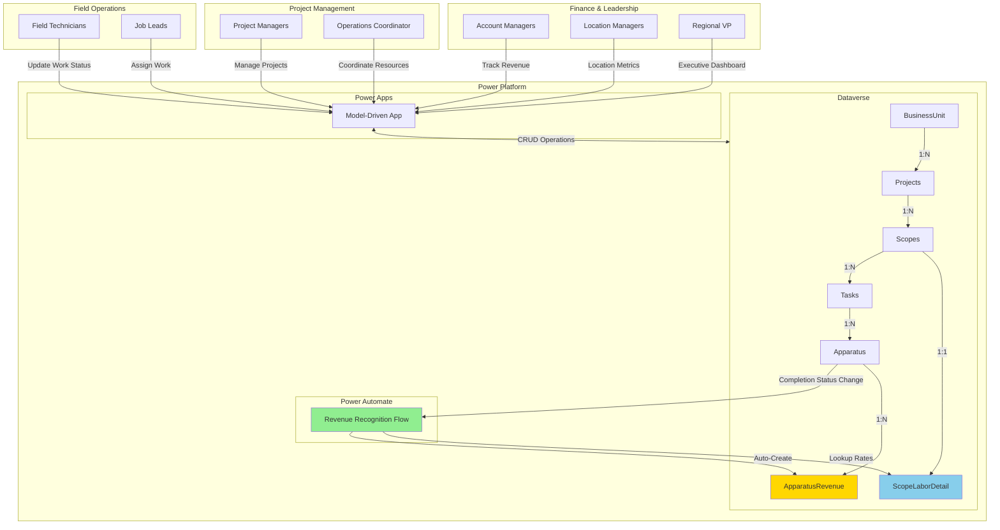
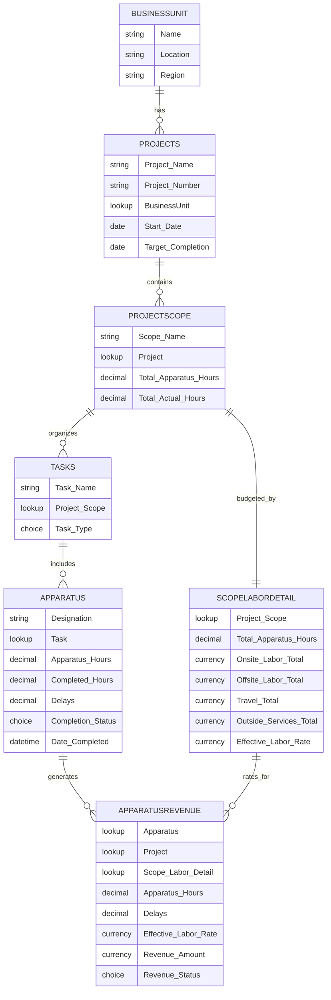
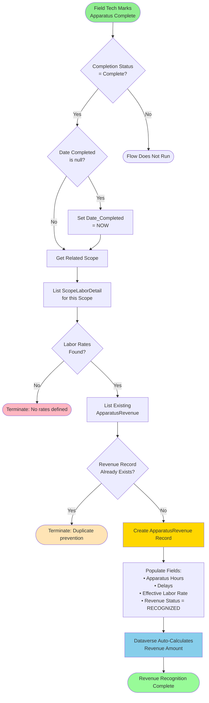
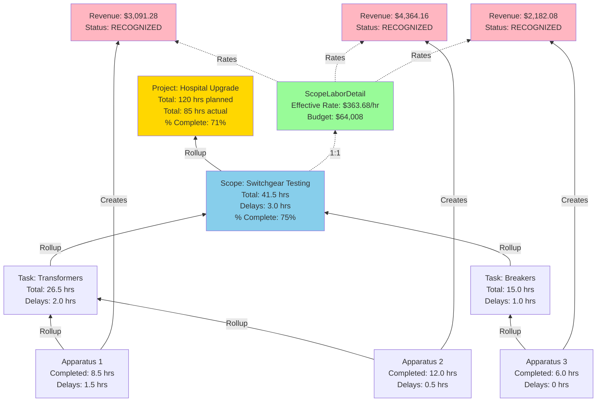
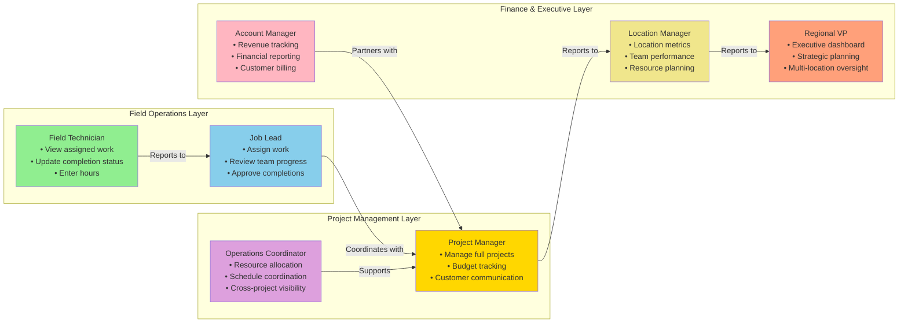
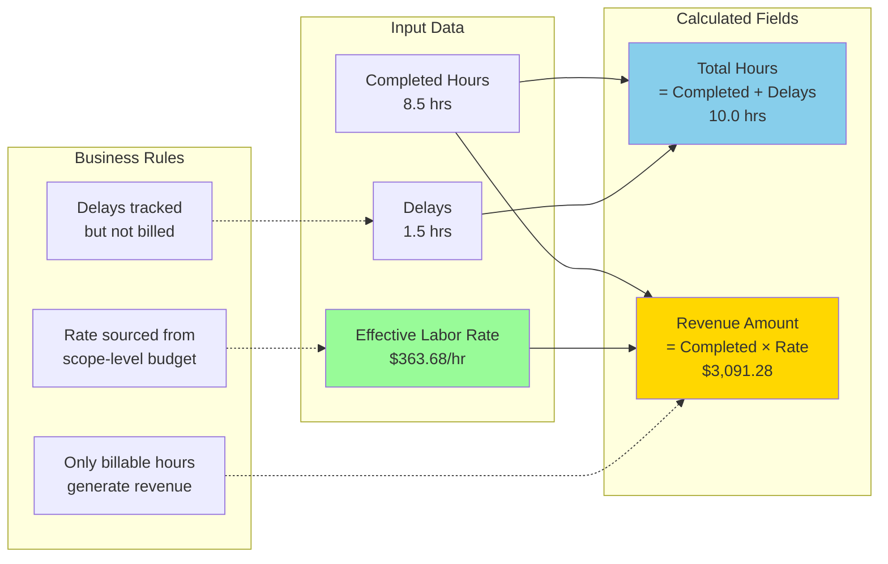
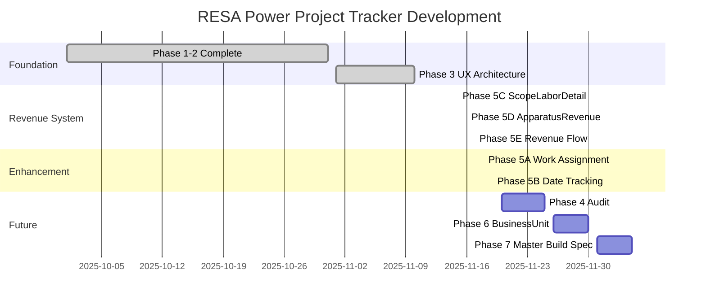

# RESA Power Project Tracker - System Overview

**Version:** 1.3.0.1  
**Last Updated:** November 17, 2025  
**Project Lead:** Jason Swenson  
**Repository:** [github.com/jasonlswenson-sys/RESA-Power-Project-Management](https://github.com/jasonlswenson-sys/RESA-Power-Project-Management)

---

## 🎯 Executive Summary

Modern Dataverse-based project management system for electrical testing projects with NETA standards compliance. Replaces legacy Access database with cloud-based Power Platform solution featuring automated revenue recognition, multi-location support, and real-time progress tracking.

**Business Impact:**
- ✅ **10-15 hours/year** saved through automated revenue recognition
- ✅ **Real-time visibility** into project status and financials
- ✅ **Multi-location support** for Phoenix, Las Vegas, Denver, San Diego
- ✅ **NETA compliance** built into data structure
- ✅ **Audit trail** for all financial and completion data

---

## 📊 System Architecture

### High-Level Architecture



---

## 🏗️ Data Model

### Entity Relationship Diagram



---

## 🔄 Revenue Recognition Flow

### Automated Workflow



---

## 📈 Rollup Architecture

### Hours and Revenue Aggregation



---

## 👥 User Personas & Access

### Role-Based Architecture



---

## 🔢 Key Metrics & Calculations

### Revenue Calculation Model



---

## 📁 Repository Structure

```
RESA_Power_Build/
├── Documentation/
│   ├── 00_START_HERE/          # Quick start guides
│   ├── 01_Architecture/         # System design docs
│   │   ├── REVENUE_ARCHITECTURE.md
│   │   ├── USER_EXPERIENCE_SYSTEM_ARCHITECTURE.md
│   │   └── MASTER_BUILD_SPECIFICATION.md
│   ├── 02_Implementation/       # Build specifications
│   │   ├── SCOPELABORDETAIL_BUILD_SPEC.md
│   │   ├── APPARATUSREVENUE_ENHANCEMENTS.md
│   │   └── REVENUE_RECOGNITION_FLOW_SPEC.md
│   ├── 03_Progress_Tracking/    # Development logs
│   ├── 04_Data_Migration/       # Import templates and guides
│   ├── 05_Reviews_Analysis/     # Technical audits
│   └── 99_Archive/             # Historical documents
├── Solution_Exports/
│   ├── v1.2.0.3/               # Base system
│   ├── v1.3.0.0/               # Date tracking fields
│   ├── v1.3.0.1/               # Revenue architecture
│   ├── v1.3.0.2/               # Revenue flow (in progress)
│   └── v1.3.0.3/               # Future enhancements
├── CSV_Templates/              # Data import templates
├── Scripts/                    # PowerShell automation
└── README.md                   # Project overview
```

---

## 🚀 Implementation Roadmap

### Current Status: Phase 5 (Revenue Automation)



---

## 📊 Technical Specifications

### Platform Details

| Component | Technology | Version |
|-----------|-----------|---------|
| **Database** | Microsoft Dataverse | Latest |
| **App Type** | Model-Driven App | Power Apps |
| **Automation** | Power Automate | Cloud Flows |
| **Tables** | 8 custom entities | v1.3.0.1 |
| **Fields** | 137 custom fields | 28 calculated |
| **Workflows** | 1 active flow | Revenue Recognition |
| **Repository** | GitHub | Private → Public |

### Key Tables

| Table | Records | Purpose | Status |
|-------|---------|---------|--------|
| **BusinessUnit** | 4 | Multi-location support | ✅ Production |
| **Projects** | ~50/year | Top-level containers | ✅ Production |
| **ProjectScope** | ~150/year | Work breakdown | ✅ Production |
| **Tasks** | ~500/year | Task organization | ✅ Production |
| **Apparatus** | ~2000/year | Equipment testing | ✅ Production |
| **ScopeLaborDetail** | ~150/year | Budget & rates | ✅ v1.3.0.1 |
| **ApparatusRevenue** | ~2000/year | Revenue tracking | ✅ v1.3.0.1 |
| **TestRecords** | ~20k/year | NETA test data | ✅ Production |

---

## 💼 Business Value

### Quantified Benefits

**Time Savings:**
- **Revenue Entry:** 10-15 hours/year automated
- **Progress Tracking:** Real-time vs. weekly updates
- **Reporting:** Instant dashboards vs. manual reports

**Accuracy Improvements:**
- **Revenue Recognition:** 100% automated, zero manual errors
- **Date Tracking:** System-captured timestamps
- **Budget Variance:** Real-time calculation vs. end-of-project

**Operational Benefits:**
- **Multi-Location:** Phoenix, Las Vegas, Denver, San Diego unified
- **NETA Compliance:** Built into data structure
- **Audit Trail:** Complete history of all changes
- **Scalability:** Cloud-based, grows with business

---

## 🔐 Security & Compliance

- ✅ **Role-Based Access Control** - 7 defined personas with appropriate permissions
- ✅ **Audit Logging** - All data changes tracked in Dataverse
- ✅ **Data Encryption** - At rest and in transit (Microsoft standard)
- ✅ **Business Unit Isolation** - Location-based data segmentation ready
- ✅ **NETA Standards** - Test data structure aligns with industry requirements

---

## 📞 Support & Documentation

**Primary Documentation:**
- `Documentation/00_START_HERE/` - Quick start guides
- `Documentation/01_Architecture/` - System design
- `Documentation/02_Implementation/` - Build specs

**Key Resources:**
- [GitHub Repository](https://github.com/jasonlswenson-sys/RESA-Power-Project-Management)
- `REVENUE_ARCHITECTURE.md` - Complete revenue chain documentation
- `USER_EXPERIENCE_SYSTEM_ARCHITECTURE.md` - UX and role design
- `REVENUE_RECOGNITION_FLOW_SPEC.md` - Workflow specifications

---

## 🎯 Next Steps

### Immediate (This Week)
1. ✅ Complete Revenue Recognition Flow (Phase 5E)
2. Deploy to test environment
3. Run 5 test scenarios
4. Monitor first 24 hours

### Short-Term (Next 2 Weeks)
1. Add Work Assignment fields (Phase 5A)
2. Implement Date Tracking enhancements (Phase 5B)
3. Conduct forms/views audit (Phase 4)
4. Document findings

### Medium-Term (Next Month)
1. BusinessUnit rollup enhancements (Phase 6)
2. Location Manager dashboard
3. Master Build Specification V2 (Phase 7)
4. Executive presentation

---

**Document Version:** 1.0  
**Last Updated:** November 17, 2025  
**Status:** System operational, enhancements in progress  
**Contact:** Jason Swenson - RESA Power Project Tracker Lead
