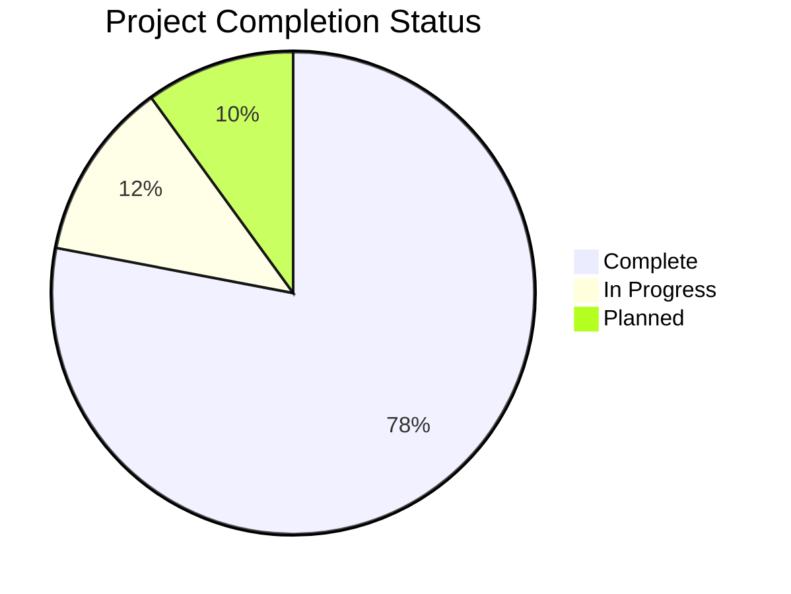
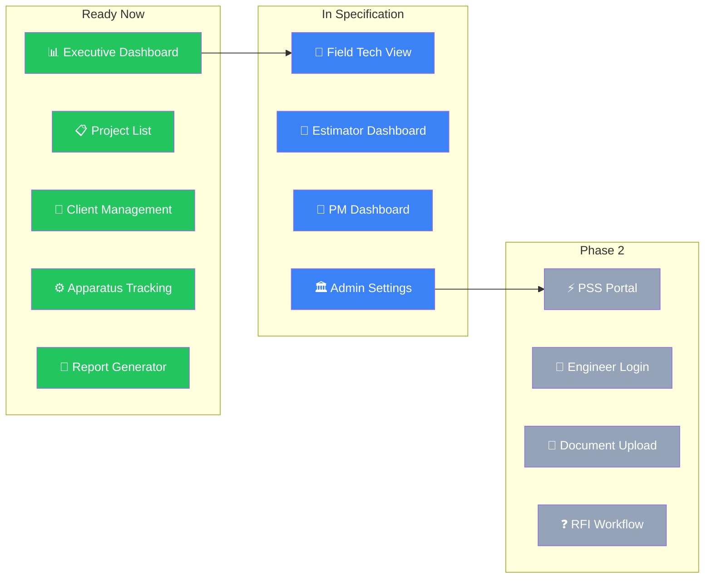
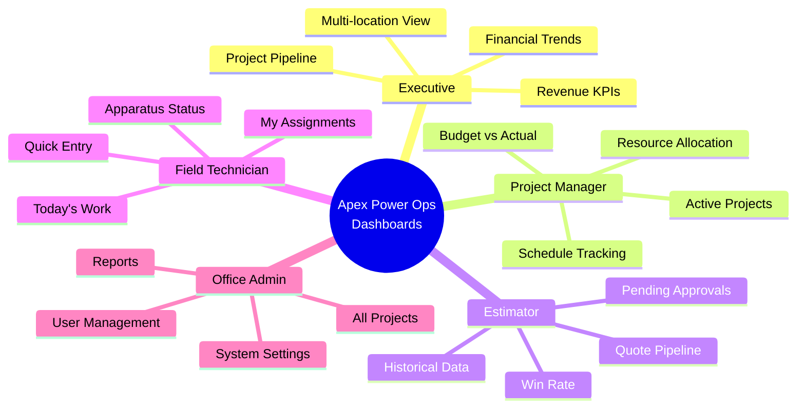
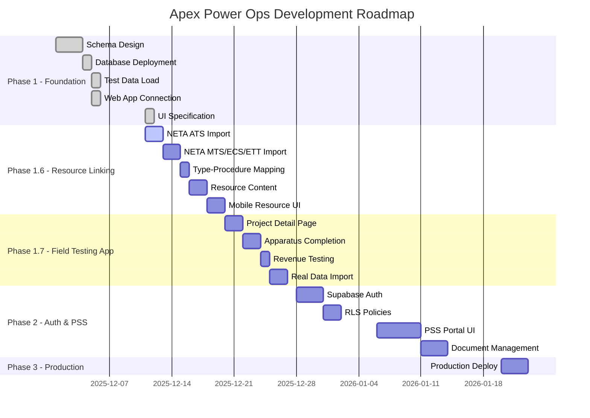

# Apex Power Ops - Project Status

> Repo-owned copy established 2026-05-07 as the canonical in-repo status surface for the live standalone `apex-power-ops-platform/` boundary. Keep the parent-root copy aligned until cutover retirement is complete.

> **Last Updated**: May 15, 2026 (governed live-DSN rotation, authoritative-host adopted-runtime proof, successful host promotion rehearsal, delegated Packet 831 through Packet 861 template and governance publication stack, alternating Packet 862 through Packet 916 floor-refresh sequence, Packet 916 operator-prompt-template floor validation, PM lead-field metadata promotion on the truthful Miner Temp lane, standing delegated repo-authority plus AI orchestration protocol publication, PM Lane 001 workfront read-model execution, PM Lane 002 advisory follow-up execution, PM Lane 003 return-to-lead issue disposition execution, PM Lane 004 read-only workfront lenses plus disposition-history context execution, PM Lane 005 decision-history timestamp normalization execution, PM Lane 006 read-only workfront decision-history panel execution, PM Lane 007 live Supabase history parity inspection, PM Lane 008 decision-history query narrowing execution, PM Lane 009 read-only live workfront smoke extension execution, PM Lane 010 issue-disposition semantic hardening execution, PM Lane 011 operations-web production promotion plus hosted seam drift isolation, PM Lane 012 Render-authenticated mutation-seam redeploy/log-inspection packet authoring, PM Lane 013 workfront schedule drillthrough execution, PM Lane 014 approval scoped-history execution, PM Lane 015 approval detail decision-history context execution, PM Lane 016 approval task-review drillthrough execution, PM Lane 017 approval workpackage-review drillthrough execution, PM Lane 018 approval drillthrough return-coverage execution, PM Lane 019 approval snapshot/escalation return-coverage execution, PM Lane 020 workfront drillthrough return-coverage execution, PM Lane 021 workfront escalation-approval drillthrough execution, PM Lane 022 workfront task-review drillthrough execution, PM Lane 023 workfront workpackage-review drillthrough execution, PM Lane 024 workfront decision-history drillthrough execution, PM Lane 025 workfront snapshot-review drillthrough execution, PM Lane 026 workfront review-action grouping execution, PM Lane 027 workfront review-urgency signals execution, PM Lane 028 project miner planning-folder intake tooling execution, PM Lane 029 estimator VBA lineage scope-sheet intake execution, PM Lane 030 project data-entry tracker lineage preview execution, PM Lane 031 Temp Power delivery/orchestration operating-plan execution, PM Lane 032 Temp Power import-candidate review execution, PM Lane 033 import-candidate PM UI review execution, PM Lane 034 import-candidate review hardening execution, PM Lane 035 import-admission plan execution, PM Lane 036 hosted PM intake UI promotion plus Render parity blocker execution, PM Lane 037 Render-authenticated PM intake seam redeploy gate authoring, PM Lane 038 import approval contract design execution, PM Lane 039 import approval storage-plan design execution, PM Lane 040 import approval-readiness UI execution, PM Lane 041 hosted PM intake parity refresh authoring, PM Lane 042 hosted executor closeout intake contract authoring, PM Lane 043 Project Miner import-intake workbench execution, PM Lane 044 hosted PM intake route-scope refresh authoring, PM Lane 045 PM intake brief export execution, PM Lane 046 PM intake local review checklist execution, PM Lane 047 PM intake approval-decision draft execution, PM Lane 048 PM intake approval packet preview export execution, PM Lane 049 approval persistence schema/adapter admission packet authoring, PM Lane 050 approval persistence readiness gates execution, PM Lane 051 local PM operating queue execution, PM Lane 052 local executor handoff export execution, PM Lane 053 local executor closeout intake execution, PM Lane 054 local field kickoff prep brief export execution, PM Lane 055 local field readiness checklist execution, PM Lane 056 local field questions draft execution, PM Lane 057 local field prep queue execution, PM Lane 058 local field observation scratchpad export execution, PM Lane 059 local field prep coverage snapshot execution, PM Lane 060 local field prep conversation agenda execution, PM Lane 061 local field prep packet bundle export execution, PM Lane 062 local import exception decision register execution, PM Lane 063 local PM intake snapshot execution, PM Lane 064 local PM intake quick jump rail execution, PM Lane 065 local PM intake start-here focus execution, PM Lane 066 local PM intake workflow map execution, PM Lane 067 local PM intake open items lens execution, PM Lane 068 local PM intake daily review script execution, PM Lane 069 local PM intake output selector execution, PM Lane 070 local PM intake handoff guide execution, and PM Lane 071 local PM intake command center execution)
> **Supplement**: Standing delegated technical repo authority, PM coordination, external Codex or Claude Code executor orchestration, audit, approval, and bounded closeout rules now live in `docs/authority/APEX-OPS-DELEGATED-AUTHORITY-AND-AI-ORCHESTRATION-PROTOCOL-2026-05-15.md`. This converts the 2026-05-15 stakeholder delegation into repo-visible governance: Codex may choose, author, delegate, execute, validate, audit, approve, publish, and close bounded APEX Ops and Olares One work while preserving the existing authority stack, explicit write scopes, repo-visible evidence, unrelated worktree residue, and the current no-widening guardrails for services, auth, ingress, schema, production writes, Operations Visibility, and AI business-state mutation.
> **Supplement**: The PM acceleration overlay now lives in `docs/operations/APEX-PM-STAKEHOLDER-TIME-PROTECTION-AND-ACCELERATION-LANE-2026-05-15.md`. It records stakeholder time and relay burden as primary constraints for the Project Miner PM lane: Jason remains the business owner, exception authority, and approval checkpoint, but Codex owns routine packet authorship, executor prompts, implementation, validation, evidence summaries, commit/push, host parity, and next-slice recommendation. The next product tranche remains Temp Power Import Candidate Review, with local read-only candidate work allowed to proceed while hosted Render parity is restored in parallel or before hosted proof is required.
> **Supplement**: PM Lane 032 is locally executed as the read-only Temp Power Import Candidate Review tranche. `apps/mutation-seam` now builds `pm-import-candidate-miner-temp-power` from the Project Miner planning folder, exposes `GET /api/v1/reads/project-import-candidate`, and adds `apps/mutation-seam/scripts/preview_pm_import_candidate.py` for text or JSON review. The current local Temp Power candidate proposes 7 workpackages, 15 tasks, and 186 apparatus candidates with 15 crew, 343 equipment inventory rows, 50 capability rows, and 2 review signals: one missing-designation information item and one project-data-entry formula-warning item. The external sidecar scout produced `ops/agents/handoffs/2026-05-15-pm-lane-032-sidecar-import-candidate-review-scout-handoff.md` as a handoff-only artifact recommending an exception-first PM Lane 033 UI review surface. The tranche keeps `mutation_authority: not_admitted`, writes no Supabase data, runs no workbook macros, performs no Render/Vercel deployment, and admits no assignment, schedule, status, or AI business-state mutation.
> **Supplement**: PM Lane 033 is locally executed as the read-only Import Candidate PM UI Review tranche. `apps/operations-web` now hosts `/pm-review/import-candidate`, consuming only `GET /api/v1/reads/project-import-candidate` and rendering an exception-first review packet with candidate summary, required decisions, warning review, collapsed proposed structure, source traceability, resource context, and guardrail panels. Validation passed `corepack pnpm --filter @apex/operations-web build`, `corepack pnpm --filter @apex/operations-web typecheck`, and focused Playwright smoke `tests/browser-shell.pm-import-candidate.smoke.spec.ts` with `1 passed` while asserting zero mutation calls. This tranche added no backend endpoint, SQL, schema, live database write, production import, workbook macro execution, Render deployment, Vercel promotion, approval persistence, candidate edit persistence, assignment, schedule, status, or AI business-state mutation.
> **Supplement**: PM Lane 034 is locally executed as the read-only Import Candidate Review Hardening tranche. `apps/mutation-seam` now enriches the import candidate with deterministic source stat freshness metadata using path, file size, and modified time fingerprints without content hashing or workbook mutation. `/pm-review/import-candidate` now adds severity and code warning filters, a source freshness panel, browser-only JSON export containing the current candidate plus local PM draft notes, and a local-only PM questions draft retained in browser storage. The internal sidecar scout independently recommended this scope and no files were delegated for write ownership. Validation passed focused mutation-seam import-candidate tests, operations-web typecheck, operations-web build, focused Playwright smoke with download/filter/localStorage/no-mutation proof, packet JSON parse, git diff checks, and an in-app browser visual open against a local current API/UI pair. This tranche added no SQL, schema, live database write, production import, workbook macro execution, workbook writeback, Render deployment, Vercel promotion, approval persistence, server-side note persistence, candidate edit persistence, assignment, schedule, status, or AI business-state mutation.
> **Supplement**: PM Lane 035 is locally executed as the read-only Import Admission Plan tranche. `apps/mutation-seam` now exposes `GET /api/v1/reads/project-import-admission-plan`, derived from the existing import candidate, with an approval-record contract, deterministic idempotency key plan, preview-to-import diff checks, no-go checks, target row plan, future import sequence, and explicit `not_allowed_now` list. `apps/operations-web` now hosts `/pm-review/import-admission-plan` and links to it from the import-candidate route and governed shell. The internal sidecar scout independently confirmed this GET-only route shape as the safest next lane and no files were delegated for write ownership. Validation passed focused mutation-seam import-candidate/admission tests with `4 passed`, operations-web typecheck, operations-web build, and paired Playwright smokes for import-candidate plus import-admission-plan with `2 passed` while asserting zero mutation calls. This tranche added no SQL, schema, live database write, production import, approval persistence, workbook macro execution, workbook writeback, Render deployment, Vercel promotion, service admission, auth/ingress widening, assignment, schedule, status, or AI business-state mutation.
> **Supplement**: PM Lane 036 is executed as a hosted PM intake UI promotion and parity-blocker proof tranche. Vercel auth is available as `jasonlswenson-sys`; operations-web was promoted to production deployment `dpl_GhaHP7v2QPA8SKDC7t7yU5PzNfCt`, aliased to `https://operations.apexpowerops.com`, after adding a repo-root `.vercelignore` so future root-invoked operations-web deploys do not upload docs, ops, backend services, private infra, caches, or local residue. Hosted route smoke now includes `/pm-review/import-candidate` and `/pm-review/import-admission-plan` and passed with `SMOKE_SUMMARY failed=0 passed=10`. The new hosted intake smoke proves the UI routes are live but truthfully fails on Render: `https://mutation-seam.apexpowerops.com` health is `200`, OpenAPI is missing the two new PM intake read paths, and both `GET /api/v1/reads/project-import-candidate` plus `GET /api/v1/reads/project-import-admission-plan` return `404`. Render auth/token/service metadata are unavailable in this workspace, and the deployed mutation-seam smoke still reports schedule read `500` failures, so hosted PM live-data parity remains blocked by a Render-authenticated mutation-seam redeploy/log-inspection lane. This tranche added no Render deployment, SQL, schema, live database write, production import, approval persistence, workbook macro execution, workbook writeback, service admission, auth/ingress widening, assignment, schedule, status, or AI business-state mutation.
> **Supplement**: PM Lane 037 is authored as the current Render-authenticated PM intake mutation-seam redeploy gate. The previous PM Lane 012 Render packet remains precedent, but PM Lane 037 refreshes the executor boundary for the current Project Miner intake blocker after PM Lane 036: the Vercel UI routes are live, while hosted mutation-seam OpenAPI omits `/api/v1/reads/project-import-candidate` and `/api/v1/reads/project-import-admission-plan`, both reads return `404`, and schedule reads still return `500`. `apps/mutation-seam/scripts/smoke_deployed_mutation_seam.py` now has an optional `--include-pm-intake` flag that checks OpenAPI registration, both PM intake reads, and `mutation_authority: not_admitted` without changing default smoke behavior. The refreshed packet and handoff are ready for a Render-authenticated executor at `ops/agents/packets/draft/2026-05-15-pm-lane-037-render-authenticated-pm-intake-seam-redeploy-gate.json` and `ops/agents/handoffs/2026-05-15-pm-lane-037-render-authenticated-pm-intake-seam-redeploy-gate-handoff.md`. A read-only sidecar scout also recorded the next product lane recommendation: after hosted intake reads are current, implement approval-persistence design only, not import execution. This tranche added no Render deployment from this workspace, SQL, schema, live database write, production import, approval persistence, import mutation, workbook macro execution, workbook writeback, service admission, auth/ingress widening, assignment, schedule, status, or AI business-state mutation.
> **Supplement**: PM Lane 038 is locally executed as the read-only Import Approval Contract Design tranche. `apps/mutation-seam` now exposes `GET /api/v1/reads/project-import-approval-contract`, derived from the current import-admission plan, with a persistence contract, minimum expected candidate identity values, human-acceptance policy, decision payload template, validation matrix, future mutation contract, and explicit `not_allowed_now` list. A pure validator rejects stale source or shape fingerprints, changed warning-code sets, unsupported decisions, non-overridable no-go acknowledgements, missing PM actor/timestamp fields, and empty PM review notes before any persistence path exists. `apps/mutation-seam/scripts/smoke_deployed_mutation_seam.py --include-pm-intake` now also checks the approval-contract read so Render parity proof covers all current PM intake reads. A read-only sidecar independently recommended this exact no-store/no-pipeline shape to avoid accidentally turning design into mutation authority. Validation passed focused mutation-seam import candidate, admission-plan, and approval-contract tests with `8 passed`. This tranche added no SQL, schema, live database write, production import, approval persistence, import mutation, workbook macro execution, workbook writeback, Render deployment, Vercel promotion, service admission, auth/ingress widening, assignment, schedule, status, or autonomous AI business-state mutation.
> **Supplement**: PM Lane 039 is locally executed as the read-only Import Approval Storage-Plan Design tranche. `apps/mutation-seam` now exposes `GET /api/v1/reads/project-import-approval-storage-plan`, derived from the approval contract, selecting a future dedicated insert-only `seam.pm_import_candidate_approvals` table and `/api/v1/mutations/project-import-approvals` route while keeping `persistence_authority: storage_decision_only_not_admitted`. The plan defines recommended columns, constraints, adapter requirements, readback requirements, rejected unsafe storage options, and the later admission sequence; it explicitly rejects audit-log-only storage, existing task/issue/workpackage reuse, browser-local draft storage as canonical approval, generic PgDict upsert without an adapter, and direct Supabase writes from Excel or UI. `smoke_deployed_mutation_seam.py --include-pm-intake` now checks the storage-plan read too. A read-only sidecar independently confirmed that actual persistence is unsafe until a dedicated table/adapter is admitted because the default store is Supabase-backed and the generic mutation pipeline does not own this entity. Validation passed focused mutation-seam import candidate, admission-plan, approval-contract, and approval-storage-plan tests with `12 passed`. This tranche added no SQL, schema, live database write, production import, approval persistence, import mutation, workbook macro execution, workbook writeback, Render deployment, Vercel promotion, service admission, auth/ingress widening, assignment, schedule, status, or autonomous AI business-state mutation.
> **Supplement**: PM Lane 040 is locally executed as the read-only Import Approval Readiness UI tranche. `apps/operations-web` now hosts `/pm-review/import-approval-readiness`, consuming only `GET /api/v1/reads/project-import-approval-contract` and `GET /api/v1/reads/project-import-approval-storage-plan` to show the approval packet shape, candidate identity, human-acceptance policy, validation matrix, future mutation contract, dedicated approval table decision, adapter requirements, rejected storage shortcuts, future admission sequence, and merged not-allowed-now guardrails. The route is linked from the governed shell, import-candidate route, and import-admission-plan route, and hosted smoke scripts now include the route and both approval-readiness read seams. A read-only sidecar independently recommended this separate route instead of touching `/pm-review/approval`, which already owns admitted PM approval mutations. Validation passed operations-web typecheck, operations-web build, and focused Playwright PM intake smokes for import-candidate, import-admission-plan, and import-approval-readiness with `3 passed` while asserting the new route calls both reads once and zero mutation routes. This tranche added no backend endpoint, SQL, schema, live database write, production import, approval persistence, import mutation, workbook macro execution, workbook writeback, Render deployment, Vercel promotion, service admission, auth/ingress widening, assignment, schedule, status, or autonomous AI business-state mutation.
> **Supplement**: PM Lane 041 is authored as the hosted PM intake parity refresh and blocker-classification lane after PM Lane 040. Read-only hosted proof now shows operations-web import-candidate and import-admission-plan still pass, operations-web `/pm-review/import-approval-readiness` returns `404`, mutation-seam health returns `200`, hosted OpenAPI is missing all four current PM intake reads, those four reads return `404`, and schedule projects/drivers/tracer/variance still return `500`. Local capability checks found no Render CLI, no `RENDER_*` environment names, no Vercel CLI binary, no `VERCEL_*` environment names, and `pnpm dlx vercel whoami` timed out waiting for authentication before being stopped. `ops/agents/packets/draft/2026-05-15-pm-lane-041-hosted-pm-intake-parity-refresh.json` and `ops/agents/handoffs/2026-05-15-pm-lane-041-hosted-pm-intake-parity-refresh-handoff.md` define two bounded hosted executor lanes: Vercel-authenticated existing operations-web promotion for the Lane 040 route and Render-authenticated existing mutation-seam redeploy/classification for the PM intake reads. This tranche added no product code, backend endpoint, SQL, schema, live database write, production import, approval persistence, import mutation, workbook macro execution, workbook writeback, local Render/Vercel deployment, service admission, auth/ingress widening, assignment, schedule, status, or autonomous AI business-state mutation.
> **Supplement**: PM Lane 041A/041B split dispatch is authored as repo-visible AI-to-AI relay reduction for the hosted parity step. Lane 041A now has a Vercel-only packet and copy/paste handoff for promoting current operations-web to the existing `https://operations.apexpowerops.com` alias so `/pm-review/import-approval-readiness` is hosted. Lane 041B now has a Render-only packet and copy/paste handoff for redeploying or classifying the existing `apex-platform-mutation-seam` service so the four current PM intake reads are hosted-current. `ops/agents/handoffs/2026-05-15-pm-lane-041-dual-executor-dispatch-board.md` records both lanes, sequencing, acceptance criteria, and guardrails. This dispatch split added no product code, deployment, hosted service, DNS, auth, ingress, secret, SQL, schema, approval persistence, import mutation, live data mutation, or autonomous AI business-state action.
> **Supplement**: PM Lane 042 is authored as the hosted executor closeout intake contract. `ops/agents/handoffs/templates/pm-hosted-executor-closeout-template.md` now defines the required evidence shape for PM Lane 041A and 041B returns: source commit, changed files, non-secret hosted action evidence, exact validation commands/results, final verdict, blocker classification, guardrail confirmations, and coordinator recommendation. The 041 dispatch board and Vercel/Render handoffs now require closeout handoffs at the expected 041A/041B closeout paths. This tranche added no product code, deployment, hosted credential probing, backend endpoint, SQL, schema, approval persistence, import mutation, live data write, service admission, auth/ingress widening, or business-state mutation.
> **Supplement**: PM Lane 043 is locally executed as the read-only Project Miner Import Intake Workbench tranche. `apps/operations-web` now hosts `/pm-review/import-intake`, consuming only the four existing PM intake reads for import candidate, import-admission plan, approval contract, and approval storage plan. The workbench consolidates candidate identity, source freshness, proposed counts, warning signals, PM decisions, workflow gates, admission target rows, future approval table `seam.pm_import_candidate_approvals`, future route `/api/v1/mutations/project-import-approvals`, hosted-parity status, and merged guardrails into one daily PM starting point. A read-only sidecar recommended the `/pm-review/import-intake` route name and smoke scope. Validation passed operations-web typecheck, production build with `/pm-review/import-intake` in the route output, and focused PM intake Playwright smokes with `4 passed` while asserting all four reads, zero mutation calls, and no approve/persist/submit/import buttons. This tranche is local-current only until PM Lane 041A/041B close hosted parity and adds no backend endpoint, deployment, SQL, schema, approval persistence, import mutation, live database write, workbook macro execution, workbook writeback, service admission, auth/ingress widening, assignment, schedule, status, or autonomous AI business-state mutation.
> **Supplement**: PM Lane 044 is authored as the hosted PM intake route-scope refresh after PM Lane 043. The hosted route smoke and hosted PM intake smoke now include `/pm-review/import-intake`; the PM Lane 041 parent packet, 041A Vercel packet/handoff, dispatch board, deployment validation, PM operating docs, and hosted executor closeout template now require authenticated Vercel proof for both `/pm-review/import-approval-readiness` and `/pm-review/import-intake`. The refreshed hosted probes truthfully remain red: hosted route smoke passes 10 routes and fails those two routes with `404`, while hosted PM intake smoke fails 7 checks including both operations-web routes, missing hosted mutation-seam OpenAPI PM intake paths, and all four PM intake reads returning `404`. Render scope remains unchanged because the workbench consumes the same four read seams already assigned to PM Lane 041B. This tranche added no deployment, backend endpoint, SQL, schema, approval persistence, import mutation, live database write, workbook macro execution, workbook writeback, service admission, auth/ingress widening, assignment, schedule, status, or autonomous AI business-state mutation.
> **Supplement**: PM Lane 045 is locally executed as the Project Miner PM Intake Brief Export tranche. `/pm-review/import-intake` now includes a client-only `Export PM Brief` action that downloads a Markdown brief from the already-loaded import candidate, admission plan, approval contract, and approval storage plan reads. The brief captures candidate identity, source freshness, proposed counts, warning signals, PM decisions, workflow gates, admission and approval status, future approval table/route, target rows, and not-allowed-now guardrails, and explicitly states that it is not approval, persistence, import, assignment, schedule, status, or production state. A read-only sidecar confirmed the local Markdown export scope and no API/hosted/clipboard expansion. Validation passed operations-web typecheck, production build, focused import-intake smoke with downloaded-brief content assertions, and the focused PM intake smoke suite with `4 passed` while preserving exact four reads, zero mutation calls, and no approve/persist/submit/import buttons. This tranche added no backend endpoint, deployment, SQL, schema, approval persistence, import mutation, live database write, workbook macro execution, workbook writeback, service admission, auth/ingress widening, assignment, schedule, status, or autonomous AI business-state mutation.
> **Supplement**: PM Lane 046 is locally executed as the Project Miner PM Intake Local Review Checklist tranche. `/pm-review/import-intake` now includes a browser-local, candidate-scoped `Local Review Checklist` for source freshness, warning review, PM decision capture, admission no-go review, approval storage understanding, hosted-parity awareness, and write-guardrail confirmation. The checklist is stored only in browser `localStorage` under the current candidate id and is included in the client-only Markdown PM brief as checked/unchecked review-prep evidence. A read-only sidecar confirmed the bounded scope and recommended the unmocked `/api/v1/**` smoke guard, which was accepted so the import-intake smoke fails on any accidental live or unmocked API call. Validation passed operations-web typecheck, production build, focused import-intake smoke, and the focused PM intake smoke suite with `4 passed` while preserving exact four reads, zero mutation calls, no unmocked API calls, and no approve/persist/submit/import buttons. This tranche added no backend endpoint, deployment, SQL, schema, approval persistence, import mutation, live database write, workbook macro execution, workbook writeback, service admission, auth/ingress widening, assignment, schedule, status, or autonomous AI business-state mutation.
> **Supplement**: PM Lane 047 is locally executed as the Project Miner PM Intake Approval-Decision Draft tranche. `/pm-review/import-intake` now includes a browser-local, candidate-scoped `Local Approval Decision Draft` with a decision selector sourced from the read-only approval contract, review-notes draft, local-only attestation, and clear control. The draft is stored only in browser `localStorage` under the current candidate id and is included in the client-only Markdown PM brief as review-prep context, not as an approval record. A read-only sidecar confirmed the safest scope and recommended smoke coverage for the decision selector, notes, attestation, brief output, clear behavior, and existing no-mutation guards; the smoke uses `return_for_revision` to avoid approval-looking local proof. Validation passed operations-web typecheck, production build, focused import-intake smoke, and the focused PM intake smoke suite with `4 passed` while preserving exact four reads, zero mutation calls, no unmocked API calls, and no approve/persist/submit/import buttons. This tranche added no backend endpoint, deployment, SQL, schema, approval persistence, import mutation, live database write, workbook macro execution, workbook writeback, service admission, auth/ingress widening, assignment, schedule, status, or autonomous AI business-state mutation.
> **Supplement**: PM Lane 048 is locally executed as the Project Miner PM Intake Approval Packet Preview Export tranche. `/pm-review/import-intake` now includes a browser-only `Export Approval Preview JSON` action that downloads a structured preview of the future approval packet from the four read-only intake reads, local checklist, and local approval-decision draft. The JSON includes preview kind/version, local timestamp, mutation and persistence authority, candidate identity, approval contract, storage plan, local review evidence, decision draft, and future packet boundary. A read-only sidecar confirmed the safest scope and exact smoke assertions for the JSON shape. Validation passed operations-web typecheck, production build, focused import-intake smoke, and the focused PM intake smoke suite with `4 passed` while preserving exact four reads, zero mutation calls, no unmocked API calls, and no approve/persist/submit/import buttons. This tranche added no backend endpoint, deployment, SQL, schema, approval persistence, import mutation, live database write, workbook macro execution, workbook writeback, service admission, auth/ingress widening, assignment, schedule, status, or autonomous AI business-state mutation.
> **Supplement**: PM Lane 049 is authored as the design-only Import Candidate Approval Persistence Schema And Adapter Admission packet. The packet and handoff define the future `seam.pm_import_candidate_approvals` table contract, explicit insert-only approval adapter boundary, validation evidence, readback classification, hosted-parity blockers, and no-widening guardrails using the PM Lane 048 approval preview JSON shape as the input contract. A read-only sidecar confirmed the design-only boundary and recommended the target columns, constraints, adapter rules, tests, blockers, and guardrails. This tranche intentionally adds no SQL file, schema migration, adapter implementation, backend route, approval persistence, import mutation, live service call, hosted deployment, Supabase write, workbook macro execution, workbook writeback, service admission, auth/ingress widening, assignment, schedule, status, or autonomous AI business-state mutation.
> **Supplement**: PM Lane 050 is locally executed as the Project Miner Approval Persistence Readiness Gates tranche. `/pm-review/import-intake` now includes a local `Approval Persistence Readiness` panel that shows two browser-prep gates that can turn ready, plus four explicit blockers for hosted parity closeout, schema authority, approval persistence authority, and import mutation authority. The panel is included in the Markdown PM brief and remains framed as local review context only. A read-only sidecar confirmed the no-live-authority wording and smoke boundaries, including localStorage proof, exact four PM intake reads, zero mutation calls, and no approve/persist/submit/import buttons. This tranche adds no backend endpoint, deployment, SQL, schema migration, approval persistence, import mutation, live database write, live service call, workbook macro execution, workbook writeback, service admission, auth/ingress widening, assignment, schedule, status, or autonomous AI business-state mutation.
> **Supplement**: PM Lane 051 is locally executed as the Project Miner Local PM Operating Queue tranche. `/pm-review/import-intake` now shows a browser-local `Local PM Operating Queue` immediately after the intake summary, deriving complete/next/blocked statuses from the local checklist, local approval-decision draft, and approval-persistence readiness gates. The queue is included in the Markdown PM brief and converts the review state into practical day-to-day PM next moves without creating live tasks. A read-only sidecar recommended the browser-local label, high placement, and no-authority wording; the focused smoke now proves initial and updated queue states, read-only GET seams, localStorage behavior, zero mutation calls, and no approve/persist/submit/import buttons. This tranche adds no backend endpoint, deployment, SQL, schema migration, approval persistence, import mutation, live database write, live service call, workbook macro execution, workbook writeback, service admission, auth/ingress widening, assignment, schedule, status, or autonomous AI business-state mutation.
> **Supplement**: PM Lane 052 is locally executed as the Project Miner Local Executor Handoff Export tranche. `/pm-review/import-intake` now includes `Export Executor Handoff`, a browser-local Markdown download that packages the current candidate context, local review state, checked and open review evidence, local PM operating queue, approval-persistence blockers, workflow gates, future-not-admitted surfaces, not-allowed guardrails, and minimum safe next-packet evidence. The handoff explicitly grants no authority and is meant to reduce AI-to-AI relay burden for later bounded packet work. A read-only sidecar confirmed the context-only wording and smoke content. This tranche adds no backend endpoint, deployment, SQL, schema migration, approval persistence, import mutation, live database write, live service call, live task creation, workbook macro execution, workbook writeback, service admission, auth/ingress widening, assignment, schedule, status, or autonomous AI business-state mutation.
> **Supplement**: PM Lane 053 is locally executed as the Project Miner Local Executor Closeout Intake tranche. `/pm-review/import-intake` now includes a browser-local closeout intake checklist for returned executor evidence: source commit, changed files, hosted action evidence, exact validation results, final verdict, remaining blocker classification, guardrail confirmation, and bounded coordinator recommendation. Checked closeout state is candidate-scoped in browser storage and appears in both the PM brief and executor handoff. A read-only sidecar confirmed the audit-prep wording, checklist shape, and no-acceptance boundary. This tranche adds no backend endpoint, deployment, SQL, schema migration, approval persistence, import mutation, live database write, live service call, live task creation, closeout acceptance, workbook macro execution, workbook writeback, service admission, auth/ingress widening, assignment, schedule, status, or autonomous AI business-state mutation.
> **Supplement**: PM Lane 054 is locally executed as the Project Miner Local Field Kickoff Prep Brief Export tranche. `/pm-review/import-intake` now includes `Export Field Kickoff Brief`, a browser-local Markdown download that packages candidate identity, project location, source freshness, proposed workpackage/task/apparatus shape, workpackage preview, field-prep questions, warning and human-decision context, local review evidence, executor closeout evidence, local PM operating queue, workflow gates, future-not-admitted surfaces, and not-allowed guardrails. A read-only sidecar confirmed this is a bounded next slice if framed as field-prep context only, not release-to-field authority. This tranche adds no backend endpoint, deployment, SQL, schema migration, approval persistence, import mutation, live database write, live service call, live task creation, work authorization, hosted parity claim, workbook macro execution, workbook writeback, service admission, auth/ingress widening, assignment, schedule, status, or autonomous AI business-state mutation.
> **Supplement**: PM Lane 055 is locally executed as the Project Miner Local Field Readiness Checklist tranche. `/pm-review/import-intake` now includes a browser-local, candidate-scoped `Local Field Readiness Checklist` for drawing/source questions, scope assumptions, site access and contacts, safety planning, crew/equipment questions, material/staging questions, customer constraint questions, and field-authority boundary acknowledgement. Checked state is stored only in browser `localStorage`, appears in the PM brief, and is included as checked/open evidence in the Field Kickoff Brief. A read-only sidecar confirmed the checklist is a good bounded slice if worded as questions captured and planning context rather than field release. This tranche adds no backend endpoint, deployment, SQL, schema migration, approval persistence, import mutation, live database write, live service call, live task creation, work authorization, hosted parity claim, workbook macro execution, workbook writeback, service admission, auth/ingress widening, assignment, schedule, status, or autonomous AI business-state mutation.
> **Supplement**: PM Lane 056 is locally executed as the Project Miner Local Field Questions Draft tranche. `/pm-review/import-intake` now includes a browser-local, candidate-scoped `Local Field Questions Draft` with text areas for drawing/source questions, site access and safety questions, crew/equipment questions, material/staging questions, customer constraint questions, and PM follow-up notes. Draft state is stored only in browser `localStorage`, appears in the PM brief, and is included in the Field Kickoff Brief. A read-only sidecar confirmed this is a good bounded slice if kept as questions, draft, prep context, and local export context rather than a system of record. This tranche adds no backend endpoint, deployment, SQL, schema migration, approval persistence, import mutation, issue creation, task creation, live database write, live service call, live task creation, work authorization, hosted parity claim, workbook macro execution, workbook writeback, service admission, auth/ingress widening, assignment, schedule, status, or autonomous AI business-state mutation.
> **Supplement**: PM Lane 057 is locally executed as the Project Miner Local Field Prep Queue tranche. `/pm-review/import-intake` now includes a browser-local, derived `Local Field Prep Queue` that translates the field questions draft and field readiness checklist into complete/next/blocked prep moves: capture field questions, mark readiness evidence, export the field kickoff brief, confirm the field-authority boundary, and keep production execution tracking blocked. The queue is included in the PM brief and Field Kickoff Brief and stores no additional state. A read-only sidecar confirmed the status logic and no-authority wording. This tranche adds no backend endpoint, deployment, SQL, schema migration, approval persistence, import mutation, issue creation, task creation, live work order creation, live database write, live service call, live task creation, work authorization, hosted parity claim, workbook macro execution, workbook writeback, service admission, auth/ingress widening, assignment, schedule, status, or autonomous AI business-state mutation.
> **Supplement**: PM Lane 058 is locally executed as the Project Miner Local Field Observation Scratchpad Export tranche. `/pm-review/import-intake` now includes a browser-local, candidate-scoped `Local Field Observation Scratchpad` plus `Export Field Observation Notes` Markdown download for PM, lead, customer, and field conversation context. The scratchpad captures date or shift note, observer/source, workpackage or area reference, access/safety observations, material/staging/equipment observations, and open PM follow-up questions. The same scratchpad appears in the PM brief and Field Kickoff Brief. A read-only sidecar recommended this as the safest next field-prep slice because it helps Jason remember early field context without pretending to be production execution tracking. This tranche adds no backend endpoint, deployment, SQL, schema migration, approval persistence, import mutation, issue creation, task creation, live work order creation, live database write, live service call, live task creation, work authorization, hosted parity claim, workbook macro execution, workbook writeback, service admission, auth/ingress widening, assignment, schedule, status, durable field record, production tracking write, or autonomous AI business-state mutation.
> **Supplement**: PM Lane 059 is locally executed as the Project Miner Local Field Prep Coverage Snapshot tranche. `/pm-review/import-intake` now includes a browser-local, derived `Local Field Prep Coverage Snapshot` plus `Export Field Prep Coverage Snapshot` Markdown download. The snapshot synthesizes existing local prep state into covered, partial, open, and blocked coverage for source/drawing, access/safety, crew/equipment, material/staging, customer constraints, field authority boundary, and production tracking boundary. The snapshot appears in the PM brief and Field Kickoff Brief and creates no new storage key. A read-only sidecar confirmed this is the right next slice because it reduces Jason's mental reconciliation burden without adding another form or crossing into production execution tracking. This tranche adds no backend endpoint, deployment, SQL, schema migration, approval persistence, import mutation, issue creation, task creation, live work order creation, live database write, live service call, live task creation, work authorization, hosted parity claim, workbook macro execution, workbook writeback, service admission, auth/ingress widening, assignment, schedule, status, durable field record, production tracking write, or autonomous AI business-state mutation.
> **Supplement**: PM Lane 060 is locally executed as the Project Miner Local Field Prep Conversation Agenda tranche. `/pm-review/import-intake` now includes a browser-local, derived `Local Field Prep Conversation Agenda` plus `Export Field Prep Conversation Agenda` Markdown download. The agenda converts coverage snapshot statuses into conversation items: covered areas become context, partial areas become confirm items, open areas become ask items, the field authority boundary becomes context/confirm/blocked depending on existing prep context, and production tracking remains blocked. The agenda appears in the PM brief and Field Kickoff Brief and creates no new storage key. A read-only sidecar confirmed this is the right next reducer because it answers what to say next without adding another PM form. This tranche adds no backend endpoint, deployment, SQL, schema migration, approval persistence, import mutation, issue creation, task creation, live work order creation, live database write, live service call, live task creation, work authorization, hosted parity claim, workbook macro execution, workbook writeback, service admission, auth/ingress widening, assignment, schedule, status, durable field record, production tracking write, or autonomous AI business-state mutation.
> **Supplement**: PM Lane 061 is locally executed as the Project Miner Local Field Prep Packet Bundle Export tranche. `/pm-review/import-intake` now includes `Export Field Prep Packet`, a browser-local Markdown bundle that consolidates the field prep queue, coverage snapshot, conversation agenda, readiness evidence, questions draft, observation scratchpad, review/closeout context, workflow gates, future-not-admitted surfaces, and not-allowed guardrails into one shareable prep packet. The packet creates no new storage key and does not add another form. This tranche adds no backend endpoint, deployment, SQL, schema migration, approval persistence, import mutation, issue creation, task creation, live work order creation, live database write, live service call, live task creation, work authorization, hosted parity claim, workbook macro execution, workbook writeback, service admission, auth/ingress widening, assignment, schedule, status, durable field record, production tracking write, or autonomous AI business-state mutation.
> **Supplement**: PM Lane 062 is locally executed as the Project Miner Local Import Exception Decision Register tranche. `/pm-review/import-intake` now includes a browser-local, derived `Local Import Exception Decision Register` plus `Export Import Exception Register` Markdown download. The register consolidates source freshness evidence, candidate warning signals, human decision prompts, admission no-go checks, local decision draft evidence, and the future write boundary into covered/open/blocked review synthesis so Jason can see the exception path without stitching multiple panels together. The register appears in the PM brief and executor handoff and creates no new storage key. This tranche adds no backend endpoint, deployment, SQL, schema migration, approval persistence, import mutation, issue creation, task creation, live work order creation, live database write, live service call, live task creation, work authorization, hosted parity claim, workbook macro execution, workbook writeback, service admission, auth/ingress widening, assignment, schedule, status, durable field record, production tracking write, or autonomous AI business-state mutation.
> **Supplement**: PM Lane 063 is locally executed as the Project Miner Local PM Intake Snapshot tranche. `/pm-review/import-intake` now includes a browser-local, derived `Local PM Intake Snapshot` plus `Export PM Intake Snapshot` Markdown download. The snapshot compresses exception posture, decision draft posture, field-prep context, next local action, approval-persistence boundary, and hosted-parity boundary into one covered/open/blocked scan view near the top of the workbench. The snapshot appears in the PM brief and executor handoff and creates no new storage key. This tranche adds no backend endpoint, deployment, SQL, schema migration, approval persistence, import mutation, issue creation, task creation, live work order creation, live database write, live service call, live task creation, work authorization, hosted parity claim, workbook macro execution, workbook writeback, service admission, auth/ingress widening, assignment, schedule, status, durable field record, production tracking write, or autonomous AI business-state mutation.
> **Supplement**: PM Lane 064 is locally executed as the Project Miner Local PM Intake Quick Jump Rail tranche. `/pm-review/import-intake` now includes a browser-local navigation rail linking the same workbench to the local PM snapshot, operating queue, exception register, project/source packet, workflow gates, approval readiness, field prep, executor closeout, and guardrails. It adds no export contract and no storage key; it only reduces first-screen orientation and scroll burden. This tranche adds no backend endpoint, deployment, SQL, schema migration, approval persistence, import mutation, issue creation, task creation, live work order creation, live database write, live service call, live task creation, work authorization, hosted parity claim, workbook macro execution, workbook writeback, service admission, auth/ingress widening, assignment, schedule, status, durable field record, production tracking write, or autonomous AI business-state mutation.
> **Supplement**: PM Lane 065 is locally executed as the Project Miner Local PM Intake Start Here tranche. `/pm-review/import-intake` now includes a browser-local, derived `Local PM Intake Start Here` panel above the quick jump rail. It summarizes the first local move, exception attention, field-prep focus, useful local export, and blocked future authority from existing workbench state. It adds no export contract and no storage key; it only reduces daily orientation burden. This tranche adds no backend endpoint, deployment, SQL, schema migration, approval persistence, import mutation, issue creation, task creation, live work order creation, live database write, live service call, live task creation, work authorization, hosted parity claim, workbook macro execution, workbook writeback, service admission, auth/ingress widening, assignment, schedule, status, durable field record, production tracking write, or autonomous AI business-state mutation.
> **Supplement**: PM Lane 066 is locally executed as the Project Miner Local PM Intake Workflow Map tranche. `/pm-review/import-intake` now includes a browser-local, derived `Local PM Intake Workflow Map` panel above the quick jump rail. It maps source intake, exception review, decision draft, field prep, executor closeout, approval-persistence boundary, and project-import boundary from existing workbench state. It adds no export contract and no storage key; it only reduces workflow comprehension burden. This tranche adds no backend endpoint, deployment, SQL, schema migration, approval persistence, import mutation, issue creation, task creation, live work order creation, live database write, live service call, live task creation, work authorization, hosted parity claim, workbook macro execution, workbook writeback, service admission, auth/ingress widening, assignment, schedule, status, durable field record, production tracking write, or autonomous AI business-state mutation.
> **Supplement**: PM Lane 067 is locally executed as the Project Miner Local PM Intake Open Items Lens tranche. `/pm-review/import-intake` now includes a browser-local, derived `Local PM Intake Open Items Lens` panel above the quick jump rail. It separates local attention items from future authority blockers for exception review, decision draft, field prep, executor closeout evidence, approval persistence, and project import boundaries. It adds no export contract and no storage key; it only reduces daily open-item triage burden. This tranche adds no backend endpoint, deployment, SQL, schema migration, approval persistence, import mutation, issue creation, task creation, live work order creation, live database write, live service call, live task creation, work authorization, hosted parity claim, workbook macro execution, workbook writeback, service admission, auth/ingress widening, assignment, schedule, status, durable field record, production tracking write, or autonomous AI business-state mutation.
> **Supplement**: PM Lane 068 is locally executed as the Project Miner Local PM Intake Daily Review Script tranche. `/pm-review/import-intake` now includes a browser-local, derived `Local PM Intake Daily Review Script` panel above Start Here. It turns the intake summary, source context, exception posture, decision draft posture, field-prep queue, executor closeout evidence, approval-persistence boundary, and project-import boundary into a five-minute first-pass review script. It adds no export contract and no storage key; it only reduces day-to-day review start burden. This tranche adds no backend endpoint, deployment, SQL, schema migration, approval persistence, import mutation, issue creation, task creation, live work order creation, live database write, live service call, live task creation, work authorization, hosted parity claim, workbook macro execution, workbook writeback, service admission, auth/ingress widening, assignment, schedule, status, durable field record, production tracking write, or autonomous AI business-state mutation.
> **Supplement**: PM Lane 069 is locally executed as the Project Miner Local PM Intake Output Selector tranche. `/pm-review/import-intake` now includes a browser-local, derived `Local PM Intake Output Selector` panel above the workflow map. It helps choose among the existing PM Brief, Approval Preview JSON, Executor Handoff, Field Kickoff Brief, and Field Prep Packet without adding any new export action or artifact contract. It adds no export contract and no storage key; it only reduces output-selection burden. This tranche adds no backend endpoint, deployment, SQL, schema migration, approval persistence, import mutation, issue creation, task creation, live work order creation, live database write, live service call, live task creation, work authorization, hosted parity claim, workbook macro execution, workbook writeback, service admission, auth/ingress widening, assignment, schedule, status, durable field record, production tracking write, or autonomous AI business-state mutation.
> **Supplement**: PM Lane 070 is locally executed as the Project Miner Local PM Intake Handoff Guide tranche. `/pm-review/import-intake` now includes a browser-local, derived `Local PM Intake Handoff Guide` panel above the workflow map. It shows whether the next context lane is Jason local review, field conversation prep, bounded executor context, hosted parity executor boundary, or future approval-persistence packet boundary without creating any new handoff/export action or work authority. It adds no export contract and no storage key; it only reduces relay and next-context burden. This tranche adds no backend endpoint, deployment, SQL, schema migration, approval persistence, import mutation, issue creation, task creation, live work order creation, live database write, live service call, live task creation, work authorization, hosted parity claim, workbook macro execution, workbook writeback, service admission, auth/ingress widening, assignment, schedule, status, durable field record, production tracking write, or autonomous AI business-state mutation.
> **Supplement**: PM Lane 071 is locally executed as the Project Miner Local PM Intake Command Center tranche. `/pm-review/import-intake` now includes a browser-local, derived `Local PM Intake Command Center` panel at the top of the workbench. It shows the current local PM move, next field-question posture, handoff context, and still-blocked future authority without creating a new export, handoff artifact, or work authority. It adds no export contract and no storage key; it only reduces daily scroll and decision friction. This tranche adds no backend endpoint, deployment, SQL, schema migration, approval persistence, import mutation, issue creation, task creation, live work order creation, live database write, live service call, live task creation, work authorization, hosted parity claim, workbook macro execution, workbook writeback, service admission, auth/ingress widening, assignment, schedule, status, durable field record, production tracking write, or autonomous AI business-state mutation.
> **Supplement**: PM Lane 001 is locally executed as the Miner Temp lead/field and PM workfront read-model tranche. `apps/mutation-seam` now uses workbook/PDF-backed Miner Temp project seed hydration when available, adds `/api/v1/reads/pm-workfront` as a read-only projection for ready, blocked, unassigned, owner, designation, drawing reference, checklist progress, blocker count, and next action, and keeps AI mutation authority explicitly `not_admitted`. `apps/operations-web` now promotes `/lead-ops`, `/field-tech`, and `/pm-review/workfront`; focused backend validation passed `8 passed`, `corepack pnpm build` and `corepack pnpm typecheck` passed, and the focused Playwright proof `tests/browser-shell.lead-field-lanes.smoke.spec.ts tests/browser-shell.pm-workfront.smoke.spec.ts` passed `3/3`.
> **Supplement**: PM Lane 002 is locally executed as the advisory-only PM-to-lead follow-up draft tranche. `/api/v1/reads/pm-workfront` now includes row-level blocking issue IDs, blocking issue summaries, and deterministic `ai_advisory` lead follow-up briefs with `mutation_authority: not_admitted`; `/pm-review/workfront` can reveal the draft without posting a mutation, assigning work, changing issue status, changing schedule state, widening auth or ingress, or opening autonomous AI business-state action. Focused backend validation passed `1 passed`, `corepack pnpm build` and `corepack pnpm typecheck` passed, and the focused Playwright proof `tests/browser-shell.pm-workfront.smoke.spec.ts` passed while trapping mutation routes and asserting zero mutation calls.
> **Supplement**: PM Lane 003 is locally executed as the user-initiated workfront return-to-lead disposition tranche. The existing `POST /api/v1/mutations/issues` Class C `return_to_lead` seam is now semantically hardened so PM issue disposition requires actor project scope, escalated source status, exact `in_review` target status, and a non-empty PM reason; `/api/v1/reads/pm-workfront` echoes `returnable_issue_id`, latest PM follow-up note, and sent timestamp; `/pm-review/workfront` enables `Return to lead` only for escalated issues and preserves `AI advisory remains draft-only` copy. Focused backend validation passed `14 passed`, `corepack pnpm build` and `corepack pnpm typecheck` passed, and the focused Playwright proof `tests/browser-shell.pm-workfront.smoke.spec.ts` passed while asserting no mutation on draft open and exactly one PM-clicked Class C request with PM token, idempotency key, ISO client timestamp, `pm_disposition: return_to_lead`, and post-action refresh.
> **Supplement**: PM Lane 004 is locally executed as the read-only workfront operational-lenses and disposition-history tranche. `/api/v1/reads/pm-workfront` now carries top-level lens counts, row-level `lens_tags`, and compact `last_pm_decision` context from existing audit rows; `/pm-review/workfront` now filters by read-only lenses for blocked, needs PM disposition, returned to lead, stale blockers, and unassigned work while showing returned-to-lead review context and last PM disposition. Focused backend validation passed `14 passed`, `corepack pnpm build` and `corepack pnpm typecheck` passed, and the focused Playwright proof `tests/browser-shell.pm-workfront.smoke.spec.ts` passed while asserting no mutation on advisory open, lens-count transitions after PM-clicked return-to-lead, visible disposition history, stale-blocker filtering, and the unchanged Class C mutation body. This tranche added no endpoint, SQL, schema, service admission, auth, ingress, assignment mutation, schedule mutation, Operations Visibility reopening, or autonomous AI business-state action.
> **Supplement**: PM Lane 005 is locally executed as the decision-history timestamp-normalization hardening tranche. `/api/v1/reads/decision-history` now returns a normalized `timestamp` derived from `timestamp`, `server_timestamp`, or `client_timestamp`, and it uses that same fallback for newest-first sorting across memory-backed and persisted audit shapes. Focused backend validation passed `15 passed` while proving PM `return_to_lead` history exposes memory `server_timestamp` as `timestamp` and mixed timestamp shapes sort correctly. This tranche added no endpoint, frontend UI, SQL, schema, service admission, auth, ingress, assignment mutation, schedule mutation, Operations Visibility reopening, or autonomous AI business-state action.
> **Supplement**: PM Lane 006 is locally executed as the read-only workfront decision-history panel tranche. `/pm-review/workfront` now lazy-loads `/api/v1/reads/decision-history` from the expanded row panel, filters locally by row issue IDs and `last_pm_decision.entity_id`, displays action, status transition, timestamp, actor role, and PM reason in a scoped `Disposition history` region, and clears stale history rows on read failure. Focused validation passed `corepack pnpm build`, `corepack pnpm typecheck`, the focused Playwright proof `tests/browser-shell.pm-workfront.smoke.spec.ts` with `1 passed`, and the backend PM proof with `15 passed`; the browser proof asserts one read-only history request, scoped history rendering, unrelated history exclusion, zero mutation from history open, and the unchanged PM-clicked Class C `return_to_lead` request. This tranche added no backend endpoint, SQL, schema, service admission, auth, ingress, assignment mutation, schedule mutation, Operations Visibility reopening, or autonomous AI business-state action.
> **Supplement**: PM Lane 007 is locally executed as the live Supabase history parity inspection tranche. A read-only live connection to `apex_pm_stage` as `apex_pm_stage_user` confirmed `seam.audit_log` and `seam.issues` exist, `seam.audit_log.timestamp` is non-null `timestamp with time zone`, `from_state` and `to_state` are `jsonb`, and `seam.issues.data` is non-null `jsonb` for overflow PM follow-up fields. The truthful live-data verdict is `PASS_WITH_EMPTY_LIVE_HISTORY`: `seam.audit_log` has `0` rows, PM decision-history count is `0`, `seam.issues` has `4` rows, and no issue row currently carries `pm_followup_note`, `pm_followup_sent_at`, `pm_followup_workfront_row_id`, or `pm_followup_source` in `data`. This tranche used `default_transaction_read_only=on`, made no SQL write, ran no persisted mutation test, seeded no demo data, reset no fixtures, and added no endpoint, schema, auth, ingress, service, assignment, schedule, Operations Visibility, or autonomous AI business-state scope.
> **Supplement**: PM Lane 008 is locally executed as the decision-history query-narrowing tranche. `/api/v1/reads/decision-history` now supports repeated `entity_id` query params and optional `limit` with `ge=1` validation plus a silent cap at `100`, while preserving full newest-first history when no params are supplied; `/pm-review/workfront` now requests row-scoped history with `entity_id=<row issue id>&limit=25` and avoids a full-history fetch when a row has no decision entity IDs. Focused backend validation passed `16 passed`, `corepack pnpm build` and `corepack pnpm typecheck` passed, and the focused Playwright proof `tests/browser-shell.pm-workfront.smoke.spec.ts` passed with `1 passed` while asserting scoped history query params, no mutation from history open, unrelated history exclusion, and unchanged PM-clicked Class C `return_to_lead` behavior. This tranche added no new endpoint, SQL, schema, live database write, service admission, auth, ingress, assignment mutation, schedule mutation, Operations Visibility reopening, or autonomous AI business-state action.
> **Supplement**: PM Lane 009 is locally executed as the read-only live workfront smoke-extension tranche. `smoke:pm-live-data` now checks `/api/v1/reads/pm-workfront`, validates rows, summary counts, and read-only AI posture, performs a row-scoped `/api/v1/reads/decision-history?entity_id=...&limit=25` read or no-op narrowed read when no issue IDs exist, and verifies `/pm-review/workfront` HTML. The PM live-data Playwright smoke now verifies same-origin PM workfront and narrowed decision-history reads through operations-web ingress, installs a `/api/v1/mutations/**` sentinel, and asserts zero mutation requests. Local validation passed `node --check`, `corepack pnpm typecheck`, `corepack pnpm build`, the focused mocked PM workfront Playwright smoke with `1 passed`, and smoke-runner help. The actual hosted smoke is ready as a deployment-time proof and was not run against production before this clean-main change is deployed. This tranche added no new endpoint, package script, SQL, schema, live database write, service admission, auth, ingress, assignment mutation, schedule mutation, Operations Visibility reopening, or autonomous AI business-state action.
> **Supplement**: PM Lane 010 is locally executed as the issue-disposition semantic-hardening tranche. The existing Class C `/api/v1/mutations/issues` seam now uses one PM issue-disposition validator for `return_to_lead`, `resolve_escalated`, and `re_escalate`: `return_to_lead` still requires escalated source plus `payload.status=in_review`, `resolve_escalated` requires escalated source plus `payload.status=resolved`, and `re_escalate` requires in-review source plus `payload.status=escalated`; all three require actor project scope and non-empty PM reason. Existing approval/static callers now send the explicit status or reason required by that contract. Focused validation passed the mutation-seam PM suite with `26 passed`, `py_compile`, operations-web typecheck, operations-web build, approval-context Playwright with `2 passed`, and PM workfront Playwright with `1 passed`. Read-only hosted PM smoke was also attempted and truthfully remains blocked by public deployment drift: `mutation-seam` health is `200`, the deployed seam smoke reports schedule read `500` failures, and `/api/v1/reads/pm-workfront` returned `404`, so no hosted PM proof is claimed. This tranche added no new endpoint, package script, SQL, schema, live database write, service admission, auth, ingress, assignment mutation, schedule mutation, Operations Visibility reopening, or autonomous AI business-state action.
> **Supplement**: PM Lane 011 is executed as the operations-web production promotion and hosted mutation-seam drift-isolation tranche. The newest clean-main Vercel preview was promoted to production, so `https://operations.apexpowerops.com` now serves deployment `dpl_CP53VXXgr98ArXJ34QSvUyh4E6N3` and the promoted PM routes `/pm-review/workfront` and `/pm-review/approval` return `200`; hosted route smoke passed with `SMOKE_SUMMARY failed=0 passed=8`. Vercel credentials and the app-local environment contract are available, with `MUTATION_SEAM_BASE_URL` configured for Production, Preview, and Development. The full read-only PM live-data proof still fails truthfully because the hosted mutation-seam runtime is stale or unhealthy: both `https://mutation-seam.apexpowerops.com` and the Render default host omit `/api/v1/reads/pm-workfront` from OpenAPI, `/api/v1/reads/pm-workfront` returns `404`, and schedule reads return `500`. Local focused backend proof passed `17 passed` for PM workfront and schedule bridge tests. No code, endpoint, package script, SQL, schema, live database write, service admission, auth, ingress, assignment mutation, schedule mutation, Operations Visibility reopening, or autonomous AI business-state action was added; the next bounded move is Render-side mutation-seam redeploy/log inspection from current clean-main.
> **Supplement**: PM Lane 012 is authored and ready as the Render-authenticated mutation-seam redeploy/log-inspection and hosted PM live-data proof gate. The coordinator re-probed both `https://mutation-seam.apexpowerops.com` and `https://apex-platform-mutation-seam.onrender.com` on 2026-05-15: `/health` returned `200`, OpenAPI still omitted `/api/v1/reads/pm-workfront`, PM workfront returned `404`, schedule reads returned `500`, and decision-history no-op reads returned `200`; the repo-owned deployed seam smoke also ended `RESULT FAIL` on the schedule `500`s. Local Render env/API credentials are not present, so the next executor must use an authenticated Render surface for existing service `apex-platform-mutation-seam`, confirm `clean-main` head `18b16fe0e2fd4a7dbaa57652c177d4327b51b1b5` or later from `apps/mutation-seam`, repair only existing deployment metadata if needed, trigger redeploy, inspect logs only far enough to classify any remaining DSN/schema/permission/runtime failure, and rerun the read-only PM live-data proof. This packet preserves the no product-code, SQL, schema, auth, ingress, new-service, live-mutation, Operations Visibility, and autonomous AI business-state guardrails while queuing PM product follow-ons behind hosted parity.
> **Supplement**: PM Lane 013 is locally executed as the workfront schedule-drillthrough tranche while PM Lane 012 remains the separate hosted mutation-seam parity gate. `/pm-review/workfront` now treats `task_id` as optional row context and adds compact row-level links to the promoted drivers, schedule, tracer, and variance PM routes with return context back to the workfront. The focused workfront Playwright proof now asserts the generated `focusTaskId`, `taskId`, `taskLabel`, `projectId`, `returnTo`, and `returnLabel` URLs while preserving the existing read-only history checks and zero-mutation posture before the explicit PM-clicked return-to-lead action. Validation passed `corepack pnpm --filter @apex/operations-web typecheck`, `corepack pnpm --filter @apex/operations-web build`, and the fresh-build focused Playwright proof with `1 passed`. This tranche added no backend endpoint, package script, SQL, schema, live database write, service admission, auth, ingress, assignment mutation, schedule mutation, Operations Visibility reopening, Vercel promotion, Render change, or autonomous AI business-state action; hosted PM proof remains blocked until PM Lane 012 executes on a Render-authenticated surface.
> **Supplement**: PM Lane 014 is locally executed as the approval scoped-history tranche while PM Lane 012 remains the separate hosted mutation-seam parity gate. `/pm-review/approval` now routes task-review, wp-review, snapshot-review, and escalations detail screens through scoped read-only `decision-history?entity_id=<detailId>&limit=25` requests, skips decision-history reads on queue or unresolved-detail screens that do not render history, and preserves the explicit Decision History screen's full-history read. The focused approval-context Playwright proof captures decision-history requests and asserts escalation plus snapshot deep links make scoped reads with no unscoped history fetch while preserving existing tracer and schedule handoff behavior. Validation passed `corepack pnpm --filter @apex/operations-web typecheck`, `corepack pnpm --filter @apex/operations-web build`, and the fresh-build focused Playwright proof with `2 passed`; initial pre-build Playwright attempts exercised stale built output and failed the new scoped-history assertions before the rebuilt bundle passed. This tranche added no backend endpoint, package script, SQL, schema, live database write, service admission, auth, ingress, assignment mutation, schedule mutation, Operations Visibility reopening, Vercel promotion, Render change, or autonomous AI business-state action; hosted PM proof remains blocked until PM Lane 012 executes on a Render-authenticated surface.
> **Supplement**: PM Lane 015 is locally executed as the approval detail decision-history context tranche while PM Lane 012 remains the separate hosted mutation-seam parity gate. `/pm-review/approval` now renders a compact read-only `Decision History` card inside workpackage review, task review, snapshot review, and active escalation detail panels, consuming the PM Lane 014 scoped `data.history` result without adding another fetch. The focused approval-context Playwright proof injects scoped decision-history rows and asserts the compact context renders for escalation and snapshot deep links while preserving scoped-read, tracer handoff, and schedule handoff proof. Validation passed `corepack pnpm --filter @apex/operations-web typecheck`, `corepack pnpm --filter @apex/operations-web build`, and the fresh-build focused Playwright proof with `2 passed`; initial pre-build Playwright execution exercised stale built output and failed the new compact-history assertions before the rebuilt bundle passed. This tranche added no backend endpoint, package script, SQL, schema, live database write, service admission, auth, ingress, assignment mutation, schedule mutation, Operations Visibility reopening, Vercel promotion, Render change, or autonomous AI business-state action; hosted PM proof remains blocked until PM Lane 012 executes on a Render-authenticated surface.
> **Supplement**: PM Lane 016 is locally executed as the approval task-review drillthrough tranche while PM Lane 012 remains the separate hosted mutation-seam parity gate. `/pm-review/approval?screen=task-review` now exposes `Related Task Actions` for Trace Task, Open Schedule, Open Drivers, and Open Variance by reusing the existing approval-shell route callbacks and return-path conventions. The focused approval-context Playwright proof adds a task-review deep link, proves scoped `decision-history?entity_id=task-009&limit=25`, asserts the compact decision-history context, verifies all task action controls, and proves tracer handoff plus return link while preserving the escalation and snapshot proofs. Validation passed `corepack pnpm --filter @apex/operations-web typecheck`, `corepack pnpm --filter @apex/operations-web build`, and the fresh-build focused Playwright proof with `3 passed`. This tranche added no backend endpoint, package script, SQL, schema, live database write, service admission, auth, ingress, assignment mutation, schedule mutation, Operations Visibility reopening, Vercel promotion, Render change, or autonomous AI business-state action; hosted PM proof remains blocked until PM Lane 012 executes on a Render-authenticated surface.
> **Supplement**: PM Lane 017 is locally executed as the approval workpackage-review drillthrough tranche while PM Lane 012 remains the separate hosted mutation-seam parity gate. `/pm-review/approval?screen=wp-review` now exposes `Related Task Actions` for Trace Task, Open Schedule, Open Drivers, and Open Variance by reusing the existing approval-shell route callbacks and the focused workpackage task from `pickFocusedTask`. The focused approval-context Playwright proof adds a workpackage-review deep link, proves scoped `decision-history?entity_id=wp-017&limit=25`, asserts the compact decision-history context remains workpackage-scoped, verifies all workpackage action controls, and proves tracer handoff plus return link while using complete-first fixture data to prove the active focused task is selected. Validation passed `corepack pnpm --filter @apex/operations-web typecheck`, `corepack pnpm --filter @apex/operations-web build`, and the fresh-build focused Playwright proof with `4 passed`. This tranche added no backend endpoint, package script, SQL, schema, live database write, service admission, auth, ingress, assignment mutation, schedule mutation, Operations Visibility reopening, Vercel promotion, Render change, or autonomous AI business-state action; hosted PM proof remains blocked until PM Lane 012 executes on a Render-authenticated surface.
> **Supplement**: PM Lane 018 is locally executed as the approval drillthrough return-coverage tranche while PM Lane 012 remains the separate hosted mutation-seam parity gate. The focused approval-context Playwright proof now reuses shared task-review and workpackage-review fixtures and asserts Open Schedule, Open Drivers, and Open Variance preserve their expected approval return links for both PM task review and PM workpackage review, while keeping existing scoped-history, tracer, snapshot, and escalation proof intact. Validation passed `corepack pnpm --filter @apex/operations-web typecheck`, `corepack pnpm --filter @apex/operations-web build`, and the fresh-build focused Playwright proof with `4 passed`. This tranche is test-only and added no product-code change, backend endpoint, package script, SQL, schema, live database write, service admission, auth, ingress, assignment mutation, schedule mutation, Operations Visibility reopening, Vercel promotion, Render change, or autonomous AI business-state action; hosted PM proof remains blocked until PM Lane 012 executes on a Render-authenticated surface.
> **Supplement**: PM Lane 019 is locally executed as the approval snapshot/escalation return-coverage tranche while PM Lane 012 remains the separate hosted mutation-seam parity gate. The focused approval-context Playwright proof now extends the PM Lane 018 route-return helper to snapshot review and active escalation contexts, asserting Open Schedule, Open Drivers, and Open Variance preserve their expected approval return links for `snapshot-review` and `escalations` while keeping scoped-history, compact history context, tracer, task-review, and workpackage-review proofs intact. Validation passed `corepack pnpm --filter @apex/operations-web typecheck`, `corepack pnpm --filter @apex/operations-web build`, and the fresh-build focused Playwright proof with `4 passed`. This tranche is test-only and added no product-code change, backend endpoint, package script, SQL, schema, live database write, service admission, auth, ingress, assignment mutation, schedule mutation, Operations Visibility reopening, Vercel promotion, Render change, AI helper mutation, AI service admission widening, or autonomous AI business-state action; hosted PM proof remains blocked until PM Lane 012 executes on a Render-authenticated surface.
> **Supplement**: PM Lane 020 is locally executed as the workfront drillthrough return-coverage tranche while PM Lane 012 remains the separate hosted mutation-seam parity gate. The focused PM workfront Playwright proof now mocks the promoted schedule read routes and clicks the Workfront Drivers, Schedule, Trace, and Variance drillthrough links end to end for both a focused-task row and a taskless unassigned row, asserting each promoted destination preserves a `Return to PM workfront` link back to `/pm-review/workfront` while taskless links omit `focusTaskId`, omit `taskId`, and avoid leaking `undefined`. Existing read-only advisory, scoped decision-history, and PM-clicked return-to-lead mutation sentinel proof remain intact. Validation passed `corepack pnpm --filter @apex/operations-web typecheck`, `corepack pnpm --filter @apex/operations-web build`, the fresh-build focused PM workfront proof with `1 passed`, and `git diff --check`. This tranche is test-only and added no product-code change, backend endpoint, package script, SQL, schema, live database write, service admission, auth, ingress, assignment mutation, schedule mutation, Operations Visibility reopening, Vercel promotion, Render change, AI helper mutation, AI service admission widening, or autonomous AI business-state action; hosted PM proof remains blocked until PM Lane 012 executes on a Render-authenticated surface.
> **Supplement**: PM Lane 021 is locally executed as the workfront escalation-approval drillthrough ergonomics tranche while PM Lane 012 remains the separate hosted mutation-seam parity gate. `/pm-review/workfront` now exposes a focused `Review escalation` path only for rows with an active escalated issue, routes to `/pm-review/approval?screen=escalations&detailId=<issue id>` with `Return to PM workfront`, and removes the affordance after the PM-clicked return-to-lead path clears the active escalation. The focused PM workfront Playwright proof clicks the link into approval, verifies the escalation detail and return link, returns to workfront, asserts zero mutation calls before the intentional PM disposition, and asserts the stale link is absent after return-to-lead; approval-context proof still passes with `4 passed`. Validation passed `corepack pnpm --filter @apex/operations-web typecheck`, `corepack pnpm --filter @apex/operations-web build`, the fresh-build focused PM workfront proof with `1 passed`, the focused approval-context proof with `4 passed`, and `git diff --check`. This tranche added no backend endpoint, package script, SQL, schema, live database write, service admission, auth, ingress, assignment mutation, schedule mutation, Operations Visibility reopening, Vercel promotion, Render change, AI helper mutation, AI service admission widening, or autonomous AI business-state action; hosted PM proof remains blocked until PM Lane 012 executes on a Render-authenticated surface.
> **Supplement**: PM Lane 022 is locally executed as the workfront task-review drillthrough ergonomics tranche while PM Lane 012 remains the separate hosted mutation-seam parity gate. `/pm-review/workfront` now exposes a focused `Review task` path only for rows with `task_id` and PM review posture, routing to `/pm-review/approval?screen=task-review&detailId=<task id>` with `Return to PM workfront`. The focused PM workfront Playwright proof asserts the generated href, clicks `Review task` into the existing approval task-review route, verifies the task detail and return link, returns to workfront, and preserves zero-mutation posture before any intentional PM disposition; approval-context proof still passes with `4 passed`. Validation passed `corepack pnpm --filter @apex/operations-web typecheck`, `corepack pnpm --filter @apex/operations-web build`, the fresh-build focused PM workfront proof with `1 passed`, the focused approval-context proof with `4 passed`, and `git diff --check`. This tranche added no backend endpoint, approval mutation behavior change, package script, SQL, schema, live database write, service admission, auth, ingress, assignment mutation, schedule mutation, Operations Visibility reopening, Vercel promotion, Render change, AI helper mutation, AI service admission widening, or autonomous AI business-state action; hosted PM proof remains blocked until PM Lane 012 executes on a Render-authenticated surface.
> **Supplement**: PM Lane 023 is locally executed as the workfront workpackage-review drillthrough ergonomics tranche while PM Lane 012 remains the separate hosted mutation-seam parity gate. `/pm-review/workfront` now exposes a focused `Review package` path only for rows with `workpackage_id` and PM review posture, routing to `/pm-review/approval?screen=wp-review&detailId=<workpackage id>` with `Return to PM workfront`. The focused PM workfront Playwright proof asserts the generated href, clicks `Review package` into the existing approval workpackage-review route, verifies the workpackage detail, verifies scoped `decision-history?entity_id=<workpackage id>&limit=25`, returns to workfront, and preserves zero-mutation posture before any intentional PM disposition; approval-context proof still passes with `4 passed`. Validation passed `corepack pnpm --filter @apex/operations-web typecheck`, `corepack pnpm --filter @apex/operations-web build`, the fresh-build focused PM workfront proof with `1 passed`, the focused approval-context proof with `4 passed`, and `git diff --check`. This tranche added no backend endpoint, approval mutation behavior change, package script, SQL, schema, live database write, service admission, auth, ingress, assignment mutation, schedule mutation, Operations Visibility reopening, Vercel promotion, Render change, AI helper mutation, AI service admission widening, or autonomous AI business-state action; hosted PM proof remains blocked until PM Lane 012 executes on a Render-authenticated surface.
> **Supplement**: PM Lane 024 is locally executed as the workfront decision-history drillthrough ergonomics tranche while PM Lane 012 remains the separate hosted mutation-seam parity gate. `/pm-review/workfront` now exposes a focused `Review history` path for rows with decision entity context, routing to `/pm-review/approval?screen=history&historySearch=<entity id>` with `Return to PM workfront`. The focused PM workfront Playwright proof asserts the generated href, clicks `Review history` into the existing approval Decision History route, verifies the prefilled search value, verifies the explicit history screen still performs a full read rather than a scoped detail read, returns to workfront, and preserves zero-mutation posture before any intentional PM disposition; approval-context proof still passes with `4 passed` and static surfaces proof passes with `1 passed`. Validation passed `corepack pnpm --filter @apex/operations-web typecheck`, `corepack pnpm --filter @apex/operations-web build`, the fresh-build focused PM workfront proof with `1 passed`, the focused approval-context proof with `4 passed`, the focused static-surfaces proof with `1 passed`, and `git diff --check`. This tranche added no backend endpoint, approval mutation behavior change, package script, SQL, schema, live database write, service admission, auth, ingress, assignment mutation, schedule mutation, Operations Visibility reopening, Vercel promotion, Render change, AI helper mutation, AI service admission widening, or autonomous AI business-state action; hosted PM proof remains blocked until PM Lane 012 executes on a Render-authenticated surface.
> **Supplement**: PM Lane 025 is locally executed as the workfront snapshot-review drillthrough ergonomics tranche while PM Lane 012 remains the separate hosted mutation-seam parity gate. `/pm-review/workfront` now reads existing submitted progress snapshots through `/api/v1/reads/snapshots` and exposes a focused `Review snapshot` path only for PM-review rows with a submitted snapshot on the same `workpackage_id`, routing to `/pm-review/approval?screen=snapshot-review&detailId=<snapshot id>` with `Return to PM workfront`. The focused PM workfront Playwright proof asserts the generated href, clicks `Review snapshot` into the existing approval snapshot-review route, verifies `Progress Snapshot`, verifies scoped `decision-history?entity_id=<snapshot id>&limit=25`, returns to workfront, and preserves zero-mutation posture before any intentional PM disposition; approval-context proof still passes with `4 passed` and static surfaces proof passes with `1 passed`. Validation passed `corepack pnpm --filter @apex/operations-web typecheck`, `corepack pnpm --filter @apex/operations-web build`, the fresh-build focused PM workfront proof with `1 passed`, the focused approval-context proof with `4 passed`, the focused static-surfaces proof with `1 passed`, and `git diff --check`. This tranche added no backend endpoint, approval mutation behavior change, package script, SQL, schema, live database write, service admission, auth, ingress, assignment mutation, schedule mutation, Operations Visibility reopening, Vercel promotion, Render change, AI helper mutation, AI service admission widening, or autonomous AI business-state action; hosted PM proof remains blocked until PM Lane 012 executes on a Render-authenticated surface.
> **Supplement**: PM Lane 026 is locally executed as the workfront review-action grouping ergonomics tranche while PM Lane 012 remains the separate hosted mutation-seam parity gate. `/pm-review/workfront` now preserves the existing `Review escalation`, `Review task`, `Review package`, `Review snapshot`, and `Review history` destinations while presenting eligible row-level review actions inside a stable accessible `Review actions` region, split into `Issue review` and `Work review` groups for faster PM scanning. The focused PM workfront Playwright proof asserts grouped review-action regions, issue/work group labels, link counts, generated hrefs, absence of empty groups, absence of a review-action region for rows with no review actions, downstream return links, and zero-mutation posture before any intentional PM disposition; approval-context proof still passes with `4 passed` and static surfaces proof passes with `1 passed`. Validation passed `corepack pnpm --filter @apex/operations-web typecheck`, `corepack pnpm --filter @apex/operations-web build`, the fresh-build focused PM workfront proof with `1 passed`, the focused approval-context proof with `4 passed`, the focused static-surfaces proof with `1 passed`, and `git diff --check`. This tranche added no backend endpoint, read API shape change, approval route change, approval mutation behavior change, package script, SQL, schema, live database write, service admission, auth, ingress, assignment mutation, schedule mutation, Operations Visibility reopening, Vercel promotion, Render change, AI helper mutation, AI service admission widening, or autonomous AI business-state action; hosted PM proof remains blocked until PM Lane 012 executes on a Render-authenticated surface.
> **Supplement**: PM Lane 027 is locally executed as the workfront review-urgency signals ergonomics tranche while PM Lane 012 remains the separate hosted mutation-seam parity gate. `/pm-review/workfront` now surfaces compact non-interactive row-level PM signals from existing read-only workfront fields and submitted snapshot context, including `Needs PM disposition`, `Stale blocker`, `Returned to lead`, `Ready for PM review`, `Submitted snapshot`, `Owner unassigned`, and open issue count while preserving existing Review actions grouping, destinations, return context, and zero-mutation posture. The focused PM workfront Playwright proof asserts PM signal rendering for blocked, PM-review, and unassigned rows, signal non-interactivity, no initial decision-history read, signal update after PM-clicked return-to-lead, grouped review-action links, downstream return links, and zero-mutation posture before any intentional PM disposition; approval-context proof still passes with `4 passed` and static surfaces proof passes with `1 passed`. Validation passed `corepack pnpm --filter @apex/operations-web typecheck`, `corepack pnpm --filter @apex/operations-web build`, the fresh-build focused PM workfront proof with `1 passed`, the focused approval-context proof with `4 passed`, the focused static-surfaces proof with `1 passed`, and `git diff --check`. This tranche added no backend endpoint, read API shape change, approval route change, approval mutation behavior change, package script, SQL, schema, live database write, seed or fixture replay, service admission, auth, ingress, assignment mutation, schedule mutation, Operations Visibility reopening, Vercel promotion, Render change, AI helper mutation, AI service admission widening, or autonomous AI business-state action; hosted PM proof remains blocked until PM Lane 012 executes on a Render-authenticated surface.
> **Supplement**: PM Lane 028 is locally executed as the Project Miner planning-folder intake tooling tranche while PM Lane 012 remains the separate hosted mutation-seam parity gate. `apps/mutation-seam` now treats `C:/Users/jjswe/Desktop/Project Miner PM Planning` as the preferred default source root through `APEX_PROJECT_MINER_PLANNING_ROOT`, while preserving the existing specific workbook/PDF env overrides and legacy Desktop fallback paths. The new read-only preview command `apps/mutation-seam/scripts/preview_pm_planning_sources.py` summarizes estimator line items, expanded apparatus candidates, SLD topology labels, crew, equipment inventory, standard tech list, and capability rows without writing Supabase, running macros, assigning work, changing statuses, or mutating schedules. Against the current planning folder it resolved Miner Temp Power, Santa Teresa NM, source sheet `Updated`, 15 line items, 186 apparatus candidates, 138 topology labels, 15 crew, 343 equipment inventory rows, 22 standard tech list rows, and 50 capability rows. `docs/operations/PM-LANE-PROJECT-MINER-INTAKE-WORKFLOW-2026-05-15.md` now records the day-to-day operator flow and classifies `sbroenne/mcp-server-excel` as an optional Windows/Excel workstation accelerator, not a Render/Vercel/Supabase production dependency. Validation passed py_compile, focused mutation-seam seed/workfront tests with 11 passed, text and JSON preview runs against the actual planning folder, and git diff --check. This tranche added no SQL, schema, live database write, seed replay into Supabase, Render deployment, Vercel promotion, auth or ingress widening, service admission, package dependency, macro execution, assignment mutation, schedule mutation, status mutation, AI helper mutation, AI service admission widening, or autonomous AI business-state action.
> **Supplement**: PM Lane 029 is locally executed as the estimator VBA lineage and scope-sheet intake tranche while PM Lane 012 remains the separate hosted mutation-seam parity gate. The historical VBA modules `C:/APEX Platform/Reference_Files/Excel/Estimator VBA Modules/DataverseExport.bas` and `C:/APEX Platform/Reference_Files/Excel/Estimator VBA Modules/DataverseMappingVerification.bas` were reviewed as static mapping evidence, not as runnable macros. `apps/mutation-seam` now preserves the PM Lane 028 flat `Updated`/`Quote Tab` estimator reader while adding read-only scope-sheet estimator support derived from the VBA mapping: active scopes come from `Equipment Reference!L:M`, scope metadata comes from `C4`, `J3`, `M4`, and `P3`, and apparatus rows come from columns `C`, `E`, `I`, and `J` with quantity expansion into apparatus candidates. `preview_pm_planning_sources.py` now accepts explicit estimator, SLD PDF, equipment workbook, and capability workbook overrides so operators can preview the larger Building A/B estimator without changing environment variables. Against the current `Cupertino - Miner Estimator PHX Bldg A & B MV Rev9.xlsm` plus `Building B IFC.pdf`, the preview resolved source format `scope_sheets`, 9 active scope sheets, 122 line items, 5,400 apparatus candidates, 1 topology label, 15 crew, 343 equipment inventory rows, 22 standard tech list rows, and 50 capability rows. Validation passed py_compile, focused mutation-seam seed/workfront tests with 12 passed, default Miner Temp preview, Building A/B scope-sheet preview, and git diff --check. This tranche added no SQL, schema, live database write, seed replay into Supabase, Render deployment, Vercel promotion, auth or ingress widening, service admission, package dependency, macro execution, assignment mutation, schedule mutation, status mutation, AI helper mutation, AI service admission widening, or autonomous AI business-state action.
> **Supplement**: PM Lane 030 is locally executed as the project data-entry tracker lineage preview tranche while PM Lane 012 remains the separate hosted mutation-seam parity gate. The historical import layer after estimator JSON was reviewed through `C:/Users/jjswe/Desktop/Project Miner PM Planning/RESA Power - Project Data Entry MASTER.xlsm` and `C:/Users/jjswe/Desktop/Project Miner PM Planning/Garney- Central Mesa Reuse Tracker #677562.xlsm`. `apps/mutation-seam/app/project_tracker_sources.py` now reads those workbooks as read-only lineage evidence: `Project_Form` metadata and workscope names, `Task_Entry` scope/task/apparatus rows, `All_Tasks` expanded plan rows, status counts, availability counts, apparatus-category counts, and formula-error counts. `preview_pm_planning_sources.py` now includes planning-workbook summaries and accepts explicit data-entry and reference-tracker workbook overrides. Against the current planning folder, the preview resolved the master workbook with 14 `Task_Entry` rows, 234 active-looking `All_Tasks` rows, and 234 formula-error rows, while the Garney reference tracker resolved 6 `Task_Entry` rows, 143 `All_Tasks` rows, and status counts `COMPLETED=99` and `NOT STARTED=34`. The runbook now documents the old `Task_Entry` to `All_Tasks` workflow and frames it as the model for a future governed import-candidate review. Validation passed py_compile, focused mutation-seam seed/tracker/workfront tests with 14 passed, default planning preview with tracker summaries, JSON planning-workbook preview, and git diff --check. This tranche added no SQL, schema, live database write, seed replay into Supabase, Render deployment, Vercel promotion, auth or ingress widening, service admission, package dependency, macro execution, workbook writeback, assignment mutation, schedule mutation, status mutation, AI helper mutation, AI service admission widening, or autonomous AI business-state action.
> **Supplement**: PM Lane 031 is locally executed as the Temp Power delivery and Olares orchestration operating-plan tranche while PM Lane 012 remains the separate hosted mutation-seam parity gate. `docs/operations/APEX-PM-TEMP-POWER-DELIVERY-AND-ORCHESTRATION-PLAN-2026-05-15.md` now names Project Miner Temp Power as the first live PM lane pilot before the late-May or early-June 2026 field start window, defines the project-creation pipeline and execution pipeline, and makes `Temp Power Import Candidate Review` the next recommended PM packet. `docs/authority/APEX-OPS-DELEGATED-AUTHORITY-AND-AI-ORCHESTRATION-PROTOCOL-2026-05-15.md` now includes a capability-gap and best-tool duty requiring Codex to surface missing tools, credentials, MCP servers, host access, deployment access, or validation gaps instead of silently normalizing weak fallbacks. The plan clarifies that Olares One is currently a durable host, validation, private-mesh, packet/handoff, and parity accelerator, not an admitted autonomous AI-to-AI queue, always-on orchestration service, or business-state mutation authority. `docs/operations/PM-LANE-PROJECT-MINER-INTAKE-WORKFLOW-2026-05-15.md` now links the operating plan and records the Temp Power priority order: hosted Render parity, read-only import-candidate review, PM UI review, narrow idempotent import mutation after human approval, and a bounded Temp Power pilot through PM/Lead/Field. Validation passed JSON packet parse and git diff --check. This tranche added no product code, SQL, schema, live database write, seed replay into Supabase, Render deployment, Vercel promotion, auth or ingress widening, service admission, package dependency, workbook macro execution, workbook writeback, assignment mutation, schedule mutation, status mutation, AI helper mutation, AI service admission widening, durable AI queue admission, or autonomous AI business-state action.
> **Supplement**: A ready Packet 916 delegated operator-prompt-template floor-refresh scaffold now exists at `ops/agents/packets/draft/2026-05-15-olares-dev-residency-916-bounded-ai-delegated-operator-prompt-template-packet-definition-floor-refresh-execution.json` with a matching execution prompt at `ops/agents/handoffs/2026-05-15-olares-dev-residency-916-operator-execution-prompt.md`, so the next bounded executor-governed AI packet can open immediately without inventing a new coordination shape or widening the admitted `apex-fs` / `apex-db` / `apex-jobs` boundary.
> **Supplement**: Packet 916 is now locally executed as the delegated operator-prompt-template packet-definition floor refresh after Packet 915. The focused helper truthfulness slice passed with `38 passed in 3.97s`, the unchanged authoritative-host helper emitted the fresh Packet 916 bootstrap, verifier, promotion, coordinator-summary, and helper-summary artifacts, the live helper returned `PASS`, and the final host rest state returned to `{"status": "not-running"}` while Lane B extended `docs/operations/OLARES-AI-DELEGATED-DUAL-LANE-OPERATOR-PROMPT-TEMPLATE-2026-05-13.md` to route packet-definition wording through the Packet 834 template as extended through Packet 915 without opening helper mutation, controller widening, service admission widening, `ai_tasks`, auth, ingress, runtime, or business-logic scope.
> **Supplement**: Codex GPT 5.5 continuity instructions now live at `ops/agents/handoffs/2026-05-15-codex-gpt-5.5-temporary-repo-authority-and-pm-handoff.md` and point at the standing delegated authority protocol, consolidating the current authority stack, PM charter, AI/orchestration guardrails, and immediate next moves so bounded repo work can continue cleanly from repo-visible state rather than chat residue.
> **Supplement**: Packet 830 recorded on May 13, 2026 for the bounded helper-bootstrap-toolchains-python3-path validation follow-on after Packet 829, tightening `tools/ai/run_authoritative_host_packet.py` and `tests/test_run_authoritative_host_packet_truthfulness.py` so the imported host bootstrap artifact now preserves a truthful `toolchains.python3.path` value for the expected host Python 3 path mirror and the helper now fails closed when that copied bootstrap artifact no longer preserves the same repo-owned host Python 3 toolchain path truthfully, extending focused truthfulness coverage for that stricter imported bootstrap-toolchains-python3-path contract, updating the active evidence-routing docs plus the active parallel-hardening brief and real-world validation matrix to name the new helper floor explicitly, and then running Packet `2026-05-13-olares-dev-residency-830` through the hardened helper to capture fresh authoritative-host bootstrap, verifier, promotion, coordinator-summary, and helper-summary artifacts under one packet id at published head `f073159` while returning the host to truthful `not-running` rest state. Packet 829 remains the helper-bootstrap-toolchains-preferred-python-path validation floor, Packet 828 remains the helper-bootstrap-toolchains-node-path validation floor, Packet 827 remains the helper-bootstrap-toolchains-calc-engine-python-path validation floor, Packet 826 remains the helper-bootstrap-toolchains-pnpm-materialized-path validation floor, Packet 825 remains the helper-bootstrap-hold-boundary-packet-id validation floor, Packet 824 remains the helper-bootstrap-hold-boundary-outputs validation floor, Packet 823 remains the helper-bootstrap-hold-boundary-deferred-ops validation floor, Packet 822 remains the helper-bootstrap-hold-boundary-deferred-ops-decision validation floor, Packet 821 remains the helper-bootstrap-hold-boundary-minimal-mcp validation floor, Packet 820 remains the helper-bootstrap-hold-boundary-status validation floor, Packet 819 remains the helper-bootstrap-old-clone-exists validation floor, Packet 818 remains the helper-bootstrap-old-clone-path validation floor, Packet 817 remains the helper-bootstrap-container-root validation floor, Packet 816 remains the helper-bootstrap-implementation-root validation floor, Packet 815 remains the helper-bootstrap-output-path validation floor, Packet 814 remains the helper-bootstrap-command validation floor, Packet 813 remains the helper-bootstrap-tool validation floor, Packet 812 remains the helper-verifier-command validation floor, Packet 811 remains the helper-artifact-command validation floor for the imported promotion artifact and coordinator summary, Packet 810 remains the helper-artifact-tool validation floor, Packet 809 remains the helper-artifact-self-path validation floor, Packet 808 remains the helper-promotion-record-timestamp validation floor, Packet 807 remains the helper-promotion-metadata validation floor, Packet 806 remains the helper-host-metadata validation floor, Packet 805 remains the helper-support-backing validation floor, Packet 804 remains the helper-host-success-set validation floor, Packet 803 remains the helper-supporting-run validation floor, Packet 802 remains the helper-cross-artifact validation floor, Packet 801 remains the helper-artifact validation floor, Packet 800 remains the helper-parity validation floor, Packet 799 remains the first actual live dual-lane helper packet floor, Packet 798 remains the current-head authoritative-host rerun floor, Packet 797 remains the coordinator-summary and second two-lane rehearsal floor, Packet 796 remains the positive-gate provenance follow-on floor, Packet 795 remains the authority-and-status-brief alignment floor, Packet 794 remains the validation-matrix and scaffold-brief alignment floor, Packet 793 remains the rehearsal-and-provenance doc alignment floor, Packet 792 remains the evidence-matrix alignment floor, Packet 791 remains the promotion-eligible authoritative-host strict-profile floor, Packet 790 remains the first authoritative-host strict-profile floor, Packet 789 remains the wrapper-routed strict-profile floor, Packet 788 remains the named verifier-profile floor, Packet 787 remains the evidence-routing floor, Packet 786 remains the first coordinator-owned two-lane rehearsal floor, Packet 785 remains the first host-qualified promotion floor, Packet 784c remains the operational recovery floor for governed live-DSN rotation plus helper repair, Packet 783 remains the direct `apex-jobs` ledger-contract hardening floor, and Packet 782 remains authoritative for the combined Olares One and Apex Platform status refresh plus bounded parallel-task execution sequencing.
> **Supplement**: Packet 831 recorded on May 13, 2026 as the first bounded delegated dual-lane rehearsal on top of the Packet 830 helper floor. Lane A reused `tools/ai/run_authoritative_host_packet.py` unchanged after the focused truthfulness suite passed with `38 passed in 4.81s`, emitted the Packet 831 bootstrap, verifier, promotion, coordinator-summary, and helper-summary artifacts for the admitted `apex-fs`, `apex-db`, and `apex-jobs` trio, and returned the host to truthful `not-running` rest state. Lane B added `docs/operations/OLARES-AI-DELEGATED-DUAL-LANE-EXECUTION-CHECKLIST-2026-05-13.md` as the reusable delegated split checklist for lane ownership, validation order, abort rules, and coordinator closeout. Packet 831 closed without helper mutation, controller widening, service admission widening, `ai_tasks` ownership, auth change, ingress change, runtime mutation, or business-logic mutation.
> **Supplement**: Packet 832 recorded on May 13, 2026 as the published delegated operator prompt template follow-on on top of the Packet 830 helper floor and the Packet 831 delegated split-governance floor. Lane A reused `tools/ai/run_authoritative_host_packet.py` unchanged after the focused truthfulness suite passed with `38 passed in 5.71s`, emitted the Packet 832 bootstrap, verifier, promotion, coordinator-summary, and helper-summary artifacts for the admitted `apex-fs`, `apex-db`, and `apex-jobs` trio, and returned the host to truthful `not-running` rest state. Lane B added `docs/operations/OLARES-AI-DELEGATED-DUAL-LANE-OPERATOR-PROMPT-TEMPLATE-2026-05-13.md` as the reusable absolute-path operator prompt template. Packet 832 closed without helper mutation, controller widening, service admission widening, `ai_tasks` ownership, auth change, ingress change, runtime mutation, or business-logic mutation, and the closeout set was published with authoritative-host parity restored at the same clean head.
> **Supplement**: Packet 833 recorded on May 13, 2026 as the published delegated coordinator closeout template follow-on on top of the Packet 830 helper floor, the Packet 831 delegated split-governance floor, and the Packet 832 delegated operator prompt template floor. Lane A reused `tools/ai/run_authoritative_host_packet.py` unchanged after the focused truthfulness suite passed with `38 passed in 5.48s`, emitted the Packet 833 bootstrap, verifier, promotion, coordinator-summary, and helper-summary artifacts for the admitted `apex-fs`, `apex-db`, and `apex-jobs` trio, and returned the host to truthful `not-running` rest state. Lane B added `docs/operations/OLARES-AI-DELEGATED-DUAL-LANE-COORDINATOR-CLOSEOUT-TEMPLATE-2026-05-13.md` as the reusable coordinator-owned closeout skeleton. Packet 833 closed without helper mutation, controller widening, service admission widening, `ai_tasks` ownership, auth change, ingress change, runtime mutation, or business-logic mutation, and the closeout set was published with authoritative-host parity restored at the same clean head.
> **Supplement**: Packet 834 recorded on May 13, 2026 as the published delegated packet-definition template follow-on on top of the Packet 830 helper floor, the Packet 831 delegated split-governance floor, the Packet 832 delegated operator prompt template floor, and the Packet 833 delegated coordinator closeout template floor. Lane A reused `tools/ai/run_authoritative_host_packet.py` unchanged after the focused truthfulness suite passed with `38 passed in 5.69s`, emitted the Packet 834 bootstrap, verifier, promotion, coordinator-summary, and helper-summary artifacts for the admitted `apex-fs`, `apex-db`, and `apex-jobs` trio, and returned the host to truthful `not-running` rest state. Lane B added `docs/operations/OLARES-AI-DELEGATED-DUAL-LANE-PACKET-TEMPLATE-2026-05-13.md` as the reusable delegated packet-definition skeleton. Packet 834 closed without helper mutation, controller widening, service admission widening, `ai_tasks` ownership, auth change, ingress change, runtime mutation, or business-logic mutation, and the closeout set was published with authoritative-host parity restored at the same clean head.
> **Supplement**: Packet 835 recorded on May 13, 2026 as the published higher-level orchestration entry-surface alignment follow-on on top of the Packet 830 helper floor, the Packet 831 delegated split-governance floor, the Packet 832 delegated operator prompt template floor, the Packet 833 delegated coordinator closeout template floor, and the Packet 834 delegated packet-definition template floor. Lane A reused `tools/ai/run_authoritative_host_packet.py` unchanged after the focused truthfulness suite passed with `38 passed in 5.98s`, emitted the Packet 835 bootstrap, verifier, promotion, coordinator-summary, and helper-summary artifacts for the admitted `apex-fs`, `apex-db`, and `apex-jobs` trio, and returned the host to truthful `not-running` rest state. Lane B aligned `docs/operations/OLARES-MVP-AI-ORCHESTRATION-STATUS-BRIEF-2026-05-10.md`, `docs/operations/OLARES-AI-PARALLEL-TASK-READINESS-CHECKLIST-2026-05-10.md`, and `docs/architecture/OLARES-AI-WORKFLOW-FIRST-SLICE-RUNBOOK-2026-05-06.md` so the higher-level orchestration entry surfaces now preserve the published delegated Packet 831 through Packet 834 stack truthfully instead of stopping at the older rehearsal floor. Packet 835 closed without helper mutation, controller widening, service admission widening, `ai_tasks` ownership, auth change, ingress change, runtime mutation, or business-logic mutation, and the closeout set was published with authoritative-host parity restored at the same clean head.
> **Supplement**: Packet 836 recorded on May 14, 2026 as the published active plan and authority control-surface alignment follow-on on top of the Packet 830 helper floor, the Packet 831 delegated split-governance floor, the Packet 832 delegated operator prompt template floor, the Packet 833 delegated coordinator closeout template floor, the Packet 834 delegated packet-definition template floor, and the Packet 835 higher-level orchestration entry-surface alignment floor. Lane A reused `tools/ai/run_authoritative_host_packet.py` unchanged after the focused truthfulness suite passed with `38 passed in 5.40s`, emitted the Packet 836 bootstrap, verifier, promotion, coordinator-summary, and helper-summary artifacts for the admitted `apex-fs`, `apex-db`, and `apex-jobs` trio, and returned the host to truthful `not-running` rest state. Lane B aligned `plan/OLARES-AI-ORCHESTRATION-EXECUTION-PLAN-2026-05-10.md`, `docs/authority/OLARES-WORKSPACE-AUTHORITY-FRAMEWORK.md`, and `docs/operations/CODEX-AI-BACKBONE-FIRST-PASS-EXECUTION-BRIEF-2026-05-08.md` so the active execution plan, workspace authority framework, and Codex scaffold brief now preserve the published delegated Packet 831 through Packet 835 governance stack truthfully instead of leaving the delegated template model implicit or pinned to the older Packet 786 or Packet 791 proof-floor wording. Packet 836 closed without helper mutation, controller widening, service admission widening, `ai_tasks` ownership, auth change, ingress change, runtime mutation, or business-logic mutation, and the closeout set was published with authoritative-host parity restored at the same clean head.
> **Supplement**: Packet 837 recorded on May 14, 2026 as the published live guidance-refresh follow-on on top of the Packet 830 helper floor, the Packet 831 delegated split-governance floor, the Packet 832 delegated operator prompt template floor, the Packet 833 delegated coordinator closeout template floor, the Packet 834 delegated packet-definition template floor, the Packet 835 higher-level orchestration entry-surface alignment floor, and the Packet 836 active plan and authority control-surface alignment floor. Lane A reused `tools/ai/run_authoritative_host_packet.py` unchanged after the focused truthfulness suite passed with `38 passed in 5.36s`, emitted the Packet 837 bootstrap, verifier, promotion, coordinator-summary, and helper-summary artifacts for the admitted `apex-fs`, `apex-db`, and `apex-jobs` trio, and returned the host to truthful `not-running` rest state. Lane B aligned `docs/operations/OLARES-MVP-AI-ORCHESTRATION-STATUS-BRIEF-2026-05-10.md`, `docs/operations/OLARES-AI-PARALLEL-TASK-READINESS-CHECKLIST-2026-05-10.md`, and `docs/architecture/OLARES-AI-WORKFLOW-FIRST-SLICE-RUNBOOK-2026-05-06.md` so the live guidance surfaces now preserve the published delegated Packet 831 through Packet 836 stack and current recommendation posture truthfully instead of stopping at Packet 834 or older Packet 786 or Packet 791 wording. Packet 837 closed without helper mutation, controller widening, service admission widening, `ai_tasks` ownership, auth change, ingress change, runtime mutation, or business-logic mutation, and the closeout set was published with authoritative-host parity restored at the same clean head.
> **Supplement**: Packet 838 recorded on May 14, 2026 as the published post-guidance control-surface refresh follow-on on top of the Packet 830 helper floor, the Packet 831 delegated split-governance floor, the Packet 832 delegated operator prompt template floor, the Packet 833 delegated coordinator closeout template floor, the Packet 834 delegated packet-definition template floor, the Packet 835 higher-level orchestration entry-surface alignment floor, the Packet 836 active plan and authority control-surface alignment floor, and the Packet 837 live guidance-refresh floor. Lane A reused `tools/ai/run_authoritative_host_packet.py` unchanged after the focused truthfulness suite passed with `38 passed in 5.12s`, emitted the Packet 838 bootstrap, verifier, promotion, coordinator-summary, and helper-summary artifacts for the admitted `apex-fs`, `apex-db`, and `apex-jobs` trio, and returned the host to truthful `not-running` rest state. Lane B aligned `plan/OLARES-AI-ORCHESTRATION-EXECUTION-PLAN-2026-05-10.md`, `docs/authority/OLARES-WORKSPACE-AUTHORITY-FRAMEWORK.md`, and `docs/operations/CODEX-AI-BACKBONE-FIRST-PASS-EXECUTION-BRIEF-2026-05-08.md` so the active control surfaces now preserve the Packet 837-aligned live guidance posture explicitly instead of stopping at Packet 835-only or Packet 836-only wording. Packet 838 closed without helper mutation, controller widening, service admission widening, `ai_tasks` ownership, auth change, ingress change, runtime mutation, or business-logic mutation, and the closeout set was published with authoritative-host parity restored at the same clean head.
> **Supplement**: Packet 839 recorded on May 14, 2026 as the published higher-level guidance refresh follow-on on top of the Packet 830 helper floor, the Packet 831 delegated split-governance floor, the Packet 832 delegated operator prompt template floor, the Packet 833 delegated coordinator closeout template floor, the Packet 834 delegated packet-definition template floor, the Packet 835 higher-level orchestration entry-surface alignment floor, the Packet 836 active plan and authority control-surface alignment floor, the Packet 837 live guidance-refresh floor, and the Packet 838 post-guidance control-surface refresh floor. Lane A reused `tools/ai/run_authoritative_host_packet.py` unchanged after the focused truthfulness suite passed with `38 passed in 5.45s`, emitted the Packet 839 bootstrap, verifier, promotion, coordinator-summary, and helper-summary artifacts for the admitted `apex-fs`, `apex-db`, and `apex-jobs` trio, and returned the host to truthful `not-running` rest state. Lane B aligned `docs/operations/OLARES-MVP-AI-ORCHESTRATION-STATUS-BRIEF-2026-05-10.md`, `docs/operations/OLARES-AI-PARALLEL-TASK-READINESS-CHECKLIST-2026-05-10.md`, and `docs/architecture/OLARES-AI-WORKFLOW-FIRST-SLICE-RUNBOOK-2026-05-06.md` so the higher-level guidance surfaces now preserve the Packet 838-aligned post-guidance control posture and the Packet 837-aligned live guidance posture explicitly instead of stopping at Packet 836-only wording. Packet 839 closed without helper mutation, controller widening, service admission widening, `ai_tasks` ownership, auth change, ingress change, runtime mutation, or business-logic mutation, and the closeout set was published with authoritative-host parity restored at the same clean head.
> **Supplement**: Packet 840 recorded on May 14, 2026 as the published post-guidance control refresh follow-on on top of the Packet 830 helper floor, the Packet 831 delegated split-governance floor, the Packet 832 delegated operator prompt template floor, the Packet 833 delegated coordinator closeout template floor, the Packet 834 delegated packet-definition template floor, the Packet 835 higher-level orchestration entry-surface alignment floor, the Packet 836 active plan and authority control-surface alignment floor, the Packet 837 live guidance-refresh floor, the Packet 838 post-guidance control-surface refresh floor, and the Packet 839 higher-level guidance refresh floor. Lane A reused `tools/ai/run_authoritative_host_packet.py` unchanged after the focused truthfulness suite passed with `38 passed in 4.91s`, emitted the Packet 840 bootstrap, verifier, promotion, coordinator-summary, and helper-summary artifacts for the admitted `apex-fs`, `apex-db`, and `apex-jobs` trio, and returned the host to truthful `not-running` rest state. Lane B aligned `plan/OLARES-AI-ORCHESTRATION-EXECUTION-PLAN-2026-05-10.md`, `docs/authority/OLARES-WORKSPACE-AUTHORITY-FRAMEWORK.md`, and `docs/operations/CODEX-AI-BACKBONE-FIRST-PASS-EXECUTION-BRIEF-2026-05-08.md` so the active control surfaces now preserve the Packet 839-aligned higher-level guidance posture, the Packet 838-aligned post-guidance control posture, and the Packet 837-aligned live guidance posture explicitly instead of stopping below the new Packet 839 floor. Packet 840 closed without helper mutation, controller widening, service admission widening, `ai_tasks` ownership, auth change, ingress change, runtime mutation, or business-logic mutation, and the closeout set was published with authoritative-host parity restored at the same clean head.
> **Supplement**: Packet 841 recorded on May 14, 2026 as the published higher-level guidance realignment follow-on on top of the Packet 830 helper floor, the Packet 831 delegated split-governance floor, the Packet 832 delegated operator prompt template floor, the Packet 833 delegated coordinator closeout template floor, the Packet 834 delegated packet-definition template floor, the Packet 835 higher-level orchestration entry-surface alignment floor, the Packet 836 active plan and authority control-surface alignment floor, the Packet 837 live guidance-refresh floor, the Packet 838 post-guidance control-surface refresh floor, the Packet 839 higher-level guidance refresh floor, and the Packet 840 post-guidance control refresh floor. Lane A reused `tools/ai/run_authoritative_host_packet.py` unchanged after the focused truthfulness suite passed with `38 passed in 5.33s`, emitted the Packet 841 bootstrap, verifier, promotion, coordinator-summary, and helper-summary artifacts for the admitted `apex-fs`, `apex-db`, and `apex-jobs` trio, and returned the host to truthful `not-running` rest state. Lane B aligned `docs/operations/OLARES-MVP-AI-ORCHESTRATION-STATUS-BRIEF-2026-05-10.md`, `docs/operations/OLARES-AI-PARALLEL-TASK-READINESS-CHECKLIST-2026-05-10.md`, and `docs/architecture/OLARES-AI-WORKFLOW-FIRST-SLICE-RUNBOOK-2026-05-06.md` so the higher-level guidance surfaces now preserve the Packet 840-aligned post-guidance control posture, the Packet 839-aligned higher-level guidance posture, the Packet 837-aligned live guidance posture, the Packet 835-aligned orchestration entry posture, and the Packet 836-aligned execution plan plus authority posture explicitly instead of stopping below the new Packet 840 control-refresh floor. Packet 841 closed without helper mutation, controller widening, service admission widening, `ai_tasks` ownership, auth change, ingress change, runtime mutation, or business-logic mutation, and the closeout set was published with authoritative-host parity restored at the same clean head.
> **Supplement**: Packet 842 recorded on May 14, 2026 as the published post-guidance control realignment refresh follow-on on top of the Packet 830 helper floor, the Packet 831 delegated split-governance floor, the Packet 832 delegated operator prompt template floor, the Packet 833 delegated coordinator closeout template floor, the Packet 834 delegated packet-definition template floor, the Packet 835 higher-level orchestration entry-surface alignment floor, the Packet 836 active plan and authority control-surface alignment floor, the Packet 837 live guidance-refresh floor, the Packet 838 post-guidance control-surface refresh floor, the Packet 839 higher-level guidance refresh floor, the Packet 840 post-guidance control refresh floor, and the Packet 841 higher-level guidance realignment floor. Lane A reused `tools/ai/run_authoritative_host_packet.py` unchanged after the focused truthfulness suite passed with `38 passed in 5.11s`, emitted the Packet 842 bootstrap, verifier, promotion, coordinator-summary, and helper-summary artifacts for the admitted `apex-fs`, `apex-db`, and `apex-jobs` trio, and returned the host to truthful `not-running` rest state. Lane B aligned `plan/OLARES-AI-ORCHESTRATION-EXECUTION-PLAN-2026-05-10.md`, `docs/authority/OLARES-WORKSPACE-AUTHORITY-FRAMEWORK.md`, and `docs/operations/CODEX-AI-BACKBONE-FIRST-PASS-EXECUTION-BRIEF-2026-05-08.md` so the active control surfaces now preserve the Packet 841-aligned higher-level guidance posture, the Packet 840-aligned post-guidance control posture, the Packet 837-aligned live guidance posture, the Packet 835-aligned orchestration entry posture, and the Packet 836-aligned execution plan plus authority posture explicitly instead of stopping below the new Packet 841 guidance floor. Packet 842 closed without helper mutation, controller widening, service admission widening, `ai_tasks` ownership, auth change, ingress change, runtime mutation, or business-logic mutation, and the closeout set was published with authoritative-host parity restored at the same clean head.
> **Supplement**: Packet 843 recorded on May 14, 2026 as the published higher-level guidance realignment refresh follow-on on top of the Packet 830 helper floor, the Packet 831 delegated split-governance floor, the Packet 832 delegated operator prompt template floor, the Packet 833 delegated coordinator closeout template floor, the Packet 834 delegated packet-definition template floor, the Packet 835 higher-level orchestration entry-surface alignment floor, the Packet 836 active plan and authority control-surface alignment floor, the Packet 837 live guidance-refresh floor, the Packet 838 post-guidance control-surface refresh floor, the Packet 839 higher-level guidance refresh floor, the Packet 840 post-guidance control refresh floor, the Packet 841 higher-level guidance realignment floor, and the Packet 842 post-guidance control realignment refresh floor. Lane A reused `tools/ai/run_authoritative_host_packet.py` unchanged after the focused truthfulness suite passed with `38 passed in 6.29s`, emitted the Packet 843 bootstrap, verifier, promotion, coordinator-summary, and helper-summary artifacts for the admitted `apex-fs`, `apex-db`, and `apex-jobs` trio, and returned the host to truthful `not-running` rest state. Lane B aligned `docs/operations/OLARES-MVP-AI-ORCHESTRATION-STATUS-BRIEF-2026-05-10.md`, `docs/operations/OLARES-AI-PARALLEL-TASK-READINESS-CHECKLIST-2026-05-10.md`, and `docs/architecture/OLARES-AI-WORKFLOW-FIRST-SLICE-RUNBOOK-2026-05-06.md` so the higher-level guidance surfaces now preserve the Packet 842-aligned post-guidance control realignment refresh posture, the Packet 841-aligned higher-level guidance realignment posture, the Packet 837-aligned live guidance posture, the Packet 835-aligned orchestration entry posture, and the Packet 836-aligned execution plan plus authority posture explicitly instead of stopping below the new Packet 842 control-realignment-refresh floor. Packet 843 closed without helper mutation, controller widening, service admission widening, `ai_tasks` ownership, auth change, ingress change, runtime mutation, or business-logic mutation, and the closeout set was published with authoritative-host parity restored at the same clean head.
> **Supplement**: Packet 844 recorded on May 14, 2026 as the published post-guidance control realignment refresh follow-on on top of the Packet 830 helper floor, the Packet 831 delegated split-governance floor, the Packet 832 delegated operator prompt template floor, the Packet 833 delegated coordinator closeout template floor, the Packet 834 delegated packet-definition template floor, the Packet 835 higher-level orchestration entry-surface alignment floor, the Packet 836 active plan and authority control-surface alignment floor, the Packet 837 live guidance-refresh floor, the Packet 838 post-guidance control-surface refresh floor, the Packet 839 higher-level guidance refresh floor, the Packet 840 post-guidance control refresh floor, the Packet 841 higher-level guidance realignment floor, the Packet 842 post-guidance control realignment refresh floor, and the Packet 843 higher-level guidance realignment refresh floor. Lane A reused `tools/ai/run_authoritative_host_packet.py` unchanged after the focused truthfulness suite passed with `38 passed in 5.97s`, emitted the Packet 844 bootstrap, verifier, promotion, coordinator-summary, and helper-summary artifacts for the admitted `apex-fs`, `apex-db`, and `apex-jobs` trio, and returned the host to truthful `not-running` rest state. Lane B aligned `plan/OLARES-AI-ORCHESTRATION-EXECUTION-PLAN-2026-05-10.md`, `docs/authority/OLARES-WORKSPACE-AUTHORITY-FRAMEWORK.md`, and `docs/operations/CODEX-AI-BACKBONE-FIRST-PASS-EXECUTION-BRIEF-2026-05-08.md` so the active control surfaces now preserve the Packet 843-aligned higher-level guidance realignment refresh posture, the Packet 842-aligned post-guidance control realignment refresh posture, the Packet 837-aligned live guidance posture, the Packet 835-aligned orchestration entry posture, and the Packet 836-aligned execution plan plus authority posture explicitly instead of stopping below the new Packet 843 guidance-realignment-refresh floor. Packet 844 closed without helper mutation, controller widening, service admission widening, `ai_tasks` ownership, auth change, ingress change, runtime mutation, or business-logic mutation, and the closeout set was published with authoritative-host parity restored at the same clean head.
> **Supplement**: Packet 845 recorded on May 14, 2026 as the higher-level guidance realignment refresh follow-on on top of the Packet 830 helper floor, the Packet 831 delegated split-governance floor, the Packet 832 delegated operator prompt template floor, the Packet 833 delegated coordinator closeout template floor, the Packet 834 delegated packet-definition template floor, the Packet 835 higher-level orchestration entry-surface alignment floor, the Packet 836 active plan and authority control-surface alignment floor, the Packet 837 live guidance-refresh floor, the Packet 838 post-guidance control-surface refresh floor, the Packet 839 higher-level guidance refresh floor, the Packet 840 post-guidance control refresh floor, the Packet 841 higher-level guidance realignment floor, the Packet 842 post-guidance control realignment refresh floor, the Packet 843 higher-level guidance realignment refresh floor, and the Packet 844 post-guidance control realignment refresh floor. Lane A reused `tools/ai/run_authoritative_host_packet.py` unchanged after the focused truthfulness suite passed with `38 passed in 6.08s`, emitted the Packet 845 bootstrap, verifier, promotion, coordinator-summary, and helper-summary artifacts for the admitted `apex-fs`, `apex-db`, and `apex-jobs` trio, and returned the host to truthful `not-running` rest state. Lane B aligned `docs/operations/OLARES-MVP-AI-ORCHESTRATION-STATUS-BRIEF-2026-05-10.md`, `docs/operations/OLARES-AI-PARALLEL-TASK-READINESS-CHECKLIST-2026-05-10.md`, and `docs/architecture/OLARES-AI-WORKFLOW-FIRST-SLICE-RUNBOOK-2026-05-06.md` so the higher-level guidance surfaces now preserve the Packet 844-aligned post-guidance control realignment refresh posture, the Packet 843-aligned higher-level guidance realignment refresh posture, the Packet 837-aligned live guidance posture, the Packet 835-aligned orchestration entry posture, the Packet 836-aligned execution plan plus authority posture, and the trigger-gated Operations Visibility hold-boundary dormancy rule explicitly instead of stopping below the new Packet 844 control-realignment-refresh floor. Packet 845 closed without helper mutation, controller widening, service admission widening, `ai_tasks` ownership, auth change, ingress change, runtime mutation, or business-logic mutation, and Packet 846 has now published that closeout set at commit `6e8ab44`, mirrored the same head to `/home/olares/code/apex/apex-power-ops-platform`, and rerun the authoritative-host proof successfully while the Operations Visibility hold-boundary lane remains trigger-gated HOLD.
> **Supplement**: Packet 846 recorded on May 14, 2026 as the bounded Packet 845 publication-and-authoritative-host-parity closeout execution follow-on on top of the Packet 845 higher-level guidance realignment refresh floor and the Packet 844 post-guidance control realignment refresh floor. Packet 846 published the bounded closeout set to `clean-main` at commit `6e8ab44`, fast-forwarded `/home/olares/code/apex/apex-power-ops-platform` to that same head, reconciled the four expected untracked host Packet 845 artifact collisions only after proving each host copy was byte-identical to the incoming tracked blob, reran `tools/ai/run_authoritative_host_packet.py` successfully under packet id `2026-05-14-olares-dev-residency-846`, and preserved the Operations Visibility hold-boundary lane as trigger-gated HOLD rather than reopening a new delegated mutation lane prematurely.
> **Supplement**: Packet 847 recorded on May 14, 2026 as the delegated objective-selection rubric follow-on on top of the Packet 846 publication-and-authoritative-host-parity closeout, the Packet 845 higher-level guidance realignment refresh floor, and the Packet 844 post-guidance control realignment refresh floor. Lane A reused `tools/ai/run_authoritative_host_packet.py` unchanged after the focused truthfulness suite passed with `38 passed in 6.62s`, emitted the Packet 847 bootstrap, verifier, promotion, coordinator-summary, and helper-summary artifacts for the admitted `apex-fs`, `apex-db`, and `apex-jobs` trio, and returned the host to truthful `not-running` rest state at published head `27bfcb0`. Lane B added `docs/operations/OLARES-AI-DELEGATED-DUAL-LANE-OBJECTIVE-SELECTION-RUBRIC-2026-05-14.md` as the reusable next-objective selector for later delegated packets so the current frontier no longer stops at a generic "fresh delegated packet" placeholder. Packet 847 closed without helper mutation, controller widening, service admission widening, `ai_tasks` ownership, auth change, ingress change, runtime mutation, or business-logic mutation.
> **Supplement**: Packet 848 recorded on May 14, 2026 as the delegated lane-selection note follow-on on top of the Packet 847 objective-selection rubric floor, the Packet 846 publication-and-authoritative-host-parity closeout, the Packet 845 higher-level guidance realignment refresh floor, and the Packet 844 post-guidance control realignment refresh floor. Lane A reused `tools/ai/run_authoritative_host_packet.py` unchanged after the focused truthfulness suite passed with `38 passed in 7.62s`, emitted the Packet 848 bootstrap, verifier, promotion, coordinator-summary, and helper-summary artifacts for the admitted `apex-fs`, `apex-db`, and `apex-jobs` trio, and returned the host to truthful `not-running` rest state at published head `488178a`. Lane B added `docs/operations/OLARES-AI-DELEGATED-DUAL-LANE-LANE-SELECTION-NOTE-2026-05-14.md` as the reusable Lane B class selector for later delegated packets so Packet 847's acceptable candidate shortlist no longer leaves the next packet to decide between interchangeable surface classes ad hoc. Packet 848 closed without helper mutation, controller widening, service admission widening, `ai_tasks` ownership, auth change, ingress change, runtime mutation, or business-logic mutation.
> **Supplement**: Packet 849 recorded on May 14, 2026 as the delegated artifact-reading note follow-on on top of the Packet 848 lane-selection note floor, the Packet 847 objective-selection rubric floor, the Packet 846 publication-and-authoritative-host-parity closeout, the Packet 845 higher-level guidance realignment refresh floor, and the Packet 844 post-guidance control realignment refresh floor. Lane A reused `tools/ai/run_authoritative_host_packet.py` unchanged after the focused truthfulness suite passed with `38 passed in 3.61s`, emitted the Packet 849 bootstrap, verifier, promotion, coordinator-summary, and helper-summary artifacts for the admitted `apex-fs`, `apex-db`, and `apex-jobs` trio, and returned the host to truthful `not-running` rest state at published head `e23153d`. Lane B added `docs/operations/OLARES-AI-DELEGATED-DUAL-LANE-ARTIFACT-READING-NOTE-2026-05-14.md` as the reusable helper tuple interpretation note for later delegated packets so the packet-level summary, host-bootstrap posture, trio verification, promotion ledger, and condensed evidence summary roles no longer collapse into one interchangeable PASS blob. Packet 849 closed without helper mutation, controller widening, service admission widening, `ai_tasks` ownership, auth change, ingress change, runtime mutation, or business-logic mutation.
> **Supplement**: Packet 850 recorded on May 14, 2026 as the delegated status-alignment note follow-on on top of the Packet 849 artifact-reading note floor, the Packet 848 lane-selection note floor, the Packet 847 objective-selection rubric floor, the Packet 846 publication-and-authoritative-host-parity closeout, the Packet 845 higher-level guidance realignment refresh floor, and the Packet 844 post-guidance control realignment refresh floor. Lane A reused `tools/ai/run_authoritative_host_packet.py` unchanged after the focused truthfulness suite passed with `38 passed in 3.57s`, emitted the Packet 850 bootstrap, verifier, promotion, coordinator-summary, and helper-summary artifacts for the admitted `apex-fs`, `apex-db`, and `apex-jobs` trio, and returned the host to truthful `not-running` rest state at published head `f75e250`. Lane B added `docs/operations/OLARES-AI-DELEGATED-DUAL-LANE-STATUS-ALIGNMENT-NOTE-2026-05-14.md` as the reusable coordinator-owned shared status-family alignment note for later delegated packets so `PROJECT_STATUS.md`, the higher-level guidance family, the validation and hardening family, and the packet-specific handoff no longer drift independently or stop at only a handoff plus ledger update. Packet 850 closed without helper mutation, controller widening, service admission widening, `ai_tasks` ownership, auth change, ingress change, runtime mutation, or business-logic mutation.
> **Supplement**: Packet 851 recorded on May 14, 2026 as the delegated parity-remediation note follow-on on top of the Packet 850 status-alignment note floor, the Packet 849 artifact-reading note floor, the Packet 848 lane-selection note floor, the Packet 847 objective-selection rubric floor, the Packet 846 publication-and-authoritative-host-parity closeout, the Packet 845 higher-level guidance realignment refresh floor, and the Packet 844 post-guidance control realignment refresh floor. Lane A reused `tools/ai/run_authoritative_host_packet.py` unchanged after the focused truthfulness suite passed with `38 passed in 3.94s`, emitted the Packet 851 bootstrap, verifier, promotion, coordinator-summary, and helper-summary artifacts for the admitted `apex-fs`, `apex-db`, and `apex-jobs` trio, and returned the host to truthful `not-running` rest state at published head `453fe2f`. Lane B added `docs/operations/OLARES-AI-DELEGATED-DUAL-LANE-PARITY-REMEDIATION-NOTE-2026-05-14.md` as the reusable authoritative-host parity remediation note for later delegated packets so packet-scoped tracked artifacts that collide with host-created untracked copies no longer require ad hoc byte-identity and temporary-move handling inside packet handoffs alone. Packet 851 closed without helper mutation, controller widening, service admission widening, `ai_tasks` ownership, auth change, ingress change, runtime mutation, or business-logic mutation.
> **Supplement**: Packet 852 recorded on May 14, 2026 as the delegated proof-summary note follow-on on top of the Packet 851 parity-remediation note floor, the Packet 850 status-alignment note floor, the Packet 849 artifact-reading note floor, the Packet 848 lane-selection note floor, the Packet 847 objective-selection rubric floor, the Packet 846 publication-and-authoritative-host-parity closeout, the Packet 845 higher-level guidance realignment refresh floor, and the Packet 844 post-guidance control realignment refresh floor. Lane A reused `tools/ai/run_authoritative_host_packet.py` unchanged after the focused truthfulness suite passed with `38 passed in 3.11s`, emitted the Packet 852 bootstrap, verifier, promotion, coordinator-summary, and helper-summary artifacts for the admitted `apex-fs`, `apex-db`, and `apex-jobs` trio, and returned the host to truthful `not-running` rest state at published head `60b0f0c`. Lane B added `docs/operations/OLARES-AI-DELEGATED-DUAL-LANE-PROOF-SUMMARY-NOTE-2026-05-14.md` as the reusable delegated helper proof-summary note for later packets so later closeouts can carry one compact accepted helper proof line without hand-authoring slightly different summary wording on every packet. Packet 852 closed without helper mutation, controller widening, service admission widening, `ai_tasks` ownership, auth change, ingress change, runtime mutation, or business-logic mutation.
> **Supplement**: Packet 853 recorded on May 14, 2026 as the delegated closeout-template extension follow-on on top of the Packet 852 proof-summary note floor, the Packet 851 parity-remediation note floor, the Packet 850 status-alignment note floor, the Packet 849 artifact-reading note floor, the Packet 848 lane-selection note floor, the Packet 847 objective-selection rubric floor, the Packet 846 publication-and-authoritative-host-parity closeout, the Packet 845 higher-level guidance realignment refresh floor, and the Packet 844 post-guidance control realignment refresh floor. Lane A reused `tools/ai/run_authoritative_host_packet.py` unchanged after the focused truthfulness suite passed with `38 passed in 3.23s`, emitted the Packet 853 bootstrap, verifier, promotion, coordinator-summary, and helper-summary artifacts for the admitted `apex-fs`, `apex-db`, and `apex-jobs` trio, and returned the host to truthful `not-running` rest state at published head `13b222e`. Lane B extended `docs/operations/OLARES-AI-DELEGATED-DUAL-LANE-COORDINATOR-CLOSEOUT-TEMPLATE-2026-05-13.md` so later delegated packets carry the compact accepted helper proof line inside the reusable closeout contract instead of hand-authoring that field outside the template. Packet 853 closed without helper mutation, controller widening, service admission widening, `ai_tasks` ownership, auth change, ingress change, runtime mutation, or business-logic mutation.
> **Supplement**: Packet 854 recorded on May 14, 2026 as the delegated checklist extension follow-on on top of the Packet 853 closeout-template extension floor, the Packet 852 proof-summary note floor, the Packet 851 parity-remediation note floor, the Packet 850 status-alignment note floor, the Packet 849 artifact-reading note floor, the Packet 848 lane-selection note floor, the Packet 847 objective-selection rubric floor, the Packet 846 publication-and-authoritative-host-parity closeout, the Packet 845 higher-level guidance realignment refresh floor, and the Packet 844 post-guidance control realignment refresh floor. Lane A reused `tools/ai/run_authoritative_host_packet.py` unchanged after the focused truthfulness suite passed with `38 passed in 3.29s`, emitted the Packet 854 bootstrap, verifier, promotion, coordinator-summary, and helper-summary artifacts for the admitted `apex-fs`, `apex-db`, and `apex-jobs` trio, and returned the host to truthful `not-running` rest state at published head `2b8be8d`. Lane B extended `docs/operations/OLARES-AI-DELEGATED-DUAL-LANE-EXECUTION-CHECKLIST-2026-05-13.md` so later delegated packets explicitly require the compact helper proof summary line in the Lane A tuple and treat coordinator closeout wording as the Packet 833 template extended by Packet 853 instead of using an older pre-proof-summary closeout shape. Packet 854 closed without helper mutation, controller widening, service admission widening, `ai_tasks` ownership, auth change, ingress change, runtime mutation, or business-logic mutation.
> **Supplement**: Packet 855 recorded on May 14, 2026 as the delegated packet-template extension follow-on on top of the Packet 854 checklist extension floor, the Packet 853 closeout-template extension floor, the Packet 852 proof-summary note floor, the Packet 851 parity-remediation note floor, the Packet 850 status-alignment note floor, the Packet 849 artifact-reading note floor, the Packet 848 lane-selection note floor, the Packet 847 objective-selection rubric floor, the Packet 846 publication-and-authoritative-host-parity closeout, the Packet 845 higher-level guidance realignment refresh floor, and the Packet 844 post-guidance control realignment refresh floor. Lane A reused `tools/ai/run_authoritative_host_packet.py` unchanged after the focused truthfulness suite passed with `38 passed in 3.18s`, emitted the Packet 855 bootstrap, verifier, promotion, coordinator-summary, and helper-summary artifacts for the admitted `apex-fs`, `apex-db`, and `apex-jobs` trio, and returned the host to truthful `not-running` rest state at published head `365e3af`. Lane B extended `docs/operations/OLARES-AI-DELEGATED-DUAL-LANE-PACKET-TEMPLATE-2026-05-13.md` so later delegated packets explicitly preserve the compact helper proof summary line and the Packet 853 closeout-template plus Packet 854 checklist contracts directly inside the reusable packet-definition scaffold instead of treating those requirements as coordinator-only drift-prone folklore. Packet 855 closed without helper mutation, controller widening, service admission widening, `ai_tasks` ownership, auth change, ingress change, runtime mutation, or business-logic mutation.
> **Supplement**: Packet 856 recorded on May 14, 2026 as the delegated operator-prompt-template extension follow-on on top of the Packet 855 packet-template extension floor, the Packet 854 checklist extension floor, the Packet 853 closeout-template extension floor, the Packet 852 proof-summary note floor, the Packet 851 parity-remediation note floor, the Packet 850 status-alignment note floor, the Packet 849 artifact-reading note floor, the Packet 848 lane-selection note floor, the Packet 847 objective-selection rubric floor, the Packet 846 publication-and-authoritative-host-parity closeout, the Packet 845 higher-level guidance realignment refresh floor, and the Packet 844 post-guidance control realignment refresh floor. Lane A reused `tools/ai/run_authoritative_host_packet.py` unchanged after the focused truthfulness suite passed with `38 passed in 3.29s`, emitted the Packet 856 bootstrap, verifier, promotion, coordinator-summary, and helper-summary artifacts for the admitted `apex-fs`, `apex-db`, and `apex-jobs` trio, and returned the host to truthful `not-running` rest state at published head `e9a1d04`. Lane B extended `docs/operations/OLARES-AI-DELEGATED-DUAL-LANE-OPERATOR-PROMPT-TEMPLATE-2026-05-13.md` so later delegated packets explicitly read the current delegated note stack, carry the compact accepted helper proof summary line in Lane A outputs, treat coordinator-owned publication files as a replaceable family, and route split, closeout, and packet-definition wording through the Packet 854, Packet 853, and Packet 855 template contracts directly inside the reusable operator prompt instead of leaving those requirements to coordinator memory outside the prompt. Packet 856 closed without helper mutation, controller widening, service admission widening, `ai_tasks` ownership, auth change, ingress change, runtime mutation, or business-logic mutation.
> **Supplement**: Packet 857 recorded on May 14, 2026 as the delegated packet-template prompt-contract extension follow-on on top of the Packet 856 operator-prompt-template extension floor, the Packet 855 packet-template extension floor, the Packet 854 checklist extension floor, the Packet 853 closeout-template extension floor, the Packet 852 proof-summary note floor, the Packet 851 parity-remediation note floor, the Packet 850 status-alignment note floor, the Packet 849 artifact-reading note floor, the Packet 848 lane-selection note floor, the Packet 847 objective-selection rubric floor, the Packet 846 publication-and-authoritative-host-parity closeout, the Packet 845 higher-level guidance realignment refresh floor, and the Packet 844 post-guidance control realignment refresh floor. Lane A reused `tools/ai/run_authoritative_host_packet.py` unchanged after the focused truthfulness suite passed with `38 passed in 6.20s`, emitted the Packet 857 bootstrap, verifier, promotion, coordinator-summary, and helper-summary artifacts for the admitted `apex-fs`, `apex-db`, and `apex-jobs` trio, and returned the host to truthful `not-running` rest state at published head `c46df65`. Lane B extended `docs/operations/OLARES-AI-DELEGATED-DUAL-LANE-PACKET-TEMPLATE-2026-05-13.md` so later delegated packets explicitly preserve the current delegated note stack, the coordinator shared-surface family, and the Packet 856 operator-prompt contract directly inside the reusable packet-definition scaffold instead of leaving that prompt-routing requirement implicit outside the template. Packet 857 closed without helper mutation, controller widening, service admission widening, `ai_tasks` ownership, auth change, ingress change, runtime mutation, or business-logic mutation.
> **Supplement**: Packet 858 recorded on May 14, 2026 as the delegated operator-prompt-template packet-definition-routing extension follow-on on top of the Packet 857 packet-template prompt-contract extension floor, the Packet 856 operator-prompt-template extension floor, the Packet 855 packet-template extension floor, the Packet 854 checklist extension floor, the Packet 853 closeout-template extension floor, the Packet 852 proof-summary note floor, the Packet 851 parity-remediation note floor, the Packet 850 status-alignment note floor, the Packet 849 artifact-reading note floor, the Packet 848 lane-selection note floor, the Packet 847 objective-selection rubric floor, the Packet 846 publication-and-authoritative-host-parity closeout, the Packet 845 higher-level guidance realignment refresh floor, and the Packet 844 post-guidance control realignment refresh floor. Lane A reused `tools/ai/run_authoritative_host_packet.py` unchanged after the focused truthfulness suite passed with `38 passed in 4.09s`, emitted the Packet 858 bootstrap, verifier, promotion, coordinator-summary, and helper-summary artifacts for the admitted `apex-fs`, `apex-db`, and `apex-jobs` trio, and returned the host to truthful `not-running` rest state at published head `75a1e6d`. Lane B extended `docs/operations/OLARES-AI-DELEGATED-DUAL-LANE-OPERATOR-PROMPT-TEMPLATE-2026-05-13.md` so later delegated packets explicitly route packet-definition wording through the Packet 834 template as extended by Packet 855 and Packet 857 directly inside the reusable operator prompt instead of preserving the older pre-Packet-857 prompt contract. Packet 858 closed without helper mutation, controller widening, service admission widening, `ai_tasks` ownership, auth change, ingress change, runtime mutation, or business-logic mutation.
> **Supplement**: Packet 859 recorded on May 14, 2026 as the delegated packet-template operator-prompt-routing extension follow-on on top of the Packet 858 operator-prompt-template packet-definition-routing extension floor, the Packet 857 packet-template prompt-contract extension floor, the Packet 855 packet-template extension floor, the Packet 854 checklist extension floor, the Packet 853 closeout-template extension floor, the Packet 852 proof-summary note floor, the Packet 851 parity-remediation note floor, the Packet 850 status-alignment note floor, the Packet 849 artifact-reading note floor, the Packet 848 lane-selection note floor, the Packet 847 objective-selection rubric floor, the Packet 846 publication-and-authoritative-host-parity closeout, the Packet 845 higher-level guidance realignment refresh floor, and the Packet 844 post-guidance control realignment refresh floor. Lane A reused `tools/ai/run_authoritative_host_packet.py` unchanged after the focused truthfulness suite passed with `38 passed in 3.56s`, emitted the Packet 859 bootstrap, verifier, promotion, coordinator-summary, and helper-summary artifacts for the admitted `apex-fs`, `apex-db`, and `apex-jobs` trio, and returned the host to truthful `not-running` rest state at published head `664675a`. Lane B extended `docs/operations/OLARES-AI-DELEGATED-DUAL-LANE-PACKET-TEMPLATE-2026-05-13.md` so later delegated packets explicitly preserve the Packet 858 operator-prompt-template packet-definition-routing contract directly inside the reusable packet-definition scaffold instead of leaving that routing pinned to the older Packet 856-era prompt floor. Packet 859 closed without helper mutation, controller widening, service admission widening, `ai_tasks` ownership, auth change, ingress change, runtime mutation, or business-logic mutation.
> **Supplement**: Packet 860 recorded on May 14, 2026 as the delegated operator-prompt-template packet-definition floor extension follow-on on top of the Packet 859 packet-template operator-prompt-routing extension floor, the Packet 858 operator-prompt-template packet-definition-routing extension floor, the Packet 857 packet-template prompt-contract extension floor, the Packet 855 packet-template extension floor, the Packet 854 checklist extension floor, the Packet 853 closeout-template extension floor, the Packet 852 proof-summary note floor, the Packet 851 parity-remediation note floor, the Packet 850 status-alignment note floor, the Packet 849 artifact-reading note floor, the Packet 848 lane-selection note floor, the Packet 847 objective-selection rubric floor, the Packet 846 publication-and-authoritative-host-parity closeout, the Packet 845 higher-level guidance realignment refresh floor, and the Packet 844 post-guidance control realignment refresh floor. Lane A reused `tools/ai/run_authoritative_host_packet.py` unchanged after the focused truthfulness suite passed with `38 passed in 5.71s`, emitted the Packet 860 bootstrap, verifier, promotion, coordinator-summary, and helper-summary artifacts for the admitted `apex-fs`, `apex-db`, and `apex-jobs` trio, and returned the host to truthful `not-running` rest state at published head `ab64659`. Lane B extended `docs/operations/OLARES-AI-DELEGATED-DUAL-LANE-OPERATOR-PROMPT-TEMPLATE-2026-05-13.md` so later delegated packets explicitly route packet-definition wording through the Packet 834 template as extended by Packet 855, Packet 857, and Packet 859 directly inside the reusable operator prompt instead of leaving the reusable operator prompt pinned below the Packet 859 packet-template operator-prompt-routing floor. Packet 860 closed without helper mutation, controller widening, service admission widening, `ai_tasks` ownership, auth change, ingress change, runtime mutation, or business-logic mutation.
> **Supplement**: Packet 861 recorded on May 14, 2026 as the delegated packet-template operator-prompt floor extension follow-on on top of the Packet 860 operator-prompt-template packet-definition floor extension floor, the Packet 859 packet-template operator-prompt-routing extension floor, the Packet 858 operator-prompt-template packet-definition-routing extension floor, the Packet 857 packet-template prompt-contract extension floor, the Packet 855 packet-template extension floor, the Packet 854 checklist extension floor, the Packet 853 closeout-template extension floor, the Packet 852 proof-summary note floor, the Packet 851 parity-remediation note floor, the Packet 850 status-alignment note floor, the Packet 849 artifact-reading note floor, the Packet 848 lane-selection note floor, the Packet 847 objective-selection rubric floor, the Packet 846 publication-and-authoritative-host-parity closeout, the Packet 845 higher-level guidance realignment refresh floor, and the Packet 844 post-guidance control realignment refresh floor. Lane A reused `tools/ai/run_authoritative_host_packet.py` unchanged after the focused truthfulness suite passed with `38 passed in 4.30s`, emitted the Packet 861 bootstrap, verifier, promotion, coordinator-summary, and helper-summary artifacts for the admitted `apex-fs`, `apex-db`, and `apex-jobs` trio, and returned the host to truthful `not-running` rest state at published head `be28ba4`. Lane B extended `docs/operations/OLARES-AI-DELEGATED-DUAL-LANE-PACKET-TEMPLATE-2026-05-13.md` so later delegated packets explicitly route packet-specific operator-prompt wording through the Packet 832 template as extended by Packet 858 and Packet 860 directly inside the reusable packet-definition scaffold instead of leaving the scaffold pinned below the Packet 860 operator-prompt-template packet-definition floor. Packet 861 closed without helper mutation, controller widening, service admission widening, `ai_tasks` ownership, auth change, ingress change, runtime mutation, or business-logic mutation.
> **Supplement**: Packet 862 recorded on May 14, 2026 as the delegated operator-prompt-template packet-definition floor refresh follow-on on top of the Packet 861 delegated packet-template operator-prompt floor extension floor, the Packet 860 operator-prompt-template packet-definition floor extension floor, the Packet 859 packet-template operator-prompt-routing extension floor, the Packet 858 operator-prompt-template packet-definition-routing extension floor, the Packet 857 packet-template prompt-contract extension floor, the Packet 855 packet-template extension floor, the Packet 854 checklist extension floor, the Packet 853 closeout-template extension floor, the Packet 852 proof-summary note floor, the Packet 851 parity-remediation note floor, the Packet 850 status-alignment note floor, the Packet 849 artifact-reading note floor, the Packet 848 lane-selection note floor, the Packet 847 objective-selection rubric floor, the Packet 846 publication-and-authoritative-host-parity closeout, the Packet 845 higher-level guidance realignment refresh floor, and the Packet 844 post-guidance control realignment refresh floor. Lane A reused `tools/ai/run_authoritative_host_packet.py` unchanged after the focused truthfulness suite passed with `38 passed in 3.65s`; an initial same-packet helper attempt then failed closed because the authoritative host carried four untracked Packet 862 artifacts, those generated host blockers were removed without widening scope, and the unchanged helper reran to emit the accepted Packet 862 bootstrap, verifier, promotion, coordinator-summary, and helper-summary artifacts for the admitted `apex-fs`, `apex-db`, and `apex-jobs` trio while returning the host to truthful `not-running` rest state at published head `494655b`. Lane B extended `docs/operations/OLARES-AI-DELEGATED-DUAL-LANE-OPERATOR-PROMPT-TEMPLATE-2026-05-13.md` so later delegated packets explicitly route packet-definition wording through the Packet 834 template as extended by Packet 855, Packet 857, Packet 859, and Packet 861 directly inside the reusable operator prompt instead of leaving the reusable operator prompt pinned below the Packet 861 packet-template operator-prompt floor. Packet 862 closed without helper mutation, controller widening, service admission widening, `ai_tasks` ownership, auth change, ingress change, runtime mutation, or business-logic mutation.
> **Supplement**: Packet 863 recorded on May 14, 2026 as the delegated packet-template operator-prompt floor refresh follow-on on top of the Packet 862 delegated operator-prompt-template packet-definition floor refresh floor, the Packet 861 delegated packet-template operator-prompt floor extension floor, the Packet 860 operator-prompt-template packet-definition floor extension floor, the Packet 859 packet-template operator-prompt-routing extension floor, the Packet 858 operator-prompt-template packet-definition-routing extension floor, the Packet 857 packet-template prompt-contract extension floor, the Packet 855 packet-template extension floor, the Packet 854 checklist extension floor, the Packet 853 closeout-template extension floor, the Packet 852 proof-summary note floor, the Packet 851 parity-remediation note floor, the Packet 850 status-alignment note floor, the Packet 849 artifact-reading note floor, the Packet 848 lane-selection note floor, the Packet 847 objective-selection rubric floor, the Packet 846 publication-and-authoritative-host-parity closeout, the Packet 845 higher-level guidance realignment refresh floor, and the Packet 844 post-guidance control realignment refresh floor. Lane A reused `tools/ai/run_authoritative_host_packet.py` unchanged after the focused truthfulness suite passed with `38 passed in 3.64s`, emitted the Packet 863 bootstrap, verifier, promotion, coordinator-summary, and helper-summary artifacts for the admitted `apex-fs`, `apex-db`, and `apex-jobs` trio, and returned the host to truthful `not-running` rest state at published head `dd183fa`. Lane B extended `docs/operations/OLARES-AI-DELEGATED-DUAL-LANE-PACKET-TEMPLATE-2026-05-13.md` so later delegated packets explicitly route packet-specific operator-prompt wording through the Packet 832 template as extended by Packet 858, Packet 860, and Packet 862 directly inside the reusable packet-definition scaffold instead of leaving the reusable packet-definition scaffold pinned below the Packet 862 operator-prompt-template packet-definition floor refresh. Packet 863 closed without helper mutation, controller widening, service admission widening, `ai_tasks` ownership, auth change, ingress change, runtime mutation, or business-logic mutation.
> **Supplement**: Packet 864 recorded on May 14, 2026 as the delegated operator-prompt-template packet-definition floor refresh follow-on on top of the Packet 863 delegated packet-template operator-prompt floor refresh floor, the Packet 862 delegated operator-prompt-template packet-definition floor refresh floor, the Packet 861 delegated packet-template operator-prompt floor extension floor, the Packet 860 operator-prompt-template packet-definition floor extension floor, the Packet 859 packet-template operator-prompt-routing extension floor, the Packet 858 operator-prompt-template packet-definition-routing extension floor, the Packet 857 packet-template prompt-contract extension floor, the Packet 855 packet-template extension floor, the Packet 854 checklist extension floor, the Packet 853 closeout-template extension floor, the Packet 852 proof-summary note floor, the Packet 851 parity-remediation note floor, the Packet 850 status-alignment note floor, the Packet 849 artifact-reading note floor, the Packet 848 lane-selection note floor, the Packet 847 objective-selection rubric floor, the Packet 846 publication-and-authoritative-host-parity closeout, the Packet 845 higher-level guidance realignment refresh floor, and the Packet 844 post-guidance control realignment refresh floor. Lane A reused `tools/ai/run_authoritative_host_packet.py` unchanged after the focused truthfulness suite passed with `38 passed in 3.78s`, emitted the Packet 864 bootstrap, verifier, promotion, coordinator-summary, and helper-summary artifacts for the admitted `apex-fs`, `apex-db`, and `apex-jobs` trio, and returned the host to truthful `not-running` rest state at published head `e5101e3`. Lane B extended `docs/operations/OLARES-AI-DELEGATED-DUAL-LANE-OPERATOR-PROMPT-TEMPLATE-2026-05-13.md` so later delegated packets explicitly route packet-definition wording through the Packet 834 template as extended by Packet 855, Packet 857, Packet 859, Packet 861, and Packet 863 directly inside the reusable operator prompt instead of leaving the reusable operator prompt pinned below the Packet 863 packet-template operator-prompt floor refresh. Packet 864 closed without helper mutation, controller widening, service admission widening, `ai_tasks` ownership, auth change, ingress change, runtime mutation, or business-logic mutation.
> **Supplement**: Packet 865 recorded on May 14, 2026 as the delegated packet-template operator-prompt floor refresh follow-on on top of the Packet 864 delegated operator-prompt-template packet-definition floor refresh floor, the Packet 863 delegated packet-template operator-prompt floor refresh floor, the Packet 862 delegated operator-prompt-template packet-definition floor refresh floor, the Packet 861 delegated packet-template operator-prompt floor extension floor, the Packet 860 operator-prompt-template packet-definition floor extension floor, the Packet 859 packet-template operator-prompt-routing extension floor, the Packet 858 operator-prompt-template packet-definition-routing extension floor, the Packet 857 packet-template prompt-contract extension floor, the Packet 855 packet-template extension floor, the Packet 854 checklist extension floor, the Packet 853 closeout-template extension floor, the Packet 852 proof-summary note floor, the Packet 851 parity-remediation note floor, the Packet 850 status-alignment note floor, the Packet 849 artifact-reading note floor, the Packet 848 lane-selection note floor, the Packet 847 objective-selection rubric floor, the Packet 846 publication-and-authoritative-host-parity closeout, the Packet 845 higher-level guidance realignment refresh floor, and the Packet 844 post-guidance control realignment refresh floor. Lane A reused `tools/ai/run_authoritative_host_packet.py` unchanged after the focused truthfulness suite passed with `38 passed in 3.76s`, emitted the Packet 865 bootstrap, verifier, promotion, coordinator-summary, and helper-summary artifacts for the admitted `apex-fs`, `apex-db`, and `apex-jobs` trio, and returned the host to truthful `not-running` rest state at published head `e7cab00`. Lane B extended `docs/operations/OLARES-AI-DELEGATED-DUAL-LANE-PACKET-TEMPLATE-2026-05-13.md` so later delegated packets explicitly route packet-specific operator-prompt wording through the Packet 832 template as extended by Packet 858, Packet 860, Packet 862, and Packet 864 directly inside the reusable packet-definition scaffold instead of leaving the reusable packet-definition scaffold pinned below the Packet 864 operator-prompt-template packet-definition floor refresh. Packet 865 closed without helper mutation, controller widening, service admission widening, `ai_tasks` ownership, auth change, ingress change, runtime mutation, or business-logic mutation.
> **Supplement**: Packet 866 recorded on May 14, 2026 as the delegated operator-prompt-template packet-definition floor refresh follow-on on top of the Packet 865 delegated packet-template operator-prompt floor refresh floor, the Packet 864 delegated operator-prompt-template packet-definition floor refresh floor, the Packet 863 delegated packet-template operator-prompt floor refresh floor, the Packet 862 delegated operator-prompt-template packet-definition floor refresh floor, the Packet 861 delegated packet-template operator-prompt floor extension floor, the Packet 860 operator-prompt-template packet-definition floor extension floor, the Packet 859 packet-template operator-prompt-routing extension floor, the Packet 858 operator-prompt-template packet-definition-routing extension floor, the Packet 857 packet-template prompt-contract extension floor, the Packet 855 packet-template extension floor, the Packet 854 checklist extension floor, the Packet 853 closeout-template extension floor, the Packet 852 proof-summary note floor, the Packet 851 parity-remediation note floor, the Packet 850 status-alignment note floor, the Packet 849 artifact-reading note floor, the Packet 848 lane-selection note floor, the Packet 847 objective-selection rubric floor, the Packet 846 publication-and-authoritative-host-parity closeout, the Packet 845 higher-level guidance realignment refresh floor, and the Packet 844 post-guidance control realignment refresh floor. Lane A reused `tools/ai/run_authoritative_host_packet.py` unchanged after the focused truthfulness suite passed with `38 passed in 3.70s`, emitted the Packet 866 bootstrap, verifier, promotion, coordinator-summary, and helper-summary artifacts for the admitted `apex-fs`, `apex-db`, and `apex-jobs` trio, and returned the host to truthful `not-running` rest state at published head `d3fd03d`. Lane B extended `docs/operations/OLARES-AI-DELEGATED-DUAL-LANE-OPERATOR-PROMPT-TEMPLATE-2026-05-13.md` so later delegated packets explicitly route packet-definition wording through the Packet 834 template as extended by Packet 855, Packet 857, Packet 859, Packet 861, and Packet 865 directly inside the reusable operator prompt instead of leaving the reusable operator prompt pinned below the Packet 865 packet-template operator-prompt floor refresh. Packet 866 closed without helper mutation, controller widening, service admission widening, `ai_tasks` ownership, auth change, ingress change, runtime mutation, or business-logic mutation.
> **Supplement**: Packet 867 recorded on May 14, 2026 as the delegated packet-template operator-prompt floor refresh follow-on on top of the Packet 866 delegated operator-prompt-template packet-definition floor refresh floor, the Packet 865 delegated packet-template operator-prompt floor refresh floor, the Packet 864 delegated operator-prompt-template packet-definition floor refresh floor, the Packet 863 delegated packet-template operator-prompt floor refresh floor, the Packet 862 delegated operator-prompt-template packet-definition floor refresh floor, the Packet 861 delegated packet-template operator-prompt floor extension floor, the Packet 860 operator-prompt-template packet-definition floor extension floor, the Packet 859 packet-template operator-prompt-routing extension floor, the Packet 858 operator-prompt-template packet-definition-routing extension floor, the Packet 857 packet-template prompt-contract extension floor, the Packet 855 packet-template extension floor, the Packet 854 checklist extension floor, the Packet 853 closeout-template extension floor, the Packet 852 proof-summary note floor, the Packet 851 parity-remediation note floor, the Packet 850 status-alignment note floor, the Packet 849 artifact-reading note floor, the Packet 848 lane-selection note floor, the Packet 847 objective-selection rubric floor, the Packet 846 publication-and-authoritative-host-parity closeout, the Packet 845 higher-level guidance realignment refresh floor, and the Packet 844 post-guidance control realignment refresh floor. Lane A reused `tools/ai/run_authoritative_host_packet.py` unchanged after the focused truthfulness suite passed with `38 passed in 4.35s`, emitted the Packet 867 bootstrap, verifier, promotion, coordinator-summary, and helper-summary artifacts for the admitted `apex-fs`, `apex-db`, and `apex-jobs` trio, and returned the host to truthful `not-running` rest state at published head `7246123`. Lane B extended `docs/operations/OLARES-AI-DELEGATED-DUAL-LANE-PACKET-TEMPLATE-2026-05-13.md` so later delegated packets explicitly route packet-specific operator-prompt wording through the Packet 832 template as extended by Packet 858, Packet 860, Packet 862, Packet 864, and Packet 866 directly inside the reusable packet-definition scaffold instead of leaving the reusable packet-definition scaffold pinned below the Packet 866 operator-prompt-template packet-definition floor refresh. Packet 867 closed without helper mutation, controller widening, service admission widening, `ai_tasks` ownership, auth change, ingress change, runtime mutation, or business-logic mutation.
> **Supplement**: Packet 868 recorded on May 14, 2026 as the delegated operator-prompt-template packet-definition floor refresh follow-on on top of the Packet 867 delegated packet-template operator-prompt floor refresh floor, the Packet 866 delegated operator-prompt-template packet-definition floor refresh floor, the Packet 865 delegated packet-template operator-prompt floor refresh floor, the Packet 864 delegated operator-prompt-template packet-definition floor refresh floor, the Packet 863 delegated packet-template operator-prompt floor refresh floor, the Packet 862 delegated operator-prompt-template packet-definition floor refresh floor, the Packet 861 delegated packet-template operator-prompt floor extension floor, the Packet 860 operator-prompt-template packet-definition floor extension floor, the Packet 859 packet-template operator-prompt-routing extension floor, the Packet 858 operator-prompt-template packet-definition-routing extension floor, the Packet 857 packet-template prompt-contract extension floor, the Packet 855 packet-template extension floor, the Packet 854 checklist extension floor, the Packet 853 closeout-template extension floor, the Packet 852 proof-summary note floor, the Packet 851 parity-remediation note floor, the Packet 850 status-alignment note floor, the Packet 849 artifact-reading note floor, the Packet 848 lane-selection note floor, the Packet 847 objective-selection rubric floor, the Packet 846 publication-and-authoritative-host-parity closeout, the Packet 845 higher-level guidance realignment refresh floor, and the Packet 844 post-guidance control realignment refresh floor. Lane A reused `tools/ai/run_authoritative_host_packet.py` unchanged after the focused truthfulness suite passed with `38 passed in 3.73s`, emitted the Packet 868 bootstrap, verifier, promotion, coordinator-summary, and helper-summary artifacts for the admitted `apex-fs`, `apex-db`, and `apex-jobs` trio, and returned the host to truthful `not-running` rest state at published head `0a43b78`. Lane B extended `docs/operations/OLARES-AI-DELEGATED-DUAL-LANE-OPERATOR-PROMPT-TEMPLATE-2026-05-13.md` so later delegated packets explicitly route packet-definition wording through the Packet 834 template as extended by Packet 855, Packet 857, Packet 859, Packet 861, and Packet 867 directly inside the reusable operator prompt instead of leaving the reusable operator prompt pinned below the Packet 867 packet-template operator-prompt floor refresh. Packet 868 closed without helper mutation, controller widening, service admission widening, `ai_tasks` ownership, auth change, ingress change, runtime mutation, or business-logic mutation.
> **Supplement**: Packet 869 recorded on May 14, 2026 as the delegated packet-template operator-prompt floor refresh follow-on on top of the Packet 868 delegated operator-prompt-template packet-definition floor refresh floor, the Packet 867 delegated packet-template operator-prompt floor refresh floor, the Packet 866 delegated operator-prompt-template packet-definition floor refresh floor, the Packet 865 delegated packet-template operator-prompt floor refresh floor, the Packet 864 delegated operator-prompt-template packet-definition floor refresh floor, the Packet 863 delegated packet-template operator-prompt floor refresh floor, the Packet 862 delegated operator-prompt-template packet-definition floor refresh floor, the Packet 861 delegated packet-template operator-prompt floor extension floor, the Packet 860 operator-prompt-template packet-definition floor extension floor, the Packet 859 packet-template operator-prompt-routing extension floor, the Packet 858 operator-prompt-template packet-definition-routing extension floor, the Packet 857 packet-template prompt-contract extension floor, the Packet 855 packet-template extension floor, the Packet 854 checklist extension floor, the Packet 853 closeout-template extension floor, the Packet 852 proof-summary note floor, the Packet 851 parity-remediation note floor, the Packet 850 status-alignment note floor, the Packet 849 artifact-reading note floor, the Packet 848 lane-selection note floor, the Packet 847 objective-selection rubric floor, the Packet 846 publication-and-authoritative-host-parity closeout, the Packet 845 higher-level guidance realignment refresh floor, and the Packet 844 post-guidance control realignment refresh floor. Lane A reused `tools/ai/run_authoritative_host_packet.py` unchanged after the focused truthfulness suite passed with `38 passed in 3.73s`, emitted the Packet 869 bootstrap, verifier, promotion, coordinator-summary, and helper-summary artifacts for the admitted `apex-fs`, `apex-db`, and `apex-jobs` trio, and returned the host to truthful `not-running` rest state at published head `d6ecb24`. Lane B extended `docs/operations/OLARES-AI-DELEGATED-DUAL-LANE-PACKET-TEMPLATE-2026-05-13.md` so later delegated packets explicitly route packet-specific operator-prompt wording through the Packet 832 template as extended by Packet 858, Packet 860, Packet 862, Packet 864, Packet 866, and Packet 868 directly inside the reusable packet-definition scaffold instead of leaving the reusable packet-definition scaffold pinned below the Packet 868 operator-prompt-template packet-definition floor refresh. Packet 869 closed without helper mutation, controller widening, service admission widening, `ai_tasks` ownership, auth change, ingress change, runtime mutation, or business-logic mutation.
> **Supplement**: Packet 870 recorded on May 14, 2026 as the delegated operator-prompt-template packet-definition floor refresh follow-on on top of the Packet 869 delegated packet-template operator-prompt floor refresh floor, the Packet 868 delegated operator-prompt-template packet-definition floor refresh floor, the Packet 867 delegated packet-template operator-prompt floor refresh floor, the Packet 866 delegated operator-prompt-template packet-definition floor refresh floor, the Packet 865 delegated packet-template operator-prompt floor refresh floor, the Packet 864 delegated operator-prompt-template packet-definition floor refresh floor, the Packet 863 delegated packet-template operator-prompt floor refresh floor, the Packet 862 delegated operator-prompt-template packet-definition floor refresh floor, the Packet 861 delegated packet-template operator-prompt floor extension floor, the Packet 860 operator-prompt-template packet-definition floor extension floor, the Packet 859 packet-template operator-prompt-routing extension floor, the Packet 858 operator-prompt-template packet-definition-routing extension floor, the Packet 857 packet-template prompt-contract extension floor, the Packet 855 packet-template extension floor, the Packet 854 checklist extension floor, the Packet 853 closeout-template extension floor, the Packet 852 proof-summary note floor, the Packet 851 parity-remediation note floor, the Packet 850 status-alignment note floor, the Packet 849 artifact-reading note floor, the Packet 848 lane-selection note floor, the Packet 847 objective-selection rubric floor, the Packet 846 publication-and-authoritative-host-parity closeout, the Packet 845 higher-level guidance realignment refresh floor, and the Packet 844 post-guidance control realignment refresh floor. Lane A reused `tools/ai/run_authoritative_host_packet.py` unchanged after the focused truthfulness suite passed with `38 passed in 4.18s`, emitted the Packet 870 bootstrap, verifier, promotion, coordinator-summary, and helper-summary artifacts for the admitted `apex-fs`, `apex-db`, and `apex-jobs` trio, and returned the host to truthful `not-running` rest state at published head `836ca74`. Lane B extended `docs/operations/OLARES-AI-DELEGATED-DUAL-LANE-OPERATOR-PROMPT-TEMPLATE-2026-05-13.md` so later delegated packets explicitly route packet-definition wording through the Packet 834 template as extended by Packet 855, Packet 857, Packet 859, Packet 861, Packet 867, and Packet 869 directly inside the reusable operator prompt instead of leaving the reusable operator prompt pinned below the Packet 869 packet-template operator-prompt floor refresh. Packet 870 closed without helper mutation, controller widening, service admission widening, `ai_tasks` ownership, auth change, ingress change, runtime mutation, or business-logic mutation.
> **Supplement**: Packet 871 recorded on May 14, 2026 as the delegated packet-template operator-prompt floor refresh follow-on on top of the Packet 870 delegated operator-prompt-template packet-definition floor refresh floor, the Packet 869 delegated packet-template operator-prompt floor refresh floor, the Packet 868 delegated operator-prompt-template packet-definition floor refresh floor, the Packet 867 delegated packet-template operator-prompt floor refresh floor, the Packet 866 delegated operator-prompt-template packet-definition floor refresh floor, the Packet 865 delegated packet-template operator-prompt floor refresh floor, the Packet 864 delegated operator-prompt-template packet-definition floor refresh floor, the Packet 863 delegated packet-template operator-prompt floor refresh floor, the Packet 862 delegated operator-prompt-template packet-definition floor refresh floor, the Packet 861 delegated packet-template operator-prompt floor extension floor, the Packet 860 operator-prompt-template packet-definition floor extension floor, the Packet 859 packet-template operator-prompt-routing extension floor, the Packet 858 operator-prompt-template packet-definition-routing extension floor, the Packet 857 packet-template prompt-contract extension floor, the Packet 855 packet-template extension floor, the Packet 854 checklist extension floor, the Packet 853 closeout-template extension floor, the Packet 852 proof-summary note floor, the Packet 851 parity-remediation note floor, the Packet 850 status-alignment note floor, the Packet 849 artifact-reading note floor, the Packet 848 lane-selection note floor, the Packet 847 objective-selection rubric floor, the Packet 846 publication-and-authoritative-host-parity closeout, the Packet 845 higher-level guidance realignment refresh floor, and the Packet 844 post-guidance control realignment refresh floor. Lane A reused `tools/ai/run_authoritative_host_packet.py` unchanged after the focused truthfulness suite passed with `38 passed in 3.50s`, emitted the Packet 871 bootstrap, verifier, promotion, coordinator-summary, and helper-summary artifacts for the admitted `apex-fs`, `apex-db`, and `apex-jobs` trio, and returned the host to truthful `not-running` rest state at published head `ce85036`. Lane B extended `docs/operations/OLARES-AI-DELEGATED-DUAL-LANE-PACKET-TEMPLATE-2026-05-13.md` so later delegated packets explicitly route packet-specific operator-prompt wording through the Packet 832 template as extended by Packet 858, Packet 860, Packet 862, Packet 864, Packet 866, Packet 868, and Packet 870 directly inside the reusable packet-definition scaffold instead of leaving the reusable packet-definition scaffold pinned below the Packet 870 operator-prompt-template packet-definition floor refresh. Packet 871 closed without helper mutation, controller widening, service admission widening, `ai_tasks` ownership, auth change, ingress change, runtime mutation, or business-logic mutation.
> **Supplement**: Packet 872 recorded on May 14, 2026 as the delegated operator-prompt-template packet-definition floor refresh follow-on on top of the Packet 871 delegated packet-template operator-prompt floor refresh floor, the Packet 870 delegated operator-prompt-template packet-definition floor refresh floor, the Packet 869 delegated packet-template operator-prompt floor refresh floor, the Packet 868 delegated operator-prompt-template packet-definition floor refresh floor, the Packet 867 delegated packet-template operator-prompt floor refresh floor, the Packet 866 delegated operator-prompt-template packet-definition floor refresh floor, the Packet 865 delegated packet-template operator-prompt floor refresh floor, the Packet 864 delegated operator-prompt-template packet-definition floor refresh floor, the Packet 863 delegated packet-template operator-prompt floor refresh floor, the Packet 862 delegated operator-prompt-template packet-definition floor refresh floor, the Packet 861 delegated packet-template operator-prompt floor extension floor, the Packet 860 operator-prompt-template packet-definition floor extension floor, the Packet 859 packet-template operator-prompt-routing extension floor, the Packet 858 operator-prompt-template packet-definition-routing extension floor, the Packet 857 packet-template prompt-contract extension floor, the Packet 855 packet-template extension floor, the Packet 854 checklist extension floor, the Packet 853 closeout-template extension floor, the Packet 852 proof-summary note floor, the Packet 851 parity-remediation note floor, the Packet 850 status-alignment note floor, the Packet 849 artifact-reading note floor, the Packet 848 lane-selection note floor, the Packet 847 objective-selection rubric floor, the Packet 846 publication-and-authoritative-host-parity closeout, the Packet 845 higher-level guidance realignment refresh floor, and the Packet 844 post-guidance control realignment refresh floor. Lane A reused `tools/ai/run_authoritative_host_packet.py` unchanged after the focused truthfulness suite passed with `38 passed in 3.75s`, emitted the Packet 872 bootstrap, verifier, promotion, coordinator-summary, and helper-summary artifacts for the admitted `apex-fs`, `apex-db`, and `apex-jobs` trio, and returned the host to truthful `not-running` rest state at published head `e5602a2`. Lane B extended `docs/operations/OLARES-AI-DELEGATED-DUAL-LANE-OPERATOR-PROMPT-TEMPLATE-2026-05-13.md` so later delegated packets explicitly route packet-definition wording through the Packet 834 template as extended by Packet 855, Packet 857, Packet 859, Packet 861, Packet 867, Packet 869, and Packet 871 directly inside the reusable operator prompt instead of leaving the reusable operator prompt pinned below the Packet 871 packet-template operator-prompt floor refresh. Packet 872 closed without helper mutation, controller widening, service admission widening, `ai_tasks` ownership, auth change, ingress change, runtime mutation, or business-logic mutation.
> **Supplement**: Packet 873 recorded on May 14, 2026 as the delegated packet-template operator-prompt floor refresh follow-on on top of the Packet 872 delegated operator-prompt-template packet-definition floor refresh floor, the Packet 871 delegated packet-template operator-prompt floor refresh floor, the Packet 870 delegated operator-prompt-template packet-definition floor refresh floor, the Packet 869 delegated packet-template operator-prompt floor refresh floor, the Packet 868 delegated operator-prompt-template packet-definition floor refresh floor, the Packet 867 delegated packet-template operator-prompt floor refresh floor, the Packet 866 delegated operator-prompt-template packet-definition floor refresh floor, the Packet 865 delegated packet-template operator-prompt floor refresh floor, the Packet 864 delegated operator-prompt-template packet-definition floor refresh floor, the Packet 863 delegated packet-template operator-prompt floor refresh floor, the Packet 862 delegated operator-prompt-template packet-definition floor refresh floor, the Packet 861 delegated packet-template operator-prompt floor extension floor, the Packet 860 operator-prompt-template packet-definition floor extension floor, the Packet 859 packet-template operator-prompt-routing extension floor, the Packet 858 operator-prompt-template packet-definition-routing extension floor, the Packet 857 packet-template prompt-contract extension floor, the Packet 855 packet-template extension floor, the Packet 854 checklist extension floor, the Packet 853 closeout-template extension floor, the Packet 852 proof-summary note floor, the Packet 851 parity-remediation note floor, the Packet 850 status-alignment note floor, the Packet 849 artifact-reading note floor, the Packet 848 lane-selection note floor, the Packet 847 objective-selection rubric floor, the Packet 846 publication-and-authoritative-host-parity closeout, the Packet 845 higher-level guidance realignment refresh floor, and the Packet 844 post-guidance control realignment refresh floor. Lane A reused `tools/ai/run_authoritative_host_packet.py` unchanged after the focused truthfulness suite passed with `38 passed in 5.06s`, emitted the Packet 873 bootstrap, verifier, promotion, coordinator-summary, and helper-summary artifacts for the admitted `apex-fs`, `apex-db`, and `apex-jobs` trio, and returned the host to truthful `not-running` rest state at published head `98568ea`. Lane B extended `docs/operations/OLARES-AI-DELEGATED-DUAL-LANE-PACKET-TEMPLATE-2026-05-13.md` so later delegated packets explicitly route packet-specific operator-prompt wording through the Packet 832 template as extended by Packet 858, Packet 860, Packet 862, Packet 864, Packet 866, Packet 868, Packet 870, and Packet 872 directly inside the reusable packet-definition scaffold instead of leaving the reusable packet-definition scaffold pinned below the Packet 872 operator-prompt-template packet-definition floor refresh. Packet 873 closed without helper mutation, controller widening, service admission widening, `ai_tasks` ownership, auth change, ingress change, runtime mutation, or business-logic mutation.
> **Supplement**: Packet 874 recorded on May 14, 2026 as the delegated operator-prompt-template packet-definition floor refresh follow-on on top of the Packet 873 delegated packet-template operator-prompt floor refresh floor, the Packet 872 delegated operator-prompt-template packet-definition floor refresh floor, the Packet 871 delegated packet-template operator-prompt floor refresh floor, the Packet 870 delegated operator-prompt-template packet-definition floor refresh floor, the Packet 869 delegated packet-template operator-prompt floor refresh floor, the Packet 868 delegated operator-prompt-template packet-definition floor refresh floor, the Packet 867 delegated packet-template operator-prompt floor refresh floor, the Packet 866 delegated operator-prompt-template packet-definition floor refresh floor, the Packet 865 delegated packet-template operator-prompt floor refresh floor, the Packet 864 delegated operator-prompt-template packet-definition floor refresh floor, the Packet 863 delegated packet-template operator-prompt floor refresh floor, the Packet 862 delegated operator-prompt-template packet-definition floor refresh floor, the Packet 861 delegated packet-template operator-prompt floor extension floor, the Packet 860 operator-prompt-template packet-definition floor extension floor, the Packet 859 packet-template operator-prompt-routing extension floor, the Packet 858 operator-prompt-template packet-definition-routing extension floor, the Packet 857 packet-template prompt-contract extension floor, the Packet 855 packet-template extension floor, the Packet 854 checklist extension floor, the Packet 853 closeout-template extension floor, the Packet 852 proof-summary note floor, the Packet 851 parity-remediation note floor, the Packet 850 status-alignment note floor, the Packet 849 artifact-reading note floor, the Packet 848 lane-selection note floor, the Packet 847 objective-selection rubric floor, the Packet 846 publication-and-authoritative-host-parity closeout, the Packet 845 higher-level guidance realignment refresh floor, and the Packet 844 post-guidance control realignment refresh floor. Lane A reused `tools/ai/run_authoritative_host_packet.py` unchanged after the focused truthfulness suite passed with `38 passed in 4.94s`, emitted the Packet 874 bootstrap, verifier, promotion, coordinator-summary, and helper-summary artifacts for the admitted `apex-fs`, `apex-db`, and `apex-jobs` trio, and returned the host to truthful `not-running` rest state at published head `485be0d`. Lane B extended `docs/operations/OLARES-AI-DELEGATED-DUAL-LANE-OPERATOR-PROMPT-TEMPLATE-2026-05-13.md` so later delegated packets explicitly route packet-definition wording through the Packet 834 template as extended by Packet 855, Packet 857, Packet 859, Packet 861, Packet 867, Packet 869, Packet 871, and Packet 873 directly inside the reusable operator prompt instead of leaving the reusable operator prompt pinned below the Packet 873 packet-template operator-prompt floor refresh. Packet 874 closed without helper mutation, controller widening, service admission widening, `ai_tasks` ownership, auth change, ingress change, runtime mutation, or business-logic mutation.
> **Supplement**: Packet 875 recorded on May 14, 2026 as the delegated packet-template operator-prompt floor refresh follow-on on top of the Packet 874 delegated operator-prompt-template packet-definition floor refresh floor, the Packet 873 delegated packet-template operator-prompt floor refresh floor, the Packet 872 delegated operator-prompt-template packet-definition floor refresh floor, the Packet 871 delegated packet-template operator-prompt floor refresh floor, the Packet 870 delegated operator-prompt-template packet-definition floor refresh floor, the Packet 869 delegated packet-template operator-prompt floor refresh floor, the Packet 868 delegated operator-prompt-template packet-definition floor refresh floor, the Packet 867 delegated packet-template operator-prompt floor refresh floor, the Packet 866 delegated operator-prompt-template packet-definition floor refresh floor, the Packet 865 delegated packet-template operator-prompt floor refresh floor, the Packet 864 delegated operator-prompt-template packet-definition floor refresh floor, the Packet 863 delegated packet-template operator-prompt floor refresh floor, the Packet 862 delegated operator-prompt-template packet-definition floor refresh floor, the Packet 861 delegated packet-template operator-prompt floor extension floor, the Packet 860 operator-prompt-template packet-definition floor extension floor, the Packet 859 packet-template operator-prompt-routing extension floor, the Packet 858 operator-prompt-template packet-definition-routing extension floor, the Packet 857 packet-template prompt-contract extension floor, the Packet 855 packet-template extension floor, the Packet 854 checklist extension floor, the Packet 853 closeout-template extension floor, the Packet 852 proof-summary note floor, the Packet 851 parity-remediation note floor, the Packet 850 status-alignment note floor, the Packet 849 artifact-reading note floor, the Packet 848 lane-selection note floor, the Packet 847 objective-selection rubric floor, the Packet 846 publication-and-authoritative-host-parity closeout, the Packet 845 higher-level guidance realignment refresh floor, and the Packet 844 post-guidance control realignment refresh floor. Lane A reused `tools/ai/run_authoritative_host_packet.py` unchanged after the focused truthfulness suite passed with `38 passed in 5.00s`, emitted the Packet 875 bootstrap, verifier, promotion, coordinator-summary, and helper-summary artifacts for the admitted `apex-fs`, `apex-db`, and `apex-jobs` trio, and returned the host to truthful `not-running` rest state at published head `564fe4c`. Lane B extended `docs/operations/OLARES-AI-DELEGATED-DUAL-LANE-PACKET-TEMPLATE-2026-05-13.md` so later delegated packets explicitly route packet-specific operator-prompt wording through the Packet 832 template as extended by Packet 858, Packet 860, Packet 862, Packet 864, Packet 866, Packet 868, Packet 870, Packet 872, and Packet 874 directly inside the reusable packet-definition scaffold instead of leaving the reusable packet-definition scaffold pinned below the Packet 874 operator-prompt-template packet-definition floor refresh. Packet 875 closed without helper mutation, controller widening, service admission widening, `ai_tasks` ownership, auth change, ingress change, runtime mutation, or business-logic mutation.
> **Supplement**: Packet 876 recorded on May 14, 2026 as the delegated operator-prompt-template packet-definition floor refresh follow-on on top of the Packet 875 delegated packet-template operator-prompt floor refresh floor, the Packet 874 delegated operator-prompt-template packet-definition floor refresh floor, the Packet 873 delegated packet-template operator-prompt floor refresh floor, the Packet 872 delegated operator-prompt-template packet-definition floor refresh floor, the Packet 871 delegated packet-template operator-prompt floor refresh floor, the Packet 870 delegated operator-prompt-template packet-definition floor refresh floor, the Packet 869 delegated packet-template operator-prompt floor refresh floor, the Packet 868 delegated operator-prompt-template packet-definition floor refresh floor, the Packet 867 delegated packet-template operator-prompt floor refresh floor, the Packet 866 delegated operator-prompt-template packet-definition floor refresh floor, the Packet 865 delegated packet-template operator-prompt floor refresh floor, the Packet 864 delegated operator-prompt-template packet-definition floor refresh floor, the Packet 863 delegated packet-template operator-prompt floor refresh floor, the Packet 862 delegated operator-prompt-template packet-definition floor refresh floor, the Packet 861 delegated packet-template operator-prompt floor extension floor, the Packet 860 operator-prompt-template packet-definition floor extension floor, the Packet 859 packet-template operator-prompt-routing extension floor, the Packet 858 operator-prompt-template packet-definition-routing extension floor, the Packet 857 packet-template prompt-contract extension floor, the Packet 855 packet-template extension floor, the Packet 854 checklist extension floor, the Packet 853 closeout-template extension floor, the Packet 852 proof-summary note floor, the Packet 851 parity-remediation note floor, the Packet 850 status-alignment note floor, the Packet 849 artifact-reading note floor, the Packet 848 lane-selection note floor, the Packet 847 objective-selection rubric floor, the Packet 846 publication-and-authoritative-host-parity closeout, the Packet 845 higher-level guidance realignment refresh floor, and the Packet 844 post-guidance control realignment refresh floor. Lane A reused `tools/ai/run_authoritative_host_packet.py` unchanged after the focused truthfulness suite passed with `38 passed in 4.68s`, emitted the Packet 876 bootstrap, verifier, promotion, coordinator-summary, and helper-summary artifacts for the admitted `apex-fs`, `apex-db`, and `apex-jobs` trio, and returned the host to truthful `not-running` rest state at published head `104937a`. Lane B extended `docs/operations/OLARES-AI-DELEGATED-DUAL-LANE-OPERATOR-PROMPT-TEMPLATE-2026-05-13.md` so later delegated packets explicitly route packet-definition wording through the Packet 834 template as extended by Packet 855, Packet 857, Packet 859, Packet 861, Packet 867, Packet 869, Packet 871, Packet 873, and Packet 875 directly inside the reusable operator prompt instead of leaving the reusable operator prompt pinned below the Packet 875 packet-template operator-prompt floor refresh. Packet 876 closed without helper mutation, controller widening, service admission widening, `ai_tasks` ownership, auth change, ingress change, runtime mutation, or business-logic mutation.
> **Supplement**: Packet 877 recorded on May 14, 2026 as the delegated packet-template operator-prompt floor refresh follow-on on top of the Packet 876 delegated operator-prompt-template packet-definition floor refresh floor, the Packet 875 delegated packet-template operator-prompt floor refresh floor, the Packet 874 delegated operator-prompt-template packet-definition floor refresh floor, the Packet 873 delegated packet-template operator-prompt floor refresh floor, the Packet 872 delegated operator-prompt-template packet-definition floor refresh floor, the Packet 871 delegated packet-template operator-prompt floor refresh floor, the Packet 870 delegated operator-prompt-template packet-definition floor refresh floor, the Packet 869 delegated packet-template operator-prompt floor refresh floor, the Packet 868 delegated operator-prompt-template packet-definition floor refresh floor, the Packet 867 delegated packet-template operator-prompt floor refresh floor, the Packet 866 delegated operator-prompt-template packet-definition floor refresh floor, the Packet 865 delegated packet-template operator-prompt floor refresh floor, the Packet 864 delegated operator-prompt-template packet-definition floor refresh floor, the Packet 863 delegated packet-template operator-prompt floor refresh floor, the Packet 862 delegated operator-prompt-template packet-definition floor refresh floor, the Packet 861 delegated packet-template operator-prompt floor extension floor, the Packet 860 operator-prompt-template packet-definition floor extension floor, the Packet 859 packet-template operator-prompt-routing extension floor, the Packet 858 operator-prompt-template packet-definition-routing extension floor, the Packet 857 packet-template prompt-contract extension floor, the Packet 855 packet-template extension floor, the Packet 854 checklist extension floor, the Packet 853 closeout-template extension floor, the Packet 852 proof-summary note floor, the Packet 851 parity-remediation note floor, the Packet 850 status-alignment note floor, the Packet 849 artifact-reading note floor, the Packet 848 lane-selection note floor, the Packet 847 objective-selection rubric floor, the Packet 846 publication-and-authoritative-host-parity closeout, the Packet 845 higher-level guidance realignment refresh floor, and the Packet 844 post-guidance control realignment refresh floor. Lane A reused `tools/ai/run_authoritative_host_packet.py` unchanged after the focused truthfulness suite passed with `38 passed in 4.35s`, emitted the Packet 877 bootstrap, verifier, promotion, coordinator-summary, and helper-summary artifacts for the admitted `apex-fs`, `apex-db`, and `apex-jobs` trio, and returned the host to truthful `not-running` rest state at published head `296e9a9`. Lane B extended `docs/operations/OLARES-AI-DELEGATED-DUAL-LANE-PACKET-TEMPLATE-2026-05-13.md` so later delegated packets explicitly route packet-specific operator-prompt wording through the Packet 832 template as extended by Packet 858, Packet 860, Packet 862, Packet 864, Packet 866, Packet 868, Packet 870, Packet 872, Packet 874, and Packet 876 directly inside the reusable packet-definition scaffold instead of leaving the reusable packet-definition scaffold pinned below the Packet 876 operator-prompt-template packet-definition floor refresh. Packet 877 closed without helper mutation, controller widening, service admission widening, `ai_tasks` ownership, auth change, ingress change, runtime mutation, or business-logic mutation.
> **Supplement**: Packet 878 recorded on May 14, 2026 as the delegated operator-prompt-template packet-definition floor refresh follow-on on top of the Packet 877 delegated packet-template operator-prompt floor refresh floor, the Packet 876 delegated operator-prompt-template packet-definition floor refresh floor, the Packet 875 delegated packet-template operator-prompt floor refresh floor, the Packet 874 delegated operator-prompt-template packet-definition floor refresh floor, the Packet 873 delegated packet-template operator-prompt floor refresh floor, the Packet 872 delegated operator-prompt-template packet-definition floor refresh floor, the Packet 871 delegated packet-template operator-prompt floor refresh floor, the Packet 870 delegated operator-prompt-template packet-definition floor refresh floor, the Packet 869 delegated packet-template operator-prompt floor refresh floor, the Packet 868 delegated operator-prompt-template packet-definition floor refresh floor, the Packet 867 delegated packet-template operator-prompt floor refresh floor, the Packet 866 delegated operator-prompt-template packet-definition floor refresh floor, the Packet 865 delegated packet-template operator-prompt floor refresh floor, the Packet 864 delegated operator-prompt-template packet-definition floor refresh floor, the Packet 863 delegated packet-template operator-prompt floor refresh floor, the Packet 862 delegated operator-prompt-template packet-definition floor refresh floor, the Packet 861 delegated packet-template operator-prompt floor extension floor, the Packet 860 operator-prompt-template packet-definition floor extension floor, the Packet 859 packet-template operator-prompt-routing extension floor, the Packet 858 operator-prompt-template packet-definition-routing extension floor, the Packet 857 packet-template prompt-contract extension floor, the Packet 855 packet-template extension floor, the Packet 854 checklist extension floor, the Packet 853 closeout-template extension floor, the Packet 852 proof-summary note floor, the Packet 851 parity-remediation note floor, the Packet 850 status-alignment note floor, the Packet 849 artifact-reading note floor, the Packet 848 lane-selection note floor, the Packet 847 objective-selection rubric floor, the Packet 846 publication-and-authoritative-host-parity closeout, the Packet 845 higher-level guidance realignment refresh floor, and the Packet 844 post-guidance control realignment refresh floor. Lane A reused `tools/ai/run_authoritative_host_packet.py` unchanged after the focused truthfulness suite passed with `38 passed in 6.47s`, emitted the Packet 878 bootstrap, verifier, promotion, coordinator-summary, and helper-summary artifacts for the admitted `apex-fs`, `apex-db`, and `apex-jobs` trio, and returned the host to truthful `not-running` rest state at published head `246906a`. Lane B extended `docs/operations/OLARES-AI-DELEGATED-DUAL-LANE-OPERATOR-PROMPT-TEMPLATE-2026-05-13.md` so later delegated packets explicitly route packet-definition wording through the Packet 834 template as extended by Packet 855, Packet 857, Packet 859, Packet 861, Packet 867, Packet 869, Packet 871, Packet 873, Packet 875, and Packet 877 directly inside the reusable operator prompt instead of leaving the reusable operator prompt pinned below the Packet 877 packet-template operator-prompt floor refresh. Packet 878 closed without helper mutation, controller widening, service admission widening, `ai_tasks` ownership, auth change, ingress change, runtime mutation, or business-logic mutation.
> **Supplement**: Packet 879 recorded on May 14, 2026 as the delegated packet-template operator-prompt floor refresh follow-on on top of the Packet 878 delegated operator-prompt-template packet-definition floor refresh floor, the Packet 877 delegated packet-template operator-prompt floor refresh floor, the Packet 876 delegated operator-prompt-template packet-definition floor refresh floor, the Packet 875 delegated packet-template operator-prompt floor refresh floor, the Packet 874 delegated operator-prompt-template packet-definition floor refresh floor, the Packet 873 delegated packet-template operator-prompt floor refresh floor, the Packet 872 delegated operator-prompt-template packet-definition floor refresh floor, the Packet 871 delegated packet-template operator-prompt floor refresh floor, the Packet 870 delegated operator-prompt-template packet-definition floor refresh floor, the Packet 869 delegated packet-template operator-prompt floor refresh floor, the Packet 868 delegated operator-prompt-template packet-definition floor refresh floor, the Packet 867 delegated packet-template operator-prompt floor refresh floor, the Packet 866 delegated operator-prompt-template packet-definition floor refresh floor, the Packet 865 delegated packet-template operator-prompt floor refresh floor, the Packet 864 delegated operator-prompt-template packet-definition floor refresh floor, the Packet 863 delegated packet-template operator-prompt floor refresh floor, the Packet 862 delegated operator-prompt-template packet-definition floor refresh floor, the Packet 861 delegated packet-template operator-prompt floor extension floor, the Packet 860 operator-prompt-template packet-definition floor extension floor, the Packet 859 packet-template operator-prompt-routing extension floor, the Packet 858 operator-prompt-template packet-definition-routing extension floor, the Packet 857 packet-template prompt-contract extension floor, the Packet 855 packet-template extension floor, the Packet 854 checklist extension floor, the Packet 853 closeout-template extension floor, the Packet 852 proof-summary note floor, the Packet 851 parity-remediation note floor, the Packet 850 status-alignment note floor, the Packet 849 artifact-reading note floor, the Packet 848 lane-selection note floor, the Packet 847 objective-selection rubric floor, the Packet 846 publication-and-authoritative-host-parity closeout, the Packet 845 higher-level guidance realignment refresh floor, and the Packet 844 post-guidance control realignment refresh floor. Lane A reused `tools/ai/run_authoritative_host_packet.py` unchanged after the focused truthfulness suite passed with `38 passed in 4.56s`, emitted the Packet 879 bootstrap, verifier, promotion, coordinator-summary, and helper-summary artifacts for the admitted `apex-fs`, `apex-db`, and `apex-jobs` trio, and returned the host to truthful `not-running` rest state at published head `41e022e`. Lane B extended `docs/operations/OLARES-AI-DELEGATED-DUAL-LANE-PACKET-TEMPLATE-2026-05-13.md` so later delegated packets explicitly route packet-specific operator-prompt wording through the Packet 832 template as extended by Packet 858, Packet 860, Packet 862, Packet 864, Packet 866, Packet 868, Packet 870, Packet 872, Packet 874, Packet 876, and Packet 878 directly inside the reusable packet-definition scaffold instead of leaving the reusable packet-definition scaffold pinned below the Packet 878 operator-prompt-template packet-definition floor refresh. Packet 879 closed without helper mutation, controller widening, service admission widening, `ai_tasks` ownership, auth change, ingress change, runtime mutation, or business-logic mutation.
> **Supplement**: Packet 880 recorded on May 14, 2026 as the delegated operator-prompt-template packet-definition floor refresh follow-on on top of the Packet 879 delegated packet-template operator-prompt floor refresh floor, the Packet 878 delegated operator-prompt-template packet-definition floor refresh floor, the Packet 877 delegated packet-template operator-prompt floor refresh floor, the Packet 876 delegated operator-prompt-template packet-definition floor refresh floor, the Packet 875 delegated packet-template operator-prompt floor refresh floor, the Packet 874 delegated operator-prompt-template packet-definition floor refresh floor, the Packet 873 delegated packet-template operator-prompt floor refresh floor, the Packet 872 delegated operator-prompt-template packet-definition floor refresh floor, the Packet 871 delegated packet-template operator-prompt floor refresh floor, the Packet 870 delegated operator-prompt-template packet-definition floor refresh floor, the Packet 869 delegated packet-template operator-prompt floor refresh floor, the Packet 868 delegated operator-prompt-template packet-definition floor refresh floor, the Packet 867 delegated packet-template operator-prompt floor refresh floor, the Packet 866 delegated operator-prompt-template packet-definition floor refresh floor, the Packet 865 delegated packet-template operator-prompt floor refresh floor, the Packet 864 delegated operator-prompt-template packet-definition floor refresh floor, the Packet 863 delegated packet-template operator-prompt floor refresh floor, the Packet 862 delegated operator-prompt-template packet-definition floor refresh floor, the Packet 861 delegated packet-template operator-prompt floor extension floor, the Packet 860 operator-prompt-template packet-definition floor extension floor, the Packet 859 packet-template operator-prompt-routing extension floor, the Packet 858 operator-prompt-template packet-definition-routing extension floor, the Packet 857 packet-template prompt-contract extension floor, the Packet 855 packet-template extension floor, the Packet 854 checklist extension floor, the Packet 853 closeout-template extension floor, the Packet 852 proof-summary note floor, the Packet 851 parity-remediation note floor, the Packet 850 status-alignment note floor, the Packet 849 artifact-reading note floor, the Packet 848 lane-selection note floor, the Packet 847 objective-selection rubric floor, the Packet 846 publication-and-authoritative-host-parity closeout, the Packet 845 higher-level guidance realignment refresh floor, and the Packet 844 post-guidance control realignment refresh floor. Lane A reused `tools/ai/run_authoritative_host_packet.py` unchanged after the focused truthfulness suite passed with `38 passed in 7.77s`, emitted the Packet 880 bootstrap, verifier, promotion, coordinator-summary, and helper-summary artifacts for the admitted `apex-fs`, `apex-db`, and `apex-jobs` trio, and returned the host to truthful `not-running` rest state at execution head `11644f8`. Lane B extended `docs/operations/OLARES-AI-DELEGATED-DUAL-LANE-OPERATOR-PROMPT-TEMPLATE-2026-05-13.md` so later delegated packets explicitly route packet-definition wording through the Packet 834 template as extended by Packet 855, Packet 857, Packet 859, Packet 861, Packet 867, Packet 869, Packet 871, Packet 873, Packet 875, Packet 877, and Packet 879 directly inside the reusable operator prompt instead of leaving the reusable operator prompt pinned below the Packet 879 packet-template operator-prompt floor refresh. Packet 880 closed without helper mutation, controller widening, service admission widening, `ai_tasks` ownership, auth change, ingress change, runtime mutation, or business-logic mutation.
> **Supplement**: Packet 881 recorded on May 14, 2026 as the delegated packet-template operator-prompt floor refresh follow-on on top of the Packet 880 delegated operator-prompt-template packet-definition floor refresh floor, the Packet 879 delegated packet-template operator-prompt floor refresh floor, the Packet 878 delegated operator-prompt-template packet-definition floor refresh floor, the Packet 877 delegated packet-template operator-prompt floor refresh floor, the Packet 876 delegated operator-prompt-template packet-definition floor refresh floor, the Packet 875 delegated packet-template operator-prompt floor refresh floor, the Packet 874 delegated operator-prompt-template packet-definition floor refresh floor, the Packet 873 delegated packet-template operator-prompt floor refresh floor, the Packet 872 delegated operator-prompt-template packet-definition floor refresh floor, the Packet 871 delegated packet-template operator-prompt floor refresh floor, the Packet 870 delegated operator-prompt-template packet-definition floor refresh floor, the Packet 869 delegated packet-template operator-prompt floor refresh floor, the Packet 868 delegated operator-prompt-template packet-definition floor refresh floor, the Packet 867 delegated packet-template operator-prompt floor refresh floor, the Packet 866 delegated operator-prompt-template packet-definition floor refresh floor, the Packet 865 delegated packet-template operator-prompt floor refresh floor, the Packet 864 delegated operator-prompt-template packet-definition floor refresh floor, the Packet 863 delegated packet-template operator-prompt floor refresh floor, the Packet 862 delegated operator-prompt-template packet-definition floor refresh floor, the Packet 861 delegated packet-template operator-prompt floor extension floor, the Packet 860 operator-prompt-template packet-definition floor extension floor, the Packet 859 packet-template operator-prompt-routing extension floor, the Packet 858 operator-prompt-template packet-definition-routing extension floor, the Packet 857 packet-template prompt-contract extension floor, the Packet 855 packet-template extension floor, the Packet 854 checklist extension floor, the Packet 853 closeout-template extension floor, the Packet 852 proof-summary note floor, the Packet 851 parity-remediation note floor, the Packet 850 status-alignment note floor, the Packet 849 artifact-reading note floor, the Packet 848 lane-selection note floor, the Packet 847 objective-selection rubric floor, the Packet 846 publication-and-authoritative-host-parity closeout, the Packet 845 higher-level guidance realignment refresh floor, and the Packet 844 post-guidance control realignment refresh floor. Lane A reused `tools/ai/run_authoritative_host_packet.py` unchanged after the focused truthfulness suite passed with `38 passed in 5.43s`, emitted the Packet 881 bootstrap, verifier, promotion, coordinator-summary, and helper-summary artifacts for the admitted `apex-fs`, `apex-db`, and `apex-jobs` trio, and returned the host to truthful `not-running` rest state at execution head `b0691b6`. Lane B extended `docs/operations/OLARES-AI-DELEGATED-DUAL-LANE-PACKET-TEMPLATE-2026-05-13.md` so later delegated packets explicitly route packet-specific operator-prompt wording through the Packet 832 template as extended by Packet 858, Packet 860, Packet 862, Packet 864, Packet 866, Packet 868, Packet 870, Packet 872, Packet 874, Packet 876, Packet 878, and Packet 880 directly inside the reusable packet-definition scaffold instead of leaving the reusable packet-definition scaffold pinned below the Packet 880 operator-prompt-template packet-definition floor refresh. Packet 881 closed without helper mutation, controller widening, service admission widening, `ai_tasks` ownership, auth change, ingress change, runtime mutation, or business-logic mutation.
> **Supplement**: Packet 882 recorded on May 15, 2026 as the delegated operator-prompt-template packet-definition floor refresh follow-on on top of the Packet 881 delegated packet-template operator-prompt floor refresh floor, the Packet 880 delegated operator-prompt-template packet-definition floor refresh floor, the Packet 879 delegated packet-template operator-prompt floor refresh floor, the Packet 878 delegated operator-prompt-template packet-definition floor refresh floor, the Packet 877 delegated packet-template operator-prompt floor refresh floor, the Packet 876 delegated operator-prompt-template packet-definition floor refresh floor, the Packet 875 delegated packet-template operator-prompt floor refresh floor, the Packet 874 delegated operator-prompt-template packet-definition floor refresh floor, the Packet 873 delegated packet-template operator-prompt floor refresh floor, the Packet 872 delegated operator-prompt-template packet-definition floor refresh floor, the Packet 871 delegated packet-template operator-prompt floor refresh floor, the Packet 870 delegated operator-prompt-template packet-definition floor refresh floor, the Packet 869 delegated packet-template operator-prompt floor refresh floor, the Packet 868 delegated operator-prompt-template packet-definition floor refresh floor, the Packet 867 delegated packet-template operator-prompt floor refresh floor, the Packet 866 delegated operator-prompt-template packet-definition floor refresh floor, the Packet 865 delegated packet-template operator-prompt floor refresh floor, the Packet 864 delegated operator-prompt-template packet-definition floor refresh floor, the Packet 863 delegated packet-template operator-prompt floor refresh floor, the Packet 862 delegated operator-prompt-template packet-definition floor refresh floor, the Packet 861 delegated packet-template operator-prompt floor extension floor, the Packet 860 operator-prompt-template packet-definition floor extension floor, the Packet 859 packet-template operator-prompt-routing extension floor, the Packet 858 operator-prompt-template packet-definition-routing extension floor, the Packet 857 packet-template prompt-contract extension floor, the Packet 855 packet-template extension floor, the Packet 854 checklist extension floor, the Packet 853 closeout-template extension floor, the Packet 852 proof-summary note floor, the Packet 851 parity-remediation note floor, the Packet 850 status-alignment note floor, the Packet 849 artifact-reading note floor, the Packet 848 lane-selection note floor, the Packet 847 objective-selection rubric floor, the Packet 846 publication-and-authoritative-host-parity closeout, the Packet 845 higher-level guidance realignment refresh floor, and the Packet 844 post-guidance control realignment refresh floor. Lane A reused `tools/ai/run_authoritative_host_packet.py` unchanged after the focused truthfulness suite passed with `38 passed in 4.80s`, emitted the Packet 882 bootstrap, verifier, promotion, coordinator-summary, and helper-summary artifacts for the admitted `apex-fs`, `apex-db`, and `apex-jobs` trio, and returned the host to truthful `not-running` rest state at execution head `fe3d451`. Lane B extended `docs/operations/OLARES-AI-DELEGATED-DUAL-LANE-OPERATOR-PROMPT-TEMPLATE-2026-05-13.md` so later delegated packets explicitly route packet-definition wording through the Packet 834 template as extended by Packet 855, Packet 857, Packet 859, Packet 861, Packet 867, Packet 869, Packet 871, Packet 873, Packet 875, Packet 877, Packet 879, and Packet 881 directly inside the reusable operator prompt instead of leaving the reusable operator prompt pinned below the Packet 881 packet-template operator-prompt floor refresh. Packet 882 closed without helper mutation, controller widening, service admission widening, `ai_tasks` ownership, auth change, ingress change, runtime mutation, or business-logic mutation.
> **Supplement**: Packet 883 recorded on May 15, 2026 as the delegated packet-template operator-prompt floor refresh follow-on on top of the Packet 882 delegated operator-prompt-template packet-definition floor refresh floor, the Packet 881 delegated packet-template operator-prompt floor refresh floor, the Packet 880 delegated operator-prompt-template packet-definition floor refresh floor, the Packet 879 delegated packet-template operator-prompt floor refresh floor, the Packet 878 delegated operator-prompt-template packet-definition floor refresh floor, the Packet 877 delegated packet-template operator-prompt floor refresh floor, the Packet 876 delegated operator-prompt-template packet-definition floor refresh floor, the Packet 875 delegated packet-template operator-prompt floor refresh floor, the Packet 874 delegated operator-prompt-template packet-definition floor refresh floor, the Packet 873 delegated packet-template operator-prompt floor refresh floor, the Packet 872 delegated operator-prompt-template packet-definition floor refresh floor, the Packet 871 delegated packet-template operator-prompt floor refresh floor, the Packet 870 delegated operator-prompt-template packet-definition floor refresh floor, the Packet 869 delegated packet-template operator-prompt floor refresh floor, the Packet 868 delegated operator-prompt-template packet-definition floor refresh floor, the Packet 867 delegated packet-template operator-prompt floor refresh floor, the Packet 866 delegated operator-prompt-template packet-definition floor refresh floor, the Packet 865 delegated packet-template operator-prompt floor refresh floor, the Packet 864 delegated operator-prompt-template packet-definition floor refresh floor, the Packet 863 delegated packet-template operator-prompt floor refresh floor, the Packet 862 delegated operator-prompt-template packet-definition floor refresh floor, the Packet 861 delegated packet-template operator-prompt floor extension floor, the Packet 860 operator-prompt-template packet-definition floor extension floor, the Packet 859 packet-template operator-prompt-routing extension floor, the Packet 858 operator-prompt-template packet-definition-routing extension floor, the Packet 857 packet-template prompt-contract extension floor, the Packet 855 packet-template extension floor, the Packet 854 checklist extension floor, the Packet 853 closeout-template extension floor, the Packet 852 proof-summary note floor, the Packet 851 parity-remediation note floor, the Packet 850 status-alignment note floor, the Packet 849 artifact-reading note floor, the Packet 848 lane-selection note floor, the Packet 847 objective-selection rubric floor, the Packet 846 publication-and-authoritative-host-parity closeout, the Packet 845 higher-level guidance realignment refresh floor, and the Packet 844 post-guidance control realignment refresh floor. Lane A reused `tools/ai/run_authoritative_host_packet.py` unchanged after the focused truthfulness suite passed with `38 passed in 5.13s`, emitted the Packet 883 bootstrap, verifier, promotion, coordinator-summary, and helper-summary artifacts for the admitted `apex-fs`, `apex-db`, and `apex-jobs` trio, and returned the host to truthful `not-running` rest state at execution head `d077f1c`. Lane B extended `docs/operations/OLARES-AI-DELEGATED-DUAL-LANE-PACKET-TEMPLATE-2026-05-13.md` so later delegated packets explicitly route packet-specific operator-prompt wording through the Packet 832 template as extended by Packet 858, Packet 860, Packet 862, Packet 864, Packet 866, Packet 868, Packet 870, Packet 872, Packet 874, Packet 876, Packet 878, Packet 880, and Packet 882 directly inside the reusable packet-definition scaffold instead of leaving the reusable packet-definition scaffold pinned below the Packet 882 operator-prompt-template packet-definition floor refresh. Packet 883 closed without helper mutation, controller widening, service admission widening, `ai_tasks` ownership, auth change, ingress change, runtime mutation, or business-logic mutation.
> **Supplement**: Packet 884 recorded on May 15, 2026 as the delegated operator-prompt-template packet-definition floor refresh follow-on on top of the Packet 883 delegated packet-template operator-prompt floor refresh floor, the Packet 882 delegated operator-prompt-template packet-definition floor refresh floor, the Packet 881 delegated packet-template operator-prompt floor refresh floor, the Packet 880 delegated operator-prompt-template packet-definition floor refresh floor, the Packet 879 delegated packet-template operator-prompt floor refresh floor, the Packet 878 delegated operator-prompt-template packet-definition floor refresh floor, the Packet 877 delegated packet-template operator-prompt floor refresh floor, the Packet 876 delegated operator-prompt-template packet-definition floor refresh floor, the Packet 875 delegated packet-template operator-prompt floor refresh floor, the Packet 874 delegated operator-prompt-template packet-definition floor refresh floor, the Packet 873 delegated packet-template operator-prompt floor refresh floor, the Packet 872 delegated operator-prompt-template packet-definition floor refresh floor, the Packet 871 delegated packet-template operator-prompt floor refresh floor, the Packet 870 delegated operator-prompt-template packet-definition floor refresh floor, the Packet 869 delegated packet-template operator-prompt floor refresh floor, the Packet 868 delegated operator-prompt-template packet-definition floor refresh floor, the Packet 867 delegated packet-template operator-prompt floor refresh floor, the Packet 866 delegated operator-prompt-template packet-definition floor refresh floor, the Packet 865 delegated packet-template operator-prompt floor refresh floor, the Packet 864 delegated operator-prompt-template packet-definition floor refresh floor, the Packet 863 delegated packet-template operator-prompt floor refresh floor, the Packet 862 delegated operator-prompt-template packet-definition floor refresh floor, the Packet 861 delegated packet-template operator-prompt floor extension floor, the Packet 860 operator-prompt-template packet-definition floor extension floor, the Packet 859 packet-template operator-prompt-routing extension floor, the Packet 858 operator-prompt-template packet-definition-routing extension floor, the Packet 857 packet-template prompt-contract extension floor, the Packet 855 packet-template extension floor, the Packet 854 checklist extension floor, the Packet 853 closeout-template extension floor, the Packet 852 proof-summary note floor, the Packet 851 parity-remediation note floor, the Packet 850 status-alignment note floor, the Packet 849 artifact-reading note floor, the Packet 848 lane-selection note floor, the Packet 847 objective-selection rubric floor, the Packet 846 publication-and-authoritative-host-parity closeout, the Packet 845 higher-level guidance realignment refresh floor, and the Packet 844 post-guidance control realignment refresh floor. Lane A reused `tools/ai/run_authoritative_host_packet.py` unchanged after the focused truthfulness suite passed with `38 passed in 5.68s`, emitted the Packet 884 bootstrap, verifier, promotion, coordinator-summary, and helper-summary artifacts for the admitted `apex-fs`, `apex-db`, and `apex-jobs` trio, and returned the host to truthful `not-running` rest state at execution head `b01858b`. Lane B extended `docs/operations/OLARES-AI-DELEGATED-DUAL-LANE-OPERATOR-PROMPT-TEMPLATE-2026-05-13.md` so later delegated packets explicitly route packet-definition wording through the Packet 834 template as extended by Packet 855, Packet 857, Packet 859, Packet 861, Packet 867, Packet 869, Packet 871, Packet 873, Packet 875, Packet 877, Packet 879, Packet 881, and Packet 883 directly inside the reusable operator prompt instead of leaving the reusable operator prompt pinned below the Packet 883 packet-template operator-prompt floor refresh. Packet 884 closed without helper mutation, controller widening, service admission widening, `ai_tasks` ownership, auth change, ingress change, runtime mutation, or business-logic mutation.
> **Supplement**: Packet 885 recorded on May 15, 2026 as the delegated packet-template operator-prompt floor refresh follow-on on top of the Packet 884 delegated operator-prompt-template packet-definition floor refresh floor, the Packet 883 delegated packet-template operator-prompt floor refresh floor, the Packet 882 delegated operator-prompt-template packet-definition floor refresh floor, the Packet 881 delegated packet-template operator-prompt floor refresh floor, the Packet 880 delegated operator-prompt-template packet-definition floor refresh floor, the Packet 879 delegated packet-template operator-prompt floor refresh floor, the Packet 878 delegated operator-prompt-template packet-definition floor refresh floor, the Packet 877 delegated packet-template operator-prompt floor refresh floor, the Packet 876 delegated operator-prompt-template packet-definition floor refresh floor, the Packet 875 delegated packet-template operator-prompt floor refresh floor, the Packet 874 delegated operator-prompt-template packet-definition floor refresh floor, the Packet 873 delegated packet-template operator-prompt floor refresh floor, the Packet 872 delegated operator-prompt-template packet-definition floor refresh floor, the Packet 871 delegated packet-template operator-prompt floor refresh floor, the Packet 870 delegated operator-prompt-template packet-definition floor refresh floor, the Packet 869 delegated packet-template operator-prompt floor refresh floor, the Packet 868 delegated operator-prompt-template packet-definition floor refresh floor, the Packet 867 delegated packet-template operator-prompt floor refresh floor, the Packet 866 delegated operator-prompt-template packet-definition floor refresh floor, the Packet 865 delegated packet-template operator-prompt floor refresh floor, the Packet 864 delegated operator-prompt-template packet-definition floor refresh floor, the Packet 863 delegated packet-template operator-prompt floor refresh floor, the Packet 862 delegated operator-prompt-template packet-definition floor refresh floor, the Packet 861 delegated packet-template operator-prompt floor extension floor, the Packet 860 operator-prompt-template packet-definition floor extension floor, the Packet 859 packet-template operator-prompt-routing extension floor, the Packet 858 operator-prompt-template packet-definition-routing extension floor, the Packet 857 packet-template prompt-contract extension floor, the Packet 855 packet-template extension floor, the Packet 854 checklist extension floor, the Packet 853 closeout-template extension floor, the Packet 852 proof-summary note floor, the Packet 851 parity-remediation note floor, the Packet 850 status-alignment note floor, the Packet 849 artifact-reading note floor, the Packet 848 lane-selection note floor, the Packet 847 objective-selection rubric floor, the Packet 846 publication-and-authoritative-host-parity closeout, the Packet 845 higher-level guidance realignment refresh floor, and the Packet 844 post-guidance control realignment refresh floor. Lane A reused `tools/ai/run_authoritative_host_packet.py` unchanged after the focused truthfulness suite passed with `38 passed in 19.93s`, emitted the Packet 885 bootstrap, verifier, promotion, coordinator-summary, and helper-summary artifacts for the admitted `apex-fs`, `apex-db`, and `apex-jobs` trio, and returned the host to truthful `not-running` rest state at execution head `5855f80`. Lane B extended `docs/operations/OLARES-AI-DELEGATED-DUAL-LANE-PACKET-TEMPLATE-2026-05-13.md` so later delegated packets explicitly route packet-specific operator-prompt wording through the Packet 832 template as extended by Packet 858, Packet 860, Packet 862, Packet 864, Packet 866, Packet 868, Packet 870, Packet 872, Packet 874, Packet 876, Packet 878, Packet 880, Packet 882, and Packet 884 directly inside the reusable packet-definition scaffold instead of leaving the reusable packet-definition scaffold pinned below the Packet 884 operator-prompt-template packet-definition floor refresh. Packet 885 closed without helper mutation, controller widening, service admission widening, `ai_tasks` ownership, auth change, ingress change, runtime mutation, or business-logic mutation.
> **Supplement**: Packet 886 recorded on May 15, 2026 as the delegated operator-prompt-template packet-definition floor refresh follow-on on top of the Packet 885 delegated packet-template operator-prompt floor refresh floor, the Packet 884 delegated operator-prompt-template packet-definition floor refresh floor, the Packet 883 delegated packet-template operator-prompt floor refresh floor, the Packet 882 delegated operator-prompt-template packet-definition floor refresh floor, the Packet 881 delegated packet-template operator-prompt floor refresh floor, the Packet 880 delegated operator-prompt-template packet-definition floor refresh floor, the Packet 879 delegated packet-template operator-prompt floor refresh floor, the Packet 878 delegated operator-prompt-template packet-definition floor refresh floor, the Packet 877 delegated packet-template operator-prompt floor refresh floor, the Packet 876 delegated operator-prompt-template packet-definition floor refresh floor, the Packet 875 delegated packet-template operator-prompt floor refresh floor, the Packet 874 delegated operator-prompt-template packet-definition floor refresh floor, the Packet 873 delegated packet-template operator-prompt floor refresh floor, the Packet 872 delegated operator-prompt-template packet-definition floor refresh floor, the Packet 871 delegated packet-template operator-prompt floor refresh floor, the Packet 870 delegated operator-prompt-template packet-definition floor refresh floor, the Packet 869 delegated packet-template operator-prompt floor refresh floor, the Packet 868 delegated operator-prompt-template packet-definition floor refresh floor, the Packet 867 delegated packet-template operator-prompt floor refresh floor, the Packet 866 delegated operator-prompt-template packet-definition floor refresh floor, the Packet 865 delegated packet-template operator-prompt floor refresh floor, the Packet 864 delegated operator-prompt-template packet-definition floor refresh floor, the Packet 863 delegated packet-template operator-prompt floor refresh floor, the Packet 862 delegated operator-prompt-template packet-definition floor refresh floor, the Packet 861 delegated packet-template operator-prompt floor extension floor, the Packet 860 operator-prompt-template packet-definition floor extension floor, the Packet 859 packet-template operator-prompt-routing extension floor, the Packet 858 operator-prompt-template packet-definition-routing extension floor, the Packet 857 packet-template prompt-contract extension floor, the Packet 855 packet-template extension floor, the Packet 854 checklist extension floor, the Packet 853 closeout-template extension floor, the Packet 852 proof-summary note floor, the Packet 851 parity-remediation note floor, the Packet 850 status-alignment note floor, the Packet 849 artifact-reading note floor, the Packet 848 lane-selection note floor, the Packet 847 objective-selection rubric floor, the Packet 846 publication-and-authoritative-host-parity closeout, the Packet 845 higher-level guidance realignment refresh floor, and the Packet 844 post-guidance control realignment refresh floor. Lane A reused `tools/ai/run_authoritative_host_packet.py` unchanged after the focused truthfulness suite passed with `38 passed in 5.01s`, emitted the Packet 886 bootstrap, verifier, promotion, coordinator-summary, and helper-summary artifacts for the admitted `apex-fs`, `apex-db`, and `apex-jobs` trio, and returned the host to truthful `not-running` rest state at execution head `26afad3`. Lane B extended `docs/operations/OLARES-AI-DELEGATED-DUAL-LANE-OPERATOR-PROMPT-TEMPLATE-2026-05-13.md` so later delegated packets explicitly route packet-definition wording through the Packet 834 template as extended by Packet 855, Packet 857, Packet 859, Packet 861, Packet 867, Packet 869, Packet 871, Packet 873, Packet 875, Packet 877, Packet 879, Packet 881, Packet 883, and Packet 885 directly inside the reusable operator prompt instead of leaving the reusable operator prompt pinned below the Packet 885 packet-template operator-prompt floor refresh. Packet 886 closed without helper mutation, controller widening, service admission widening, `ai_tasks` ownership, auth change, ingress change, runtime mutation, or business-logic mutation.
> **Supplement**: Packet 887 recorded on May 15, 2026 as the delegated packet-template operator-prompt floor refresh follow-on on top of the Packet 886 delegated operator-prompt-template packet-definition floor refresh floor, the Packet 885 delegated packet-template operator-prompt floor refresh floor, the Packet 884 delegated operator-prompt-template packet-definition floor refresh floor, the Packet 883 delegated packet-template operator-prompt floor refresh floor, the Packet 882 delegated operator-prompt-template packet-definition floor refresh floor, the Packet 881 delegated packet-template operator-prompt floor refresh floor, the Packet 880 delegated operator-prompt-template packet-definition floor refresh floor, the Packet 879 delegated packet-template operator-prompt floor refresh floor, the Packet 878 delegated operator-prompt-template packet-definition floor refresh floor, the Packet 877 delegated packet-template operator-prompt floor refresh floor, the Packet 876 delegated operator-prompt-template packet-definition floor refresh floor, the Packet 875 delegated packet-template operator-prompt floor refresh floor, the Packet 874 delegated operator-prompt-template packet-definition floor refresh floor, the Packet 873 delegated packet-template operator-prompt floor refresh floor, the Packet 872 delegated operator-prompt-template packet-definition floor refresh floor, the Packet 871 delegated packet-template operator-prompt floor refresh floor, the Packet 870 delegated operator-prompt-template packet-definition floor refresh floor, the Packet 869 delegated packet-template operator-prompt floor refresh floor, the Packet 868 delegated operator-prompt-template packet-definition floor refresh floor, the Packet 867 delegated packet-template operator-prompt floor refresh floor, the Packet 866 delegated operator-prompt-template packet-definition floor refresh floor, the Packet 865 delegated packet-template operator-prompt floor refresh floor, the Packet 864 delegated operator-prompt-template packet-definition floor refresh floor, the Packet 863 delegated packet-template operator-prompt floor refresh floor, the Packet 862 delegated operator-prompt-template packet-definition floor refresh floor, the Packet 861 delegated packet-template operator-prompt floor extension floor, the Packet 860 operator-prompt-template packet-definition floor extension floor, the Packet 859 packet-template operator-prompt-routing extension floor, the Packet 858 operator-prompt-template packet-definition-routing extension floor, the Packet 857 packet-template prompt-contract extension floor, the Packet 855 packet-template extension floor, the Packet 854 checklist extension floor, the Packet 853 closeout-template extension floor, the Packet 852 proof-summary note floor, the Packet 851 parity-remediation note floor, the Packet 850 status-alignment note floor, the Packet 849 artifact-reading note floor, the Packet 848 lane-selection note floor, the Packet 847 objective-selection rubric floor, the Packet 846 publication-and-authoritative-host-parity closeout, the Packet 845 higher-level guidance realignment refresh floor, and the Packet 844 post-guidance control realignment refresh floor. Lane A reused `tools/ai/run_authoritative_host_packet.py` unchanged after the focused truthfulness suite passed with `38 passed in 4.22s`, emitted the Packet 887 bootstrap, verifier, promotion, coordinator-summary, and helper-summary artifacts for the admitted `apex-fs`, `apex-db`, and `apex-jobs` trio, and returned the host to truthful `not-running` rest state at execution head `cc67f5b`. Lane B extended `docs/operations/OLARES-AI-DELEGATED-DUAL-LANE-PACKET-TEMPLATE-2026-05-13.md` so later delegated packets explicitly route packet-specific operator-prompt wording through the Packet 832 template as extended by Packet 858, Packet 860, Packet 862, Packet 864, Packet 866, Packet 868, Packet 870, Packet 872, Packet 874, Packet 876, Packet 878, Packet 880, Packet 882, Packet 884, and Packet 886 directly inside the reusable packet-definition scaffold instead of leaving the reusable packet-definition scaffold pinned below the Packet 886 operator-prompt-template packet-definition floor refresh. Packet 887 closed without helper mutation, controller widening, service admission widening, `ai_tasks` ownership, auth change, ingress change, runtime mutation, or business-logic mutation.
> **Supplement**: Packet 888 recorded on May 15, 2026 as the delegated operator-prompt-template packet-definition floor refresh follow-on on top of the Packet 887 delegated packet-template operator-prompt floor refresh floor, the Packet 886 delegated operator-prompt-template packet-definition floor refresh floor, the Packet 885 delegated packet-template operator-prompt floor refresh floor, the Packet 884 delegated operator-prompt-template packet-definition floor refresh floor, the Packet 883 delegated packet-template operator-prompt floor refresh floor, the Packet 882 delegated operator-prompt-template packet-definition floor refresh floor, the Packet 881 delegated packet-template operator-prompt floor refresh floor, the Packet 880 delegated operator-prompt-template packet-definition floor refresh floor, the Packet 879 delegated packet-template operator-prompt floor refresh floor, the Packet 878 delegated operator-prompt-template packet-definition floor refresh floor, the Packet 877 delegated packet-template operator-prompt floor refresh floor, the Packet 876 delegated operator-prompt-template packet-definition floor refresh floor, the Packet 875 delegated packet-template operator-prompt floor refresh floor, the Packet 874 delegated operator-prompt-template packet-definition floor refresh floor, the Packet 873 delegated packet-template operator-prompt floor refresh floor, the Packet 872 delegated operator-prompt-template packet-definition floor refresh floor, the Packet 871 delegated packet-template operator-prompt floor refresh floor, the Packet 870 delegated operator-prompt-template packet-definition floor refresh floor, the Packet 869 delegated packet-template operator-prompt floor refresh floor, the Packet 868 delegated operator-prompt-template packet-definition floor refresh floor, the Packet 867 delegated packet-template operator-prompt floor refresh floor, the Packet 866 delegated operator-prompt-template packet-definition floor refresh floor, the Packet 865 delegated packet-template operator-prompt floor refresh floor, the Packet 864 delegated operator-prompt-template packet-definition floor refresh floor, the Packet 863 delegated packet-template operator-prompt floor refresh floor, the Packet 862 delegated operator-prompt-template packet-definition floor refresh floor, the Packet 861 delegated packet-template operator-prompt floor extension floor, the Packet 860 operator-prompt-template packet-definition floor extension floor, the Packet 859 packet-template operator-prompt-routing extension floor, the Packet 858 operator-prompt-template packet-definition-routing extension floor, the Packet 857 packet-template prompt-contract extension floor, the Packet 855 packet-template extension floor, the Packet 854 checklist extension floor, the Packet 853 closeout-template extension floor, the Packet 852 proof-summary note floor, the Packet 851 parity-remediation note floor, the Packet 850 status-alignment note floor, the Packet 849 artifact-reading note floor, the Packet 848 lane-selection note floor, the Packet 847 objective-selection rubric floor, the Packet 846 publication-and-authoritative-host-parity closeout, the Packet 845 higher-level guidance realignment refresh floor, and the Packet 844 post-guidance control realignment refresh floor. Lane A reused `tools/ai/run_authoritative_host_packet.py` unchanged after the focused truthfulness suite passed with `38 passed in 4.67s`, emitted the Packet 888 bootstrap, verifier, promotion, coordinator-summary, and helper-summary artifacts for the admitted `apex-fs`, `apex-db`, and `apex-jobs` trio, and returned the host to truthful `not-running` rest state at execution head `2a079a4`. Lane B extended `docs/operations/OLARES-AI-DELEGATED-DUAL-LANE-OPERATOR-PROMPT-TEMPLATE-2026-05-13.md` so later delegated packets explicitly route packet-definition wording through the Packet 834 template as extended by Packet 855, Packet 857, Packet 859, Packet 861, Packet 867, Packet 869, Packet 871, Packet 873, Packet 875, Packet 877, Packet 879, Packet 881, Packet 883, Packet 885, and Packet 887 directly inside the reusable operator prompt instead of leaving the reusable operator prompt pinned below the Packet 887 packet-template operator-prompt floor refresh. Packet 888 closed without helper mutation, controller widening, service admission widening, `ai_tasks` ownership, auth change, ingress change, runtime mutation, or business-logic mutation.
> **Supplement**: Packet 889 recorded on May 15, 2026 as the delegated packet-template operator-prompt floor refresh follow-on on top of the Packet 888 delegated operator-prompt-template packet-definition floor refresh floor, the Packet 887 delegated packet-template operator-prompt floor refresh floor, the Packet 886 delegated operator-prompt-template packet-definition floor refresh floor, the Packet 885 delegated packet-template operator-prompt floor refresh floor, the Packet 884 delegated operator-prompt-template packet-definition floor refresh floor, the Packet 883 delegated packet-template operator-prompt floor refresh floor, the Packet 882 delegated operator-prompt-template packet-definition floor refresh floor, the Packet 881 delegated packet-template operator-prompt floor refresh floor, the Packet 880 delegated operator-prompt-template packet-definition floor refresh floor, the Packet 879 delegated packet-template operator-prompt floor refresh floor, the Packet 878 delegated operator-prompt-template packet-definition floor refresh floor, the Packet 877 delegated packet-template operator-prompt floor refresh floor, the Packet 876 delegated operator-prompt-template packet-definition floor refresh floor, the Packet 875 delegated packet-template operator-prompt floor refresh floor, the Packet 874 delegated operator-prompt-template packet-definition floor refresh floor, the Packet 873 delegated packet-template operator-prompt floor refresh floor, the Packet 872 delegated operator-prompt-template packet-definition floor refresh floor, the Packet 871 delegated packet-template operator-prompt floor refresh floor, the Packet 870 delegated operator-prompt-template packet-definition floor refresh floor, the Packet 869 delegated packet-template operator-prompt floor refresh floor, the Packet 868 delegated operator-prompt-template packet-definition floor refresh floor, the Packet 867 delegated packet-template operator-prompt floor refresh floor, the Packet 866 delegated operator-prompt-template packet-definition floor refresh floor, the Packet 865 delegated packet-template operator-prompt floor refresh floor, the Packet 864 delegated operator-prompt-template packet-definition floor refresh floor, the Packet 863 delegated packet-template operator-prompt floor refresh floor, the Packet 862 delegated operator-prompt-template packet-definition floor refresh floor, the Packet 861 delegated packet-template operator-prompt floor extension floor, the Packet 860 operator-prompt-template packet-definition floor extension floor, the Packet 859 packet-template operator-prompt-routing extension floor, the Packet 858 operator-prompt-template packet-definition-routing extension floor, the Packet 857 packet-template prompt-contract extension floor, the Packet 855 packet-template extension floor, the Packet 854 checklist extension floor, the Packet 853 closeout-template extension floor, the Packet 852 proof-summary note floor, the Packet 851 parity-remediation note floor, the Packet 850 status-alignment note floor, the Packet 849 artifact-reading note floor, the Packet 848 lane-selection note floor, the Packet 847 objective-selection rubric floor, the Packet 846 publication-and-authoritative-host-parity closeout, the Packet 845 higher-level guidance realignment refresh floor, and the Packet 844 post-guidance control realignment refresh floor. Lane A reused `tools/ai/run_authoritative_host_packet.py` unchanged after the focused truthfulness suite passed with `38 passed in 4.48s`, emitted the Packet 889 bootstrap, verifier, promotion, coordinator-summary, and helper-summary artifacts for the admitted `apex-fs`, `apex-db`, and `apex-jobs` trio, and returned the host to truthful `not-running` rest state at execution head `70989b1`. Lane B extended `docs/operations/OLARES-AI-DELEGATED-DUAL-LANE-PACKET-TEMPLATE-2026-05-13.md` so later delegated packets explicitly route packet-specific operator-prompt wording through the Packet 832 template as extended by Packet 858, Packet 860, Packet 862, Packet 864, Packet 866, Packet 868, Packet 870, Packet 872, Packet 874, Packet 876, Packet 878, Packet 880, Packet 882, Packet 884, Packet 886, and Packet 888 directly inside the reusable packet-definition scaffold instead of leaving the reusable packet-definition scaffold pinned below the Packet 888 operator-prompt-template packet-definition floor refresh. Packet 889 closed without helper mutation, controller widening, service admission widening, `ai_tasks` ownership, auth change, ingress change, runtime mutation, or business-logic mutation.
> **Supplement**: Packet 890 recorded on May 15, 2026 as the delegated operator-prompt-template packet-definition floor refresh follow-on on top of the Packet 889 delegated packet-template operator-prompt floor refresh floor, the Packet 888 delegated operator-prompt-template packet-definition floor refresh floor, the Packet 887 delegated packet-template operator-prompt floor refresh floor, the Packet 886 delegated operator-prompt-template packet-definition floor refresh floor, the Packet 885 delegated packet-template operator-prompt floor refresh floor, the Packet 884 delegated operator-prompt-template packet-definition floor refresh floor, the Packet 883 delegated packet-template operator-prompt floor refresh floor, the Packet 882 delegated operator-prompt-template packet-definition floor refresh floor, the Packet 881 delegated packet-template operator-prompt floor refresh floor, the Packet 880 delegated operator-prompt-template packet-definition floor refresh floor, the Packet 879 delegated packet-template operator-prompt floor refresh floor, the Packet 878 delegated operator-prompt-template packet-definition floor refresh floor, the Packet 877 delegated packet-template operator-prompt floor refresh floor, the Packet 876 delegated operator-prompt-template packet-definition floor refresh floor, the Packet 875 delegated packet-template operator-prompt floor refresh floor, the Packet 874 delegated operator-prompt-template packet-definition floor refresh floor, the Packet 873 delegated packet-template operator-prompt floor refresh floor, the Packet 872 delegated operator-prompt-template packet-definition floor refresh floor, the Packet 871 delegated packet-template operator-prompt floor refresh floor, the Packet 870 delegated operator-prompt-template packet-definition floor refresh floor, the Packet 869 delegated packet-template operator-prompt floor refresh floor, the Packet 868 delegated operator-prompt-template packet-definition floor refresh floor, the Packet 867 delegated packet-template operator-prompt floor refresh floor, the Packet 866 delegated operator-prompt-template packet-definition floor refresh floor, the Packet 865 delegated packet-template operator-prompt floor refresh floor, the Packet 864 delegated operator-prompt-template packet-definition floor refresh floor, the Packet 863 delegated packet-template operator-prompt floor refresh floor, the Packet 862 delegated operator-prompt-template packet-definition floor refresh floor, the Packet 861 delegated packet-template operator-prompt floor extension floor, the Packet 860 operator-prompt-template packet-definition floor extension floor, the Packet 859 packet-template operator-prompt-routing extension floor, the Packet 858 operator-prompt-template packet-definition-routing extension floor, the Packet 857 packet-template prompt-contract extension floor, the Packet 855 packet-template extension floor, the Packet 854 checklist extension floor, the Packet 853 closeout-template extension floor, the Packet 852 proof-summary note floor, the Packet 851 parity-remediation note floor, the Packet 850 status-alignment note floor, the Packet 849 artifact-reading note floor, the Packet 848 lane-selection note floor, the Packet 847 objective-selection rubric floor, the Packet 846 publication-and-authoritative-host-parity closeout, the Packet 845 higher-level guidance realignment refresh floor, and the Packet 844 post-guidance control realignment refresh floor. Lane A reused `tools/ai/run_authoritative_host_packet.py` unchanged after the focused truthfulness suite passed with `38 passed in 4.09s`, emitted the Packet 890 bootstrap, verifier, promotion, coordinator-summary, and helper-summary artifacts for the admitted `apex-fs`, `apex-db`, and `apex-jobs` trio, and returned the host to truthful `not-running` rest state at execution head `6788fc1`. Lane B extended `docs/operations/OLARES-AI-DELEGATED-DUAL-LANE-OPERATOR-PROMPT-TEMPLATE-2026-05-13.md` so later delegated packets explicitly route packet-definition wording through the Packet 834 template as extended by Packet 855, Packet 857, Packet 859, Packet 861, Packet 867, Packet 869, Packet 871, Packet 873, Packet 875, Packet 877, Packet 879, Packet 881, Packet 883, Packet 885, Packet 887, and Packet 889 directly inside the reusable operator prompt instead of leaving the reusable operator prompt pinned below the Packet 889 packet-template operator-prompt floor refresh. Packet 890 closed without helper mutation, controller widening, service admission widening, `ai_tasks` ownership, auth change, ingress change, runtime mutation, or business-logic mutation.
> **Supplement**: Packet 891 recorded on May 15, 2026 as the delegated packet-template operator-prompt floor refresh follow-on on top of the Packet 890 delegated operator-prompt-template packet-definition floor refresh floor, the Packet 889 delegated packet-template operator-prompt floor refresh floor, the Packet 888 delegated operator-prompt-template packet-definition floor refresh floor, the Packet 887 delegated packet-template operator-prompt floor refresh floor, the Packet 886 delegated operator-prompt-template packet-definition floor refresh floor, the Packet 885 delegated packet-template operator-prompt floor refresh floor, the Packet 884 delegated operator-prompt-template packet-definition floor refresh floor, the Packet 883 delegated packet-template operator-prompt floor refresh floor, the Packet 882 delegated operator-prompt-template packet-definition floor refresh floor, the Packet 881 delegated packet-template operator-prompt floor refresh floor, the Packet 880 delegated operator-prompt-template packet-definition floor refresh floor, the Packet 879 delegated packet-template operator-prompt floor refresh floor, the Packet 878 delegated operator-prompt-template packet-definition floor refresh floor, the Packet 877 delegated packet-template operator-prompt floor refresh floor, the Packet 876 delegated operator-prompt-template packet-definition floor refresh floor, the Packet 875 delegated packet-template operator-prompt floor refresh floor, the Packet 874 delegated operator-prompt-template packet-definition floor refresh floor, the Packet 873 delegated packet-template operator-prompt floor refresh floor, the Packet 872 delegated operator-prompt-template packet-definition floor refresh floor, the Packet 871 delegated packet-template operator-prompt floor refresh floor, the Packet 870 delegated operator-prompt-template packet-definition floor refresh floor, the Packet 869 delegated packet-template operator-prompt floor refresh floor, the Packet 868 delegated operator-prompt-template packet-definition floor refresh floor, the Packet 867 delegated packet-template operator-prompt floor refresh floor, the Packet 866 delegated operator-prompt-template packet-definition floor refresh floor, the Packet 865 delegated packet-template operator-prompt floor refresh floor, the Packet 864 delegated operator-prompt-template packet-definition floor refresh floor, the Packet 863 delegated packet-template operator-prompt floor refresh floor, the Packet 862 delegated operator-prompt-template packet-definition floor refresh floor, the Packet 861 delegated packet-template operator-prompt floor extension floor, the Packet 860 operator-prompt-template packet-definition floor extension floor, the Packet 859 packet-template operator-prompt-routing extension floor, the Packet 858 operator-prompt-template packet-definition-routing extension floor, the Packet 857 packet-template prompt-contract extension floor, the Packet 855 packet-template extension floor, the Packet 854 checklist extension floor, the Packet 853 closeout-template extension floor, the Packet 852 proof-summary note floor, the Packet 851 parity-remediation note floor, the Packet 850 status-alignment note floor, the Packet 849 artifact-reading note floor, the Packet 848 lane-selection note floor, the Packet 847 objective-selection rubric floor, the Packet 846 publication-and-authoritative-host-parity closeout, the Packet 845 higher-level guidance realignment refresh floor, and the Packet 844 post-guidance control realignment refresh floor. Lane A reused `tools/ai/run_authoritative_host_packet.py` unchanged after the focused truthfulness suite passed with `38 passed in 4.33s`, emitted the Packet 891 bootstrap, verifier, promotion, coordinator-summary, and helper-summary artifacts for the admitted `apex-fs`, `apex-db`, and `apex-jobs` trio, and returned the host to truthful `not-running` rest state at execution head `46aa0bd`. Lane B extended `docs/operations/OLARES-AI-DELEGATED-DUAL-LANE-PACKET-TEMPLATE-2026-05-13.md` so later delegated packets explicitly route packet-specific operator-prompt wording through the Packet 832 template as extended by Packet 858, Packet 860, Packet 862, Packet 864, Packet 866, Packet 868, Packet 870, Packet 872, Packet 874, Packet 876, Packet 878, Packet 880, Packet 882, Packet 884, Packet 886, Packet 888, and Packet 890 directly inside the reusable packet-definition scaffold instead of leaving the reusable packet-definition scaffold pinned below the Packet 890 operator-prompt-template packet-definition floor refresh. Packet 891 closed without helper mutation, controller widening, service admission widening, `ai_tasks` ownership, auth change, ingress change, runtime mutation, or business-logic mutation.
> **Supplement**: Packet 892 recorded on May 15, 2026 as the delegated operator-prompt-template packet-definition floor refresh follow-on on top of the Packet 891 delegated packet-template operator-prompt floor refresh floor, the Packet 890 delegated operator-prompt-template packet-definition floor refresh floor, the Packet 889 delegated packet-template operator-prompt floor refresh floor, the Packet 888 delegated operator-prompt-template packet-definition floor refresh floor, the Packet 887 delegated packet-template operator-prompt floor refresh floor, the Packet 886 delegated operator-prompt-template packet-definition floor refresh floor, the Packet 885 delegated packet-template operator-prompt floor refresh floor, the Packet 884 delegated operator-prompt-template packet-definition floor refresh floor, the Packet 883 delegated packet-template operator-prompt floor refresh floor, the Packet 882 delegated operator-prompt-template packet-definition floor refresh floor, the Packet 881 delegated packet-template operator-prompt floor refresh floor, the Packet 880 delegated operator-prompt-template packet-definition floor refresh floor, the Packet 879 delegated packet-template operator-prompt floor refresh floor, the Packet 878 delegated operator-prompt-template packet-definition floor refresh floor, the Packet 877 delegated packet-template operator-prompt floor refresh floor, the Packet 876 delegated operator-prompt-template packet-definition floor refresh floor, the Packet 875 delegated packet-template operator-prompt floor refresh floor, the Packet 874 delegated operator-prompt-template packet-definition floor refresh floor, the Packet 873 delegated packet-template operator-prompt floor refresh floor, the Packet 872 delegated operator-prompt-template packet-definition floor refresh floor, the Packet 871 delegated packet-template operator-prompt floor refresh floor, the Packet 870 delegated operator-prompt-template packet-definition floor refresh floor, the Packet 869 delegated packet-template operator-prompt floor refresh floor, the Packet 868 delegated operator-prompt-template packet-definition floor refresh floor, the Packet 867 delegated packet-template operator-prompt floor refresh floor, the Packet 866 delegated operator-prompt-template packet-definition floor refresh floor, the Packet 865 delegated packet-template operator-prompt floor refresh floor, the Packet 864 delegated operator-prompt-template packet-definition floor refresh floor, the Packet 863 delegated packet-template operator-prompt floor refresh floor, the Packet 862 delegated operator-prompt-template packet-definition floor refresh floor, the Packet 861 delegated packet-template operator-prompt floor extension floor, the Packet 860 operator-prompt-template packet-definition floor extension floor, the Packet 859 packet-template operator-prompt-routing extension floor, the Packet 858 operator-prompt-template packet-definition-routing extension floor, the Packet 857 packet-template prompt-contract extension floor, the Packet 855 packet-template extension floor, the Packet 854 checklist extension floor, the Packet 853 closeout-template extension floor, the Packet 852 proof-summary note floor, the Packet 851 parity-remediation note floor, the Packet 850 status-alignment note floor, the Packet 849 artifact-reading note floor, the Packet 848 lane-selection note floor, the Packet 847 objective-selection rubric floor, the Packet 846 publication-and-authoritative-host-parity closeout, the Packet 845 higher-level guidance realignment refresh floor, and the Packet 844 post-guidance control realignment refresh floor. Lane A reused `tools/ai/run_authoritative_host_packet.py` unchanged after the focused truthfulness suite passed with `38 passed in 4.25s`, emitted the Packet 892 bootstrap, verifier, promotion, coordinator-summary, and helper-summary artifacts for the admitted `apex-fs`, `apex-db`, and `apex-jobs` trio, and returned the host to truthful `not-running` rest state at execution head `65840df`. Lane B extended `docs/operations/OLARES-AI-DELEGATED-DUAL-LANE-OPERATOR-PROMPT-TEMPLATE-2026-05-13.md` so later delegated packets explicitly route packet-definition wording through the Packet 834 template as extended by Packet 855, Packet 857, Packet 859, Packet 861, Packet 867, Packet 869, Packet 871, Packet 873, Packet 875, Packet 877, Packet 879, Packet 881, Packet 883, Packet 885, Packet 887, Packet 889, and Packet 891 directly inside the reusable operator prompt instead of leaving the reusable operator prompt pinned below the Packet 891 packet-template operator-prompt floor refresh. Packet 892 closed without helper mutation, controller widening, service admission widening, `ai_tasks` ownership, auth change, ingress change, runtime mutation, or business-logic mutation.
> **Supplement**: Packet 893 recorded on May 15, 2026 as the delegated packet-template operator-prompt floor refresh follow-on on top of the Packet 892 delegated operator-prompt-template packet-definition floor refresh floor, the Packet 891 delegated packet-template operator-prompt floor refresh floor, the Packet 890 delegated operator-prompt-template packet-definition floor refresh floor, the Packet 889 delegated packet-template operator-prompt floor refresh floor, the Packet 888 delegated operator-prompt-template packet-definition floor refresh floor, the Packet 887 delegated packet-template operator-prompt floor refresh floor, the Packet 886 delegated operator-prompt-template packet-definition floor refresh floor, the Packet 885 delegated packet-template operator-prompt floor refresh floor, the Packet 884 delegated operator-prompt-template packet-definition floor refresh floor, the Packet 883 delegated packet-template operator-prompt floor refresh floor, the Packet 882 delegated operator-prompt-template packet-definition floor refresh floor, the Packet 881 delegated packet-template operator-prompt floor refresh floor, the Packet 880 delegated operator-prompt-template packet-definition floor refresh floor, the Packet 879 delegated packet-template operator-prompt floor refresh floor, the Packet 878 delegated operator-prompt-template packet-definition floor refresh floor, the Packet 877 delegated packet-template operator-prompt floor refresh floor, the Packet 876 delegated operator-prompt-template packet-definition floor refresh floor, the Packet 875 delegated packet-template operator-prompt floor refresh floor, the Packet 874 delegated operator-prompt-template packet-definition floor refresh floor, the Packet 873 delegated packet-template operator-prompt floor refresh floor, the Packet 872 delegated operator-prompt-template packet-definition floor refresh floor, the Packet 871 delegated packet-template operator-prompt floor refresh floor, the Packet 870 delegated operator-prompt-template packet-definition floor refresh floor, the Packet 869 delegated packet-template operator-prompt floor refresh floor, the Packet 868 delegated operator-prompt-template packet-definition floor refresh floor, the Packet 867 delegated packet-template operator-prompt floor refresh floor, the Packet 866 delegated operator-prompt-template packet-definition floor refresh floor, the Packet 865 delegated packet-template operator-prompt floor refresh floor, the Packet 864 delegated operator-prompt-template packet-definition floor refresh floor, the Packet 863 delegated packet-template operator-prompt floor refresh floor, the Packet 862 delegated operator-prompt-template packet-definition floor refresh floor, the Packet 861 delegated packet-template operator-prompt floor extension floor, the Packet 860 operator-prompt-template packet-definition floor extension floor, the Packet 859 packet-template operator-prompt-routing extension floor, the Packet 858 operator-prompt-template packet-definition-routing extension floor, the Packet 857 packet-template prompt-contract extension floor, the Packet 855 packet-template extension floor, the Packet 854 checklist extension floor, the Packet 853 closeout-template extension floor, the Packet 852 proof-summary note floor, the Packet 851 parity-remediation note floor, the Packet 850 status-alignment note floor, the Packet 849 artifact-reading note floor, the Packet 848 lane-selection note floor, the Packet 847 objective-selection rubric floor, the Packet 846 publication-and-authoritative-host-parity closeout, the Packet 845 higher-level guidance realignment refresh floor, and the Packet 844 post-guidance control realignment refresh floor. Lane A reused `tools/ai/run_authoritative_host_packet.py` unchanged after the focused truthfulness suite passed with `38 passed in 4.51s`, emitted the Packet 893 bootstrap, verifier, promotion, coordinator-summary, and helper-summary artifacts for the admitted `apex-fs`, `apex-db`, and `apex-jobs` trio, and returned the host to truthful `not-running` rest state at execution head `fac1678`. Lane B extended `docs/operations/OLARES-AI-DELEGATED-DUAL-LANE-PACKET-TEMPLATE-2026-05-13.md` so later delegated packets explicitly route packet-specific operator-prompt wording through the Packet 832 template as extended by Packet 858, Packet 860, Packet 862, Packet 864, Packet 866, Packet 868, Packet 870, Packet 872, Packet 874, Packet 876, Packet 878, Packet 880, Packet 882, Packet 884, Packet 886, Packet 888, Packet 890, and Packet 892 directly inside the reusable packet-definition scaffold instead of leaving the reusable packet-definition scaffold pinned below the Packet 892 operator-prompt-template packet-definition floor refresh. Packet 893 closed without helper mutation, controller widening, service admission widening, `ai_tasks` ownership, auth change, ingress change, runtime mutation, or business-logic mutation.
> **Supplement**: Packet 894 recorded on May 15, 2026 as the delegated operator-prompt-template packet-definition floor refresh follow-on on top of the Packet 893 delegated packet-template operator-prompt floor refresh floor, the Packet 892 delegated operator-prompt-template packet-definition floor refresh floor, the Packet 891 delegated packet-template operator-prompt floor refresh floor, the Packet 890 delegated operator-prompt-template packet-definition floor refresh floor, the Packet 889 delegated packet-template operator-prompt floor refresh floor, the Packet 888 delegated operator-prompt-template packet-definition floor refresh floor, the Packet 887 delegated packet-template operator-prompt floor refresh floor, the Packet 886 delegated operator-prompt-template packet-definition floor refresh floor, the Packet 885 delegated packet-template operator-prompt floor refresh floor, the Packet 884 delegated operator-prompt-template packet-definition floor refresh floor, the Packet 883 delegated packet-template operator-prompt floor refresh floor, the Packet 882 delegated operator-prompt-template packet-definition floor refresh floor, the Packet 881 delegated packet-template operator-prompt floor refresh floor, the Packet 880 delegated operator-prompt-template packet-definition floor refresh floor, the Packet 879 delegated packet-template operator-prompt floor refresh floor, the Packet 878 delegated operator-prompt-template packet-definition floor refresh floor, the Packet 877 delegated packet-template operator-prompt floor refresh floor, the Packet 876 delegated operator-prompt-template packet-definition floor refresh floor, the Packet 875 delegated packet-template operator-prompt floor refresh floor, the Packet 874 delegated operator-prompt-template packet-definition floor refresh floor, the Packet 873 delegated packet-template operator-prompt floor refresh floor, the Packet 872 delegated operator-prompt-template packet-definition floor refresh floor, the Packet 871 delegated packet-template operator-prompt floor refresh floor, the Packet 870 delegated operator-prompt-template packet-definition floor refresh floor, the Packet 869 delegated packet-template operator-prompt floor refresh floor, the Packet 868 delegated operator-prompt-template packet-definition floor refresh floor, the Packet 867 delegated packet-template operator-prompt floor refresh floor, the Packet 866 delegated operator-prompt-template packet-definition floor refresh floor, the Packet 865 delegated packet-template operator-prompt floor refresh floor, the Packet 864 delegated operator-prompt-template packet-definition floor refresh floor, the Packet 863 delegated packet-template operator-prompt floor refresh floor, the Packet 862 delegated operator-prompt-template packet-definition floor refresh floor, the Packet 861 delegated packet-template operator-prompt floor extension floor, the Packet 860 operator-prompt-template packet-definition floor extension floor, the Packet 859 packet-template operator-prompt-routing extension floor, the Packet 858 operator-prompt-template packet-definition-routing extension floor, the Packet 857 packet-template prompt-contract extension floor, the Packet 855 packet-template extension floor, the Packet 854 checklist extension floor, the Packet 853 closeout-template extension floor, the Packet 852 proof-summary note floor, the Packet 851 parity-remediation note floor, the Packet 850 status-alignment note floor, the Packet 849 artifact-reading note floor, the Packet 848 lane-selection note floor, the Packet 847 objective-selection rubric floor, the Packet 846 publication-and-authoritative-host-parity closeout, the Packet 845 higher-level guidance realignment refresh floor, and the Packet 844 post-guidance control realignment refresh floor. Lane A reused `tools/ai/run_authoritative_host_packet.py` unchanged after the focused truthfulness suite passed with `38 passed in 4.89s`, emitted the Packet 894 bootstrap, verifier, promotion, coordinator-summary, and helper-summary artifacts for the admitted `apex-fs`, `apex-db`, and `apex-jobs` trio, and returned the host to truthful `not-running` rest state at execution head `e28962f`. Lane B extended `docs/operations/OLARES-AI-DELEGATED-DUAL-LANE-OPERATOR-PROMPT-TEMPLATE-2026-05-13.md` so later delegated packets explicitly route packet-definition wording through the Packet 834 template as extended by Packet 855, Packet 857, Packet 859, Packet 861, Packet 867, Packet 869, Packet 871, Packet 873, Packet 875, Packet 877, Packet 879, Packet 881, Packet 883, Packet 885, Packet 887, Packet 889, Packet 891, and Packet 893 directly inside the reusable operator prompt instead of leaving the reusable operator prompt pinned below the Packet 893 packet-template operator-prompt floor refresh. Packet 894 closed without helper mutation, controller widening, service admission widening, `ai_tasks` ownership, auth change, ingress change, runtime mutation, or business-logic mutation.
> **Supplement**: Packet 895 recorded on May 15, 2026 as the delegated packet-template operator-prompt floor refresh follow-on on top of the Packet 894 delegated operator-prompt-template packet-definition floor refresh floor, the Packet 893 delegated packet-template operator-prompt floor refresh floor, and the already published delegated Packet 831 through Packet 894 stack. Lane A reused `tools/ai/run_authoritative_host_packet.py` unchanged after the focused truthfulness suite passed with `38 passed in 4.10s`, emitted the Packet 895 bootstrap, verifier, promotion, coordinator-summary, and helper-summary artifacts for the admitted `apex-fs`, `apex-db`, and `apex-jobs` trio, and returned the host to truthful `not-running` rest state at execution head `db4c36f`. Lane B extended `docs/operations/OLARES-AI-DELEGATED-DUAL-LANE-PACKET-TEMPLATE-2026-05-13.md` so later delegated packets explicitly route packet-specific operator-prompt wording through the Packet 832 template as extended by Packet 858, Packet 860, Packet 862, Packet 864, Packet 866, Packet 868, Packet 870, Packet 872, Packet 874, Packet 876, Packet 878, Packet 880, Packet 882, Packet 884, Packet 886, Packet 888, Packet 890, Packet 892, and Packet 894 directly inside the reusable packet-definition scaffold instead of leaving the reusable packet-definition scaffold pinned below the Packet 894 operator-prompt-template packet-definition floor refresh. Packet 895 closed without helper mutation, controller widening, service admission widening, `ai_tasks` ownership, auth change, ingress change, runtime mutation, or business-logic mutation.
> **Supplement**: Packet 896 recorded on May 15, 2026 as the delegated operator-prompt-template packet-definition floor refresh follow-on on top of the Packet 895 delegated packet-template operator-prompt floor refresh floor, the Packet 894 delegated operator-prompt-template packet-definition floor refresh floor, and the already published delegated Packet 831 through Packet 895 stack. Lane A reused `tools/ai/run_authoritative_host_packet.py` unchanged after the focused truthfulness suite passed with `38 passed in 4.92s`, emitted the Packet 896 bootstrap, verifier, promotion, coordinator-summary, and helper-summary artifacts for the admitted `apex-fs`, `apex-db`, and `apex-jobs` trio, and returned the host to truthful `not-running` rest state at execution head `c28308c`. Lane B extended `docs/operations/OLARES-AI-DELEGATED-DUAL-LANE-OPERATOR-PROMPT-TEMPLATE-2026-05-13.md` so later delegated packets explicitly route packet-definition wording through the Packet 834 template as extended by Packet 855, Packet 857, Packet 859, Packet 861, Packet 867, Packet 869, Packet 871, Packet 873, Packet 875, Packet 877, Packet 879, Packet 881, Packet 883, Packet 885, Packet 887, Packet 889, Packet 891, Packet 893, and Packet 895 directly inside the reusable operator prompt instead of leaving the reusable operator prompt pinned below the Packet 895 packet-template operator-prompt floor refresh. Packet 896 closed without helper mutation, controller widening, service admission widening, `ai_tasks` ownership, auth change, ingress change, runtime mutation, or business-logic mutation.
> **Supplement**: Packet 897 recorded on May 15, 2026 as the delegated packet-template operator-prompt floor refresh follow-on on top of the Packet 896 delegated operator-prompt-template packet-definition floor refresh floor, the Packet 895 delegated packet-template operator-prompt floor refresh floor, and the already published delegated Packet 831 through Packet 896 stack. Lane A reused `tools/ai/run_authoritative_host_packet.py` unchanged after the focused truthfulness suite passed with `38 passed in 4.74s`, emitted the Packet 897 bootstrap, verifier, promotion, coordinator-summary, and helper-summary artifacts for the admitted `apex-fs`, `apex-db`, and `apex-jobs` trio, and returned the host to truthful `not-running` rest state at execution head `7d7ba6b`. Lane B extended `docs/operations/OLARES-AI-DELEGATED-DUAL-LANE-PACKET-TEMPLATE-2026-05-13.md` so later delegated packets explicitly route packet-specific operator-prompt wording through the Packet 832 template as extended by Packet 858, Packet 860, Packet 862, Packet 864, Packet 866, Packet 868, Packet 870, Packet 872, Packet 874, Packet 876, Packet 878, Packet 880, Packet 882, Packet 884, Packet 886, Packet 888, Packet 890, Packet 892, Packet 894, and Packet 896 directly inside the reusable packet-definition scaffold instead of leaving the reusable packet-definition scaffold pinned below the Packet 896 operator-prompt-template packet-definition floor refresh. Packet 897 closed without helper mutation, controller widening, service admission widening, `ai_tasks` ownership, auth change, ingress change, runtime mutation, or business-logic mutation.
> **Supplement**: Packet 898 recorded on May 15, 2026 as the delegated operator-prompt-template packet-definition floor refresh follow-on on top of the Packet 897 delegated packet-template operator-prompt floor refresh floor, the Packet 896 delegated operator-prompt-template packet-definition floor refresh floor, and the already published delegated Packet 831 through Packet 897 stack. Lane A reused `tools/ai/run_authoritative_host_packet.py` unchanged after the focused truthfulness suite passed with `38 passed in 5.03s`, emitted the Packet 898 bootstrap, verifier, promotion, coordinator-summary, and helper-summary artifacts for the admitted `apex-fs`, `apex-db`, and `apex-jobs` trio, and returned the host to truthful `not-running` rest state at execution head `4a5b3b8`. Lane B extended `docs/operations/OLARES-AI-DELEGATED-DUAL-LANE-OPERATOR-PROMPT-TEMPLATE-2026-05-13.md` so later delegated packets explicitly route packet-definition wording through the Packet 834 template as extended by Packet 855, Packet 857, Packet 859, Packet 861, Packet 867, Packet 869, Packet 871, Packet 873, Packet 875, Packet 877, Packet 879, Packet 881, Packet 883, Packet 885, Packet 887, Packet 889, Packet 891, Packet 893, Packet 895, and Packet 897 directly inside the reusable operator prompt instead of leaving the reusable operator prompt pinned below the Packet 897 packet-template operator-prompt floor refresh. Packet 898 closed without helper mutation, controller widening, service admission widening, `ai_tasks` ownership, auth change, ingress change, runtime mutation, or business-logic mutation.
> **Supplement**: Packet 899 recorded on May 15, 2026 as the delegated packet-template operator-prompt floor refresh follow-on on top of the Packet 898 delegated operator-prompt-template packet-definition floor refresh floor, the Packet 897 delegated packet-template operator-prompt floor refresh floor, and the already published delegated Packet 831 through Packet 898 stack. Lane A reused `tools/ai/run_authoritative_host_packet.py` unchanged after the focused truthfulness suite passed with `38 passed in 5.05s`, emitted the Packet 899 bootstrap, verifier, promotion, coordinator-summary, and helper-summary artifacts for the admitted `apex-fs`, `apex-db`, and `apex-jobs` trio, and returned the host to truthful `not-running` rest state at execution head `ab71c57`. Lane B extended `docs/operations/OLARES-AI-DELEGATED-DUAL-LANE-PACKET-TEMPLATE-2026-05-13.md` so later delegated packets explicitly route packet-specific operator-prompt wording through the Packet 832 template as extended by Packet 858, Packet 860, Packet 862, Packet 864, Packet 866, Packet 868, Packet 870, Packet 872, Packet 874, Packet 876, Packet 878, Packet 880, Packet 882, Packet 884, Packet 886, Packet 888, Packet 890, Packet 892, Packet 894, Packet 896, and Packet 898 directly inside the reusable packet-definition scaffold instead of leaving the reusable packet-definition scaffold pinned below the Packet 898 operator-prompt-template packet-definition floor refresh. Packet 899 closed without helper mutation, controller widening, service admission widening, `ai_tasks` ownership, auth change, ingress change, runtime mutation, or business-logic mutation.
> **Supplement**: Packet 900 recorded on May 15, 2026 as the delegated operator-prompt-template packet-definition floor refresh follow-on on top of the Packet 899 delegated packet-template operator-prompt floor refresh floor, the Packet 898 delegated operator-prompt-template packet-definition floor refresh floor, and the already published delegated Packet 831 through Packet 899 stack. Lane A reused `tools/ai/run_authoritative_host_packet.py` unchanged after the focused truthfulness suite passed with `38 passed in 5.11s`, emitted the Packet 900 bootstrap, verifier, promotion, coordinator-summary, and helper-summary artifacts for the admitted `apex-fs`, `apex-db`, and `apex-jobs` trio, and returned the host to truthful `not-running` rest state at execution head `249aec3`. Lane B extended `docs/operations/OLARES-AI-DELEGATED-DUAL-LANE-OPERATOR-PROMPT-TEMPLATE-2026-05-13.md` so later delegated packets explicitly route packet-definition wording through the Packet 834 template as extended by Packet 855, Packet 857, Packet 859, Packet 861, Packet 867, Packet 869, Packet 871, Packet 873, Packet 875, Packet 877, Packet 879, Packet 881, Packet 883, Packet 885, Packet 887, Packet 889, Packet 891, Packet 893, Packet 895, Packet 897, and Packet 899 directly inside the reusable operator prompt instead of leaving the reusable operator prompt pinned below the Packet 899 packet-template operator-prompt floor refresh. Packet 900 closed without helper mutation, controller widening, service admission widening, `ai_tasks` ownership, auth change, ingress change, runtime mutation, or business-logic mutation.
> **Supplement**: Packet 901 recorded on May 15, 2026 as the delegated packet-template operator-prompt floor refresh follow-on on top of the Packet 900 delegated operator-prompt-template packet-definition floor refresh floor, the Packet 899 delegated packet-template operator-prompt floor refresh floor, and the already published delegated Packet 831 through Packet 900 stack. Lane A reused `tools/ai/run_authoritative_host_packet.py` unchanged after the focused truthfulness suite passed with `38 passed in 4.92s`, emitted the Packet 901 bootstrap, verifier, promotion, coordinator-summary, and helper-summary artifacts for the admitted `apex-fs`, `apex-db`, and `apex-jobs` trio, and returned the host to truthful `not-running` rest state at execution head `92b281f`. Lane B extended `docs/operations/OLARES-AI-DELEGATED-DUAL-LANE-PACKET-TEMPLATE-2026-05-13.md` so later delegated packets explicitly route packet-specific operator-prompt wording through the Packet 832 template as extended by Packet 858, Packet 860, Packet 862, Packet 864, Packet 866, Packet 868, Packet 870, Packet 872, Packet 874, Packet 876, Packet 878, Packet 880, Packet 882, Packet 884, Packet 886, Packet 888, Packet 890, Packet 892, Packet 894, Packet 896, Packet 898, and Packet 900 directly inside the reusable packet-definition scaffold instead of leaving the reusable packet-definition scaffold pinned below the Packet 900 operator-prompt-template packet-definition floor refresh. Packet 901 closed without helper mutation, controller widening, service admission widening, `ai_tasks` ownership, auth change, ingress change, runtime mutation, or business-logic mutation.
> **Supplement**: Packet 902 recorded on May 15, 2026 as the delegated operator-prompt-template packet-definition floor refresh follow-on on top of the Packet 901 delegated packet-template operator-prompt floor refresh floor, the Packet 900 delegated operator-prompt-template packet-definition floor refresh floor, and the already published delegated Packet 831 through Packet 901 stack. Lane A reused `tools/ai/run_authoritative_host_packet.py` unchanged after the focused truthfulness suite passed with `38 passed in 5.45s`, emitted the Packet 902 bootstrap, verifier, promotion, coordinator-summary, and helper-summary artifacts for the admitted `apex-fs`, `apex-db`, and `apex-jobs` trio, and returned the host to truthful `not-running` rest state at execution head `ead753b`. Lane B extended `docs/operations/OLARES-AI-DELEGATED-DUAL-LANE-OPERATOR-PROMPT-TEMPLATE-2026-05-13.md` so later delegated packets explicitly route packet-definition wording through the Packet 834 template as extended by Packet 855, Packet 857, Packet 859, Packet 861, Packet 867, Packet 869, Packet 871, Packet 873, Packet 875, Packet 877, Packet 879, Packet 881, Packet 883, Packet 885, Packet 887, Packet 889, Packet 891, Packet 893, Packet 895, Packet 897, Packet 899, and Packet 901 directly inside the reusable operator prompt instead of leaving the reusable operator prompt pinned below the Packet 901 packet-template operator-prompt floor refresh. Packet 902 closed without helper mutation, controller widening, service admission widening, `ai_tasks` ownership, auth change, ingress change, runtime mutation, or business-logic mutation.
> **Supplement**: Packet 903 recorded on May 15, 2026 as the delegated packet-template operator-prompt floor refresh follow-on on top of the Packet 902 delegated operator-prompt-template packet-definition floor refresh floor, the Packet 901 delegated packet-template operator-prompt floor refresh floor, and the already published delegated Packet 831 through Packet 902 stack. Lane A reused `tools/ai/run_authoritative_host_packet.py` unchanged after the focused truthfulness suite passed with `38 passed in 5.12s`, emitted the Packet 903 bootstrap, verifier, promotion, coordinator-summary, and helper-summary artifacts for the admitted `apex-fs`, `apex-db`, and `apex-jobs` trio, and returned the host to truthful `not-running` rest state at execution head `3192c486`. Lane B extended `docs/operations/OLARES-AI-DELEGATED-DUAL-LANE-PACKET-TEMPLATE-2026-05-13.md` so later delegated packets explicitly route packet-specific operator-prompt wording through the Packet 832 template as extended by Packet 858, Packet 860, Packet 862, Packet 864, Packet 866, Packet 868, Packet 870, Packet 872, Packet 874, Packet 876, Packet 878, Packet 880, Packet 882, Packet 884, Packet 886, Packet 888, Packet 890, Packet 892, Packet 894, Packet 896, Packet 898, Packet 900, and Packet 902 directly inside the reusable packet-definition scaffold instead of leaving the reusable packet-definition scaffold pinned below the Packet 902 operator-prompt-template packet-definition floor refresh. Packet 903 closed without helper mutation, controller widening, service admission widening, `ai_tasks` ownership, auth change, ingress change, runtime mutation, or business-logic mutation.
> **Supplement**: Packet 904 recorded on May 15, 2026 as the delegated operator-prompt-template packet-definition floor refresh follow-on on top of the Packet 903 delegated packet-template operator-prompt floor refresh floor, the Packet 902 delegated operator-prompt-template packet-definition floor refresh floor, and the already published delegated Packet 831 through Packet 903 stack. Lane A reused `tools/ai/run_authoritative_host_packet.py` unchanged after the focused truthfulness suite passed with `38 passed in 11.86s`, emitted the Packet 904 bootstrap, verifier, promotion, coordinator-summary, and helper-summary artifacts for the admitted `apex-fs`, `apex-db`, and `apex-jobs` trio, and returned the host to truthful `not-running` rest state at execution head `4df1b89`. Lane B extended `docs/operations/OLARES-AI-DELEGATED-DUAL-LANE-OPERATOR-PROMPT-TEMPLATE-2026-05-13.md` so later delegated packets explicitly route packet-definition wording through the Packet 834 template as extended by Packet 855, Packet 857, Packet 859, Packet 861, Packet 867, Packet 869, Packet 871, Packet 873, Packet 875, Packet 877, Packet 879, Packet 881, Packet 883, Packet 885, Packet 887, Packet 889, Packet 891, Packet 893, Packet 895, Packet 897, Packet 899, Packet 901, and Packet 903 directly inside the reusable operator prompt instead of leaving the reusable operator prompt pinned below the Packet 903 packet-template operator-prompt floor refresh. Packet 904 closed without helper mutation, controller widening, service admission widening, `ai_tasks` ownership, auth change, ingress change, runtime mutation, or business-logic mutation.
> **Supplement**: Packet 905 recorded on May 15, 2026 as the delegated packet-template operator-prompt floor refresh follow-on on top of the Packet 904 delegated operator-prompt-template packet-definition floor refresh floor, the Packet 903 delegated packet-template operator-prompt floor refresh floor, and the already published delegated Packet 831 through Packet 904 stack. Lane A reused `tools/ai/run_authoritative_host_packet.py` unchanged after the focused truthfulness suite passed with `38 passed in 5.29s`, emitted the Packet 905 bootstrap, verifier, promotion, coordinator-summary, and helper-summary artifacts for the admitted `apex-fs`, `apex-db`, and `apex-jobs` trio, and returned the host to truthful `not-running` rest state at execution head `e885f23`. Lane B extended `docs/operations/OLARES-AI-DELEGATED-DUAL-LANE-PACKET-TEMPLATE-2026-05-13.md` so later delegated packets explicitly route packet-specific operator-prompt wording through the Packet 832 template as extended by Packet 858, Packet 860, Packet 862, Packet 864, Packet 866, Packet 868, Packet 870, Packet 872, Packet 874, Packet 876, Packet 878, Packet 880, Packet 882, Packet 884, Packet 886, Packet 888, Packet 890, Packet 892, Packet 894, Packet 896, Packet 898, Packet 900, Packet 902, and Packet 904 directly inside the reusable packet-definition scaffold instead of leaving the reusable packet-definition scaffold pinned below the Packet 904 operator-prompt-template packet-definition floor refresh. Packet 905 closed without helper mutation, controller widening, service admission widening, `ai_tasks` ownership, auth change, ingress change, runtime mutation, or business-logic mutation.
> **Supplement**: Packet 906 recorded on May 15, 2026 as the delegated operator-prompt-template packet-definition floor refresh follow-on on top of the Packet 905 delegated packet-template operator-prompt floor refresh floor, the Packet 904 delegated operator-prompt-template packet-definition floor refresh floor, and the already published delegated Packet 831 through Packet 905 stack. Lane A reused `tools/ai/run_authoritative_host_packet.py` unchanged after the focused truthfulness suite passed with `38 passed in 5.03s`, emitted the Packet 906 bootstrap, verifier, promotion, coordinator-summary, and helper-summary artifacts for the admitted `apex-fs`, `apex-db`, and `apex-jobs` trio, and returned the host to truthful `not-running` rest state at execution head `dcaacf0`. Lane B extended `docs/operations/OLARES-AI-DELEGATED-DUAL-LANE-OPERATOR-PROMPT-TEMPLATE-2026-05-13.md` so later delegated packets explicitly route packet-definition wording through the Packet 834 template as extended by Packet 855, Packet 857, Packet 859, Packet 861, Packet 867, Packet 869, Packet 871, Packet 873, Packet 875, Packet 877, Packet 879, Packet 881, Packet 883, Packet 885, Packet 887, Packet 889, Packet 891, Packet 893, Packet 895, Packet 897, Packet 899, Packet 901, Packet 903, and Packet 905 directly inside the reusable operator prompt instead of leaving the reusable operator prompt pinned below the Packet 905 packet-template operator-prompt floor refresh. Packet 906 closed without helper mutation, controller widening, service admission widening, `ai_tasks` ownership, auth change, ingress change, runtime mutation, or business-logic mutation.
> **Supplement**: Packet 907 recorded on May 15, 2026 as the delegated packet-template operator-prompt floor refresh follow-on on top of the Packet 906 delegated operator-prompt-template packet-definition floor refresh floor, the Packet 905 delegated packet-template operator-prompt floor refresh floor, and the already published delegated Packet 831 through Packet 906 stack. Lane A reused `tools/ai/run_authoritative_host_packet.py` unchanged after the focused truthfulness suite passed with `38 passed in 4.79s`, emitted the Packet 907 bootstrap, verifier, promotion, coordinator-summary, and helper-summary artifacts for the admitted `apex-fs`, `apex-db`, and `apex-jobs` trio, and returned the host to truthful `not-running` rest state at execution head `6f898b7`. Lane B extended `docs/operations/OLARES-AI-DELEGATED-DUAL-LANE-PACKET-TEMPLATE-2026-05-13.md` so later delegated packets explicitly route packet-specific operator-prompt wording through the Packet 832 template as extended by Packet 858, Packet 860, Packet 862, Packet 864, Packet 866, Packet 868, Packet 870, Packet 872, Packet 874, Packet 876, Packet 878, Packet 880, Packet 882, Packet 884, Packet 886, Packet 888, Packet 890, Packet 892, Packet 894, Packet 896, Packet 898, Packet 900, Packet 902, Packet 904, and Packet 906 directly inside the reusable packet-definition scaffold instead of leaving the reusable packet-definition scaffold pinned below the Packet 906 operator-prompt-template packet-definition floor refresh. Packet 907 closed without helper mutation, controller widening, service admission widening, `ai_tasks` ownership, auth change, ingress change, runtime mutation, or business-logic mutation.
> **Supplement**: Packet 908 recorded on May 15, 2026 as the delegated operator-prompt-template packet-definition floor refresh follow-on on top of the Packet 907 delegated packet-template operator-prompt floor refresh floor, the Packet 906 delegated operator-prompt-template packet-definition floor refresh floor, and the already published delegated Packet 831 through Packet 907 stack. Lane A reused `tools/ai/run_authoritative_host_packet.py` unchanged after the focused truthfulness suite passed with `38 passed in 5.84s`, emitted the Packet 908 bootstrap, verifier, promotion, coordinator-summary, and helper-summary artifacts for the admitted `apex-fs`, `apex-db`, and `apex-jobs` trio, and returned the host to truthful `not-running` rest state at execution head `72f8844`. Lane B extended `docs/operations/OLARES-AI-DELEGATED-DUAL-LANE-OPERATOR-PROMPT-TEMPLATE-2026-05-13.md` so later delegated packets explicitly route packet-definition wording through the Packet 834 template as extended by Packet 855, Packet 857, Packet 859, Packet 861, Packet 867, Packet 869, Packet 871, Packet 873, Packet 875, Packet 877, Packet 879, Packet 881, Packet 883, Packet 885, Packet 887, Packet 889, Packet 891, Packet 893, Packet 895, Packet 897, Packet 899, Packet 901, Packet 903, Packet 905, and Packet 907 directly inside the reusable operator prompt instead of leaving the reusable operator prompt pinned below the Packet 907 packet-template operator-prompt floor refresh. Packet 908 closed without helper mutation, controller widening, service admission widening, `ai_tasks` ownership, auth change, ingress change, runtime mutation, or business-logic mutation.
> **Supplement**: Packet 909 recorded on May 15, 2026 as the delegated packet-template operator-prompt floor refresh follow-on on top of the Packet 908 delegated operator-prompt-template packet-definition floor refresh floor, the Packet 907 delegated packet-template operator-prompt floor refresh floor, and the already published delegated Packet 831 through Packet 908 stack. Lane A reused `tools/ai/run_authoritative_host_packet.py` unchanged after the focused truthfulness suite passed with `38 passed in 5.22s`, emitted the Packet 909 bootstrap, verifier, promotion, coordinator-summary, and helper-summary artifacts for the admitted `apex-fs`, `apex-db`, and `apex-jobs` trio, and returned the host to truthful `not-running` rest state at execution head `4320482`. Lane B extended `docs/operations/OLARES-AI-DELEGATED-DUAL-LANE-PACKET-TEMPLATE-2026-05-13.md` so later delegated packets explicitly route packet-specific operator-prompt wording through the Packet 832 template as extended by Packet 858, Packet 860, Packet 862, Packet 864, Packet 866, Packet 868, Packet 870, Packet 872, Packet 874, Packet 876, Packet 878, Packet 880, Packet 882, Packet 884, Packet 886, Packet 888, Packet 890, Packet 892, Packet 894, Packet 896, Packet 898, Packet 900, Packet 902, Packet 904, Packet 906, and Packet 908 directly inside the reusable packet-definition scaffold instead of leaving the reusable packet-definition scaffold pinned below the Packet 908 operator-prompt-template packet-definition floor refresh. Packet 909 closed without helper mutation, controller widening, service admission widening, `ai_tasks` ownership, auth change, ingress change, runtime mutation, or business-logic mutation.
> **Supplement**: Packet 910 recorded on May 15, 2026 as the delegated operator-prompt-template packet-definition floor refresh follow-on on top of the Packet 909 delegated packet-template operator-prompt floor refresh floor, the Packet 908 delegated operator-prompt-template packet-definition floor refresh floor, and the already published delegated Packet 831 through Packet 909 stack. Lane A reused `tools/ai/run_authoritative_host_packet.py` unchanged after the focused truthfulness suite passed with `38 passed in 5.99s`, emitted the Packet 910 bootstrap, verifier, promotion, coordinator-summary, and helper-summary artifacts for the admitted `apex-fs`, `apex-db`, and `apex-jobs` trio, and returned the host to truthful `not-running` rest state at execution head `b6ae74c`. Lane B extended `docs/operations/OLARES-AI-DELEGATED-DUAL-LANE-OPERATOR-PROMPT-TEMPLATE-2026-05-13.md` so later delegated packets explicitly route packet-definition wording through the Packet 834 template as extended by Packet 855, Packet 857, Packet 859, Packet 861, Packet 867, Packet 869, Packet 871, Packet 873, Packet 875, Packet 877, Packet 879, Packet 881, Packet 883, Packet 885, Packet 887, Packet 889, Packet 891, Packet 893, Packet 895, Packet 897, Packet 899, Packet 901, Packet 903, Packet 905, Packet 907, and Packet 909 directly inside the reusable operator prompt instead of leaving the reusable operator prompt pinned below the Packet 909 packet-template operator-prompt floor refresh. Packet 910 closed without helper mutation, controller widening, service admission widening, `ai_tasks` ownership, auth change, ingress change, runtime mutation, or business-logic mutation.
> **Supplement**: Packet 911 recorded on May 15, 2026 as the delegated packet-template operator-prompt floor refresh follow-on on top of the Packet 910 delegated operator-prompt-template packet-definition floor refresh floor, the Packet 909 delegated packet-template operator-prompt floor refresh floor, and the already published delegated Packet 831 through Packet 910 stack. Lane A reused `tools/ai/run_authoritative_host_packet.py` unchanged after the focused truthfulness suite passed with `38 passed in 5.74s`, emitted the Packet 911 bootstrap, verifier, promotion, coordinator-summary, and helper-summary artifacts for the admitted `apex-fs`, `apex-db`, and `apex-jobs` trio, and returned the host to truthful `not-running` rest state at execution head `67880a2`. Lane B extended `docs/operations/OLARES-AI-DELEGATED-DUAL-LANE-PACKET-TEMPLATE-2026-05-13.md` so later delegated packets explicitly route packet-specific operator-prompt wording through the Packet 832 template as extended by Packet 858, Packet 860, Packet 862, Packet 864, Packet 866, Packet 868, Packet 870, Packet 872, Packet 874, Packet 876, Packet 878, Packet 880, Packet 882, Packet 884, Packet 886, Packet 888, Packet 890, Packet 892, Packet 894, Packet 896, Packet 898, Packet 900, Packet 902, Packet 904, Packet 906, Packet 908, and Packet 910 directly inside the reusable packet-definition scaffold instead of leaving the reusable packet-definition scaffold pinned below the Packet 910 operator-prompt-template packet-definition floor refresh. Packet 911 closed without helper mutation, controller widening, service admission widening, `ai_tasks` ownership, auth change, ingress change, runtime mutation, or business-logic mutation.
> **Supplement**: Packet 912 recorded on May 15, 2026 as the delegated operator-prompt-template packet-definition floor refresh follow-on on top of the Packet 911 delegated packet-template operator-prompt floor refresh floor, the Packet 910 delegated operator-prompt-template packet-definition floor refresh floor, and the already published delegated Packet 831 through Packet 911 stack. Lane A reused `tools/ai/run_authoritative_host_packet.py` unchanged after the focused truthfulness suite passed with `38 passed in 6.46s`, emitted the Packet 912 bootstrap, verifier, promotion, coordinator-summary, and helper-summary artifacts for the admitted `apex-fs`, `apex-db`, and `apex-jobs` trio, and returned the host to truthful `not-running` rest state at execution head `1ea3e21`. Lane B extended `docs/operations/OLARES-AI-DELEGATED-DUAL-LANE-OPERATOR-PROMPT-TEMPLATE-2026-05-13.md` so later delegated packets explicitly route packet-definition wording through the Packet 834 template as extended by Packet 855, Packet 857, Packet 859, Packet 861, Packet 867, Packet 869, Packet 871, Packet 873, Packet 875, Packet 877, Packet 879, Packet 881, Packet 883, Packet 885, Packet 887, Packet 889, Packet 891, Packet 893, Packet 895, Packet 897, Packet 899, Packet 901, Packet 903, Packet 905, Packet 907, Packet 909, and Packet 911 directly inside the reusable operator prompt instead of leaving the reusable operator prompt pinned below the Packet 911 packet-template operator-prompt floor refresh. Packet 912 closed without helper mutation, controller widening, service admission widening, `ai_tasks` ownership, auth change, ingress change, runtime mutation, or business-logic mutation.
> **Supplement**: Packet 913 recorded on May 15, 2026 as the delegated packet-template operator-prompt floor refresh follow-on on top of the Packet 912 delegated operator-prompt-template packet-definition floor refresh floor, the Packet 911 delegated packet-template operator-prompt floor refresh floor, and the already published delegated Packet 831 through Packet 912 stack. Lane A reused `tools/ai/run_authoritative_host_packet.py` unchanged after the focused truthfulness suite passed with `38 passed in 6.33s`, emitted the Packet 913 bootstrap, verifier, promotion, coordinator-summary, and helper-summary artifacts for the admitted `apex-fs`, `apex-db`, and `apex-jobs` trio, and returned the host to truthful `not-running` rest state at execution head `b9b0733`. Lane B extended `docs/operations/OLARES-AI-DELEGATED-DUAL-LANE-PACKET-TEMPLATE-2026-05-13.md` so later delegated packets explicitly route packet-specific operator-prompt wording through the Packet 832 template as extended by Packet 858, Packet 860, Packet 862, Packet 864, Packet 866, Packet 868, Packet 870, Packet 872, Packet 874, Packet 876, Packet 878, Packet 880, Packet 882, Packet 884, Packet 886, Packet 888, Packet 890, Packet 892, Packet 894, Packet 896, Packet 898, Packet 900, Packet 902, Packet 904, Packet 906, Packet 908, Packet 910, and Packet 912 directly inside the reusable packet-definition scaffold instead of leaving the reusable packet-definition scaffold pinned below the Packet 912 operator-prompt-template packet-definition floor refresh. Packet 913 closed without helper mutation, controller widening, service admission widening, `ai_tasks` ownership, auth change, ingress change, runtime mutation, or business-logic mutation.
> **Supplement**: Packet 914 recorded on May 15, 2026 as the delegated operator-prompt-template packet-definition floor refresh follow-on on top of the Packet 913 delegated packet-template operator-prompt floor refresh floor, the Packet 912 delegated operator-prompt-template packet-definition floor refresh floor, and the already published delegated Packet 831 through Packet 913 stack. Lane A reused `tools/ai/run_authoritative_host_packet.py` unchanged after the focused truthfulness suite passed with `38 passed in 6.29s`, emitted the Packet 914 bootstrap, verifier, promotion, coordinator-summary, and helper-summary artifacts for the admitted `apex-fs`, `apex-db`, and `apex-jobs` trio, returned the host to truthful `not-running` rest state at execution head `6181017`, and preserved the accepted helper proof tuple `PASS - host head 6181017d5ff64fc19330a2a1ad76df2e1adb7fac, host status count 0, verify profile strict-db-query, sandbox run 1778840050826-cjgy6sw6, host run 1778840050886-hp8kc6i0, promotion timestamp 2026-05-15T10:14:10.889Z`. Lane B extended `docs/operations/OLARES-AI-DELEGATED-DUAL-LANE-OPERATOR-PROMPT-TEMPLATE-2026-05-13.md` so later delegated packets explicitly route packet-definition wording through the Packet 834 template as extended by Packet 855, Packet 857, Packet 859, Packet 861, Packet 867, Packet 869, Packet 871, Packet 873, Packet 875, Packet 877, Packet 879, Packet 881, Packet 883, Packet 885, Packet 887, Packet 889, Packet 891, Packet 893, Packet 895, Packet 897, Packet 899, Packet 901, Packet 903, Packet 905, Packet 907, Packet 909, Packet 911, and Packet 913 directly inside the reusable operator prompt instead of leaving the reusable operator prompt pinned below the Packet 913 packet-template operator-prompt floor refresh. Packet 914 closed without helper mutation, controller widening, service admission widening, `ai_tasks` ownership, auth change, ingress change, runtime mutation, or business-logic mutation.
> **Supplement**: Packet 915 recorded on May 15, 2026 as the delegated packet-template operator-prompt floor refresh follow-on on top of the Packet 914 delegated operator-prompt-template packet-definition floor refresh floor, the Packet 913 delegated packet-template operator-prompt floor refresh floor, and the already published delegated Packet 831 through Packet 914 stack. Lane A reused `tools/ai/run_authoritative_host_packet.py` unchanged after the focused truthfulness suite passed with `38 passed in 5.28s`, emitted the Packet 915 bootstrap, verifier, promotion, coordinator-summary, and helper-summary artifacts for the admitted `apex-fs`, `apex-db`, and `apex-jobs` trio, returned the host to truthful `not-running` rest state at execution head `2bf671f`, and preserved the accepted helper proof tuple `PASS - host head 2bf671f18ec3e7de9c3692eeb59d82f9eaf7cdf3, host status count 0, verify profile strict-db-query, sandbox run 1778841905977-7ex33mdr, host run 1778841906038-vxpyorgm, promotion timestamp 2026-05-15T10:45:06.041Z`. Lane B extended `docs/operations/OLARES-AI-DELEGATED-DUAL-LANE-PACKET-TEMPLATE-2026-05-13.md` so later delegated packets explicitly route packet-specific operator-prompt wording through the Packet 832 template as extended by Packet 858, Packet 860, Packet 862, Packet 864, Packet 866, Packet 868, Packet 870, Packet 872, Packet 874, Packet 876, Packet 878, Packet 880, Packet 882, Packet 884, Packet 886, Packet 888, Packet 890, Packet 892, Packet 894, Packet 896, Packet 898, Packet 900, Packet 902, Packet 904, Packet 906, Packet 908, Packet 910, Packet 912, and Packet 914 directly inside the reusable packet-definition scaffold instead of leaving the reusable packet-definition scaffold pinned below the Packet 914 operator-prompt-template packet-definition floor refresh. Packet 915 closed its local validation lane without helper mutation, controller widening, service admission widening, `ai_tasks` ownership, auth change, ingress change, runtime mutation, or business-logic mutation, and it now establishes Packet 915 as the current delegated packet-template floor while Packet 914 remains the current delegated operator-prompt-template floor pending publication and authoritative-host parity closeout.
> **Phase**: Standalone repo boundary live, Olares durable-host workflow active, AI orchestration bounded on the admitted MCP trio with executor-governed parallel lanes, Operations Visibility schema live with governed consumers, laptop-to-Olares migration signed off at the current repo and authoritative-host evidence floor
> **See Also**: `PROJECT_OVERVIEW.md` for full system architecture

---

## 🎯 Executive Summary

### Olares Executive Lane Status

| Lane | Status | Controlling packet range | Executive readout |
|------|--------|--------------------------|-------------------|
| Repo cutover and migration closeout | ✅ Complete | `2026-05-09-olares-dev-residency-405` through `2026-05-10-olares-dev-residency-485` | The standalone repo boundary is canonical, migration closeout is signed off, and future work is baseline preservation rather than cutover repair. |
| Durable-host workspace and operator hardening | ✅ Active baseline | `2026-05-09-olares-dev-residency-405` through `2026-05-10-olares-dev-residency-485` | Olares is the intended development anchor, with reopen work limited to drift or new contrary evidence. |
| AI/operator boundary and executor governance | 🟡 Active bounded baseline with Packet 846 publication/parity closeout executed, Packet 847 objective-selection rubric landed, Packet 848 lane-selection note landed, Packet 849 artifact-reading note landed, Packet 850 status-alignment note landed, Packet 851 parity-remediation note landed, Packet 852 proof-summary note landed, Packet 853 closeout-template extension landed, Packet 854 checklist extension landed, Packet 855 packet-template extension landed, Packet 857 packet-template prompt-contract extension landed, Packet 858 operator-prompt-template packet-definition-routing extension landed, Packet 859 packet-template operator-prompt-routing extension landed, Packet 860 operator-prompt-template packet-definition floor extension landed, Packet 861 packet-template operator-prompt floor extension landed, and the alternating Packet 862 through Packet 915 floor-refresh sequence landed | `2026-05-10-olares-dev-residency-444` and `2026-05-10-olares-dev-residency-489` through `2026-05-15-olares-dev-residency-915` | The admitted boundary remains `apex-fs`, `apex-db`, and `apex-jobs`; Packet 846 closed publication and authoritative-host parity, Packets 847 through 852 published the reusable selector, lane-class, artifact-reading, status-alignment, parity-remediation, and proof-summary notes, Packets 853 through 855 and 857 through 861 published the reusable closeout, checklist, packet-template, prompt-contract, routing, and floor-extension surfaces, Packets 862 through 915 preserved the alternating packet-template and operator-prompt floor-refresh stack, Packet 915 is now the current delegated packet-template floor, Packet 914 remains the current delegated operator-prompt-template floor, and the current next move is another delegated operator-prompt-template-side packet that reuses the Packet 831 split checklist as extended by Packet 854, the Packet 832 operator prompt template as extended through Packet 914, the Packet 834 packet-definition template as extended through Packet 915, and the Packet 847 through Packet 852 coordination note stack without widening the admitted boundary. |
| Operations Visibility hold-boundary cadence | 🟡 Hold | `2026-05-06-olares-dev-residency-058` plus landed `09`-tranche baseline | The truthful live verdict remains `HOLD` because the authoritative seams still contain `0` live business rows even after the governed live-DSN path was restored and rerun on workstation and authoritative host. |
| Publication and authoritative host parity | ✅ Required completion gate | `2026-05-10-olares-dev-residency-483` through `2026-05-10-olares-dev-residency-485` | Repo publication and `/home/olares/code/apex/apex-power-ops-platform` parity remain the mandatory completion proof for Olares claims. |
| Historical parent-root residue handling | 🟡 Residual only | `2026-05-09-olares-dev-residency-405` through `2026-05-10-olares-dev-residency-482` | Historical residue is evidence-only and should reopen only if a current-looking surface starts misrouting work. |

### Apex Platform Executive Status

| Lane | Status | Current interpretation |
|------|--------|------------------------|
| Repo boundary and authority stack | ✅ Canonical baseline | `apex-power-ops-platform/` is the live git boundary, the repo-owned authority index is controlling, and cutover repair is no longer the platform frontier. |
| Durable development residency | ✅ Olares-first baseline | Olares remains the durable development anchor, the laptop remains client-only, and host parity plus publication hygiene are the governing completion gate for platform claims. |
| Product implementation surfaces | ✅ Active bounded delivery baseline | The monorepo app, package, infra, docs, and ops surfaces are active and govern current platform delivery, with no new repo-boundary blocker currently open. |
| Operations Visibility and public runtime consumers | ✅ Active bounded baseline | The Operations Visibility schema and the first governed consumers are landed, and the public mutation-seam plus operations-web route path is in bounded proof state rather than open platform bring-up. |
| AI/operator orchestration | 🟡 Active bounded baseline with promotion-eligible authoritative-host strict-profile proof complete | The admitted operator family remains `apex-fs`, `apex-db`, and `apex-jobs`; the direct `apex-jobs` ledger-contract tranche is landed, governed live-DSN sources are materialized on workstation and host, Render is rebuilt on the rotated secret, Packet 785 proves authoritative-host adopted binding and successful `env=host` promotion, Packet 786 proves the first coordinator-owned two-lane rehearsal can stay disjoint and publish one combined completion record, Packet 787 aligns the canonical evidence bundle with the current verifier output, Packet 788 adds a named verifier strictness surface, Packet 789 routes that surface through the minimal-trio wrappers while capturing the first repo-visible strict-profile verifier artifact, Packet 790 captures the first authoritative-host strict-profile verifier artifact plus truthful host rest-state return, Packet 791 pairs authoritative-host strict-profile proof with same-packet host success and promotion evidence through a reusable repo-owned helper, Packet 792 aligns the canonical evidence and validation docs to that current proof floor, Packet 793 aligns the parallel hardening and workflow-first docs to the same current rehearsal and promotion-proof floors, and Packet 794 aligns the remaining validation-matrix and Codex scaffold brief wording to that same floor. |
| Parallel task execution | 🟡 First bounded rehearsal complete | Controlled two-lane execution has now been rehearsed once under explicit ownership, lane-scoped validation, and abort rules; any broader parallel claim still requires a separate bounded decision. |

## 2026-05-07 Addendum: Repo Cutover, Olares Workspace, And Migration Status

This addendum is the current stakeholder-facing status surface for the active Olares workspace and standalone repo-boundary lane.

### What Improved In The Current Cutover And Hardening Pass

| Surface | Status | Notes |
|---------|--------|-------|
| Canonical git boundary | ✅ Complete | `C:/APEX Platform/apex-power-ops-platform` is now the standalone repo root and canonical local implementation surface |
| Canonical remote posture | ✅ Complete | repo flow now targets `https://github.com/jasonlswenson-sys/apex-power-ops.git` on `clean-main` |
| Olares implementation repo root | ✅ Complete | current host execution root is `/home/olares/code/apex/apex-power-ops-platform` |
| Old host clone disposition | ✅ Preserved | `/home/olares/src/apex-power-ops-platform` remains observe-only historical evidence |
| Repo-owned operator docs | ✅ Normalized | README, operator runbook, and cutover packet surfaces now treat the standalone repo root as canonical |
| Host bootstrap git-root logic | ✅ Published | `tools/ai/run-olares-host-bootstrap-status.sh` now reports git state from the implementation repo root rather than the umbrella host path |
| Bash env portability | ✅ Published | repo-owned Bash wrappers now tolerate CRLF `.env.dev` files from the Windows workspace copy |
| Repo-local Python resolution | ✅ Published | operator wrappers and canary entrypoints now prefer repo-local `.venv` or `APEX_PLATFORM_PYTHON`, with command-materialization on PowerShell and native `python3` or `python` fallback on Bash surfaces, instead of the retired parent-root interpreter path |
| Runtime scratch normalization | ✅ Published | top-level `.tmp/` is now ignored so host and local git status no longer surface wrapper scratch residue |
| Olares host/operator task surface | ✅ Published and mirrored | the authoritative host mirror now carries the repaired repo-root task and bootstrap surfaces cleanly at commit `2122a92ef46d5b44a4f6ff2b9df5fce79ac9d21b` |
| Olares workspace and AI backbone docs | ✅ Normalized | repo-owned framework, scaffold, execution-brief, prompt, build-guide, and checklist surfaces now point at surviving repo-owned session wiring instead of absent `.claude` files |

### Current Technical-Authority Readout

| Lane | Status | Current interpretation |
|------|--------|------------------------|
| Standalone repo cutover | ✅ Complete | the repo boundary is no longer a planning target; it is the live operating contract |
| Olares durable-host workspace | ✅ Active operating baseline | Olares is now the intended durable development anchor for Apex Ops work, while additional residency hardening reopens only on drift or new contrary evidence |
| Active operator infrastructure | ✅ Published and mirrored | the repaired operator surfaces are live on `clean-main` and the authoritative host mirror is back to clean parity |
| Minimal MCP trio boundary | ✅ Operator-on-demand baseline | the admitted operator surface exists and validates cleanly, and `not-running` is now the explicit default steady-state posture unless a later packet admits durable runtime |
| Historical parent-root guidance | 🟡 Residual | major active docs are normalized, but historical packet/task residue still exists and must remain clearly marked as provenance, not current workflow |
| Olares roadmap and authority chain | ✅ Controlled | Olares is no longer an open-ended bring-up epic; it is a governed durable-host and migration program with bounded reopen triggers |

### Laptop-To-Olares Migration Status

| Surface | Status | Notes |
|---------|--------|-------|
| Durable host residency | ✅ Complete | Olares host path and repo boundary are established and govern current work |
| Laptop client-only posture | ✅ Substantially complete | the laptop is no longer the intended durable workstation; it is governed as client/access/fallback surface |
| Daily-development center of gravity | ✅ Olares-first and mirrored | governance, pathing, and the repaired operator surfaces now point to Olares first with live mirrored proof on the authoritative host copy |
| Publication-boundary retirement | ✅ Closeout baseline complete | the standalone repo is canonical and the active documentation lane is at a clean stop point; remaining parent-root residue is preserved provenance or future trigger work, not a live migration blocker |
| Full migration closeout | ✅ Signed off | active current-looking guidance is aligned to the standalone repo and Olares-first boundary, and fresh host-bootstrap proof now confirms clean authoritative-host parity at the current head; remaining work is drift-triggered validation, observe-only residue preservation, or later explicit archival packets rather than migration repair |

### AI Orchestration And Executor Status

| Surface | Status | Notes |
|---------|--------|-------|
| AI orchestration planning | ✅ Active and materially complete | the current repo-owned authority stack now defines the admitted backbone, trust rules, operator runbook, bounded next-step checklist, executable phase-order plan, and governed workstation plus host live-DSN validation sequence |
| AI orchestration development baseline | ✅ Active bounded baseline | `apex-fs`, `apex-db`, and `apex-jobs` are the only admitted MCP services, with operator-on-demand runtime and repo-visible evidence capture still governing all claims |
| Real-world host-qualified validation | ✅ Active bounded proof floor | the workstation source and `~/apex-secrets/olares/ai-live-dsn.env` are materialized, same-shell host presence proof returns `has_live_dsn=true`, Packet 784c reran the managed host path truthfully, and Packet 785 now proves authoritative-host adopted binding plus successful `env=host` run and promotion evidence on the same packet |
| Single-executor packet path | ✅ Enabled and preferred | one bounded executor remains the default shape for validation and hardening slices inside the admitted boundary under packet/handoff governance and `apex-jobs` promotion rules |
| Two-executor parallel path | 🟡 Enabled for disjoint lanes only | current safe split is explicit non-overlapping ownership such as scaffold maintenance versus trust hardening, and it should not reopen until the single-lane host path is coherent again |
| Task-execution validation expansion | 🟡 Active hardening tranche | direct `apex-jobs` closeout-immutability enforcement, shared promotion and filter logic, and focused package tests are now landed; the remaining repo-controlled value is provenance and end-to-end evidence validation without widening the admitted trio |
| Wider multi-executor queue ownership | ⛔ Deferred | `ai_tasks` is not the current controller, and open-ended autonomous or shared-mutation orchestration remains out of scope pending a separate packet |

### Olares One Milestone Progress

| Lane item | Milestone progress | Current state | Next gate |
|-----------|--------------------|---------------|-----------|
| Repo cutover and migration closeout | 100% | Signed off; the standalone repo and Olares-first routing are the canonical operating contract | Reopen only if a current-looking surface drifts or host parity produces contrary evidence |
| Durable-host workspace and operator hardening | 100% baseline | The authoritative host mirror, operator entry surfaces, and repo-owned authority chain are aligned | Keep host parity and drift checks available, but do not reopen generic workspace bring-up |
| AI/operator boundary and executor governance | 99% bounded | The admitted trio, packet/handoff governance, validation matrix, execution plan, checklist, direct `apex-jobs` ledger-contract hardening, governed live-DSN materialization, Render rebuild proof, deferred-ops helper shape repair, authoritative-host adopted-runtime plus promotion proof, the first coordinator-owned two-lane rehearsal, the canonical evidence-bundle alignment, the named verifier validation-profile surface, the wrapper-routed validation-profile surface, the first repo-visible strict verifier artifact, the first authoritative-host strict verifier artifact, and the first same-packet authoritative-host strict-profile promotion artifact are now published | Preserve the bounded ownership and validation model while limiting follow-on work to provenance, rehearsal, or similarly named hardening surfaces |
| Real-world live-DSN validation path | 95% active | Workstation and host governed DSN sources exist, the workstation baseline reran cleanly, Packet 784c proved the managed host path, and Packet 785 proved adopted-runtime plus `env=host` promotion evidence on the same packet | Preserve the governed DSN loaders and reuse them for later host-qualified rehearsals rather than reopening credential work |
| Single-executor task execution validation | 97% active | The default packet path is documented and validated through verifier, canary, helper truthfulness coverage, direct `apex-jobs` package tests, and fresh authoritative-host `env=host` success plus promotion evidence | Extend provenance and rehearsal coverage only where the next coordinator-managed two-lane slice needs it |
| Controlled two-lane parallel readiness | 92% bounded | The disjoint scaffold-versus-hardening split is documented, the single-lane host-qualified proof prerequisite is green through Packet 785, and Packet 786 now proves the first coordinator-owned two-lane rehearsal under explicit ownership, validation order, and abort rules | Keep later parallel claims bounded to named follow-on packets rather than treating the first rehearsal as open-ended widening authority |
| Operations Visibility hold-boundary cadence | 55% gated | The live verdict remains `HOLD` because the authoritative seams still read as empty-state business surfaces, but the governed live-DSN route and authoritative-host rerun path are now proven | Reopen cadence only when authoritative live rows appear or a new bounded consumer path changes the hold interpretation |

### Apex Platform Milestone Progress

| Lane item | Milestone progress | Current state | Next gate |
|-----------|--------------------|---------------|-----------|
| Repo boundary and authority consolidation | 100% | The standalone repo, authority index, and host mirror routing are the canonical platform contract | Reopen only if a current-looking authority or publication surface drifts |
| Olares durable development residency | 100% baseline | Olares-hosted development, client-only laptop posture, and publication hygiene are signed off at the current evidence floor | Preserve parity and drift reruns, but do not reopen generic residency work |
| Product delivery baseline | 80% active | Current apps, packages, infra, docs, and ops surfaces are live inside the monorepo and support bounded product delivery | Keep feature work subordinate to the current Olares-first AI validation priority unless a separate product lane is explicitly reopened |
| Operations Visibility runtime and hosted consumer baseline | 75% active | Schema, runtime seams, and hosted route proof are landed as bounded platform capability rather than an open migration or ingress epic | Expand only through bounded consumer or validation slices tied to authoritative data truth |
| AI/operator orchestration baseline | 95% bounded | The execution plan, readiness checklist, validation matrix, operator tooling, direct `apex-jobs` ledger-contract hardening, governed live-DSN rotation, Render redeploy proof, deferred-ops helper repair, named verifier profiles, wrapper-routed profile selection, the first strict-profile artifact, the Packet 843 guidance realignment refresh floor, and the Packet 844 control realignment refresh floor are all published and working inside the admitted trio | Use the hardened ledger path and the published Packet 831 through Packet 844 governance stack in the next bounded delegated follow-on without widening the controller |
| Controlled parallel execution readiness | 70% bounded | The platform has the governance model for disjoint parallel lanes and now also has a fresh host-qualified hold-boundary rehearsal | Run a coordinator-owned two-lane proof only after the next single-lane host `env=host` evidence slice is green |

### Recommended Next Steps By Lane

| Lane | Recommended next steps |
|------|------------------------|
| Olares One | 1. Preserve the governed workstation and host secret boundaries plus the rotated Render secret state. 2. Treat Packet 845 as the current higher-level guidance realignment refresh floor, Packet 844 as the current post-guidance control realignment refresh floor, Packet 837 as the current live guidance-refresh floor, Packet 836 as the current active plan and authority control-surface alignment floor, Packet 835 as the current higher-level orchestration entry-surface alignment floor, Packet 847 as the current delegated objective-selection rubric floor, Packet 848 as the current delegated lane-selection note floor, Packet 849 as the current delegated artifact-reading note floor, Packet 850 as the current delegated status-alignment note floor, Packet 851 as the current delegated parity-remediation note floor, Packet 852 as the current delegated proof-summary note floor, Packet 853 as the current delegated closeout-template extension floor, Packet 854 as the current delegated checklist extension floor, Packet 855 as the current delegated packet-template extension floor, Packet 857 as the current delegated packet-template prompt-contract extension floor, Packet 858 as the current delegated operator-prompt-template packet-definition-routing extension floor, Packet 859 as the current delegated packet-template operator-prompt-routing extension floor, Packet 860 as the current delegated operator-prompt-template packet-definition floor extension floor, Packet 861 as the current delegated packet-template operator-prompt floor extension floor, Packet 862 as the prior delegated operator-prompt-template packet-definition floor refresh floor, Packet 863 as the prior delegated packet-template operator-prompt floor refresh floor, Packet 864 as the prior delegated operator-prompt-template packet-definition floor refresh floor, Packet 865 as the prior delegated packet-template operator-prompt floor refresh floor, Packet 866 as the prior delegated operator-prompt-template packet-definition floor refresh floor, Packet 867 as the prior delegated packet-template operator-prompt floor refresh floor, Packet 868 as the prior delegated operator-prompt-template packet-definition floor refresh floor, Packet 869 as the prior delegated packet-template operator-prompt floor refresh floor, Packet 870 as the prior delegated operator-prompt-template packet-definition floor refresh floor, Packet 871 as the prior delegated packet-template operator-prompt floor refresh floor, Packet 872 as the prior delegated operator-prompt-template packet-definition floor refresh floor, Packet 873 as the prior delegated packet-template operator-prompt floor refresh floor, Packet 874 as the prior delegated operator-prompt-template packet-definition floor refresh floor, Packet 875 as the prior delegated packet-template operator-prompt floor refresh floor, Packet 876 as the prior delegated operator-prompt-template packet-definition floor refresh floor, Packet 877 as the prior delegated packet-template operator-prompt floor refresh floor, Packet 878 as the prior delegated operator-prompt-template packet-definition floor refresh floor, Packet 879 as the prior delegated packet-template operator-prompt floor refresh floor, Packet 880 as the prior delegated operator-prompt-template packet-definition floor refresh floor, Packet 881 as the prior delegated packet-template operator-prompt floor refresh floor, Packet 882 as the prior delegated operator-prompt-template packet-definition floor refresh floor, Packet 883 as the prior delegated packet-template operator-prompt floor refresh floor, Packet 884 as the prior delegated operator-prompt-template packet-definition floor refresh floor, Packet 885 as the prior delegated packet-template operator-prompt floor refresh floor, Packet 886 as the prior delegated operator-prompt-template packet-definition floor refresh floor, Packet 887 as the prior delegated packet-template operator-prompt floor refresh floor, Packet 888 as the prior delegated operator-prompt-template packet-definition floor refresh floor, Packet 889 as the prior delegated packet-template operator-prompt floor refresh floor, Packet 890 as the prior delegated operator-prompt-template packet-definition floor refresh floor, Packet 891 as the prior delegated packet-template operator-prompt floor refresh floor, Packet 892 as the prior delegated operator-prompt-template packet-definition floor refresh floor, Packet 893 as the prior delegated packet-template operator-prompt floor refresh floor, Packet 894 as the prior delegated operator-prompt-template packet-definition floor refresh floor, Packet 895 as the prior delegated packet-template operator-prompt floor refresh floor, Packet 896 as the prior delegated operator-prompt-template packet-definition floor refresh floor, Packet 897 as the prior delegated packet-template operator-prompt floor refresh floor, Packet 898 as the prior delegated operator-prompt-template packet-definition floor refresh floor, Packet 899 as the prior delegated packet-template operator-prompt floor refresh floor, Packet 900 as the prior delegated operator-prompt-template packet-definition floor refresh floor, Packet 901 as the prior delegated packet-template operator-prompt floor refresh floor, Packet 902 as the prior delegated operator-prompt-template packet-definition floor refresh floor, Packet 903 as the prior delegated packet-template operator-prompt floor refresh floor, Packet 904 as the prior delegated operator-prompt-template packet-definition floor refresh floor, Packet 905 as the prior delegated packet-template operator-prompt floor refresh floor, Packet 906 as the prior delegated operator-prompt-template packet-definition floor refresh floor, Packet 907 as the prior delegated packet-template operator-prompt floor refresh floor, Packet 908 as the prior delegated operator-prompt-template packet-definition floor refresh floor, Packet 909 as the prior delegated packet-template operator-prompt floor refresh floor, Packet 910 as the prior delegated operator-prompt-template packet-definition floor refresh floor, Packet 911 as the prior delegated packet-template operator-prompt floor refresh floor, Packet 912 as the prior delegated operator-prompt-template packet-definition floor refresh floor, Packet 913 as the prior delegated packet-template operator-prompt floor refresh floor, Packet 914 as the current delegated operator-prompt-template packet-definition floor refresh floor, Packet 915 as the current delegated packet-template operator-prompt floor refresh floor, Packet 791 as the current promotion-eligible strict-profile floor, and Packet 785 as the first host-qualified promotion floor for future admitted-trio claims. 3. Reuse the published Packet 831 split checklist as extended by Packet 854, Packet 832 operator prompt template as extended by Packet 858, Packet 860, Packet 862, Packet 864, Packet 866, Packet 868, Packet 870, Packet 872, Packet 874, Packet 876, Packet 878, Packet 880, Packet 882, Packet 884, Packet 886, Packet 888, Packet 890, Packet 892, Packet 894, Packet 896, Packet 898, Packet 900, Packet 902, Packet 904, Packet 906, Packet 908, Packet 910, Packet 912, and Packet 914, Packet 833 coordinator closeout template as extended by Packet 853, Packet 834 packet-definition template as extended by Packet 855, Packet 857, Packet 859, Packet 861, Packet 867, Packet 869, Packet 871, Packet 873, Packet 875, Packet 877, Packet 879, Packet 881, Packet 883, Packet 885, Packet 887, Packet 889, Packet 891, Packet 893, Packet 895, Packet 897, Packet 899, Packet 901, Packet 903, Packet 905, Packet 907, Packet 909, Packet 911, Packet 913, and Packet 915, Packet 847 objective-selection rubric, Packet 848 lane-selection note, Packet 849 artifact-reading note, Packet 850 status-alignment note, Packet 851 parity-remediation note, and Packet 852 proof-summary note for later delegated packets instead of reverting to older Packet 795, Packet 794, Packet 793, Packet 792, Packet 790, Packet 789, Packet 788, Packet 786, or Packet 787 wording as the live authoring surface. |
| Apex Platform | 1. Keep packet, handoff, and `apex-jobs` governance as the central control path. 2. Use the landed helper repair plus the published delegated Packet 831 through Packet 845 stack, the Packet 847 objective-selection rubric, the Packet 848 lane-selection note, the Packet 849 artifact-reading note, the Packet 850 status-alignment note, the Packet 851 parity-remediation note, the Packet 852 proof-summary note, the Packet 853 closeout-template extension, the Packet 854 checklist extension, the Packet 855 packet-template extension, the Packet 857 packet-template prompt-contract extension, the Packet 858 operator-prompt-template packet-definition-routing extension, the Packet 859 packet-template operator-prompt-routing extension, the Packet 860 operator-prompt-template packet-definition floor extension, the Packet 861 packet-template operator-prompt floor extension, the Packet 862 operator-prompt-template packet-definition floor refresh, the Packet 863 packet-template operator-prompt floor refresh, the Packet 864 operator-prompt-template packet-definition floor refresh, the Packet 865 packet-template operator-prompt floor refresh, the Packet 866 operator-prompt-template packet-definition floor refresh, the Packet 867 packet-template operator-prompt floor refresh, the Packet 868 operator-prompt-template packet-definition floor refresh, the Packet 869 packet-template operator-prompt floor refresh, the Packet 870 operator-prompt-template packet-definition floor refresh, the Packet 871 packet-template operator-prompt floor refresh, the Packet 872 operator-prompt-template packet-definition floor refresh, the Packet 873 packet-template operator-prompt floor refresh, the Packet 874 operator-prompt-template packet-definition floor refresh, the Packet 875 packet-template operator-prompt floor refresh, the Packet 876 operator-prompt-template packet-definition floor refresh, the Packet 877 packet-template operator-prompt floor refresh, the Packet 878 operator-prompt-template packet-definition floor refresh, the Packet 879 packet-template operator-prompt floor refresh, the Packet 880 operator-prompt-template packet-definition floor refresh, the Packet 881 packet-template operator-prompt floor refresh, the Packet 882 operator-prompt-template packet-definition floor refresh, the Packet 883 packet-template operator-prompt floor refresh, the Packet 884 operator-prompt-template packet-definition floor refresh, the Packet 885 packet-template operator-prompt floor refresh, the Packet 886 operator-prompt-template packet-definition floor refresh, the Packet 887 packet-template operator-prompt floor refresh, the Packet 888 operator-prompt-template packet-definition floor refresh, the Packet 889 packet-template operator-prompt floor refresh, the Packet 890 operator-prompt-template packet-definition floor refresh, the Packet 891 packet-template operator-prompt floor refresh, the Packet 892 operator-prompt-template packet-definition floor refresh, the Packet 893 packet-template operator-prompt floor refresh, the Packet 894 operator-prompt-template packet-definition floor refresh, the Packet 895 packet-template operator-prompt floor refresh, the Packet 896 operator-prompt-template packet-definition floor refresh, the Packet 897 packet-template operator-prompt floor refresh, the Packet 898 operator-prompt-template packet-definition floor refresh, the Packet 899 packet-template operator-prompt floor refresh, the Packet 900 operator-prompt-template packet-definition floor refresh, the Packet 901 packet-template operator-prompt floor refresh, the Packet 902 operator-prompt-template packet-definition floor refresh, the Packet 903 packet-template operator-prompt floor refresh, the Packet 904 operator-prompt-template packet-definition floor refresh, the Packet 905 packet-template operator-prompt floor refresh, the Packet 906 operator-prompt-template packet-definition floor refresh, the Packet 907 packet-template operator-prompt floor refresh, the Packet 908 operator-prompt-template packet-definition floor refresh, the Packet 909 packet-template operator-prompt floor refresh, the Packet 910 prior operator-prompt-template packet-definition floor refresh, the Packet 911 prior delegated packet-template operator-prompt floor refresh, the Packet 912 prior delegated operator-prompt-template packet-definition floor refresh, the Packet 913 prior delegated packet-template operator-prompt floor refresh, the Packet 914 current delegated operator-prompt-template packet-definition floor refresh, and the Packet 915 current delegated packet-template operator-prompt floor refresh as the current runtime, guidance, and control-surface floor for later orchestration hardening. 3. Keep any next rehearsal disjoint and coordinator-owned rather than widening controller scope implicitly. |
| Parallel execution priority | 1. Keep me as the coordinator and final verifier. 2. Reuse the Packet 831 ownership, validation, and abort pattern as extended by Packet 854 through the published Packet 832 operator prompt template as extended by Packet 858, Packet 860, Packet 862, Packet 864, Packet 866, Packet 868, Packet 870, Packet 872, Packet 874, Packet 876, Packet 878, Packet 880, Packet 882, Packet 884, Packet 886, Packet 888, Packet 890, Packet 892, Packet 894, Packet 896, Packet 898, Packet 900, Packet 902, Packet 904, Packet 906, Packet 908, Packet 910, Packet 912, and Packet 914, the published Packet 833 through Packet 834 templates, the Packet 847 objective-selection rubric, the Packet 848 lane-selection note, the Packet 849 artifact-reading note, the Packet 850 status-alignment note, the Packet 851 parity-remediation note, the Packet 852 proof-summary note, the Packet 853 closeout-template extension, and the Packet 855, Packet 857, Packet 859, Packet 861, Packet 867, Packet 869, Packet 871, Packet 873, Packet 875, Packet 877, Packet 879, Packet 881, Packet 883, Packet 885, Packet 887, Packet 889, Packet 891, Packet 893, Packet 895, Packet 897, Packet 899, Packet 901, Packet 903, Packet 905, Packet 907, Packet 909, Packet 911, Packet 913, and Packet 915 packet-template extensions while preserving the Packet 835, Packet 836, Packet 837, Packet 844, and Packet 845 aligned surfaces on any later bounded rehearsal. 3. Treat wider controller or queue changes as separate decisions rather than implied follow-on work. |

### Current Olares Lane Control And Evidence Register

| Lane item | Milestone posture | Latest controlling packets | Current evidence and validation surface |
|-----------|-------------------|----------------------------|-----------------------------------------|
| Repo cutover and migration closeout | ✅ Complete and signed off | Packets `2026-05-09-olares-dev-residency-405` through `2026-05-10-olares-dev-residency-485` | The standalone repo boundary, client-only laptop posture, publication-boundary closeout, and fresh host parity proof are all recorded in this ledger; the controlling validation remains `tools/ai/run-olares-host-bootstrap-status.sh` plus authoritative host parity proof. |
| Durable-host workspace and operator hardening | ✅ Complete baseline, drift-gated | Packets `2026-05-09-olares-dev-residency-405` through `2026-05-10-olares-dev-residency-485` | The governing Olares workspace, authority, README, runbook, and provenance-routing surfaces are normalized; this lane returns to hold unless a different current-looking surface drifts back out of alignment. |
| AI/operator boundary and executor governance | 🟡 Active bounded baseline with Packet 846 publication/parity closeout executed, Packet 847 objective-selection rubric landed, Packet 848 lane-selection note landed, Packet 849 artifact-reading note landed, Packet 850 status-alignment note landed, Packet 851 parity-remediation note landed, Packet 852 proof-summary note landed, Packet 853 closeout-template extension landed, Packet 854 checklist extension landed, Packet 855 packet-template extension landed, Packet 857 packet-template prompt-contract extension landed, Packet 858 operator-prompt-template packet-definition-routing extension landed, Packet 859 packet-template operator-prompt-routing extension landed, Packet 860 operator-prompt-template packet-definition floor extension landed, Packet 861 packet-template operator-prompt floor extension landed, Packet 862 operator-prompt-template packet-definition floor refresh landed, Packet 863 packet-template operator-prompt floor refresh landed, Packet 864 operator-prompt-template packet-definition floor refresh landed, Packet 865 packet-template operator-prompt floor refresh landed, Packet 866 operator-prompt-template packet-definition floor refresh landed, Packet 867 packet-template operator-prompt floor refresh landed, Packet 868 operator-prompt-template packet-definition floor refresh landed, Packet 869 packet-template operator-prompt floor refresh landed, Packet 870 operator-prompt-template packet-definition floor refresh landed, Packet 871 packet-template operator-prompt floor refresh landed, Packet 872 operator-prompt-template packet-definition floor refresh landed, Packet 873 packet-template operator-prompt floor refresh landed, Packet 874 operator-prompt-template packet-definition floor refresh landed, Packet 875 packet-template operator-prompt floor refresh landed, Packet 876 operator-prompt-template packet-definition floor refresh landed, Packet 877 packet-template operator-prompt floor refresh landed, Packet 878 operator-prompt-template packet-definition floor refresh landed, Packet 879 packet-template operator-prompt floor refresh landed, Packet 880 operator-prompt-template packet-definition floor refresh landed, Packet 881 packet-template operator-prompt floor refresh landed, Packet 882 operator-prompt-template packet-definition floor refresh landed, Packet 883 packet-template operator-prompt floor refresh landed, Packet 884 operator-prompt-template packet-definition floor refresh landed, Packet 885 packet-template operator-prompt floor refresh landed, Packet 886 operator-prompt-template packet-definition floor refresh landed, Packet 887 packet-template operator-prompt floor refresh landed, Packet 888 operator-prompt-template packet-definition floor refresh landed, Packet 889 packet-template operator-prompt floor refresh landed, Packet 890 operator-prompt-template packet-definition floor refresh landed, Packet 891 packet-template operator-prompt floor refresh landed, Packet 892 operator-prompt-template packet-definition floor refresh landed, Packet 893 packet-template operator-prompt floor refresh landed, Packet 894 operator-prompt-template packet-definition floor refresh landed, Packet 895 packet-template operator-prompt floor refresh landed, Packet 896 operator-prompt-template packet-definition floor refresh landed, Packet 897 packet-template operator-prompt floor refresh landed, Packet 898 operator-prompt-template packet-definition floor refresh landed, Packet 899 packet-template operator-prompt floor refresh landed, Packet 900 operator-prompt-template packet-definition floor refresh landed, Packet 901 packet-template operator-prompt floor refresh landed, Packet 902 operator-prompt-template packet-definition floor refresh landed, Packet 903 packet-template operator-prompt floor refresh landed, Packet 904 operator-prompt-template packet-definition floor refresh landed, Packet 905 packet-template operator-prompt floor refresh landed, Packet 906 operator-prompt-template packet-definition floor refresh landed, Packet 907 packet-template operator-prompt floor refresh landed, Packet 908 operator-prompt-template packet-definition floor refresh landed, Packet 909 packet-template operator-prompt floor refresh landed, Packet 910 operator-prompt-template packet-definition floor refresh landed, Packet 911 packet-template operator-prompt floor refresh landed, Packet 912 operator-prompt-template packet-definition floor refresh landed, Packet 913 packet-template operator-prompt floor refresh landed, Packet 914 operator-prompt-template packet-definition floor refresh landed, and Packet 915 packet-template operator-prompt floor refresh landed | Packet `2026-05-10-olares-dev-residency-444` and Packets `2026-05-10-olares-dev-residency-489` through `2026-05-15-olares-dev-residency-915` | The admitted boundary remains `apex-fs`, `apex-db`, and `apex-jobs`; operator-on-demand runtime, executor guardrails, verifier artifacts, canary evidence, wrapper truthfulness, the published repo-owned real-world validation matrix, the dedicated workstation live-DSN baseline runbook, the dedicated host managed cold-start drill runbook, the dedicated governed live-DSN sourcing runbook, the workflow-first architecture runbook alignment that routes host live-DSN execution through those governed one-shot-shell proof surfaces, the Packet 780 blocker proof, the Packet 783 run-ledger hardening floor, the May 13 governed live-DSN rotation across workstation, Render, and authoritative host, the deferred-ops helper normalization that now accepts MCP `rowCount` plus `rows` payloads, the Render redeploy plus public health proof, the same-shell host `has_live_dsn=true` proof, the authoritative-host managed cold-start plus `HOLD` hold-boundary evidence for Packet 784c, the authoritative-host adopted-runtime plus successful host promotion proof for Packet 785, the first coordinator-owned two-lane rehearsal proof for Packet 786, the canonical evidence-bundle alignment for Packet 787, the named verifier validation-profile surface for Packet 788, the wrapper-routed strict-profile artifact floor for Packet 789, the authoritative-host strict-profile artifact plus `not-running` rest-state floor for Packet 790, the same-packet host success plus promotion artifact floor for Packet 791, the evidence and validation doc alignment floors for Packets 792 through 801, the helper-cross-artifact validation floor for Packet 802, the helper-supporting-run validation floor for Packet 803, the helper-host-success-set validation floor for Packet 804, the helper-support-backing validation floor for Packet 805, the helper-host-metadata validation floor for Packet 806, the helper-promotion-metadata validation floor for Packet 807, the helper-promotion-record-timestamp validation floor for Packet 808, the helper-artifact-self-path validation floor for Packet 809, the helper-artifact-tool validation floor for Packet 810, the helper-artifact-command validation floor for Packet 811, the helper-verifier-command validation floor for Packet 812, the helper-bootstrap-tool validation floor for Packet 813, the helper-bootstrap-command validation floor for Packet 814, the helper-bootstrap-output-path validation floor for Packet 815, the helper-bootstrap-implementation-root validation floor for Packet 816, the helper-bootstrap-container-root validation floor for Packet 817, the helper-bootstrap-old-clone-path validation floor for Packet 818, the helper-bootstrap-old-clone-exists validation floor for Packet 819, the helper-bootstrap-hold-boundary-status validation floor for Packet 820, the helper-bootstrap-hold-boundary-minimal-mcp validation floor for Packet 821, the helper-bootstrap-hold-boundary-deferred-ops-decision validation floor for Packet 822, the helper-bootstrap-hold-boundary-deferred-ops validation floor for Packet 823, the helper-bootstrap-hold-boundary-outputs validation floor for Packet 824, the helper-bootstrap-hold-boundary-packet-id validation floor for Packet 825, the helper-bootstrap-toolchains-pnpm-materialized-path validation floor for Packet 826, the helper-bootstrap-toolchains-calc-engine-python-path validation floor for Packet 827, the helper-bootstrap-toolchains-node-path validation floor for Packet 828, the helper-bootstrap-toolchains-preferred-python-path validation floor for Packet 829, the helper-bootstrap-toolchains-python3-path validation floor for Packet 830, the first bounded delegated dual-lane rehearsal plus reusable delegated split checklist for Packet 831, the delegated operator prompt, coordinator closeout, and packet-definition template floors for Packets 832 through 834, the higher-level orchestration entry-surface alignment floor for Packet 835, the active plan and authority control-surface alignment floor for Packet 836, the live guidance-refresh floor for Packet 837, the post-guidance control-surface refresh floor for Packet 838, the higher-level guidance refresh floor for Packet 839, the post-guidance control refresh floor for Packet 840, the higher-level guidance realignment floor for Packet 841, the post-guidance control realignment refresh floor for Packet 842, the higher-level guidance realignment refresh floor for Packet 843, the post-guidance control realignment refresh floor for Packet 844, the higher-level guidance realignment refresh floor for Packet 845, the Packet 846 bounded publication-and-authoritative-host-parity closeout execution packet, the Packet 847 objective-selection rubric, the Packet 848 lane-selection note, the Packet 849 artifact-reading note, the Packet 850 status-alignment note, the Packet 851 parity-remediation note, the Packet 852 proof-summary note, the Packet 853 closeout-template extension, the Packet 854 checklist extension, the Packet 855 packet-template extension, the Packet 857 packet-template prompt-contract extension, the Packet 858 operator-prompt-template packet-definition-routing extension, the Packet 859 packet-template operator-prompt-routing extension, the Packet 860 operator-prompt-template packet-definition floor extension, the Packet 861 packet-template operator-prompt floor extension, the Packet 862 operator-prompt-template packet-definition floor refresh, the Packet 863 packet-template operator-prompt floor refresh, the Packet 864 operator-prompt-template packet-definition floor refresh, the Packet 865 packet-template operator-prompt floor refresh, the Packet 866 operator-prompt-template packet-definition floor refresh, the Packet 867 packet-template operator-prompt floor refresh, the Packet 868 operator-prompt-template packet-definition floor refresh, the Packet 869 packet-template operator-prompt floor refresh, the Packet 870 operator-prompt-template packet-definition floor refresh, the Packet 871 packet-template operator-prompt floor refresh, the Packet 872 operator-prompt-template packet-definition floor refresh, the Packet 873 packet-template operator-prompt floor refresh, the Packet 874 operator-prompt-template packet-definition floor refresh, the Packet 875 packet-template operator-prompt floor refresh, the Packet 876 operator-prompt-template packet-definition floor refresh, the Packet 877 packet-template operator-prompt floor refresh, the Packet 878 operator-prompt-template packet-definition floor refresh, the Packet 879 packet-template operator-prompt floor refresh, the Packet 880 operator-prompt-template packet-definition floor refresh, the Packet 881 packet-template operator-prompt floor refresh, the Packet 882 operator-prompt-template packet-definition floor refresh, the Packet 883 packet-template operator-prompt floor refresh, the Packet 884 operator-prompt-template packet-definition floor refresh, the Packet 885 packet-template operator-prompt floor refresh, the Packet 886 operator-prompt-template packet-definition floor refresh, the Packet 887 packet-template operator-prompt floor refresh, the Packet 888 operator-prompt-template packet-definition floor refresh, the Packet 889 packet-template operator-prompt floor refresh, the Packet 890 operator-prompt-template packet-definition floor refresh, the Packet 891 packet-template operator-prompt floor refresh, the Packet 892 operator-prompt-template packet-definition floor refresh, the Packet 893 packet-template operator-prompt floor refresh, the Packet 894 operator-prompt-template packet-definition floor refresh, the Packet 895 packet-template operator-prompt floor refresh, the Packet 896 operator-prompt-template packet-definition floor refresh, the Packet 897 packet-template operator-prompt floor refresh, the Packet 898 operator-prompt-template packet-definition floor refresh, the Packet 899 packet-template operator-prompt floor refresh, the Packet 900 operator-prompt-template packet-definition floor refresh, the Packet 901 packet-template operator-prompt floor refresh, the Packet 902 operator-prompt-template packet-definition floor refresh, the Packet 903 packet-template operator-prompt floor refresh, the Packet 904 operator-prompt-template packet-definition floor refresh, the Packet 905 packet-template operator-prompt floor refresh, the Packet 906 operator-prompt-template packet-definition floor refresh, the Packet 907 packet-template operator-prompt floor refresh, the Packet 908 operator-prompt-template packet-definition floor refresh, the Packet 909 packet-template operator-prompt floor refresh, the Packet 910 operator-prompt-template packet-definition floor refresh, the Packet 911 packet-template operator-prompt floor refresh, the Packet 912 operator-prompt-template packet-definition floor refresh, the Packet 913 packet-template operator-prompt floor refresh, the Packet 914 operator-prompt-template packet-definition floor refresh, and the Packet 915 packet-template operator-prompt floor refresh are now covered by the repo-owned operator scripts, artifacts, and AI planning surfaces, with the current accepted Packet 915 local helper proof tuple preserving host head `2bf671f18ec3e7de9c3692eeb59d82f9eaf7cdf3`, host status count `0`, verify profile `strict-db-query`, sandbox run `1778841905977-7ex33mdr`, host run `1778841906038-vxpyorgm`, promotion timestamp `2026-05-15T10:45:06.041Z`, and final host rest state `{"status": "not-running"}` pending publication and authoritative-host parity closeout. |
| Operations Visibility hold-boundary cadence | 🟡 Hold on empty authoritative seams | Packet `2026-05-06-olares-dev-residency-058` and the landed `09`-tranche consumer baseline | The truthful live verdict remains `HOLD` because `v_resource_allocation` and `v_equipment_needs` still have `0` live rows; the controlling validation remains the hold-boundary check against an authoritative live DSN. |
| Publication and authoritative host parity | ✅ Always-required completion gate | Packets `2026-05-10-olares-dev-residency-483` through `2026-05-10-olares-dev-residency-485` | No Olares claim is complete until repo-root publication and `/home/olares/code/apex/apex-power-ops-platform` parity are restored; the controlling validation remains repo publication plus host bootstrap parity proof. |
| Historical parent-root residue handling | 🟡 Residual, provenance-only | Packets `2026-05-09-olares-dev-residency-405` through `2026-05-10-olares-dev-residency-482` | Historical parent-root task and packet residue is preserved as evidence only; the current guardrail is to demote or clarify only genuinely current-looking residue that misroutes repo-root execution. |

### Remaining Highest-Value Items

1. Preserve the signed-off migration and host-parity baseline; reopen that lane only on drift or new contrary evidence rather than as standing follow-on work.
2. Treat Packet 791 as the current operational proof floor for promotion-eligible authoritative-host strict-profile evidence, Packet 790 as the authoritative-host strict-profile floor, Packet 789 as the wrapper-routed strict-profile floor, Packet 788 as the verifier strictness floor, and Packet 787 as the evidence-routing floor: the governed workstation and host secret boundaries are live, Render is rebuilt on the rotated credential, authoritative-host adopted binding and successful host promotion are on record through Packet 785, the first coordinator-owned two-lane rehearsal is on record through Packet 786, the canonical canary evidence bundle matches the current verifier contract through Packet 787, verifier artifacts name their validation profile through Packet 788, the first repo-visible strict-profile wrapper artifact is on record through Packet 789, the first governed-host strict-profile artifact plus truthful host rest-state return are on record through Packet 790, the first same-packet governed-host strict-profile promotion artifact is on record through Packet 791, Packet 792 makes the controlling evidence docs reflect that floor truthfully, Packet 793 makes the remaining rehearsal and workflow docs reflect the same floor truthfully, Packet 794 makes the remaining validation-matrix and Codex scaffold brief wording reflect the same floor truthfully, Packet 795 makes the remaining authority and status-brief wording reflect the same floor truthfully, Packet 796 makes the positive-gate helper artifact expose that same floor with richer top-level provenance, Packet 797 adds one repo-visible coordinator summary artifact that composes the verifier and promotion tuples under that same preserved packet id, Packet 798 proves those same verifier, promotion, and coordinator-summary surfaces still hold on the current published head through a fresh authoritative-host rerun, Packet 799 proves the same current-head host chain can now be driven and imported through one repo-owned helper inside an actual disjoint dual-lane packet, Packet 800 proves that helper now fails closed unless the imported host bootstrap artifact confirms clean host parity against the repo head that invoked it, Packet 801 proves the same helper also rejects mismatched or non-`PASS` imported verifier, promotion, and coordinator-summary artifacts before it will report local success, Packet 802 proves the helper now also rejects coordinator summaries that refer to the wrong verifier or promotion artifact or to a different accepted host run id, Packet 803 proves the helper now also rejects promotion-support drift when that accepted host run id is no longer preserved through `host_success_runs` and `supporting_run_ids`, Packet 804 proves the helper now also rejects coordinator summaries whose `host_success_runs` set diverges from the imported promotion artifact even when the accepted host run id is still present in both places, Packet 805 proves the helper now also rejects promotion artifacts whose `supporting_run_ids` claim a promoted supporting run that is not backed by the recorded successful host runs, Packet 806 proves the helper now also rejects supporting runs whose metadata drifts off `env=host` or off the accepted host service, Packet 807 proves the helper now also rejects promotion tuples whose top-level `env` or `service` drift away from the accepted host run across the imported promotion artifact or coordinator summary, Packet 808 proves the helper now also rejects coordinator summaries whose promotion record preserves a different `promoted_at` timestamp from the imported promotion artifact even when the packet id and supporting-run ids still match, Packet 809 proves the helper now also rejects copied promotion or coordinator-summary artifacts whose own top-level `artifact_path` no longer matches the copied file, Packet 810 proves the helper now also rejects copied promotion or coordinator-summary artifacts whose top-level `tool` no longer matches the expected repo-owned helper surface, Packet 811 proves the helper now also rejects copied promotion or coordinator-summary artifacts whose top-level `command` no longer parses to the expected packet-scoped repo helper invocation, Packet 812 proves the helper now also rejects copied verifier artifacts whose top-level `command` no longer parses to the expected packet-scoped verifier invocation, Packet 813 proves the helper now also rejects copied host bootstrap artifacts whose top-level `tool` no longer matches the expected repo-owned bootstrap surface, Packet 814 proves the helper now also rejects copied host bootstrap artifacts whose top-level `command` no longer parses to the expected packet-scoped bootstrap invocation plus output path, Packet 815 proves the helper now also rejects copied host bootstrap artifacts whose `output_artifact` no longer names the expected packet-scoped bootstrap artifact path, Packet 816 proves the helper now also rejects copied host bootstrap artifacts whose `implementation_root` no longer names the expected host repo root, Packet 817 proves the helper now also rejects copied host bootstrap artifacts whose `host_container_root` no longer names the expected host container root, Packet 818 proves the helper now also rejects copied host bootstrap artifacts whose `git.old_clone.path` no longer names the expected historical host clone path, Packet 819 proves the helper now also rejects copied host bootstrap artifacts whose `git.old_clone.exists` no longer preserves the expected historical host clone presence, Packet 820 proves the helper now also rejects copied host bootstrap artifacts whose `hold_boundary.minimal_mcp_detail.status` no longer preserves the expected host rest-state mirror, Packet 821 proves the helper now also rejects copied host bootstrap artifacts whose `hold_boundary.minimal_mcp` no longer preserves the expected host hold-boundary mirror, Packet 822 proves the helper now also rejects copied host bootstrap artifacts whose `hold_boundary.deferred_ops_decision` no longer preserves the expected host hold-boundary decision, Packet 823 proves the helper now also rejects copied host bootstrap artifacts whose `hold_boundary.deferred_ops` no longer preserves the expected host hold-boundary deferred-ops mirror, Packet 824 proves the helper now also rejects copied host bootstrap artifacts whose `hold_boundary.outputs` no longer preserves the expected host hold-boundary outputs mirror, Packet 825 proves the helper now also rejects copied host bootstrap artifacts whose `hold_boundary.packet_id` no longer preserves the expected host hold-boundary packet-id mirror, Packet 826 proves the helper now also rejects copied host bootstrap artifacts whose `toolchains.pnpm_materialized.path` no longer preserves the expected host pnpm materialized path, Packet 827 proves the helper now also rejects copied host bootstrap artifacts whose `toolchains.calc_engine_python.path` no longer preserves the expected host calc-engine Python path, Packet 828 proves the helper now also rejects copied host bootstrap artifacts whose `toolchains.node.path` no longer preserves the expected host Node path, Packet 829 proves the helper now also rejects copied host bootstrap artifacts whose `toolchains.preferred_python.path` no longer preserves the expected host preferred Python path, Packet 830 proves the helper now also rejects copied host bootstrap artifacts whose `toolchains.python3.path` no longer preserves the expected host Python 3 path, Packet 831 proves that the hardened helper floor plus explicit lane ownership can be delegated cleanly without helper mutation while still publishing a reusable split checklist and returning the host to truthful `not-running` rest state, Packets 832 through 836 prove the delegated operator prompt template, coordinator closeout template, packet-definition template, higher-level orchestration entry surfaces, and active plan and authority control surfaces can all be published and reused without reopening the helper contract, Packet 837 proves the remaining live guidance surfaces can be refreshed to that same delegated Packet 831 through Packet 836 stack without reopening helper or controller scope, Packet 838 proves the remaining active control surfaces can be refreshed again so they explicitly preserve the Packet 837-aligned guidance posture without reopening helper or controller scope, Packet 839 proves the higher-level guidance surfaces can now be refreshed again so they explicitly preserve the Packet 838-aligned control posture and Packet 837-aligned guidance posture without reopening helper or controller scope, Packet 840 proves the active control surfaces can now be refreshed again so they explicitly preserve the Packet 839-aligned higher-level guidance posture, the Packet 838-aligned control posture, and the Packet 837-aligned guidance posture without reopening helper or controller scope, Packet 841 proves the higher-level guidance surfaces can now be realigned again so they explicitly preserve the Packet 840-aligned post-guidance control posture, the Packet 839-aligned higher-level guidance posture, the Packet 837-aligned live guidance posture, the Packet 835-aligned orchestration entry posture, and the Packet 836-aligned execution plan plus authority posture without reopening helper or controller scope, Packet 842 proves the active control surfaces can now be realigned again so they explicitly preserve the Packet 841-aligned higher-level guidance posture, the Packet 840-aligned post-guidance control posture, the Packet 837-aligned live guidance posture, the Packet 835-aligned orchestration entry posture, and the Packet 836-aligned execution plan plus authority posture without reopening helper or controller scope, Packet 843 proves the higher-level guidance surfaces can now be realigned again so they explicitly preserve the Packet 842-aligned post-guidance control realignment refresh posture, the Packet 841-aligned higher-level guidance realignment posture, the Packet 837-aligned live guidance posture, the Packet 835-aligned orchestration entry posture, and the Packet 836-aligned execution plan plus authority posture without reopening helper or controller scope, Packet 844 proves the active control surfaces can now be realigned again so they explicitly preserve the Packet 843-aligned higher-level guidance realignment refresh posture, the Packet 842-aligned post-guidance control realignment refresh posture, the Packet 837-aligned live guidance posture, the Packet 835-aligned orchestration entry posture, and the Packet 836-aligned execution plan plus authority posture without reopening helper or controller scope, Packet 845 proves the higher-level guidance surfaces can now be refreshed again so they explicitly preserve the Packet 844-aligned post-guidance control realignment refresh posture, the Packet 843-aligned higher-level guidance realignment refresh posture, the Packet 837-aligned live guidance posture, the Packet 835-aligned orchestration entry posture, the Packet 836-aligned execution plan plus authority posture, and the trigger-gated Operations Visibility hold-boundary dormancy rule without reopening helper or controller scope, Packet 847 proves the same preserved delegated stack now includes a reusable next-objective selector so later delegated packets do not stop at a generic "fresh delegated packet" placeholder, Packet 848 proves the same preserved delegated stack now also includes a reusable Lane B class selector so later delegated packets do not treat selection surfaces, governance surfaces, evidence interpretation surfaces, and bounded status-alignment surfaces as interchangeable, Packet 849 proves the same preserved delegated stack now also includes a reusable helper artifact-reading rule so later delegated packets do not treat packet-level summary, host-bootstrap posture, trio verification, promotion ledger, and condensed evidence summary artifacts as interchangeable proof, Packet 850 proves the same preserved delegated stack now also includes a reusable shared status-family alignment rule so later delegated packets do not update only `PROJECT_STATUS.md` plus a handoff while the status brief, readiness checklist, validation matrix, hardening brief, or workflow-first runbook still describe the older floor, Packet 851 proves the same preserved delegated stack now also includes a reusable authoritative-host parity remediation rule so later delegated packets do not treat repeated byte-identity checks and temporary host blocker moves as handoff-only folklore, Packet 852 proves the same preserved delegated stack now also includes a reusable delegated helper proof-summary rule so later delegated packets do not hand-author slightly different accepted summary lines for host head, host status count, verify profile, host run id, and promotion timestamp on every packet, Packet 853 proves the same preserved delegated stack now also includes a reusable closeout-template extension so later delegated packets carry that accepted helper proof line directly inside the coordinator closeout contract instead of adding it outside the template by hand, Packet 854 proves the same preserved delegated stack now also includes a reusable checklist extension so later delegated packets explicitly require that helper proof summary line in Lane A and route closeout wording through the Packet 833 template as extended by Packet 853 rather than relying on pre-extension checklist wording, Packet 855 proves the same preserved delegated stack now also includes a reusable packet-template extension so later delegated packets preserve the accepted helper proof summary line and the Packet 853 plus Packet 854 contracts directly inside the reusable packet-definition scaffold rather than leaving that structure implicit outside the template, Packet 856 proves the same preserved delegated stack now also includes a reusable operator-prompt-template extension so later delegated packets explicitly read the current delegated note stack, carry the accepted helper proof summary line in Lane A outputs, treat coordinator-owned publication files as a replaceable family, and route split, closeout, and packet-definition wording through the Packet 854, Packet 853, and Packet 855 template contracts directly inside the reusable operator prompt rather than leaving that context to coordinator memory outside the prompt, Packet 857 proves the same preserved delegated stack now also includes a reusable packet-template prompt-contract extension so later delegated packets preserve that current delegated note stack, the coordinator shared-surface family, and the Packet 856 operator-prompt contract directly inside the reusable packet-definition scaffold rather than leaving that prompt-routing contract implicit outside the template, Packet 858 proves the same preserved delegated stack now also includes a reusable operator-prompt-template packet-definition-routing extension so later delegated packets explicitly preserve the Packet 857 packet-definition prompt contract inside the reusable operator prompt instead of drifting back to the older Packet 855-only routing, Packet 859 proves the same preserved delegated stack now also includes a reusable packet-template operator-prompt-routing extension so later delegated packets explicitly preserve the Packet 858 operator-prompt-template packet-definition-routing contract inside the reusable packet-definition scaffold instead of leaving that packet-definition routing pinned to the older Packet 856-era prompt floor, and Packet 860 proves the same preserved delegated stack now also includes a reusable operator-prompt-template packet-definition floor extension so later delegated packets explicitly preserve the Packet 859 packet-template operator-prompt-routing floor inside the reusable operator prompt instead of leaving packet-definition wording pinned below that floor.
3. Treat Packet 783 as the current repo-side hardening floor: `apex-jobs` now refuses post-close ledger mutation and carries focused package coverage for filtering plus promotion refusal or success along the same ledger path.
4. Use Packet 786 as the first bounded two-lane rehearsal floor, Packet 797 as the second two-lane rehearsal and coordinator-summary floor, Packet 798 as the current-head authoritative-host proof floor, Packet 799 as the first actual live dual-lane helper-backed floor, Packet 800 as the helper-parity validation floor, Packet 801 as the helper-artifact validation floor, Packet 802 as the helper-cross-artifact validation floor, Packet 803 as the helper-supporting-run validation floor, Packet 804 as the helper-host-success-set validation floor, Packet 805 as the helper-support-backing validation floor, Packet 806 as the helper-host-metadata validation floor, Packet 807 as the helper-promotion-metadata validation floor, Packet 808 as the helper-promotion-record-timestamp validation floor, Packet 809 as the helper-artifact-self-path validation floor, Packet 810 as the helper-artifact-tool validation floor, Packet 811 as the helper-artifact-command validation floor, Packet 812 as the helper-verifier-command validation floor, Packet 813 as the helper-bootstrap-tool validation floor, Packet 814 as the helper-bootstrap-command validation floor, Packet 815 as the helper-bootstrap-output-path validation floor, Packet 816 as the helper-bootstrap-implementation-root validation floor, Packet 817 as the helper-bootstrap-container-root validation floor, Packet 818 as the helper-bootstrap-old-clone-path validation floor, Packet 819 as the helper-bootstrap-old-clone-exists validation floor, Packet 820 as the helper-bootstrap-hold-boundary-status validation floor, Packet 821 as the helper-bootstrap-hold-boundary-minimal-mcp validation floor, Packet 822 as the helper-bootstrap-hold-boundary-deferred-ops-decision validation floor, Packet 823 as the helper-bootstrap-hold-boundary-deferred-ops validation floor, Packet 824 as the helper-bootstrap-hold-boundary-outputs validation floor, Packet 825 as the helper-bootstrap-hold-boundary-packet-id validation floor, Packet 826 as the helper-bootstrap-toolchains-pnpm-materialized-path validation floor, Packet 827 as the helper-bootstrap-toolchains-calc-engine-python-path validation floor, Packet 828 as the helper-bootstrap-toolchains-node-path validation floor, Packet 829 as the helper-bootstrap-toolchains-preferred-python-path validation floor, Packet 830 as the current helper-bootstrap-toolchains-python3-path validation floor, Packet 831 as the first delegated dual-lane rehearsal floor, Packets 832 through 834 as the published delegated template stack, Packet 835 as the higher-level orchestration entry-surface alignment floor, Packet 836 as the active plan and authority control-surface alignment floor, Packet 837 as the live guidance-refresh floor, Packet 838 as the post-guidance control-surface refresh floor, Packet 839 as the higher-level guidance refresh floor, Packet 840 as the post-guidance control refresh floor, Packet 841 as the higher-level guidance realignment floor, Packet 842 as the post-guidance control realignment refresh floor, Packet 844 as the current post-guidance control realignment refresh floor, Packet 845 as the current higher-level guidance realignment refresh floor, Packet 846 as the bounded publication-and-authoritative-host-parity closeout packet, Packet 847 as the delegated objective-selection rubric floor, Packet 848 as the delegated lane-selection note floor, Packet 849 as the delegated artifact-reading note floor, and Packet 787 as the first bounded evidence-attachment follow-on floor instead of reopening whether those models are viable; after Packet 846, Packet 847, Packet 848, and Packet 849, use those floors to choose, classify, and read the next delegated mutation packet rather than to justify another publication repair or another generic packet-selection placeholder.
5. Keep all later promotion, cadence, or widened orchestration claims anchored to real `env=host` evidence on the hardened ledger path.
6. Reopen another disjoint two-executor rehearsal only with explicit file ownership, validation order, and abort rules written before edits start.
7. Treat later parallel-task proofs as coordinator-managed platform exercises, and keep broader controller widening separate from rehearsal follow-on hardening.

### Current Executor-Governed Next Move

The current next move is still not broader queue admission.

It is to define and execute the next delegated operator-prompt-template-side packet through the newly published Packet 847 objective-selection rubric, Packet 848 lane-selection note, Packet 849 artifact-reading note, Packet 850 status-alignment note, Packet 851 parity-remediation note, Packet 852 proof-summary note, Packet 853 closeout-template extension, Packet 854 checklist extension, Packet 855 packet-template extension, Packet 857 packet-template prompt-contract extension, Packet 858 operator-prompt-template packet-definition-routing extension, Packet 859 packet-template operator-prompt-routing extension, Packet 860 operator-prompt-template packet-definition floor extension, Packet 861 packet-template operator-prompt floor extension, Packet 862 operator-prompt-template packet-definition floor refresh, Packet 863 packet-template operator-prompt floor refresh, Packet 864 operator-prompt-template packet-definition floor refresh, Packet 865 packet-template operator-prompt floor refresh, Packet 866 operator-prompt-template packet-definition floor refresh, Packet 867 packet-template operator-prompt floor refresh, Packet 868 operator-prompt-template packet-definition floor refresh, Packet 869 packet-template operator-prompt floor refresh, Packet 870 operator-prompt-template packet-definition floor refresh, Packet 871 packet-template operator-prompt floor refresh, Packet 872 operator-prompt-template packet-definition floor refresh, Packet 873 packet-template operator-prompt floor refresh, Packet 874 operator-prompt-template packet-definition floor refresh, Packet 875 packet-template operator-prompt floor refresh, Packet 876 operator-prompt-template packet-definition floor refresh, Packet 877 packet-template operator-prompt floor refresh, Packet 878 operator-prompt-template packet-definition floor refresh, Packet 879 packet-template operator-prompt floor refresh, Packet 880 operator-prompt-template packet-definition floor refresh, Packet 881 packet-template operator-prompt floor refresh, Packet 882 operator-prompt-template packet-definition floor refresh, Packet 883 packet-template operator-prompt floor refresh, Packet 884 operator-prompt-template packet-definition floor refresh, Packet 885 packet-template operator-prompt floor refresh, Packet 886 operator-prompt-template packet-definition floor refresh, Packet 887 packet-template operator-prompt floor refresh, Packet 888 operator-prompt-template packet-definition floor refresh, Packet 889 packet-template operator-prompt floor refresh, Packet 890 operator-prompt-template packet-definition floor refresh, Packet 891 packet-template operator-prompt floor refresh, Packet 892 operator-prompt-template packet-definition floor refresh, Packet 893 packet-template operator-prompt floor refresh, Packet 894 operator-prompt-template packet-definition floor refresh, Packet 895 packet-template operator-prompt floor refresh, Packet 896 operator-prompt-template packet-definition floor refresh, Packet 897 packet-template operator-prompt floor refresh, Packet 898 operator-prompt-template packet-definition floor refresh, Packet 899 packet-template operator-prompt floor refresh, Packet 900 operator-prompt-template packet-definition floor refresh, Packet 901 packet-template operator-prompt floor refresh, Packet 902 operator-prompt-template packet-definition floor refresh, Packet 903 packet-template operator-prompt floor refresh, Packet 904 operator-prompt-template packet-definition floor refresh, Packet 905 packet-template operator-prompt floor refresh, Packet 906 operator-prompt-template packet-definition floor refresh, Packet 907 packet-template operator-prompt floor refresh, Packet 908 operator-prompt-template packet-definition floor refresh, Packet 909 packet-template operator-prompt floor refresh, Packet 910 operator-prompt-template packet-definition floor refresh, Packet 911 packet-template operator-prompt floor refresh, Packet 912 operator-prompt-template packet-definition floor refresh, Packet 913 packet-template operator-prompt floor refresh, Packet 914 operator-prompt-template packet-definition floor refresh, and Packet 915 packet-template operator-prompt floor refresh from the now host-qualified, rehearsal-qualified, evidence-qualified, publication-closed, and parity-restored admitted boundary:

1. keep one coordinator-owned packet as the default control surface for any later bounded rehearsal,
2. use the hardened `apex-jobs` ledger plus packet and handoff governance as the controlling run, evidence, and publication path,
3. treat workstation and host live-DSN materialization as complete and treat Packet 785 as the current real `env=host` evidence floor,
4. treat Packet 846 as complete, treat Packet 847 as the reusable next-objective selector for the current delegated family, treat Packet 848 as the reusable Lane B class selector for the current delegated family, treat Packet 849 as the reusable helper artifact-reading rule for the current delegated family, treat Packet 850 as the reusable shared status-family alignment rule for the current delegated family, treat Packet 851 as the reusable authoritative-host parity remediation rule for the current delegated family, treat Packet 852 as the reusable delegated helper proof-summary rule for the current delegated family, treat Packet 853 as the reusable coordinator closeout-template extension for the current delegated family, treat Packet 854 as the reusable delegated checklist extension for the current delegated family, treat Packet 855 as the reusable delegated packet-template extension for the current delegated family, treat Packet 857 as the reusable delegated packet-template prompt-contract extension for the current delegated family, treat Packet 858 as the reusable delegated operator-prompt-template packet-definition-routing extension for the current delegated family, treat Packet 859 as the reusable delegated packet-template operator-prompt-routing extension for the current delegated family, treat Packet 860 as the reusable delegated operator-prompt-template packet-definition floor extension for the current delegated family, treat Packet 861 as the reusable delegated packet-template operator-prompt floor extension for the current delegated family, treat Packet 862 as the prior reusable delegated operator-prompt-template packet-definition floor refresh for the current delegated family, treat Packet 863 as the prior reusable delegated packet-template operator-prompt floor refresh for the current delegated family, treat Packet 864 as the prior reusable delegated operator-prompt-template packet-definition floor refresh for the current delegated family, treat Packet 865 as the prior reusable delegated packet-template operator-prompt floor refresh for the current delegated family, treat Packet 866 as the prior reusable delegated operator-prompt-template packet-definition floor refresh for the current delegated family, treat Packet 867 as the prior reusable delegated packet-template operator-prompt floor refresh for the current delegated family, treat Packet 868 as the prior reusable delegated operator-prompt-template packet-definition floor refresh for the current delegated family, treat Packet 869 as the prior reusable delegated packet-template operator-prompt floor refresh for the current delegated family, treat Packet 870 as the prior reusable delegated operator-prompt-template packet-definition floor refresh for the current delegated family, treat Packet 871 as the prior reusable delegated packet-template operator-prompt floor refresh for the current delegated family, treat Packet 872 as the prior reusable delegated operator-prompt-template packet-definition floor refresh for the current delegated family, treat Packet 873 as the prior reusable delegated packet-template operator-prompt floor refresh for the current delegated family, treat Packet 874 as the prior reusable delegated operator-prompt-template packet-definition floor refresh for the current delegated family, treat Packet 875 as the prior reusable delegated packet-template operator-prompt floor refresh for the current delegated family, treat Packet 876 as the prior reusable delegated operator-prompt-template packet-definition floor refresh for the current delegated family, treat Packet 877 as the prior reusable delegated packet-template operator-prompt floor refresh for the current delegated family, treat Packet 878 as the prior reusable delegated operator-prompt-template packet-definition floor refresh for the current delegated family, treat Packet 879 as the prior reusable delegated packet-template operator-prompt floor refresh for the current delegated family, treat Packet 880 as the prior reusable delegated operator-prompt-template packet-definition floor refresh for the current delegated family, treat Packet 881 as the prior reusable delegated packet-template operator-prompt floor refresh for the current delegated family, treat Packet 882 as the prior reusable delegated operator-prompt-template packet-definition floor refresh for the current delegated family, treat Packet 883 as the prior reusable delegated packet-template operator-prompt floor refresh for the current delegated family, treat Packet 884 as the prior reusable delegated operator-prompt-template packet-definition floor refresh for the current delegated family, treat Packet 885 as the prior reusable delegated packet-template operator-prompt floor refresh for the current delegated family, treat Packet 886 as the prior reusable delegated operator-prompt-template packet-definition floor refresh for the current delegated family, treat Packet 887 as the prior reusable delegated packet-template operator-prompt floor refresh for the current delegated family, treat Packet 888 as the prior reusable delegated operator-prompt-template packet-definition floor refresh for the current delegated family, treat Packet 889 as the prior reusable delegated packet-template operator-prompt floor refresh for the current delegated family, treat Packet 890 as the prior reusable delegated operator-prompt-template packet-definition floor refresh for the current delegated family, treat Packet 891 as the prior reusable delegated packet-template operator-prompt floor refresh for the current delegated family, treat Packet 892 as the prior reusable delegated operator-prompt-template packet-definition floor refresh for the current delegated family, treat Packet 893 as the prior reusable delegated packet-template operator-prompt floor refresh for the current delegated family, treat Packet 894 as the prior reusable delegated operator-prompt-template packet-definition floor refresh for the current delegated family, treat Packet 895 as the prior reusable delegated packet-template operator-prompt floor refresh for the current delegated family, treat Packet 896 as the prior reusable delegated operator-prompt-template packet-definition floor refresh for the current delegated family, treat Packet 897 as the prior reusable delegated packet-template operator-prompt floor refresh for the current delegated family, treat Packet 898 as the prior reusable delegated operator-prompt-template packet-definition floor refresh for the current delegated family, treat Packet 899 as the prior reusable delegated packet-template operator-prompt floor refresh for the current delegated family, treat Packet 900 as the prior reusable delegated operator-prompt-template packet-definition floor refresh for the current delegated family, treat Packet 901 as the prior reusable delegated packet-template operator-prompt floor refresh for the current delegated family, treat Packet 902 as the prior reusable delegated operator-prompt-template packet-definition floor refresh for the current delegated family, treat Packet 903 as the prior reusable delegated packet-template operator-prompt floor refresh for the current delegated family, treat Packet 904 as the prior reusable delegated operator-prompt-template packet-definition floor refresh for the current delegated family, treat Packet 905 as the prior reusable delegated packet-template operator-prompt floor refresh for the current delegated family, treat Packet 906 as the prior reusable delegated operator-prompt-template packet-definition floor refresh for the current delegated family, treat Packet 907 as the prior reusable delegated packet-template operator-prompt floor refresh for the current delegated family, treat Packet 908 as the prior reusable delegated operator-prompt-template packet-definition floor refresh for the current delegated family, treat Packet 909 as the prior reusable delegated packet-template operator-prompt floor refresh for the current delegated family, treat Packet 910 as the prior reusable delegated operator-prompt-template packet-definition floor refresh for the current delegated family, treat Packet 911 as the prior reusable delegated packet-template operator-prompt floor refresh for the current delegated family, treat Packet 912 as the prior reusable delegated operator-prompt-template packet-definition floor refresh for the current delegated family, treat Packet 913 as the prior reusable delegated packet-template operator-prompt floor refresh for the current delegated family, treat Packet 914 as the reusable delegated operator-prompt-template packet-definition floor refresh for the current delegated family, and treat Packet 915 as the reusable delegated packet-template operator-prompt floor refresh for the current delegated family,
5. require the next delegated packet to preserve explicit ownership, validation order, and abort rules while choosing one disjoint Lane B objective through Packet 847, one Lane B surface class through Packet 848, one helper-evidence interpretation path through Packet 849, one truthful shared-status publication path through Packet 850, one truthful host-parity restoration path through Packet 851, one truthful accepted helper-summary path through Packet 852, one truthful closeout-template path through Packet 853, one truthful checklist path through Packet 854, one truthful packet-template path through Packet 855, Packet 857, Packet 859, Packet 861, Packet 867, Packet 869, Packet 871, Packet 873, Packet 875, Packet 877, Packet 879, Packet 881, Packet 883, Packet 885, Packet 887, Packet 889, Packet 891, Packet 893, Packet 895, Packet 897, Packet 899, Packet 901, Packet 903, Packet 905, Packet 907, Packet 909, Packet 911, Packet 913, and Packet 915, and one truthful operator-prompt path through Packet 858, Packet 860, Packet 862, Packet 864, Packet 866, Packet 868, Packet 870, Packet 872, Packet 874, Packet 876, Packet 878, Packet 880, Packet 882, Packet 884, Packet 886, Packet 888, Packet 890, Packet 892, Packet 894, Packet 896, Packet 898, Packet 900, Packet 902, Packet 904, Packet 906, Packet 908, Packet 910, Packet 912, and Packet 914,
6. defer any broader controller widening beyond that later delegated packet until the bounded split proves coherent.

### Current Recommended Next Lane

The current frontier is the next delegated operator-prompt-template-side packet selected through the published Packet 847 rubric, classified through the published Packet 848 lane-selection note, interpreted through the published Packet 849 artifact-reading note, aligned through the published Packet 850 status-alignment note, remediated through the published Packet 851 parity-remediation note, summarized through the published Packet 852 proof-summary note, closed out through the published Packet 853 closeout-template extension, governed through the published Packet 854 checklist extension, packet-defined through the published Packet 855, Packet 857, Packet 859, Packet 861, Packet 867, Packet 869, Packet 871, Packet 873, Packet 875, Packet 877, Packet 879, Packet 881, Packet 883, Packet 885, Packet 887, Packet 889, Packet 891, Packet 893, Packet 895, Packet 897, Packet 899, Packet 901, Packet 903, Packet 905, Packet 907, Packet 909, Packet 911, Packet 913, and Packet 915 packet-template extensions, and prompted through the published Packet 858, Packet 860, Packet 862, Packet 864, Packet 866, Packet 868, Packet 870, Packet 872, Packet 874, Packet 876, Packet 878, Packet 880, Packet 882, Packet 884, Packet 886, Packet 888, Packet 890, Packet 892, Packet 894, Packet 896, Packet 898, Packet 900, Packet 902, Packet 904, Packet 906, Packet 908, Packet 910, Packet 912, and Packet 914 operator-prompt-template extensions on top of the published Packet 846 closeout, not another publication/parity repair step, service-admission lane, or generic migration lane.

Prioritize the next work in this order:

1. preserve Packet 845 as the current higher-level guidance realignment refresh floor, Packet 844 as the current post-guidance control realignment refresh floor, Packet 843 as the prior higher-level guidance realignment refresh floor, Packet 842 as the current post-guidance control realignment refresh floor, Packet 841 as the current higher-level guidance realignment floor, Packet 840 as the current post-guidance control refresh floor, Packet 839 as the higher-level guidance refresh floor, Packet 838 as the current post-guidance control-surface refresh floor, Packet 837 as the current live guidance-refresh floor, Packet 836 as the current active plan and authority control-surface alignment floor, Packet 835 as the current higher-level orchestration entry-surface alignment floor, Packet 834 as the current published delegated packet-definition template floor, Packet 833 as the current published delegated coordinator closeout template floor, Packet 832 as the current published delegated operator prompt template floor, Packet 831 as the current delegated dual-lane rehearsal floor, Packet 830 as the current helper-bootstrap-toolchains-python3-path validation floor, Packet 829 as the current helper-bootstrap-toolchains-preferred-python-path validation floor, Packet 828 as the current helper-bootstrap-toolchains-node-path validation floor, Packet 827 as the current helper-bootstrap-toolchains-calc-engine-python-path validation floor, Packet 826 as the current helper-bootstrap-toolchains-pnpm-materialized-path validation floor, Packet 825 as the current helper-bootstrap-hold-boundary-packet-id validation floor, Packet 824 as the current helper-bootstrap-hold-boundary-outputs validation floor, Packet 823 as the current helper-bootstrap-hold-boundary-deferred-ops validation floor, Packet 822 as the current helper-bootstrap-hold-boundary-deferred-ops-decision validation floor, Packet 821 as the current helper-bootstrap-hold-boundary-minimal-mcp validation floor, Packet 820 as the current helper-bootstrap-hold-boundary-status validation floor, Packet 819 as the current helper-bootstrap-old-clone-exists validation floor, Packet 818 as the current helper-bootstrap-old-clone-path validation floor, Packet 817 as the current helper-bootstrap-container-root validation floor, Packet 816 as the current helper-bootstrap-implementation-root validation floor, Packet 815 as the current helper-bootstrap-output-path validation floor, Packet 814 as the current helper-bootstrap-command validation floor, Packet 813 as the current helper-bootstrap-tool validation floor, Packet 812 as the current helper-verifier-command validation floor, Packet 811 as the current helper-artifact-command validation floor, Packet 810 as the current helper-artifact-tool validation floor, Packet 809 as the current helper-artifact-self-path validation floor, Packet 808 as the current helper-promotion-record-timestamp validation floor, Packet 807 as the current helper-promotion-metadata validation floor, Packet 806 as the current helper-host-metadata validation floor, Packet 805 as the current helper-support-backing validation floor, Packet 804 as the current helper-host-success-set validation floor, Packet 803 as the current helper-supporting-run validation floor, Packet 802 as the current helper-cross-artifact validation floor, Packet 801 as the helper-artifact validation floor, Packet 800 as the helper-parity validation floor, Packet 799 as the current first actual live dual-lane helper-backed floor, Packet 798 as the current-head authoritative-host proof floor, Packet 797 as the current second two-lane rehearsal and coordinator-summary floor, Packet 791 as the current promotion-eligible authoritative-host strict-profile floor, Packet 790 as the current authoritative-host strict-profile floor, Packet 789 as the current wrapper-routed strict-profile floor, Packet 788 as the current named verifier-profile floor, Packet 786 as the current first two-lane coordination floor, Packet 785 as the current host-qualified promotion floor, Packet 787 as the current canary evidence-routing floor, Packet 792 as the current evidence-doc alignment floor, Packet 793 as the current rehearsal/runbook alignment floor, Packet 794 as the current matrix/Codex-brief alignment floor, Packet 795 as the current authority/status-brief alignment floor, and Packet 796 as the current positive-gate provenance-attachment floor,
2. use `tools/ai/run_authoritative_host_packet.py` as the preferred repo-owned execution surface for later current-head host packets and keep its imported-parity, imported-artifact, cross-artifact, supporting-run, host-success-set, support-backing, host-metadata, promotion-metadata, promotion-record-timestamp, artifact-self-path, artifact-tool, artifact-command, verifier-command, bootstrap-tool, bootstrap-command, bootstrap-output-path, bootstrap-implementation-root, bootstrap-container-root, bootstrap-old-clone-path, bootstrap-old-clone-exists, bootstrap-toolchains-python3-path, bootstrap-toolchains-preferred-python-path, bootstrap-toolchains-node-path, bootstrap-toolchains-pnpm-materialized-path, bootstrap-toolchains-calc-engine-python-path, bootstrap-hold-boundary-status, bootstrap-hold-boundary-minimal-mcp, bootstrap-hold-boundary-deferred-ops-decision, bootstrap-hold-boundary-deferred-ops, bootstrap-hold-boundary-outputs, and bootstrap-hold-boundary-packet-id validation contracts intact instead of weakening it back to artifact-copy-only success,
3. treat Packet `2026-05-14-olares-dev-residency-846` as complete, because it published Packet 845 at commit `6e8ab44`, restored authoritative-host parity at the same head, and reran the bounded host proof successfully without widening scope,
4. prefer the next delegated packet to reuse the Packet 831 split checklist as extended by Packet 854, the Packet 832 operator prompt template as extended by Packet 858, Packet 860, Packet 862, Packet 864, Packet 866, Packet 868, Packet 870, Packet 872, Packet 874, Packet 876, Packet 878, Packet 880, Packet 882, Packet 884, Packet 886, Packet 888, Packet 890, Packet 892, and Packet 894, the Packet 833 coordinator closeout template as extended by Packet 853, the Packet 834 packet-definition template as extended by Packet 855, Packet 857, Packet 859, Packet 861, Packet 867, Packet 869, Packet 871, Packet 873, Packet 875, Packet 877, Packet 879, Packet 881, Packet 883, Packet 885, Packet 887, Packet 889, Packet 891, Packet 893, and Packet 895, the Packet 847 objective-selection rubric, the Packet 848 lane-selection note, the Packet 849 artifact-reading note, the Packet 850 status-alignment note, the Packet 851 parity-remediation note, and the Packet 852 proof-summary note with a new disjoint lane objective while preserving the Packet 845-aligned higher-level guidance realignment refresh surfaces, the Packet 844-aligned post-guidance control realignment refresh surfaces, the Packet 837-aligned live guidance surfaces, the Packet 835-aligned orchestration entry surfaces, and the Packet 836-aligned execution plan, workspace authority framework, and Codex scaffold brief rather than reopening whether the live host chain, helper path, parity gate, imported-artifact gate, or cross-artifact gate works,
5. treat any later controller widening beyond those live dual-lane packets as a separate decision rather than as implied follow-on work.

Packet `2026-05-13-olares-dev-residency-783` now closes the next bounded direct AI hardening tranche by extracting shared `apex-jobs` ledger logic for closeout, filtering, and promotion, refusing any attempt to mutate a run after it has been closed, adding focused package-level contract tests for immutability plus promotion refusal or success and run filtering, and updating the source-owned and repo-owned trust docs to describe the stricter ledger evidence contract explicitly.

That keeps the admitted run ledger trustworthy for later host-qualified promotion and validation evidence without widening the admitted trio or changing the promotion gate requirement itself.

Packet `2026-05-13-olares-dev-residency-784c` now closes the governed live-DSN recovery and host-proof tranche by rotating the compromised pooler credential, updating the governed workstation and authoritative-host secret boundaries plus Render `DATABASE_URL`, repairing `tools/ai/check_deferred_ops_view_counts.py` so deferred-ops checks accept MCP `rowCount` plus `rows` payloads, revalidating the public Render service health, and rerunning the authoritative-host managed cold-start plus hold-boundary path to a truthful `PASS` and `HOLD` with live `0` counts for `v_resource_allocation` and `v_equipment_needs`.

Packet `2026-05-13-olares-dev-residency-785` now closes the next host-qualified AI/operator validation tranche by starting the authoritative host trio once, temporarily clearing the managed wrapper state so the wrapper must re-bind through the ownership-checked adopted path, publishing `adopted-running` status plus host-bootstrap `PASS` and `HOLD` evidence, recording a real successful `env=host` `apex-jobs` run, and proving `promote_packet` succeeds on the same packet id before the host is returned to a truthful `not-running` rest state.

Packet `2026-05-13-olares-dev-residency-786` now closes the first coordinator-owned two-lane rehearsal by declaring explicit lane ownership before edits start, landing one trust-hardening slice that extends `tools/ai/verify_minimal_mcp_trio.py` through `apex-jobs list_runs` visibility proof with focused pytest coverage, landing one scaffold-alignment slice that publishes the coordinator-owned ownership, validation, abort, and evidence pattern for the first two-lane packet, validating each lane independently, and closing with one combined completion record instead of reopening controller scope.

Packet `2026-05-13-olares-dev-residency-787` now closes the next bounded evidence-attachment follow-on by updating `docs/operations/AI-BACKBONE-CANARY-EVIDENCE-BUNDLE-2026-05-08.md` so the canonical example and minimum routing rules now reflect the current verifier contract after Packet 786, including `jobs_list_runs` ledger-visibility proof alongside promotion-refusal, `start_run`, and `end_run` evidence.

Packet `2026-05-13-olares-dev-residency-788` now closes the next bounded named validation-profile follow-on by updating `tools/ai/verify_minimal_mcp_trio.py` so the verifier emits a named `profile`, preserving `baseline` as the default behavior while allowing `strict-db-query` to turn the bounded database proof into a fail-fast gate, adding focused truthfulness coverage for that direct helper surface, and publishing a repo-owned validation-profile contract plus evidence-routing alignment docs.

Packet `2026-05-13-olares-dev-residency-789` now closes the next bounded wrapper-routing follow-on by updating `tools/ai/run-minimal-mcp-trio.ps1` and `tools/ai/run-minimal-mcp-trio.sh` so the minimal-trio verify action can route a named validation profile through to `tools/ai/verify_minimal_mcp_trio.py`, extending focused wrapper truthfulness coverage for that routing on both PowerShell and Bash surfaces, and capturing the first repo-visible `strict-db-query` verifier artifact at `tests/canary/mcp-contract/actual/verify-minimal-mcp-trio-2026-05-13-olares-dev-residency-789.json`.

Packet `2026-05-13-olares-dev-residency-790` now closes the next bounded authoritative-host strict-profile follow-on by running the governed host Bash wrapper path from a truthful `not-running` baseline with the governed host live DSN loaded, starting the admitted trio on the authoritative host, emitting a `strict-db-query` verifier artifact at `tests/canary/mcp-contract/actual/verify-minimal-mcp-trio-2026-05-13-olares-dev-residency-790.json`, and returning the host wrapper surface to a truthful `not-running` rest state after the packet completes.

Packet `2026-05-13-olares-dev-residency-791` now closes the next bounded promotion-eligible authoritative-host follow-on by adding `tools/ai/capture_apex_jobs_promotion.py` plus focused truthfulness coverage for the repo-side positive-gate promotion path, rerunning the governed host wrapper path for Packet `2026-05-13-olares-dev-residency-791`, capturing a same-packet `strict-db-query` verifier artifact at `tests/canary/mcp-contract/actual/verify-minimal-mcp-trio-2026-05-13-olares-dev-residency-791.json`, recording a successful `env=host` run plus successful `promote_packet` artifact at `tests/canary/mcp-contract/actual/apex-jobs-promotion-2026-05-13-olares-dev-residency-791.json`, and returning the host wrapper surface to a truthful `not-running` rest state after the packet completes.

Packet `2026-05-13-olares-dev-residency-792` now closes the next bounded evidence-and-provenance doc follow-on by updating `docs/operations/AI-BACKBONE-CANARY-EVIDENCE-BUNDLE-2026-05-08.md` and `docs/operations/OLARES-AI-OPERATOR-REAL-WORLD-VALIDATION-MATRIX-2026-05-12.md` so the canonical evidence-routing and real-world validation surfaces now describe the Packet 791 positive-gate helper, promotion artifact path, and same-packet host strict-profile promotion proof truthfully instead of stopping at the older negative-guard and Packet 790 floor.

Packet `2026-05-13-olares-dev-residency-793` now closes the next bounded rehearsal-and-provenance doc follow-on by updating `docs/operations/AI-BACKBONE-PARALLEL-HARDENING-BRIEF-2026-05-08.md`, `docs/operations/OLARES-AI-PARALLEL-TASK-READINESS-CHECKLIST-2026-05-10.md`, and `docs/architecture/OLARES-AI-WORKFLOW-FIRST-SLICE-RUNBOOK-2026-05-06.md` so the current rehearsal guidance no longer reads like the first two-lane packet is still pending and the workflow-first trust model now describes both the negative promotion guard and the positive helper-backed gate truthfully.

Packet `2026-05-13-olares-dev-residency-794` now closes the next bounded matrix-and-scaffold-brief doc follow-on by updating `docs/operations/OLARES-AI-OPERATOR-REAL-WORLD-VALIDATION-MATRIX-2026-05-12.md` and `docs/operations/CODEX-AI-BACKBONE-FIRST-PASS-EXECUTION-BRIEF-2026-05-08.md` so the matrix no longer describes the first two-executor rehearsal as still pending and the Codex scaffold brief now treats both promotion refusal and helper-backed positive-gate proof as the current preserved hardening inputs.

Packet `2026-05-13-olares-dev-residency-795` now closes the next bounded authority-and-status-brief doc follow-on by updating `docs/authority/OLARES-WORKSPACE-AUTHORITY-FRAMEWORK.md` and `docs/operations/OLARES-MVP-AI-ORCHESTRATION-STATUS-BRIEF-2026-05-10.md` so the maintained authority stack and higher-level orchestration brief now describe both the Packet 786 rehearsal floor and the Packet 791 helper-backed positive-gate proof floor truthfully.

Packet `2026-05-13-olares-dev-residency-796` now closes the next bounded positive-gate provenance follow-on by updating `tools/ai/capture_apex_jobs_promotion.py`, `tests/test_capture_apex_jobs_promotion_truthfulness.py`, `docs/operations/APEX-JOBS-TRUST-AND-PROMOTION-CONTRACT-2026-05-08.md`, and `docs/operations/AI-BACKBONE-CANARY-EVIDENCE-BUNDLE-2026-05-08.md` so the helper-backed host promotion artifact now exposes the primary host run, matching host-success runs, promotion record, tool identity, and output artifact path directly at the top level for later packet and two-lane closeouts.

Packet `2026-05-13-olares-dev-residency-797` now closes the next bounded coordinator-summary and second two-lane rehearsal follow-on by adding `tools/ai/build_ai_packet_evidence_summary.py`, `tests/test_build_ai_packet_evidence_summary_truthfulness.py`, and `tests/canary/mcp-contract/actual/ai-packet-evidence-summary-2026-05-13-olares-dev-residency-791.json`, then updating `docs/operations/AI-BACKBONE-CANARY-EVIDENCE-BUNDLE-2026-05-08.md` and `docs/operations/OLARES-AI-PARALLEL-TASK-READINESS-CHECKLIST-2026-05-10.md` so later coordinator-owned packets can compose one packet-scoped evidence artifact from the preserved verifier and promotion proof surfaces without reconstructing those tuples by hand.

Packet `2026-05-13-olares-dev-residency-798` now closes the next bounded current-head authoritative-host rerun follow-on by restoring `/home/olares/code/apex/apex-power-ops-platform` to published head `f65bd38`, running the governed host path from a truthful `not-running` rest state, capturing `tests/canary/host-bootstrap-status/actual/host-bootstrap-status-2026-05-13-olares-dev-residency-798.json`, `tests/canary/mcp-contract/actual/verify-minimal-mcp-trio-2026-05-13-olares-dev-residency-798.json`, `tests/canary/mcp-contract/actual/apex-jobs-promotion-2026-05-13-olares-dev-residency-798.json`, and `tests/canary/mcp-contract/actual/ai-packet-evidence-summary-2026-05-13-olares-dev-residency-798.json`, and confirming the host returned to truthful `not-running` rest state after the packet completed.

Packet `2026-05-13-olares-dev-residency-799` now closes the next bounded actual live dual-lane follow-on by adding `tools/ai/run_authoritative_host_packet.py` plus `tests/test_run_authoritative_host_packet_truthfulness.py`, updating `docs/operations/AI-BACKBONE-PARALLEL-HARDENING-BRIEF-2026-05-08.md` and `docs/operations/OLARES-AI-OPERATOR-REAL-WORLD-VALIDATION-MATRIX-2026-05-12.md` so the current frontier names one helper-driven live dual-lane packet explicitly, fixing the helper's Windows stdin transport to send the remote Bash script as raw UTF-8 bytes, and then using that helper to capture `tests/canary/host-bootstrap-status/actual/host-bootstrap-status-2026-05-13-olares-dev-residency-799.json`, `tests/canary/mcp-contract/actual/verify-minimal-mcp-trio-2026-05-13-olares-dev-residency-799.json`, `tests/canary/mcp-contract/actual/apex-jobs-promotion-2026-05-13-olares-dev-residency-799.json`, `tests/canary/mcp-contract/actual/ai-packet-evidence-summary-2026-05-13-olares-dev-residency-799.json`, and `tests/canary/mcp-contract/actual/run-authoritative-host-packet-2026-05-13-olares-dev-residency-799.json` while returning the host to truthful `not-running` rest state.

Packet `2026-05-13-olares-dev-residency-800` now closes the next bounded helper-parity validation follow-on by tightening `tools/ai/run_authoritative_host_packet.py` and `tests/test_run_authoritative_host_packet_truthfulness.py` so the helper now rejects imported host bootstrap artifacts unless they show the expected packet id, matching repo head, `status_count = 0`, and truthful preflight `not-running` state, updating `docs/operations/AI-BACKBONE-PARALLEL-HARDENING-BRIEF-2026-05-08.md` and `docs/operations/OLARES-AI-OPERATOR-REAL-WORLD-VALIDATION-MATRIX-2026-05-12.md` so the current frontier names that stronger helper contract explicitly, and then using the hardened helper to capture `tests/canary/host-bootstrap-status/actual/host-bootstrap-status-2026-05-13-olares-dev-residency-800.json`, `tests/canary/mcp-contract/actual/verify-minimal-mcp-trio-2026-05-13-olares-dev-residency-800.json`, `tests/canary/mcp-contract/actual/apex-jobs-promotion-2026-05-13-olares-dev-residency-800.json`, `tests/canary/mcp-contract/actual/ai-packet-evidence-summary-2026-05-13-olares-dev-residency-800.json`, and `tests/canary/mcp-contract/actual/run-authoritative-host-packet-2026-05-13-olares-dev-residency-800.json` while returning the host to truthful `not-running` rest state.

Packet `2026-05-13-olares-dev-residency-801` now closes the next bounded helper-artifact validation follow-on by tightening `tools/ai/run_authoritative_host_packet.py` and `tests/test_run_authoritative_host_packet_truthfulness.py` so the helper now rejects imported verifier, promotion, and coordinator-summary artifacts unless they match the requested packet id and remain `PASS`, updating `docs/operations/AI-BACKBONE-CANARY-EVIDENCE-BUNDLE-2026-05-08.md` and `docs/operations/OLARES-AI-PARALLEL-TASK-READINESS-CHECKLIST-2026-05-10.md` so the current evidence-routing and dual-lane readiness surfaces name that stronger helper acceptance rule explicitly, and then using the hardened helper to capture `tests/canary/host-bootstrap-status/actual/host-bootstrap-status-2026-05-13-olares-dev-residency-801.json`, `tests/canary/mcp-contract/actual/verify-minimal-mcp-trio-2026-05-13-olares-dev-residency-801.json`, `tests/canary/mcp-contract/actual/apex-jobs-promotion-2026-05-13-olares-dev-residency-801.json`, `tests/canary/mcp-contract/actual/ai-packet-evidence-summary-2026-05-13-olares-dev-residency-801.json`, and `tests/canary/mcp-contract/actual/run-authoritative-host-packet-2026-05-13-olares-dev-residency-801.json` while returning the host to truthful `not-running` rest state.

Packet `2026-05-13-olares-dev-residency-802` now closes the next bounded helper-cross-artifact validation follow-on by tightening `tools/ai/run_authoritative_host_packet.py` and `tests/test_run_authoritative_host_packet_truthfulness.py` so the helper now rejects coordinator summaries whose `verify_artifact_path`, `promotion_artifact_path`, verification profile, or accepted host run id drift away from the copied verifier and promotion artifacts, updating `docs/operations/AI-BACKBONE-PARALLEL-HARDENING-BRIEF-2026-05-08.md` and `docs/operations/OLARES-AI-OPERATOR-REAL-WORLD-VALIDATION-MATRIX-2026-05-12.md` so the active frontier names that stronger helper gate explicitly, and then using the hardened helper to capture `tests/canary/host-bootstrap-status/actual/host-bootstrap-status-2026-05-13-olares-dev-residency-802.json`, `tests/canary/mcp-contract/actual/verify-minimal-mcp-trio-2026-05-13-olares-dev-residency-802.json`, `tests/canary/mcp-contract/actual/apex-jobs-promotion-2026-05-13-olares-dev-residency-802.json`, `tests/canary/mcp-contract/actual/ai-packet-evidence-summary-2026-05-13-olares-dev-residency-802.json`, and `tests/canary/mcp-contract/actual/run-authoritative-host-packet-2026-05-13-olares-dev-residency-802.json` while returning the host to truthful `not-running` rest state.

Packet `2026-05-13-olares-dev-residency-803` now closes the next bounded helper-supporting-run validation follow-on by tightening `tools/ai/run_authoritative_host_packet.py` and `tests/test_run_authoritative_host_packet_truthfulness.py` so the helper now rejects promotion artifacts and coordinator summaries when the accepted host run id is no longer preserved through `host_success_runs` and `supporting_run_ids`, updating `docs/operations/AI-BACKBONE-CANARY-EVIDENCE-BUNDLE-2026-05-08.md`, `docs/operations/OLARES-AI-PARALLEL-TASK-READINESS-CHECKLIST-2026-05-10.md`, `docs/operations/AI-BACKBONE-PARALLEL-HARDENING-BRIEF-2026-05-08.md`, and `docs/operations/OLARES-AI-OPERATOR-REAL-WORLD-VALIDATION-MATRIX-2026-05-12.md` so the active evidence-routing and frontier guidance surfaces name that stronger helper gate explicitly, and then using the hardened helper to capture `tests/canary/host-bootstrap-status/actual/host-bootstrap-status-2026-05-13-olares-dev-residency-803.json`, `tests/canary/mcp-contract/actual/verify-minimal-mcp-trio-2026-05-13-olares-dev-residency-803.json`, `tests/canary/mcp-contract/actual/apex-jobs-promotion-2026-05-13-olares-dev-residency-803.json`, `tests/canary/mcp-contract/actual/ai-packet-evidence-summary-2026-05-13-olares-dev-residency-803.json`, and `tests/canary/mcp-contract/actual/run-authoritative-host-packet-2026-05-13-olares-dev-residency-803.json` while returning the host to truthful `not-running` rest state.

Packet `2026-05-13-olares-dev-residency-804` now closes the next bounded helper-host-success-set validation follow-on by tightening `tools/ai/run_authoritative_host_packet.py` and `tests/test_run_authoritative_host_packet_truthfulness.py` so the helper now rejects coordinator summaries when their `host_success_runs` set diverges from the imported promotion artifact even though the accepted host run id is still present, updating `docs/operations/AI-BACKBONE-CANARY-EVIDENCE-BUNDLE-2026-05-08.md`, `docs/operations/OLARES-AI-PARALLEL-TASK-READINESS-CHECKLIST-2026-05-10.md`, `docs/operations/AI-BACKBONE-PARALLEL-HARDENING-BRIEF-2026-05-08.md`, and `docs/operations/OLARES-AI-OPERATOR-REAL-WORLD-VALIDATION-MATRIX-2026-05-12.md` so the active evidence-routing and frontier guidance surfaces name that stronger helper gate explicitly, and then using the hardened helper to capture `tests/canary/host-bootstrap-status/actual/host-bootstrap-status-2026-05-13-olares-dev-residency-804.json`, `tests/canary/mcp-contract/actual/verify-minimal-mcp-trio-2026-05-13-olares-dev-residency-804.json`, `tests/canary/mcp-contract/actual/apex-jobs-promotion-2026-05-13-olares-dev-residency-804.json`, `tests/canary/mcp-contract/actual/ai-packet-evidence-summary-2026-05-13-olares-dev-residency-804.json`, and `tests/canary/mcp-contract/actual/run-authoritative-host-packet-2026-05-13-olares-dev-residency-804.json` while returning the host to truthful `not-running` rest state.

Packet `2026-05-13-olares-dev-residency-805` now closes the next bounded helper-support-backing validation follow-on by tightening `tools/ai/run_authoritative_host_packet.py` and `tests/test_run_authoritative_host_packet_truthfulness.py` so the helper now rejects promotion artifacts when their `supporting_run_ids` claim a promoted supporting run that is not backed by the recorded successful host runs, updating `docs/operations/AI-BACKBONE-CANARY-EVIDENCE-BUNDLE-2026-05-08.md`, `docs/operations/OLARES-AI-PARALLEL-TASK-READINESS-CHECKLIST-2026-05-10.md`, `docs/operations/AI-BACKBONE-PARALLEL-HARDENING-BRIEF-2026-05-08.md`, and `docs/operations/OLARES-AI-OPERATOR-REAL-WORLD-VALIDATION-MATRIX-2026-05-12.md` so the active evidence-routing and frontier guidance surfaces name that stronger helper gate explicitly, and then using the hardened helper to capture `tests/canary/host-bootstrap-status/actual/host-bootstrap-status-2026-05-13-olares-dev-residency-805.json`, `tests/canary/mcp-contract/actual/verify-minimal-mcp-trio-2026-05-13-olares-dev-residency-805.json`, `tests/canary/mcp-contract/actual/apex-jobs-promotion-2026-05-13-olares-dev-residency-805.json`, `tests/canary/mcp-contract/actual/ai-packet-evidence-summary-2026-05-13-olares-dev-residency-805.json`, and `tests/canary/mcp-contract/actual/run-authoritative-host-packet-2026-05-13-olares-dev-residency-805.json` while returning the host to truthful `not-running` rest state.

Packet `2026-05-13-olares-dev-residency-806` now closes the next bounded helper-host-metadata validation follow-on by tightening `tools/ai/run_authoritative_host_packet.py` and `tests/test_run_authoritative_host_packet_truthfulness.py` so the helper now rejects promotion artifacts and coordinator summaries when their accepted supporting runs drift off `env=host` or off the accepted host service even though the packet id, run id, and success status still look coherent, updating `docs/operations/AI-BACKBONE-CANARY-EVIDENCE-BUNDLE-2026-05-08.md`, `docs/operations/OLARES-AI-PARALLEL-TASK-READINESS-CHECKLIST-2026-05-10.md`, `docs/operations/AI-BACKBONE-PARALLEL-HARDENING-BRIEF-2026-05-08.md`, and `docs/operations/OLARES-AI-OPERATOR-REAL-WORLD-VALIDATION-MATRIX-2026-05-12.md` so the active evidence-routing and frontier guidance surfaces name that stronger helper gate explicitly, and then using the hardened helper to capture `tests/canary/host-bootstrap-status/actual/host-bootstrap-status-2026-05-13-olares-dev-residency-806.json`, `tests/canary/mcp-contract/actual/verify-minimal-mcp-trio-2026-05-13-olares-dev-residency-806.json`, `tests/canary/mcp-contract/actual/apex-jobs-promotion-2026-05-13-olares-dev-residency-806.json`, `tests/canary/mcp-contract/actual/ai-packet-evidence-summary-2026-05-13-olares-dev-residency-806.json`, and `tests/canary/mcp-contract/actual/run-authoritative-host-packet-2026-05-13-olares-dev-residency-806.json` while returning the host to truthful `not-running` rest state.

Packet `2026-05-13-olares-dev-residency-807` now closes the next bounded helper-promotion-metadata validation follow-on by tightening `tools/ai/run_authoritative_host_packet.py` and `tests/test_run_authoritative_host_packet_truthfulness.py` so the helper now rejects promotion artifacts and coordinator summaries when their top-level promotion `env` or `service` tuple drifts away from the accepted host run even though the nested run metadata still looks coherent, updating `docs/operations/AI-BACKBONE-CANARY-EVIDENCE-BUNDLE-2026-05-08.md`, `docs/operations/OLARES-AI-PARALLEL-TASK-READINESS-CHECKLIST-2026-05-10.md`, `docs/operations/AI-BACKBONE-PARALLEL-HARDENING-BRIEF-2026-05-08.md`, and `docs/operations/OLARES-AI-OPERATOR-REAL-WORLD-VALIDATION-MATRIX-2026-05-12.md` so the active evidence-routing and frontier guidance surfaces name that stronger helper gate explicitly, and then using the hardened helper to capture `tests/canary/host-bootstrap-status/actual/host-bootstrap-status-2026-05-13-olares-dev-residency-807.json`, `tests/canary/mcp-contract/actual/verify-minimal-mcp-trio-2026-05-13-olares-dev-residency-807.json`, `tests/canary/mcp-contract/actual/apex-jobs-promotion-2026-05-13-olares-dev-residency-807.json`, `tests/canary/mcp-contract/actual/ai-packet-evidence-summary-2026-05-13-olares-dev-residency-807.json`, and `tests/canary/mcp-contract/actual/run-authoritative-host-packet-2026-05-13-olares-dev-residency-807.json` while returning the host to truthful `not-running` rest state.

Packet `2026-05-13-olares-dev-residency-808` now closes the next bounded helper-promotion-record-timestamp validation follow-on by tightening `tools/ai/run_authoritative_host_packet.py` and `tests/test_run_authoritative_host_packet_truthfulness.py` so the helper now rejects coordinator summaries when their promotion record preserves a different `promoted_at` timestamp from the imported promotion artifact even though the packet id and supporting-run ids still look coherent, updating `docs/operations/AI-BACKBONE-CANARY-EVIDENCE-BUNDLE-2026-05-08.md`, `docs/operations/OLARES-AI-PARALLEL-TASK-READINESS-CHECKLIST-2026-05-10.md`, `docs/operations/AI-BACKBONE-PARALLEL-HARDENING-BRIEF-2026-05-08.md`, and `docs/operations/OLARES-AI-OPERATOR-REAL-WORLD-VALIDATION-MATRIX-2026-05-12.md` so the active evidence-routing and frontier guidance surfaces name that stronger helper gate explicitly, and then using the hardened helper to capture `tests/canary/host-bootstrap-status/actual/host-bootstrap-status-2026-05-13-olares-dev-residency-808.json`, `tests/canary/mcp-contract/actual/verify-minimal-mcp-trio-2026-05-13-olares-dev-residency-808.json`, `tests/canary/mcp-contract/actual/apex-jobs-promotion-2026-05-13-olares-dev-residency-808.json`, `tests/canary/mcp-contract/actual/ai-packet-evidence-summary-2026-05-13-olares-dev-residency-808.json`, and `tests/canary/mcp-contract/actual/run-authoritative-host-packet-2026-05-13-olares-dev-residency-808.json` while returning the host to truthful `not-running` rest state.

Packet `2026-05-13-olares-dev-residency-809` now closes the next bounded helper-artifact-self-path validation follow-on by tightening `tools/ai/run_authoritative_host_packet.py` and `tests/test_run_authoritative_host_packet_truthfulness.py` so the helper now rejects copied promotion artifacts and copied coordinator summaries when their own top-level `artifact_path` no longer matches the copied file even though the packet id, run metadata, and promotion metadata still look coherent, updating `docs/operations/AI-BACKBONE-CANARY-EVIDENCE-BUNDLE-2026-05-08.md`, `docs/operations/OLARES-AI-PARALLEL-TASK-READINESS-CHECKLIST-2026-05-10.md`, `docs/operations/AI-BACKBONE-PARALLEL-HARDENING-BRIEF-2026-05-08.md`, and `docs/operations/OLARES-AI-OPERATOR-REAL-WORLD-VALIDATION-MATRIX-2026-05-12.md` so the active evidence-routing and frontier guidance surfaces name that stronger helper gate explicitly, and then using the hardened helper to capture `tests/canary/host-bootstrap-status/actual/host-bootstrap-status-2026-05-13-olares-dev-residency-809.json`, `tests/canary/mcp-contract/actual/verify-minimal-mcp-trio-2026-05-13-olares-dev-residency-809.json`, `tests/canary/mcp-contract/actual/apex-jobs-promotion-2026-05-13-olares-dev-residency-809.json`, `tests/canary/mcp-contract/actual/ai-packet-evidence-summary-2026-05-13-olares-dev-residency-809.json`, and `tests/canary/mcp-contract/actual/run-authoritative-host-packet-2026-05-13-olares-dev-residency-809.json` while returning the host to truthful `not-running` rest state.

Packet `2026-05-13-olares-dev-residency-810` now closes the next bounded helper-artifact-tool validation follow-on by tightening `tools/ai/run_authoritative_host_packet.py` and `tests/test_run_authoritative_host_packet_truthfulness.py` so the helper now rejects copied promotion artifacts and copied coordinator summaries when their top-level `tool` no longer matches the expected repo-owned helper surface even though the packet id, run metadata, promotion metadata, and self `artifact_path` still look coherent, updating `docs/operations/AI-BACKBONE-CANARY-EVIDENCE-BUNDLE-2026-05-08.md`, `docs/operations/OLARES-AI-PARALLEL-TASK-READINESS-CHECKLIST-2026-05-10.md`, `docs/operations/AI-BACKBONE-PARALLEL-HARDENING-BRIEF-2026-05-08.md`, and `docs/operations/OLARES-AI-OPERATOR-REAL-WORLD-VALIDATION-MATRIX-2026-05-12.md` so the active evidence-routing and frontier guidance surfaces name that stronger helper gate explicitly, and then using the hardened helper to capture `tests/canary/host-bootstrap-status/actual/host-bootstrap-status-2026-05-13-olares-dev-residency-810.json`, `tests/canary/mcp-contract/actual/verify-minimal-mcp-trio-2026-05-13-olares-dev-residency-810.json`, `tests/canary/mcp-contract/actual/apex-jobs-promotion-2026-05-13-olares-dev-residency-810.json`, `tests/canary/mcp-contract/actual/ai-packet-evidence-summary-2026-05-13-olares-dev-residency-810.json`, and `tests/canary/mcp-contract/actual/run-authoritative-host-packet-2026-05-13-olares-dev-residency-810.json` while returning the host to truthful `not-running` rest state.

Packet `2026-05-13-olares-dev-residency-811` now closes the next bounded helper-artifact-command validation follow-on by tightening `tools/ai/run_authoritative_host_packet.py` and `tests/test_run_authoritative_host_packet_truthfulness.py` so the helper now rejects copied promotion artifacts and copied coordinator summaries when their top-level `command` no longer parses to the expected packet-scoped repo helper invocation even though the packet id, run metadata, promotion metadata, self `artifact_path`, and top-level `tool` still look coherent, updating `docs/operations/AI-BACKBONE-CANARY-EVIDENCE-BUNDLE-2026-05-08.md`, `docs/operations/OLARES-AI-PARALLEL-TASK-READINESS-CHECKLIST-2026-05-10.md`, `docs/operations/AI-BACKBONE-PARALLEL-HARDENING-BRIEF-2026-05-08.md`, and `docs/operations/OLARES-AI-OPERATOR-REAL-WORLD-VALIDATION-MATRIX-2026-05-12.md` so the active evidence-routing and frontier guidance surfaces name that stronger helper gate explicitly, and then using the hardened helper to capture `tests/canary/host-bootstrap-status/actual/host-bootstrap-status-2026-05-13-olares-dev-residency-811.json`, `tests/canary/mcp-contract/actual/verify-minimal-mcp-trio-2026-05-13-olares-dev-residency-811.json`, `tests/canary/mcp-contract/actual/apex-jobs-promotion-2026-05-13-olares-dev-residency-811.json`, `tests/canary/mcp-contract/actual/ai-packet-evidence-summary-2026-05-13-olares-dev-residency-811.json`, and `tests/canary/mcp-contract/actual/run-authoritative-host-packet-2026-05-13-olares-dev-residency-811.json` while returning the host to truthful `not-running` rest state.

Packet `2026-05-13-olares-dev-residency-812` now closes the next bounded helper-verifier-command validation follow-on by tightening `tools/ai/run_authoritative_host_packet.py` and `tests/test_run_authoritative_host_packet_truthfulness.py` so the helper now rejects copied verifier artifacts when their top-level `command` no longer parses to the expected packet-scoped verifier invocation even though the packet id, result, and profile still look coherent, updating `docs/operations/AI-BACKBONE-CANARY-EVIDENCE-BUNDLE-2026-05-08.md`, `docs/operations/OLARES-AI-PARALLEL-TASK-READINESS-CHECKLIST-2026-05-10.md`, `docs/operations/AI-BACKBONE-PARALLEL-HARDENING-BRIEF-2026-05-08.md`, and `docs/operations/OLARES-AI-OPERATOR-REAL-WORLD-VALIDATION-MATRIX-2026-05-12.md` so the active evidence-routing and frontier guidance surfaces name that stronger helper gate explicitly, and then using the hardened helper to capture `tests/canary/host-bootstrap-status/actual/host-bootstrap-status-2026-05-13-olares-dev-residency-812.json`, `tests/canary/mcp-contract/actual/verify-minimal-mcp-trio-2026-05-13-olares-dev-residency-812.json`, `tests/canary/mcp-contract/actual/apex-jobs-promotion-2026-05-13-olares-dev-residency-812.json`, `tests/canary/mcp-contract/actual/ai-packet-evidence-summary-2026-05-13-olares-dev-residency-812.json`, and `tests/canary/mcp-contract/actual/run-authoritative-host-packet-2026-05-13-olares-dev-residency-812.json` while returning the host to truthful `not-running` rest state.

Packet `2026-05-13-olares-dev-residency-813` now closes the next bounded helper-bootstrap-tool validation follow-on by tightening `tools/ai/run_authoritative_host_packet.py`, `tools/ai/run-olares-host-bootstrap-status.sh`, and `tests/test_run_authoritative_host_packet_truthfulness.py` so the helper now rejects copied host bootstrap artifacts when their top-level `tool` no longer matches the expected repo-owned bootstrap surface even though the packet id, repo head, and preflight rest-state evidence still look coherent, updating `docs/operations/AI-BACKBONE-CANARY-EVIDENCE-BUNDLE-2026-05-08.md`, `docs/operations/OLARES-AI-PARALLEL-TASK-READINESS-CHECKLIST-2026-05-10.md`, `docs/operations/AI-BACKBONE-PARALLEL-HARDENING-BRIEF-2026-05-08.md`, and `docs/operations/OLARES-AI-OPERATOR-REAL-WORLD-VALIDATION-MATRIX-2026-05-12.md` so the active evidence-routing and frontier guidance surfaces name that stronger helper gate explicitly, and then using the hardened helper to capture `tests/canary/host-bootstrap-status/actual/host-bootstrap-status-2026-05-13-olares-dev-residency-813.json`, `tests/canary/mcp-contract/actual/verify-minimal-mcp-trio-2026-05-13-olares-dev-residency-813.json`, `tests/canary/mcp-contract/actual/apex-jobs-promotion-2026-05-13-olares-dev-residency-813.json`, `tests/canary/mcp-contract/actual/ai-packet-evidence-summary-2026-05-13-olares-dev-residency-813.json`, and `tests/canary/mcp-contract/actual/run-authoritative-host-packet-2026-05-13-olares-dev-residency-813.json` while returning the host to truthful `not-running` rest state.

Packet `2026-05-13-olares-dev-residency-814` now closes the next bounded helper-bootstrap-command validation follow-on by tightening `tools/ai/run_authoritative_host_packet.py`, `tools/ai/run-olares-host-bootstrap-status.sh`, and `tests/test_run_authoritative_host_packet_truthfulness.py` so the helper now rejects copied host bootstrap artifacts when their top-level `command` no longer parses to the expected packet-scoped bootstrap invocation plus output path even though the packet id, repo head, bootstrap tool, and preflight rest-state evidence still look coherent, updating `docs/operations/AI-BACKBONE-CANARY-EVIDENCE-BUNDLE-2026-05-08.md`, `docs/operations/OLARES-AI-PARALLEL-TASK-READINESS-CHECKLIST-2026-05-10.md`, `docs/operations/AI-BACKBONE-PARALLEL-HARDENING-BRIEF-2026-05-08.md`, and `docs/operations/OLARES-AI-OPERATOR-REAL-WORLD-VALIDATION-MATRIX-2026-05-12.md` so the active evidence-routing and frontier guidance surfaces name that stronger helper gate explicitly, and then using the hardened helper to capture `tests/canary/host-bootstrap-status/actual/host-bootstrap-status-2026-05-13-olares-dev-residency-814.json`, `tests/canary/mcp-contract/actual/verify-minimal-mcp-trio-2026-05-13-olares-dev-residency-814.json`, `tests/canary/mcp-contract/actual/apex-jobs-promotion-2026-05-13-olares-dev-residency-814.json`, `tests/canary/mcp-contract/actual/ai-packet-evidence-summary-2026-05-13-olares-dev-residency-814.json`, and `tests/canary/mcp-contract/actual/run-authoritative-host-packet-2026-05-13-olares-dev-residency-814.json` while returning the host to truthful `not-running` rest state.

Packet `2026-05-13-olares-dev-residency-815` now closes the next bounded helper-bootstrap-output-path validation follow-on by tightening `tools/ai/run_authoritative_host_packet.py` and `tests/test_run_authoritative_host_packet_truthfulness.py` so the helper now rejects copied host bootstrap artifacts when their `output_artifact` no longer names the expected packet-scoped bootstrap artifact path even though the packet id, repo head, bootstrap tool, bootstrap command, and preflight rest-state evidence still look coherent, updating `docs/operations/AI-BACKBONE-CANARY-EVIDENCE-BUNDLE-2026-05-08.md`, `docs/operations/OLARES-AI-PARALLEL-TASK-READINESS-CHECKLIST-2026-05-10.md`, `docs/operations/AI-BACKBONE-PARALLEL-HARDENING-BRIEF-2026-05-08.md`, and `docs/operations/OLARES-AI-OPERATOR-REAL-WORLD-VALIDATION-MATRIX-2026-05-12.md` so the active evidence-routing and frontier guidance surfaces name that stronger helper gate explicitly, and then using the hardened helper to capture `tests/canary/host-bootstrap-status/actual/host-bootstrap-status-2026-05-13-olares-dev-residency-815.json`, `tests/canary/mcp-contract/actual/verify-minimal-mcp-trio-2026-05-13-olares-dev-residency-815.json`, `tests/canary/mcp-contract/actual/apex-jobs-promotion-2026-05-13-olares-dev-residency-815.json`, `tests/canary/mcp-contract/actual/ai-packet-evidence-summary-2026-05-13-olares-dev-residency-815.json`, and `tests/canary/mcp-contract/actual/run-authoritative-host-packet-2026-05-13-olares-dev-residency-815.json` while returning the host to truthful `not-running` rest state.

Packet `2026-05-13-olares-dev-residency-816` now closes the next bounded helper-bootstrap-implementation-root validation follow-on by tightening `tools/ai/run_authoritative_host_packet.py` and `tests/test_run_authoritative_host_packet_truthfulness.py` so the helper now rejects copied host bootstrap artifacts when their `implementation_root` no longer names the expected host repo root even though the packet id, repo head, bootstrap tool, bootstrap command, bootstrap output path, and preflight rest-state evidence still look coherent, updating `docs/operations/AI-BACKBONE-CANARY-EVIDENCE-BUNDLE-2026-05-08.md`, `docs/operations/OLARES-AI-PARALLEL-TASK-READINESS-CHECKLIST-2026-05-10.md`, `docs/operations/AI-BACKBONE-PARALLEL-HARDENING-BRIEF-2026-05-08.md`, and `docs/operations/OLARES-AI-OPERATOR-REAL-WORLD-VALIDATION-MATRIX-2026-05-12.md` so the active evidence-routing and frontier guidance surfaces name that stronger helper gate explicitly, and then using the hardened helper to capture `tests/canary/host-bootstrap-status/actual/host-bootstrap-status-2026-05-13-olares-dev-residency-816.json`, `tests/canary/mcp-contract/actual/verify-minimal-mcp-trio-2026-05-13-olares-dev-residency-816.json`, `tests/canary/mcp-contract/actual/apex-jobs-promotion-2026-05-13-olares-dev-residency-816.json`, `tests/canary/mcp-contract/actual/ai-packet-evidence-summary-2026-05-13-olares-dev-residency-816.json`, and `tests/canary/mcp-contract/actual/run-authoritative-host-packet-2026-05-13-olares-dev-residency-816.json` while returning the host to truthful `not-running` rest state.

Packet `2026-05-13-olares-dev-residency-817` now closes the next bounded helper-bootstrap-container-root validation follow-on by tightening `tools/ai/run_authoritative_host_packet.py` and `tests/test_run_authoritative_host_packet_truthfulness.py` so the helper now rejects copied host bootstrap artifacts when their `host_container_root` no longer names the expected host container root even though the packet id, repo head, bootstrap tool, bootstrap command, bootstrap output path, bootstrap implementation root, and preflight rest-state evidence still look coherent, updating `docs/operations/AI-BACKBONE-CANARY-EVIDENCE-BUNDLE-2026-05-08.md`, `docs/operations/OLARES-AI-PARALLEL-TASK-READINESS-CHECKLIST-2026-05-10.md`, `docs/operations/AI-BACKBONE-PARALLEL-HARDENING-BRIEF-2026-05-08.md`, and `docs/operations/OLARES-AI-OPERATOR-REAL-WORLD-VALIDATION-MATRIX-2026-05-12.md` so the active evidence-routing and frontier guidance surfaces name that stronger helper gate explicitly, and then using the hardened helper to capture `tests/canary/host-bootstrap-status/actual/host-bootstrap-status-2026-05-13-olares-dev-residency-817.json`, `tests/canary/mcp-contract/actual/verify-minimal-mcp-trio-2026-05-13-olares-dev-residency-817.json`, `tests/canary/mcp-contract/actual/apex-jobs-promotion-2026-05-13-olares-dev-residency-817.json`, `tests/canary/mcp-contract/actual/ai-packet-evidence-summary-2026-05-13-olares-dev-residency-817.json`, and `tests/canary/mcp-contract/actual/run-authoritative-host-packet-2026-05-13-olares-dev-residency-817.json` while returning the host to truthful `not-running` rest state.

Packet `2026-05-13-olares-dev-residency-818` now closes the next bounded helper-bootstrap-old-clone-path validation follow-on by tightening `tools/ai/run_authoritative_host_packet.py` and `tests/test_run_authoritative_host_packet_truthfulness.py` so the helper now rejects copied host bootstrap artifacts when their `git.old_clone.path` no longer names the expected historical host clone path even though the packet id, repo head, bootstrap tool, bootstrap command, bootstrap output path, bootstrap host container root, bootstrap implementation root, and preflight rest-state evidence still look coherent, updating `docs/operations/AI-BACKBONE-CANARY-EVIDENCE-BUNDLE-2026-05-08.md`, `docs/operations/OLARES-AI-PARALLEL-TASK-READINESS-CHECKLIST-2026-05-10.md`, `docs/operations/AI-BACKBONE-PARALLEL-HARDENING-BRIEF-2026-05-08.md`, and `docs/operations/OLARES-AI-OPERATOR-REAL-WORLD-VALIDATION-MATRIX-2026-05-12.md` so the active evidence-routing and frontier guidance surfaces name that stronger helper gate explicitly, and then using the hardened helper to capture `tests/canary/host-bootstrap-status/actual/host-bootstrap-status-2026-05-13-olares-dev-residency-818.json`, `tests/canary/mcp-contract/actual/verify-minimal-mcp-trio-2026-05-13-olares-dev-residency-818.json`, `tests/canary/mcp-contract/actual/apex-jobs-promotion-2026-05-13-olares-dev-residency-818.json`, `tests/canary/mcp-contract/actual/ai-packet-evidence-summary-2026-05-13-olares-dev-residency-818.json`, and `tests/canary/mcp-contract/actual/run-authoritative-host-packet-2026-05-13-olares-dev-residency-818.json` while returning the host to truthful `not-running` rest state.

Packet `2026-05-13-olares-dev-residency-819` now closes the next bounded helper-bootstrap-old-clone-exists validation follow-on by tightening `tools/ai/run_authoritative_host_packet.py` and `tests/test_run_authoritative_host_packet_truthfulness.py` so the helper now rejects copied host bootstrap artifacts when their `git.old_clone.exists` no longer preserves the expected historical host clone presence even though the packet id, repo head, bootstrap tool, bootstrap command, bootstrap output path, bootstrap host container root, bootstrap implementation root, bootstrap old-clone path, and preflight rest-state evidence still look coherent, updating `docs/operations/AI-BACKBONE-CANARY-EVIDENCE-BUNDLE-2026-05-08.md`, `docs/operations/OLARES-AI-PARALLEL-TASK-READINESS-CHECKLIST-2026-05-10.md`, `docs/operations/AI-BACKBONE-PARALLEL-HARDENING-BRIEF-2026-05-08.md`, and `docs/operations/OLARES-AI-OPERATOR-REAL-WORLD-VALIDATION-MATRIX-2026-05-12.md` so the active evidence-routing and frontier guidance surfaces name that stronger helper gate explicitly, and then using the hardened helper to capture `tests/canary/host-bootstrap-status/actual/host-bootstrap-status-2026-05-13-olares-dev-residency-819.json`, `tests/canary/mcp-contract/actual/verify-minimal-mcp-trio-2026-05-13-olares-dev-residency-819.json`, `tests/canary/mcp-contract/actual/apex-jobs-promotion-2026-05-13-olares-dev-residency-819.json`, `tests/canary/mcp-contract/actual/ai-packet-evidence-summary-2026-05-13-olares-dev-residency-819.json`, and `tests/canary/mcp-contract/actual/run-authoritative-host-packet-2026-05-13-olares-dev-residency-819.json` while returning the host to truthful `not-running` rest state.

Packet `2026-05-13-olares-dev-residency-820` now closes the next bounded helper-bootstrap-hold-boundary-status validation follow-on by tightening `tools/ai/run_authoritative_host_packet.py` and `tests/test_run_authoritative_host_packet_truthfulness.py` so the helper now rejects copied host bootstrap artifacts when their `hold_boundary.minimal_mcp_detail.status` no longer preserves the expected host rest-state mirror even though the packet id, repo head, bootstrap tool, bootstrap command, bootstrap output path, bootstrap host container root, bootstrap implementation root, bootstrap old-clone path, bootstrap old-clone existence, and preflight rest-state evidence still look coherent, updating `docs/operations/AI-BACKBONE-CANARY-EVIDENCE-BUNDLE-2026-05-08.md`, `docs/operations/OLARES-AI-PARALLEL-TASK-READINESS-CHECKLIST-2026-05-10.md`, `docs/operations/AI-BACKBONE-PARALLEL-HARDENING-BRIEF-2026-05-08.md`, and `docs/operations/OLARES-AI-OPERATOR-REAL-WORLD-VALIDATION-MATRIX-2026-05-12.md` so the active evidence-routing and frontier guidance surfaces name that stronger helper gate explicitly, and then using the hardened helper to capture `tests/canary/host-bootstrap-status/actual/host-bootstrap-status-2026-05-13-olares-dev-residency-820.json`, `tests/canary/mcp-contract/actual/verify-minimal-mcp-trio-2026-05-13-olares-dev-residency-820.json`, `tests/canary/mcp-contract/actual/apex-jobs-promotion-2026-05-13-olares-dev-residency-820.json`, `tests/canary/mcp-contract/actual/ai-packet-evidence-summary-2026-05-13-olares-dev-residency-820.json`, and `tests/canary/mcp-contract/actual/run-authoritative-host-packet-2026-05-13-olares-dev-residency-820.json` while returning the host to truthful `not-running` rest state.

Packet `2026-05-13-olares-dev-residency-821` now closes the next bounded helper-bootstrap-hold-boundary-minimal-mcp validation follow-on by tightening `tools/ai/run_authoritative_host_packet.py` and `tests/test_run_authoritative_host_packet_truthfulness.py` so the helper now rejects copied host bootstrap artifacts when their `hold_boundary.minimal_mcp` no longer preserves the expected host hold-boundary mirror even though the packet id, repo head, bootstrap tool, bootstrap command, bootstrap output path, bootstrap host container root, bootstrap implementation root, bootstrap old-clone path, bootstrap old-clone existence, bootstrap hold-boundary detail status, and preflight rest-state evidence still look coherent, updating `docs/operations/AI-BACKBONE-CANARY-EVIDENCE-BUNDLE-2026-05-08.md`, `docs/operations/OLARES-AI-PARALLEL-TASK-READINESS-CHECKLIST-2026-05-10.md`, `docs/operations/AI-BACKBONE-PARALLEL-HARDENING-BRIEF-2026-05-08.md`, and `docs/operations/OLARES-AI-OPERATOR-REAL-WORLD-VALIDATION-MATRIX-2026-05-12.md` so the active evidence-routing and frontier guidance surfaces name that stronger helper gate explicitly, and then using the hardened helper to capture `tests/canary/host-bootstrap-status/actual/host-bootstrap-status-2026-05-13-olares-dev-residency-821.json`, `tests/canary/mcp-contract/actual/verify-minimal-mcp-trio-2026-05-13-olares-dev-residency-821.json`, `tests/canary/mcp-contract/actual/apex-jobs-promotion-2026-05-13-olares-dev-residency-821.json`, `tests/canary/mcp-contract/actual/ai-packet-evidence-summary-2026-05-13-olares-dev-residency-821.json`, and `tests/canary/mcp-contract/actual/run-authoritative-host-packet-2026-05-13-olares-dev-residency-821.json` while returning the host to truthful `not-running` rest state.

Packet `2026-05-13-olares-dev-residency-822` now closes the next bounded helper-bootstrap-hold-boundary-deferred-ops-decision validation follow-on by tightening `tools/ai/run_authoritative_host_packet.py` and `tests/test_run_authoritative_host_packet_truthfulness.py` so the helper now rejects copied host bootstrap artifacts when their `hold_boundary.deferred_ops_decision` no longer preserves the expected host hold-boundary decision even though the packet id, repo head, bootstrap tool, bootstrap command, bootstrap output path, bootstrap host container root, bootstrap implementation root, bootstrap old-clone path, bootstrap old-clone existence, bootstrap hold-boundary detail status, bootstrap hold-boundary minimal-MCP mirror, and preflight rest-state evidence still look coherent, updating `docs/operations/AI-BACKBONE-CANARY-EVIDENCE-BUNDLE-2026-05-08.md`, `docs/operations/OLARES-AI-PARALLEL-TASK-READINESS-CHECKLIST-2026-05-10.md`, `docs/operations/AI-BACKBONE-PARALLEL-HARDENING-BRIEF-2026-05-08.md`, and `docs/operations/OLARES-AI-OPERATOR-REAL-WORLD-VALIDATION-MATRIX-2026-05-12.md` so the active evidence-routing and frontier guidance surfaces name that stronger helper gate explicitly, and then using the hardened helper to capture `tests/canary/host-bootstrap-status/actual/host-bootstrap-status-2026-05-13-olares-dev-residency-822.json`, `tests/canary/mcp-contract/actual/verify-minimal-mcp-trio-2026-05-13-olares-dev-residency-822.json`, `tests/canary/mcp-contract/actual/apex-jobs-promotion-2026-05-13-olares-dev-residency-822.json`, `tests/canary/mcp-contract/actual/ai-packet-evidence-summary-2026-05-13-olares-dev-residency-822.json`, and `tests/canary/mcp-contract/actual/run-authoritative-host-packet-2026-05-13-olares-dev-residency-822.json` while returning the host to truthful `not-running` rest state.

Packet `2026-05-13-olares-dev-residency-823` now closes the next bounded helper-bootstrap-hold-boundary-deferred-ops validation follow-on by tightening `tools/ai/run_authoritative_host_packet.py` and `tests/test_run_authoritative_host_packet_truthfulness.py` so the helper now rejects copied host bootstrap artifacts when their `hold_boundary.deferred_ops` no longer preserves the expected host hold-boundary deferred-ops mirror even though the packet id, repo head, bootstrap tool, bootstrap command, bootstrap output path, bootstrap host container root, bootstrap implementation root, bootstrap old-clone path, bootstrap old-clone existence, bootstrap hold-boundary detail status, bootstrap hold-boundary minimal-MCP mirror, bootstrap hold-boundary deferred-ops decision, and preflight rest-state evidence still look coherent, updating `docs/operations/AI-BACKBONE-CANARY-EVIDENCE-BUNDLE-2026-05-08.md`, `docs/operations/OLARES-AI-PARALLEL-TASK-READINESS-CHECKLIST-2026-05-10.md`, `docs/operations/AI-BACKBONE-PARALLEL-HARDENING-BRIEF-2026-05-08.md`, and `docs/operations/OLARES-AI-OPERATOR-REAL-WORLD-VALIDATION-MATRIX-2026-05-12.md` so the active evidence-routing and frontier guidance surfaces name that stronger helper gate explicitly, and then using the hardened helper to capture `tests/canary/host-bootstrap-status/actual/host-bootstrap-status-2026-05-13-olares-dev-residency-823.json`, `tests/canary/mcp-contract/actual/verify-minimal-mcp-trio-2026-05-13-olares-dev-residency-823.json`, `tests/canary/mcp-contract/actual/apex-jobs-promotion-2026-05-13-olares-dev-residency-823.json`, `tests/canary/mcp-contract/actual/ai-packet-evidence-summary-2026-05-13-olares-dev-residency-823.json`, and `tests/canary/mcp-contract/actual/run-authoritative-host-packet-2026-05-13-olares-dev-residency-823.json` while returning the host to truthful `not-running` rest state.

Packet `2026-05-13-olares-dev-residency-824` now closes the next bounded helper-bootstrap-hold-boundary-outputs validation follow-on by tightening `tools/ai/run_authoritative_host_packet.py` and `tests/test_run_authoritative_host_packet_truthfulness.py` so the helper now rejects copied host bootstrap artifacts when their `hold_boundary.outputs` no longer preserves the expected host hold-boundary outputs mirror even though the packet id, repo head, bootstrap tool, bootstrap command, bootstrap output path, bootstrap host container root, bootstrap implementation root, bootstrap old-clone path, bootstrap old-clone existence, bootstrap hold-boundary detail status, bootstrap hold-boundary minimal-MCP mirror, bootstrap hold-boundary deferred-ops decision, bootstrap hold-boundary deferred-ops mirror, and preflight rest-state evidence still look coherent, updating `docs/operations/AI-BACKBONE-CANARY-EVIDENCE-BUNDLE-2026-05-08.md`, `docs/operations/OLARES-AI-PARALLEL-TASK-READINESS-CHECKLIST-2026-05-10.md`, `docs/operations/AI-BACKBONE-PARALLEL-HARDENING-BRIEF-2026-05-08.md`, and `docs/operations/OLARES-AI-OPERATOR-REAL-WORLD-VALIDATION-MATRIX-2026-05-12.md` so the active evidence-routing and frontier guidance surfaces name that stronger helper gate explicitly, and then using the hardened helper to capture `tests/canary/host-bootstrap-status/actual/host-bootstrap-status-2026-05-13-olares-dev-residency-824.json`, `tests/canary/mcp-contract/actual/verify-minimal-mcp-trio-2026-05-13-olares-dev-residency-824.json`, `tests/canary/mcp-contract/actual/apex-jobs-promotion-2026-05-13-olares-dev-residency-824.json`, `tests/canary/mcp-contract/actual/ai-packet-evidence-summary-2026-05-13-olares-dev-residency-824.json`, and `tests/canary/mcp-contract/actual/run-authoritative-host-packet-2026-05-13-olares-dev-residency-824.json` while returning the host to truthful `not-running` rest state.

Packet `2026-05-13-olares-dev-residency-825` now closes the next bounded helper-bootstrap-hold-boundary-packet-id validation follow-on by tightening `tools/ai/run_authoritative_host_packet.py` and `tests/test_run_authoritative_host_packet_truthfulness.py` so the helper now rejects copied host bootstrap artifacts when their `hold_boundary.packet_id` no longer preserves the expected host hold-boundary packet-id mirror even though the packet id, repo head, bootstrap tool, bootstrap command, bootstrap output path, bootstrap host container root, bootstrap implementation root, bootstrap old-clone path, bootstrap old-clone existence, bootstrap hold-boundary detail status, bootstrap hold-boundary minimal-MCP mirror, bootstrap hold-boundary deferred-ops decision, bootstrap hold-boundary deferred-ops mirror, bootstrap hold-boundary outputs mirror, and preflight rest-state evidence still look coherent, updating `docs/operations/AI-BACKBONE-CANARY-EVIDENCE-BUNDLE-2026-05-08.md`, `docs/operations/OLARES-AI-PARALLEL-TASK-READINESS-CHECKLIST-2026-05-10.md`, `docs/operations/AI-BACKBONE-PARALLEL-HARDENING-BRIEF-2026-05-08.md`, and `docs/operations/OLARES-AI-OPERATOR-REAL-WORLD-VALIDATION-MATRIX-2026-05-12.md` so the active evidence-routing and frontier guidance surfaces name that stronger helper gate explicitly, and then using the hardened helper to capture `tests/canary/host-bootstrap-status/actual/host-bootstrap-status-2026-05-13-olares-dev-residency-825.json`, `tests/canary/mcp-contract/actual/verify-minimal-mcp-trio-2026-05-13-olares-dev-residency-825.json`, `tests/canary/mcp-contract/actual/apex-jobs-promotion-2026-05-13-olares-dev-residency-825.json`, `tests/canary/mcp-contract/actual/ai-packet-evidence-summary-2026-05-13-olares-dev-residency-825.json`, and `tests/canary/mcp-contract/actual/run-authoritative-host-packet-2026-05-13-olares-dev-residency-825.json` while returning the host to truthful `not-running` rest state.

Packet `2026-05-13-olares-dev-residency-826` now closes the next bounded helper-bootstrap-toolchains-pnpm-materialized-path validation follow-on by tightening `tools/ai/run_authoritative_host_packet.py` and `tests/test_run_authoritative_host_packet_truthfulness.py` so the helper now rejects copied host bootstrap artifacts when their `toolchains.pnpm_materialized.path` no longer preserves the expected host pnpm materialized path even though the packet id, repo head, bootstrap tool, bootstrap command, bootstrap output path, bootstrap host container root, bootstrap implementation root, bootstrap old-clone path, bootstrap old-clone existence, bootstrap hold-boundary detail status, bootstrap hold-boundary minimal-MCP mirror, bootstrap hold-boundary deferred-ops decision, bootstrap hold-boundary deferred-ops mirror, bootstrap hold-boundary outputs mirror, bootstrap hold-boundary packet-id mirror, and preflight rest-state evidence still look coherent, updating `docs/operations/AI-BACKBONE-CANARY-EVIDENCE-BUNDLE-2026-05-08.md`, `docs/operations/OLARES-AI-PARALLEL-TASK-READINESS-CHECKLIST-2026-05-10.md`, `docs/operations/AI-BACKBONE-PARALLEL-HARDENING-BRIEF-2026-05-08.md`, and `docs/operations/OLARES-AI-OPERATOR-REAL-WORLD-VALIDATION-MATRIX-2026-05-12.md` so the active evidence-routing and frontier guidance surfaces name that stronger helper gate explicitly, and then using the hardened helper to capture `tests/canary/host-bootstrap-status/actual/host-bootstrap-status-2026-05-13-olares-dev-residency-826.json`, `tests/canary/mcp-contract/actual/verify-minimal-mcp-trio-2026-05-13-olares-dev-residency-826.json`, `tests/canary/mcp-contract/actual/apex-jobs-promotion-2026-05-13-olares-dev-residency-826.json`, `tests/canary/mcp-contract/actual/ai-packet-evidence-summary-2026-05-13-olares-dev-residency-826.json`, and `tests/canary/mcp-contract/actual/run-authoritative-host-packet-2026-05-13-olares-dev-residency-826.json` while returning the host to truthful `not-running` rest state.

Packet `2026-05-13-olares-dev-residency-827` now closes the next bounded helper-bootstrap-toolchains-calc-engine-python-path validation follow-on by tightening `tools/ai/run_authoritative_host_packet.py` and `tests/test_run_authoritative_host_packet_truthfulness.py` so the helper now rejects copied host bootstrap artifacts when their `toolchains.calc_engine_python.path` no longer preserves the expected host calc-engine Python path even though the packet id, repo head, bootstrap tool, bootstrap command, bootstrap output path, bootstrap host container root, bootstrap implementation root, bootstrap old-clone path, bootstrap old-clone existence, bootstrap toolchains pnpm materialized-path mirror, bootstrap hold-boundary detail status, bootstrap hold-boundary minimal-MCP mirror, bootstrap hold-boundary deferred-ops decision, bootstrap hold-boundary deferred-ops mirror, bootstrap hold-boundary outputs mirror, bootstrap hold-boundary packet-id mirror, and preflight rest-state evidence still look coherent, updating `docs/operations/AI-BACKBONE-CANARY-EVIDENCE-BUNDLE-2026-05-08.md`, `docs/operations/OLARES-AI-PARALLEL-TASK-READINESS-CHECKLIST-2026-05-10.md`, `docs/operations/AI-BACKBONE-PARALLEL-HARDENING-BRIEF-2026-05-08.md`, and `docs/operations/OLARES-AI-OPERATOR-REAL-WORLD-VALIDATION-MATRIX-2026-05-12.md` so the active evidence-routing and frontier guidance surfaces name that stronger helper gate explicitly, and then using the hardened helper to capture `tests/canary/host-bootstrap-status/actual/host-bootstrap-status-2026-05-13-olares-dev-residency-827.json`, `tests/canary/mcp-contract/actual/verify-minimal-mcp-trio-2026-05-13-olares-dev-residency-827.json`, `tests/canary/mcp-contract/actual/apex-jobs-promotion-2026-05-13-olares-dev-residency-827.json`, `tests/canary/mcp-contract/actual/ai-packet-evidence-summary-2026-05-13-olares-dev-residency-827.json`, and `tests/canary/mcp-contract/actual/run-authoritative-host-packet-2026-05-13-olares-dev-residency-827.json` while returning the host to truthful `not-running` rest state.

Packet `2026-05-13-olares-dev-residency-828` now closes the next bounded helper-bootstrap-toolchains-node-path validation follow-on by tightening `tools/ai/run_authoritative_host_packet.py` and `tests/test_run_authoritative_host_packet_truthfulness.py` so the helper now rejects copied host bootstrap artifacts when their `toolchains.node.path` no longer preserves the expected host Node path even though the packet id, repo head, bootstrap tool, bootstrap command, bootstrap output path, bootstrap host container root, bootstrap implementation root, bootstrap old-clone path, bootstrap old-clone existence, bootstrap toolchains pnpm materialized-path mirror, bootstrap toolchains calc-engine Python path mirror, bootstrap hold-boundary detail status, bootstrap hold-boundary minimal-MCP mirror, bootstrap hold-boundary deferred-ops decision, bootstrap hold-boundary deferred-ops mirror, bootstrap hold-boundary outputs mirror, bootstrap hold-boundary packet-id mirror, and preflight rest-state evidence still look coherent, updating `docs/operations/AI-BACKBONE-CANARY-EVIDENCE-BUNDLE-2026-05-08.md`, `docs/operations/OLARES-AI-PARALLEL-TASK-READINESS-CHECKLIST-2026-05-10.md`, `docs/operations/AI-BACKBONE-PARALLEL-HARDENING-BRIEF-2026-05-08.md`, and `docs/operations/OLARES-AI-OPERATOR-REAL-WORLD-VALIDATION-MATRIX-2026-05-12.md` so the active evidence-routing and frontier guidance surfaces name that stronger helper gate explicitly, and then using the hardened helper to capture `tests/canary/host-bootstrap-status/actual/host-bootstrap-status-2026-05-13-olares-dev-residency-828.json`, `tests/canary/mcp-contract/actual/verify-minimal-mcp-trio-2026-05-13-olares-dev-residency-828.json`, `tests/canary/mcp-contract/actual/apex-jobs-promotion-2026-05-13-olares-dev-residency-828.json`, `tests/canary/mcp-contract/actual/ai-packet-evidence-summary-2026-05-13-olares-dev-residency-828.json`, and `tests/canary/mcp-contract/actual/run-authoritative-host-packet-2026-05-13-olares-dev-residency-828.json` while returning the host to truthful `not-running` rest state.

Packet `2026-05-13-olares-dev-residency-829` now closes the next bounded helper-bootstrap-toolchains-preferred-python-path validation follow-on by tightening `tools/ai/run_authoritative_host_packet.py` and `tests/test_run_authoritative_host_packet_truthfulness.py` so the helper now rejects copied host bootstrap artifacts when their `toolchains.preferred_python.path` no longer preserves the expected host preferred Python path even though the packet id, repo head, bootstrap tool, bootstrap command, bootstrap output path, bootstrap host container root, bootstrap implementation root, bootstrap old-clone path, bootstrap old-clone existence, bootstrap toolchains node-path mirror, bootstrap toolchains pnpm materialized-path mirror, bootstrap toolchains calc-engine Python path mirror, bootstrap hold-boundary detail status, bootstrap hold-boundary minimal-MCP mirror, bootstrap hold-boundary deferred-ops decision, bootstrap hold-boundary deferred-ops mirror, bootstrap hold-boundary outputs mirror, bootstrap hold-boundary packet-id mirror, and preflight rest-state evidence still look coherent, updating `docs/operations/AI-BACKBONE-CANARY-EVIDENCE-BUNDLE-2026-05-08.md`, `docs/operations/OLARES-AI-PARALLEL-TASK-READINESS-CHECKLIST-2026-05-10.md`, `docs/operations/AI-BACKBONE-PARALLEL-HARDENING-BRIEF-2026-05-08.md`, and `docs/operations/OLARES-AI-OPERATOR-REAL-WORLD-VALIDATION-MATRIX-2026-05-12.md` so the active evidence-routing and frontier guidance surfaces name that stronger helper gate explicitly, and then using the hardened helper to capture `tests/canary/host-bootstrap-status/actual/host-bootstrap-status-2026-05-13-olares-dev-residency-829.json`, `tests/canary/mcp-contract/actual/verify-minimal-mcp-trio-2026-05-13-olares-dev-residency-829.json`, `tests/canary/mcp-contract/actual/apex-jobs-promotion-2026-05-13-olares-dev-residency-829.json`, `tests/canary/mcp-contract/actual/ai-packet-evidence-summary-2026-05-13-olares-dev-residency-829.json`, and `tests/canary/mcp-contract/actual/run-authoritative-host-packet-2026-05-13-olares-dev-residency-829.json` while returning the host to truthful `not-running` rest state.

Packet `2026-05-13-olares-dev-residency-830` now closes the next bounded helper-bootstrap-toolchains-python3-path validation follow-on by tightening `tools/ai/run_authoritative_host_packet.py` and `tests/test_run_authoritative_host_packet_truthfulness.py` so the helper now rejects copied host bootstrap artifacts when their `toolchains.python3.path` no longer preserves the expected host Python 3 path even though the packet id, repo head, bootstrap tool, bootstrap command, bootstrap output path, bootstrap host container root, bootstrap implementation root, bootstrap old-clone path, bootstrap old-clone existence, bootstrap toolchains preferred-Python path mirror, bootstrap toolchains node-path mirror, bootstrap toolchains pnpm materialized-path mirror, bootstrap toolchains calc-engine Python path mirror, bootstrap hold-boundary detail status, bootstrap hold-boundary minimal-MCP mirror, bootstrap hold-boundary deferred-ops decision, bootstrap hold-boundary deferred-ops mirror, bootstrap hold-boundary outputs mirror, bootstrap hold-boundary packet-id mirror, and preflight rest-state evidence still look coherent, updating `docs/operations/AI-BACKBONE-CANARY-EVIDENCE-BUNDLE-2026-05-08.md`, `docs/operations/OLARES-AI-PARALLEL-TASK-READINESS-CHECKLIST-2026-05-10.md`, `docs/operations/AI-BACKBONE-PARALLEL-HARDENING-BRIEF-2026-05-08.md`, and `docs/operations/OLARES-AI-OPERATOR-REAL-WORLD-VALIDATION-MATRIX-2026-05-12.md` so the active evidence-routing and frontier guidance surfaces name that stronger helper gate explicitly, and then using the hardened helper to capture `tests/canary/host-bootstrap-status/actual/host-bootstrap-status-2026-05-13-olares-dev-residency-830.json`, `tests/canary/mcp-contract/actual/verify-minimal-mcp-trio-2026-05-13-olares-dev-residency-830.json`, `tests/canary/mcp-contract/actual/apex-jobs-promotion-2026-05-13-olares-dev-residency-830.json`, `tests/canary/mcp-contract/actual/ai-packet-evidence-summary-2026-05-13-olares-dev-residency-830.json`, and `tests/canary/mcp-contract/actual/run-authoritative-host-packet-2026-05-13-olares-dev-residency-830.json` while returning the host to truthful `not-running` rest state.

Packet `2026-05-13-olares-dev-residency-831` now closes the first bounded delegated dual-lane rehearsal on top of the Packet 830 helper floor by reusing `tools/ai/run_authoritative_host_packet.py` unchanged after the focused truthfulness suite passed with `38 passed in 4.81s`, capturing fresh authoritative-host bootstrap, verifier, promotion, coordinator-summary, and helper-summary artifacts at published head `8ef07d5`, adding `docs/operations/OLARES-AI-DELEGATED-DUAL-LANE-EXECUTION-CHECKLIST-2026-05-13.md` as the reusable delegated split checklist, publishing the Packet 831 closeout handoff, and returning the authoritative host to truthful `not-running` rest state without helper mutation, controller widening, service admission widening, `ai_tasks` ownership, auth change, ingress change, runtime mutation, or business-logic mutation.

Historical packet context for the earlier frontier remains below.

Packets `2026-05-09-olares-dev-residency-405` through `2026-05-10-olares-dev-residency-482` now close the active TCC relay routing, authority-chain, Olares workspace, AI-backbone, retained first-run `.claude` residue, README operator-wording, maintained-roadmap reference-normalization, retained-MVP-roadmap `.claude` residue, current authority/status `.claude` residue, status-frontmatter live-boundary wording, historical workspace-roadmap title demotion, historical workspace-checklist title demotion, historical workspace-publication-plan title demotion, historical structure-audit section-heading demotion, historical workspace-governance-audit title demotion, historical workspace-current-status intro demotion, historical workspace-master-plan authority-heading demotion, active Olares workspace operating-model title/scope refresh, active Olares workspace closeout-label refresh, active operator-runbook status-board closeout wording refresh, active Olares MVP/AI status-brief and readiness-checklist authoring, active AI hardening example-contract tightening, active AI MCP-boundary rule tightening, active AI evidence-routing contract tightening, active AI canary-example completeness tightening, active AI verifier-artifact path tightening, active AI jobs-tool-proof example tightening, active AI repo-visible canary artifact capture repair, active AI repo-visible deferred-ops artifact capture repair, active AI repo-visible host-bootstrap artifact capture repair, active AI truthful ad-hoc packet-id default repair, active AI direct-helper packet-id default repair, active AI operator-example packet placeholder repair, active AI operations-example packet placeholder repair, active AI bash preferred-python resolution repair, active AI host-bootstrap preferred-python reporting repair, active AI bash python-override normalization repair, active AI bash explicit-path override rejection repair, active AI bash preferred-python failure-path repair, active canary bash preferred-python alignment repair, active PowerShell python-override normalization repair, active Olares checklist canary-authoring checkbox refresh, active Olares checklist stack-data-center canary-surface refresh, active Olares checklist admitted-MCP-scaffold checkbox refresh, active Olares checklist env-template ignore refresh, active Olares checklist compose-authoring checkbox refresh, active Olares checklist forms-engine staging-path refresh, active Olares checklist AI-backbone doc-alignment refresh, active Olares checklist forms-engine manifest-declaration refresh, active AI forms-engine staging-shell path refresh, active Olares staging-root path refresh, active authority zone-lane future-tense refresh, active authority repo-state inventory refresh, active build-session prompt repo-reality inventory refresh, active authority directory-directives refresh, active publication-boundary closeout recommendation refresh, active post-closure checklist recommendation numbering repair, active post-closure checklist baseline-priority refresh, and active migration closeout signoff branches.

Packet `2026-05-10-olares-dev-residency-480` now closes the next adjacent active post-closure checklist recommendation numbering repair slice by updating `docs/architecture/OLARES-POST-CLOSURE-EXECUTION-CHECKLIST-2026-04-25.md` so its current recommendation list now reads as a clean five-step maintained rerun guidance block instead of preserving a duplicate numbered item in the middle of active operator-facing text.

Packet `2026-05-10-olares-dev-residency-481` now closes the next adjacent active post-closure checklist baseline-priority refresh slice by updating `docs/architecture/OLARES-POST-CLOSURE-EXECUTION-CHECKLIST-2026-04-25.md` so its approved status baseline no longer implies Olares is not the current repo priority when the maintained status surface now explicitly records an Olares-first developer-capability hardening and AI-workflow improvement priority.

Packet `2026-05-10-olares-dev-residency-479` now closes the next adjacent active publication-boundary closeout recommendation refresh slice by updating `docs/architecture/OLARES-PUBLICATION-BOUNDARY-RETIREMENT-DEPENDENCY-INVENTORY-2026-05-06.md` so its remaining-target and current-recommendation blocks no longer read as if another same-family adjacent active-surface truth refresh is still open after the focused scans proved the remaining matches are historical-only or legitimately future-facing.

The current publication-boundary documentation lane is therefore at a clean stop point for this adjacent active-surface truth-refresh family. The next truthful work in that lane is now either another intentionally active baseline surface whose current queue or recommendation block has gone stale relative to the later packet trail, continued host-parity validation against `/home/olares/code/apex/apex-power-ops-platform`, or a newly discovered genuinely current-looking surface that reopens the lane on evidence rather than assumption.

Packet `2026-05-10-olares-dev-residency-482` now closes the final adjacent migration-closeout signoff slice by updating this maintained status ledger so the publication-boundary and full laptop-to-Olares migration rows match the clean-stop-point evidence already recorded in the dependency inventory, maintained rerun checklist, and latest Packet 479 through Packet 481 handoff trail.

The laptop-to-Olares migration lane is therefore now signed off at the current repo-owned evidence floor. Remaining work after this point is baseline preservation rather than open migration repair: host-parity reruns when drift justifies them, observe-only retention or later archival of the old clone, and new packetized residue cleanup only if a genuinely current-looking active surface is discovered.

Packet `2026-05-10-olares-dev-residency-483` now closes the next adjacent post-signoff baseline-alignment slice by refreshing the maintained roadmap, workspace operating-model authority, root README, and operator runbook so they no longer preserve pre-signoff migration guidance in active routing or baseline text.

That keeps the signed-off migration state coherent across the current status, roadmap, authority, and operator entry surfaces instead of limiting the signoff to `PROJECT_STATUS.md` alone.

Packet `2026-05-10-olares-dev-residency-484` now closes the next adjacent active workspace-authority post-signoff routing slice by refreshing the live Olares operating-model authority so its final routing section is framed as post-signoff and trigger-based rather than as unresolved closeout, while also repairing a duplicate numbered step in the standard host-readiness flow.

That leaves the current authority stack without another active wording defect that still reads like unfinished migration closeout.

Packet `2026-05-10-olares-dev-residency-485` now closes the remaining fresh-host-proof gap by rerunning the repo-owned host bootstrap status surface over restored `olares-mesh` access and confirming that `/home/olares/code/apex/apex-power-ops-platform` is reachable, clean, and in parity with local `HEAD` at `a6531ae8e30e7d9ccc818c3ba8a1a64fbef30b66`.

That host proof also confirmed the truthful steady-state operator posture remains intact after signoff: the old clone stays preserved at `/home/olares/src/apex-power-ops-platform`, the admitted minimal MCP trio is validly `not-running` at rest, and the hold-boundary surface truthfully reports `minimal_mcp=NOT_RUNNING` with deferred Ops checks unavailable until a bounded session intentionally brings the trio up.

Packet `2026-05-10-olares-dev-residency-444` also gives the current AI lane a compact repo-owned status brief and next-step checklist, so future sessions do not have to reconstruct the admitted five-part MVP baseline and bounded two-lane parallel-task posture from the retained roadmap and separate AI backbone briefs alone.

Packet `2026-05-10-olares-dev-residency-489` now closes the next adjacent active AI orchestration execution-plan authoring slice by adding `plan/OLARES-AI-ORCHESTRATION-EXECUTION-PLAN-2026-05-10.md` and wiring it into the status brief, readiness checklist, and decision surface so future sessions have one repo-owned execution sequence, phase model, widening gate, and stop-condition surface instead of reconstructing that order from adjacent AI docs.

Packet `2026-05-10-olares-dev-residency-490` now closes the next adjacent active AI jobs env runtime enforcement hardening slice by adding shared runtime argument validation under `services/mcp/apex-jobs/src/validation.ts` and routing both `services/mcp/apex-jobs/src/index.ts` and `services/mcp/apex-jobs/src/http.ts` through that same contract, so invalid `env`, `status`, `packet_id`, `run_id`, and `since` values are refused instead of being silently defaulted or accepted on the live ledger path.

That keeps the documented `sandbox|host` trust boundary truthful at runtime for both stdio and HTTP entrypoints without widening the admitted MCP trio, changing the promotion gate, or reopening broader orchestration scope.

Packet `2026-05-10-olares-dev-residency-491` now closes the next adjacent active AI verifier promote-guard packet-id alignment repair slice by updating `tools/ai/verify_minimal_mcp_trio.py` so its negative `promote_packet` probe inherits the already-resolved packet id instead of concatenating the raw CLI argument, which previously emitted `None-promote-guard-*` in ad hoc verifier runs even while the same summary recorded a truthful resolved `packet_id`.

That keeps the verifier's refusal evidence internally coherent for both explicit packet runs and default ad hoc runs without widening the admitted MCP trio, changing promotion semantics, or reopening broader workflow scope.

Packet `2026-05-10-olares-dev-residency-492` now closes the next adjacent active AI canary example live-output alignment refresh slice by updating `docs/operations/AI-BACKBONE-CANARY-EVIDENCE-BUNDLE-2026-05-08.md` so its example validation summary matches the current verifier artifact more closely: `jobs_tools` now includes `list_runs`, `jobs_promote_guard` now shows its packet-scoped refusal proof, `db_query` now reflects the current `rowCount` plus `rows` shape, and `jobs_start_run` or `jobs_end_run` now show the current nested run-object payloads rather than stale flattened placeholders.

That keeps the active canary evidence example truthful relative to the admitted verifier output without changing verifier behavior, MCP service behavior, or the current AI boundary.

Packet `2026-05-10-olares-dev-residency-493` now closes the next adjacent active AI verifier command-metadata artifact capture repair slice by updating `tools/ai/verify_minimal_mcp_trio.py` so its emitted JSON summary now includes the current execution command, keeping the live artifact aligned with the active evidence-bundle example and the routing contract that expects verifier command capture instead of leaving that field implicit in packet or handoff prose alone.

That keeps the repo-visible verifier artifact more self-describing without widening the admitted MCP trio, changing verifier check behavior, or reopening broader workflow scope.

Packet `2026-05-10-olares-dev-residency-494` now closes the next adjacent active AI minimal-MCP unmanaged-running status truthfulness repair slice by updating `tools/ai/run-minimal-mcp-trio.sh`, `tools/ai/run-minimal-mcp-trio.ps1`, and `tools/ai/run-olares-host-bootstrap-status.sh` so live but unmanaged MCP endpoints are surfaced explicitly as `unmanaged-running` instead of being collapsed into `not-running`, while the host bootstrap surface now treats that unmanaged condition as unavailable rather than as a valid ready state.

That keeps the operator and bootstrap status surfaces truthful when the admitted trio is live outside the wrapper-managed state file, without widening the admitted MCP trio, changing verifier behavior, or reopening broader workflow scope.

Packet `2026-05-10-olares-dev-residency-495` now closes the next adjacent active AI minimal-MCP adoption ownership-proof repair slice by adding `tools/ai/check_apex_fs_ownership.py` and updating `tools/ai/run-minimal-mcp-trio.sh`, `tools/ai/run-minimal-mcp-trio.ps1`, and the first-slice runbook so `up` only adopts already-live endpoints after `apex-fs` proves that the served `workspace` root matches the current repo root.

That keeps the admitted trio operator surface from silently binding to foreign or stale listeners that happen to answer on the admitted ports, without widening the admitted MCP trio, changing verifier semantics, or reopening broader workflow scope.

Packet `2026-05-10-olares-dev-residency-496` now closes the next adjacent active AI host-bootstrap unmanaged-ownership detail reporting repair slice by updating `tools/ai/run-olares-host-bootstrap-status.sh` so when the host bootstrap surface sees `minimal_mcp.status = unmanaged-running`, it now attaches the same `apex-fs` ownership probe details directly into the emitted `minimal_mcp` payload instead of forcing operators to run a second command to discover the stale-root cause.

That keeps the host bootstrap status surface more self-explanatory when foreign listeners occupy the admitted ports, without widening the admitted MCP trio, changing runtime control behavior, or reopening broader workflow scope.

Packet `2026-05-10-olares-dev-residency-497` now closes the next adjacent active AI hold-boundary unmanaged-detail reporting repair slice by updating `tools/ai/run-olares-host-bootstrap-status.sh` so the fallback `hold_boundary` payload now includes `minimal_mcp_detail` copied from the current minimal-MCP status surface, including the inline ownership probe when unmanaged listeners occupy the admitted ports.

That keeps status-only consumers from having to inspect the top-level `minimal_mcp` block just to learn why deferred ops are unavailable in the unmanaged-running case, without widening the admitted MCP trio, changing runtime control behavior, or reopening broader workflow scope.

Packet `2026-05-10-olares-dev-residency-498` now closes the next adjacent active AI minimal-MCP default-port rebind repair slice by moving the operator default trio from host ports `8710` through `8712` to `8810` through `8812` across `.env.dev.template`, the local workstation `.env.dev`, the minimal-trio wrappers, verifier and canary helper URL defaults, the deferred-ops DB helper default, and the current first-slice runbook.

That restores a truthful operator-at-rest baseline on the current workstation and host by moving the admitted default trio away from the Docker-contended port range, without widening the admitted MCP trio, changing the service boundary itself, or reopening broader workflow scope.

Packet `2026-05-10-olares-dev-residency-499` now closes the next adjacent active AI minimal-MCP direct-service default-port alignment repair slice by updating the direct HTTP service entrypoints in `services/mcp/apex-fs`, `services/mcp/apex-db`, and `services/mcp/apex-jobs` so their `APEX_MCP_HTTP_PORT` fallbacks now match the rebounded operator defaults `8810`, `8811`, and `8812`, while the same lane README contracts now describe those live defaults truthfully.

That keeps the operator wrappers, direct service runtime behavior, generated build outputs, and current service contract docs aligned on one admitted default trio, without widening the admitted MCP trio, changing MCP behavior beyond the fallback port constants, or reopening broader workflow scope.

Packet `2026-05-10-olares-dev-residency-500` now closes the next adjacent active AI minimal-MCP compose runtime default-port alignment repair slice by updating `infra/compose.dev.yml` so the compose-managed `apex-mcp-fs`, `apex-mcp-db`, and `apex-mcp-jobs` services now set `APEX_MCP_HTTP_PORT` to `8810`, `8811`, and `8812` and expose those same container ports through the existing `APEX_DEV_MCP_*_PORT` host bindings.

That keeps the compose-managed runtime aligned with the rebounded operator defaults and the now-updated direct service entrypoints, without widening the admitted MCP trio, changing compose service coverage, or reopening broader orchestration scope.

Packet `2026-05-10-olares-dev-residency-501` now closes the next adjacent active AI canary-runner MCP artifact endpoint refresh slice by rerunning the governed canary entry surface so `tests/canary/mcp-contract/actual/mcp-tool-lists.json` now records the current admitted trio endpoints `http://127.0.0.1:8810/mcp`, `http://127.0.0.1:8811/mcp`, and `http://127.0.0.1:8812/mcp` instead of preserving the pre-rebind `8710` through `8712` values.

That keeps the one generic repo-visible canary-runner MCP artifact referenced by active docs aligned with the current admitted trio defaults, without rewriting packet-scoped historical proof artifacts, widening the admitted boundary, or reopening broader canary semantics.

Packet `2026-05-10-olares-dev-residency-502` now closes the next adjacent active AI historical pre-rebind proof wording clarification slice by updating the current first-slice runbook so its retained Packet 038 host proof explicitly reads as historical pre-rebind evidence and points readers back to the current admitted default trio `8810`, `8811`, and `8812` instead of leaving the old `127.0.0.1:8710-8712` line to stand without context.

That preserves the historical proof itself while preventing the active runbook from reading like current operator guidance on the retired default trio, without rewriting packet evidence, widening the admitted MCP boundary, or reopening broader workflow scope.

Packet `2026-05-11-olares-dev-residency-503` now closes the next adjacent active AI canary entrypoint readiness hardening slice by updating `tools/run-canary.ps1` and `tools/run-canary.sh` so the governed canary entry surfaces no longer rely on a blind fixed sleep after launching local runtimes and MCP servers.

They now wait boundedly for the forms and P6 runtimes to answer `/health` and for the admitted MCP HTTP transports to answer on `/mcp`, which matches the readiness contract the canary runner actually consumes and avoids coupling the entrypoint to dependency-sensitive backend health checks such as `apex-db`'s live query probe.

That keeps the current repo-visible canary entry surface less timing-sensitive and more truthful about startup readiness, without widening the admitted MCP boundary, changing canary artifact semantics, or rewriting historical proof artifacts.

Packet `2026-05-11-olares-dev-residency-504` now closes the next adjacent active AI canary entrypoint fallback-env alignment slice by updating `tools/run-canary.ps1` and `tools/run-canary.sh` so the child runtimes and MCP services are launched with the same resolved port and URL values that the wrappers already compute for readiness polling.

Before this repair, the wrappers waited on resolved fallback values such as `8810` through `8812`, `8713`, `8714`, `8080`, and `8081`, but still passed raw `APEX_DEV_*` environment variables into child processes. If one of those raw values was empty or omitted in a partial operator env file, a child process could bind to an unintended port or inherit an empty upstream runtime URL even while the wrapper waited on the correct fallback surface.

That keeps the governed canary entrypoint internally coherent under sparse or partially overridden env configuration, without widening the admitted MCP boundary, changing canary artifact semantics, or reopening the Packet 503 readiness-contract slice.

Packet `2026-05-11-olares-dev-residency-505` now closes the next adjacent active AI hold-boundary PowerShell fallback parity slice by updating `tools/ai/run-olares-hold-boundary-check.ps1` so DSN-backed runs no longer assume direct SQLAlchemy access as the only supported path.

The PowerShell wrapper now matches the already-published Bash behavior: when a live DSN is supplied and the repo Python lacks SQLAlchemy, it can launch a temporary local `apex-db` MCP bridge on the dedicated hold-boundary port, wait for that bridge to become healthy, run `check_deferred_ops_view_counts.py` against the temporary MCP URL, and then tear the bridge down during cleanup.

That keeps the active PowerShell operator path aligned with the Bash hold-boundary contract across thinner Python environments, without widening the admitted MCP boundary, changing deferred-ops semantics, or reopening the current canary-entrypoint lane.

Packet `2026-05-11-olares-dev-residency-506` now closes the next adjacent active AI ownership README-proof enforcement slice by updating `tools/ai/check_apex_fs_ownership.py` so the helper no longer treats the expected `README.md` preview as informational-only metadata.

When the wrappers or host bootstrap surface pass `--expected-readme-path`, the ownership probe now refuses adoption not only for `workspace-root-mismatch` but also for `readme-preview-mismatch`, which closes the false-positive case where a listener can report the expected root string while still serving a different repo identity.

That keeps the admitted adoption proof aligned with the arguments already supplied by the minimal-trio wrappers and active operator docs, without widening the admitted MCP boundary, changing runtime start/stop semantics, or reopening the hold-boundary or canary-entrypoint packets.

Packet `2026-05-11-olares-dev-residency-507` now closes the next adjacent active AI hold-boundary runbook PowerShell fallback wording slice by updating the current first-slice runbook so its PowerShell guidance no longer implies that the explicit live-DSN path is direct-SQLAlchemy-only.

The runbook now states the same contract the code already enforces after Packet 505: PowerShell first uses the direct repo-venv path when `sqlalchemy` is available and otherwise can fall back to a temporary local `apex-db` MCP bridge on the dedicated hold-boundary port when that bridge is runnable in the current mirror.

That keeps the active operator doc truthful relative to the already-published PowerShell helper behavior, without changing hold-boundary runtime semantics, widening the admitted MCP boundary, or reopening the helper code path itself.

Packet `2026-05-11-olares-dev-residency-508` now closes the next adjacent active AI minimal-trio transport-based detection slice by updating `tools/ai/run-minimal-mcp-trio.sh` and `tools/ai/run-minimal-mcp-trio.ps1` so unmanaged and adopted trio detection no longer depend on service `/health` endpoints.

The wrappers now treat the MCP transport itself as the controlling readiness signal for this classification path by sending a lightweight `initialize` probe to each admitted `/mcp` endpoint, while preserving the existing `apex-fs` ownership proof before adoption.

That keeps minimal-trio detection aligned with the actual operator-facing MCP contract and avoids dependency-sensitive false negatives from deeper service health checks such as `apex-db` query-backed `/health`, without widening the admitted boundary, changing managed start or stop semantics, or reopening the canary-entrypoint packet.

Packet `2026-05-11-olares-dev-residency-509` now closes the next adjacent active AI minimal-trio PowerShell status-shape parity slice by updating `tools/ai/run-minimal-mcp-trio.ps1` so its managed and adopted `status` payload matches the flat readiness fields already exposed by the Bash wrapper.

The PowerShell wrapper now emits `fs_running`, `db_running`, `jobs_running`, `fs_endpoint`, `db_endpoint`, and `jobs_endpoint` for managed and adopted status responses while preserving its existing nested `endpoints` and `processes` blocks.

That keeps the current operator-facing status surface aligned across Bash and PowerShell without changing trio start or stop semantics, ownership-proof behavior, or the transport-based detection repair from Packet 508.

Packet `2026-05-11-olares-dev-residency-510` now closes the next adjacent active AI minimal-trio PowerShell already-running parity slice by updating `tools/ai/run-minimal-mcp-trio.ps1` so a repeated `up` call returns the same stable `status = already-running` result that the Bash wrapper already exposes.

Before this repair, the PowerShell wrapper returned the raw saved state object when the trio was already active, which left repeated `up` behavior inconsistent across shells even though both wrappers were deciding the same runtime condition.

That keeps the current minimal-trio operator surface aligned across Bash and PowerShell without changing trio adoption semantics, status payload shape, or any managed start or stop behavior beyond the repeated-`up` result contract.

Packet `2026-05-11-olares-dev-residency-511` now closes the next adjacent active AI minimal-trio PowerShell up-output parity correction slice by updating `tools/ai/run-minimal-mcp-trio.ps1` so its live adopted and fresh managed `up` results match the Bash wrapper's stable status payloads instead of echoing raw state objects.

The current correct cross-shell contract is: `up` returns `status = adopted` when the trio is already live and ownership matches, `status = started` when the wrapper launches a fresh managed trio, and `status = already-running` only when a managed process-backed state is still active.

That corrects the over-tightened repeated-`up` interpretation from Packet 510 and keeps the current PowerShell operator surface aligned with Bash without changing ownership-proof semantics, status payload shape, or the transport-based detection repair.

Packet `2026-05-11-olares-dev-residency-512` now closes the next adjacent active AI minimal-MCP stale-state readiness truthfulness slice by updating `tools/ai/run-minimal-mcp-trio.sh`, `tools/ai/run-minimal-mcp-trio.ps1`, and `tools/ai/run-olares-host-bootstrap-status.sh` so persisted managed or adopted state is no longer labeled as running when the live process or MCP transport checks are false.

The Bash and PowerShell wrappers now downgrade stale managed or adopted state to `status = not-running` while preserving the diagnostic `mode`, endpoint, and readiness fields, and the host-bootstrap surface now requires both a managed or adopted running label and all three live readiness booleans before routing into the hold-boundary path.

That keeps the current minimal-trio and host-bootstrap operator surfaces truthful when persisted state outlives the actual listeners, without changing start or stop semantics, ownership-proof behavior, or the admitted MCP boundary.

Packet `2026-05-11-olares-dev-residency-513` now closes the next adjacent active AI minimal-MCP stale-state runbook truthfulness slice by updating `docs/architecture/OLARES-AI-WORKFLOW-FIRST-SLICE-RUNBOOK-2026-05-06.md` so the current operator-facing wrapper contract explicitly states that `managed-running` or `adopted-running` require all three live backing checks and that host-bootstrap only treats the minimal trio as ready when those live booleans remain true.

That keeps the active first-slice operator doc aligned with the Packet 512 runtime behavior and prevents the current runbook from reading as if persisted managed or adopted mode alone still implied readiness, without changing code paths, runtime semantics, or the admitted MCP boundary.

Packet `2026-05-11-olares-dev-residency-514` now closes the next adjacent active AI minimal-MCP stale-state regression-coverage slice by adding `tests/test_minimal_mcp_stale_state_truthfulness.py` so the current root pytest surface now verifies that stale managed or adopted state downgrades to `status = not-running` in both wrappers and that host-bootstrap does not route stale managed state into the hold-boundary path.

That keeps the Packet 512 truthfulness repair covered by a focused executable regression check instead of manual probe evidence alone, without changing wrapper behavior, runtime semantics, or the admitted MCP boundary.

Packet `2026-05-11-olares-dev-residency-515` now closes the next adjacent active AI apex-fs ownership regression-coverage slice by adding `tests/test_apex_fs_ownership_truthfulness.py` so the current root pytest surface now verifies the shared ownership helper returns `status = owned` for a matching repo identity, refuses with `reason = workspace-root-mismatch` for a foreign root, and refuses with `reason = readme-preview-mismatch` when the served README preview does not match the current repo identity.

That keeps the Packet 506 ownership-proof enforcement covered by a focused executable fake-endpoint regression check instead of manual probe evidence alone, without changing adoption behavior, wrapper control flow, or the admitted MCP boundary.

Packet `2026-05-11-olares-dev-residency-516` now closes the next adjacent active AI deferred-ops helper regression-coverage slice by adding `tests/test_deferred_ops_view_counts_truthfulness.py` so the current root pytest surface now verifies `tools/ai/check_deferred_ops_view_counts.py` returns `HOLD` when both deferred views are empty, `REOPEN` when one or more deferred views have rows, and `UNAVAILABLE` when the current apex-db surface does not expose the authoritative deferred views.

That keeps the current deferred-ops hold contract covered by a focused executable fake-endpoint regression check instead of manual helper runs alone, without changing helper behavior, hold-boundary wrapper control flow, or the admitted MCP boundary.

Packet `2026-05-11-olares-dev-residency-517` now closes the next adjacent active AI minimal-trio verifier regression-coverage slice by adding `tests/test_verify_minimal_mcp_trio_truthfulness.py` so the current root pytest surface now verifies `tools/ai/verify_minimal_mcp_trio.py` produces a passing verification summary against a fake admitted trio and preserves the current `db_query = degraded` behavior when the DB query path fails but `--require-db-query` is not set.

That keeps the current minimal-trio verifier contract covered by a focused executable fake-trio regression check instead of manual verifier runs alone, without changing verifier behavior, wrapper control flow, or the admitted MCP boundary.

Packet `2026-05-11-olares-dev-residency-518` now closes the next adjacent active AI host-bootstrap unmanaged-ownership regression-coverage slice by extending `tests/test_minimal_mcp_stale_state_truthfulness.py` so the current root pytest surface now verifies `tools/ai/run-olares-host-bootstrap-status.sh` reports `unmanaged-running` with an attached `ownership_probe` when a live unmanaged trio is present, and preserves the current `UNMANAGED_RUNNING` plus `minimal_mcp_unmanaged` hold-boundary behavior even when the ownership probe refuses a mismatched workspace root.

That keeps the current host-bootstrap unmanaged-running ownership-detail contract covered by a focused executable regression check instead of manual fake-endpoint proof alone, without changing wrapper behavior, runtime semantics, or the admitted MCP boundary.

Packet `2026-05-11-olares-dev-residency-519` now closes the next adjacent active AI hold-boundary wrapper regression-coverage slice by adding `tests/test_hold_boundary_truthfulness.py` so the current root pytest surface now verifies `tools/ai/run-olares-hold-boundary-check.sh` emits the expected summary contract for `HOLD`, `REOPEN`, and `UNAVAILABLE` outcomes while wiring together the existing minimal-trio verifier and deferred-ops helper artifacts.

That keeps the current hold-boundary wrapper summary contract covered by a focused executable regression check instead of manual wrapper runs alone, without changing wrapper behavior, helper semantics, or the admitted MCP boundary.

Packet `2026-05-11-olares-dev-residency-520` now closes the next adjacent active AI PowerShell hold-boundary wrapper regression-coverage slice by adding `tests/test_hold_boundary_powershell_truthfulness.py` so the current root pytest surface now verifies `tools/ai/run-olares-hold-boundary-check.ps1` emits the expected summary contract for `HOLD`, `REOPEN`, and `UNAVAILABLE` outcomes while wiring together the existing minimal-trio verifier and deferred-ops helper artifacts.

That keeps the current PowerShell hold-boundary wrapper summary contract covered by a focused executable regression check instead of manual wrapper runs alone, without changing wrapper behavior, helper semantics, or the admitted MCP boundary.

Packet `2026-05-11-olares-dev-residency-521` now closes the next adjacent active AI PowerShell minimal-trio verify-wrapper regression-coverage slice by adding `tests/test_minimal_mcp_powershell_verify_truthfulness.py` so the current root pytest surface now verifies `tools/ai/run-minimal-mcp-trio.ps1 -Action verify` reuses the stored `packet_id` from `minimal-mcp-trio.json` when no explicit packet id is provided and still prefers an explicit `-PacketId` over that stored state while writing the expected verifier artifact.

That keeps the current PowerShell minimal-trio verify-wrapper packet-id/output contract covered by a focused executable regression check instead of manual wrapper runs alone, without changing wrapper behavior, verifier helper semantics, or the admitted MCP boundary.

Packet `2026-05-11-olares-dev-residency-522` now closes the next adjacent active AI Bash minimal-trio verify-wrapper regression-coverage slice by adding `tests/test_minimal_mcp_bash_verify_truthfulness.py` so the current root pytest surface now verifies `tools/ai/run-minimal-mcp-trio.sh verify` reuses the stored `PACKET_ID` from `minimal-mcp-trio.env` when no explicit packet id is provided and still prefers an explicit packet argument over that stored state while writing the expected verifier artifact.

That keeps the current Bash minimal-trio verify-wrapper packet-id/output contract covered by a focused executable regression check instead of manual wrapper runs alone, without changing wrapper behavior, verifier helper semantics, or the admitted MCP boundary.

Packet `2026-05-11-olares-dev-residency-523` now closes the next adjacent active AI minimal-MCP unmanaged-running status regression-coverage slice by extending `tests/test_minimal_mcp_stale_state_truthfulness.py` so the current root pytest surface now verifies both `tools/ai/run-minimal-mcp-trio.ps1 -Action status` and `tools/ai/run-minimal-mcp-trio.sh status` emit `status = unmanaged-running` with all three live booleans true when no state file exists but a live unmanaged trio is answering on the configured MCP endpoints.

That keeps the current unmanaged-running status truthfulness contract covered by a focused executable regression check instead of manual wrapper runs alone, without changing wrapper behavior, runtime semantics, or the admitted MCP boundary.

Packet `2026-05-11-olares-dev-residency-524` now closes the next adjacent active AI minimal-MCP up-wrapper adoption regression-coverage slice by adding `tests/test_minimal_mcp_up_adoption_truthfulness.py` so the current root pytest surface now verifies both minimal-trio wrappers return `status = adopted` when a live owned trio is already answering on the configured MCP endpoints, and also verifies the current PowerShell wrapper returns `status = already-running` when the managed state file points at a live process-backed trio.

That keeps the current validated `up` wrapper truthfulness contract covered by a focused executable regression check instead of manual wrapper runs alone, without changing Bash process-liveness semantics, wrapper start or stop behavior, or the admitted MCP boundary.

Packet `2026-05-11-olares-dev-residency-525` now closes the next adjacent active AI minimal-MCP Bash already-running up regression-coverage slice by extending `tests/test_minimal_mcp_up_adoption_truthfulness.py` so the current root pytest surface now verifies `tools/ai/run-minimal-mcp-trio.sh up` returns `status = already-running` when the managed Bash state file points at a live POSIX shell process visible to the wrapper's `kill -0` checks.

That keeps the remaining Bash `up` truthfulness branch covered by a focused executable regression check instead of narrative-only reasoning, without changing wrapper behavior, start or stop semantics, or the admitted MCP boundary.

Packet `2026-05-11-olares-dev-residency-526` now closes the next adjacent active AI minimal-MCP down-wrapper regression-coverage slice by adding `tests/test_minimal_mcp_down_truthfulness.py` so the current root pytest surface now verifies both wrappers return `status = not-running` when no state file exists and return `status = stopped` while removing managed state after terminating live managed processes.

That keeps the current `down` wrapper truthfulness contract covered by a focused executable regression check instead of manual wrapper runs alone, without changing wrapper behavior, start semantics, or the admitted MCP boundary.

Packet `2026-05-11-olares-dev-residency-527` now closes the next adjacent active AI minimal-MCP started-wrapper regression-coverage slice by adding `tests/test_minimal_mcp_started_truthfulness.py` so the current root pytest surface now verifies both wrappers return `status = started` and persist managed state when the `up` path launches managed processes through a fake `node` shim on `PATH`.

That keeps the remaining managed `up` truthfulness branch covered by a focused executable regression check instead of manual wrapper runs alone, without changing wrapper behavior, runtime dependency semantics, or the admitted MCP boundary.

Packet `2026-05-11-olares-dev-residency-528` now closes the next adjacent active AI host-bootstrap ready-path delegation regression-coverage slice by adding `tests/test_host_bootstrap_ready_truthfulness.py` so the current root pytest surface now verifies `tools/ai/run-olares-host-bootstrap-status.sh` routes into the hold-boundary wrapper when the minimal trio is already `adopted-running` on live owned MCP endpoints.

That keeps the current host-bootstrap ready-path contract covered by a focused executable regression check instead of manual wrapper runs alone, without changing host-bootstrap behavior, hold-boundary semantics, or the admitted MCP boundary.

Packet `2026-05-11-olares-dev-residency-529` now closes the next adjacent active AI host-bootstrap managed-ready delegation regression-coverage slice by extending `tests/test_host_bootstrap_ready_truthfulness.py` so the current root pytest surface now verifies `tools/ai/run-olares-host-bootstrap-status.sh` routes into the hold-boundary wrapper when the minimal trio is `managed-running` with live Bash-owned process ids.

That keeps the remaining host-bootstrap ready-state branch covered by a focused executable regression check instead of manual wrapper runs alone, without changing host-bootstrap behavior, minimal-MCP status semantics, or the admitted MCP boundary.

Packet `2026-05-11-olares-dev-residency-530` now closes the next adjacent active AI host-bootstrap old-clone and artifact regression-coverage slice by extending `tests/test_minimal_mcp_stale_state_truthfulness.py` so the current root pytest surface now verifies `tools/ai/run-olares-host-bootstrap-status.sh` still degrades truthfully when the historical old-clone path is absent and writes the packet-scoped composed host-bootstrap artifact it reports.

That keeps the remaining Packet 453 host-bootstrap reporting contract covered by a focused executable regression check instead of packet prose alone, without changing host-bootstrap behavior, minimal-MCP control flow, or the admitted MCP boundary.

Packet `2026-05-11-olares-dev-residency-531` now closes the next adjacent active AI minimal-trio require-db-query failure regression-coverage slice by extending `tests/test_verify_minimal_mcp_trio_truthfulness.py` so the current root pytest surface now verifies `tools/ai/verify_minimal_mcp_trio.py` returns `result = FAIL`, marks `checks.db_query.status = fail`, and exits nonzero when the DB query path errors under `--require-db-query`.

That keeps the remaining verifier fail-fast branch covered by a focused executable regression check instead of narrative expectation alone, without changing verifier behavior, wrapper control flow, or the admitted MCP boundary.

Packet `2026-05-11-olares-dev-residency-532` now closes the next adjacent active AI deferred-ops unexpected-query failure regression-coverage slice by extending `tests/test_deferred_ops_view_counts_truthfulness.py` so the current root pytest surface now verifies `tools/ai/check_deferred_ops_view_counts.py` returns `result = FAIL` and exits nonzero when the current deferred-ops query path errors unexpectedly rather than matching the specific missing-view downgrade.

That keeps the remaining deferred-ops helper fail-fast branch covered by a focused executable regression check instead of narrative expectation alone, without changing helper behavior, hold-boundary wrapper control flow, or the admitted MCP boundary.

Packet `2026-05-11-olares-dev-residency-533` now closes the next adjacent active AI deferred-ops direct-helper packet-id and output regression-coverage slice by extending `tests/test_deferred_ops_view_counts_truthfulness.py` so the current root pytest surface now verifies `tools/ai/check_deferred_ops_view_counts.py` resolves omitted `--packet-id` values from `APEX_PACKET_ID` or a fresh ad-hoc default and writes the emitted payload to the requested `--output` path.

That restores focused executable proof for the current direct-helper packet-id and artifact-routing contract instead of leaving the Packet 455 behavior recorded only in historical status prose, without changing helper behavior, hold-boundary wrapper control flow, or the admitted MCP boundary.

Packet `2026-05-11-olares-dev-residency-534` now closes the next adjacent active AI verifier direct-helper packet-id and output regression-coverage slice by extending `tests/test_verify_minimal_mcp_trio_truthfulness.py` so the current root pytest surface now verifies `tools/ai/verify_minimal_mcp_trio.py` resolves omitted `--packet-id` values from `APEX_PACKET_ID` or a fresh ad-hoc default and writes the emitted payload to the requested `--output` path.

That restores focused executable proof for the remaining direct-helper packet-id and artifact-routing contract instead of leaving the verifier side of Packet 455 recorded only in historical status prose, without changing verifier behavior, wrapper control flow, or the admitted MCP boundary.

Packet `2026-05-11-olares-dev-residency-535` now closes the next adjacent active AI Bash canary entrypoint regression-coverage slice by adding `tests/test_run_canary_bash_truthfulness.py` so the current root pytest surface now verifies `tools/run-canary.sh` waits on the resolved default runtime `/health` and MCP `/mcp` endpoints and passes those same resolved fallback ports and runtime URLs into its child process environments when the `APEX_DEV_*` canary port variables are omitted.

That restores focused executable proof for the current Bash side of the canary entrypoint readiness and fallback-env contract instead of leaving Packets 503 and 504 recorded only in implementation diffs and packet prose, without changing canary wrapper behavior, runtime startup semantics, or the admitted AI boundary.

Packet `2026-05-11-olares-dev-residency-536` now closes the next adjacent active AI PowerShell canary entrypoint regression-coverage slice by adding `tests/test_run_canary_powershell_truthfulness.py` so the current root pytest surface now verifies `tools/run-canary.ps1` waits on the resolved default runtime `/health` and MCP `/mcp` URLs and launches its child PowerShell processes with those same resolved fallback ports and runtime URLs when the `APEX_DEV_*` canary port variables are omitted.

That restores focused executable proof for the current PowerShell side of the canary entrypoint readiness and fallback-env contract instead of leaving Packets 503 and 504 recorded only in implementation diffs and packet prose, without changing canary wrapper behavior, runtime startup semantics, or the admitted AI boundary.

Packet `2026-05-11-olares-dev-residency-537` now closes the next adjacent active AI canary-runner direct-helper regression-coverage slice by adding `tests/test_run_canary_helper_truthfulness.py` so the current root pytest surface now verifies `tools/canary/run_canary.py` resolves omitted runtime and admitted MCP endpoints from the current env defaults, writes its runtime-proof and staging artifacts under the requested `--output-root`, and records the resolved endpoint/tool metadata in the emitted `mcp-contract` artifact.

That restores focused executable proof for the direct canary-runner env/default-resolution and output-routing contract instead of leaving the helper itself covered only transitively through wrapper tests and manual reruns, without changing canary helper behavior, staging source semantics, or the admitted AI boundary.

Packet `2026-05-11-olares-dev-residency-538` now closes the next adjacent active AI canary-runner explicit-URL precedence regression-coverage slice by extending `tests/test_run_canary_helper_truthfulness.py` so the current root pytest surface now verifies `tools/canary/run_canary.py` prefers explicit `APEX_FS_MCP_URL`, `APEX_DB_MCP_URL`, `APEX_JOBS_MCP_URL`, `APEX_P6_MCP_URL`, and `APEX_FORMS_MCP_URL` values over conflicting port-derived defaults when building the emitted canary contract.

That restores focused executable proof for the remaining direct canary-runner MCP URL precedence branch instead of leaving Packet 498's helper-default contract only partially covered in current pytest surfaces, without changing helper behavior, wrapper control flow, or the admitted AI boundary.

Packet `2026-05-11-olares-dev-residency-539` now closes the next adjacent active AI verifier explicit-URL precedence regression-coverage slice by extending `tests/test_verify_minimal_mcp_trio_truthfulness.py` so the current root pytest surface now verifies `tools/ai/verify_minimal_mcp_trio.py` prefers explicit `APEX_FS_MCP_URL`, `APEX_DB_MCP_URL`, and `APEX_JOBS_MCP_URL` values over conflicting `APEX_DEV_MCP_*_PORT` defaults when no endpoint arguments are passed directly.

That restores focused executable proof for the remaining direct verifier MCP URL precedence branch instead of leaving the current helper-default contract only partially covered in current pytest surfaces after Packet 498, without changing verifier behavior, wrapper control flow, or the admitted AI boundary.

Packet `2026-05-11-olares-dev-residency-540` now closes the next adjacent active AI shared shell helper packet-id regression-coverage slice by adding `tests/test_shell_common_packet_id_truthfulness.py` so the current root pytest surface now verifies `tools/shell/common.sh` and `tools/shell/common.ps1` both honor `APEX_PACKET_ID` when present and both generate labeled ad hoc packet ids when it is absent.

That restores focused executable proof for the direct shared-helper packet-id contract instead of leaving packet-id behavior proven only transitively through wrapper and helper entrypoints, without changing shell helper behavior, wrapper control flow, or the admitted AI boundary.

Packet `2026-05-11-olares-dev-residency-541` now closes the next adjacent active AI shared shell helper interpreter-resolution regression-coverage slice by adding `tests/test_shell_common_python_resolution_truthfulness.py` so the current root pytest surface now verifies `tools/shell/common.sh` and `tools/shell/common.ps1` both materialize bare-command `APEX_PLATFORM_PYTHON` overrides to real executable paths and both fail fast when the configured command is missing.

That restores focused executable proof for the direct shared-helper interpreter-override contract instead of leaving command-materialization and missing-command failure behavior proven only transitively through wrapper entrypoints and earlier behavior-change packets, without changing shell helper behavior, wrapper control flow, or the admitted AI boundary.

Packet `2026-05-11-olares-dev-residency-542` now closes the next adjacent active AI shared shell helper env-import regression-coverage slice by adding `tests/test_shell_common_env_import_truthfulness.py` so the current root pytest surface now verifies `tools/shell/common.sh` and `tools/shell/common.ps1` both import values from explicit CRLF env files while ignoring comments and blank lines.

That restores focused executable proof for the direct shared-helper env-import contract instead of leaving explicit env-file import behavior proven only transitively through wrapper entrypoints and manual inspection, without changing shell helper behavior, wrapper control flow, or the admitted AI boundary.

Packet `2026-05-11-olares-dev-residency-543` now closes the next adjacent active AI apex-fs ownership probe-failure regression-coverage slice by extending `tests/test_apex_fs_ownership_truthfulness.py` so the current root pytest surface now verifies `tools/ai/check_apex_fs_ownership.py` emits `adoption-refused` with reason `fs-ownership-probe-failed` and the upstream detail when the MCP probe errors unexpectedly during `list_roots`.

That restores focused executable proof for the direct apex-fs helper error-path contract instead of leaving the helper's probe-failure branch covered only by implementation intent and higher-level wrapper behavior, without changing ownership-helper behavior, host-bootstrap control flow, or the admitted AI boundary.

Packet `2026-05-11-olares-dev-residency-544` now closes the next adjacent active AI deferred-ops env-db-url precedence regression-coverage slice by extending `tests/test_deferred_ops_view_counts_truthfulness.py` so the current root pytest surface now verifies `tools/ai/check_deferred_ops_view_counts.py` prefers explicit `APEX_DB_MCP_URL` values over conflicting `APEX_DEV_MCP_DB_PORT` defaults when no `--db-url` argument is passed directly.

That restores focused executable proof for the direct deferred-ops helper env-resolution precedence branch instead of leaving the helper's env-driven MCP URL selection covered only by implementation intent and wrapper transitive behavior, without changing deferred-ops helper behavior, hold-boundary control flow, or the admitted AI boundary.

Packet `2026-05-11-olares-dev-residency-545` now closes the next adjacent active AI deferred-ops named-db-url-env regression-coverage slice by extending `tests/test_deferred_ops_view_counts_truthfulness.py` so the current root pytest surface now verifies `tools/ai/check_deferred_ops_view_counts.py` resolves `--db-url-env` from a caller-specified environment variable and attributes the resulting MCP endpoint to that named env source even when broader defaults are also present.

That restores focused executable proof for the direct deferred-ops helper named-env resolution branch instead of leaving caller-directed MCP URL selection covered only by implementation intent and wrapper transitive behavior, without changing deferred-ops helper behavior, hold-boundary control flow, or the admitted AI boundary.

Packet `2026-05-11-olares-dev-residency-546` now closes the next adjacent active AI deferred-ops missing-named-db-url-env failure regression-coverage slice by extending `tests/test_deferred_ops_view_counts_truthfulness.py` so the current root pytest surface now verifies `tools/ai/check_deferred_ops_view_counts.py` fails with the expected env-name error when `--db-url-env` points at an unset variable and no broader DB URL defaults are available.

That restores focused executable proof for the direct deferred-ops helper missing-named-env failure branch instead of leaving caller-directed env validation covered only by implementation intent and wrapper transitive behavior, without changing deferred-ops helper behavior, hold-boundary control flow, or the admitted AI boundary.

Packet `2026-05-11-olares-dev-residency-547` now closes the next adjacent active AI deferred-ops missing-named-db-connection-string-env failure regression-coverage slice by extending `tests/test_deferred_ops_view_counts_truthfulness.py` so the current root pytest surface now verifies `tools/ai/check_deferred_ops_view_counts.py` fails with the expected env-name error when `--db-connection-string-env` points at an unset variable, even if MCP URL defaults are present.

That restores focused executable proof for the direct deferred-ops helper missing-named-connection-string-env failure branch instead of leaving direct-mode env validation covered only by implementation intent and wrapper transitive behavior, without changing deferred-ops helper behavior, hold-boundary control flow, or the admitted AI boundary.

Packet `2026-05-11-olares-dev-residency-548` now closes the next adjacent active AI deferred-ops named-db-connection-string-env direct-mode precedence regression-coverage slice by extending `tests/test_deferred_ops_view_counts_truthfulness.py` so the current root pytest surface now verifies `tools/ai/check_deferred_ops_view_counts.py` selects direct SQLAlchemy mode from a caller-specified `--db-connection-string-env` value and does not fall back to MCP defaults, even when those broader defaults are present.

That restores focused executable proof for the direct deferred-ops helper named-connection-string direct-mode precedence branch instead of leaving direct-mode selection covered only by implementation intent and wrapper transitive behavior, without changing deferred-ops helper behavior, hold-boundary control flow, or the admitted AI boundary.

Packet `2026-05-11-olares-dev-residency-549` now closes the next adjacent active AI deferred-ops argument-db-connection-string direct-mode precedence regression-coverage slice by extending `tests/test_deferred_ops_view_counts_truthfulness.py` so the current root pytest surface now verifies `tools/ai/check_deferred_ops_view_counts.py` selects direct SQLAlchemy mode from an explicit `--db-connection-string` argument ahead of both named env sources and MCP defaults.

That restores focused executable proof for the direct deferred-ops helper argument-based direct-mode precedence branch instead of leaving explicit direct connection-string selection covered only by implementation intent and wrapper transitive behavior, without changing deferred-ops helper behavior, hold-boundary control flow, or the admitted AI boundary.

Packet `2026-05-11-olares-dev-residency-550` now closes the next adjacent active AI hold-boundary missing-live-dsn-env refusal regression-coverage slice by extending `tests/test_hold_boundary_truthfulness.py` so the current root pytest surface now verifies `tools/ai/run-olares-hold-boundary-check.sh` exits with the expected refusal when a caller supplies a live-DSN env name that is unset.

That restores focused executable proof for the hold-boundary wrapper's missing-live-DSN validation branch instead of leaving the wrapper's early refusal path covered only by implementation intent and operator expectation, without changing hold-boundary wrapper behavior, deferred-ops helper behavior, or the admitted AI boundary.

Packet `2026-05-11-olares-dev-residency-551` now closes the next adjacent active AI hold-boundary live-dsn local-apex-db-timeout regression-coverage slice by extending `tests/test_hold_boundary_truthfulness.py` so the current root pytest surface now verifies `tools/ai/run-olares-hold-boundary-check.sh` reaches the live local `apex-db` fallback branch and emits the expected timeout when that temporary database surface never becomes healthy.

That restores focused executable proof for the hold-boundary wrapper's live-DSN fallback timeout branch instead of leaving that Bash-environment behavior covered only by implementation intent and environment assumptions, without changing hold-boundary wrapper behavior, deferred-ops helper behavior, or the admitted AI boundary.

Packet `2026-05-11-olares-dev-residency-552` now closes the next adjacent active AI PowerShell hold-boundary missing-live-dsn-env refusal regression-coverage slice by extending `tests/test_hold_boundary_powershell_truthfulness.py` so the current root pytest surface now verifies `tools/ai/run-olares-hold-boundary-check.ps1` fails with the expected missing-env refusal before it runs the minimal verifier or emits canary artifacts.

That restores focused executable proof for the PowerShell hold-boundary wrapper's early missing-live-DSN validation branch instead of leaving that refusal path covered only by implementation intent and operator expectation, without changing PowerShell hold-boundary wrapper behavior, deferred-ops helper behavior, or the admitted AI boundary.

Packet `2026-05-11-olares-dev-residency-553` now closes the next adjacent active AI PowerShell hold-boundary direct-mode helper-failure propagation slice by repairing `tools/ai/run-olares-hold-boundary-check.ps1` so it exits cleanly when `check_deferred_ops_view_counts.py` fails in direct SQLAlchemy mode, and by extending `tests/test_hold_boundary_powershell_truthfulness.py` so the current root pytest surface now verifies that a live-DSN direct-mode helper failure preserves the helper artifacts and exit code instead of crashing later on a missing `decision` field.

That restores truthful PowerShell wrapper behavior for the direct-mode helper-failure branch instead of masking the real helper error behind a later summary-construction exception, without changing deferred-ops helper behavior, Bash wrapper behavior, or the admitted AI boundary.

Packet `2026-05-11-olares-dev-residency-554` now closes the next adjacent active AI PowerShell hold-boundary live-dsn fallback-timeout regression-coverage slice by extending `tests/test_hold_boundary_powershell_truthfulness.py` so the current root pytest surface now verifies the wrapper takes the local `apex-db` fallback branch when repo-python is shimmed to fail the SQLAlchemy probe, emits the expected timeout when that local database never becomes healthy, and leaves only the minimal verifier artifact behind.

That restores focused executable proof for the PowerShell hold-boundary wrapper's non-SQLAlchemy live-DSN fallback branch instead of leaving that runtime path covered only by implementation intent, without changing PowerShell wrapper behavior, deferred-ops helper behavior, or the admitted AI boundary.

Packet `2026-05-11-olares-dev-residency-555` now closes the next adjacent active AI shared-shell-helper explicit-path-override failure regression-coverage slice by extending `tests/test_shell_common_python_resolution_truthfulness.py` so the current direct helper surface now verifies both `tools/shell/common.sh` and `tools/shell/common.ps1` refuse a configured `APEX_PLATFORM_PYTHON` path override when that path does not exist.

That restores focused executable proof for the shared Bash and PowerShell helper branch that distinguishes missing explicit paths from missing bare commands, without changing shared helper behavior, wrapper behavior, or the admitted AI boundary.

Packet `2026-05-11-olares-dev-residency-556` now closes the next adjacent active AI shared-shell-helper env-import template-fallback regression-coverage slice by extending `tests/test_shell_common_env_import_truthfulness.py` so the current direct helper surface now verifies both `tools/shell/common.sh` and `tools/shell/common.ps1` fall back from a missing repo `.env.dev` file to the committed `.env.dev.template` file and import the expected default MCP port values.

That restores focused executable proof for the shared Bash and PowerShell helper branch that resolves the committed template when machine-local env overrides are absent, without changing shared helper behavior, wrapper behavior, or the admitted AI boundary.

Packet `2026-05-11-olares-dev-residency-557` now closes the next adjacent active AI shared-shell-helper env-import no-file parity slice by repairing `tools/shell/common.ps1` so `Import-ApexEnvFile` returns cleanly when both the repo `.env.dev` file and `.env.dev.template` are absent, and by extending `tests/test_shell_common_env_import_truthfulness.py` so the current direct helper surface now verifies both `tools/shell/common.sh` and `tools/shell/common.ps1` no-op instead of failing when neither file exists.

That restores truthful Bash/PowerShell parity for the shared env-import helper's no-file branch instead of letting the PowerShell helper crash on a missing committed template, without changing wrapper behavior or the admitted AI boundary.

Packet `2026-05-11-olares-dev-residency-558` now closes the next adjacent active AI verifier port-default endpoint regression-coverage slice by extending `tests/test_verify_minimal_mcp_trio_truthfulness.py` so the current direct helper surface now verifies `tools/ai/verify_minimal_mcp_trio.py` resolves its fs/db/jobs MCP endpoints from `APEX_DEV_MCP_FS_PORT`, `APEX_DEV_MCP_DB_PORT`, and `APEX_DEV_MCP_JOBS_PORT` when explicit MCP URLs are absent.

That restores focused executable proof for the verifier helper's pure port-default endpoint branch instead of leaving that resolution path covered only by implementation intent, without changing verifier behavior, wrapper behavior, or the admitted AI boundary.

Packet `2026-05-11-olares-dev-residency-559` now closes the next adjacent active AI deferred-ops port-default endpoint regression-coverage slice by extending `tests/test_deferred_ops_view_counts_truthfulness.py` so the current direct helper surface now verifies `tools/ai/check_deferred_ops_view_counts.py` resolves its apex-db MCP endpoint from `APEX_DEV_MCP_DB_PORT` when `APEX_DB_MCP_URL` is absent.

That restores focused executable proof for the deferred-ops helper's pure MCP port-default branch instead of leaving that endpoint-resolution path covered only by implementation intent, without changing deferred-ops helper behavior, wrapper behavior, or the admitted AI boundary.

Packet `2026-05-11-olares-dev-residency-560` now closes the next adjacent active AI shared-shell-helper packet-id default-label regression-coverage slice by extending `tests/test_shell_common_packet_id_truthfulness.py` so the current direct helper surface now verifies both `tools/shell/common.sh` and `tools/shell/common.ps1` default the adhoc packet-id label to `operator` when callers omit the label argument and `APEX_PACKET_ID` is absent.

That restores focused executable proof for the shared Bash and PowerShell helper branch that uses the built-in `operator` default label instead of leaving that path covered only by implementation intent, without changing helper behavior, wrapper behavior, or the admitted AI boundary.

Packet `2026-05-11-olares-dev-residency-561` now closes the next adjacent active AI apex-fs ownership readme-probe-failure regression-coverage slice by extending `tests/test_apex_fs_ownership_truthfulness.py` so the current direct helper surface now verifies `tools/ai/check_apex_fs_ownership.py` reports `fs-ownership-probe-failed` when the README preview probe itself fails even though the workspace root lookup succeeds.

That restores focused executable proof for the apex-fs ownership helper branch that collapses late readme-probe tool failures into truthful adoption refusal instead of leaving that failure path covered only by implementation intent, without changing helper behavior, wrapper behavior, or the admitted AI boundary.

Packet `2026-05-11-olares-dev-residency-562` now closes the next adjacent active AI canary-runner explicit-cli-endpoint regression-coverage slice by extending `tests/test_run_canary_helper_truthfulness.py` so the current direct helper surface now verifies `tools/canary/run_canary.py` prefers explicit CLI runtime and MCP endpoint arguments over conflicting environment defaults.

That restores focused executable proof for the direct canary-runner helper branch that gives caller-supplied command-line endpoints priority instead of leaving that precedence path covered only by `argparse` implementation intent, without changing helper behavior, wrapper behavior, or the admitted AI boundary.

Packet `2026-05-11-olares-dev-residency-563` now closes the next adjacent active AI verifier explicit-cli-url regression-coverage slice by extending `tests/test_verify_minimal_mcp_trio_truthfulness.py` so the current direct helper surface now verifies `tools/ai/verify_minimal_mcp_trio.py` prefers explicit `--fs-url`, `--db-url`, and `--jobs-url` arguments over conflicting environment MCP URL and port defaults.

That restores focused executable proof for the direct verifier helper branch that gives caller-supplied command-line MCP endpoints priority instead of leaving that precedence path covered only by `argparse` implementation intent, without changing verifier behavior, wrapper behavior, or the admitted AI boundary.

Packet `2026-05-11-olares-dev-residency-564` now closes the next adjacent active AI deferred-ops explicit-cli-db-url regression-coverage slice by extending `tests/test_deferred_ops_view_counts_truthfulness.py` so the current direct helper surface now verifies `tools/ai/check_deferred_ops_view_counts.py` prefers an explicit `--db-url` argument over conflicting named env and broader MCP URL defaults.

That restores focused executable proof for the direct deferred-ops helper branch that gives caller-supplied command-line MCP endpoints priority instead of leaving that precedence path covered only by `argparse` implementation intent, without changing deferred-ops helper behavior, wrapper behavior, or the admitted AI boundary.

Packet `2026-05-11-olares-dev-residency-565` now closes the next adjacent active AI verifier explicit-packet-id precedence regression-coverage slice by extending `tests/test_verify_minimal_mcp_trio_truthfulness.py` so the current direct helper surface now verifies `tools/ai/verify_minimal_mcp_trio.py` prefers an explicit `--packet-id` argument over `APEX_PACKET_ID`.

That restores focused executable proof for the direct verifier helper branch that gives caller-supplied packet identifiers priority instead of leaving that precedence path covered only by implementation intent, without changing verifier behavior, wrapper behavior, or the admitted AI boundary.

Packet `2026-05-11-olares-dev-residency-566` now closes the next adjacent active AI deferred-ops explicit-packet-id precedence regression-coverage slice by extending `tests/test_deferred_ops_view_counts_truthfulness.py` so the current direct helper surface now verifies `tools/ai/check_deferred_ops_view_counts.py` prefers an explicit `--packet-id` argument over `APEX_PACKET_ID`.

That restores focused executable proof for the direct deferred-ops helper branch that gives caller-supplied packet identifiers priority instead of leaving that precedence path covered only by implementation intent, without changing deferred-ops helper behavior, wrapper behavior, or the admitted AI boundary.

Packet `2026-05-11-olares-dev-residency-567` now closes the next adjacent active AI apex-fs ownership omitted-readme-proof regression-coverage slice by extending `tests/test_apex_fs_ownership_truthfulness.py` so the current direct helper surface now verifies `tools/ai/check_apex_fs_ownership.py` succeeds with root-only ownership proof when `--expected-readme-path` is omitted and does not call the README probe at all.

That restores focused executable proof for the direct apex-fs helper branch that intentionally skips the README preview comparison when operators only provide workspace-root proof instead of leaving that omission path covered only by implementation intent, without changing helper behavior, wrapper behavior, or the admitted AI boundary.

Packet `2026-05-11-olares-dev-residency-568` now closes the adjacent active AI shared shell helper packet-id Bash skip-guard repair slice by correcting `tests/test_shell_common_packet_id_truthfulness.py` so the Bash default-label regression is guarded by Bash availability instead of an unrelated PowerShell availability check.

That restores truthful host-scoped execution for the shared Bash packet-id regression surface instead of silently skipping Bash coverage on hosts that lack `pwsh`, without changing shared helper behavior or the admitted AI boundary.

Packet `2026-05-11-olares-dev-residency-569` now closes the next adjacent active AI apex-fs ownership path-normalization regression-coverage slice by extending `tests/test_apex_fs_ownership_truthfulness.py` so the current direct helper surface now verifies `tools/ai/check_apex_fs_ownership.py` accepts a semantically equivalent non-canonical workspace root returned by `list_roots`.

That restores focused executable proof for the direct apex-fs helper branch that normalizes workspace-root paths before comparison instead of leaving that normalization path covered only by implementation intent, without changing helper behavior, wrapper behavior, or the admitted AI boundary.

Packet `2026-05-11-olares-dev-residency-570` now closes the next adjacent active AI verifier failure-output artifact regression-coverage slice by extending `tests/test_verify_minimal_mcp_trio_truthfulness.py` so the current direct helper surface now verifies `tools/ai/verify_minimal_mcp_trio.py` writes the failure summary artifact when `--require-db-query` forces the verifier to fail.

That restores focused executable proof for the direct verifier helper branch that persists failure evidence to the caller-supplied output path instead of leaving that artifact path covered only by implementation intent, without changing verifier behavior, wrapper behavior, or the admitted AI boundary.

Packet `2026-05-11-olares-dev-residency-571` now closes the next adjacent active AI deferred-ops failure-output artifact regression-coverage slice by extending `tests/test_deferred_ops_view_counts_truthfulness.py` so the current direct helper surface now verifies `tools/ai/check_deferred_ops_view_counts.py` writes the failure summary artifact when the deferred-ops query fails unexpectedly.

That restores focused executable proof for the direct deferred-ops helper branch that persists failure evidence to the caller-supplied output path instead of leaving that artifact path covered only by implementation intent, without changing helper behavior, wrapper behavior, or the admitted AI boundary.

Packet `2026-05-11-olares-dev-residency-572` now closes the next adjacent active AI apex-fs ownership initialize-error handling repair slice by extending `tests/test_apex_fs_ownership_truthfulness.py` to prove an MCP initialize failure is surfaced as probe failure, then updating `tools/ai/check_apex_fs_ownership.py` so the helper fails fast when the initialize handshake itself returns an MCP error payload.

That restores truthful apex-fs ownership behavior at the handshake boundary instead of allowing the helper to treat an invalid MCP session as healthy just because later tool calls still responded, without widening the helper contract or wrapper surface.

Packet `2026-05-11-olares-dev-residency-573` now closes the next adjacent active AI verifier initialize-error handling repair slice by extending `tests/test_verify_minimal_mcp_trio_truthfulness.py` to prove an MCP initialize failure is surfaced as verifier failure, then updating `tools/ai/verify_minimal_mcp_trio.py` so the verifier fails fast when `initialize` returns an MCP error payload.

That restores truthful minimal-trio verifier behavior at the handshake boundary instead of allowing the verifier to treat an invalid MCP session as healthy just because later list and tool calls still responded, without widening the helper contract or wrapper surface.

Packet `2026-05-11-olares-dev-residency-574` now closes the next adjacent active AI deferred-ops initialize-error handling repair slice by extending `tests/test_deferred_ops_view_counts_truthfulness.py` to prove an MCP initialize failure is surfaced as deferred-ops helper failure, then updating `tools/ai/check_deferred_ops_view_counts.py` so the helper fails fast when `initialize` returns an MCP error payload.

That restores truthful deferred-ops helper behavior at the handshake boundary instead of allowing the helper to treat an invalid MCP session as healthy just because later query handling still responded, without widening the helper contract or wrapper surface.

Packet `2026-05-11-olares-dev-residency-575` now closes the next adjacent active AI canary-runner initialize-error handling repair slice by extending `tests/test_run_canary_helper_truthfulness.py` to prove an MCP initialize failure is surfaced as canary-helper failure, then updating `tools/canary/run_canary.py` so `_mcp_tools` fails fast when `initialize` returns an MCP error payload.

That restores truthful canary helper behavior at the handshake boundary instead of allowing the canary runner to treat an invalid MCP session as healthy just because later `tools/list` calls still responded, without widening the helper contract or wrapper surface.

Packet `2026-05-11-olares-dev-residency-576` now closes the next adjacent active AI verifier tools-list error handling repair slice by extending `tests/test_verify_minimal_mcp_trio_truthfulness.py` to prove an MCP `tools/list` failure is surfaced as verifier failure, then updating `tools/ai/verify_minimal_mcp_trio.py` so `initialize_and_list` fails fast when `tools/list` returns an MCP error payload.

That restores truthful minimal-trio verifier behavior at the tool-discovery boundary instead of allowing the verifier to treat an invalid `tools/list` response as an empty tool set and continue to `PASS`, without widening the helper contract or wrapper surface.

Packet `2026-05-11-olares-dev-residency-577` now closes the next adjacent active AI canary-runner tools-list error handling repair slice by extending `tests/test_run_canary_helper_truthfulness.py` to prove an MCP `tools/list` failure is surfaced as canary-helper failure, then updating `tools/canary/run_canary.py` so `_mcp_tools` fails fast when `tools/list` returns an MCP error payload.

That restores truthful canary helper behavior at the tool-discovery boundary instead of allowing the canary runner to treat an invalid `tools/list` response as an empty tool set and continue successfully, without widening the helper contract or wrapper surface.

Packet `2026-05-11-olares-dev-residency-578` now closes the next adjacent active AI verifier unexpected-promote-packet-error regression-coverage slice by extending `tests/test_verify_minimal_mcp_trio_truthfulness.py` so the current direct helper surface now verifies `tools/ai/verify_minimal_mcp_trio.py` fails immediately when `jobs.promote_packet` returns an unexpected MCP error rather than the expected no-host-run refusal.

That restores focused executable proof for the direct verifier branch that must surface unexpected jobs promote failures instead of silently treating them like the expected promote-guard refusal, without changing verifier behavior, wrapper behavior, or the admitted AI boundary.

Packet `2026-05-11-olares-dev-residency-579` now closes the next adjacent active AI verifier unexpected-start-run-error regression-coverage slice by extending `tests/test_verify_minimal_mcp_trio_truthfulness.py` so the current direct helper surface now verifies `tools/ai/verify_minimal_mcp_trio.py` fails immediately when `jobs.start_run` returns an unexpected MCP error after the promote-guard check passes.

That restores focused executable proof for the direct verifier branch that must surface unexpected jobs run-start failures instead of silently treating them like successful run creation, without changing verifier behavior, wrapper behavior, or the admitted AI boundary.

Packet `2026-05-11-olares-dev-residency-580` now closes the next adjacent active AI verifier unexpected-end-run-error regression-coverage slice by extending `tests/test_verify_minimal_mcp_trio_truthfulness.py` so the current direct helper surface now verifies `tools/ai/verify_minimal_mcp_trio.py` fails immediately when `jobs.end_run` returns an unexpected MCP error after a successful promote guard and run start.

That restores focused executable proof for the direct verifier branch that must surface unexpected jobs run-close failures instead of silently treating them like successful run completion, without changing verifier behavior, wrapper behavior, or the admitted AI boundary.

Packet `2026-05-11-olares-dev-residency-581` now closes the next adjacent active AI verifier unexpected-fs-read-error regression-coverage slice by extending `tests/test_verify_minimal_mcp_trio_truthfulness.py` so the current direct helper surface now verifies `tools/ai/verify_minimal_mcp_trio.py` fails immediately when `read_text_file` returns an unexpected MCP error after filesystem tool discovery succeeds.

That restores focused executable proof for the direct verifier branch that must surface unexpected filesystem preview failures instead of silently treating them like successful README proof, without changing verifier behavior, wrapper behavior, or the admitted AI boundary.

Packet `2026-05-11-olares-dev-residency-582` now closes the next adjacent active AI deferred-ops direct-mode failure-output artifact regression-coverage slice by extending `tests/test_deferred_ops_view_counts_truthfulness.py` so the current direct helper surface now verifies `tools/ai/check_deferred_ops_view_counts.py` writes the requested failure artifact when direct SQLAlchemy connection setup fails after direct-mode precedence has already selected the named connection-string env path.

That restores focused executable proof for the deferred-ops direct helper branch that must persist truthful failure output for direct connection failures instead of only proving artifact writes on the MCP query-error path, without changing helper behavior, wrapper behavior, or the admitted AI boundary.

Packet `2026-05-11-olares-dev-residency-583` now closes the next adjacent active AI canary-runner runtime-health-http-error regression-coverage slice by extending `tests/test_run_canary_helper_truthfulness.py` so the current direct helper surface now verifies `tools/canary/run_canary.py` fails when a runtime `/health` request returns an HTTP error instead of only proving MCP handshake and tool-discovery failures.

That restores focused executable proof for the canary helper branch that must surface runtime health fetch failures instead of silently behaving like the runtime health contract is only covered by successful fetches, without changing helper behavior, wrapper behavior, or the admitted AI boundary.

Packet `2026-05-11-olares-dev-residency-584` now closes the next adjacent active AI canary-runner stack-summary-http-error regression-coverage slice by extending `tests/test_run_canary_helper_truthfulness.py` so the current direct helper surface now verifies `tools/canary/run_canary.py` fails when the P6 stack summary fetch returns an HTTP error instead of only proving successful runtime-summary reads.

That restores focused executable proof for the canary helper branch that must surface stack-summary fetch failures instead of silently treating the runtime summary contract as covered by health checks alone, without changing helper behavior, wrapper behavior, or the admitted AI boundary.

Packet `2026-05-11-olares-dev-residency-585` now closes the next adjacent active AI canary-runner p6-runtime-health-http-error regression-coverage slice by extending `tests/test_run_canary_helper_truthfulness.py` so the current direct helper surface now verifies `tools/canary/run_canary.py` fails when the P6 runtime `/health` request returns an HTTP error instead of only proving forms-runtime health failures and successful P6 health reads.

That restores focused executable proof for the canary helper branch that must surface P6 runtime health fetch failures instead of silently treating the runtime health contract as covered by the forms surface alone, without changing helper behavior, wrapper behavior, or the admitted AI boundary.

Packet `2026-05-11-olares-dev-residency-586` now closes the next adjacent active AI apex-fs-ownership missing-expected-readme-path failure-collapse repair slice by extending `tests/test_apex_fs_ownership_truthfulness.py` to prove a missing `--expected-readme-path` must still collapse to the helper's `adoption-refused` JSON contract, then updating `tools/ai/check_apex_fs_ownership.py` so the local expected-readme file read occurs inside the existing probe-failure `try` boundary.

That restores truthful apex-fs ownership helper behavior for invalid expected-readme-path inputs instead of allowing a local `FileNotFoundError` to escape as a raw subprocess failure with empty stdout, without widening wrapper behavior or the admitted AI boundary.

Packet `2026-05-11-olares-dev-residency-587` now closes the next adjacent active AI verifier invalid-output-path failure-collapse repair slice by extending `tests/test_verify_minimal_mcp_trio_truthfulness.py` to prove a caller-supplied invalid `--output` path must not suppress the verifier's structured JSON summary, then updating `tools/ai/verify_minimal_mcp_trio.py` so output-artifact write failures collapse into the emitted verifier payload instead of triggering a second uncaught write failure.

That restores truthful minimal-trio verifier behavior for invalid artifact paths instead of allowing a requested output write to erase stdout JSON entirely, while preserving the original verifier failure detail in `error` and surfacing artifact-write issues in `output_error` without widening the admitted AI boundary.

Packet `2026-05-11-olares-dev-residency-588` now closes the next adjacent active AI deferred-ops invalid-output-path failure-collapse repair slice by extending `tests/test_deferred_ops_view_counts_truthfulness.py` to prove a caller-supplied invalid `--output` path must not suppress the helper's structured `FAIL` JSON summary, then updating `tools/ai/check_deferred_ops_view_counts.py` so output-artifact write failures collapse into the emitted deferred-ops payload instead of triggering a second uncaught write failure.

That restores truthful deferred-ops helper behavior for invalid artifact paths instead of allowing a requested output write to erase stdout JSON entirely, while preserving the original helper failure detail in `error` and surfacing artifact-write issues in `output_error` without widening the admitted AI boundary.

Packet `2026-05-11-olares-dev-residency-589` now closes the next adjacent active AI canary-runner blocked-output-root regression-coverage slice by extending `tests/test_run_canary_helper_truthfulness.py` so the current direct helper surface now verifies `tools/canary/run_canary.py` fails when a caller-supplied `--output-root` resolves beneath a blocking file instead of only proving runtime, MCP, and endpoint-selection failures.

That restores focused executable proof for the canary helper branch that must surface local artifact-persistence failures instead of silently treating output-root validity as covered by successful canary writes alone, without changing helper behavior, wrapper behavior, or the admitted AI boundary.

Packet `2026-05-11-olares-dev-residency-590` now closes the next adjacent active AI Bash hold-boundary blocked-deferred-artifact failure-collapse repair slice by extending `tests/test_hold_boundary_truthfulness.py` to prove the Bash wrapper must still surface a structured summary when the deferred-ops output artifact path is blocked, then updating `tools/ai/run-olares-hold-boundary-check.sh` so it preserves deferred-ops helper stdout as a fallback summary source and prefers failure detail over stale hold decisions when the helper returns `FAIL`.

That restores truthful Bash hold-boundary wrapper behavior for local deferred-ops artifact persistence failures instead of exiting silently with empty stdout after discarding helper output, without widening the PowerShell sibling or the admitted AI boundary.

Packet `2026-05-11-olares-dev-residency-591` now closes the next adjacent active AI PowerShell hold-boundary blocked-deferred-artifact failure-collapse repair slice by extending `tests/test_hold_boundary_powershell_truthfulness.py` to prove the PowerShell wrapper must still surface a structured summary when the deferred-ops output artifact path is blocked, then updating `tools/ai/run-olares-hold-boundary-check.ps1` so it captures deferred-ops helper stdout as a fallback summary source when the expected artifact file is missing.

That restores truthful PowerShell hold-boundary wrapper behavior for local deferred-ops artifact persistence failures instead of exiting silently with empty stdout after discarding helper output, while preserving the existing direct helper-failure path when the deferred-ops artifact file is actually present and without widening the admitted AI boundary.

Packet `2026-05-11-olares-dev-residency-592` now closes the next adjacent active AI PowerShell minimal-trio verify blocked-artifact exit-code propagation repair slice by extending `tests/test_minimal_mcp_powershell_verify_truthfulness.py` to prove the PowerShell wrapper must return a nonzero exit status when `verify_minimal_mcp_trio.py` emits a structured `FAIL` summary because the requested verify artifact path is blocked, then updating `tools/ai/run-minimal-mcp-trio.ps1` so its `verify` action propagates the helper's nonzero exit code instead of always returning success after streaming stdout.

That restores truthful PowerShell minimal-trio verify wrapper behavior for helper failure propagation instead of reporting success with a `FAIL` payload on stdout, without widening the Bash sibling or the admitted AI boundary.

Packet `2026-05-11-olares-dev-residency-593` now closes the next adjacent active AI Bash minimal-trio verify blocked-artifact regression-coverage slice by extending `tests/test_minimal_mcp_bash_verify_truthfulness.py` so the current Bash wrapper surface now verifies `tools/ai/run-minimal-mcp-trio.sh` preserves the verifier's structured `FAIL` JSON and nonzero exit status when the requested verify artifact path is blocked by a directory.

That restores focused executable proof for the Bash minimal-trio verify branch that already behaves truthfully under blocked artifact persistence, without changing wrapper behavior, helper behavior, or the admitted AI boundary.

Packet `2026-05-11-olares-dev-residency-594` now closes the next adjacent active AI PowerShell minimal-trio up adoption-refusal regression-coverage slice by extending `tests/test_minimal_mcp_up_adoption_truthfulness.py` so the current PowerShell wrapper surface now verifies `tools/ai/run-minimal-mcp-trio.ps1 -Action up` preserves the ownership helper's structured `adoption-refused` JSON and nonzero exit status when a live trio reports a foreign workspace root.

That restores focused executable proof for the PowerShell minimal-trio up branch that already behaves truthfully when live MCP transport is present but ownership proof refuses adoption, without changing wrapper behavior, helper behavior, or the admitted AI boundary.

Packet `2026-05-11-olares-dev-residency-595` now closes the next adjacent active AI Bash minimal-trio up adoption-refusal regression-coverage slice by extending `tests/test_minimal_mcp_up_adoption_truthfulness.py` so the current Bash wrapper surface now verifies `tools/ai/run-minimal-mcp-trio.sh up` preserves the ownership helper's structured `adoption-refused` JSON and nonzero exit status when a live trio reports a foreign workspace root.

That restores focused executable proof for the Bash minimal-trio up branch that already behaves truthfully when live MCP transport is present but ownership proof refuses adoption, without changing wrapper behavior, helper behavior, or the admitted AI boundary.

Packet `2026-05-11-olares-dev-residency-596` now closes the next adjacent active AI PowerShell minimal-trio up README-mismatch adoption-refusal regression-coverage slice by extending `tests/test_minimal_mcp_up_adoption_truthfulness.py` so the current PowerShell wrapper surface now verifies `tools/ai/run-minimal-mcp-trio.ps1 -Action up` preserves the ownership helper's structured `adoption-refused` JSON and nonzero exit status when a live trio reports a matching workspace root but a mismatched `README.md` preview.

That restores focused executable proof for the PowerShell minimal-trio up branch that already behaves truthfully when ownership proof fails on repo identity content rather than root path alone, without changing wrapper behavior, helper behavior, or the admitted AI boundary.

Packet `2026-05-11-olares-dev-residency-597` now closes the next adjacent active AI Bash minimal-trio up README-mismatch adoption-refusal regression-coverage slice by extending `tests/test_minimal_mcp_up_adoption_truthfulness.py` so the current Bash wrapper surface now verifies `tools/ai/run-minimal-mcp-trio.sh up` preserves the ownership helper's structured `adoption-refused` JSON and nonzero exit status when a live trio reports a matching workspace root but a mismatched `README.md` preview.

That restores focused executable proof for the Bash minimal-trio up branch that already behaves truthfully when ownership proof fails on repo identity content rather than root path alone, without changing wrapper behavior, helper behavior, or the admitted AI boundary.

Packet `2026-05-11-olares-dev-residency-598` now closes the next adjacent active AI PowerShell minimal-trio status foreign-ownership unmanaged regression-coverage slice by extending `tests/test_minimal_mcp_stale_state_truthfulness.py` so the current PowerShell wrapper surface now verifies `tools/ai/run-minimal-mcp-trio.ps1 -Action status` remains `unmanaged-running` and does not write state when a live trio reports a foreign workspace root.

That restores focused executable proof for the PowerShell raw status branch that already behaves truthfully by staying transport-based and ownership-agnostic while leaving ownership enrichment to the host-bootstrap surface, without changing wrapper behavior, helper behavior, or the admitted AI boundary.

Packet `2026-05-11-olares-dev-residency-599` now closes the next adjacent active AI Bash minimal-trio status foreign-ownership unmanaged regression-coverage slice by extending `tests/test_minimal_mcp_stale_state_truthfulness.py` so the current Bash wrapper surface now verifies `tools/ai/run-minimal-mcp-trio.sh status` remains `unmanaged-running` and does not write state when a live trio reports a foreign workspace root.

That restores focused executable proof for the Bash raw status branch that already behaves truthfully by staying transport-based and ownership-agnostic while leaving ownership enrichment to the host-bootstrap surface, without changing wrapper behavior, helper behavior, or the admitted AI boundary.

Packet `2026-05-11-olares-dev-residency-600` now closes the next adjacent active AI PowerShell minimal-trio status README-mismatch unmanaged regression-coverage slice by extending `tests/test_minimal_mcp_stale_state_truthfulness.py` so the current PowerShell wrapper surface now verifies `tools/ai/run-minimal-mcp-trio.ps1 -Action status` remains `unmanaged-running` and does not write state when a live trio reports a matching workspace root but a mismatched `README.md` preview.

That restores focused executable proof for the PowerShell raw status branch that already behaves truthfully by staying transport-based and ownership-agnostic when repo identity content mismatches, without changing wrapper behavior, helper behavior, or the admitted AI boundary.

Packet `2026-05-11-olares-dev-residency-601` now closes the next adjacent active AI Bash minimal-trio status README-mismatch unmanaged regression-coverage slice by extending `tests/test_minimal_mcp_stale_state_truthfulness.py` so the current Bash wrapper surface now verifies `tools/ai/run-minimal-mcp-trio.sh status` remains `unmanaged-running` and does not write state when a live trio reports a matching workspace root but a mismatched `README.md` preview.

That restores focused executable proof for the Bash raw status branch that already behaves truthfully by staying transport-based and ownership-agnostic when repo identity content mismatches, without changing wrapper behavior, helper behavior, or the admitted AI boundary.

Packet `2026-05-11-olares-dev-residency-602` now closes the next adjacent active AI host-bootstrap unmanaged README-mismatch ownership-detail regression-coverage slice by extending `tests/test_minimal_mcp_stale_state_truthfulness.py` so the current host-bootstrap surface now verifies `tools/ai/run-olares-host-bootstrap-status.sh` preserves `readme-preview-mismatch` ownership detail in both `minimal_mcp.ownership_probe` and `hold_boundary.minimal_mcp_detail.ownership_probe` when a live trio is unmanaged but serves the wrong repo identity content.

That restores focused executable proof for the host-bootstrap unmanaged ownership-detail branch that already behaves truthfully for README-based repo identity mismatches, without changing bootstrap behavior, helper behavior, or the admitted AI boundary.

Packet `2026-05-11-olares-dev-residency-603` now closes the next adjacent active AI host-bootstrap unmanaged ownership-probe-failure regression-coverage slice by extending `tests/test_minimal_mcp_stale_state_truthfulness.py` so the current host-bootstrap surface now verifies `tools/ai/run-olares-host-bootstrap-status.sh` preserves `fs-ownership-probe-failed` detail in both `minimal_mcp.ownership_probe` and `hold_boundary.minimal_mcp_detail.ownership_probe` when the unmanaged ownership helper cannot read the remote `README.md` preview.

That restores focused executable proof for the host-bootstrap unmanaged ownership-detail branch that already behaves truthfully when ownership enrichment itself fails, without changing bootstrap behavior, helper behavior, or the admitted AI boundary.

Packet `2026-05-11-olares-dev-residency-604` now closes the next adjacent active AI host-bootstrap unmanaged ownership-probe-failure artifact-stability regression-coverage slice by extending `tests/test_minimal_mcp_stale_state_truthfulness.py` so the current host-bootstrap surface now verifies the persisted `tests/canary/host-bootstrap-status/actual/host-bootstrap-status-<packet>.json` artifact path and JSON body remain aligned with the emitted payload even when unmanaged ownership enrichment fails with `fs-ownership-probe-failed`.

That restores focused executable proof for the host-bootstrap artifact path on the unmanaged ownership-probe-failure branch that already behaves truthfully, without changing bootstrap behavior, artifact-writing behavior, or the admitted AI boundary.

Packet `2026-05-11-olares-dev-residency-605` now closes the next adjacent active AI host-bootstrap unmanaged README-mismatch artifact-stability regression-coverage slice by extending `tests/test_minimal_mcp_stale_state_truthfulness.py` so the current host-bootstrap surface now verifies the persisted `tests/canary/host-bootstrap-status/actual/host-bootstrap-status-<packet>.json` artifact path and JSON body remain aligned with the emitted payload when unmanaged ownership enrichment refuses adoption because of `readme-preview-mismatch`.

That restores focused executable proof for the host-bootstrap artifact path on the unmanaged README-mismatch branch that already behaves truthfully, without changing bootstrap behavior, artifact-writing behavior, or the admitted AI boundary.

Packet `2026-05-11-olares-dev-residency-606` now closes the next adjacent active AI host-bootstrap unmanaged workspace-root-mismatch artifact-stability regression-coverage slice by extending `tests/test_minimal_mcp_stale_state_truthfulness.py` so the current host-bootstrap surface now verifies the persisted `tests/canary/host-bootstrap-status/actual/host-bootstrap-status-<packet>.json` artifact path and JSON body remain aligned with the emitted payload when unmanaged ownership enrichment refuses adoption because of `workspace-root-mismatch`.

That restores focused executable proof for the host-bootstrap artifact path on the unmanaged workspace-root-mismatch branch that already behaves truthfully, without changing bootstrap behavior, artifact-writing behavior, or the admitted AI boundary.

Packet `2026-05-11-olares-dev-residency-607` now closes the next adjacent active AI host-bootstrap unmanaged owned artifact-stability regression-coverage slice by extending `tests/test_minimal_mcp_stale_state_truthfulness.py` so the current host-bootstrap surface now verifies the persisted `tests/canary/host-bootstrap-status/actual/host-bootstrap-status-<packet>.json` artifact path and JSON body remain aligned with the emitted payload when unmanaged ownership enrichment succeeds with `status = owned`.

That restores focused executable proof for the host-bootstrap artifact path on the unmanaged owned branch that already behaves truthfully, without changing bootstrap behavior, artifact-writing behavior, or the admitted AI boundary.

Packet `2026-05-11-olares-dev-residency-608` now closes the next adjacent active AI host-bootstrap managed-running artifact-stability regression-coverage slice by extending `tests/test_host_bootstrap_ready_truthfulness.py` so the current host-bootstrap surface now verifies the persisted `tests/canary/host-bootstrap-status/actual/host-bootstrap-status-<packet>.json` artifact path and JSON body remain aligned with the emitted payload when the minimal trio is `managed-running` and host-bootstrap delegates to the hold-boundary ready path.

That restores focused executable proof for the host-bootstrap artifact path on the managed-running ready branch that already behaves truthfully, without changing bootstrap behavior, hold-boundary delegation behavior, or the admitted AI boundary.

Packet `2026-05-11-olares-dev-residency-609` now closes the next adjacent active AI host-bootstrap adopted-running artifact-stability regression-coverage slice by extending `tests/test_host_bootstrap_ready_truthfulness.py` so the current host-bootstrap surface now verifies the persisted `tests/canary/host-bootstrap-status/actual/host-bootstrap-status-<packet>.json` artifact path and JSON body remain aligned with the emitted payload when the minimal trio is `adopted-running` and host-bootstrap delegates to the hold-boundary ready path.

That restores focused executable proof for the host-bootstrap artifact path on the adopted-running ready branch that already behaves truthfully, without changing bootstrap behavior, hold-boundary delegation behavior, or the admitted AI boundary.

Packet `2026-05-11-olares-dev-residency-610` now closes the next adjacent active AI hold-boundary HOLD child-artifact parity regression-coverage slice by extending `tests/test_hold_boundary_truthfulness.py` so the current hold-boundary surface now verifies the referenced verifier and deferred-ops helper artifact paths both exist and remain semantically aligned with the emitted `HOLD` summary when authoritative deferred views are empty.

That restores focused executable proof for the hold-boundary `HOLD` branch that already behaves truthfully, without changing wrapper behavior, helper behavior, or the admitted AI boundary.

Packet `2026-05-11-olares-dev-residency-611` now closes the next adjacent active AI hold-boundary REOPEN child-artifact parity regression-coverage slice by extending `tests/test_hold_boundary_truthfulness.py` so the current hold-boundary surface now verifies the referenced verifier and deferred-ops helper artifact paths both exist and remain semantically aligned with the emitted `REOPEN` summary when deferred Operations Visibility seams have live rows.

That restores focused executable proof for the hold-boundary `REOPEN` branch that already behaves truthfully, without changing wrapper behavior, helper behavior, or the admitted AI boundary.

Packet `2026-05-11-olares-dev-residency-612` now closes the next adjacent active AI hold-boundary UNAVAILABLE child-artifact parity regression-coverage slice by extending `tests/test_hold_boundary_truthfulness.py` so the current hold-boundary surface now verifies the referenced verifier and deferred-ops helper artifact paths both exist and remain semantically aligned with the emitted `UNAVAILABLE` summary when authoritative deferred view counts are unavailable on the current apex-db surface.

That restores focused executable proof for the hold-boundary `UNAVAILABLE` branch that already behaves truthfully, without changing wrapper behavior, helper behavior, or the admitted AI boundary.

Packet `2026-05-11-olares-dev-residency-613` now closes the next adjacent active AI hold-boundary blocked-deferred-artifact partial-artifact regression-coverage slice by extending `tests/test_hold_boundary_truthfulness.py` so the current hold-boundary surface now verifies the verifier child artifact still exists and remains semantically aligned with the emitted failure summary while the deferred-ops output path stays truthfully blocked as a directory when the deferred artifact lane cannot be written.

That restores focused executable proof for the hold-boundary blocked-deferred-artifact failure branch that already behaves truthfully, without changing wrapper behavior, helper behavior, or the admitted AI boundary.

Packet `2026-05-11-olares-dev-residency-614` now closes the next adjacent active AI hold-boundary live-dsn timeout partial-artifact regression-coverage slice by extending `tests/test_hold_boundary_truthfulness.py` so the current hold-boundary surface now verifies the verifier child artifact still exists and remains semantically aligned with the packet when the live hold-boundary apex-db startup path times out before any deferred-ops artifact can be produced.

That restores focused executable proof for the hold-boundary live-dsn timeout partial-artifact branch that already behaves truthfully, without changing wrapper behavior, helper behavior, or the admitted AI boundary.

Packet `2026-05-11-olares-dev-residency-615` now closes the next adjacent active AI PowerShell hold-boundary missing-live-dsn-env no-artifact refusal regression-coverage slice by extending `tests/test_hold_boundary_powershell_truthfulness.py` so the current PowerShell hold-boundary surface now verifies the missing-DSN refusal exits with code `1`, emits no stdout, preserves the refusal on stderr, and leaves both verifier and deferred-ops artifact lanes untouched.

That restores focused executable proof for the PowerShell hold-boundary no-artifact refusal branch that already behaves truthfully, without changing wrapper behavior, helper behavior, or the admitted AI boundary.

Packet `2026-05-11-olares-dev-residency-616` now closes the next adjacent active AI PowerShell hold-boundary blocked-deferred-artifact partial-artifact regression-coverage slice by extending `tests/test_hold_boundary_powershell_truthfulness.py` so the current PowerShell hold-boundary surface now verifies the verifier child artifact still exists and remains semantically aligned with the emitted failure summary while the deferred-ops output path stays truthfully blocked as a directory when the deferred artifact lane cannot be written.

That restores focused executable proof for the PowerShell hold-boundary blocked-deferred-artifact failure branch that already behaves truthfully, without changing wrapper behavior, helper behavior, or the admitted AI boundary.

Packet `2026-05-11-olares-dev-residency-617` now closes the next adjacent active AI PowerShell hold-boundary live-dsn timeout partial-artifact regression-coverage slice by extending `tests/test_hold_boundary_powershell_truthfulness.py` so the current PowerShell hold-boundary surface now verifies the verifier child artifact still exists and remains semantically aligned with the packet when the live hold-boundary apex-db startup path times out before any deferred-ops artifact can be produced.

That restores focused executable proof for the PowerShell hold-boundary live-dsn timeout partial-artifact branch that already behaves truthfully, without changing wrapper behavior, helper behavior, or the admitted AI boundary.

Packet `2026-05-11-olares-dev-residency-618` now closes the next adjacent active AI PowerShell hold-boundary live-dsn direct-mode helper-artifact regression-coverage slice by extending `tests/test_hold_boundary_powershell_truthfulness.py` so the current PowerShell hold-boundary surface now verifies the verifier child artifact still exists and remains semantically aligned with the packet while the deferred-ops helper artifact truthfully captures the direct-mode SQLAlchemy URL parse failure.

That restores focused executable proof for the PowerShell hold-boundary live-dsn direct-mode helper-failure branch that already behaves truthfully, without changing wrapper behavior, helper behavior, or the admitted AI boundary.

Packet `2026-05-11-olares-dev-residency-619` now closes the next adjacent active AI PowerShell hold-boundary HOLD child-artifact parity regression-coverage slice by extending `tests/test_hold_boundary_powershell_truthfulness.py` so the current PowerShell hold-boundary surface now verifies the verifier and deferred-ops child artifacts both exist and remain semantically aligned with the emitted `HOLD` summary when deferred Operations Visibility seams stay empty.

That restores focused executable proof for the PowerShell hold-boundary `HOLD` success branch that already behaves truthfully, without changing wrapper behavior, helper behavior, or the admitted AI boundary.

Packet `2026-05-11-olares-dev-residency-620` now closes the next adjacent active AI PowerShell hold-boundary REOPEN child-artifact parity regression-coverage slice by extending `tests/test_hold_boundary_powershell_truthfulness.py` so the current PowerShell hold-boundary surface now verifies the verifier and deferred-ops child artifacts both exist and remain semantically aligned with the emitted `REOPEN` summary when one or more deferred Operations Visibility seams have live rows.

That restores focused executable proof for the PowerShell hold-boundary `REOPEN` success branch that already behaves truthfully, without changing wrapper behavior, helper behavior, or the admitted AI boundary.

Packet `2026-05-11-olares-dev-residency-621` now closes the next adjacent active AI PowerShell hold-boundary UNAVAILABLE child-artifact parity regression-coverage slice by extending `tests/test_hold_boundary_powershell_truthfulness.py` so the current PowerShell hold-boundary surface now verifies the verifier and deferred-ops child artifacts both exist and remain semantically aligned with the emitted `UNAVAILABLE` summary when authoritative deferred view counts are unavailable.

That restores focused executable proof for the PowerShell hold-boundary `UNAVAILABLE` success branch that already behaves truthfully, without changing wrapper behavior, helper behavior, or the admitted AI boundary.

Packet `2026-05-11-olares-dev-residency-622` now closes the next adjacent active AI host-bootstrap adopted-ready REOPEN artifact-stability regression-coverage slice by extending `tests/test_host_bootstrap_ready_truthfulness.py` so the current Bash host-bootstrap ready path now verifies the composed `host-bootstrap-status-<packet>.json` artifact stays byte-for-byte aligned with the emitted summary when an adopted-ready minimal trio delegates into a `REOPEN` hold-boundary result.

That restores focused executable proof for the host-bootstrap adopted-ready `REOPEN` delegation branch that already behaves truthfully, without changing wrapper behavior, hold-boundary behavior, or the admitted AI boundary.

Packet `2026-05-11-olares-dev-residency-623` now closes the next adjacent active AI host-bootstrap adopted-ready UNAVAILABLE artifact-stability regression-coverage slice by extending `tests/test_host_bootstrap_ready_truthfulness.py` so the current Bash host-bootstrap ready path now verifies the composed `host-bootstrap-status-<packet>.json` artifact stays byte-for-byte aligned with the emitted summary when an adopted-ready minimal trio delegates into an `UNAVAILABLE` hold-boundary result because authoritative deferred view counts are missing.

That restores focused executable proof for the host-bootstrap adopted-ready `UNAVAILABLE` delegation branch that already behaves truthfully, without changing wrapper behavior, hold-boundary behavior, or the admitted AI boundary.

Packet `2026-05-12-olares-dev-residency-624` now closes the next adjacent active AI host-bootstrap managed-ready REOPEN artifact-stability regression-coverage slice by extending `tests/test_host_bootstrap_ready_truthfulness.py` so the current Bash host-bootstrap ready path now verifies the composed `host-bootstrap-status-<packet>.json` artifact stays byte-for-byte aligned with the emitted summary when a managed-ready minimal trio delegates into a `REOPEN` hold-boundary result.

That restores focused executable proof for the host-bootstrap managed-ready `REOPEN` delegation branch that already behaves truthfully, without changing wrapper behavior, hold-boundary behavior, or the admitted AI boundary.

Packet `2026-05-12-olares-dev-residency-625` now closes the next adjacent active AI host-bootstrap managed-ready UNAVAILABLE artifact-stability regression-coverage slice by extending `tests/test_host_bootstrap_ready_truthfulness.py` so the current Bash host-bootstrap ready path now verifies the composed `host-bootstrap-status-<packet>.json` artifact stays byte-for-byte aligned with the emitted summary when a managed-ready minimal trio delegates into an `UNAVAILABLE` hold-boundary result because authoritative deferred view counts are missing.

That restores focused executable proof for the host-bootstrap managed-ready `UNAVAILABLE` delegation branch that already behaves truthfully, without changing wrapper behavior, hold-boundary behavior, or the admitted AI boundary.

Packet `2026-05-12-olares-dev-residency-626` now closes the next adjacent active AI host-bootstrap ready-path delegated child-artifact parity regression-coverage slice by extending `tests/test_host_bootstrap_ready_truthfulness.py` so the current Bash host-bootstrap ready path now verifies that each delegated `hold_boundary.outputs` reference points at the expected verifier and deferred-ops child artifacts and that those child artifacts remain semantically aligned across the full adopted-ready and managed-ready `HOLD`, `REOPEN`, and `UNAVAILABLE` family.

That restores focused executable proof for the host-bootstrap ready-path delegated child-artifact surface that already behaves truthfully, without changing wrapper behavior, hold-boundary behavior, or the admitted AI boundary.

Packet `2026-05-12-olares-dev-residency-627` now closes the next adjacent active AI host-bootstrap status-only empty-output and no-child-artifact regression-coverage slice by extending `tests/test_minimal_mcp_stale_state_truthfulness.py` so the current Bash host-bootstrap status-only family now verifies `hold_boundary.outputs == {}` and absence of both verifier and deferred-ops child artifacts across stale-managed and unmanaged branches.

That restores focused executable proof for the host-bootstrap status-only exactness surface that already behaves truthfully, without changing wrapper behavior, hold-boundary behavior, or the admitted AI boundary.

Packet `2026-05-12-olares-dev-residency-628` now closes the next adjacent active AI host-bootstrap status-only sentinel packet-id regression-coverage slice by extending the same `tests/test_minimal_mcp_stale_state_truthfulness.py` helper so the current Bash host-bootstrap status-only family now also verifies the nested `hold_boundary.packet_id` remains the fixed sentinel `status-only` rather than leaking the outer packet id as if delegated child work had run.

That restores focused executable proof for the host-bootstrap status-only packet-id exactness surface that already behaves truthfully, without changing wrapper behavior, hold-boundary behavior, or the admitted AI boundary.

Packet `2026-05-12-olares-dev-residency-629` now closes the next adjacent active AI host-bootstrap status-only deferred-ops exactness regression-coverage slice by extending that same `tests/test_minimal_mcp_stale_state_truthfulness.py` helper so the current Bash host-bootstrap status-only family now also verifies the nested `hold_boundary.deferred_ops` field remains the fixed `UNAVAILABLE` verdict rather than leaving that non-delegated status-only value implicit.

That restores focused executable proof for the host-bootstrap status-only deferred-ops exactness surface that already behaves truthfully, without changing wrapper behavior, hold-boundary behavior, or the admitted AI boundary.

Packet `2026-05-12-olares-dev-residency-630` now closes the next adjacent active AI host-bootstrap status-only minimal-detail mirror regression-coverage slice by extending that same `tests/test_minimal_mcp_stale_state_truthfulness.py` helper so the current Bash host-bootstrap status-only family now also verifies the nested `hold_boundary.minimal_mcp_detail` payload remains exactly equal to the top-level `minimal_mcp` payload rather than only matching a few branch-specific fields.

That restores focused executable proof for the host-bootstrap status-only minimal-detail mirror surface that already behaves truthfully, without changing wrapper behavior, hold-boundary behavior, or the admitted AI boundary.

Packet `2026-05-12-olares-dev-residency-631` now closes the next adjacent active AI host-bootstrap status-only field-set exactness regression-coverage slice by extending that same `tests/test_minimal_mcp_stale_state_truthfulness.py` helper so the current Bash host-bootstrap status-only family now also verifies the synthetic `hold_boundary` block contains exactly the expected six fixed fields instead of only proving values for a subset of them.

That restores focused executable proof for the host-bootstrap status-only field-set exactness surface that already behaves truthfully, without changing wrapper behavior, hold-boundary behavior, or the admitted AI boundary.

Packet `2026-05-12-olares-dev-residency-632` now closes the next adjacent active AI host-bootstrap status-only full-payload equality regression-coverage slice by extending that same `tests/test_minimal_mcp_stale_state_truthfulness.py` helper so the current Bash host-bootstrap status-only family now proves the entire synthetic `hold_boundary` payload as one expected dict rather than proving its structure and values only through separate assertions.

That restores focused executable proof for the host-bootstrap status-only full-payload equality surface that already behaves truthfully, without changing wrapper behavior, hold-boundary behavior, or the admitted AI boundary.

Packet `2026-05-12-olares-dev-residency-633` now closes the next adjacent active AI host-bootstrap status-only minimal-mcp full-payload equality regression-coverage slice by extending that same `tests/test_minimal_mcp_stale_state_truthfulness.py` surface so the current Bash host-bootstrap status-only family now also proves the entire top-level `minimal_mcp` payload as one expected dict rather than proving it only through branch-specific field assertions.

That restores focused executable proof for the host-bootstrap status-only top-level minimal-mcp equality surface that already behaves truthfully, without changing wrapper behavior, hold-boundary behavior, or the admitted AI boundary.

Packet `2026-05-12-olares-dev-residency-634` now closes the next adjacent active AI host-bootstrap status-only outer-shell exactness regression-coverage slice by extending that same `tests/test_minimal_mcp_stale_state_truthfulness.py` surface so the current Bash host-bootstrap status-only family now also proves the deterministic outer result shell exactly for packet id, WSL implementation roots, old-clone status block, and output artifact instead of leaving those wrapper-owned fields on branch-specific assertions.

That restores focused executable proof for the host-bootstrap status-only outer-shell exactness surface that already behaves truthfully, without changing wrapper behavior, hold-boundary behavior, or the admitted AI boundary.

Packet `2026-05-12-olares-dev-residency-635` now closes the next adjacent active AI host-bootstrap status-only repo-git exactness regression-coverage slice by extending that same `tests/test_minimal_mcp_stale_state_truthfulness.py` surface so the current Bash host-bootstrap status-only family now also proves the full top-level repo `git` block exactly for current `HEAD`, current Bash-visible `status_count`, and the fixed old-clone status payload instead of leaving live repo metadata on partial assertions.

That restores focused executable proof for the host-bootstrap status-only repo-git exactness surface that already behaves truthfully, without changing wrapper behavior, hold-boundary behavior, or the admitted AI boundary.

Packet `2026-05-12-olares-dev-residency-636` now closes the next adjacent active AI host-bootstrap status-only toolchains exactness regression-coverage slice by extending that same `tests/test_minimal_mcp_stale_state_truthfulness.py` surface so the current Bash host-bootstrap status-only family now also proves the full top-level `toolchains` block exactly from the same Bash runtime the wrapper uses, including preferred Python resolution, `python3`, and absence or presence of the optional node, pnpm, and calc-engine toolchain paths.

That restores focused executable proof for the host-bootstrap status-only toolchains exactness surface that already behaves truthfully, without changing wrapper behavior, hold-boundary behavior, or the admitted AI boundary.

Packet `2026-05-12-olares-dev-residency-637` now closes the next adjacent active AI host-bootstrap status-only full top-level payload equality regression-coverage slice by extending that same `tests/test_minimal_mcp_stale_state_truthfulness.py` surface so the current Bash host-bootstrap status-only family now proves the entire host-bootstrap result as one expected dict across stale-managed and unmanaged branches rather than proving the top-level payload through separate exact assertions for each constituent block.

That restores focused executable proof for the host-bootstrap status-only full top-level payload equality surface that already behaves truthfully, without changing wrapper behavior, hold-boundary behavior, or the admitted AI boundary.

Packet `2026-05-12-olares-dev-residency-638` now closes the next adjacent active AI Bash minimal-trio status full-payload equality regression-coverage slice by extending that same `tests/test_minimal_mcp_stale_state_truthfulness.py` surface so the current Bash stale-state and unmanaged minimal-trio status family now proves the whole emitted status payload as one expected dict rather than proving only selected status and running fields.

That restores focused executable proof for the Bash minimal-trio status payload surface that already behaves truthfully, without changing wrapper behavior or the admitted AI boundary.

Packet `2026-05-12-olares-dev-residency-639` now closes the next adjacent active AI PowerShell minimal-trio status full-payload equality regression-coverage slice by extending that same `tests/test_minimal_mcp_stale_state_truthfulness.py` surface so the current PowerShell stale-state and unmanaged minimal-trio status family now proves the whole emitted status payload as one expected dict rather than proving only selected status and running fields.

That restores focused executable proof for the PowerShell minimal-trio status payload surface that already behaves truthfully, without changing wrapper behavior or the admitted AI boundary.

Packet `2026-05-12-olares-dev-residency-640` now closes the next adjacent active AI minimal-trio no-state not-running exactness regression-coverage slice by extending that same `tests/test_minimal_mcp_stale_state_truthfulness.py` surface so the current Bash and PowerShell minimal-trio status family now also proves the cold-start no-state branch emits the exact minimal `{"status":"not-running"}` payload rather than leaving that zero-state refusal shape implicit.

That restores focused executable proof for the minimal-trio no-state not-running payload surface that already behaves truthfully, without changing wrapper behavior or the admitted AI boundary.

Packet `2026-05-12-olares-dev-residency-641` now closes the next adjacent active AI host-bootstrap stale-adopted status-only exactness regression-coverage slice by extending that same `tests/test_minimal_mcp_stale_state_truthfulness.py` surface so the current Bash host-bootstrap status-only family now also proves the stale-adopted branch emits the same exact full top-level status-only payload contract already covered for stale-managed and unmanaged branches.

That restores focused executable proof for the host-bootstrap stale-adopted status-only surface that already behaves truthfully, without changing wrapper behavior, hold-boundary behavior, or the admitted AI boundary.

Packet `2026-05-12-olares-dev-residency-642` now closes the next adjacent active AI host-bootstrap no-state status-only exactness regression-coverage slice by extending that same `tests/test_minimal_mcp_stale_state_truthfulness.py` surface so the current Bash host-bootstrap status-only family now also proves the cold-start no-state branch emits the same exact full top-level status-only payload contract already covered for stale-managed, stale-adopted, and unmanaged branches.

That restores focused executable proof for the host-bootstrap no-state status-only surface that already behaves truthfully, without changing wrapper behavior, hold-boundary behavior, or the admitted AI boundary.

Packet `2026-05-12-olares-dev-residency-643` now closes the next adjacent active AI host-bootstrap adopted-ready HOLD full top-level payload equality regression-coverage slice by extending `tests/test_host_bootstrap_ready_truthfulness.py` so the current Bash host-bootstrap ready-path family now proves the full delegated host-bootstrap payload exactly for the adopted-ready `HOLD` branch instead of only checking selected minimal and hold-boundary fields.

That restores focused executable proof for the adopted-ready delegated host-bootstrap payload surface that already behaves truthfully, without changing wrapper behavior, hold-boundary behavior, or the admitted AI boundary.

Packet `2026-05-12-olares-dev-residency-644` now closes the next adjacent active AI host-bootstrap managed-ready HOLD full top-level payload equality regression-coverage slice by extending that same `tests/test_host_bootstrap_ready_truthfulness.py` surface so the current Bash host-bootstrap ready-path family now also proves the full delegated host-bootstrap payload exactly for the managed-ready `HOLD` branch instead of leaving that sibling on selected minimal and hold-boundary field assertions.

That restores focused executable proof for the managed-ready delegated host-bootstrap payload surface that already behaves truthfully, without changing wrapper behavior, hold-boundary behavior, or the admitted AI boundary.

Packet `2026-05-12-olares-dev-residency-645` now closes the next adjacent active AI host-bootstrap adopted-ready REOPEN full top-level payload equality regression-coverage slice by extending that same `tests/test_host_bootstrap_ready_truthfulness.py` surface so the current Bash host-bootstrap ready-path family now also proves the full delegated host-bootstrap payload exactly for the adopted-ready `REOPEN` branch instead of leaving that sibling on selected minimal and hold-boundary field assertions.

That restores focused executable proof for the adopted-ready delegated REOPEN host-bootstrap payload surface that already behaves truthfully, without changing wrapper behavior, hold-boundary behavior, or the admitted AI boundary.

Packet `2026-05-12-olares-dev-residency-646` now closes the next adjacent active AI host-bootstrap managed-ready REOPEN full top-level payload equality regression-coverage slice by extending that same `tests/test_host_bootstrap_ready_truthfulness.py` surface so the current Bash host-bootstrap ready-path family now also proves the full delegated host-bootstrap payload exactly for the managed-ready `REOPEN` branch instead of leaving that sibling on selected minimal and hold-boundary field assertions.

That restores focused executable proof for the managed-ready delegated REOPEN host-bootstrap payload surface that already behaves truthfully, without changing wrapper behavior, hold-boundary behavior, or the admitted AI boundary.

Packet `2026-05-12-olares-dev-residency-647` now closes the next adjacent active AI host-bootstrap adopted-ready UNAVAILABLE full top-level payload equality regression-coverage slice by extending that same `tests/test_host_bootstrap_ready_truthfulness.py` surface so the current Bash host-bootstrap ready-path family now also proves the full delegated host-bootstrap payload exactly for the adopted-ready `UNAVAILABLE` branch instead of leaving that sibling on selected minimal and hold-boundary field assertions.

That restores focused executable proof for the adopted-ready delegated UNAVAILABLE host-bootstrap payload surface that already behaves truthfully, without changing wrapper behavior, hold-boundary behavior, or the admitted AI boundary.

Packet `2026-05-12-olares-dev-residency-648` now closes the next adjacent active AI host-bootstrap managed-ready UNAVAILABLE full top-level payload equality regression-coverage slice by extending that same `tests/test_host_bootstrap_ready_truthfulness.py` surface so the current Bash host-bootstrap ready-path family now also proves the full delegated host-bootstrap payload exactly for the managed-ready `UNAVAILABLE` branch instead of leaving that sibling on selected minimal and hold-boundary field assertions.

That restores focused executable proof for the managed-ready delegated UNAVAILABLE host-bootstrap payload surface that already behaves truthfully, without changing wrapper behavior, hold-boundary behavior, or the admitted AI boundary.

Packet `2026-05-12-olares-dev-residency-649` now closes the next adjacent active AI hold-boundary `HOLD` full top-level payload equality regression-coverage slice by extending `tests/test_hold_boundary_truthfulness.py` so the current Bash hold-boundary wrapper now proves the exact full wrapper payload for the empty-deferred-views branch instead of leaving that verdict on selected fields and suffix checks.

That restores focused executable proof for the Bash hold-boundary `HOLD` payload surface that already behaves truthfully, without changing wrapper behavior, deferred-ops helper behavior, or the admitted AI boundary.

Packet `2026-05-12-olares-dev-residency-650` now closes the next adjacent active AI hold-boundary `REOPEN` full top-level payload equality regression-coverage slice by extending that same `tests/test_hold_boundary_truthfulness.py` surface so the current Bash hold-boundary wrapper now also proves the exact full wrapper payload for the live-row `REOPEN` branch instead of leaving that verdict on selected fields and suffix checks.

That restores focused executable proof for the Bash hold-boundary `REOPEN` payload surface that already behaves truthfully, without changing wrapper behavior, deferred-ops helper behavior, or the admitted AI boundary.

Packet `2026-05-12-olares-dev-residency-651` now closes the next adjacent active AI hold-boundary `UNAVAILABLE` full top-level payload equality regression-coverage slice by extending that same `tests/test_hold_boundary_truthfulness.py` surface so the current Bash hold-boundary wrapper now also proves the exact full wrapper payload for the authoritative-view-missing `UNAVAILABLE` branch instead of leaving that verdict on selected fields and substring checks.

That restores focused executable proof for the Bash hold-boundary `UNAVAILABLE` payload surface that already behaves truthfully, without changing wrapper behavior, deferred-ops helper behavior, or the admitted AI boundary.

Packet `2026-05-12-olares-dev-residency-652` now closes the next adjacent active AI PowerShell hold-boundary `HOLD` full top-level payload equality regression-coverage slice by extending `tests/test_hold_boundary_powershell_truthfulness.py` so the current PowerShell hold-boundary wrapper now proves the exact full wrapper payload for the empty-deferred-views branch instead of leaving that verdict on selected fields and suffix checks.

That restores focused executable proof for the PowerShell hold-boundary `HOLD` payload surface that already behaves truthfully, without changing wrapper behavior, deferred-ops helper behavior, or the admitted AI boundary.

Packet `2026-05-12-olares-dev-residency-653` now closes the next adjacent active AI PowerShell hold-boundary `REOPEN` full top-level payload equality regression-coverage slice by extending that same `tests/test_hold_boundary_powershell_truthfulness.py` surface so the current PowerShell hold-boundary wrapper now also proves the exact full wrapper payload for the live-row `REOPEN` branch instead of leaving that verdict on selected fields and suffix checks.

That restores focused executable proof for the PowerShell hold-boundary `REOPEN` payload surface that already behaves truthfully, without changing wrapper behavior, deferred-ops helper behavior, or the admitted AI boundary.

Packet `2026-05-12-olares-dev-residency-654` now closes the next adjacent active AI PowerShell hold-boundary `UNAVAILABLE` full top-level payload equality regression-coverage slice by extending that same `tests/test_hold_boundary_powershell_truthfulness.py` surface so the current PowerShell hold-boundary wrapper now also proves the exact full wrapper payload for the authoritative-view-missing `UNAVAILABLE` branch instead of leaving that verdict on selected fields and substring checks.

That restores focused executable proof for the PowerShell hold-boundary `UNAVAILABLE` payload surface that already behaves truthfully, without changing wrapper behavior, deferred-ops helper behavior, or the admitted AI boundary.

Packet `2026-05-12-olares-dev-residency-655` now closes the next adjacent active AI deferred-ops helper `HOLD` full-payload equality regression-coverage slice by extending `tests/test_deferred_ops_view_counts_truthfulness.py` so the current deferred-ops helper now proves the exact full summary payload for the empty-view `HOLD` branch instead of leaving that verdict on selected result fields and count assertions.

That restores focused executable proof for the deferred-ops helper `HOLD` payload surface that already behaves truthfully, without changing helper behavior, hold-boundary behavior, or the admitted AI boundary.

Packet `2026-05-12-olares-dev-residency-656` now closes the next adjacent active AI deferred-ops helper `REOPEN` full-payload equality regression-coverage slice by extending that same `tests/test_deferred_ops_view_counts_truthfulness.py` surface so the current deferred-ops helper now also proves the exact full summary payload for the live-row `REOPEN` branch instead of leaving that verdict on selected result fields and reopen-candidate assertions.

That restores focused executable proof for the deferred-ops helper `REOPEN` payload surface that already behaves truthfully, without changing helper behavior, hold-boundary behavior, or the admitted AI boundary.

Packet `2026-05-12-olares-dev-residency-657` now closes the next adjacent active AI deferred-ops helper `UNAVAILABLE` full-payload equality regression-coverage slice by extending that same `tests/test_deferred_ops_view_counts_truthfulness.py` surface so the current deferred-ops helper now also proves the exact full summary payload for the authoritative-view-missing `UNAVAILABLE` branch instead of leaving that verdict on selected result fields and status-only checks.

That restores focused executable proof for the deferred-ops helper `UNAVAILABLE` payload surface that already behaves truthfully, without changing helper behavior, hold-boundary behavior, or the admitted AI boundary.

Packet `2026-05-12-olares-dev-residency-658` now repairs the adjacent active AI deferred-ops port-default endpoint regression-coverage slice in that same `tests/test_deferred_ops_view_counts_truthfulness.py` surface by making the port-default test explicitly blank `APEX_DB_MCP_URL` in the subprocess environment, so `.env.dev` cannot silently repopulate a stale endpoint and bypass the intended default-port path under test.

That restores focused executable proof for the deferred-ops helper port-default resolution path under the current workspace env-file posture, without changing helper behavior, hold-boundary behavior, or the admitted AI boundary.

Packet `2026-05-12-olares-dev-residency-659` now closes the next adjacent active AI deferred-ops initialize-error full-payload equality regression-coverage slice by extending `tests/test_deferred_ops_view_counts_truthfulness.py` so the current deferred-ops helper now proves the exact full `FAIL` summary payload for initialize-handshake errors instead of leaving that branch on selected result and error fields.

That restores focused executable proof for the deferred-ops helper initialize-failure payload surface that already behaves truthfully, without changing helper behavior, hold-boundary behavior, or the admitted AI boundary.

Packet `2026-05-12-olares-dev-residency-660` now closes the next adjacent active AI deferred-ops unexpected-query full-payload equality regression-coverage slice by extending that same `tests/test_deferred_ops_view_counts_truthfulness.py` surface so the current deferred-ops helper now also proves the exact full `FAIL` summary payload for unexpected MCP query errors instead of leaving that branch on selected result and error fields.

That restores focused executable proof for the deferred-ops helper unexpected-query failure payload surface that already behaves truthfully, without changing helper behavior, hold-boundary behavior, or the admitted AI boundary.

Packet `2026-05-12-olares-dev-residency-661` now closes the next adjacent active AI deferred-ops failure-output full-payload equality regression-coverage slice by extending that same `tests/test_deferred_ops_view_counts_truthfulness.py` surface so the current deferred-ops helper now proves the exact full `FAIL` summary payload is both emitted and written unchanged to the caller-supplied artifact path when the unexpected-query branch fails.

That restores focused executable proof for the deferred-ops helper persisted failure-output surface that already behaves truthfully, without changing helper behavior, hold-boundary behavior, or the admitted AI boundary.

Packet `2026-05-12-olares-dev-residency-662` now closes the next adjacent active AI PowerShell hold-boundary live-dsn direct-mode helper full-payload equality regression-coverage slice by extending `tests/test_hold_boundary_powershell_truthfulness.py` so the current PowerShell hold-boundary surface now proves the exact deferred-ops helper `FAIL` artifact payload preserved for the live-DSN direct-mode SQLAlchemy URL parse failure instead of leaving that branch on selected fields.

That restores focused executable proof for the PowerShell hold-boundary direct-mode helper-failure artifact surface that already behaves truthfully, without changing wrapper behavior, helper behavior, or the admitted AI boundary.

Packet `2026-05-12-olares-dev-residency-663` now closes the next adjacent active AI PowerShell hold-boundary missing-live-dsn-env normalized-message exactness regression-coverage slice by extending `tests/test_hold_boundary_powershell_truthfulness.py` so the current PowerShell hold-boundary surface now normalizes PowerShell exception framing and ANSI decoration, then proves the exact underlying missing-env refusal text for the no-artifact branch instead of leaving that branch on substring checks.

That restores focused executable proof for the PowerShell hold-boundary missing-live-DSN no-artifact refusal surface under PowerShell transport framing, without changing wrapper behavior, helper behavior, or the admitted AI boundary.

Packet `2026-05-12-olares-dev-residency-664` now closes the next adjacent active AI Bash hold-boundary blocked-deferred-artifact full top-level payload equality regression-coverage slice by extending `tests/test_hold_boundary_truthfulness.py` so the current Bash hold-boundary surface now proves the exact emitted wrapper summary for the blocked deferred-artifact branch instead of leaving that branch on selected fields and fuzzy error-text checks.

That restores focused executable proof for the Bash hold-boundary blocked-deferred-artifact wrapper summary surface that already behaves truthfully, without changing wrapper behavior, helper behavior, or the admitted AI boundary.

Packet `2026-05-12-olares-dev-residency-665` now closes the next adjacent active AI Bash hold-boundary live-dsn timeout verifier-artifact exactness regression-coverage slice by extending `tests/test_hold_boundary_truthfulness.py` so the current Bash hold-boundary timeout branch now proves the preserved minimal verifier artifact almost exactly, normalizing only the generated promote-guard suffix while locking the command, endpoints, stable checks, and final `PASS` result.

That restores focused executable proof for the Bash hold-boundary live-DSN timeout preserved verifier-artifact surface that already behaves truthfully, without changing wrapper behavior, verifier behavior, or the admitted AI boundary.

Packet `2026-05-12-olares-dev-residency-666` now closes the next adjacent active AI deferred-ops direct-mode env-connection-string full-payload equality regression-coverage slice by extending `tests/test_deferred_ops_view_counts_truthfulness.py` so the current deferred-ops helper now proves the exact `FAIL` payload for the named connection-string env precedence branch instead of leaving that direct-mode branch on selected fields.

That restores focused executable proof for the deferred-ops helper direct-mode env-precedence failure surface that already behaves truthfully, without changing helper behavior, hold-boundary behavior, or the admitted AI boundary.

Packet `2026-05-12-olares-dev-residency-667` now closes the next adjacent active AI deferred-ops direct-mode failure-output full-payload equality regression-coverage slice by extending that same `tests/test_deferred_ops_view_counts_truthfulness.py` surface so the current deferred-ops helper now proves the exact `FAIL` payload is both emitted and written unchanged when the named connection-string direct-mode branch fails.

That restores focused executable proof for the deferred-ops helper direct-mode persisted failure-output surface that already behaves truthfully, without changing helper behavior, hold-boundary behavior, or the admitted AI boundary.

Packet `2026-05-12-olares-dev-residency-668` now closes the next adjacent active AI deferred-ops direct-mode argument-connection-string full-payload equality regression-coverage slice by extending that same `tests/test_deferred_ops_view_counts_truthfulness.py` surface so the current deferred-ops helper now proves the exact `FAIL` payload for the explicit argument connection-string precedence branch instead of leaving that direct-mode branch on selected fields.

That restores focused executable proof for the deferred-ops helper direct-mode argument-precedence failure surface that already behaves truthfully, without changing helper behavior, hold-boundary behavior, or the admitted AI boundary.

Packet `2026-05-12-olares-dev-residency-669` now closes the next adjacent active AI deferred-ops missing-named-db-url-env full-payload equality regression-coverage slice by extending `tests/test_deferred_ops_view_counts_truthfulness.py` so the current deferred-ops helper now proves the exact precondition `FAIL` payload for the named DB URL env branch instead of leaving that missing-env surface on partial field assertions.

That restores focused executable proof for the deferred-ops helper missing named DB URL env precondition surface that already behaves truthfully, without changing helper behavior, hold-boundary behavior, or the admitted AI boundary.

Packet `2026-05-12-olares-dev-residency-670` now closes the next adjacent active AI deferred-ops missing-named-db-connection-string-env full-payload equality regression-coverage slice by extending that same `tests/test_deferred_ops_view_counts_truthfulness.py` surface so the current deferred-ops helper now proves the exact precondition `FAIL` payload for the named direct connection-string env branch instead of leaving that missing-env surface on partial field assertions.

That restores focused executable proof for the deferred-ops helper missing named connection-string env precondition surface that already behaves truthfully, without changing helper behavior, hold-boundary behavior, or the admitted AI boundary.

Packet `2026-05-12-olares-dev-residency-671` now closes the next adjacent active AI deferred-ops explicit-packet-id full-payload equality regression-coverage slice by extending `tests/test_deferred_ops_view_counts_truthfulness.py` so the current deferred-ops helper now proves the exact `HOLD` payload for the explicit packet-id precedence branch instead of proving only that the packet id wins over the env value.

That restores focused executable proof for the deferred-ops helper explicit packet-id precedence surface that already behaves truthfully, without changing helper behavior, hold-boundary behavior, or the admitted AI boundary.

Packet `2026-05-12-olares-dev-residency-672` now closes the next adjacent active AI deferred-ops explicit-env-db-url-over-port-default full-payload equality regression-coverage slice by extending that same `tests/test_deferred_ops_view_counts_truthfulness.py` surface so the current deferred-ops helper now proves the exact `HOLD` payload for the explicit `APEX_DB_MCP_URL` precedence branch instead of leaving that success surface on selected field assertions.

That restores focused executable proof for the deferred-ops helper explicit env DB URL precedence surface that already behaves truthfully, without changing helper behavior, hold-boundary behavior, or the admitted AI boundary.

Packet `2026-05-12-olares-dev-residency-673` now closes the next adjacent active AI deferred-ops explicit-cli-db-url-over-env-sources full-payload equality regression-coverage slice by extending that same `tests/test_deferred_ops_view_counts_truthfulness.py` surface so the current deferred-ops helper now proves the exact `HOLD` payload for the CLI DB URL precedence branch instead of leaving that success surface on selected field assertions.

That restores focused executable proof for the deferred-ops helper CLI DB URL precedence surface that already behaves truthfully, without changing helper behavior, hold-boundary behavior, or the admitted AI boundary.

Packet `2026-05-12-olares-dev-residency-674` now closes the next adjacent active AI deferred-ops port-default full-payload equality regression-coverage slice by extending that same `tests/test_deferred_ops_view_counts_truthfulness.py` surface so the current deferred-ops helper now proves the exact `HOLD` payload for the default `apex-db` endpoint branch instead of leaving that success surface on selected field assertions.

That restores focused executable proof for the deferred-ops helper default endpoint surface that already behaves truthfully, without changing helper behavior, hold-boundary behavior, or the admitted AI boundary.

Packet `2026-05-12-olares-dev-residency-675` now closes the next adjacent active AI deferred-ops named-db-url-env full-payload equality regression-coverage slice by extending that same `tests/test_deferred_ops_view_counts_truthfulness.py` surface so the current deferred-ops helper now proves the exact `HOLD` payload for the named DB URL env branch instead of leaving that success surface on selected field assertions.

That restores focused executable proof for the deferred-ops helper named DB URL env precedence surface that already behaves truthfully, without changing helper behavior, hold-boundary behavior, or the admitted AI boundary.

Packet `2026-05-12-olares-dev-residency-676` now closes the next adjacent active AI deferred-ops env-packet-id-and-output full-payload equality regression-coverage slice by extending that same `tests/test_deferred_ops_view_counts_truthfulness.py` surface so the current deferred-ops helper now proves the exact `HOLD` payload for the env packet-id plus output-write branch instead of proving only the winning packet-id field and output echo.

That restores focused executable proof for the deferred-ops helper env packet-id plus persisted success-output surface that already behaves truthfully, without changing helper behavior, hold-boundary behavior, or the admitted AI boundary.

Packet `2026-05-12-olares-dev-residency-677` now closes the next adjacent active AI PowerShell hold-boundary blocked-deferred-artifact full top-level payload equality regression-coverage slice by extending `tests/test_hold_boundary_powershell_truthfulness.py` so the current PowerShell blocked-artifact branch now proves the exact wrapper summary, including the concrete permission-denied decision text and fixed artifact paths, instead of stopping at selected fields and fuzzy decision matching.

That restores focused executable proof for the PowerShell hold-boundary blocked deferred-artifact wrapper surface that already behaves truthfully, without changing wrapper behavior, helper behavior, or the admitted AI boundary.

Packet `2026-05-12-olares-dev-residency-678` now closes the next adjacent active AI PowerShell hold-boundary blocked-deferred-artifact minimal verifier-artifact exactness regression-coverage slice by extending that same `tests/test_hold_boundary_powershell_truthfulness.py` surface so the current blocked-artifact branch now proves the preserved minimal verifier artifact almost exactly, normalizing only the generated promote-guard suffix while locking the command, endpoints, stable checks, and final `PASS` result.

That restores focused executable proof for the PowerShell hold-boundary blocked deferred-artifact preserved verifier-artifact surface that already behaves truthfully, without changing wrapper behavior, verifier behavior, or the admitted AI boundary.

Packet `2026-05-12-olares-dev-residency-679` now closes the next adjacent active AI Bash hold-boundary blocked-deferred-artifact minimal verifier-artifact exactness regression-coverage slice by extending `tests/test_hold_boundary_truthfulness.py` so the current Bash blocked-artifact branch now proves the preserved minimal verifier artifact almost exactly, normalizing only the generated promote-guard suffix while locking the command, endpoint, stable checks, and final `PASS` result.

That restores focused executable proof for the Bash hold-boundary blocked deferred-artifact preserved verifier-artifact surface that already behaves truthfully, without changing wrapper behavior, verifier behavior, or the admitted AI boundary.

Packet `2026-05-12-olares-dev-residency-680` now closes the next adjacent active AI PowerShell hold-boundary live-DSN timeout minimal verifier-artifact exactness regression-coverage slice by extending `tests/test_hold_boundary_powershell_truthfulness.py` so the current PowerShell timeout branch now proves the preserved minimal verifier artifact almost exactly, normalizing only the generated promote-guard suffix while locking the command, endpoint, stable checks, and final `PASS` result.

That restores focused executable proof for the PowerShell hold-boundary live-DSN timeout preserved verifier-artifact surface that already behaves truthfully, without changing wrapper behavior, verifier behavior, or the admitted AI boundary.

Packet `2026-05-12-olares-dev-residency-681` now closes the next adjacent active AI PowerShell hold-boundary live-DSN timeout normalized-message exactness regression-coverage slice by extending `tests/test_hold_boundary_powershell_truthfulness.py` with a shared `_normalized_powershell_throw_message(...)` helper so the current PowerShell timeout branch now proves the exact timeout message after removing the stable exception framing and underline transport noise that PowerShell adds around `throw` output.

That restores focused executable proof for the PowerShell hold-boundary live-DSN timeout refusal-message surface that already behaves truthfully, without changing wrapper behavior, timeout behavior, or the admitted AI boundary.

Packet `2026-05-12-olares-dev-residency-682` now closes the next adjacent active AI PowerShell hold-boundary live-DSN direct-mode helper-failure minimal verifier-artifact exactness regression-coverage slice by extending `tests/test_hold_boundary_powershell_truthfulness.py` so the current direct-mode helper-failure branch now proves the preserved minimal verifier artifact almost exactly, normalizing only the generated promote-guard suffix while locking the command, endpoint, stable checks, and final `PASS` result.

That restores focused executable proof for the PowerShell hold-boundary live-DSN direct-mode helper-failure preserved verifier-artifact surface that already behaves truthfully, without changing wrapper behavior, helper behavior, or the admitted AI boundary.

Packet `2026-05-12-olares-dev-residency-683` now closes the next adjacent active AI PowerShell hold-boundary success child-artifact minimal verifier-artifact exactness regression-coverage slice by extending the shared child-artifact helper in `tests/test_hold_boundary_powershell_truthfulness.py` so the current `HOLD`, `REOPEN`, and `UNAVAILABLE` success branches now prove the preserved minimal verifier artifact almost exactly, normalizing only the generated promote-guard suffix while locking the command, endpoint, stable checks, and final `PASS` result across all three verdicts.

That restores focused executable proof for the PowerShell hold-boundary success-family preserved verifier-artifact surface that already behaves truthfully, without changing wrapper behavior, helper behavior, or the admitted AI boundary.

Packet `2026-05-12-olares-dev-residency-684` now closes the next adjacent active AI Bash hold-boundary success child-artifact minimal verifier-artifact exactness regression-coverage slice by extending the shared child-artifact helper in `tests/test_hold_boundary_truthfulness.py` so the current `HOLD`, `REOPEN`, and `UNAVAILABLE` success branches now prove the preserved minimal verifier artifact almost exactly, normalizing only the generated promote-guard suffix while locking the command, endpoint, stable checks, and final `PASS` result across all three verdicts.

That restores focused executable proof for the Bash hold-boundary success-family preserved verifier-artifact surface that already behaves truthfully, without changing wrapper behavior, helper behavior, or the admitted AI boundary.

Packet `2026-05-12-olares-dev-residency-685` now closes the next adjacent active AI Bash hold-boundary success child-artifact deferred-ops payload exactness regression-coverage slice by extending the shared child-artifact helper in `tests/test_hold_boundary_truthfulness.py` so the current `HOLD`, `REOPEN`, and `UNAVAILABLE` success branches now prove the deferred-ops child artifact exactly, including the Bash/WSL `repo_root`, MCP endpoint source, deferred view counts payload, and reopen-candidate shape instead of stopping at packet id, result, and decision.

That restores focused executable proof for the Bash hold-boundary success-family deferred-ops child-artifact surface that already behaves truthfully, without changing wrapper behavior, deferred-ops helper behavior, or the admitted AI boundary.

Packet `2026-05-12-olares-dev-residency-686` now closes the next adjacent active AI PowerShell hold-boundary success child-artifact deferred-ops payload exactness regression-coverage slice by extending the shared child-artifact helper in `tests/test_hold_boundary_powershell_truthfulness.py` so the current `HOLD`, `REOPEN`, and `UNAVAILABLE` success branches now prove the deferred-ops child artifact exactly, including the native `repo_root`, MCP endpoint source, deferred view counts payload, and reopen-candidate shape instead of stopping at packet id, result, and decision.

That restores focused executable proof for the PowerShell hold-boundary success-family deferred-ops child-artifact surface that already behaves truthfully, without changing wrapper behavior, deferred-ops helper behavior, or the admitted AI boundary.

Packet `2026-05-12-olares-dev-residency-687` now closes the next adjacent active AI host-bootstrap ready delegated child-artifact exactness regression-coverage slice by extending the shared delegated hold-boundary child-artifact helper in `tests/test_host_bootstrap_ready_truthfulness.py` so the current adopted-ready and managed-ready `HOLD`, `REOPEN`, and `UNAVAILABLE` branches now prove both delegated child artifacts almost exactly or exactly as appropriate: the preserved minimal verifier artifact with only the generated promote-guard suffix normalized, and the delegated deferred-ops child artifact with exact Bash/WSL `repo_root`, MCP endpoint source, deferred view counts payload, and reopen-candidate shape.

That restores focused executable proof for the host-bootstrap ready delegated child-artifact surface that already behaves truthfully, without changing host-bootstrap behavior, hold-boundary behavior, or the admitted AI boundary.

Packet `2026-05-12-olares-dev-residency-688` now closes the next adjacent active AI verifier successful-pass payload exactness regression-coverage slice by extending `tests/test_verify_minimal_mcp_trio_truthfulness.py` with a shared exact expected-payload helper for the successful fake-trio branch, plus a narrow normalizer for the generated `jobs_promote_guard.packet_id`, so the current verifier now proves the full successful payload instead of stopping at selected status and run fields.

That restores focused executable proof for the direct verifier success surface that already behaves truthfully, without changing verifier behavior, helper CLI behavior, or the admitted AI boundary.

Packet `2026-05-12-olares-dev-residency-689` now closes the next adjacent active AI verifier degraded-db-query payload exactness regression-coverage slice by extending that same `tests/test_verify_minimal_mcp_trio_truthfulness.py` surface with a shared degraded expected-payload helper for the fake-trio branch where the DB query is allowed to degrade, plus the same narrow generated `jobs_promote_guard.packet_id` normalizer, so the current verifier now proves the full degraded-success payload instead of stopping at selected `db_query` status and error fields.

That restores focused executable proof for the direct verifier degraded-success surface that already behaves truthfully, without changing verifier behavior, helper CLI behavior, or the admitted AI boundary.

Packet `2026-05-12-olares-dev-residency-690` now closes the next adjacent active AI verifier fs-initialize failure payload exactness regression-coverage slice by extending that same `tests/test_verify_minimal_mcp_trio_truthfulness.py` surface with a shared exact failure-payload helper for the first hard-failure branch, so the current verifier now proves the full initialize-failure payload with empty `checks`, exact command metadata, and exact endpoint/error values instead of stopping at `result`, `error`, and one omission assertion.

That restores focused executable proof for the direct verifier initialize-failure surface that already behaves truthfully, without changing verifier behavior, helper CLI behavior, or the admitted AI boundary.

Packet `2026-05-12-olares-dev-residency-691` now closes the next adjacent active AI verifier fs-tools-list failure payload exactness regression-coverage slice by extending that same `tests/test_verify_minimal_mcp_trio_truthfulness.py` surface so the neighboring FS tools/list failure branch now proves the same full failure payload shape, with exact command metadata, endpoint block, empty `checks`, and exact error text instead of stopping at `result`, `error`, and one omission assertion.

That restores focused executable proof for the direct verifier FS tools/list failure surface that already behaves truthfully, without changing verifier behavior, helper CLI behavior, or the admitted AI boundary.

Packet `2026-05-12-olares-dev-residency-692` now closes the next adjacent active AI verifier fs-read failure payload exactness regression-coverage slice by extending that same `tests/test_verify_minimal_mcp_trio_truthfulness.py` surface so the neighboring FS read failure branch now proves the full failure payload with the exact preserved `fs_tools` check, exact command metadata, endpoint block, and exact error text instead of mixing one nested status assertion with omission checks.

That restores focused executable proof for the direct verifier FS read failure surface that already behaves truthfully, without changing verifier behavior, helper CLI behavior, or the admitted AI boundary.

Packet `2026-05-12-olares-dev-residency-693` now closes the next adjacent active AI verifier promote-packet failure payload exactness regression-coverage slice by extending that same `tests/test_verify_minimal_mcp_trio_truthfulness.py` surface so the first jobs-side hard-failure branch now proves the full failure payload with the exact preserved prefix through `jobs_tools`, exact command metadata, endpoint block, and exact error text instead of mixing nested status assertions with omission checks.

That restores focused executable proof for the direct verifier promote-packet failure surface that already behaves truthfully, without changing verifier behavior, helper CLI behavior, or the admitted AI boundary.

Packet `2026-05-12-olares-dev-residency-694` now closes the next adjacent active AI verifier start-run failure payload exactness regression-coverage slice by extending that same `tests/test_verify_minimal_mcp_trio_truthfulness.py` surface with a shared normalized promote-guard helper and using it so the neighboring `start_run` failure branch now proves the full failure payload with the exact preserved prefix through `jobs_promote_guard`, exact command metadata, endpoint block, and exact error text instead of mixing nested status assertions with omission checks.

That restores focused executable proof for the direct verifier start-run failure surface that already behaves truthfully, without changing verifier behavior, helper CLI behavior, or the admitted AI boundary.

Packet `2026-05-12-olares-dev-residency-695` now closes the next adjacent active AI verifier end-run failure payload exactness regression-coverage slice by extending that same `tests/test_verify_minimal_mcp_trio_truthfulness.py` surface so the neighboring `end_run` failure branch now proves the full failure payload with the exact preserved prefix through `jobs_start_run`, the normalized `jobs_promote_guard` block, exact command metadata, endpoint block, and exact error text instead of mixing nested status assertions with omission checks.

That restores focused executable proof for the direct verifier end-run failure surface that already behaves truthfully, without changing verifier behavior, helper CLI behavior, or the admitted AI boundary.

Packet `2026-05-12-olares-dev-residency-696` now closes the next adjacent active AI verifier required-db-query failure payload exactness regression-coverage slice by extending that same `tests/test_verify_minimal_mcp_trio_truthfulness.py` surface so the required DB-query failure branch now proves the full failure payload with the exact `db_query: fail` block, exact command metadata including the `--require-db-query` flag, exact endpoint block, and exact error text instead of stopping at selected status/error fields.

That restores focused executable proof for the direct verifier required-db-query failure surface that already behaves truthfully, without changing verifier behavior, helper CLI behavior, or the admitted AI boundary.

Packet `2026-05-12-olares-dev-residency-697` now closes the next adjacent active AI verifier required-db-query failure-output artifact exactness regression-coverage slice by extending that same `tests/test_verify_minimal_mcp_trio_truthfulness.py` surface so the mirrored output-writing branch now proves the same full failure payload exactly, with exact command metadata including the `--require-db-query` and `--output` flags, while also proving that the persisted artifact is byte-for-byte the same JSON as stdout.

That restores focused executable proof for the direct verifier required-db-query failure-output surface that already behaves truthfully, without changing verifier behavior, helper CLI behavior, or the admitted AI boundary.

Packet `2026-05-12-olares-dev-residency-698` now closes the next adjacent active AI verifier invalid-output failure-collapse base-payload exactness regression-coverage slice by extending that same `tests/test_verify_minimal_mcp_trio_truthfulness.py` surface so the invalid-output-path branch now proves the entire emitted failure payload exactly except for the transport-shaped `output_error` string, which remains bounded by path and directory/exists checks, instead of stopping at selected status/error fields.

That restores focused executable proof for the direct verifier invalid-output failure-collapse surface at the maximum exactness the current OS-shaped output allows, without changing verifier behavior, helper CLI behavior, or the admitted AI boundary.

Packet `2026-05-12-olares-dev-residency-699` now closes the next adjacent active AI verifier env-packet-id-plus-output payload exactness regression-coverage slice by extending that same `tests/test_verify_minimal_mcp_trio_truthfulness.py` surface with a success-helper command model that separates resolved payload values from actually supplied CLI flags, so the env packet-id plus output branch now proves the full successful payload exactly, with the generated promote-guard suffix normalized and artifact parity preserved, instead of stopping at the winning packet id and output echo.

That restores focused executable proof for the direct verifier env-packet-id plus output surface that already behaves truthfully, without changing verifier behavior, helper CLI behavior, or the admitted AI boundary.

Packet `2026-05-12-olares-dev-residency-700` now closes the next adjacent active AI verifier adhoc-packet-id payload exactness regression-coverage slice by extending that same `tests/test_verify_minimal_mcp_trio_truthfulness.py` surface with a narrow normalizer for the generated ad hoc packet-id fields, so the no-packet-id branch now proves the full successful payload exactly with only the generated top-level packet id, nested `jobs_start_run` packet id, and promote-guard suffix normalized instead of stopping at a prefix assertion.

That restores focused executable proof for the direct verifier ad hoc packet-id surface that already behaves truthfully, without changing verifier behavior, helper CLI behavior, or the admitted AI boundary.

Packet `2026-05-12-olares-dev-residency-701` now closes the remaining active AI verifier packet-id plus URL-precedence success-tail exactness regression-coverage slice by finishing the deterministic tail of `tests/test_verify_minimal_mcp_trio_truthfulness.py`: explicit packet-id over env precedence, explicit URL env precedence over port defaults, port-default resolution when explicit URLs are absent, and explicit CLI URL precedence over env defaults now all prove full successful payload equality, while the shared success helper now distinguishes resolved payload values from which CLI flags were actually supplied.

That closes the remaining weaker verifier-tail assertions without changing verifier behavior, helper CLI behavior, or the admitted AI boundary, and leaves `tests/test_verify_minimal_mcp_trio_truthfulness.py` saturated at exact-capable proof depth.

Packet `2026-05-12-olares-dev-residency-702` now closes the next adjacent active AI PowerShell minimal-trio verify-wrapper payload exactness regression-coverage slice by extending `tests/test_minimal_mcp_powershell_verify_truthfulness.py` so the state-packet-id and explicit-packet-id wrapper branches now prove the full emitted verifier payload exactly, with only the generated promote-guard suffix normalized, while also proving artifact parity with stdout; the blocked-artifact branch now proves the full preserved payload exactly minus the OS-shaped top-level write error.

That closes the remaining weaker assertions in the PowerShell verify-wrapper surface without changing `tools/ai/run-minimal-mcp-trio.ps1`, verifier behavior, or the admitted AI boundary.

Packet `2026-05-12-olares-dev-residency-703` now closes the next adjacent active AI Bash minimal-trio verify-wrapper payload exactness regression-coverage slice by extending `tests/test_minimal_mcp_bash_verify_truthfulness.py` so the Bash wrapper's state-packet-id and explicit-packet-id branches now prove the full emitted verifier payload exactly, with only the generated promote-guard suffix normalized, artifact parity with stdout, the shell-resolved interpreter and `/mnt/c/...` command path modeled exactly, and the shared five-tool fake endpoint list proved exactly; the blocked-artifact branch now proves the full preserved payload exactly minus the OS-shaped top-level write error.

That closes the remaining weaker assertions in the Bash verify-wrapper surface without changing `tools/ai/run-minimal-mcp-trio.sh`, verifier behavior, or the admitted AI boundary.

Packet `2026-05-12-olares-dev-residency-704` now closes the next adjacent active AI minimal-trio up adoption payload/state exactness regression-coverage slice by extending `tests/test_minimal_mcp_up_adoption_truthfulness.py` so the PowerShell and Bash `up` wrapper surfaces now prove exact `{"status":"adopted"}` and `{"status":"already-running"}` outputs, exact forwarded ownership-probe refusal payloads for workspace-root and README-preview mismatches, and exact adopted state persistence after normalizing only the generated `started_at` field; the Bash adopted-state proof also models the shell-resolved `/mnt/c/...` ledger path and endpoint block exactly.

That closes the remaining weaker assertions in the minimal-trio up adoption surface without changing either wrapper, the ownership probe helper, or the admitted AI boundary, and leaves `tests/test_minimal_mcp_up_adoption_truthfulness.py` saturated at exact-capable proof depth.

Packet `2026-05-12-olares-dev-residency-705` now closes the next adjacent active AI minimal-trio started payload/state exactness regression-coverage slice by extending `tests/test_minimal_mcp_started_truthfulness.py` so both wrappers now prove exact `{"status":"started"}` outputs and exact managed-state persistence after normalizing only generated fields (`started_at` and process ids), while proving deterministic endpoint blocks, log paths, packet ids, modes, and ledger paths exactly; the Bash managed-state proof models shell-shaped ledger paths exactly.

That closes the remaining weaker assertions in the minimal-trio started surface without changing either wrapper or the admitted AI boundary, and leaves `tests/test_minimal_mcp_started_truthfulness.py` saturated at exact-capable proof depth.

Packet `2026-05-12-olares-dev-residency-706` now closes the next adjacent active AI minimal-trio down output exactness regression-coverage slice by extending `tests/test_minimal_mcp_down_truthfulness.py` so both wrappers now prove exact `{"status":"not-running"}` and `{"status":"stopped"}` outputs while preserving the existing executable side-effect checks for managed-process termination and state-file removal.

That closes the remaining weaker output assertions in the minimal-trio down surface without changing either wrapper or the admitted AI boundary, and leaves `tests/test_minimal_mcp_down_truthfulness.py` saturated at exact-capable output depth.

Packet `2026-05-12-olares-dev-residency-707` now closes the next adjacent active AI minimal-trio stale-state helper-residue exactness regression-coverage slice by removing an unused selected-field assertion helper from `tests/test_minimal_mcp_stale_state_truthfulness.py` and rerunning the full stale-state truthfulness file so the active stale-state surface remains exact-capable with no residual partial-assertion helper drift.

That closes the remaining selected-field assertion residue in the stale-state wrapper test surface without changing wrapper behavior or the admitted AI boundary, and leaves `tests/test_minimal_mcp_stale_state_truthfulness.py` saturated at exact-capable proof depth.

Packet `2026-05-12-olares-dev-residency-708` now closes the next adjacent active AI deferred-ops invalid-output plus adhoc-packet-id exactness regression-coverage slice by extending `tests/test_deferred_ops_view_counts_truthfulness.py` so the invalid-output failure-collapse branch now proves the full preserved `FAIL` payload exactly except for the OS-shaped `output_error`, while the omitted-packet-id success branch now validates the generated ad hoc packet id format and proves the rest of the successful payload exactly through narrow packet-id normalization.

That closes the remaining weaker assertions in the direct deferred-ops helper surface without changing helper behavior or the admitted AI boundary, and leaves `tests/test_deferred_ops_view_counts_truthfulness.py` saturated at exact-capable proof depth.

Packet `2026-05-12-olares-dev-residency-709` now closes the next adjacent active AI apex-fs ownership helper exactness regression-coverage slice by extending `tests/test_apex_fs_ownership_truthfulness.py` so the owned, workspace-root-mismatch, README-preview-mismatch, and probe-failure branches now prove full emitted payload equality through shared expected-payload helpers, while the missing-expected-readme-path branch proves the full preserved failure payload exactly except for the OS-shaped missing-file `detail` leaf, which remains bounded separately by stable error-category semantics.

That closes the remaining weaker assertions in the direct apex-fs ownership helper surface without changing helper behavior or the admitted AI boundary, and leaves `tests/test_apex_fs_ownership_truthfulness.py` saturated at exact-capable proof depth.

Packet `2026-05-12-olares-dev-residency-710` now closes the next adjacent active AI host-bootstrap ready helper exactness regression-coverage slice by extending `tests/test_host_bootstrap_ready_truthfulness.py` so the shared child-artifact helper now proves the entire `hold_boundary.outputs` block exactly and validates the generated `jobs_promote_guard.packet_id` through narrow regex-based normalization before comparing the preserved verifier child artifact and deferred-ops child artifact exactly.

That closes the remaining piecemeal child-artifact assertions in the host-bootstrap ready surface without changing wrapper behavior or the admitted AI boundary, and leaves `tests/test_host_bootstrap_ready_truthfulness.py` saturated at exact-capable proof depth.

Packet `2026-05-12-olares-dev-residency-711` now closes the next adjacent active AI canary helper MCP contract exactness regression-coverage slice by extending `tests/test_run_canary_helper_truthfulness.py` so the success-path `mcp-contract` artifact is now proved through one shared expected-contract helper across the env-default, explicit-MCP-URL, and explicit-CLI-endpoint branches, locking the full tool-list payload exactly instead of checking only per-service endpoint leaves.

That closes the remaining weaker MCP-contract assertions in the direct canary helper surface without changing helper behavior or the admitted AI boundary, and leaves `tests/test_run_canary_helper_truthfulness.py` saturated at exact-capable MCP-contract proof depth.

Packet `2026-05-12-olares-dev-residency-712` now closes the next adjacent active AI Bash canary wrapper child-env exactness regression-coverage slice by extending `tests/test_run_canary_bash_truthfulness.py` so the fallback-port wrapper path now proves exact child-launch log entries for the Bash-started MCP Node processes and Python runtime processes, including repo-root/data-root exports, jobs ledger wiring, runtime URLs, artifact paths, fixture paths, and imported OIDC placeholder defaults, instead of checking only selected port leaves.

That closes the remaining piecemeal child-env assertions in the Bash canary wrapper surface without changing wrapper behavior or the admitted AI boundary, and leaves `tests/test_run_canary_bash_truthfulness.py` saturated at exact-capable child-launch proof depth.

Packet `2026-05-12-olares-dev-residency-713` now closes the next adjacent active AI PowerShell canary wrapper command-payload exactness regression-coverage slice by extending `tests/test_run_canary_powershell_truthfulness.py` so the fallback-port wrapper path now parses each logged `Start-Process` command into exact environment, working-directory, invoked executable, and invoked-argument payloads, proving the full child-launch command content exactly for both Python runtimes and all Node MCP processes instead of checking only selected command substrings.

That closes the remaining piecemeal command-fragment assertions in the PowerShell canary wrapper surface without changing wrapper behavior or the admitted AI boundary, and leaves `tests/test_run_canary_powershell_truthfulness.py` saturated at exact-capable command-payload proof depth.

Packet `2026-05-12-olares-dev-residency-714` now closes the next adjacent active AI canary helper failure-line exactness regression-coverage slice by extending `tests/test_run_canary_helper_truthfulness.py` so the helper's failure branches normalize subprocess stream routing and prove the exact terminal failure line for initialize-error, tools-list-error, forms runtime health HTTP 500, p6 summary HTTP 500, and p6 runtime health HTTP 500 branches instead of using broad contains checks across stderr-or-stdout.

That closes the remaining piecemeal failure-line assertions in the direct canary helper surface without changing helper behavior or the admitted AI boundary, and leaves `tests/test_run_canary_helper_truthfulness.py` saturated at exact-capable failure-line proof depth.

Packet `2026-05-12-olares-dev-residency-715` now closes the next adjacent active AI hold-boundary child-artifact promote-guard regex exactness regression-coverage slice by extending `tests/test_hold_boundary_truthfulness.py` so the shared child-artifact helper validates generated `jobs_promote_guard.packet_id` values through narrow regex format checks before normalization rather than relying on prefix-plus-suffix-length checks.

That closes the remaining piecemeal generated-id checks in the hold-boundary child-artifact helper surface without changing wrapper behavior or the admitted AI boundary, and leaves `tests/test_hold_boundary_truthfulness.py` aligned with exact-capable promote-guard format proof depth.

Packet `2026-05-12-olares-dev-residency-716` now closes the next adjacent active AI PowerShell hold-boundary child-artifact promote-guard regex exactness regression-coverage slice by extending `tests/test_hold_boundary_powershell_truthfulness.py` so the shared child-artifact helper validates generated `jobs_promote_guard.packet_id` values through narrow regex format checks before normalization rather than relying on prefix-plus-suffix-length checks.

That closes the remaining piecemeal generated-id checks in the PowerShell hold-boundary child-artifact helper surface without changing wrapper behavior or the admitted AI boundary, and leaves `tests/test_hold_boundary_powershell_truthfulness.py` aligned with exact-capable promote-guard format proof depth.

Packet `2026-05-12-olares-dev-residency-717` now closes the next adjacent active AI residual hold-boundary generated-id regex parity exactness regression-coverage slice by extending `tests/test_hold_boundary_truthfulness.py` and `tests/test_hold_boundary_powershell_truthfulness.py` so the remaining timeout and blocked-deferred-artifact branches also validate generated `jobs_promote_guard.packet_id` values through narrow regex format checks before normalization rather than using prefix-plus-suffix-length checks.

That closes the remaining generated-id partial assertions across both hold-boundary truthfulness surfaces without changing wrapper behavior or the admitted AI boundary, and leaves the hold-boundary Bash and PowerShell lanes aligned at exact-capable promote-guard format proof depth.

Packet `2026-05-12-olares-dev-residency-718` now closes the next adjacent active AI verifier blocked-output output-error exactness regression-coverage slice by extending `tests/test_verify_minimal_mcp_trio_truthfulness.py` so the invalid-output-path failure branch now proves blocked-path evidence and directory/exists category evidence together after normalizing escaped path separators, instead of allowing a broad path-or-keyword contains assertion.

That closes the remaining weaker output-error assertion in the verifier blocked-output branch without changing helper behavior or the admitted AI boundary, and leaves `tests/test_verify_minimal_mcp_trio_truthfulness.py` aligned with exact-capable failure-collapse proof depth.

Packet `2026-05-12-olares-dev-residency-719` now closes the next adjacent active AI verifier blocked-output disjunctive-assertion elimination regression-coverage slice by extending `tests/test_verify_minimal_mcp_trio_truthfulness.py` so the same blocked-output branch now uses a regex-backed error-category proof after escaped-separator normalization, removing the last remaining `... or ...` disjunctive string assertion in that verifier truthfulness surface.

That closes the remaining disjunctive assertion residue in the verifier blocked-output surface without changing helper behavior or the admitted AI boundary, and leaves `tests/test_verify_minimal_mcp_trio_truthfulness.py` saturated at exact-capable blocked-output assertion depth.

Packet `2026-05-12-olares-dev-residency-720` now closes the next adjacent active AI deferred-ops blocked-output disjunctive-assertion elimination regression-coverage slice by extending `tests/test_deferred_ops_view_counts_truthfulness.py` so the invalid-output-path failure branch now requires conjunctive blocked-path evidence and error-category evidence after escaped-separator normalization, replacing a broad path-or-keyword disjunction.

That closes the remaining disjunctive assertion residue in the deferred-ops blocked-output surface without changing helper behavior or the admitted AI boundary, and leaves `tests/test_deferred_ops_view_counts_truthfulness.py` aligned with exact-capable failure-collapse proof depth.

Packet `2026-05-12-olares-dev-residency-721` now closes the next adjacent active AI canary blocked-output disjunctive-assertion elimination regression-coverage slice by extending `tests/test_run_canary_helper_truthfulness.py` so the blocked output-root branch now requires conjunctive blocked-path evidence and error-category evidence after escaped-separator normalization, replacing a broad path-or-keyword disjunction.

That closes the remaining disjunctive assertion residue in the canary blocked-output surface without changing helper behavior or the admitted AI boundary, and leaves `tests/test_run_canary_helper_truthfulness.py` aligned with exact-capable blocked-output proof depth.

Packet `2026-05-12-olares-dev-residency-722` now closes the next adjacent active AI PowerShell minimal-trio verify blocked-output disjunctive-assertion elimination regression-coverage slice by extending `tests/test_minimal_mcp_powershell_verify_truthfulness.py` so the blocked artifact-output failure branch now requires conjunctive output-path evidence and bounded error-category evidence after escaped-separator normalization, replacing a broad multiline path-or-keyword disjunction.

That closes the remaining disjunctive assertion residue in the PowerShell minimal-trio verify blocked-output surface without changing wrapper behavior or the admitted AI boundary, and leaves `tests/test_minimal_mcp_powershell_verify_truthfulness.py` aligned with exact-capable blocked-output proof depth.

Packet `2026-05-12-olares-dev-residency-723` now closes the next adjacent active AI Bash minimal-trio verify blocked-output disjunctive-assertion elimination regression-coverage slice by extending `tests/test_minimal_mcp_bash_verify_truthfulness.py` so the blocked artifact-output failure branch now requires conjunctive output-path evidence and bounded error-category evidence after escaped-separator normalization, replacing a broad multiline path-or-keyword disjunction while preserving Bash `/mnt/...` path-shape truthfulness.

That closes the remaining disjunctive assertion residue in the Bash minimal-trio verify blocked-output surface without changing wrapper behavior or the admitted AI boundary, and leaves `tests/test_minimal_mcp_bash_verify_truthfulness.py` aligned with exact-capable blocked-output proof depth.

Packet `2026-05-12-olares-dev-residency-724` now closes the next adjacent active AI apex-fs ownership missing-readme detail exactness slice by extending `tests/test_apex_fs_ownership_truthfulness.py` so the missing expected-readme-path failure branch now requires conjunctive filename evidence and bounded missing-file error-category evidence (`no such file|cannot find|file specified|errno 2`) after escaped-separator normalization, replacing a brittle single-phrase contains assertion.

That closes the remaining weak OS-shaped detail assertion residue in the apex-fs ownership missing-readme surface without changing helper behavior or the admitted AI boundary, and leaves `tests/test_apex_fs_ownership_truthfulness.py` aligned with exact-capable failure-collapse proof depth.

Packet `2026-05-12-olares-dev-residency-725` now closes the next adjacent active AI Bash hold-boundary blocked-deferred-artifact decision exactness slice by extending `tests/test_hold_boundary_truthfulness.py` so the blocked deferred-artifact failure branch isolates the OS-shaped `deferred_ops_decision` leaf, preserves full payload equality on all stable top-level fields, and requires conjunctive blocked-output-path evidence plus bounded error-category evidence (`is a directory|errno 21`) after escaped-separator normalization instead of hard-locking one exact platform wording.

That closes the remaining brittle OS-shaped deferred decision assertion residue in the Bash hold-boundary blocked-artifact surface without changing wrapper behavior or the admitted AI boundary, and leaves `tests/test_hold_boundary_truthfulness.py` aligned with bounded exact-capable failure-collapse proof depth.

Packet `2026-05-12-olares-dev-residency-726` now closes the next adjacent active AI PowerShell hold-boundary blocked-deferred-artifact decision exactness slice by extending `tests/test_hold_boundary_powershell_truthfulness.py` so the blocked deferred-artifact failure branch isolates the OS-shaped `deferred_ops_decision` leaf, preserves full payload equality on all stable top-level fields, and requires conjunctive blocked-output-path evidence plus bounded error-category evidence (`permission denied|errno 13`) after escaped-separator normalization instead of hard-locking one exact platform wording.

That closes the remaining brittle OS-shaped deferred decision assertion residue in the PowerShell hold-boundary blocked-artifact surface without changing wrapper behavior or the admitted AI boundary, and leaves `tests/test_hold_boundary_powershell_truthfulness.py` aligned with bounded exact-capable failure-collapse proof depth.

Packet `2026-05-12-olares-dev-residency-727` now closes the next adjacent active AI blocked-output category parity exactness slice by extending `tests/test_verify_minimal_mcp_trio_truthfulness.py`, `tests/test_deferred_ops_view_counts_truthfulness.py`, and `tests/test_run_canary_helper_truthfulness.py` so their blocked-output OS-shaped error-category assertions align with the same bounded cross-platform matcher (`directory|exists|permission denied`) already used in wrapper siblings.

That closes the remaining blocked-output category-parity gap across direct verifier/deferred-ops/canary helper surfaces without changing helper behavior or the admitted AI boundary, and leaves the blocked-output assertion family aligned on bounded exact-capable cross-platform error-category proof depth.

Packet `2026-05-12-olares-dev-residency-728` now closes the next adjacent active AI canary rendered-chart source exactness slice by extending `tests/test_run_canary_helper_truthfulness.py` so staging-render validation no longer relies on six independent substring checks and instead compares exact extracted `# Source:` line lists for both forms-engine and p6-ingest rendered chart outputs.

That closes the remaining broad contains-style rendered-chart source assertion residue in the canary helper surface without changing helper behavior or the admitted AI boundary, and leaves this canary render proof branch aligned with exact-capable structural source-list validation.

Packet `2026-05-12-olares-dev-residency-729` now closes the next adjacent active AI shared-shell-helper PowerShell missing-override exactness slice by extending `tests/test_shell_common_python_resolution_truthfulness.py` so PowerShell missing-command and missing-path failure checks normalize ANSI and pipe-wrapped throw formatting and then compare one exact logical throw message, replacing split substring assertions.

That closes the remaining split-contains assertion residue in this PowerShell shared-helper failure branch without changing helper behavior or the admitted AI boundary, and leaves these missing-override checks aligned with exact-capable normalized throw-message proof depth.

Packet `2026-05-12-olares-dev-residency-730` now closes the next adjacent active AI shared-shell-helper Bash missing-override exactness slice by extending `tests/test_shell_common_python_resolution_truthfulness.py` so Bash missing-command and missing-path failure checks compare one exact final terminal line via `_last_nonempty_line`, replacing broad contains-style assertions.

That closes the remaining contains-style assertion residue in this Bash shared-helper failure branch without changing helper behavior or the admitted AI boundary, and leaves these missing-override checks aligned with exact-capable terminal-line proof depth.

Packet `2026-05-12-olares-dev-residency-731` now closes the next adjacent active AI Bash canary wrapper python invocation exactness slice by extending `tests/test_run_canary_bash_truthfulness.py` so the final canary-script proof no longer uses membership-only validation and instead asserts an exact invocation-key set for all observed Python launches.

That closes the remaining membership-style assertion residue in this Bash canary wrapper invocation branch without changing wrapper behavior or the admitted AI boundary, and leaves this invocation proof aligned with exact-capable set-equality validation.

Packet `2026-05-12-olares-dev-residency-732` now closes the next adjacent active AI PowerShell canary wrapper python-log payload exactness slice by extending `tests/test_run_canary_powershell_truthfulness.py` so the fake-python proof no longer checks argv only and instead asserts the full logged canary invocation payload including tracked runtime-env fields.

That closes the remaining partial-payload assertion residue in this PowerShell canary wrapper python-log branch without changing wrapper behavior or the admitted AI boundary, and leaves this launch proof aligned with exact-capable payload equality validation.

Packet `2026-05-12-olares-dev-residency-733` now closes the next adjacent active AI Bash canary wrapper node-invocation key-set exactness slice by extending `tests/test_run_canary_bash_truthfulness.py` so Node launch validation now asserts the exact invocation-target set instead of relying only on per-target dictionary lookups.

That closes the remaining implicit-extra-call assertion residue in this Bash canary wrapper Node launch branch without changing wrapper behavior or the admitted AI boundary, and leaves this launch proof aligned with exact-capable key-set equality validation.

Packet `2026-05-12-olares-dev-residency-734` now closes the next adjacent active AI PowerShell canary wrapper invoke-args key-set exactness slice by extending `tests/test_run_canary_powershell_truthfulness.py` so Start-Process launch validation now asserts the exact invoke-args key set rather than relying on count checks plus per-key lookups alone.

That closes the remaining implicit-extra-call assertion residue in this PowerShell canary wrapper launch branch without changing wrapper behavior or the admitted AI boundary, and leaves this launch proof aligned with exact-capable key-set equality validation.

Packet `2026-05-12-olares-dev-residency-735` now closes the next adjacent active AI canary helper blocked-output-root path-evidence exactness slice by extending `tests/test_run_canary_helper_truthfulness.py` so the blocked output-root failure proof requires the blocked `--output-root` path itself instead of only its parent path.

That closes the remaining parent-only path evidence residue in this direct canary helper blocked-output branch without changing helper behavior or the admitted AI boundary, and leaves this failure proof aligned with exact-capable blocked-path evidence validation.

Packet `2026-05-12-olares-dev-residency-736` now closes the next adjacent active AI verifier blocked-output path-evidence exactness slice by extending `tests/test_verify_minimal_mcp_trio_truthfulness.py` so blocked output-path failure proof keeps parent-path evidence and additionally requires filename-or-`already exists` evidence before bounded category matching.

That closes the remaining single-signal path evidence residue in this verifier blocked-output branch without changing helper behavior or the admitted AI boundary, and leaves this failure proof aligned with multi-signal blocked-path evidence validation across OS-specific error text shapes.

Packet `2026-05-12-olares-dev-residency-737` now closes the next adjacent active AI deferred-ops blocked-output path-evidence exactness slice by extending `tests/test_deferred_ops_view_counts_truthfulness.py` so blocked output-path failure proof keeps parent-path evidence and additionally requires filename-or-`already exists` evidence before bounded category matching.

That closes the remaining single-signal path evidence residue in this deferred-ops blocked-output branch without changing helper behavior or the admitted AI boundary, and leaves this failure proof aligned with multi-signal blocked-path evidence validation across OS-specific error text shapes.

Packet `2026-05-12-olares-dev-residency-738` now closes the next adjacent active AI PowerShell minimal-trio verify blocked-output evidence exactness slice by extending `tests/test_minimal_mcp_powershell_verify_truthfulness.py` so blocked verify-artifact failure proof keeps output-path evidence and additionally requires filename-or-`already exists` evidence before bounded category matching.

That closes the remaining single-signal blocked-output evidence residue in this PowerShell minimal-trio verify wrapper branch without changing wrapper behavior or the admitted AI boundary, and leaves this failure proof aligned with multi-signal blocked-path evidence validation across OS-specific error text shapes.

Packet `2026-05-12-olares-dev-residency-739` now closes the next adjacent active AI Bash minimal-trio verify blocked-output evidence exactness slice by extending `tests/test_minimal_mcp_bash_verify_truthfulness.py` so blocked verify-artifact failure proof keeps output-path evidence and additionally requires filename-or-`already exists` evidence before bounded category matching.

That closes the remaining single-signal blocked-output evidence residue in this Bash minimal-trio verify wrapper branch without changing wrapper behavior or the admitted AI boundary, and leaves this failure proof aligned with multi-signal blocked-path evidence validation across OS-specific error text shapes.

Packet `2026-05-12-olares-dev-residency-740` now closes the next adjacent active AI canary helper blocked-output-root evidence exactness slice by extending `tests/test_run_canary_helper_truthfulness.py` so blocked output-root failure proof keeps blocked-path evidence and additionally requires filename-or-`already exists` evidence before bounded category matching.

That closes the remaining single-signal blocked-output evidence residue in this direct canary helper branch without changing helper behavior or the admitted AI boundary, and leaves this failure proof aligned with multi-signal blocked-path evidence validation across OS-specific error text shapes.

Packet `2026-05-12-olares-dev-residency-741` now closes the next adjacent active AI Bash hold-boundary blocked-deferred-artifact evidence exactness slice by extending `tests/test_hold_boundary_truthfulness.py` so deferred decision failure proof keeps blocked deferred-output path evidence and additionally requires filename-or-`is a directory` evidence before bounded category matching.

That closes the remaining single-signal blocked-deferred-artifact evidence residue in this Bash hold-boundary branch without changing wrapper behavior or the admitted AI boundary, and leaves this failure proof aligned with multi-signal blocked-path evidence validation across OS-specific error text shapes.

Packet `2026-05-12-olares-dev-residency-742` now closes the next adjacent active AI PowerShell hold-boundary blocked-deferred-artifact evidence exactness slice by extending `tests/test_hold_boundary_powershell_truthfulness.py` so deferred decision failure proof keeps blocked deferred-output path evidence and additionally requires filename-or-`access to the path` evidence before bounded category matching.

That closes the remaining single-signal blocked-deferred-artifact evidence residue in this PowerShell hold-boundary branch without changing wrapper behavior or the admitted AI boundary, and leaves this failure proof aligned with multi-signal blocked-path evidence validation across OS-specific error text shapes.

Packet `2026-05-12-olares-dev-residency-743` now closes the next adjacent active AI apex-fs ownership missing-readme detail exactness slice by extending `tests/test_apex_fs_ownership_truthfulness.py` so the missing-readme failure proof now requires the full normalized missing path rather than only the filename before bounded category matching.

That closes the remaining filename-only path evidence residue in this apex-fs ownership missing-readme branch without changing helper behavior or the admitted AI boundary, and leaves this failure proof aligned with full-path evidence exactness.

Packet `2026-05-12-olares-dev-residency-744` now closes the next adjacent active AI apex-fs ownership missing-readme detail exactness slice by extending `tests/test_apex_fs_ownership_truthfulness.py` so the missing-readme failure proof now requires an explicit `errno 2` signal and the canonical Python `no such file or directory` phrase after full normalized path evidence.

That closes the remaining broad missing-file category residue in this apex-fs ownership missing-readme branch without changing helper behavior or the admitted AI boundary, and leaves this failure proof aligned with the actual Python `FileNotFoundError` surface that drives it.

Packet `2026-05-12-olares-dev-residency-745` now closes the next adjacent active AI shared-shell-helper missing-override exit-code exactness slice by extending `tests/test_shell_common_python_resolution_truthfulness.py` so Bash and PowerShell missing-command and missing-path failure checks now require exact exit code `1` instead of merely asserting a nonzero failure.

That closes the remaining broad failure-exit residue in this shared shell helper missing-override branch without changing helper behavior or the admitted AI boundary, and leaves these failure proofs aligned with the actual helper control paths that explicitly return or surface exit code `1`.

Packet `2026-05-12-olares-dev-residency-746` now closes the next adjacent active AI PowerShell hold-boundary timeout exit-code exactness slice by extending `tests/test_hold_boundary_powershell_truthfulness.py` so the live-DSN timeout branch now requires exact exit code `1` instead of merely asserting a nonzero failure.

That closes the remaining broad failure-exit residue in this PowerShell hold-boundary timeout branch without changing wrapper behavior or the admitted AI boundary, and leaves this timeout proof aligned with the wrapper's direct terminating error path and exact normalized timeout message.

Packet `2026-05-12-olares-dev-residency-747` now closes the next adjacent active AI PowerShell canary Start-Process normalization exactness slice by extending `tests/test_run_canary_powershell_truthfulness.py` so command normalization now requires one unique `$env:` assignment per pre-invoke command part instead of silently allowing duplicate environment assignments to collapse into the normalized dictionary.

That closes the remaining hidden duplicate-env residue in this PowerShell canary wrapper branch without changing wrapper behavior or the admitted AI boundary, and leaves the logged command proof aligned with the wrapper's unique hashtable-driven environment construction.

Packet `2026-05-12-olares-dev-residency-748` now closes the next adjacent active AI PowerShell canary Start-Process invoke-tail exactness slice by extending `tests/test_run_canary_powershell_truthfulness.py` so normalization now requires the raw invoke-argument tail to exactly match the recovered quoted argument list instead of silently allowing unquoted residue to be ignored during parsing.

That closes the remaining hidden invoke-tail residue in this PowerShell canary wrapper branch without changing wrapper behavior or the admitted AI boundary, and leaves the logged command proof aligned with the wrapper's fully quoted argument construction.

Packet `2026-05-12-olares-dev-residency-749` now closes the next adjacent active AI Bash state-file parser exactness slice by extending `tests/test_minimal_mcp_started_truthfulness.py` and `tests/test_minimal_mcp_up_adoption_truthfulness.py` so their shared Bash state readers now require the number of parsed unique keys to exactly match the number of assignment lines instead of silently allowing duplicate state keys to collapse into the parsed dictionary.

That closes the remaining hidden duplicate-key residue in these Bash minimal-MCP state proof branches without changing wrapper behavior or the admitted AI boundary, and leaves both state assertions aligned with the shell wrapper's one-assignment-per-key state-file construction.

Packet `2026-05-12-olares-dev-residency-750` now closes the next adjacent active AI canary JSONL parser exactness slice by extending `tests/test_run_canary_bash_truthfulness.py` and `tests/test_run_canary_powershell_truthfulness.py` so their shared JSON-lines readers now require every raw line to be nonblank instead of silently filtering blank lines before parsing.

That closes the remaining hidden blank-line residue in these canary wrapper log-proof branches without changing wrapper behavior or the admitted AI boundary, and leaves the logged child-process proofs aligned with the wrappers' one-JSON-object-per-line log construction.

Packet `2026-05-12-olares-dev-residency-751` now closes the next adjacent active AI canary rendered-chart source-line exactness slice by extending `tests/test_run_canary_helper_truthfulness.py` so rendered chart source extraction now requires `# Source:` lines to appear without leading indentation or trailing whitespace instead of normalizing those deviations away with `strip()`.

That closes the remaining hidden source-line whitespace residue in this canary helper render-proof branch without changing helper behavior or the admitted AI boundary, and leaves the rendered chart source proof aligned with the helper's exact line emission format.

Packet `2026-05-12-olares-dev-residency-752` now closes the next adjacent active AI shared shell helper Bash terminal-line exactness slice by extending `tests/test_shell_common_python_resolution_truthfulness.py` so terminal-line extraction now requires raw nonempty stderr lines to already be unpadded instead of stripping surrounding whitespace before exact comparison.

That closes the remaining hidden terminal-line whitespace residue in this shared shell helper Bash failure-proof branch without changing helper behavior or the admitted AI boundary, and leaves the Bash error-line proofs aligned with the helper's exact single-line stderr emission.

Packet `2026-05-12-olares-dev-residency-753` now closes the next adjacent active AI shared shell helper PowerShell throw-segment exactness slice by extending `tests/test_shell_common_python_resolution_truthfulness.py` so throw-message extraction now requires raw `| ` message segments to already use the exact single-space separator and unpadded content instead of stripping the extracted segments before exact comparison.

That closes the remaining hidden message-segment whitespace residue in this shared shell helper PowerShell failure-proof branch without changing helper behavior or the admitted AI boundary, and leaves the PowerShell error-message proofs aligned with the formatter shape emitted by `pwsh` for these terminating errors.

Packet `2026-05-12-olares-dev-residency-754` now closes the next adjacent active AI PowerShell hold-boundary throw-segment exactness slice by extending `tests/test_hold_boundary_powershell_truthfulness.py` so its duplicated throw-message extractor now requires raw `| ` message segments to already use the exact single-space separator and unpadded content instead of stripping extracted segments before exact comparison.

That closes the remaining hidden message-segment whitespace residue in this PowerShell hold-boundary failure-proof branch without changing helper behavior or the admitted AI boundary, and leaves those timeout and refusal error-message proofs aligned with the formatter shape emitted by `pwsh` for the wrapper's terminating errors.

Packet `2026-05-12-olares-dev-residency-755` now closes the next adjacent active AI minimal-MCP verifier env-reader exactness slice by extending `tests/test_minimal_mcp_powershell_verify_truthfulness.py` and `tests/test_minimal_mcp_bash_verify_truthfulness.py` so their duplicated `.env.dev` URL readers now preserve last-value-wins semantics while requiring parsed assignment lines, keys, and values to already be unpadded instead of stripping those fields before comparison.

That closes the remaining hidden env-assignment padding residue in these minimal-MCP verifier proof branches without changing helper behavior or the admitted AI boundary, and leaves the env-derived endpoint proofs aligned with the exact key/value line shape currently present in `.env.dev`.

Packet `2026-05-12-olares-dev-residency-756` now closes the next adjacent active AI env-import template-fallback exactness slice by extending `tests/test_shell_common_env_import_truthfulness.py` so template-value extraction now requires parsed assignment lines, keys, and values to already be unpadded instead of stripping them before comparison.

That closes the remaining hidden template-assignment padding residue in this shared shell env-import proof branch without changing helper behavior or the admitted AI boundary, and leaves the template-derived fallback proofs aligned with the exact key/value line shape currently present in `.env.dev.template`.

Packet `2026-05-12-olares-dev-residency-757` now closes the next adjacent active AI Bash hold-boundary env-reader exactness slice by extending `tests/test_hold_boundary_truthfulness.py` so its `.env.dev` last-value helper now preserves overwrite semantics while requiring parsed assignment lines, keys, and values to already be unpadded instead of stripping them before comparison.

That closes the remaining hidden env-assignment padding residue in this Bash hold-boundary proof branch without changing helper behavior or the admitted AI boundary, and leaves the env-derived endpoint proofs aligned with the exact key/value line shape currently present in `.env.dev`.

Packet `2026-05-12-olares-dev-residency-758` now closes the next adjacent active AI Bash shell-output exactness slice by extending `tests/test_host_bootstrap_ready_truthfulness.py` and `tests/test_minimal_mcp_stale_state_truthfulness.py` so their duplicated `_bash_output` helpers now preserve optional empty output while requiring command stdout to stay single-line and already unpadded instead of stripping it before comparison.

That closes the remaining hidden shell-output padding and multi-line collapse residue in these adjacent host-bootstrap and stale-state proof branches without changing helper behavior or the admitted AI boundary, and leaves their Bash-derived toolchain and status proofs aligned with the exact single-line stdout shape emitted by the commands they invoke.

Packet `2026-05-12-olares-dev-residency-759` now closes the next adjacent active AI Bash repo-root exactness slice by extending `tests/test_host_bootstrap_ready_truthfulness.py` and `tests/test_minimal_mcp_stale_state_truthfulness.py` so their duplicated `_wsl_repo_root` helpers now require `pwd -P` stdout to stay single-line and already unpadded instead of stripping it before comparison.

That closes the remaining hidden repo-root padding and multi-line collapse residue in these adjacent host-bootstrap and stale-state proof branches without changing helper behavior or the admitted AI boundary, and leaves their Bash-derived workspace-root proofs aligned with the exact single-line stdout shape emitted by `pwd -P`.

Packet `2026-05-12-olares-dev-residency-760` now closes the next adjacent active AI Bash fake-server port exactness slice by extending `tests/test_host_bootstrap_ready_truthfulness.py` and `tests/test_minimal_mcp_stale_state_truthfulness.py` so their duplicated fake-server port readers now require the child process to emit a newline-terminated, already unpadded single port line instead of stripping the first line before comparison.

That closes the remaining hidden fake-server port padding residue in these adjacent host-bootstrap and stale-state proof branches without changing helper behavior or the admitted AI boundary, and leaves their Bash child-process endpoint proofs aligned with the exact newline-terminated single-line stdout shape emitted by the fixture servers.

Packet `2026-05-12-olares-dev-residency-761` now closes the next adjacent active AI operator real-world validation surface slice by adding `docs/operations/OLARES-AI-OPERATOR-REAL-WORLD-VALIDATION-MATRIX-2026-05-12.md` and wiring the maintained AI execution plan plus the parallel-readiness checklist to that new surface, so the admitted boundary now has one repo-owned scenario order, evidence expectation, failure-interpretation rule set, and stop-condition reference for workstation baseline, host managed cold-start, host adopted-runtime, promotion-gate, and bounded two-executor drills.

That closes the remaining gap between the current AI boundary decision stack and an executable real-world validation cadence without widening orchestration scope, and leaves the next truthful follow-on anchored to host-side validation proof and bounded trust-hardening rather than generic feature expansion.

Packet `2026-05-12-olares-dev-residency-762` now closes the next adjacent active AI workstation operator-baseline repair slice by updating the minimal-trio verify wrappers to prefer current state endpoints over stale inherited MCP URL variables, aligning the `apex-fs` ownership README proof to the same 120-byte preview shape the live service actually emits, and updating the hold-boundary wrappers to prefer the current trio DB endpoint over ambient `APEX_DB_MCP_URL` when stateful operator context already exists.

That closes the remaining local routing and ownership-proof defects that prevented a truthful workstation-local Packet 762 drill, and leaves the current workstation baseline at `status=unmanaged-running`, `up=adopted`, `status=adopted-running`, `verify=PASS`, and `hold-boundary=UNAVAILABLE` with repo-visible verifier plus deferred-ops artifacts, where the remaining unavailable verdict is now the truthful absence of a governed live DSN rather than wrapper drift.

Packet `2026-05-12-olares-dev-residency-763` now closes the next adjacent active AI host-managed validation routing slice by adding `docs/operations/OLARES-AI-HOST-MANAGED-COLD-START-DRILL-RUNBOOK-2026-05-12.md` and wiring the matrix, first-slice runbook, and operator runbook to that new surface, so the next truthful host packet now has one repo-owned copy-paste drill for packet-id setup, host command order, artifact expectations, and closeout interpretation.

That closes the remaining gap between the new real-world validation matrix and an executable host-side managed cold-start packet surface without widening runtime or query authority, and leaves the next blocked step explicit: a governed host run still requires real host access and, if a deferred hold verdict is desired, a governed live DSN rather than reconstructed guidance spread across multiple docs.

Packet `2026-05-12-olares-dev-residency-764` now closes the next adjacent active AI managed-start truthfulness slice by updating `tools/ai/run-minimal-mcp-trio.sh` and `tools/ai/run-minimal-mcp-trio.ps1` so managed `up` refuses with `status = start-refused` and `reason = missing-service-entrypoints` when one or more admitted service entrypoints such as `services/mcp/apex-fs/build/http.js` are missing, instead of persisting broken managed state and reporting a false `started` result.

That closes the wrapper-level false-positive startup defect exposed by the first host managed cold-start attempt, and leaves the current host blocker explicit and truthful: the authoritative host mirror still lacks the `apex-fs` and `apex-db` built HTTP entrypoints, so the next host packet must either materialize those admitted build outputs or publish this repair to the host before claiming another managed cold-start proof.

Packet `2026-05-12-olares-dev-residency-765` now closes the next adjacent active AI managed-start readiness truthfulness slice by updating `tools/ai/run-minimal-mcp-trio.sh` and `tools/ai/run-minimal-mcp-trio.ps1` so managed `up` waits for `apex-fs`, `apex-db`, and `apex-jobs` to answer transport `initialize` before persisting managed state and reporting `started`, while managed `status` now requires live endpoint readiness instead of bare PID survival.

That closes the immediate post-start host race exposed by the first Packet 765 attempt, where the authoritative host could report `managed-running` and still lose an immediate `verify` to `connection refused`, and it leaves the current host outcome narrower and more truthful: after bounded host `pnpm install --filter apex-fs --filter apex-db`, bounded host builds for those two services, and publication of the repaired wrappers to the authoritative mirror, the real Packet 765 cold-start path now reaches `bootstrap=NOT_RUNNING`, `up=started`, `status=managed-running`, `verify=PASS`, `hold-boundary=UNAVAILABLE`, `down=stopped`, while publication parity remains an explicit completion gate because the host proof currently depends on an unpublished bounded working-tree repair and the deferred hold result still lacks a governed live DSN.

Packet `2026-05-12-olares-dev-residency-766` now closes the next adjacent active AI packet-id evidence hardening slice by updating the shared shell packet-id helpers plus the Bash and PowerShell minimal-trio, hold-boundary, and host-bootstrap wrappers so they reject packet ids that do not match `^[A-Za-z0-9][A-Za-z0-9._-]*$` before any repo-visible state or artifact path is written.

That closes the malformed evidence-path defect exposed by the earlier host quoting drift, where raw packet-id values such as whitespace or shell-shaped fragments could leak into filenames like `host-bootstrap-status-  .json` and `verify-minimal-mcp-trio-\.json`, and it leaves the current host state narrower and cleaner: the authoritative mirror now rejects bad packet ids with a plain validation error, no new malformed artifact is created, and the old malformed host residue has been removed while valid Packet 764 and Packet 765 proof artifacts remain preserved.

Packet `2026-05-12-olares-dev-residency-767` now closes the next adjacent active AI authoritative-host governance parity slice by copying the maintained Packet 764 through Packet 766 status, runbook, and handoff surfaces to `/home/olares/code/apex/apex-power-ops-platform` and verifying that the authoritative mirror now carries the same bounded governance trail as the local repo for that packet family.

That closes the host-side documentation parity gap left after the earlier runtime and packet-id repairs, and it leaves the remaining boundary narrower and more truthful: the authoritative host mirror now contains the Packet 764 through 766 status ledger entries, packet-id-safe runbook guidance, and handoff files, while the still-open publication gap is no longer missing host context but the fact that those bounded host changes remain unpublished working-tree deltas plus preserved valid proof artifacts under `tests/canary/**/actual`.

Packet `2026-05-12-olares-dev-residency-768` now closes the next adjacent active AI real-world validation matrix publication and helper failure-truthfulness slice by publishing `docs/operations/OLARES-AI-OPERATOR-REAL-WORLD-VALIDATION-MATRIX-2026-05-12.md`, routing the operator bootstrap, readiness checklist, and execution plan to that matrix, and aligning `tools/ai/check_apex_fs_ownership.py`, `tools/ai/check_deferred_ops_view_counts.py`, `tools/ai/verify_minimal_mcp_trio.py`, and `tools/canary/run_canary.py` so MCP `initialize` and `tools/list` failures plus blocked output writes are surfaced with the same exact summary behavior already exercised by the focused helper tests.

That closes the remaining mismatch where the status ledger already claimed a repo-owned real-world validation matrix while the file itself was still local-only, and it leaves the current boundary narrower and more truthful: the planning surfaces now point at a published matrix, the helper scripts no longer silently ignore MCP initialize errors or drop JSON summaries when artifact writes fail, and the focused helper validation slice is green across apex-fs ownership, deferred-ops, minimal-trio verification, and canary helper surfaces.

Packet `2026-05-12-olares-dev-residency-769` now closes the next adjacent local residue publication slice by publishing the previously local-only AI handoff backlog for Packets `2026-05-11-olares-dev-residency-512` through `2026-05-12-olares-dev-residency-763`, staging the repaired truthfulness regression backlog under `tests/`, publishing the governed Packet `2026-05-12-olares-dev-residency-762` canary evidence artifacts already cited by that handoff, deleting the ad hoc host-bootstrap toolchain probe scratch JSON, and adding `.apex-data/` to the repo ignore contract so generated runtime scratch no longer appears as untracked worktree residue.

That closes the remaining ambiguity behind the earlier “local untracked historical residue” warning: the substantive repo-owned handoff records are now published instead of remaining local-only, the repaired truthfulness backlog has one authoritative clean validation run at `128 passed`, the governed Packet 762 evidence is staged where the status trail already claimed it existed, and `.apex-data/` is explicitly classified as generated runtime scratch rather than an unresolved repo artifact.

Packet `2026-05-10-olares-dev-residency-445` now tightens that same active AI hardening lane by adding exact sandbox-versus-host run examples, explicit refusal text, provenance placement rules, and an example canary evidence bundle shape to the existing trust and canary docs, so the admitted contract is clearer and more testable without widening the backbone.

Packet `2026-05-10-olares-dev-residency-446` now tightens the same active AI hardening lane by documenting the exact admitted `apex-fs` roots, path-escape refusal posture, `apex-db` read-only tool surface, and expected SQL refusal details, while also updating the readiness checklist so it treats those MCP boundary rules as a maintained contract instead of an undocumented gap.

Packet `2026-05-10-olares-dev-residency-447` now tightens that same active AI hardening lane by routing canary verifier commands, results, output artifacts, and handoff references through the existing packet JSON and handoff fields already used elsewhere in the repo, so AI evidence capture is clearer and less dependent on narrative-only summaries.

Packet `2026-05-10-olares-dev-residency-448` now tightens that same active AI hardening lane by making the canary example bundle itself match the live verifier and the document's own minimum evidence list, so readers no longer see a jobs-only example where the active canary contract actually requires filesystem and database proof as well.

Packet `2026-05-10-olares-dev-residency-449` now tightens that same active AI hardening lane by routing optional verifier JSON output into the existing `tests/canary/mcp-contract/actual/` lane with an explicit example path and a do-not-overwrite rule for `mcp-tool-lists.json`, so the canary stack no longer leaves artifact placement ambiguous.

Packet `2026-05-10-olares-dev-residency-450` now tightens that same active AI hardening lane by adding the missing `jobs_tools` proof to the canary example bundle, so the example finally matches the verifier output and the document's existing requirement for MCP tool-resolution proof across `apex-fs`, `apex-db`, and `apex-jobs`.

Packet `2026-05-10-olares-dev-residency-451` now tightens that same active AI validation lane by repairing the live artifact-capture surface itself: the minimal-trio verify wrappers and the hold-boundary readers now converge on the repo-visible `tests/canary/mcp-contract/actual/verify-minimal-mcp-trio-<packet-id>.json` path instead of splitting verification output between that canary lane and the temporary `.tmp/ai-workflow/` state directory.

Packet `2026-05-10-olares-dev-residency-452` now tightens that same active AI hold-boundary validation lane by repairing the deferred-ops artifact path itself: the hold-boundary wrappers now write repo-visible deferred-view output to `tests/canary/deferred-ops-view-counts/actual/deferred-ops-view-counts-<packet-id>.json` instead of leaving that evidence in the temporary `.tmp/ai-workflow/` state directory.

Packet `2026-05-10-olares-dev-residency-453` now tightens that same active AI operator-status validation lane by repairing the host-bootstrap artifact path itself: `tools/ai/run-olares-host-bootstrap-status.sh` now writes its composed status output to `tests/canary/host-bootstrap-status/actual/host-bootstrap-status-<packet-id>.json` instead of leaving that controlling status surface as stdout-plus-temp intermediates only, and it now degrades truthfully when the historical old-clone path is absent instead of crashing.

Packet `2026-05-10-olares-dev-residency-454` now tightens that same active AI operator-validation lane by repairing the default packet-id behavior itself: the minimal-trio, hold-boundary, and host-bootstrap wrappers now resolve omitted packet IDs from `APEX_PACKET_ID` or a fresh ad-hoc timestamped ID instead of preserved historical packet IDs, and the minimal-trio verifier now reuses the active run's packet ID across no-argument `up` plus `verify` flows.

Packet `2026-05-10-olares-dev-residency-455` now tightens that same active AI direct-helper validation lane by repairing the default packet-id behavior inside `tools/ai/verify_minimal_mcp_trio.py` and `tools/ai/check_deferred_ops_view_counts.py` themselves, so omitted `--packet-id` values now resolve through `APEX_PACKET_ID` or a fresh ad-hoc timestamped ID instead of preserved historical packet names even when those Python helpers are run directly outside the wrapper layer.

Packet `2026-05-10-olares-dev-residency-456` now tightens that same active AI operator-publication lane by replacing preserved historical packet IDs in the active AI workflow runbook's copy-paste command examples with `<packet-id>` placeholders, so the current operator documentation no longer suggests stamping fresh evidence with old packet names.

Packet `2026-05-10-olares-dev-residency-457` now tightens that same active AI operations-publication lane by replacing the concrete packet `2026-05-10-olares-dev-residency-445` in active `AI-BACKBONE-CANARY-EVIDENCE-BUNDLE-2026-05-08.md` and `APEX-JOBS-TRUST-AND-PROMOTION-CONTRACT-2026-05-08.md` examples with `<packet-id>` placeholders, so those current example surfaces no longer suggest using an old packet name for fresh canary or run-ledger evidence.

Packet `2026-05-10-olares-dev-residency-458` now tightens that same active AI Bash operator lane by repairing Python interpreter resolution in the Bash wrappers themselves: `run-minimal-mcp-trio.sh`, `run-olares-hold-boundary-check.sh`, and `run-olares-host-bootstrap-status.sh` now prefer the shared repo-local Python resolver with a safe native fallback, and the shared resolver now skips Windows `python.exe` paths on Linux-style shells so those wrappers no longer fail under WSL-style Bash when handed POSIX script paths.

Packet `2026-05-10-olares-dev-residency-459` now tightens that same active AI host-status validation lane by repairing the host-bootstrap reporting surface itself: `run-olares-host-bootstrap-status.sh` now records the actual preferred Python path and version used by the Bash AI wrappers in its `toolchains` block instead of reporting only raw `python3` availability, so the emitted validation artifact no longer drifts from the interpreter contract repaired in Packet 458.

Packet `2026-05-10-olares-dev-residency-460` now tightens that same active AI Bash interpreter lane by normalizing `APEX_PLATFORM_PYTHON` overrides in the shared shell helper: bare command names such as `python3` now resolve to their materialized command path, while Windows `python.exe` overrides are rejected on Linux-style shells instead of slipping through as successful resolutions.

Packet `2026-05-10-olares-dev-residency-461` now tightens that same active AI Bash interpreter lane by repairing explicit path-style `APEX_PLATFORM_PYTHON` handling in the shared shell helper: nonexistent interpreter paths now fail at resolution time instead of being accepted as successful selections that only fail later when a wrapper tries to execute them.

Packet `2026-05-10-olares-dev-residency-462` now tightens that same active AI Bash interpreter lane by repairing the failure path inside `get_apex_preferred_python` itself: the helper now initializes `repo_root` before composing its final no-usable-Python message, so shells without a usable interpreter receive the intended truthful failure text instead of an unbound-variable crash.

Packet `2026-05-10-olares-dev-residency-463` now tightens the adjacent active canary-entrypoint lane by updating `tools/run-canary.sh` to use the shared preferred Python resolver instead of strict repo-local resolution, and by updating the active workstation bring-up checklist so its Python precondition matches the current repo-local, override, and native-Bash fallback contract rather than preserving the retired parent-root interpreter path.

Packet `2026-05-10-olares-dev-residency-464` now tightens the adjacent active PowerShell interpreter lane by normalizing `APEX_PLATFORM_PYTHON` overrides inside `tools/shell/common.ps1`: bare command names now resolve to a real executable path through `Get-Command`, while missing explicit paths or missing commands fail fast instead of being passed through as opaque strings.

Packet `2026-05-10-olares-dev-residency-465` now tightens the adjacent active Olares publication lane by refreshing `docs/operations/OLARES-CHECKLIST.md` so the Phase 10 canary-suite checklist no longer presents `tools/run-canary.sh` authoring as unfinished when that surface already exists alongside `tools/run-canary.ps1` and `tools/canary/run_canary.py`.

Packet `2026-05-10-olares-dev-residency-466` now tightens the adjacent active Olares publication lane by refreshing `docs/operations/OLARES-CHECKLIST.md` so its remaining Phase 10 stack-data-center checklist item points at the admitted input fixture and existing repo-visible known-good output lanes instead of a nonexistent `tests/canary/stack-data-center/` scaffold.

Packet `2026-05-10-olares-dev-residency-467` now tightens the adjacent active Olares publication lane by refreshing `docs/operations/OLARES-CHECKLIST.md` so its Phase 7 admitted-MCP checklist no longer presents `services/mcp/apex-fs/`, `services/mcp/apex-db/`, and `services/mcp/apex-jobs/` scaffolding as unfinished when those directories already exist in the repo.

Packet `2026-05-10-olares-dev-residency-468` now tightens the adjacent active Olares publication lane by refreshing `docs/operations/OLARES-CHECKLIST.md` so its Phase 6 env-template item names the actual `.env.dev.template` file and no longer presents real `.env.dev` ignore coverage as unfinished when `.gitignore` already covers it through `.env.*`.

Packet `2026-05-10-olares-dev-residency-469` now tightens the adjacent active Olares publication lane by refreshing `docs/operations/OLARES-CHECKLIST.md` so its Phase 6 compose authoring item no longer presents `infra/compose.dev.yml` as unfinished when that file already defines the named Postgres 16, Qdrant, MinIO-local, and Mailhog services.

Packet `2026-05-10-olares-dev-residency-470` now tightens the adjacent active Olares publication lane by refreshing `docs/operations/OLARES-CHECKLIST.md` so its Phase 9 forms-engine staging authoring item points at the actual `infra/olares/forms-engine/` path and no longer preserves the nonexistent `infra/olares/charts/forms-engine/` location.

Packet `2026-05-10-olares-dev-residency-471` now tightens the adjacent active Olares publication lane by refreshing `docs/operations/OLARES-CHECKLIST.md` so its Phase 7 backbone scaffold/execution-brief alignment item no longer presents that doc lane as unfinished when the repo-owned scaffold spec, execution brief, and backbone authority surfaces already anchor the admitted trio to `apex-fs`, `apex-db`, and `apex-jobs`.

Packet `2026-05-10-olares-dev-residency-472` now tightens the adjacent active Olares publication lane by refreshing `docs/operations/OLARES-CHECKLIST.md` so its Phase 9 middleware/entrance/OIDC declaration item points at the actual `infra/olares/forms-engine/OlaresManifest.yaml` surface rather than presenting those declarations as unfinished despite the live manifest already carrying them.

Packet `2026-05-10-olares-dev-residency-473` now tightens the adjacent active AI/Olares publication lane by refreshing the current backbone scaffold spec, session prompt, execution brief, backbone framework, and workspace-authority Phase D section so they point at the live `infra/olares/forms-engine/` staging shell instead of the retired `infra/olares/charts/forms-engine/` path.

Packet `2026-05-10-olares-dev-residency-474` now tightens the adjacent active Olares publication and authority lane by refreshing the current session prompt and staging-zone authority wording so they route service graduation through the live `infra/olares/<service>/` layout and `infra/olares/` root instead of the nonexistent `infra/olares/charts/` tree.

Packet `2026-05-10-olares-dev-residency-475` now tightens the adjacent active authority lane by refreshing the current dev-zone and services-zone routing wording so `services/mcp/`, `infra/compose.dev.yml`, `infra/olares/`, and `docs/authority/` are no longer described as future-only repo lanes when those paths already exist and govern the live boundary today.

Packet `2026-05-10-olares-dev-residency-476` now tightens the adjacent active authority lane by refreshing the current verified repo-state inventory so it matches the live standalone repo root, including `infra/`, `services/`, `tests/`, `tools/`, and `packages/p6-ingest/` instead of preserving an older narrower snapshot.

Packet `2026-05-10-olares-dev-residency-477` now tightens the adjacent active operator-prompt lane by refreshing the current repo-reality inventory sentence so it matches the live standalone repo root instead of preserving an older partial lane list.

Packet `2026-05-10-olares-dev-residency-478` now tightens the adjacent active authority lane by refreshing the current directory-directives section so it no longer narrows the authoritative root structure to an older partial list when `infra/`, `knowledge/`, and `archive/` are already part of the live standalone repo baseline recorded elsewhere in that same framework.

The next truthful repo-structure work is therefore the next adjacent active repo-owned publication, prompt, mirror, authority, operator, or maintained status surface whose top-of-file posture, current-state statement, or preserved guidance still implies a stale non-canonical dependency despite those now-closed branches.

If the lane shifts from residue retirement back to admitted AI follow-on execution, the new Olares MVP/AI brief, readiness checklist, tightened trust/canary example docs, explicit MCP boundary rules, explicit evidence-routing contract, complete canary example bundle, explicit verifier-artifact path guidance, restored `apex-jobs` tool-resolution proof in the example bundle, repaired repo-visible verifier artifact surface, repaired repo-visible deferred-ops artifact surface, repaired repo-visible host-bootstrap artifact surface, truthful ad-hoc packet-id defaults, truthful direct-helper packet-id defaults, placeholder-based operator examples, placeholder-based operations examples, repaired Bash preferred-python resolution, truthful host-bootstrap preferred-python reporting, truthful Bash Python-override normalization, truthful explicit-path override rejection, truthful preferred-python failure-path reporting, truthful Bash canary preferred-python alignment, truthful PowerShell Python-override normalization, refreshed active canary-authoring checklist truth, refreshed active stack-data-center canary-surface checklist truth, refreshed active admitted-MCP scaffold checklist truth, refreshed active env-template ignore checklist truth, refreshed active compose-authoring checklist truth, refreshed active forms-engine staging-path checklist truth, refreshed active AI-backbone doc-alignment checklist truth, refreshed active forms-engine manifest-declaration checklist truth, refreshed active AI forms-engine staging-shell path truth, refreshed active Olares staging-root path truth, refreshed active authority zone-lane truth, refreshed active authority repo-state inventory truth, refreshed active build-session prompt repo-reality inventory truth, and refreshed active authority directory-directives truth are the bounded starting point for the next scaffold-maintenance or trust-hardening slice.

Historical packet trail leading into that current frontier:

The bounded runtime-governance decision on the admitted minimal MCP trio is now closed.

Packets `2026-05-07-olares-dev-residency-096` through `2026-05-07-olares-dev-residency-098` now close the current-looking parent-root task-surface residue by selecting, executing, and then completing the repo-root task relabel slice across the full surviving task family.

Packet `2026-05-07-olares-dev-residency-099` now closes the next adjacent repo-foundation proof slice by recording fresh canonical repo-root validation and old-clone observation evidence after cutover.

Packet `2026-05-08-olares-dev-residency-100` now closes the next adjacent current-truth authority-normalization slice by updating the repo overview plus the active Olares authority framework and build guide so they no longer describe the retired parent-root boundary as live repo truth.

Packet `2026-05-08-olares-dev-residency-101` now closes the next adjacent parent-root mirror-alignment slice by updating the top-level workspace README, parent-root overview and status mirrors, and the surviving `.claude` git-task note so the umbrella shell is explicitly historical and no longer presents the retired boundary as current operator truth.

Packet `2026-05-08-olares-dev-residency-102` now closes the next adjacent parent-root `.claude` entrypoint-hardening slice by retitling the surviving master/state/decision-log entrypoints as historical parent-root records and adding explicit current-routing blocks so they no longer read like live coordination constitutions for the standalone repo boundary.

Packet `2026-05-08-olares-dev-residency-103` now closes the next adjacent historical-planning demotion slice by hard-marking the early workspace master plan, structure audit, and workspace current-status documents as pre-cutover snapshots instead of active live authority surfaces.

Packet `2026-05-08-olares-dev-residency-104` now closes the next adjacent cutover-stack closeout-normalization slice by updating the repo foundation plan, parent-root classification matrix, authority relocation plan, and publication-boundary dependency inventory so they read as executed closeout guidance rather than stale active launch plans.

Packet `2026-05-08-olares-dev-residency-105` now closes the next adjacent developer-host cutover planning-stack normalization slice by updating the milestone plan, technical plan, and Milestone 1 acceptance checklist so they read as executed cutover baselines rather than active launch surfaces and no longer preserve the retired parent-root publication boundary as current technical truth.

Packet `2026-05-08-olares-dev-residency-106` now closes the next adjacent packet-history routing-ledger demotion slice by reclassifying the old Phase 5 next-task routing handoff as a historical ledger with explicit current-routing redirects instead of a live operator queue.

Packet `2026-05-08-olares-dev-residency-107` now closes the next adjacent handoff-register demotion slice by reclassifying `ops/agents/handoffs/README.md` as a historical register with explicit current-routing redirects instead of a current operator entrypoint.

Packet `2026-05-08-olares-dev-residency-108` now closes the next adjacent individual-handoff demotion slice by reclassifying the parent-root platform-subtree zero-frontier handoff as historical provenance instead of an active subtree checkpoint.

Packet `2026-05-08-olares-dev-residency-109` now closes the next adjacent draft-publication handoff demotion slice by reclassifying the parent-root `pm-schema-001` draft-publication handoff as historical provenance instead of a still-live queue step.

Packet `2026-05-08-olares-dev-residency-110` now closes the next adjacent draft-publication handoff demotion slice by reclassifying the parent-root `pm-schema-002` draft-publication handoff as historical provenance instead of a still-live queue step.

Packet `2026-05-08-olares-dev-residency-111` now closes the next adjacent draft-publication handoff demotion slice by reclassifying the parent-root `pm-schema-003` draft-publication handoff as historical provenance instead of a still-live queue step.

Packet `2026-05-08-olares-dev-residency-112` now closes the next adjacent draft-publication handoff demotion slice by reclassifying the parent-root `pm-schema-004` draft-publication handoff as historical provenance instead of a still-live queue step.

Packet `2026-05-08-olares-dev-residency-113` now closes the next adjacent draft-publication handoff demotion slice by reclassifying the parent-root `pm-schema-005` draft-publication handoff as historical provenance instead of a still-live queue step.

Packet `2026-05-08-olares-dev-residency-114` now closes the next adjacent draft-publication handoff demotion slice by reclassifying the parent-root `pm-schema-006` draft-publication handoff as historical provenance instead of a still-live queue step.

Packet `2026-05-08-olares-dev-residency-115` now closes the next adjacent draft-publication handoff demotion slice by reclassifying the parent-root `pm-schema-007` draft-publication handoff as historical provenance instead of a still-live queue step.

Packet `2026-05-08-olares-dev-residency-116` now closes the next adjacent draft-publication handoff demotion slice by reclassifying the parent-root `pm-schema-008` draft-publication handoff as historical provenance instead of a still-live queue step.

Packet `2026-05-08-olares-dev-residency-117` now closes the next adjacent draft-publication handoff demotion slice by reclassifying the parent-root `pm-schema-009` draft-publication handoff as historical provenance instead of a still-live queue step.

Packet `2026-05-08-olares-dev-residency-118` now closes the next adjacent draft-publication handoff demotion slice by reclassifying the parent-root `pm-schema-010` draft-publication handoff as historical provenance instead of a still-live queue step.

Packet `2026-05-08-olares-dev-residency-119` now closes the next adjacent draft-publication handoff demotion slice by reclassifying the parent-root `pm-schema-011` draft-publication handoff as historical provenance instead of a still-live queue step.

Packet `2026-05-08-olares-dev-residency-120` now closes the next adjacent draft-publication handoff demotion slice by reclassifying the parent-root `pm-schema-012` draft-publication handoff as historical provenance instead of a still-live queue step.

Packet `2026-05-08-olares-dev-residency-121` now closes the next adjacent draft-publication handoff demotion slice by reclassifying the parent-root `pm-schema-013` draft-publication handoff as historical provenance instead of a still-live queue step.

Packet `2026-05-08-olares-dev-residency-122` now closes the next adjacent draft-publication handoff demotion slice by reclassifying the parent-root `pm-schema-014` draft-publication handoff as historical provenance instead of a still-live queue step.

Packet `2026-05-08-olares-dev-residency-123` now closes the next adjacent draft-publication handoff demotion slice by reclassifying the parent-root `pm-schema-015` draft-publication handoff as historical provenance instead of a still-live queue step.

Packet `2026-05-08-olares-dev-residency-124` now closes the next adjacent draft-publication handoff demotion slice by reclassifying the parent-root `pm-schema-016` draft-publication handoff as historical provenance instead of a still-live queue step.

Packet `2026-05-08-olares-dev-residency-125` now closes the next adjacent draft-publication handoff demotion slice by reclassifying the parent-root `pm-schema-017` draft-publication handoff as historical provenance instead of a still-live queue step.

Packet `2026-05-08-olares-dev-residency-126` now closes the next adjacent draft-publication handoff demotion slice by reclassifying the parent-root `pm-schema-018` draft-publication handoff as historical provenance instead of a still-live queue step.

Packet `2026-05-08-olares-dev-residency-127` now closes the next adjacent draft-publication handoff demotion slice by reclassifying the parent-root `pm-schema-019` draft-publication handoff as historical provenance instead of a still-live queue step.

Packet `2026-05-08-olares-dev-residency-128` now closes the next adjacent draft-publication handoff demotion slice by reclassifying the parent-root `pm-schema-019f` draft-publication handoff as historical provenance instead of a still-live queue step.

Packet `2026-05-08-olares-dev-residency-129` now closes the next adjacent draft-publication handoff demotion slice by reclassifying the parent-root `pm-schema-019g` draft-publication handoff as historical provenance instead of a still-live queue step.

Packet `2026-05-08-olares-dev-residency-130` now closes the next adjacent draft-publication handoff demotion slice by reclassifying the parent-root `pm-schema-019h` draft-publication handoff as historical provenance instead of a still-live queue step.

Packet `2026-05-08-olares-dev-residency-131` now closes the next adjacent draft-publication handoff demotion slice by reclassifying the parent-root `pm-schema-019i` draft-publication handoff as historical provenance instead of a still-live queue step.

Packet `2026-05-08-olares-dev-residency-132` now closes the next adjacent draft-publication handoff demotion slice by reclassifying the parent-root `pm-schema-019j` draft-publication handoff as historical provenance instead of a still-live queue step.

Packet `2026-05-08-olares-dev-residency-133` now closes the next adjacent draft-publication handoff demotion slice by reclassifying the parent-root `pm-schema-019k` draft-publication handoff as historical provenance instead of a still-live queue step.

Packet `2026-05-08-olares-dev-residency-134` now closes the next adjacent draft-publication handoff demotion slice by reclassifying the parent-root `pm-schema-ui-002g` draft-publication handoff as historical provenance instead of a still-live queue step.

Packet `2026-05-08-olares-dev-residency-135` now closes the next adjacent draft-publication handoff demotion slice by reclassifying the parent-root `pm-schema-ui-002g` host-variance draft-publication handoff as historical provenance instead of a still-live queue step.

Packet `2026-05-08-olares-dev-residency-136` now closes the next adjacent draft-publication handoff demotion slice by reclassifying the parent-root `pm-schema-ui-002e-host` draft-publication handoff as historical provenance instead of a still-live queue step.

Packet `2026-05-08-olares-dev-residency-137` now closes the next adjacent draft-publication handoff demotion slice by reclassifying the parent-root `pm-schema-ui-002f-host` draft-publication handoff as historical provenance instead of a still-live queue step.

Packet `2026-05-08-olares-dev-residency-138` now closes the next adjacent draft-publication handoff demotion slice by reclassifying the parent-root `pm-schema-ui-001` draft-publication handoff as historical provenance instead of a still-live queue step.

Packet `2026-05-08-olares-dev-residency-139` now closes the next adjacent draft-publication handoff demotion slice by reclassifying the parent-root `pm-schema-ui-002` draft-publication handoff as historical provenance instead of a still-live queue step.

Packet `2026-05-08-olares-dev-residency-140` now closes the next adjacent draft-publication handoff demotion slice by reclassifying the parent-root `pm-schema-ui-003` draft-publication handoff as historical provenance instead of a still-live queue step.

Packet `2026-05-08-olares-dev-residency-141` now closes the next adjacent draft-publication handoff demotion slice by reclassifying the parent-root `pm-schema-ui-004` draft-publication handoff as historical provenance instead of a still-live queue step.

Packet `2026-05-08-olares-dev-residency-142` now closes the next adjacent draft-publication handoff demotion slice by reclassifying the parent-root `pm-schema-ui-005` draft-publication handoff as historical provenance instead of a still-live queue step.

Packet `2026-05-08-olares-dev-residency-143` now closes the next adjacent draft-publication handoff demotion slice by reclassifying the parent-root `pm-schema-ui-006` draft-publication handoff as historical provenance instead of a still-live queue step.

Packet `2026-05-08-olares-dev-residency-144` now closes the next adjacent draft-publication handoff demotion slice by reclassifying the parent-root `pm-schema-ui-001a` draft-publication handoff as historical provenance instead of a still-live queue step.

Packet `2026-05-08-olares-dev-residency-145` now closes the next adjacent draft-publication handoff demotion slice by reclassifying the parent-root `pm-schema-ui-001b` draft-publication handoff as historical provenance instead of a still-live queue step.

Packet `2026-05-08-olares-dev-residency-146` now closes the next adjacent draft-publication handoff demotion slice by reclassifying the parent-root `pm-schema-ui-001c` draft-publication handoff as historical provenance instead of a still-live queue step.

Packet `2026-05-08-olares-dev-residency-147` now closes the next adjacent draft-publication handoff demotion slice by reclassifying the parent-root `pm-schema-ui-001d` draft-publication handoff as historical provenance instead of a still-live queue step.

Packet `2026-05-08-olares-dev-residency-148` now closes the next adjacent draft-publication handoff demotion slice by reclassifying the parent-root `pm-schema-ui-001e` draft-publication handoff as historical provenance instead of a still-live queue step.

Packet `2026-05-08-olares-dev-residency-149` now closes the next adjacent draft-publication handoff demotion slice by reclassifying the parent-root `pm-schema-ui-002a` draft-publication handoff as historical provenance instead of a still-live queue step.

Packet `2026-05-08-olares-dev-residency-150` now closes the next adjacent draft-publication handoff demotion slice by reclassifying the parent-root `pm-schema-ui-002b` draft-publication handoff as historical provenance instead of a still-live queue step.

Packet `2026-05-08-olares-dev-residency-151` now closes the next adjacent draft-publication handoff demotion slice by reclassifying the parent-root `pm-schema-ui-002c` draft-publication handoff as historical provenance instead of a still-live queue step.

Packet `2026-05-08-olares-dev-residency-152` now closes the next adjacent draft-publication handoff demotion slice by reclassifying the parent-root `pm-schema-020a` draft-publication handoff as historical provenance instead of a still-live queue step.

Packet `2026-05-08-olares-dev-residency-153` now closes the next adjacent draft-publication handoff demotion slice by reclassifying the parent-root `pm-schema-020b` draft-publication handoff as historical provenance instead of a still-live queue step.

Packet `2026-05-08-olares-dev-residency-154` now closes the next adjacent draft-publication handoff demotion slice by reclassifying the parent-root `pm-schema-020c` draft-publication handoff as historical provenance instead of a still-live queue step.

Packet `2026-05-08-olares-dev-residency-155` now closes the next adjacent draft-publication handoff demotion slice by reclassifying the parent-root `pm-schema-ui-002d` draft-publication handoff as historical provenance instead of a still-live queue step.

Packet `2026-05-08-olares-dev-residency-156` now closes the next adjacent draft-publication handoff demotion slice by reclassifying the parent-root `pm-schema-020d` draft-publication handoff as historical provenance instead of a still-live queue step.

Packet `2026-05-08-olares-dev-residency-157` now closes the next adjacent draft-publication handoff demotion slice by reclassifying the parent-root `pm-schema-020f` draft-publication handoff as historical provenance instead of a still-live queue step.

Packet `2026-05-08-olares-dev-residency-158` now closes the next adjacent draft-publication handoff demotion slice by reclassifying the parent-root `pm-schema-020e.1` draft-publication handoff as historical provenance instead of a still-live queue step.

Packet `2026-05-08-olares-dev-residency-159` now closes the next adjacent draft-publication handoff demotion slice by reclassifying the parent-root `pm-schema-020g-a` draft-publication handoff as historical provenance instead of a still-live queue step.

Packet `2026-05-08-olares-dev-residency-160` now closes the next adjacent draft-publication handoff demotion slice by reclassifying the parent-root `pm-schema-020e.2` draft-publication handoff as historical provenance instead of a still-live queue step.

Packet `2026-05-08-olares-dev-residency-161` now closes the next adjacent draft-publication handoff demotion slice by reclassifying the parent-root `pm-schema-020h` draft-publication handoff as historical provenance instead of a still-live queue step.

Packet `2026-05-08-olares-dev-residency-162` now closes the next adjacent draft-publication handoff demotion slice by reclassifying the parent-root `pm-schema-ui-002e` draft-publication handoff as historical provenance instead of a still-live queue step.

Packet `2026-05-08-olares-dev-residency-163` now closes the next adjacent draft-publication handoff demotion slice by reclassifying the parent-root `pm-schema-ui-002f` draft-publication handoff as historical provenance instead of a still-live queue step.

Packet `2026-05-08-olares-dev-residency-164` now closes the next adjacent draft-publication handoff demotion slice by reclassifying the parent-root `pm-schema-020e` draft-publication handoff as historical provenance instead of a still-live queue step.

Packet `2026-05-08-olares-dev-residency-165` now closes the next adjacent draft-publication handoff demotion slice by reclassifying the parent-root `pm-schema-020g-b` draft-publication handoff as historical provenance instead of a still-live queue step.

Packet `2026-05-08-olares-dev-residency-166` now closes the next adjacent draft-publication handoff demotion slice by reclassifying the parent-root `001af` draft-publication handoff as historical provenance instead of a still-live queue step.

Packet `2026-05-08-olares-dev-residency-167` now closes the next adjacent draft-publication handoff demotion slice by reclassifying the parent-root `apex-unification-001` draft-publication handoff as historical provenance instead of a still-live queue step.

Packet `2026-05-08-olares-dev-residency-168` now closes the next adjacent draft-publication handoff demotion slice by reclassifying the parent-root `knowledge-import-001` draft-publication handoff as historical provenance instead of a still-live queue step.

Parallel to the remaining repo-structure residue-retirement lane, Packet `2026-05-08-olares-dev-residency-169` now authors the bounded Olares AI backbone framework pack that admits Codex only for first-pass design and scaffold authoring, adds an exact scaffold specification, and defines the safe adjacent hardening slice around `apex-jobs`, provenance, MCP boundary rules, and canary evidence.

Packet `2026-05-08-olares-dev-residency-170` now converts that split into two separately executable follow-on packets: Packet `171` for bounded Codex first-pass scaffold execution and Packet `172` for adjacent backbone hardening execution, preserving the rule that scaffold expansion and trust hardening must not be collapsed into one wider runtime change set.

Packet `2026-05-08-olares-dev-residency-171` now closes the bounded Codex first-pass scaffold lane by backfilling source-owned scaffold shells for the admitted MCP trio (`apex-fs`, `apex-db`, `apex-jobs`), wiring those services into workspace package metadata and builds, and explicitly reusing the already-present `infra/olares/forms-engine` staging shell instead of inventing a duplicate chart lane.

Packet `2026-05-08-olares-dev-residency-172` now closes the adjacent backbone hardening lane by publishing the explicit `apex-jobs` trust and promotion contract, the minimum backbone canary evidence bundle, and an executable verification upgrade that proves `promote_packet` refuses without successful `env=host` evidence.

Packet `2026-05-08-olares-dev-residency-173` now converts the next remaining provenance-routing residue into two separately executable follow-on packets: Packet `174` for the remaining 2026-04-22 parent-root publication and checkpoint handoff family, and Packet `175` for the remaining 2026-04-22 parent-root reevaluation handoff family, preserving the rule that these older handoff records should be normalized by residue family rather than reopened as one broad archive rewrite.

Packet `2026-05-08-olares-dev-residency-174` now closes the remaining 2026-04-22 parent-root publication and checkpoint handoff family by hard-demoting those records into explicit historical provenance with current-routing blocks, so they no longer read like live operator publication checkpoints for the standalone repo boundary.

Packet `2026-05-08-olares-dev-residency-175` now closes the remaining 2026-04-22 parent-root reevaluation handoff family by hard-demoting those queue-selection records into explicit historical provenance with current-routing blocks, so they no longer read like a live next-packet selector for the standalone repo boundary.

Packet `2026-05-08-olares-dev-residency-176` now converts the next remaining higher-leverage packet-history residue into two separately executable follow-on packets: Packet `177` for the remaining Olares Phase 5 summary authority-publication and host-mirror gate records, and Packet `178` for the remaining Dev Residency summary gate and execution-record family, preserving the rule that these May 2026 bridge records stay separate demotion slices instead of being reopened as one broad packet-history rewrite.

Packet `2026-05-08-olares-dev-residency-178` now closes the remaining Dev Residency summary gate and execution-record family by hard-demoting those May 2026 bridge records into explicit historical provenance with current-routing context, so they no longer read like live remediation or root-entry execution guidance for the standalone repo boundary.

Packet `2026-05-08-olares-dev-residency-177` now closes the remaining Olares Phase 5 summary authority-publication and host-mirror gate family by hard-demoting those May 2026 bridge records into explicit historical provenance with current-routing context, so they no longer read like live publication guidance for the standalone repo boundary.

Packet `2026-05-08-olares-dev-residency-179` now closes the remaining 2026-05-06 Olares Dev Residency boundary-doc publication and host-mirror gate family by hard-demoting those records into explicit historical provenance with current-routing context, so they no longer read like live parent-root publication guidance for the standalone repo boundary.

Packet `2026-05-08-olares-dev-residency-180` now converts the next remaining earlier 2026-05-06 Olares Dev Residency publication-gate residue into two separately executable follow-on packets: Packet `181` for the host-workflow and workspace-authority gate family, and Packet `182` for the roadmap and PM-cockpit gate family, preserving the rule that those earlier gate records should be normalized by coherent branch rather than reopened as one broad 2026-05-06 rewrite.

Packet `2026-05-08-olares-dev-residency-181` now closes the remaining earlier 2026-05-06 Olares Dev Residency host-workflow and workspace-authority publication-gate family by hard-demoting those records into explicit historical provenance with current-routing context, so they no longer read like live parent-root publication guidance for the standalone repo boundary.

Packet `2026-05-08-olares-dev-residency-182` now closes the remaining earlier 2026-05-06 Olares Dev Residency roadmap and PM-cockpit publication-gate family by hard-demoting those records into explicit historical provenance with current-routing context, so they no longer read like live parent-root publication guidance for the standalone repo boundary.

Packet `2026-05-08-olares-dev-residency-183` now converts the next remaining earlier 2026-05-06 non-gate packet-history residue into two separately executable follow-on packets: Packet `184` for the host-workflow and workspace-authority decision/execution family, and Packet `185` for the roadmap and PM-cockpit decision/execution family, preserving the rule that those earlier records should be normalized by coherent branch rather than reopened as one broad 2026-05-06 rewrite.

Packet `2026-05-08-olares-dev-residency-184` now closes the remaining earlier 2026-05-06 Olares Dev Residency host-workflow and workspace-authority non-gate family by hard-demoting those planning, decision, execution, and dormancy records into explicit historical provenance with current-routing context, so they no longer read like live next-slice or operator guidance after standalone cutover.

Packet `2026-05-08-olares-dev-residency-185` now closes the remaining earlier 2026-05-06 Olares Dev Residency roadmap and PM-cockpit non-gate family by hard-demoting those decision and execution records into explicit historical provenance with current-routing context, so they no longer read like live next-slice or operator guidance after standalone cutover.

Packet `2026-05-08-olares-dev-residency-186` now closes the remaining earlier 2026-05-06 hold-boundary and next-active-lane non-gate family by hard-demoting those regression, hold-decision, operator-surface, portability, live-DSN proof, dormancy, and next-lane records into explicit historical provenance with current-routing context, so they no longer read like live next-slice or operator guidance after standalone cutover.

Packet `2026-05-08-olares-dev-residency-187` now converts the remaining earlier 2026-05-06 packet-history residue into two separately executable follow-on packets: Packet `188` for the mutation-seam and AI-boundary transition family across `033` through `041`, and Packet `189` for the Operations Visibility decision/execution family across `042` through `053`, preserving the rule that those earlier records should be normalized by coherent branch rather than reopened as one broad 2026-05-06 rewrite.

Packet `2026-05-08-olares-dev-residency-188` now closes the remaining earlier 2026-05-06 mutation-seam and AI-boundary transition family by hard-demoting those hosted-repair, closure, priority-reset, minimal-MCP, publication-gate, and bridge-defer records into explicit historical provenance with current-routing context, so they no longer read like live next-slice or operator guidance after standalone cutover.

Packet `2026-05-08-olares-dev-residency-189` now closes the remaining earlier 2026-05-06 Operations Visibility family by hard-demoting those re-entry, planning, schema-tranche, advisor-boundary, runtime-consumer, and lineage-boundary records into explicit historical provenance with current-routing context, so they no longer read like live next-slice or operator guidance after standalone cutover.

Packet `2026-05-08-olares-dev-residency-190` now closes the adjacent parent-root `forms-import` draft-publication handoff residue by hard-demoting that queue-style handoff into explicit historical provenance with current-routing context, so it no longer reads like a live next-packet instruction after standalone cutover.

Packet `2026-05-08-olares-dev-residency-191` now closes the adjacent parent-root `apex-unification-001a` through `001i` draft-publication handoff family by hard-demoting that queue-style unification chain into explicit historical provenance with current-routing context, so those files no longer read like live next-packet instructions after standalone cutover.

Packet `2026-05-08-olares-dev-residency-192` now converts the remaining live-looking 2026-04-18 draft packet JSON residue into two separately executable follow-on packets: Packet `193` for the PM baseline/parser chain across `pm-schema-020d` through `pm-schema-020h`, and Packet `194` for the PM UI/read-surface chain across `pm-schema-ui-002d` through `pm-schema-ui-002g`, preserving the rule that the remaining packet-definition residue should stay bounded by implementation branch rather than reopened as one broad JSON rewrite.

Packet `2026-05-08-olares-dev-residency-193` now closes the remaining PM baseline/parser draft packet JSON family by hard-demoting the `pm-schema-020d` through `pm-schema-020h` packet-definition chain into explicit historical provenance with current-routing context, so those files no longer read like live execution packets after standalone cutover.

Packet `2026-05-08-olares-dev-residency-194` now closes the remaining PM UI/read-surface draft packet JSON family by hard-demoting the `pm-schema-ui-002d` through `pm-schema-ui-002g` packet-definition chain into explicit historical provenance with current-routing context, so those files no longer read like live execution packets after standalone cutover.

Packet `2026-05-08-olares-dev-residency-195` now closes the adjacent 2026-04-19 PM UI host-browser-validation packet JSON family by hard-demoting the `pm-schema-ui-002e-host` through `pm-schema-ui-002g-host` packet-definition trio into explicit historical provenance with current-routing context, so those files no longer read like live host-validation execution packets after standalone cutover.

Packet `2026-05-08-olares-dev-residency-196` now closes the adjacent 2026-04-17 PM baseline-onramp packet JSON family by hard-demoting the `pm-schema-020a` through `pm-schema-020c` packet-definition trio into explicit historical provenance with current-routing context, so those files no longer read like live authority or persisted-baseline execution packets after standalone cutover.

Packet `2026-05-08-olares-dev-residency-197` now closes the adjacent 2026-04-17 PM UI baseline-overlay blocker packet JSON singleton by hard-demoting `pm-schema-ui-002c` into explicit historical provenance with current-routing context, so that file no longer reads like a live read-model hardening or blocker-resolution execution packet after standalone cutover.

Packet `2026-05-08-olares-dev-residency-198` now closes the adjacent 2026-04-15 PM UI read-only Gantt packet JSON singleton by hard-demoting `pm-schema-ui-002b` into explicit historical provenance with current-routing context, so that file no longer reads like a live prototype-implementation execution packet after standalone cutover.

Packet `2026-05-08-olares-dev-residency-199` now closes the adjacent 2026-04-15 PM UI schedule-context bridge packet JSON singleton by hard-demoting `pm-schema-ui-002a` into explicit historical provenance with current-routing context, so that file no longer reads like a live import-bridge execution packet after standalone cutover.

Packet `2026-05-08-olares-dev-residency-200` now closes the adjacent 2026-04-15 PM UI Gantt-layer comparison packet JSON singleton by hard-demoting `pm-schema-ui-002` into explicit historical provenance with current-routing context, so that file no longer reads like a live planning-decision execution packet after standalone cutover.

Packet `2026-05-08-olares-dev-residency-201` now closes the adjacent 2026-04-15 PM UI field-apparatus workflow packet JSON singleton by hard-demoting `pm-schema-ui-001` into explicit historical provenance with current-routing context, so that file no longer reads like a live prototype-design execution packet after standalone cutover.

Packet `2026-05-08-olares-dev-residency-202` now closes the adjacent 2026-04-15 PM UI field-and-seam implementation packet JSON singleton by hard-demoting `pm-schema-ui-001a` into explicit historical provenance with current-routing context, so that file no longer reads like a live implementation execution packet after standalone cutover.

Packet `2026-05-08-olares-dev-residency-203` now closes the adjacent 2026-04-15 PM UI lead-operations packet JSON singleton by hard-demoting `pm-schema-ui-001b` into explicit historical provenance with current-routing context, so that file no longer reads like a live lead-surface execution packet after standalone cutover.

Packet `2026-05-08-olares-dev-residency-204` now closes the adjacent 2026-04-15 PM UI approval-surface packet JSON singleton by hard-demoting `pm-schema-ui-001c` into explicit historical provenance with current-routing context, so that file no longer reads like a live PM-approval execution packet after standalone cutover.

Packet `2026-05-08-olares-dev-residency-205` now closes the adjacent 2026-04-15 PM UI cross-surface validation packet JSON singleton by hard-demoting `pm-schema-ui-001d` into explicit historical provenance with current-routing context, so that file no longer reads like a live cross-surface validation execution packet after standalone cutover.

Packet `2026-05-08-olares-dev-residency-206` now closes the adjacent 2026-04-15 PM UI Supabase persistence packet JSON singleton by hard-demoting `pm-schema-ui-001e` into explicit historical provenance with current-routing context, so that file no longer reads like a live persistence-migration execution packet after standalone cutover.

Packet `2026-05-08-olares-dev-residency-207` now closes the adjacent 2026-04-15 PM UI approval-queue planning packet JSON singleton by hard-demoting `pm-schema-ui-003` into explicit historical provenance with current-routing context, so that file no longer reads like a live approval-queue prototype-design packet after standalone cutover.

Packet `2026-05-08-olares-dev-residency-208` now closes the adjacent 2026-04-15 PM UI lead-operations planning packet JSON singleton by hard-demoting `pm-schema-ui-004` into explicit historical provenance with current-routing context, so that file no longer reads like a live lead-operations prototype-design packet after standalone cutover.

Packet `2026-05-08-olares-dev-residency-209` now closes the adjacent 2026-04-15 PM UI cross-surface integration specification packet JSON singleton by hard-demoting `pm-schema-ui-005` into explicit historical provenance with current-routing context, so that file no longer reads like a live cross-surface integration-spec packet after standalone cutover.

Packet `2026-05-08-olares-dev-residency-210` now closes the adjacent 2026-04-15 PM UI mutation-seam specification packet JSON singleton by hard-demoting `pm-schema-ui-006` into explicit historical provenance with current-routing context, so that file no longer reads like a live mutation-seam API-specification packet after standalone cutover.

Packet `2026-05-08-olares-dev-residency-211` now closes the adjacent 2026-04-12 PM domain field-matrix packet JSON singleton by hard-demoting `pm-schema-001` into explicit historical provenance with current-routing context, so that file no longer reads like a live PM-domain field-candidate authoring packet after standalone cutover.

Packet `2026-05-08-olares-dev-residency-212` now closes the adjacent 2026-04-12 PM domain lifecycle packet JSON singleton by hard-demoting `pm-schema-002` into explicit historical provenance with current-routing context, so that file no longer reads like a live PM-domain lifecycle-model authoring packet after standalone cutover.

Packet `2026-05-08-olares-dev-residency-213` now closes the adjacent 2026-04-12 PM domain P6-boundary packet JSON singleton by hard-demoting `pm-schema-003` into explicit historical provenance with current-routing context, so that file no longer reads like a live PM-domain P6-boundary authoring packet after standalone cutover.

Packet `2026-05-08-olares-dev-residency-214` now closes the adjacent 2026-04-12 PM domain apparatus-bridge packet JSON singleton by hard-demoting `pm-schema-004` into explicit historical provenance with current-routing context, so that file no longer reads like a live PM-domain apparatus-bridge authoring packet after standalone cutover.

Packet `2026-05-08-olares-dev-residency-215` now closes the adjacent 2026-04-12 PM domain review-gate packet JSON singleton by hard-demoting `pm-schema-005` into explicit historical provenance with current-routing context, so that file no longer reads like a live PM-domain review-gate authoring packet after standalone cutover.

Packet `2026-05-08-olares-dev-residency-216` now closes the adjacent 2026-04-12 PM domain implementation-ready packet JSON singleton by hard-demoting `pm-schema-006` into explicit historical provenance with current-routing context, so that file no longer reads like a live PM-domain implementation-ready authoring packet after standalone cutover.

Packet `2026-05-08-olares-dev-residency-217` now closes the adjacent 2026-04-13 PM domain first-SQL packet JSON singleton by hard-demoting `pm-schema-007` into explicit historical provenance with current-routing context, so that file no longer reads like a live PM-domain SQL-authoring packet after standalone cutover.

Packet `2026-05-08-olares-dev-residency-218` now closes the adjacent 2026-04-13 PM domain local-staging validation packet JSON singleton by hard-demoting `pm-schema-008` into explicit historical provenance with current-routing context, so that file no longer reads like a live PM-domain staging-validation packet after standalone cutover.

Packet `2026-05-08-olares-dev-residency-219` now closes the adjacent 2026-04-13 PM domain legacy-migration planning packet JSON singleton by hard-demoting `pm-schema-009` into explicit historical provenance with current-routing context, so that file no longer reads like a live PM-domain migration-planning packet after standalone cutover.

Packet `2026-05-08-olares-dev-residency-220` now closes the adjacent 2026-04-13 PM domain migration-mapping infrastructure packet JSON singleton by hard-demoting `pm-schema-009a` into explicit historical provenance with current-routing context, so that file no longer reads like a live PM-domain mapping-infrastructure packet after standalone cutover.

Packet `2026-05-08-olares-dev-residency-221` now closes the adjacent 2026-04-13 PM domain source-data population packet JSON singleton by hard-demoting `pm-schema-009b` into explicit historical provenance with current-routing context, so that file no longer reads like a live PM-domain source-data-population packet after standalone cutover.

Packet `2026-05-08-olares-dev-residency-222` now closes the adjacent 2026-04-13 PM domain staging dry-run migration packet JSON singleton by hard-demoting `pm-schema-009c` into explicit historical provenance with current-routing context, so that file no longer reads like a live PM-domain dry-run-migration packet after standalone cutover.

Packet `2026-05-08-olares-dev-residency-223` now closes the adjacent 2026-04-13 PM domain runtime-adoption planning packet JSON singleton by hard-demoting `pm-schema-010` into explicit historical provenance with current-routing context, so that file no longer reads like a live PM-domain runtime-adoption-planning packet after standalone cutover.

Packet `2026-05-08-olares-dev-residency-224` now closes the adjacent 2026-04-13 PM domain ORM-model authoring packet JSON singleton by hard-demoting `pm-schema-010a` into explicit historical provenance with current-routing context, so that file no longer reads like a live PM-domain ORM-model-authoring packet after standalone cutover.

Packet `2026-05-08-olares-dev-residency-225` now closes the adjacent 2026-04-13 PM domain read-only API packet JSON singleton by hard-demoting `pm-schema-010b` into explicit historical provenance with current-routing context, so that file no longer reads like a live PM-domain read-api packet after standalone cutover.

Packet `2026-05-08-olares-dev-residency-226` now closes the adjacent 2026-04-13 PM domain dependency-activation planning packet JSON singleton by hard-demoting `pm-schema-011` into explicit historical provenance with current-routing context, so that file no longer reads like a live PM-domain dependency-planning packet after standalone cutover.

Packet `2026-05-08-olares-dev-residency-227` now closes the adjacent 2026-04-14 PM org-domain schema-design packet JSON singleton by hard-demoting `pm-schema-011a` into explicit historical provenance with current-routing context, so that file no longer reads like a live PM org-domain design packet after standalone cutover.

Packet `2026-05-08-olares-dev-residency-228` now closes the adjacent 2026-04-14 PM org-schema DDL packet JSON singleton by hard-demoting `pm-schema-011b` into explicit historical provenance with current-routing context, so that file no longer reads like a live PM org-schema DDL packet after standalone cutover.

Packet `2026-05-08-olares-dev-residency-229` now closes the adjacent 2026-04-14 PM org seed-data population packet JSON singleton by hard-demoting `pm-schema-011c` into explicit historical provenance with current-routing context, so that file no longer reads like a live PM org seed-population packet after standalone cutover.

Packet `2026-05-08-olares-dev-residency-230` now closes the adjacent 2026-04-14 PM org foreign-key activation packet JSON singleton by hard-demoting `pm-schema-011d` into explicit historical provenance with current-routing context, so that file no longer reads like a live PM org FK-activation packet after standalone cutover.

Packet `2026-05-08-olares-dev-residency-231` now closes the adjacent 2026-04-14 PM org ORM-alignment packet JSON singleton by hard-demoting `pm-schema-011e` into explicit historical provenance with current-routing context, so that file no longer reads like a live PM org ORM-alignment packet after standalone cutover.

Packet `2026-05-08-olares-dev-residency-232` now closes the adjacent 2026-04-14 PM project write-API packet JSON singleton by hard-demoting `pm-schema-011f` into explicit historical provenance with current-routing context, so that file no longer reads like a live PM project write-surface packet after standalone cutover.

Packet `2026-05-08-olares-dev-residency-233` now closes the adjacent 2026-04-14 PM identity-domain schema-design packet JSON singleton by hard-demoting `pm-schema-012a` into explicit historical provenance with current-routing context, so that file no longer reads like a live PM identity-domain design packet after standalone cutover.

Packet `2026-05-08-olares-dev-residency-234` now closes the adjacent 2026-04-14 PM identity-schema DDL packet JSON singleton by hard-demoting `pm-schema-012b` into explicit historical provenance with current-routing context, so that file no longer reads like a live PM identity-schema DDL packet after standalone cutover.

Packet `2026-05-08-olares-dev-residency-235` now closes the adjacent 2026-04-14 PM identity seed-data population packet JSON singleton by hard-demoting `pm-schema-012c` into explicit historical provenance with current-routing context, so that file no longer reads like a live PM identity seed-population packet after standalone cutover.

Packet `2026-05-08-olares-dev-residency-236` now closes the adjacent 2026-04-14 PM identity foreign-key activation packet JSON singleton by hard-demoting `pm-schema-012d` into explicit historical provenance with current-routing context, so that file no longer reads like a live PM identity FK-activation packet after standalone cutover.

Packet `2026-05-08-olares-dev-residency-237` now closes the adjacent 2026-04-14 PM identity ORM-alignment packet JSON singleton by hard-demoting `pm-schema-012e` into explicit historical provenance with current-routing context, so that file no longer reads like a live PM identity ORM-alignment packet after standalone cutover.

Packet `2026-05-08-olares-dev-residency-238` now closes the adjacent 2026-04-14 PM identity-joined read-surface packet JSON singleton by hard-demoting `pm-schema-012f` into explicit historical provenance with current-routing context, so that file no longer reads like a live PM identity-joined read-surface packet after standalone cutover.

Packet `2026-05-08-olares-dev-residency-239` now closes the adjacent 2026-04-14 PM identity-joined read-surface integration-smoke packet JSON singleton by hard-demoting `pm-schema-012g` into explicit historical provenance with current-routing context, so that file no longer reads like a live PM identity integration-smoke packet after standalone cutover.

Packet `2026-05-08-olares-dev-residency-240` now closes the adjacent 2026-04-14 PM org-joined read-surface packet JSON singleton by hard-demoting `pm-schema-012h` into explicit historical provenance with current-routing context, so that file no longer reads like a live PM org-joined read-surface packet after standalone cutover.

Packet `2026-05-08-olares-dev-residency-241` now closes the adjacent 2026-04-14 PM org-joined read-surface integration-smoke packet JSON singleton by hard-demoting `pm-schema-012i` into explicit historical provenance with current-routing context, so that file no longer reads like a live PM org integration-smoke packet after standalone cutover.

Packet `2026-05-08-olares-dev-residency-242` now closes the adjacent 2026-04-14 PM work-package write-surface packet JSON singleton by hard-demoting `pm-schema-013` into explicit historical provenance with current-routing context, so that file no longer reads like a live PM work-package write packet after standalone cutover.

Packet `2026-05-08-olares-dev-residency-243` now closes the adjacent 2026-04-14 PM work-package write-surface integration-smoke packet JSON singleton by hard-demoting `pm-schema-013i` into explicit historical provenance with current-routing context, so that file no longer reads like a live PM work-package integration-smoke packet after standalone cutover.

Packet `2026-05-08-olares-dev-residency-244` now closes the adjacent 2026-04-14 PM work-package write-response enrichment packet JSON singleton by hard-demoting `pm-schema-013j` into explicit historical provenance with current-routing context, so that file no longer reads like a live PM work-package response-enrichment packet after standalone cutover.

Packet `2026-05-08-olares-dev-residency-245` now closes the adjacent 2026-04-14 PM task write-surface packet JSON singleton by hard-demoting `pm-schema-014` into explicit historical provenance with current-routing context, so that file no longer reads like a live PM task write packet after standalone cutover.

Packet `2026-05-08-olares-dev-residency-246` now closes the adjacent 2026-04-14 PM task write-surface integration-smoke packet JSON singleton by hard-demoting `pm-schema-014i` into explicit historical provenance with current-routing context, so that file no longer reads like a live PM task integration-smoke packet after standalone cutover.

Packet `2026-05-08-olares-dev-residency-247` now closes the adjacent 2026-04-15 PM assignment write-surface packet JSON singleton by hard-demoting `pm-schema-015` into explicit historical provenance with current-routing context, so that file no longer reads like a live PM assignment write packet after standalone cutover.

Packet `2026-05-08-olares-dev-residency-248` now closes the adjacent 2026-04-15 PM assignment write-surface integration-smoke packet JSON singleton by hard-demoting `pm-schema-015i` into explicit historical provenance with current-routing context, so that file no longer reads like a live PM assignment integration-smoke packet after standalone cutover.

Packet `2026-05-08-olares-dev-residency-249` now closes the adjacent 2026-04-15 PM dependency write-surface packet JSON singleton by hard-demoting `pm-schema-016` into explicit historical provenance with current-routing context, so that file no longer reads like a live PM dependency write packet after standalone cutover.

Packet `2026-05-08-olares-dev-residency-250` now closes the adjacent 2026-04-15 PM execution-issue write-surface packet JSON singleton by hard-demoting `pm-schema-017` into explicit historical provenance with current-routing context, so that file no longer reads like a live PM execution-issue write packet after standalone cutover.

Packet `2026-05-08-olares-dev-residency-251` now closes the adjacent 2026-04-15 PM progress-snapshot write-surface packet JSON singleton by hard-demoting `pm-schema-018` into explicit historical provenance with current-routing context, so that file no longer reads like a live PM progress-snapshot write packet after standalone cutover.

Packet `2026-05-08-olares-dev-residency-252` now closes the adjacent 2026-04-16 PM write-surface consolidation packet JSON singleton by hard-demoting `pm-schema-019` into explicit historical provenance with current-routing context, so that file no longer reads like a live PM write-surface consolidation packet after standalone cutover.

Packet `2026-05-08-olares-dev-residency-253` now closes the adjacent 2026-04-16 PM durable DB-backed idempotency-store packet JSON singleton by hard-demoting `pm-schema-019f` into explicit historical provenance with current-routing context, so that file no longer reads like a live PM durable idempotency-store packet after standalone cutover.

Packet `2026-05-08-olares-dev-residency-254` now closes the adjacent 2026-04-16 PM idempotency sweep and ops-metrics packet JSON singleton by hard-demoting `pm-schema-019g` into explicit historical provenance with current-routing context, so that file no longer reads like a live PM idempotency sweep and ops-metrics packet after standalone cutover.

Packet `2026-05-08-olares-dev-residency-255` now closes the adjacent 2026-04-16 PM sweep schedule-wiring packet JSON singleton by hard-demoting `pm-schema-019h` into explicit historical provenance with current-routing context, so that file no longer reads like a live PM sweep schedule-wiring packet after standalone cutover.

Packet `2026-05-08-olares-dev-residency-256` now closes the adjacent 2026-04-16 PM idempotency per-route ops-breakdown packet JSON singleton by hard-demoting `pm-schema-019i` into explicit historical provenance with current-routing context, so that file no longer reads like a live PM idempotency per-route ops-breakdown packet after standalone cutover.

Packet `2026-05-08-olares-dev-residency-257` now closes the adjacent 2026-04-16 PM ops-metrics export schedule-scrape packet JSON singleton by hard-demoting `pm-schema-019j` into explicit historical provenance with current-routing context, so that file no longer reads like a live PM ops-metrics export schedule-scrape packet after standalone cutover.

Packet `2026-05-08-olares-dev-residency-258` now closes the adjacent 2026-04-16 PM ops-metrics threshold-evaluation packet JSON singleton by hard-demoting `pm-schema-019k` into explicit historical provenance with current-routing context, so that file no longer reads like a live PM ops-metrics threshold-evaluation packet after standalone cutover.

Packet `2026-05-08-olares-dev-residency-259` now closes the adjacent 2026-05-03 Olares Phase 5 access-and-runtime revalidation packet JSON singleton by hard-demoting `olares-phase-5-001` into explicit historical provenance with current-routing context, so that file no longer reads like a live Olares access-and-runtime revalidation packet after standalone cutover.

Packet `2026-05-08-olares-dev-residency-260` now closes the adjacent 2026-05-03 Olares Phase 5 access-recovery and runtime-inventory packet JSON singleton by hard-demoting `olares-phase-5-002` into explicit historical provenance with current-routing context, so that file no longer reads like a live Olares access-recovery packet after standalone cutover.

Packet `2026-05-08-olares-dev-residency-261` now closes the adjacent 2026-05-03 Olares Phase 5 TermiPass NeedsLogin blocker-audit packet JSON singleton by hard-demoting `olares-phase-5-003` into explicit historical provenance with current-routing context, so that file no longer reads like a live Olares blocker-research packet after standalone cutover.

Packet `2026-05-08-olares-dev-residency-262` now closes the adjacent 2026-05-03 Olares Phase 5 interactive LarePass profile-rehydration packet JSON singleton by hard-demoting `olares-phase-5-004` into explicit historical provenance with current-routing context, so that file no longer reads like a live Olares interactive profile-rehydration packet after standalone cutover.

Packet `2026-05-08-olares-dev-residency-263` now closes the adjacent 2026-05-03 Olares Phase 5 browser-terminal host-runtime inventory fallback packet JSON singleton by hard-demoting `olares-phase-5-004b` into explicit historical provenance with current-routing context, so that file no longer reads like a live Olares browser-terminal host-inventory fallback packet after standalone cutover.

Packet `2026-05-08-olares-dev-residency-264` now closes the adjacent 2026-05-03 Olares Phase 5 SSH host-runtime inventory packet JSON singleton by hard-demoting `olares-phase-5-005` into explicit historical provenance with current-routing context, so that file no longer reads like a live Olares SSH host-runtime inventory packet after standalone cutover.

Packet `2026-05-08-olares-dev-residency-265` now closes the adjacent 2026-05-03 Olares Phase 5 host repo-clone reconciliation planning packet JSON singleton by hard-demoting `olares-phase-5-006` into explicit historical provenance with current-routing context, so that file no longer reads like a live Olares host repo-clone reconciliation planning packet after standalone cutover.

Packet `2026-05-08-olares-dev-residency-266` now closes the adjacent 2026-05-03 Olares Phase 5 canonical host dev-path preparation packet JSON singleton by hard-demoting `olares-phase-5-007` into explicit historical provenance with current-routing context, so that file no longer reads like a live Olares canonical host dev-path preparation packet after standalone cutover.

Packet `2026-05-08-olares-dev-residency-267` now closes the adjacent 2026-05-03 Olares Phase 5 canonical host dev-loop smoke-validation packet JSON singleton by hard-demoting `olares-phase-5-008` into explicit historical provenance with current-routing context, so that file no longer reads like a live Olares canonical host dev-loop smoke-validation packet after standalone cutover.

Packet `2026-05-08-olares-dev-residency-268` now closes the adjacent 2026-05-03 Olares Phase 5 post-smoke repo-parity housekeeping and migration-gate planning packet JSON singleton by hard-demoting `olares-phase-5-009` into explicit historical provenance with current-routing context, so that file no longer reads like a live Olares repo-parity housekeeping and migration-gate planning packet after standalone cutover.

Packet `2026-05-08-olares-dev-residency-269` now closes the adjacent 2026-05-03 Olares Phase 5 parent-root publication and host-mirror sync-gate packet JSON singleton by hard-demoting `olares-phase-5-010` into explicit historical provenance with current-routing context, so that file no longer reads like a live Olares parent-root publication and host-mirror sync-gate packet after standalone cutover.

Packet `2026-05-08-olares-dev-residency-270` now closes the adjacent 2026-05-03 Olares Phase 5 post-sync workstation-migration readiness reassessment packet JSON singleton by hard-demoting `olares-phase-5-011` into explicit historical provenance with current-routing context, so that file no longer reads like a live Olares post-sync workstation-migration readiness reassessment packet after standalone cutover.

Packet `2026-05-08-olares-dev-residency-271` now closes the adjacent 2026-05-03 Olares Phase 5 bounded workstation-migration trial-planning packet JSON singleton by hard-demoting `olares-phase-5-012` into explicit historical provenance with current-routing context, so that file no longer reads like a live Olares workstation-migration trial-planning packet after standalone cutover.

Packet `2026-05-08-olares-dev-residency-272` now closes the adjacent 2026-05-03 Olares Phase 5 pre-trial authority publication and host-mirror sync packet JSON singleton by hard-demoting `olares-phase-5-013` into explicit historical provenance with current-routing context, so that file no longer reads like a live Olares pre-trial authority-publication and host-mirror sync packet after standalone cutover.

Packet `2026-05-08-olares-dev-residency-273` now closes the adjacent 2026-05-03 Olares Phase 5 bounded host-editing trial-execution packet JSON singleton by hard-demoting `olares-phase-5-014` into explicit historical provenance with current-routing context, so that file no longer reads like a live Olares bounded host-editing trial-execution packet after standalone cutover.

Packet `2026-05-08-olares-dev-residency-274` now closes the adjacent 2026-05-03 Olares Phase 5 host-trial publication or second bounded trial decision packet JSON singleton by hard-demoting `olares-phase-5-015` into explicit historical provenance with current-routing context, so that file no longer reads like a live Olares host-trial publication or second bounded trial decision packet after standalone cutover.

Packet `2026-05-08-olares-dev-residency-275` now closes the adjacent 2026-05-03 Olares Phase 5 Packet 014 artifact-publication and host-mirror resync-gate packet JSON singleton by hard-demoting `olares-phase-5-016` into explicit historical provenance with current-routing context, so that file no longer reads like a live Olares Packet 014 artifact-publication and host-mirror resync-gate packet after standalone cutover.

Packet `2026-05-08-olares-dev-residency-276` now closes the adjacent 2026-05-03 Olares Phase 5 second bounded host documentation-planning trial-execution packet JSON singleton by hard-demoting `olares-phase-5-017` into explicit historical provenance with current-routing context, so that file no longer reads like a live Olares second bounded host documentation-planning trial-execution packet after standalone cutover.

Packet `2026-05-08-olares-dev-residency-277` now closes the adjacent 2026-05-03 Olares Phase 5 post-017 readiness reassessment or publication decision packet JSON singleton by hard-demoting `olares-phase-5-018` into explicit historical provenance with current-routing context, so that file no longer reads like a live Olares post-017 readiness reassessment or publication decision packet after standalone cutover.

Packet `2026-05-08-olares-dev-residency-278` now closes the adjacent 2026-05-03 Olares Phase 5 Packet 017 artifact-publication and host-mirror resync-gate packet JSON singleton by hard-demoting `olares-phase-5-019` into explicit historical provenance with current-routing context, so that file no longer reads like a live Olares Packet 017 artifact-publication and host-mirror resync-gate packet after standalone cutover.

Packet `2026-05-08-olares-dev-residency-279` now closes the adjacent 2026-05-03 Olares Phase 5 post-019 workstation-migration readiness reassessment packet JSON singleton by hard-demoting `olares-phase-5-020` into explicit historical provenance with current-routing context, so that file no longer reads like a live Olares post-019 workstation-migration readiness reassessment packet after standalone cutover.

Packet `2026-05-08-olares-dev-residency-280` now closes the adjacent 2026-05-03 Olares Phase 5 bounded non-runtime application-source host-trial planning packet JSON singleton by hard-demoting `olares-phase-5-021` into explicit historical provenance with current-routing context, so that file no longer reads like a live Olares bounded non-runtime application-source host-trial planning packet after standalone cutover.

Packet `2026-05-08-olares-dev-residency-281` now closes the adjacent 2026-05-03 Olares Phase 5 Packet 019 through Packet 021 authority publication and host mirror resync-gate packet JSON singleton by hard-demoting `olares-phase-5-022` into explicit historical provenance with current-routing context, so that file no longer reads like a live Olares Packet 019 through Packet 021 authority publication and host mirror resync-gate packet after standalone cutover.

Packet `2026-05-08-olares-dev-residency-282` now closes the adjacent 2026-05-03 Olares Phase 5 bounded host-side operations-web test-only trial execution packet JSON singleton by hard-demoting `olares-phase-5-023` into explicit historical provenance with current-routing context, so that file no longer reads like a live Olares bounded host-side operations-web test-only trial packet after standalone cutover.

Packet `2026-05-08-olares-dev-residency-283` now closes the adjacent 2026-05-03 Olares Phase 5 post-023 test-artifact publication or rollback decision packet JSON singleton by hard-demoting `olares-phase-5-024` into explicit historical provenance with current-routing context, so that file no longer reads like a live Olares post-023 test-artifact publication or rollback decision packet after standalone cutover.

Packet `2026-05-08-olares-dev-residency-284` now closes the adjacent 2026-05-03 Olares Phase 5 bounded workstation validation of Packet 023 test artifact packet JSON singleton by hard-demoting `olares-phase-5-025` into explicit historical provenance with current-routing context, so that file no longer reads like a live Olares bounded workstation validation packet after standalone cutover.

Packet `2026-05-08-olares-dev-residency-285` now closes the adjacent 2026-05-03 Olares Phase 5 Packet 023 test-artifact publication and host-mirror resync-gate packet JSON singleton by hard-demoting `olares-phase-5-026` into explicit historical provenance with current-routing context, so that file no longer reads like a live Olares Packet 023 test-artifact publication and host-mirror resync-gate packet after standalone cutover.

Packet `2026-05-08-olares-dev-residency-286` now closes the adjacent 2026-05-03 Olares Phase 5 post-026 workstation-migration readiness reassessment packet JSON singleton by hard-demoting `olares-phase-5-027` into explicit historical provenance with current-routing context, so that file no longer reads like a live Olares post-026 workstation-migration readiness reassessment packet after standalone cutover.

Packet `2026-05-08-olares-dev-residency-287` now closes the adjacent 2026-05-03 Olares Phase 5 Packet 026 and Packet 027 authority publication and host-mirror resync-gate packet JSON singleton by hard-demoting `olares-phase-5-028` into explicit historical provenance with current-routing context, so that file no longer reads like a live Olares Packet 026 and Packet 027 authority publication and host-mirror resync-gate packet after standalone cutover.

Packet `2026-05-08-olares-dev-residency-288` now closes the adjacent 2026-05-03 Olares Phase 5 post-028 narrow application-source trial-planning packet JSON singleton by hard-demoting `olares-phase-5-029` into explicit historical provenance with current-routing context, so that file no longer reads like a live Olares post-028 narrow application-source trial-planning packet after standalone cutover.

Packet `2026-05-08-olares-dev-residency-289` now closes the adjacent 2026-05-03 Olares Phase 5 Packet 028 and Packet 029 authority publication and host-mirror resync-gate packet JSON singleton by hard-demoting `olares-phase-5-030` into explicit historical provenance with current-routing context, so that file no longer reads like a live Olares Packet 028 and Packet 029 authority publication and host-mirror resync-gate packet after standalone cutover.

Packet `2026-05-08-olares-dev-residency-290` now closes the adjacent 2026-05-03 Olares Phase 5 bounded host-side relay browser selection reset source-trial execution packet JSON singleton by hard-demoting `olares-phase-5-031` into explicit historical provenance with current-routing context, so that file no longer reads like a live Olares bounded host-side relay browser selection reset source-trial packet after standalone cutover.

Packet `2026-05-08-olares-dev-residency-291` now closes the adjacent 2026-05-03 Olares Phase 5 bounded workstation validation of Packet 031 source artifact packet JSON singleton by hard-demoting `olares-phase-5-032` into explicit historical provenance with current-routing context, so that file no longer reads like a live Olares bounded workstation validation packet after standalone cutover.

Packet `2026-05-08-olares-dev-residency-292` now closes the adjacent 2026-05-03 Olares Phase 5 post-032 toolchain blocker and publication readiness decision packet JSON singleton by hard-demoting `olares-phase-5-033` into explicit historical provenance with current-routing context, so that file no longer reads like a live Olares post-032 toolchain blocker and publication readiness decision packet after standalone cutover.

Packet `2026-05-08-olares-dev-residency-293` now closes the adjacent 2026-05-03 Olares Phase 5 bounded no-install workstation pnpm path revalidation packet JSON singleton by hard-demoting `olares-phase-5-034` into explicit historical provenance with current-routing context, so that file no longer reads like a live Olares bounded no-install workstation pnpm path revalidation packet after standalone cutover.

Packet `2026-05-08-olares-dev-residency-294` now closes the adjacent 2026-05-03 Olares Phase 5 Packet 031 source artifact publication and host-mirror resync-gate packet JSON singleton by hard-demoting `olares-phase-5-035` into explicit historical provenance with current-routing context, so that file no longer reads like a live Olares Packet 031 source artifact publication and host-mirror resync-gate packet after standalone cutover.

Packet `2026-05-08-olares-dev-residency-295` now closes the adjacent 2026-05-03 Olares Phase 5 post-035 workstation-migration readiness reassessment packet JSON singleton by hard-demoting `olares-phase-5-036` into explicit historical provenance with current-routing context, so that file no longer reads like a live Olares post-035 workstation-migration readiness reassessment packet after standalone cutover.

Packet `2026-05-08-olares-dev-residency-296` now closes the adjacent 2026-05-03 Olares Phase 5 Packet 035 and Packet 036 authority publication and host-mirror resync-gate packet JSON singleton by hard-demoting `olares-phase-5-037` into explicit historical provenance with current-routing context, so that file no longer reads like a live Olares Packet 035 and Packet 036 authority publication and host-mirror resync-gate packet after standalone cutover.

Packet `2026-05-08-olares-dev-residency-297` now closes the adjacent 2026-05-03 Olares Phase 5 second bounded source/test host-trial planning packet JSON singleton by hard-demoting `olares-phase-5-038` into explicit historical provenance with current-routing context, so that file no longer reads like a live Olares second bounded source/test host-trial planning packet after standalone cutover.

Packet `2026-05-08-olares-dev-residency-298` now closes the adjacent 2026-05-03 Olares Phase 5 Packet 037 and Packet 038 authority publication and host-mirror resync-gate packet JSON singleton by recording the already-historical `olares-phase-5-039` singleton as an explicit residue-retirement closure in the standalone status ledger, so that the ledger frontier now matches the packet-history state.

Packet `2026-05-08-olares-dev-residency-299` now closes the adjacent 2026-05-03 Olares Phase 5 bounded host-side apparatus clear-state source-trial execution packet JSON singleton by hard-demoting `olares-phase-5-040` into explicit historical provenance with current-routing context, so that file no longer reads like a live Olares bounded host-side apparatus clear-state source-trial packet after standalone cutover.

Packet `2026-05-08-olares-dev-residency-300` now closes the adjacent 2026-05-03 Olares Phase 5 post-040 validation/publication or rollback decision packet JSON singleton by hard-demoting `olares-phase-5-041` into explicit historical provenance with current-routing context, so that file no longer reads like a live Olares post-040 validation/publication decision packet after standalone cutover.

Packet `2026-05-08-olares-dev-residency-301` now closes the adjacent 2026-05-03 Olares Phase 5 bounded workstation mirror validation of Packet 040 source artifact packet JSON singleton by hard-demoting `olares-phase-5-042` into explicit historical provenance with current-routing context, so that file no longer reads like a live Olares bounded workstation mirror-validation packet after standalone cutover.

Packet `2026-05-08-olares-dev-residency-302` now closes the adjacent 2026-05-03 Olares Phase 5 Packet 040 validated artifact publication reconciliation or defer decision packet JSON singleton by hard-demoting `olares-phase-5-043` into explicit historical provenance with current-routing context, so that file no longer reads like a live Olares validated-artifact publication/reconciliation decision packet after standalone cutover.

Packet `2026-05-08-olares-dev-residency-303` now closes the adjacent 2026-05-03 Olares Phase 5 Packet 040 validated artifact publication and host reconciliation packet JSON singleton by hard-demoting `olares-phase-5-044` into explicit historical provenance with current-routing context, so that file no longer reads like a live Olares validated-artifact publication and host-reconciliation packet after standalone cutover.

Packet `2026-05-08-olares-dev-residency-304` now closes the adjacent 2026-05-03 Olares Phase 5 post-044 workstation migration readiness reassessment packet JSON singleton by hard-demoting `olares-phase-5-045` into explicit historical provenance with current-routing context, so that file no longer reads like a live Olares post-044 workstation-migration readiness reassessment packet after standalone cutover.

Packet `2026-05-08-olares-dev-residency-305` now closes the adjacent 2026-05-03 Olares Phase 5 Packet 044 and Packet 045 authority publication and host-mirror resync-gate packet JSON singleton by hard-demoting `olares-phase-5-046` into explicit historical provenance with current-routing context, so that file no longer reads like a live Olares Packet 044 and Packet 045 authority publication and host-mirror resync-gate packet after standalone cutover.

Packet `2026-05-08-olares-dev-residency-306` now closes the adjacent 2026-05-03 Olares Phase 5 post-046 bounded source/test trial-planning packet JSON singleton by hard-demoting `olares-phase-5-047` into explicit historical provenance with current-routing context, so that file no longer reads like a live Olares post-046 bounded source/test trial-planning packet after standalone cutover.

Packet `2026-05-08-olares-dev-residency-307` now closes the adjacent 2026-05-03 Olares Phase 5 Packet 046 and Packet 047 authority publication and host-mirror resync-gate packet JSON singleton by hard-demoting `olares-phase-5-048` into explicit historical provenance with current-routing context, so that file no longer reads like a live Olares Packet 046 and Packet 047 authority publication and host-mirror resync-gate packet after standalone cutover.

Packet `2026-05-08-olares-dev-residency-308` now closes the adjacent 2026-05-03 Olares Phase 5 post-048 relay search reset trial authorization decision packet JSON singleton by hard-demoting `olares-phase-5-049` into explicit historical provenance with current-routing context, so that file no longer reads like a live Olares post-048 relay search reset trial authorization decision packet after standalone cutover.

Packet `2026-05-08-olares-dev-residency-309` now closes the adjacent 2026-05-03 Olares Phase 5 Packet 048 and Packet 049 authority publication and host-mirror resync-gate packet JSON singleton by hard-demoting `olares-phase-5-050` into explicit historical provenance with current-routing context, so that file no longer reads like a live Olares Packet 048 and Packet 049 authority publication and host-mirror resync-gate packet after standalone cutover.

Packet `2026-05-08-olares-dev-residency-310` now closes the adjacent 2026-05-03 Olares Phase 5 post-050 relay search reset execution readiness decision packet JSON singleton by hard-demoting `olares-phase-5-051` into explicit historical provenance with current-routing context, so that file no longer reads like a live Olares post-050 relay search reset execution readiness decision packet after standalone cutover.

Packet `2026-05-08-olares-dev-residency-311` now closes the adjacent 2026-05-03 Olares Phase 5 Packet 050 and Packet 051 authority plus execution-packet publication gate packet JSON singleton by hard-demoting `olares-phase-5-052` into explicit historical provenance with current-routing context, so that file no longer reads like a live Olares authority-plus-execution-packet publication gate after standalone cutover.

Packet `2026-05-08-olares-dev-residency-312` now closes the adjacent 2026-05-03 Olares Phase 5 bounded host-side relay search criteria reset source/test trial execution packet JSON singleton by hard-demoting `olares-phase-5-053` into explicit historical provenance with current-routing context, so that file no longer reads like a live Olares relay-search-reset source/test execution packet after standalone cutover.

Packet `2026-05-08-olares-dev-residency-313` now closes the adjacent 2026-05-03 Olares Phase 5 post-053 validation publication or rollback decision packet JSON singleton by hard-demoting `olares-phase-5-054` into explicit historical provenance with current-routing context, so that file no longer reads like a live Olares post-053 validation/publication-or-rollback decision packet after standalone cutover.

Packet `2026-05-08-olares-dev-residency-314` now closes the adjacent 2026-05-03 Olares Phase 5 bounded workstation mirror validation of Packet 053 source artifact packet JSON singleton by hard-demoting `olares-phase-5-055` into explicit historical provenance with current-routing context, so that file no longer reads like a live Olares workstation mirror-validation packet after standalone cutover.

Packet `2026-05-08-olares-dev-residency-315` now closes the adjacent 2026-05-03 Olares Phase 5 post-055 validated artifact publication reconciliation or defer decision packet JSON singleton by hard-demoting `olares-phase-5-056` into explicit historical provenance with current-routing context, so that file no longer reads like a live Olares validated-artifact publication/reconciliation-or-defer decision packet after standalone cutover.

Packet `2026-05-08-olares-dev-residency-316` now closes the adjacent 2026-05-03 Olares Phase 5 Packet 053 validated artifact publication and host reconciliation gate packet JSON singleton by recording the already-historical `olares-phase-5-057` singleton as an explicit residue-retirement closure in the standalone status ledger, so that the ledger frontier now matches the packet-history state.

Packet `2026-05-08-olares-dev-residency-317` now closes the adjacent 2026-05-03 Olares Phase 5 post-057 parallel work readiness reassessment packet JSON singleton by hard-demoting `olares-phase-5-058` into explicit historical provenance with current-routing context, so that file no longer reads like a live Olares parallel-work readiness reassessment packet after standalone cutover.

Packet `2026-05-08-olares-dev-residency-318` now closes the adjacent 2026-05-03 Olares Phase 5 bounded parallel work governance and disjoint scope planning packet JSON singleton by hard-demoting `olares-phase-5-059` into explicit historical provenance with current-routing context, so that file no longer reads like a live Olares parallel-work governance planning packet after standalone cutover.

Packet `2026-05-08-olares-dev-residency-319` now closes the adjacent 2026-05-03 Olares Phase 5 Packet 058 and Packet 059 authority publication and host-mirror resync-gate packet JSON singleton by hard-demoting `olares-phase-5-060` into explicit historical provenance with current-routing context, so that file no longer reads like a live Olares Packet 058 and Packet 059 authority publication and host-mirror resync-gate packet after standalone cutover.

Packet `2026-05-08-olares-dev-residency-320` now closes the adjacent 2026-05-03 Olares Phase 5 post-060 one mutation worker pilot decision packet JSON singleton by hard-demoting `olares-phase-5-061` into explicit historical provenance with current-routing context, so that file no longer reads like a live Olares post-060 one mutation worker pilot decision packet after standalone cutover.

Packet `2026-05-08-olares-dev-residency-321` now closes the adjacent 2026-05-03 Olares Phase 5 Packet 060 and Packet 061 authority publication and host-mirror resync-gate packet JSON singleton by recording the already-historical `olares-phase-5-062` singleton as an explicit residue-retirement closure in the standalone status ledger, so that the ledger frontier now matches the packet-history state.

Packet `2026-05-08-olares-dev-residency-322` now closes the adjacent 2026-05-03 Olares Phase 5 bounded one-mutation-worker pilot source/test execution packet JSON singleton by hard-demoting `olares-phase-5-063` into explicit historical provenance with current-routing context, so that file no longer reads like a live Olares one-mutation-worker pilot source/test execution packet after standalone cutover.

Packet `2026-05-08-olares-dev-residency-323` now closes the adjacent 2026-05-03 Olares Phase 5 post-063 validation path decision packet JSON singleton by hard-demoting `olares-phase-5-064` into explicit historical provenance with current-routing context, so that file no longer reads like a live Olares post-063 validation path decision packet after standalone cutover.

Packet `2026-05-08-olares-dev-residency-324` now closes the adjacent 2026-05-03 Olares Phase 5 bounded workstation mirror validation of Packet 063 source/test artifact packet JSON singleton by hard-demoting `olares-phase-5-065` into explicit historical provenance with current-routing context, so that file no longer reads like a live Olares workstation mirror validation packet after standalone cutover.

Packet `2026-05-08-olares-dev-residency-325` now closes the adjacent 2026-05-03 Olares Phase 5 post-065 validated artifact publication reconciliation or defer decision packet JSON singleton by hard-demoting `olares-phase-5-066` into explicit historical provenance with current-routing context, so that file no longer reads like a live Olares post-065 validated artifact publication decision packet after standalone cutover.

Packet `2026-05-08-olares-dev-residency-326` now closes the adjacent 2026-05-03 Olares Phase 5 Packet 063 validated artifact publication and host reconciliation gate packet JSON singleton by hard-demoting `olares-phase-5-067` into explicit historical provenance with current-routing context, so that file no longer reads like a live Olares publication and host reconciliation gate packet after standalone cutover.

Packet `2026-05-08-olares-dev-residency-327` now closes the adjacent 2026-05-03 Olares Phase 5 post-067 one-worker pilot publication readiness decision packet JSON singleton by hard-demoting `olares-phase-5-068` into explicit historical provenance with current-routing context, so that file no longer reads like a live Olares post-publication readiness decision packet after standalone cutover.

Packet `2026-05-08-olares-dev-residency-328` now closes the adjacent 2026-05-03 Olares Phase 5 Packet 067 and Packet 068 authority publication and host-mirror resync-gate packet JSON singleton by hard-demoting `olares-phase-5-069` into explicit historical provenance with current-routing context, so that file no longer reads like a live Olares authority-publication and host-mirror resync gate packet after standalone cutover.

Packet `2026-05-08-olares-dev-residency-329` now closes the adjacent 2026-05-03 Olares Phase 5 post-069 branch decision and disjoint-scope planning verdict packet JSON singleton by hard-demoting `olares-phase-5-070` into explicit historical provenance with current-routing context, so that file no longer reads like a live Olares branch-decision and planning-verdict packet after standalone cutover.

Packet `2026-05-08-olares-dev-residency-330` now closes the adjacent 2026-05-03 Olares Phase 5 Packet 069 and Packet 070 authority publication and host-mirror resync-gate packet JSON singleton by hard-demoting `olares-phase-5-071` into explicit historical provenance with current-routing context, so that file no longer reads like a live Olares authority-publication and host-mirror resync gate packet after standalone cutover.

Packet `2026-05-08-olares-dev-residency-331` now closes the adjacent 2026-05-03 Olares Phase 5 post-071 branch decision for validation-surface decomposition packet JSON singleton by hard-demoting `olares-phase-5-072` into explicit historical provenance with current-routing context, so that file no longer reads like a live Olares validation-surface decomposition branch-decision packet after standalone cutover.

Packet `2026-05-08-olares-dev-residency-332` now closes the adjacent 2026-05-03 Olares Phase 5 bounded validation-surface decomposition planning packet JSON singleton by hard-demoting `olares-phase-5-073` into explicit historical provenance with current-routing context, so that file no longer reads like a live Olares validation-surface decomposition planning packet after standalone cutover.

Packet `2026-05-08-olares-dev-residency-333` now closes the adjacent 2026-05-03 Olares Phase 5 Packet 071 through Packet 073 authority publication and host-mirror resync-gate packet JSON singleton by hard-demoting `olares-phase-5-074` into explicit historical provenance with current-routing context, so that file no longer reads like a live Olares authority-publication and host-mirror resync gate packet after standalone cutover.

Packet `2026-05-08-olares-dev-residency-334` now closes the adjacent 2026-05-03 Olares Phase 5 bounded one-worker validation-surface decomposition execution packet JSON singleton by hard-demoting `olares-phase-5-075` into explicit historical provenance with current-routing context, so that file no longer reads like a live Olares one-worker validation-surface decomposition execution packet after standalone cutover.

Packet `2026-05-08-olares-dev-residency-335` now closes the adjacent 2026-05-03 Olares Phase 5 bounded workstation mirror validation of Packet 075 test-surface artifact packet JSON singleton by hard-demoting `olares-phase-5-076` into explicit historical provenance with current-routing context, so that file no longer reads like a live Olares workstation validation packet for the Packet 075 artifact after standalone cutover.

Packet `2026-05-08-olares-dev-residency-336` now closes the adjacent 2026-05-03 Olares Phase 5 post-076 validated decomposition artifact publication reconciliation or defer decision packet JSON singleton by hard-demoting `olares-phase-5-077` into explicit historical provenance with current-routing context, so that file no longer reads like a live Olares publication-decision packet for the validated decomposition artifact after standalone cutover.

Packet `2026-05-08-olares-dev-residency-337` now closes the adjacent 2026-05-03 Olares Phase 5 Packet 075 validated decomposition artifact publication and host reconciliation gate packet JSON singleton by hard-demoting `olares-phase-5-078` into explicit historical provenance with current-routing context, so that file no longer reads like a live Olares publication and host-reconciliation gate packet for the validated decomposition artifact after standalone cutover.

Packet `2026-05-08-olares-dev-residency-338` now closes the adjacent 2026-05-03 Olares Phase 5 post-078 validation-surface decomposition readiness verdict packet JSON singleton by hard-demoting `olares-phase-5-079` into explicit historical provenance with current-routing context, so that file no longer reads like a live Olares readiness-verdict packet after standalone cutover.

Packet `2026-05-08-olares-dev-residency-339` now closes the adjacent 2026-05-03 Olares Phase 5 Packet 078 and Packet 079 authority publication and host-mirror resync-gate packet JSON singleton by hard-demoting `olares-phase-5-080` into explicit historical provenance with current-routing context, so that file no longer reads like a live Olares authority-publication and host-mirror resync gate packet after standalone cutover.

Packet `2026-05-08-olares-dev-residency-340` now closes the adjacent 2026-05-03 Olares Phase 5 post-080 disjoint-scope simultaneous-worker planning branch-decision packet JSON singleton by hard-demoting `olares-phase-5-081` into explicit historical provenance with current-routing context, so that file no longer reads like a live Olares disjoint-scope simultaneous-worker planning branch-decision packet after standalone cutover.

Packet `2026-05-08-olares-dev-residency-341` now closes the adjacent 2026-05-03 Olares Phase 5 bounded disjoint-scope simultaneous-worker planning packet JSON singleton by hard-demoting `olares-phase-5-082` into explicit historical provenance with current-routing context, so that file no longer reads like a live Olares disjoint-scope simultaneous-worker planning packet after standalone cutover.

Packet `2026-05-08-olares-dev-residency-342` now closes the adjacent 2026-05-03 Olares Phase 5 Packet 080 through Packet 082 authority publication and host-mirror resync-gate packet JSON singleton by hard-demoting `olares-phase-5-083` into explicit historical provenance with current-routing context, so that file no longer reads like a live Olares authority-publication and host-mirror resync gate packet after standalone cutover.

Packet `2026-05-08-olares-dev-residency-343` now closes the adjacent 2026-05-03 Olares Phase 5 post-083 disjoint-scope simultaneous-worker readiness-verdict packet JSON singleton by hard-demoting `olares-phase-5-084` into explicit historical provenance with current-routing context, so that file no longer reads like a live Olares readiness-verdict packet after standalone cutover.

Packet `2026-05-08-olares-dev-residency-344` now closes the adjacent 2026-05-03 Olares Phase 5 Packet 083 and Packet 084 authority publication and host-mirror resync-gate packet JSON singleton by hard-demoting `olares-phase-5-085` into explicit historical provenance with current-routing context, so that file no longer reads like a live Olares authority-publication and host-mirror resync gate packet after standalone cutover.

Packet `2026-05-08-olares-dev-residency-345` now closes the adjacent 2026-05-03 Olares Phase 5 post-085 simultaneous-worker execution-opening or defer decision packet JSON singleton by hard-demoting `olares-phase-5-086` into explicit historical provenance with current-routing context, so that file no longer reads like a live Olares execution-opening decision packet after standalone cutover.

Packet `2026-05-08-olares-dev-residency-346` now closes the adjacent 2026-05-03 Olares Phase 5 Packet 085 and Packet 086 authority publication and host-mirror resync-gate packet JSON singleton by hard-demoting `olares-phase-5-087` into explicit historical provenance with current-routing context, so that file no longer reads like a live Olares authority-publication and host-mirror resync gate packet after standalone cutover.

Packet `2026-05-08-olares-dev-residency-347` now closes the adjacent 2026-05-03 Olares Phase 5 concrete paired apparatus relay objective selection or no-go decision packet JSON singleton by hard-demoting `olares-phase-5-088` into explicit historical provenance with current-routing context, so that file no longer reads like a live Olares paired-objective selection decision packet after standalone cutover.

Packet `2026-05-08-olares-dev-residency-348` now closes the adjacent 2026-05-03 Olares Phase 5 Packet 087 and Packet 088 authority publication and host-mirror resync-gate packet JSON singleton by hard-demoting `olares-phase-5-089` into explicit historical provenance with current-routing context, so that file no longer reads like a live Olares authority-publication and host-mirror resync gate packet after standalone cutover.

Packet `2026-05-08-olares-dev-residency-349` now closes the adjacent 2026-05-03 Olares Phase 5 read-only paired apparatus relay objective discovery and selection decision packet JSON singleton by hard-demoting `olares-phase-5-090` into explicit historical provenance with current-routing context, so that file no longer reads like a live Olares paired-objective discovery decision packet after standalone cutover.

Packet `2026-05-08-olares-dev-residency-350` now closes the adjacent 2026-05-03 Olares Phase 5 Packet 089 and Packet 090 authority publication and host-mirror resync-gate packet JSON singleton by hard-demoting `olares-phase-5-091` into explicit historical provenance with current-routing context, so that file no longer reads like a live Olares authority-publication and host-mirror resync gate packet after standalone cutover.

Packet `2026-05-08-olares-dev-residency-351` now closes the adjacent 2026-05-03 Olares Phase 5 simultaneous-worker trigger framework and dormancy planning packet JSON singleton by hard-demoting `olares-phase-5-092` into explicit historical provenance with current-routing context, so that file no longer reads like a live Olares trigger-framework and dormancy planning packet after standalone cutover.

Packet `2026-05-08-olares-dev-residency-352` now closes the adjacent 2026-05-03 Olares Phase 5 Packet 091 and Packet 092 authority publication and host-mirror resync-gate packet JSON singleton by hard-demoting `olares-phase-5-093` into explicit historical provenance with current-routing context, so that file no longer reads like a live Olares authority-publication and host-mirror resync gate packet after standalone cutover.

Packet `2026-05-08-olares-dev-residency-353` now closes the adjacent 2026-05-03 Olares Phase 5 post-093 trigger-framework dormancy readiness-verdict packet JSON singleton by hard-demoting `olares-phase-5-094` into explicit historical provenance with current-routing context, so that file no longer reads like a live Olares dormancy-readiness verdict packet after standalone cutover.

Packet `2026-05-08-olares-dev-residency-354` now closes the adjacent 2026-05-03 Olares Phase 5 Packet 093 and Packet 094 authority publication and host-mirror resync-gate packet JSON singleton by recording the already-historical `olares-phase-5-095` singleton as an explicit residue-retirement closure in the standalone status ledger, so that the ledger frontier now matches the packet-history terminal state.

There is therefore no remaining Olares Phase 5 packet JSON residue under `ops/agents/packets/draft`; continue any further post-cutover boundary retirement from `docs/architecture/OLARES-PUBLICATION-BOUNDARY-RETIREMENT-DEPENDENCY-INVENTORY-2026-05-06.md` rather than from another Phase 5 draft packet singleton.

Packet `2026-05-08-olares-dev-residency-355` now closes the next adjacent dependency-inventory routing refresh slice by updating `docs/architecture/OLARES-PUBLICATION-BOUNDARY-RETIREMENT-DEPENDENCY-INVENTORY-2026-05-06.md` so it records the completed Phase 5 packet-history retirement and routes the remaining residue queue to legacy planning plus mirror/inventory closeout surfaces instead of the already-finished draft-packet lane.

The next truthful repo-structure work is therefore the first adjacent legacy planning or mirror/inventory surface named by the updated dependency inventory rather than another Olares Phase 5 draft packet singleton.

Packet `2026-05-08-olares-dev-residency-356` now closes the next adjacent legacy-planning baseline normalization slice by updating `plan/infrastructure-olares-full-implementation-roadmap-1.md` so its metadata, top-of-file interpretation, and next-step rule read as maintained closeout guidance rather than an active in-progress Olares launch backlog.

The next truthful repo-structure work is therefore the next adjacent legacy planning or mirror/inventory surface whose top-of-file status still reads live despite the completed post-cutover closeout baseline.

Packet `2026-05-08-olares-dev-residency-357` now closes the next adjacent post-closure checklist normalization slice by updating `docs/architecture/OLARES-POST-CLOSURE-EXECUTION-CHECKLIST-2026-04-25.md` so its status, interpretation, and recommendation text read as a maintained rerun and closeout surface rather than an active bounded follow-through queue.

The next truthful repo-structure work is therefore the next adjacent legacy planning or mirror/inventory surface whose top-of-file posture still reads like active post-cutover execution instead of maintained closeout or rerun guidance.

Packet `2026-05-08-olares-dev-residency-358` now closes the next adjacent legacy operator-reference normalization slice by updating `docs/operations/OLARES-CHECKLIST.md` and `docs/operations/OLARES-VSCODE-BUILD-SESSION-PROMPT.md` so they read as retained first-run provisioning/bootstrap references with explicit current-routing context instead of default active operator entrypoints.

The next truthful repo-structure work is therefore the next adjacent legacy planning or mirror/inventory surface whose top-of-file posture still reads like a live current operator entrypoint instead of historical reference or maintained closeout guidance.

Packet `2026-05-08-olares-dev-residency-359` now closes the next adjacent authority-order normalization slice by updating `docs/authority/OLARES-WORKSPACE-AUTHORITY-FRAMEWORK.md` so its companion references, current-routing text, and formal authority hierarchy point at the maintained post-cutover authority stack instead of the older bootstrap-era MVP stack.

The next truthful repo-structure work is therefore the next adjacent legacy planning or mirror/inventory surface whose top-of-file posture still reads like a live current operator entrypoint or authority stack despite the maintained post-cutover closeout baseline.

Packet `2026-05-08-olares-dev-residency-360` now closes the next adjacent build-guide routing normalization slice by updating `docs/authority/OLARES-BUILD-GUIDE.md` so its top section reads as retained architecture and first-run design reference with explicit current-routing context instead of a default active operator entrypoint.

The next truthful repo-structure work is therefore the next adjacent legacy planning or mirror/inventory surface whose top-of-file posture still reads like a live current operator entrypoint, authority stack, or execution guide despite the maintained post-cutover closeout baseline.

Packet `2026-05-08-olares-dev-residency-361` now closes the next adjacent retained-MVP-roadmap routing normalization slice by updating `plan/Olares_MVP_Execution_Roadmap.md` so its current-routing and authority-position sections point at the maintained post-cutover authority, roadmap, checklist, and closeout-queue surfaces instead of the older status snapshot and bootstrap-era stack.

The next truthful repo-structure work is therefore the next adjacent legacy planning or mirror/inventory surface whose top-of-file posture still reads like a live current operator entrypoint, authority stack, or execution guide despite the maintained post-cutover closeout baseline.

Packet `2026-05-08-olares-dev-residency-362` now closes the next adjacent authority-index routing normalization slice by updating `docs/authority/README.md` so its top section and repo-owned authority list route current Olares work through the maintained post-cutover authority stack instead of burying that stack behind older bootstrap-era references.

The next truthful repo-structure work is therefore the next adjacent legacy planning or mirror/inventory surface whose top-of-file posture still reads like a live current operator entrypoint, authority stack, or execution guide despite the maintained post-cutover closeout baseline.

Packet `2026-05-08-olares-dev-residency-363` now closes the next adjacent cutover-checklist closeout-normalization slice by updating `docs/architecture/APEX-CANONICAL-REPO-CUTOVER-CHECKLIST-2026-05-07.md` so its top section reads as a recorded cutover baseline and residual-tracking surface instead of a still-live execution gate.

The next truthful repo-structure work is therefore the next adjacent legacy planning or mirror/inventory surface whose top-of-file posture still reads like a live current operator entrypoint, authority stack, execution guide, or cutover gate despite the maintained post-cutover closeout baseline.

Packet `2026-05-08-olares-dev-residency-364` now closes the next adjacent cutover-packet-family closeout-normalization slice by updating `docs/architecture/APEX-GIT-BOUNDARY-CUTOVER-EXECUTION-PACKET-2026-05-07.md` and `docs/architecture/APEX-PARENT-ROOT-WORKFLOW-AND-IGNORE-RETIREMENT-PACKET-2026-05-07.md` so their top sections and prerequisite framing read as recorded cutover and retirement baselines instead of live execution packets.

The next truthful repo-structure work is therefore the next adjacent legacy planning or mirror/inventory surface whose top-of-file posture still reads like a live current operator entrypoint, authority stack, execution guide, or cutover gate despite the maintained post-cutover closeout baseline.

Packet `2026-05-08-olares-dev-residency-365` now closes the next adjacent remote-target reconciliation closeout-normalization slice by updating `docs/architecture/APEX-REMOTE-TARGET-RECONCILIATION-DECISION-2026-05-07.md` so its top section and cutover-handling language read as recorded repo-foundation baseline instead of a live cutover decision.

The next truthful repo-structure work is therefore the next adjacent legacy planning or mirror/inventory surface whose top-of-file posture still reads like a live current operator entrypoint, authority stack, execution guide, or cutover gate despite the maintained post-cutover closeout baseline.

Packet `2026-05-08-olares-dev-residency-366` now closes the next adjacent workspace-entrypoint decision closeout-normalization slice by updating `docs/architecture/APEX-WORKSPACE-ENTRYPOINT-DECISION-2026-05-07.md` so its top section and follow-through framing read as recorded repo-foundation baseline instead of a pending cutover choice.

The next truthful repo-structure work is therefore the next adjacent legacy planning or mirror/inventory surface whose top-of-file posture still reads like a live current operator entrypoint, authority stack, execution guide, or cutover gate despite the maintained post-cutover closeout baseline.

Packet `2026-05-08-olares-dev-residency-367` now closes the next adjacent services-lane disposition closeout-normalization slice by updating `docs/architecture/APEX-SERVICES-AND-ROOT-RESIDUE-DECISION-2026-05-07.md` so its top section and follow-through framing read as recorded repo-foundation baseline instead of a live cutover decision.

The next truthful repo-structure work is therefore the next adjacent legacy planning or mirror/inventory surface whose top-of-file posture still reads like a live current operator entrypoint, authority stack, execution guide, or cutover gate despite the maintained post-cutover closeout baseline.

Packet `2026-05-08-olares-dev-residency-368` now closes the next adjacent classification-matrix closeout-normalization slice by updating `docs/architecture/APEX-PARENT-ROOT-CLASSIFICATION-MATRIX-2026-05-07.md` so its remaining purpose and work-queue framing read as recorded cutover baseline instead of a future-tense planning surface.

The next truthful repo-structure work is therefore the next adjacent legacy planning or mirror/inventory surface whose top-of-file posture still reads like a live current operator entrypoint, authority stack, execution guide, or cutover gate despite the maintained post-cutover closeout baseline.

Packet `2026-05-08-olares-dev-residency-369` now closes the next adjacent repo-foundation plan-family closeout-normalization slice by updating `docs/architecture/APEX-AUTHORITY-RELOCATION-PLAN-2026-05-07.md` and `docs/architecture/APEX-REPO-FOUNDATION-AND-CUTOVER-PLAN-2026-05-07.md` so their remaining purpose, exit, execution-sequence, and priority framing read as recorded cutover baseline instead of live future-tense planning.

The next truthful repo-structure work is therefore no longer another cutover-family normalization by default; the remaining adjacent work should come from a different mirror, inventory, or authority surface only if it still presents itself as a live current operator entrypoint despite the maintained post-cutover closeout baseline.

Packet `2026-05-08-olares-dev-residency-370` now closes the next adjacent repo-owned authority-reference normalization slice by updating `docs/architecture/APEX-PM-LANE-OPERATING-COCKPIT-2026-05-06.md` and `docs/architecture/OLARES-ONE-WORKSPACE-DESIGN-GOVERNANCE-AND-IMPLEMENTATION-PLAN-2026-05-06.md` so their authority-order references point cleanly at repo-local surfaces instead of external or redundant root-qualified paths.

The next truthful repo-structure work is therefore the next adjacent mirror, inventory, or authority surface whose current-routing or authority references still imply an external or non-canonical entry contract despite the maintained post-cutover baseline.

Packet `2026-05-08-olares-dev-residency-371` now closes the next adjacent operator-entrypoint wording normalization slice by updating `docs/OPERATOR-BOOTSTRAP-RUNBOOK.md` so its title, intro, environment/setup headings, governance wording, and repo-boundary constraint describe the live standalone repo contract instead of a bootstrap subtree.

The next truthful repo-structure work is therefore the next adjacent mirror, inventory, or authority surface whose current-routing, authority references, or active operator wording still imply an external, bootstrap, or non-canonical entry contract despite the maintained post-cutover baseline.

Packet `2026-05-09-olares-dev-residency-372` now closes the next adjacent workflow-drift-audit historical-routing normalization slice by updating `docs/architecture/WORKFLOW-AND-REPO-DRIFT-AUDIT-2026-04-22.md` so its title, interpretation, purpose, and operator-rule sections read as historical parent-root provenance with explicit current-routing context instead of live workflow guidance after standalone cutover.

The next truthful repo-structure work is therefore the next adjacent mirror, inventory, prompt, or audit surface whose top-of-file posture or operator wording still implies a current bootstrap or parent-root contract despite the maintained post-cutover baseline.

Packet `2026-05-09-olares-dev-residency-373` now closes the next adjacent GPT transition-prompt wording normalization slice by updating `docs/GPT-TRANSITION-PROMPT.md` so it describes the active workspace as the standalone repo boundary instead of a bootstrap repository while preserving the same bounded start-here routing.

The next truthful repo-structure work is therefore the next adjacent prompt, mirror, inventory, or authority surface whose top-of-file posture, routing note, or operator wording still implies a current bootstrap or parent-root contract despite the maintained post-cutover baseline.

Packet `2026-05-09-olares-dev-residency-374` now closes the next adjacent authority-index path-localization follow-up slice by updating `docs/authority/README.md` so its repo-owned authority list uses repo-local in-directory references instead of absolute workstation-root paths.

The next truthful repo-structure work is therefore the next adjacent prompt, mirror, inventory, or authority surface whose top-of-file posture, routing note, or operator wording still implies a current bootstrap or parent-root contract despite the maintained post-cutover baseline.

Packet `2026-05-09-olares-dev-residency-375` now closes the next adjacent environment-contract-map bootstrap-wording normalization slice by updating `docs/authority/ENVIRONMENT-CONTRACT-MAP-2026-04-12.md` so it reads as a retained post-cutover environment-contract baseline with explicit current-routing context instead of a platform-bootstrap interpretation layer.

The next truthful repo-structure work is therefore the next adjacent prompt, mirror, inventory, or authority surface whose top-of-file posture, routing note, or operator wording still implies a current bootstrap or parent-root contract despite the maintained post-cutover baseline.

Packet `2026-05-09-olares-dev-residency-376` now closes the next adjacent runtime-validation-map current-baseline normalization slice by updating `docs/architecture/ACTIVE-APP-RUNTIME-VALIDATION-MAP-2026-04-21.md` so it reads as a stable current operator baseline with explicit current-routing context instead of a document waiting on further normalization work.

The next truthful repo-structure work is therefore the next adjacent prompt, mirror, inventory, or authority surface whose top-of-file posture, routing note, or operator wording still implies a current bootstrap or parent-root contract despite the maintained post-cutover baseline.

Packet `2026-05-09-olares-dev-residency-377` now closes the next adjacent host-native-publication-workflow baseline-wording slice by updating `docs/architecture/OLARES-HOST-NATIVE-OPERATOR-PUBLICATION-WORKFLOW-2026-05-06.md` so it reads as a standing current operator baseline with explicit current-routing context instead of a queue-opening cleanup surface.

The next truthful repo-structure work is therefore the next adjacent prompt, mirror, inventory, authority, or operator surface whose top-of-file posture, routing note, or operator wording still implies a current bootstrap or parent-root contract despite the maintained post-cutover baseline.

Packet `2026-05-09-olares-dev-residency-378` now closes the next adjacent workspace-governance-drift-audit historical-routing slice by updating `docs/architecture/WORKSPACE-GOVERNANCE-AND-RUNTIME-DRIFT-AUDIT-2026-04-28.md` so it reads as historical audit provenance with explicit current-routing context instead of a live proposed next-step packet.

The next truthful repo-structure work is therefore the next adjacent workspace-audit, roadmap, prompt, mirror, or authority surface whose top-of-file posture, routing note, or operator wording still implies a current bootstrap, parent-root, or queue-opening contract despite the maintained post-cutover baseline.

Packet `2026-05-09-olares-dev-residency-379` now closes the next adjacent workspace-implementation-roadmap historical-routing slice by updating `docs/architecture/WORKSPACE-IMPLEMENTATION-ROADMAP-2026-04-21.md` so it reads as historical pre-cutover planning provenance with explicit current-routing context instead of a live active roadmap.

The next truthful repo-structure work is therefore the next adjacent workspace-audit, roadmap, prompt, mirror, authority, or operator surface whose top-of-file posture, routing note, or operator wording still implies a current bootstrap, parent-root, or queue-opening contract despite the maintained post-cutover baseline.

Packet `2026-05-09-olares-dev-residency-380` now closes the next adjacent workspace-structure-audit routing-normalization slice by updating `docs/architecture/WORKSPACE-STRUCTURE-GOVERNANCE-AUDIT-2026-04-21.md` so its internal planning-stack and authority-order sections read as historical audit context instead of current execution guidance.

The next truthful repo-structure work is therefore the next adjacent workspace-audit, status, checklist, prompt, mirror, authority, or operator surface whose top-of-file posture, routing note, or operator wording still implies a current bootstrap, parent-root, or queue-opening contract despite the maintained post-cutover baseline.

Packet `2026-05-09-olares-dev-residency-381` now closes the next adjacent workspace-lane-checklist historical-routing slice by updating `docs/architecture/WORKSPACE-LANE-NORMALIZATION-CHECKLIST-2026-04-22.md` so it reads as historical packet-family execution context with explicit current-routing and historical git-boundary framing instead of a live active checklist.

The next truthful repo-structure work is therefore the next adjacent workspace-history, prompt, mirror, authority, or operator surface whose top-of-file posture, routing note, or preserved internal guidance still implies a current bootstrap, parent-root, or queue-opening contract despite the maintained post-cutover baseline.

Packet `2026-05-09-olares-dev-residency-382` now closes the next adjacent workspace-current-status routing-normalization slice by updating `docs/architecture/WORKSPACE-CURRENT-STATUS-2026-04-21.md` so its internal implementation-posture and immediate-status-conclusion sections read as historical snapshot context instead of live execution guidance.

The next truthful repo-structure work is therefore the next adjacent workspace-history, prompt, mirror, authority, or operator surface whose top-of-file posture, routing note, or preserved internal guidance still implies a current bootstrap, parent-root, or queue-opening contract despite the maintained post-cutover baseline.

Packet `2026-05-09-olares-dev-residency-383` now closes the next adjacent workspace-bounded-publication-plan guardrail-normalization slice by updating `docs/architecture/WORKSPACE-BOUNDED-PUBLICATION-PLAN-2026-04-22.md` so its internal publication guardrails and completion language read as historical publication evidence instead of a live parent-root operator contract.

The next truthful repo-structure work is therefore the next adjacent workspace-history, publication, prompt, mirror, authority, or operator surface whose top-of-file posture, routing note, or preserved internal guidance still implies a current bootstrap, parent-root, or queue-opening contract despite the maintained post-cutover baseline.

Packet `2026-05-09-olares-dev-residency-384` now closes the next adjacent workspace-master-plan authority-order-normalization slice by updating `docs/architecture/WORKSPACE-MASTER-PLAN-2026-04-21.md` so its internal authority-order section reads as historical planning context instead of live routing guidance.

The next truthful repo-structure work is therefore the next adjacent workspace-history, publication, prompt, mirror, authority, or operator surface whose top-of-file posture, routing note, or preserved internal guidance still implies a current bootstrap, parent-root, or queue-opening contract despite the maintained post-cutover baseline.

Packet `2026-05-09-olares-dev-residency-385` now closes the next adjacent authority-relocation-plan refactor-queue closeout slice by updating `docs/architecture/APEX-AUTHORITY-RELOCATION-PLAN-2026-05-07.md` so its repo-owned refactor-target section reads as recorded cutover-time state rather than an open current checklist.

The next truthful repo-structure work is therefore the next adjacent publication, prompt, mirror, authority, or operator surface whose top-of-file posture, routing note, or preserved internal guidance still implies a current bootstrap, parent-root, or queue-opening contract despite the maintained post-cutover baseline.

Packet `2026-05-09-olares-dev-residency-386` now closes the next adjacent parent-root-classification-matrix work-queue closeout slice by updating `docs/architecture/APEX-PARENT-ROOT-CLASSIFICATION-MATRIX-2026-05-07.md` so its initial cutover work queue reads as recorded cutover-time provenance rather than an open current checklist.

The next truthful repo-structure work is therefore the next adjacent publication, prompt, mirror, authority, or operator surface whose top-of-file posture, routing note, or preserved internal guidance still implies a current bootstrap, parent-root, or queue-opening contract despite the maintained post-cutover baseline.

Packet `2026-05-09-olares-dev-residency-387` now closes the next adjacent workspace-entrypoint follow-through closeout slice by updating `docs/architecture/APEX-WORKSPACE-ENTRYPOINT-DECISION-2026-05-07.md` so its recorded follow-through section reflects the already-closed README and runbook routing updates and leaves only final parent-root artifact retirement as separate residue work.

The next truthful repo-structure work is therefore the next adjacent publication, prompt, mirror, authority, or operator surface whose top-of-file posture, routing note, or preserved internal guidance still implies a current bootstrap, parent-root, or queue-opening contract despite the maintained post-cutover baseline.

Packet `2026-05-09-olares-dev-residency-388` now closes the next adjacent workspace-structure-audit findings historicalization slice by updating `docs/architecture/WORKSPACE-STRUCTURE-GOVERNANCE-AUDIT-2026-04-21.md` so its findings block reads as audit-time provenance instead of current bridge-era diagnosis.

The next truthful repo-structure work is therefore the next adjacent publication, prompt, mirror, authority, or operator surface whose top-of-file posture, routing note, or preserved internal guidance still implies a current bootstrap, parent-root, or queue-opening contract despite the maintained post-cutover baseline.

Packet `2026-05-09-olares-dev-residency-389` now closes the next adjacent services-decision follow-through closeout slice by updating `docs/architecture/APEX-SERVICES-AND-ROOT-RESIDUE-DECISION-2026-05-07.md` so its follow-through block records the already-closed status, matrix, and `apex-p6` reconciliation outcomes while preserving the standing future evidence rule.

The next truthful repo-structure work is therefore the next adjacent publication, prompt, mirror, authority, or operator surface whose top-of-file posture, routing note, or preserved internal guidance still implies a current bootstrap, parent-root, or queue-opening contract despite the maintained post-cutover baseline.

Packet `2026-05-09-olares-dev-residency-390` now closes the next adjacent publication-boundary-inventory frontier-refresh slice by updating `docs/architecture/OLARES-PUBLICATION-BOUNDARY-RETIREMENT-DEPENDENCY-INVENTORY-2026-05-06.md` so its recorded closed-slice list and highest-leverage remaining-targets section match the later residue-retirement packet trail.

The next truthful repo-structure work is therefore the next adjacent publication, prompt, mirror, authority, or operator surface whose top-of-file posture, routing note, or preserved internal guidance still implies a current bootstrap, parent-root, or queue-opening contract despite the maintained post-cutover baseline.

Packet `2026-05-09-olares-dev-residency-391` now closes the next adjacent workspace-entrypoint verified-state refresh slice by updating `docs/architecture/APEX-WORKSPACE-ENTRYPOINT-DECISION-2026-05-07.md` so its verified-state block reflects the already-closed README and runbook workspace-artifact routing.

The next truthful repo-structure work is therefore the next adjacent publication, prompt, mirror, authority, or operator surface whose top-of-file posture, routing note, or preserved internal guidance still implies a current bootstrap, parent-root, or queue-opening contract despite the maintained post-cutover baseline.

Packet `2026-05-09-olares-dev-residency-392` now closes the next adjacent services-decision disposition-refresh slice by updating `docs/architecture/APEX-SERVICES-AND-ROOT-RESIDUE-DECISION-2026-05-07.md` so its parent-root disposition block matches the already-recorded `apex-p6` verification and retirement outcome.

The next truthful repo-structure work is therefore the next adjacent publication, prompt, mirror, authority, or operator surface whose top-of-file posture, routing note, or preserved internal guidance still implies a current bootstrap, parent-root, or queue-opening contract despite the maintained post-cutover baseline.

Packet `2026-05-09-olares-dev-residency-393` now closes the next adjacent parent-root workspace-doc routing-refresh slice by updating `C:/APEX Platform/WORKSPACE_DESIGN.md` and `C:/APEX Platform/WORKSPACE_PROTOCOL.md` so their current-path bullets align with the post-cutover standalone repo and authoritative host implementation boundary instead of presenting the umbrella root as the active publication boundary.

The next truthful repo-structure work is therefore the next adjacent parent-root mirror, publication, prompt, authority, or operator surface whose routing note, current-path statement, or preserved internal guidance still implies a current bootstrap, umbrella-root publication boundary, or queue-opening contract despite the maintained post-cutover baseline.

Packet `2026-05-09-olares-dev-residency-394` now closes the next adjacent parent-root decision-log routing-refresh slice by updating `C:/APEX Platform/.claude/DECISION_LOG.md` so its historical current-routing note points at the repo-owned lineage copy of `AI_ORCHESTRATION_PROTOCOL.md` instead of the parent-root `Supabase/` lane.

The next truthful repo-structure work is therefore the next adjacent parent-root mirror, publication, prompt, authority, or operator surface whose routing note, current-path statement, or preserved internal guidance still implies a current bootstrap, umbrella-root publication boundary, or stale non-canonical dependency despite the maintained post-cutover baseline.

Packet `2026-05-09-olares-dev-residency-395` now closes the next adjacent Copilot-instructions routing-refresh slice by updating `apex-power-ops-platform/.github/copilot-instructions.md` and its parent-root aligned mirror so they route startup reads and schema reference checks through repo-owned authority, handoff, and schema surfaces that actually exist inside the canonical repo.

The next truthful repo-structure work is therefore the next adjacent parent-root mirror, publication, prompt, authority, or operator surface whose routing note, current-path statement, or preserved internal guidance still implies a current bootstrap, umbrella-root publication boundary, or stale non-canonical dependency despite the maintained post-cutover baseline.

Packet `2026-05-09-olares-dev-residency-396` now closes the next adjacent project-status key-files routing-refresh slice by updating `PROJECT_STATUS.md` so its `Key Files` table routes NETA-import and schema-reference rows to repo-owned knowledge-domain files and labels the surviving UI-spec reference as historical parent-root context instead of a dead pre-cutover repo-local path.

The next truthful repo-structure work is therefore the next adjacent parent-root mirror, publication, prompt, authority, or operator surface whose routing note, current-path statement, or preserved internal guidance still implies a current bootstrap, umbrella-root publication boundary, or stale non-canonical dependency despite the maintained post-cutover baseline.

Packet `2026-05-09-olares-dev-residency-397` now closes the next adjacent project-overview UI-spec location refresh slice by updating `PROJECT_OVERVIEW.md` so its UI Specification Documents section routes readers through the repo-owned lineage index and labels the preserved `Documentation/07_Application_Specs/` reference as historical parent-root context rather than a live repo-local path.

The next truthful repo-structure work is therefore the next adjacent parent-root mirror, publication, prompt, authority, or operator surface whose routing note, current-path statement, or preserved internal guidance still implies a current bootstrap, umbrella-root publication boundary, or stale non-canonical dependency despite the maintained post-cutover baseline.

Packet `2026-05-09-olares-dev-residency-398` now closes the next adjacent parent-root overview mirror alignment slice by updating `C:/APEX Platform/PROJECT_OVERVIEW.md` so its preserved UI-spec location note matches the repo-owned overview and routes that historical `Documentation/07_Application_Specs/` reference through the repo-owned lineage index.

The next truthful repo-structure work is therefore the next adjacent parent-root mirror, publication, prompt, authority, or operator surface whose routing note, current-path statement, or preserved internal guidance still implies a current bootstrap, umbrella-root publication boundary, or stale non-canonical dependency despite the maintained post-cutover baseline.

Packet `2026-05-09-olares-dev-residency-399` now closes the next adjacent lineage-root routing-refresh slice by updating `docs/architecture/apex-lineage/root/README.md`, `PROJECT_OVERVIEW.md`, and `PROJECT_STATUS.md` in that lineage family so preserved UI-spec references are explicitly historical, the schema and report routes point at repo-owned lineage or knowledge-domain files, and the dead session-state link is replaced with the canonical repo status surface.

The next truthful repo-structure work is therefore the next adjacent parent-root mirror, publication, prompt, authority, or operator surface whose routing note, current-path statement, or preserved internal guidance still implies a current bootstrap, umbrella-root publication boundary, or stale non-canonical dependency despite the maintained post-cutover baseline.

Packet `2026-05-09-olares-dev-residency-400` now closes the next adjacent lineage-documentation readme routing-refresh slice by updating `docs/architecture/apex-lineage/documentation/README.md` so it routes current readers to repo-owned overview, status, authority, schema, handoff, and runbook surfaces while explicitly demoting the old `/spec/` and `/.claude/` references to historical branch-era context.

The next truthful repo-structure work is therefore the next adjacent parent-root mirror, publication, prompt, authority, or operator surface whose routing note, current-path statement, or preserved internal guidance still implies a current bootstrap, umbrella-root publication boundary, or stale non-canonical dependency despite the maintained post-cutover baseline.

Packet `2026-05-09-olares-dev-residency-401` now closes the next adjacent AI-orchestration protocol routing-refresh slice by updating `docs/authority/ENVIRONMENT-CONTRACT-MAP-2026-04-12.md` and `docs/architecture/OLARES-AI-ORCHESTRATION-DECISION-SURFACE-2026-05-07.md` so both active authority surfaces point at the surviving repo-owned `docs/architecture/control-plane-lineage/apex-resa/AI_ORCHESTRATION_PROTOCOL.md` file instead of the dead pre-cutover `Supabase/docs` path.

The next truthful repo-structure work is therefore the next adjacent parent-root mirror, publication, prompt, authority, or operator surface whose routing note, current-path statement, or preserved internal guidance still implies a current bootstrap, umbrella-root publication boundary, or stale non-canonical dependency despite the maintained post-cutover baseline.

Packet `2026-05-09-olares-dev-residency-402` now closes the next adjacent lineage-documentation audit routing-refresh slice by updating `docs/architecture/apex-lineage/documentation/AUDIT_STATUS.md` so its current-documentation table routes readers to repo-owned overview, status, README, and schema surfaces while explicitly demoting the old `/.claude/STATE.md` and `/spec/` entries to historical branch-era context.

The next truthful repo-structure work is therefore the next adjacent parent-root mirror, publication, prompt, authority, or operator surface whose routing note, current-path statement, or preserved internal guidance still implies a current bootstrap, umbrella-root publication boundary, or stale non-canonical dependency despite the maintained post-cutover baseline.

Packet `2026-05-09-olares-dev-residency-403` now closes the next adjacent apex-lineage index routing-refresh slice by updating `docs/architecture/apex-lineage/README.md` and `docs/architecture/apex-lineage/root-working-notes/README.md` so their active-decision notes route readers through the repo-owned authority entrypoint, repo-boundary plan, and packet handoff trail instead of the raw parent-root `Platform-Authority/` lane.

The next truthful repo-structure work is therefore the next adjacent parent-root mirror, publication, prompt, authority, or operator surface whose routing note, current-path statement, or preserved internal guidance still implies a current bootstrap, umbrella-root publication boundary, or stale non-canonical dependency despite the maintained post-cutover baseline.

Packet `2026-05-09-olares-dev-residency-404` now closes the next adjacent GPT transition-prompt authority refresh slice by updating `docs/GPT-TRANSITION-PROMPT.md` so it routes startup authority through `docs/authority/README.md` first and treats `C:/APEX Platform/Platform-Authority` as historical strategic provenance instead of the default authority lane above the repo.

The next truthful repo-structure work is therefore the next adjacent parent-root mirror, publication, prompt, authority, or operator surface whose routing note, current-path statement, or preserved internal guidance still implies a current bootstrap, umbrella-root publication boundary, or stale non-canonical dependency despite the maintained post-cutover baseline.

Packet `2026-05-09-olares-dev-residency-405` now closes the next adjacent TCC relay governance-index routing refresh slice by updating `docs/architecture/TCC-RELAY-GOVERNANCE-INDEX-2026-05-03.md` so its active relay-governance stack points at the surviving repo-local handoffs and relay memos instead of dead `Platform-Authority/TCC-RELAY-*` packet paths that are no longer present in the canonical repo.

The next truthful repo-structure work is therefore the next adjacent parent-root mirror, publication, prompt, authority, or operator surface whose routing note, current-path statement, or preserved internal guidance still implies a current bootstrap, umbrella-root publication boundary, or stale non-canonical dependency despite the maintained post-cutover baseline.

Packet `2026-05-09-olares-dev-residency-406` now closes the next adjacent TCC relay memo input-routing refresh slice by updating `docs/architecture/TCC-RELAY-EXPLORATORY-COMPARE-CONCEPT-ADOPTION-MEMO-2026-05-03.md`, `TCC-RELAY-PHASE-3-WRITE-WORKFLOW-DESIGN-DECISION-MEMO-2026-05-03.md`, and `TCC-RELAY-SCHEMA-TO-UI-READ-ONLY-IMPLEMENTATION-PLAN-2026-05-03.md` so their governing-input blocks reference the surviving repo-local relay index, handoffs, and decision memos instead of dead `Platform-Authority/TCC-RELAY-*` packet paths.

The next truthful repo-structure work is therefore the next adjacent parent-root mirror, publication, prompt, authority, or operator surface whose routing note, current-path statement, or preserved internal guidance still implies a current bootstrap, umbrella-root publication boundary, or stale non-canonical dependency despite the maintained post-cutover baseline.

Packet `2026-05-09-olares-dev-residency-407` now closes the next adjacent TCC relay post-ladder closure-routing refresh slice by updating the current post-ladder relay handoffs and closure records so they add explicit repo-local routing, preserve the earlier `Platform-Authority/TCC-RELAY-*` packet names only as lineage labels, and route current readers through the surviving relay governance index plus repo-local closure records instead of dead packet paths.

The next truthful repo-structure work is therefore the next adjacent parent-root mirror, publication, prompt, authority, or operator surface whose routing note, current-path statement, or preserved internal guidance still implies a current bootstrap, umbrella-root publication boundary, or stale non-canonical dependency despite the maintained post-cutover baseline.

Packet `2026-05-09-olares-dev-residency-408` now closes the next adjacent TCC relay implementation-and-authoring handoff routing refresh slice by updating the remaining current Phase 2 implementation and Phase 3 authoring handoffs so their governing blocks and reusable prompt text point at the surviving repo-local relay index, handoffs, and memos instead of dead `Platform-Authority/TCC-RELAY-*` packet paths.

The next truthful repo-structure work is therefore the next adjacent parent-root mirror, publication, prompt, authority, or operator surface whose routing note, current-path statement, or preserved internal guidance still implies a current bootstrap, umbrella-root publication boundary, or stale non-canonical dependency despite the maintained post-cutover baseline.

Packet `2026-05-09-olares-dev-residency-409` now closes the next adjacent TCC relay deferred-enrichment handoff routing refresh slice by updating `ops/agents/handoffs/2026-04-30-tcc-relay-post-ladder-phase-4-deferred-enrichment-runtime-adoption-handoff.md` so the parked Phase 4 handoff adds explicit repo-local routing and preserves the earlier `Platform-Authority/TCC-RELAY-*` packet names only as historical lineage labels.

The next truthful repo-structure work is therefore the next adjacent parent-root mirror, publication, prompt, authority, or operator surface whose routing note, current-path statement, or preserved internal guidance still implies a current bootstrap, umbrella-root publication boundary, or stale non-canonical dependency despite the maintained post-cutover baseline.

Packet `2026-05-09-olares-dev-residency-410` now closes the next adjacent platform-unification authority-summary refresh slice by updating `docs/authority/PLATFORM-UNIFICATION-MASTER-AUTHORITY-2026-04-12.md` so its APEX Platform current-state summary describes the canonical repo-owned authority stack and parent-root authority mirror correctly instead of claiming the strategic authority stack currently lives at `C:/APEX Platform/Platform-Authority`.

The next truthful repo-structure work is therefore the next adjacent parent-root mirror, publication, prompt, authority, or operator surface whose routing note, current-path statement, or preserved internal guidance still implies a current bootstrap, umbrella-root publication boundary, or stale non-canonical dependency despite the maintained post-cutover baseline.

Packet `2026-05-09-olares-dev-residency-411` now closes the next adjacent platform-unification bootstrap-term refresh slice by updating the remaining active `docs/authority/PLATFORM-UNIFICATION-MASTER-AUTHORITY-2026-04-12.md` terminology so its forms import summary, authority-reset evidence, and section heading refer to the canonical repo boundary and repo-owned authority stack instead of the older platform-bootstrap-root wording.

The next truthful repo-structure work is therefore the next adjacent parent-root mirror, publication, prompt, authority, or operator surface whose routing note, current-path statement, or preserved internal guidance still implies a current bootstrap, umbrella-root publication boundary, or stale non-canonical dependency despite the maintained post-cutover baseline.

Packet `2026-05-09-olares-dev-residency-412` now closes the next adjacent platform-unification phase-language refresh slice by updating the remaining active `docs/authority/PLATFORM-UNIFICATION-MASTER-AUTHORITY-2026-04-12.md` external-surface summary and Phase 3 convergence section so they describe the canonical repo boundary and post-cutover convergence state instead of the older platform-bootstrap-root and pre-cutover cutover language.

The next truthful repo-structure work is therefore the next adjacent parent-root mirror, publication, prompt, authority, or operator surface whose routing note, current-path statement, or preserved internal guidance still implies a current bootstrap, umbrella-root publication boundary, or stale non-canonical dependency despite the maintained post-cutover baseline.

Packet `2026-05-09-olares-dev-residency-413` now closes the next adjacent authority-index historical-input contradiction slice by updating `docs/authority/README.md` so its historical strategic-input section no longer presents `Platform-Authority/MIGRATION-ROADMAP-2026-04-12.md` as a standing inherited dependency and instead treats it only as optional provenance behind the repo-owned cutover and roadmap surfaces.

The next truthful repo-structure work is therefore the next adjacent parent-root mirror, publication, prompt, authority, or operator surface whose routing note, current-path statement, or preserved internal guidance still implies a current bootstrap, umbrella-root publication boundary, or stale non-canonical dependency despite the maintained post-cutover baseline.

Packet `2026-05-09-olares-dev-residency-414` now closes the next adjacent Olares workspace-authority framework gap-wording refresh slice by updating `docs/authority/OLARES-WORKSPACE-AUTHORITY-FRAMEWORK.md` so its intro and former `Gap that must be closed` block read as a post-cutover governing baseline instead of a still-missing transition framework.

The next truthful repo-structure work is therefore the next adjacent parent-root mirror, publication, prompt, authority, or operator surface whose routing note, current-path statement, or preserved internal guidance still implies a current bootstrap, umbrella-root publication boundary, or stale non-canonical dependency despite the maintained post-cutover baseline.

Packet `2026-05-09-olares-dev-residency-415` now closes the next adjacent Olares workspace-authority backbone-output refresh slice by updating the Phase B and backlog blocks in `docs/authority/OLARES-WORKSPACE-AUTHORITY-FRAMEWORK.md` so they point at the surviving repo-owned AI backbone authority, scaffold, and execution-brief surfaces instead of absent repo-local `.claude` files, and so the stale first-pass backlog is preserved as historical authoring context rather than a live next-session queue.

The next truthful repo-structure work is therefore the next adjacent parent-root mirror, publication, prompt, authority, or operator surface whose routing note, current-path statement, or preserved internal guidance still implies a current bootstrap, umbrella-root publication boundary, or stale non-canonical dependency despite the maintained post-cutover baseline.

Packet `2026-05-09-olares-dev-residency-416` now closes the next adjacent AI-backbone authority allowed-surface refresh slice by updating `docs/authority/OLARES-AI-BACKBONE-FRAMEWORK-2026-05-08.md` so its allowed first-pass surfaces point at the surviving repo-owned backbone scaffold and execution-brief docs instead of absent repo-local `.claude` files.

The next truthful repo-structure work is therefore the next adjacent parent-root mirror, publication, prompt, authority, or operator surface whose routing note, current-path statement, or preserved internal guidance still implies a current bootstrap, umbrella-root publication boundary, or stale non-canonical dependency despite the maintained post-cutover baseline.

Packet `2026-05-09-olares-dev-residency-417` now closes the next adjacent AI-backbone scaffold-and-brief wiring refresh slice by updating `docs/architecture/OLARES-AI-BACKBONE-SCAFFOLD-SPEC-2026-05-08.md` and `docs/operations/CODEX-AI-BACKBONE-FIRST-PASS-EXECUTION-BRIEF-2026-05-08.md` so their session-wiring and in-scope surface lists point at surviving repo-owned backbone prompt, scaffold, and briefing docs instead of absent repo-local `.claude` files.

The next truthful repo-structure work is therefore the next adjacent parent-root mirror, publication, prompt, authority, or operator surface whose routing note, current-path statement, or preserved internal guidance still implies a current bootstrap, umbrella-root publication boundary, or stale non-canonical dependency despite the maintained post-cutover baseline.

Packet `2026-05-09-olares-dev-residency-418` now closes the next adjacent Olares build-session prompt scope refresh slice by updating `docs/operations/OLARES-VSCODE-BUILD-SESSION-PROMPT.md` so its session scope points at the surviving repo-owned backbone prompt, scaffold, and execution-brief docs instead of absent repo-local `.claude` files.

The next truthful repo-structure work is therefore the next adjacent parent-root mirror, publication, prompt, authority, or operator surface whose routing note, current-path statement, or preserved internal guidance still implies a current bootstrap, umbrella-root publication boundary, or stale non-canonical dependency despite the maintained post-cutover baseline.

Packet `2026-05-09-olares-dev-residency-419` now closes the next adjacent retained Olares reference `.claude` refresh slice by updating `docs/authority/OLARES-BUILD-GUIDE.md` and `docs/operations/OLARES-CHECKLIST.md` so their default AI-stack, workspace-tree, and minimum-viable MCP checklist sections point at surviving repo-owned prompt, scaffold, and execution-brief surfaces instead of absent repo-local `.claude` files.

The next truthful repo-structure work is therefore the next adjacent parent-root mirror, publication, prompt, authority, or operator surface whose routing note, current-path statement, or preserved internal guidance still implies a current bootstrap, umbrella-root publication boundary, or stale non-canonical dependency despite the maintained post-cutover baseline.

Packet `2026-05-09-olares-dev-residency-420` now closes the next adjacent historical Olares backlog residue slice by updating the preserved first-pass backlog in `docs/authority/OLARES-WORKSPACE-AUTHORITY-FRAMEWORK.md` so its superseded session-wiring item no longer names absent repo-local `.claude` files and instead records that lane as later satisfied through the repo-owned prompt, scaffold, and execution-brief docs.

The next truthful repo-structure work is therefore the next adjacent parent-root mirror, publication, prompt, authority, or operator surface whose routing note, current-path statement, or preserved internal guidance still implies a current bootstrap, umbrella-root publication boundary, or stale non-canonical dependency despite the maintained post-cutover baseline.

Packet `2026-05-09-olares-dev-residency-421` now closes the next adjacent stakeholder-facing status-surface refresh slice by updating the top `PROJECT_STATUS.md` header, current-hardening summary, remaining highest-value item wording, and `Current Recommended Next Lane` block so they reflect the May 9 frontier instead of the older Packet 096-100 closeout context.

The next truthful repo-structure work is therefore the next adjacent parent-root mirror, publication, prompt, authority, or operator surface whose routing note, current-path statement, or preserved internal guidance still implies a current bootstrap, umbrella-root publication boundary, or stale non-canonical dependency despite the maintained post-cutover baseline.

Packet `2026-05-09-olares-dev-residency-422` now closes the next adjacent cutover-checklist stale-checkbox refresh slice by updating `docs/architecture/APEX-CANONICAL-REPO-CUTOVER-CHECKLIST-2026-05-07.md` so its active-status, repo-owned authority-chain, Infrastructure re-home, and `.claude` split items are checked off where later packets already supplied direct proof, while the broader parent-root residue checks remain open.

The next truthful repo-structure work is therefore the next adjacent parent-root mirror, publication, prompt, authority, or operator surface whose routing note, current-path statement, or preserved internal guidance still implies a current bootstrap, umbrella-root publication boundary, or stale non-canonical dependency despite the maintained post-cutover baseline.

Packet `2026-05-09-olares-dev-residency-423` now closes the next adjacent authority-relocation plan stale-bridge wording slice by updating `docs/architecture/APEX-AUTHORITY-RELOCATION-PLAN-2026-05-07.md` so its purpose section refers to the relocation plan as the recorded bridge between the repo-foundation decision, classification matrix, and cutover checklist instead of incorrectly describing that bridge as still missing after cutover closeout.

The next truthful repo-structure work is therefore the next adjacent parent-root mirror, publication, prompt, authority, or operator surface whose routing note, current-path statement, or preserved internal guidance still implies a current bootstrap, umbrella-root publication boundary, or stale non-canonical dependency despite the maintained post-cutover baseline.

Packet `2026-05-09-olares-dev-residency-424` now closes the next adjacent repo-foundation plan stale-purpose wording slice by updating `docs/architecture/APEX-REPO-FOUNDATION-AND-CUTOVER-PLAN-2026-05-07.md` so its purpose questions and governing-decision line describe the canonical boundary as current, the cutover as executed, and repo structure as the governing residue-retirement concern instead of a still-pending active cutover priority.

The next truthful repo-structure work is therefore the next adjacent parent-root mirror, publication, prompt, authority, or operator surface whose routing note, current-path statement, or preserved internal guidance still implies a current bootstrap, umbrella-root publication boundary, or stale non-canonical dependency despite the maintained post-cutover baseline.

Packet `2026-05-09-olares-dev-residency-425` now closes the next adjacent classification-matrix stale-rehome wording slice by updating `docs/architecture/APEX-PARENT-ROOT-CLASSIFICATION-MATRIX-2026-05-07.md` so its `Platform-Authority/` and `Infrastructure/` target dispositions and recorded decision summary describe those re-home lanes as already completed closeout state rather than still-pending future relocation work.

The next truthful repo-structure work is therefore the next adjacent parent-root mirror, publication, prompt, authority, or operator surface whose routing note, current-path statement, or preserved internal guidance still implies a current bootstrap, umbrella-root publication boundary, or stale non-canonical dependency despite the maintained post-cutover baseline.

Packet `2026-05-09-olares-dev-residency-426` now closes the next adjacent repo-readme bootstrap-root wording slice by updating `README.md` so its operator quick-start section describes `apex-power-ops-platform/` as the standalone repo root and primary local operator surface instead of incorrectly calling that same post-cutover surface a bootstrap root.

The next truthful repo-structure work is therefore the next adjacent parent-root mirror, publication, prompt, authority, or operator surface whose routing note, current-path statement, or preserved internal guidance still implies a current bootstrap, umbrella-root publication boundary, or stale non-canonical dependency despite the maintained post-cutover baseline.

Packet `2026-05-09-olares-dev-residency-427` now closes the next adjacent roadmap authority-path refresh slice by updating `plan/infrastructure-olares-full-implementation-roadmap-1.md` so Task 019 points at the repo-owned Olares workspace framework and build-guide copies instead of the superseded parent-root `Infrastructure/` paths while preserving the same recorded assessment outcome.

The next truthful repo-structure work is therefore the next adjacent parent-root mirror, publication, prompt, authority, or operator surface whose routing note, current-path statement, or preserved internal guidance still implies a current bootstrap, umbrella-root publication boundary, or stale non-canonical dependency despite the maintained post-cutover baseline.

Packet `2026-05-09-olares-dev-residency-428` now closes the next adjacent roadmap AI-orchestration reference refresh slice by updating `plan/infrastructure-olares-full-implementation-roadmap-1.md` so its maintained AI-toolchain task rows, dependency inventory, file inventory, and closing reference list point at the repo-owned orchestration decision surface and lineage protocol instead of the superseded parent-root `.claude` and `Supabase/docs` paths.

The next truthful repo-structure work is therefore the next adjacent parent-root mirror, publication, prompt, authority, or operator surface whose routing note, current-path statement, or preserved internal guidance still implies a current bootstrap, umbrella-root publication boundary, or stale non-canonical dependency despite the maintained post-cutover baseline.

Packet `2026-05-09-olares-dev-residency-429` now closes the next adjacent roadmap authority-mirror inventory refresh slice by updating `plan/infrastructure-olares-full-implementation-roadmap-1.md` so its maintained file inventory and post-007 readiness-summary entry point at the repo-owned Olares build-guide and workspace-framework copies instead of the superseded parent-root `Infrastructure/` mirrors.

The next truthful repo-structure work is therefore the next adjacent parent-root mirror, publication, prompt, authority, or operator surface whose routing note, current-path statement, or preserved internal guidance still implies a current bootstrap, umbrella-root publication boundary, or stale non-canonical dependency despite the maintained post-cutover baseline.

Packet `2026-05-09-olares-dev-residency-431` now closes the next adjacent retained-MVP-roadmap `.claude` reference refresh slice by updating `plan/Olares_MVP_Execution_Roadmap.md` so its included-scope summary and Workstream C deliverables point at the surviving repo-owned session prompt and AI-backbone authority/scaffold/brief surfaces instead of absent repo-local `.claude` files.

The next truthful repo-structure work is therefore the next adjacent parent-root mirror, publication, prompt, authority, or operator surface whose routing note, current-path statement, or preserved internal guidance still implies a current bootstrap, umbrella-root publication boundary, or stale non-canonical dependency despite the maintained post-cutover baseline.

Packet `2026-05-09-olares-dev-residency-432` now closes the next adjacent current authority/status `.claude` residue slice by updating `docs/authority/OLARES-WORKSPACE-AUTHORITY-FRAMEWORK.md` and `PROJECT_STATUS.md` so the active Olares workspace directives no longer authorize a repo-local `.claude/` directory and the lingering Operations Visibility discovery note no longer routes readers to a parent-root `.claude` session file.

The next truthful repo-structure work is therefore the next adjacent parent-root mirror, publication, prompt, authority, or operator surface whose routing note, current-path statement, or preserved internal guidance still implies a current bootstrap, umbrella-root publication boundary, or stale non-canonical dependency despite the maintained post-cutover baseline.

Packet `2026-05-09-olares-dev-residency-433` now closes the next adjacent status-frontmatter live-boundary wording slice by updating `PROJECT_STATUS.md` so its top repo-owned copy note no longer contradicts the same file's live standalone-boundary posture by describing the canonical repo boundary as merely future tense.

The next truthful repo-structure work is therefore the next adjacent parent-root mirror, publication, prompt, authority, or operator surface whose routing note, current-path statement, or preserved internal guidance still implies a current bootstrap, umbrella-root publication boundary, or stale non-canonical dependency despite the maintained post-cutover baseline.

Packet `2026-05-09-olares-dev-residency-434` now closes the next adjacent historical workspace-roadmap title-demotion slice by updating `docs/architecture/WORKSPACE-IMPLEMENTATION-ROADMAP-2026-04-21.md` so its H1 matches the same file's already-historical status note and no longer reads like a live execution roadmap at first glance.

The next truthful repo-structure work is therefore the next adjacent parent-root mirror, publication, prompt, authority, or operator surface whose routing note, current-path statement, or preserved internal guidance still implies a current bootstrap, umbrella-root publication boundary, or stale non-canonical dependency despite the maintained post-cutover baseline.

Packet `2026-05-09-olares-dev-residency-435` now closes the next adjacent historical workspace-checklist title-demotion slice by updating `docs/architecture/WORKSPACE-LANE-NORMALIZATION-CHECKLIST-2026-04-22.md` so its H1 matches the same file's already-historical execution-checklist framing and no longer reads like a live lane-routing checklist at first glance.

The next truthful repo-structure work is therefore the next adjacent parent-root mirror, publication, prompt, authority, or operator surface whose routing note, current-path statement, or preserved internal guidance still implies a current bootstrap, umbrella-root publication boundary, or stale non-canonical dependency despite the maintained post-cutover baseline.

Packet `2026-05-09-olares-dev-residency-436` now closes the next adjacent historical workspace-publication-plan title-demotion slice by updating `docs/architecture/WORKSPACE-BOUNDED-PUBLICATION-PLAN-2026-04-22.md` so its H1 matches the same file's already-historical zero-frontier framing and no longer reads like a live publication plan at first glance.

The next truthful repo-structure work is therefore the next adjacent parent-root mirror, publication, prompt, authority, or operator surface whose routing note, current-path statement, or preserved internal guidance still implies a current bootstrap, umbrella-root publication boundary, or stale non-canonical dependency despite the maintained post-cutover baseline.

Packet `2026-05-09-olares-dev-residency-437` now closes the next adjacent historical structure-audit section-heading demotion slice by updating `docs/architecture/WORKSPACE-STRUCTURE-GOVERNANCE-AUDIT-2026-04-21.md` so its planning-stack and authority-order headings no longer present those preserved audit-context sections as live current guidance at first glance.

The next truthful repo-structure work is therefore the next adjacent parent-root mirror, publication, prompt, authority, or operator surface whose routing note, current-path statement, or preserved internal guidance still implies a current bootstrap, umbrella-root publication boundary, or stale non-canonical dependency despite the maintained post-cutover baseline.

Packet `2026-05-09-olares-dev-residency-438` now closes the next adjacent historical workspace-governance-audit title-demotion slice by updating `docs/architecture/WORKSPACE-GOVERNANCE-AND-RUNTIME-DRIFT-AUDIT-2026-04-28.md` so its H1 matches the same file's already-historical frontmatter and routing note instead of still reading like a live audit packet at first glance.

The next truthful repo-structure work is therefore the next adjacent parent-root mirror, publication, prompt, authority, or operator surface whose routing note, current-path statement, or preserved internal guidance still implies a current bootstrap, umbrella-root publication boundary, or stale non-canonical dependency despite the maintained post-cutover baseline.

Packet `2026-05-09-olares-dev-residency-439` now closes the next adjacent historical workspace-current-status intro demotion slice by updating `docs/architecture/WORKSPACE-CURRENT-STATUS-2026-04-21.md` so its opening status section no longer uses a live-looking executive-status heading and present-tense snapshot labels at first glance.

The next truthful repo-structure work is therefore the next adjacent parent-root mirror, publication, prompt, authority, or operator surface whose routing note, current-path statement, or preserved internal guidance still implies a current bootstrap, umbrella-root publication boundary, or stale non-canonical dependency despite the maintained post-cutover baseline.

Packet `2026-05-09-olares-dev-residency-440` now closes the next adjacent historical workspace-master-plan authority-heading demotion slice by updating `docs/architecture/WORKSPACE-MASTER-PLAN-2026-04-21.md` so its preserved planning-context authority section no longer presents itself with a plain current-looking heading at first glance.

The next truthful repo-structure work is therefore the next adjacent parent-root mirror, publication, prompt, authority, or operator surface whose routing note, current-path statement, or preserved internal guidance still implies a current bootstrap, umbrella-root publication boundary, or stale non-canonical dependency despite the maintained post-cutover baseline.

Packet `2026-05-10-olares-dev-residency-441` now closes the next adjacent active Olares workspace operating-model title/scope refresh slice by updating `docs/architecture/OLARES-ONE-WORKSPACE-DESIGN-GOVERNANCE-AND-IMPLEMENTATION-PLAN-2026-05-06.md` so its H1 and scope describe that live authority surface as the current operating model and bounded closeout-routing surface instead of leaving the same file framed as a still-open implementation plan.

The next truthful repo-structure work is therefore the next adjacent parent-root mirror, publication, prompt, authority, or operator surface whose routing note, current-path statement, or preserved internal guidance still implies a current bootstrap, umbrella-root publication boundary, or stale non-canonical dependency despite the maintained post-cutover baseline.

Packet `2026-05-10-olares-dev-residency-442` now closes the next adjacent active Olares workspace closeout-label refresh slice by updating `docs/architecture/OLARES-ONE-WORKSPACE-DESIGN-GOVERNANCE-AND-IMPLEMENTATION-PLAN-2026-05-06.md` so its remaining purpose prompt and lower closeout section no longer describe the live authority surface through future-facing implementation-plan labels.

The next truthful repo-structure work is therefore the next adjacent parent-root mirror, publication, prompt, authority, or operator surface whose routing note, current-path statement, or preserved internal guidance still implies a current bootstrap, umbrella-root publication boundary, or stale non-canonical dependency despite the maintained post-cutover baseline.

Packet `2026-05-10-olares-dev-residency-443` now closes the next adjacent active operator-runbook status-board closeout wording refresh slice by updating `docs/OPERATOR-BOOTSTRAP-RUNBOOK.md` so its opening status-board bullet points readers at `PROJECT_STATUS.md` for remaining closeout items rather than still describing the same current status surface through implementation-item wording.

The next truthful repo-structure work is therefore the next adjacent parent-root mirror, publication, prompt, authority, or operator surface whose routing note, current-path statement, or preserved internal guidance still implies a current bootstrap, umbrella-root publication boundary, or stale non-canonical dependency despite the maintained post-cutover baseline.

Packet `2026-05-10-olares-dev-residency-444` now closes a bounded Olares execution-artifact authoring slice by adding `docs/operations/OLARES-MVP-AI-ORCHESTRATION-STATUS-BRIEF-2026-05-10.md` and `docs/operations/OLARES-AI-PARALLEL-TASK-READINESS-CHECKLIST-2026-05-10.md`, and by wiring those new operator-facing summaries into `docs/architecture/OLARES-AI-ORCHESTRATION-DECISION-SURFACE-2026-05-07.md` so the admitted five-part MVP baseline and current two-lane AI execution posture are available as compact repo-owned current-truth surfaces rather than only as a distributed reading stack.

The next truthful work is therefore either the next adjacent active repo-owned publication, prompt, mirror, authority, operator, or maintained status surface whose routing note, current-path statement, or preserved internal guidance still implies a stale non-canonical dependency despite the maintained post-cutover baseline, or the next separately packetized scaffold-maintenance or parallel-hardening slice that stays inside the admitted AI backbone boundary.

Packet `2026-05-10-olares-dev-residency-445` now closes the next adjacent bounded AI hardening example-contract slice by updating `docs/operations/APEX-JOBS-TRUST-AND-PROMOTION-CONTRACT-2026-05-08.md` and `docs/operations/AI-BACKBONE-CANARY-EVIDENCE-BUNDLE-2026-05-08.md` so they include exact sandbox and host run examples, the expected promotion-refusal detail, provenance placement rules, and a concrete example evidence-bundle shape that matches the current verifier path.

The next truthful work is therefore either the next adjacent active repo-owned publication, prompt, mirror, authority, operator, or maintained status surface whose routing note, current-path statement, or preserved internal guidance still implies a stale non-canonical dependency despite the maintained post-cutover baseline, or the next separately packetized scaffold-maintenance or parallel-hardening slice that tightens MCP boundary rules or canary capture without widening the admitted backbone.

Packet `2026-05-10-olares-dev-residency-446` now closes the next adjacent bounded AI hardening MCP-boundary slice by updating `docs/operations/AI-BACKBONE-CANARY-EVIDENCE-BUNDLE-2026-05-08.md` and `docs/operations/OLARES-AI-PARALLEL-TASK-READINESS-CHECKLIST-2026-05-10.md` so they document the exact `apex-fs` roots and path-escape refusal posture, the exact `apex-db` read-only tool surface and SQL refusal details, and the fact that those boundary rules are now a maintained hardening contract rather than an unspecified future task.

The next truthful work is therefore either the next adjacent active repo-owned publication, prompt, mirror, authority, operator, or maintained status surface whose routing note, current-path statement, or preserved internal guidance still implies a stale non-canonical dependency despite the maintained post-cutover baseline, or the next separately packetized scaffold-maintenance or parallel-hardening slice that tightens canary capture or evidence-routing detail without widening the admitted backbone.

Packet `2026-05-10-olares-dev-residency-447` now closes the next adjacent bounded AI hardening evidence-routing slice by updating `docs/operations/AI-BACKBONE-CANARY-EVIDENCE-BUNDLE-2026-05-08.md` and `docs/operations/OLARES-AI-PARALLEL-TASK-READINESS-CHECKLIST-2026-05-10.md` so they route verifier commands, packet-level outcomes, attached artifacts, and handoff references through the existing packet JSON fields `validation_commands`, `validation_results` or `validation_disposition`, `output_artifacts`, and `handoff_note` rather than leaving packet evidence placement implicit.

The next truthful work is therefore either the next adjacent active repo-owned publication, prompt, mirror, authority, operator, or maintained status surface whose routing note, current-path statement, or preserved internal guidance still implies a stale non-canonical dependency despite the maintained post-cutover baseline, or the next separately packetized scaffold-maintenance or parallel-hardening slice that tightens canary capture detail beyond routing without widening the admitted backbone.

Packet `2026-05-10-olares-dev-residency-448` now closes the next adjacent bounded AI hardening canary-example completeness slice by updating `docs/operations/AI-BACKBONE-CANARY-EVIDENCE-BUNDLE-2026-05-08.md` so its example validation summary includes the `apex-fs` and `apex-db` checks already emitted by `tools/ai/verify_minimal_mcp_trio.py` and already required by the document's own minimum evidence list, along with matching minimum-capture bullets.

The next truthful work is therefore either the next adjacent active repo-owned publication, prompt, mirror, authority, operator, or maintained status surface whose routing note, current-path statement, or preserved internal guidance still implies a stale non-canonical dependency despite the maintained post-cutover baseline, or the next separately packetized scaffold-maintenance or parallel-hardening slice that tightens canary capture detail beyond example completeness without widening the admitted backbone.

Packet `2026-05-10-olares-dev-residency-449` now closes the next adjacent bounded AI hardening verifier-artifact path slice by updating `docs/operations/AI-BACKBONE-CANARY-EVIDENCE-BUNDLE-2026-05-08.md` and `docs/operations/OLARES-AI-PARALLEL-TASK-READINESS-CHECKLIST-2026-05-10.md` so optional `verify_minimal_mcp_trio.py --output` artifacts are routed into the existing `tests/canary/mcp-contract/actual/` lane, with an explicit example filename and a preserved boundary around the separate `mcp-tool-lists.json` canary-runner artifact.

The next truthful work is therefore either the next adjacent active repo-owned publication, prompt, mirror, authority, operator, or maintained status surface whose routing note, current-path statement, or preserved internal guidance still implies a stale non-canonical dependency despite the maintained post-cutover baseline, or the next separately packetized scaffold-maintenance or parallel-hardening slice that tightens canary capture detail beyond artifact placement without widening the admitted backbone.

Packet `2026-05-10-olares-dev-residency-450` now closes the next adjacent bounded AI hardening jobs-tool-proof example slice by updating `docs/operations/AI-BACKBONE-CANARY-EVIDENCE-BUNDLE-2026-05-08.md` so its example validation summary includes the `jobs_tools` check already emitted by `tools/ai/verify_minimal_mcp_trio.py` and already implied by the document's requirement for MCP tool-resolution proof across the full admitted trio.

The next truthful work is therefore either the next adjacent active repo-owned publication, prompt, mirror, authority, operator, or maintained status surface whose routing note, current-path statement, or preserved internal guidance still implies a stale non-canonical dependency despite the maintained post-cutover baseline, or the next separately packetized scaffold-maintenance or parallel-hardening slice that closes a fresh canary-capture or active-surface defect rather than another example omission inside the current canary doc.

Packet `2026-05-10-olares-dev-residency-451` now closes the next adjacent bounded AI validation-surface artifact-capture slice by updating `tools/ai/run-minimal-mcp-trio.ps1`, `tools/ai/run-minimal-mcp-trio.sh`, `tools/ai/run-olares-hold-boundary-check.ps1`, and `tools/ai/run-olares-hold-boundary-check.sh` so the live verifier output is written to and read from the repo-visible `tests/canary/mcp-contract/actual/verify-minimal-mcp-trio-<packet-id>.json` lane, and by proving that PowerShell `up` plus `verify` now produces a passing artifact at that exact path.

The next truthful work is therefore either the next adjacent active repo-owned publication, prompt, mirror, authority, operator, or maintained status surface whose routing note, current-path statement, or preserved internal guidance still implies a stale non-canonical dependency despite the maintained post-cutover baseline, or the next separately packetized scaffold-maintenance or parallel-hardening slice that closes a fresh canary-capture or active-surface defect beyond artifact-path convergence inside the admitted AI backbone.

Packet `2026-05-10-olares-dev-residency-452` now closes the next adjacent bounded AI hold-boundary validation-surface deferred-ops artifact-capture slice by updating `tools/ai/run-olares-hold-boundary-check.ps1` and `tools/ai/run-olares-hold-boundary-check.sh` so the deferred view-count helper writes repo-visible output to `tests/canary/deferred-ops-view-counts/actual/deferred-ops-view-counts-<packet-id>.json`, and by proving that PowerShell `up` plus hold-boundary execution now emits an `UNAVAILABLE` artifact at that exact path instead of leaving the only deferred-ops evidence under `.tmp/ai-workflow/`.

The next truthful work is therefore either the next adjacent active repo-owned publication, prompt, mirror, authority, operator, or maintained status surface whose routing note, current-path statement, or preserved internal guidance still implies a stale non-canonical dependency despite the maintained post-cutover baseline, or the next separately packetized scaffold-maintenance or parallel-hardening slice that closes a fresh canary-capture or active-surface defect beyond both verifier-artifact and deferred-ops-artifact path convergence inside the admitted AI backbone.

Packet `2026-05-10-olares-dev-residency-453` now closes the next adjacent bounded AI operator-status validation-surface host-bootstrap artifact-capture slice by updating `tools/ai/run-olares-host-bootstrap-status.sh` so the composed durable-host status surface writes repo-visible output to `tests/canary/host-bootstrap-status/actual/host-bootstrap-status-<packet-id>.json`, and by proving locally that the script now emits that artifact while degrading truthfully to `old_clone.exists=false` plus `deferred_ops=UNAVAILABLE` instead of crashing when the historical host-only old-clone path is absent from the current environment.

The next truthful work is therefore either the next adjacent active repo-owned publication, prompt, mirror, authority, operator, or maintained status surface whose routing note, current-path statement, or preserved internal guidance still implies a stale non-canonical dependency despite the maintained post-cutover baseline, or the next separately packetized scaffold-maintenance or parallel-hardening slice that closes a fresh canary-capture or active-surface defect beyond verifier, deferred-ops, and host-bootstrap artifact-path convergence inside the admitted AI backbone.

Packet `2026-05-10-olares-dev-residency-454` now closes the next adjacent bounded AI operator-validation truthful-default-packet-id slice by updating `tools/shell/common.ps1`, `tools/shell/common.sh`, `tools/ai/run-minimal-mcp-trio.ps1`, `tools/ai/run-minimal-mcp-trio.sh`, `tools/ai/run-olares-hold-boundary-check.ps1`, `tools/ai/run-olares-hold-boundary-check.sh`, and `tools/ai/run-olares-host-bootstrap-status.sh` so omitted packet IDs resolve to `APEX_PACKET_ID` or a fresh ad-hoc timestamped default rather than historical placeholder packet names, while `run-minimal-mcp-trio` reuses its active run packet ID across no-argument `verify` calls.

The next truthful work is therefore either the next adjacent active repo-owned publication, prompt, mirror, authority, operator, or maintained status surface whose routing note, current-path statement, or preserved internal guidance still implies a stale non-canonical dependency despite the maintained post-cutover baseline, or the next separately packetized scaffold-maintenance or parallel-hardening slice that closes a fresh canary-capture or active-surface defect beyond artifact-path convergence and truthful default packet-id routing inside the admitted AI backbone.

Packet `2026-05-10-olares-dev-residency-455` now closes the next adjacent bounded AI direct-helper truthful-default-packet-id slice by updating `tools/ai/verify_minimal_mcp_trio.py` and `tools/ai/check_deferred_ops_view_counts.py` so omitted `--packet-id` values resolve to `APEX_PACKET_ID` or a fresh ad-hoc timestamped default rather than historical placeholder packet names, and by proving both the ad-hoc and environment-driven resolution paths through direct helper execution rather than only through the wrapper layer.

The next truthful work is therefore either the next adjacent active repo-owned publication, prompt, mirror, authority, operator, or maintained status surface whose routing note, current-path statement, or preserved internal guidance still implies a stale non-canonical dependency despite the maintained post-cutover baseline, or the next separately packetized scaffold-maintenance or parallel-hardening slice that closes a fresh canary-capture or active-surface defect beyond wrapper and direct-helper packet-id truthfulness inside the admitted AI backbone.

Packet `2026-05-10-olares-dev-residency-456` now closes the next adjacent bounded AI operator-publication packet-placeholder slice by updating `docs/architecture/OLARES-AI-WORKFLOW-FIRST-SLICE-RUNBOOK-2026-05-06.md` so its active PowerShell and Bash example commands use `<packet-id>` placeholders rather than preserved packet ids `037`, `056`, and `063`, and by proving that those historical ids are no longer present in the active example block.

The next truthful work is therefore either the next adjacent active repo-owned publication, prompt, mirror, authority, operator, or maintained status surface whose routing note, current-path statement, or preserved internal guidance still implies a stale non-canonical dependency despite the maintained post-cutover baseline, or the next separately packetized scaffold-maintenance or parallel-hardening slice that closes a fresh canary-capture or active-surface defect beyond code-path packet-id truthfulness and example-surface placeholder truth inside the admitted AI backbone.

Packet `2026-05-10-olares-dev-residency-457` now closes the next adjacent bounded AI operations-publication packet-placeholder slice by updating `docs/operations/AI-BACKBONE-CANARY-EVIDENCE-BUNDLE-2026-05-08.md` and `docs/operations/APEX-JOBS-TRUST-AND-PROMOTION-CONTRACT-2026-05-08.md` so their active example command and JSON blocks use `<packet-id>` placeholders rather than the concrete packet `2026-05-10-olares-dev-residency-445`, and by proving that the touched example blocks no longer contain that preserved packet name.

The next truthful work is therefore either the next adjacent active repo-owned publication, prompt, mirror, authority, operator, or maintained status surface whose routing note, current-path statement, or preserved internal guidance still implies a stale non-canonical dependency despite the maintained post-cutover baseline, or the next separately packetized scaffold-maintenance or parallel-hardening slice that closes a fresh canary-capture or active-surface defect beyond code-path packet-id truthfulness and current example-surface placeholder truth inside the admitted AI backbone.

Packet `2026-05-10-olares-dev-residency-458` now closes the next adjacent bounded AI Bash preferred-python resolution slice by updating `tools/shell/common.sh`, `tools/ai/run-minimal-mcp-trio.sh`, `tools/ai/run-olares-hold-boundary-check.sh`, and `tools/ai/run-olares-host-bootstrap-status.sh` so Bash surfaces prefer repo-local Python when it is usable, fall back safely to native `python3` or `python`, and avoid selecting Windows `python.exe` paths on Linux-style shells where those interpreters cannot execute the wrappers' POSIX script paths.

The next truthful work is therefore either the next adjacent active repo-owned publication, prompt, mirror, authority, operator, or maintained status surface whose routing note, current-path statement, or preserved internal guidance still implies a stale non-canonical dependency despite the maintained post-cutover baseline, or the next separately packetized scaffold-maintenance or parallel-hardening slice that closes a fresh canary-capture or active-surface defect beyond current example-surface placeholder truth and Bash-path interpreter truth inside the admitted AI backbone.

Packet `2026-05-10-olares-dev-residency-459` now closes the next adjacent bounded AI host-bootstrap preferred-python reporting slice by updating `tools/ai/run-olares-host-bootstrap-status.sh` and the active AI workflow runbook so the emitted host-bootstrap artifact records the same preferred Python path and version that the Bash AI wrappers actually resolved, rather than exposing only raw `python3` availability in a way that could drift from the repaired wrapper contract.

The next truthful work is therefore either the next adjacent active repo-owned publication, prompt, mirror, authority, operator, or maintained status surface whose routing note, current-path statement, or preserved internal guidance still implies a stale non-canonical dependency despite the maintained post-cutover baseline, or the next separately packetized scaffold-maintenance or parallel-hardening slice that closes a fresh canary-capture or active-surface defect beyond current example-surface placeholder truth, Bash-path interpreter truth, and host-bootstrap preferred-Python reporting truth inside the admitted AI backbone.

Packet `2026-05-10-olares-dev-residency-460` now closes the next adjacent bounded AI Bash Python-override normalization slice by updating `tools/shell/common.sh` and the active AI workflow runbook so `APEX_PLATFORM_PYTHON=python3` resolves to the materialized command path that the wrappers and host-bootstrap artifact can report truthfully, while Windows `python.exe` overrides now fail fast on Linux-style shells instead of appearing to resolve successfully.

The next truthful work is therefore either the next adjacent active repo-owned publication, prompt, mirror, authority, operator, or maintained status surface whose routing note, current-path statement, or preserved internal guidance still implies a stale non-canonical dependency despite the maintained post-cutover baseline, or the next separately packetized scaffold-maintenance or parallel-hardening slice that closes a fresh canary-capture or active-surface defect beyond current example-surface placeholder truth, Bash-path interpreter truth, host-bootstrap preferred-Python reporting truth, and Bash override-normalization truth inside the admitted AI backbone.

Packet `2026-05-10-olares-dev-residency-461` now closes the next adjacent bounded AI Bash explicit-path override rejection slice by updating `tools/shell/common.sh` and the active AI workflow runbook so explicit `APEX_PLATFORM_PYTHON` path overrides must point to a real interpreter instead of being passed downstream as bogus successful selections.

The next truthful work is therefore either the next adjacent active repo-owned publication, prompt, mirror, authority, operator, or maintained status surface whose routing note, current-path statement, or preserved internal guidance still implies a stale non-canonical dependency despite the maintained post-cutover baseline, or the next separately packetized scaffold-maintenance or parallel-hardening slice that closes a fresh canary-capture or active-surface defect beyond current example-surface placeholder truth, Bash-path interpreter truth, host-bootstrap preferred-Python reporting truth, Bash override-normalization truth, and explicit-path override rejection truth inside the admitted AI backbone.

Packet `2026-05-10-olares-dev-residency-462` now closes the next adjacent bounded AI Bash preferred-python failure-path slice by updating `tools/shell/common.sh` so `get_apex_preferred_python` emits its intended no-usable-interpreter message instead of aborting on an undefined `repo_root` variable when the shell lacks every usable Python candidate.

The next truthful work is therefore either the next adjacent active repo-owned publication, prompt, mirror, authority, operator, or maintained status surface whose routing note, current-path statement, or preserved internal guidance still implies a stale non-canonical dependency despite the maintained post-cutover baseline, or the next separately packetized scaffold-maintenance or parallel-hardening slice that closes a fresh canary-capture or active-surface defect beyond current example-surface placeholder truth, Bash-path interpreter truth, host-bootstrap preferred-Python reporting truth, Bash override-normalization truth, explicit-path override rejection truth, and preferred-python failure-path truth inside the admitted AI backbone.

Packet `2026-05-10-olares-dev-residency-463` now closes the next adjacent bounded canary Bash preferred-python alignment slice by updating `tools/run-canary.sh` so it no longer fails immediately on POSIX shells that have a usable native Python but no repo-local `.venv/bin/python`, and by updating `docs/architecture/OLARES-WORKSTATION-BRING-UP-CHECKLIST-2026-04-23.md` so its Python precondition no longer preserves the retired `C:/APEX Platform/.venv/Scripts/python.exe` path.

The next truthful work is therefore either the next adjacent active repo-owned publication, prompt, mirror, authority, operator, or maintained status surface whose routing note, current-path statement, or preserved internal guidance still implies a stale non-canonical dependency despite the maintained post-cutover baseline, or the next separately packetized scaffold-maintenance or parallel-hardening slice that closes a fresh canary-capture or active-surface defect beyond current example-surface placeholder truth, Bash-path interpreter truth, host-bootstrap preferred-Python reporting truth, Bash override-normalization truth, explicit-path override rejection truth, preferred-python failure-path truth, and Bash canary preferred-python alignment truth inside the admitted AI backbone.

Packet `2026-05-10-olares-dev-residency-464` now closes the next adjacent bounded PowerShell Python-override normalization slice by updating `tools/shell/common.ps1` and `docs/OPERATOR-BOOTSTRAP-RUNBOOK.md` so PowerShell operator surfaces materialize bare-command overrides to a real executable path and reject missing explicit paths or missing commands instead of flowing raw strings downstream.

The next truthful work is therefore either the next adjacent active repo-owned publication, prompt, mirror, authority, operator, or maintained status surface whose routing note, current-path statement, or preserved internal guidance still implies a stale non-canonical dependency despite the maintained post-cutover baseline, or the next separately packetized scaffold-maintenance or parallel-hardening slice that closes a fresh canary-capture or active-surface defect beyond current example-surface placeholder truth, Bash-path interpreter truth, host-bootstrap preferred-Python reporting truth, Bash override-normalization truth, explicit-path override rejection truth, preferred-python failure-path truth, Bash canary preferred-python alignment truth, and PowerShell override-normalization truth inside the admitted AI backbone.

Packet `2026-05-10-olares-dev-residency-465` now closes the next adjacent bounded Olares checklist canary-authoring refresh slice by updating `docs/operations/OLARES-CHECKLIST.md` so its active Phase 10 checkbox truthfully marks `tools/run-canary.sh` as authored while leaving the separate canary execution and scheduling items open.

The next truthful work is therefore either the next adjacent active repo-owned publication, prompt, mirror, authority, operator, or maintained status surface whose routing note, current-path statement, or preserved internal guidance still implies a stale non-canonical dependency despite the maintained post-cutover baseline, or the next separately packetized scaffold-maintenance or parallel-hardening slice that closes a fresh canary-capture or active-surface defect beyond current example-surface placeholder truth, Bash-path interpreter truth, host-bootstrap preferred-Python reporting truth, Bash override-normalization truth, explicit-path override rejection truth, preferred-python failure-path truth, Bash canary preferred-python alignment truth, PowerShell override-normalization truth, and active checklist canary-authoring truth inside the admitted AI backbone.

Packet `2026-05-10-olares-dev-residency-466` now closes the next adjacent bounded Olares checklist stack-data-center canary-surface refresh slice by updating `docs/operations/OLARES-CHECKLIST.md` so its active Phase 10 fixture/output item points at the admitted stack-data-center input fixture plus the existing `tests/canary/p6-ingest-stack-fixture/actual/` and `tests/canary/apex-p6-stack-summary/actual/` known-good output lanes instead of a nonexistent `tests/canary/stack-data-center/` scaffold.

The next truthful work is therefore either the next adjacent active repo-owned publication, prompt, mirror, authority, operator, or maintained status surface whose routing note, current-path statement, or preserved internal guidance still implies a stale non-canonical dependency despite the maintained post-cutover baseline, or the next separately packetized scaffold-maintenance or parallel-hardening slice that closes a fresh canary-capture or active-surface defect beyond current example-surface placeholder truth, Bash-path interpreter truth, host-bootstrap preferred-Python reporting truth, Bash override-normalization truth, explicit-path override rejection truth, preferred-python failure-path truth, Bash canary preferred-python alignment truth, PowerShell override-normalization truth, active checklist canary-authoring truth, and active stack-data-center canary-surface checklist truth inside the admitted AI backbone.

Packet `2026-05-10-olares-dev-residency-467` now closes the next adjacent bounded Olares checklist admitted-MCP-scaffold refresh slice by updating `docs/operations/OLARES-CHECKLIST.md` so its active Phase 7 checklist truthfully marks `services/mcp/apex-fs/`, `services/mcp/apex-db/`, and `services/mcp/apex-jobs/` as scaffolded while leaving the separate compose-run, docs-alignment, and session-wiring validation items open.

The next truthful work is therefore either the next adjacent active repo-owned publication, prompt, mirror, authority, operator, or maintained status surface whose routing note, current-path statement, or preserved internal guidance still implies a stale non-canonical dependency despite the maintained post-cutover baseline, or the next separately packetized scaffold-maintenance or parallel-hardening slice that closes a fresh canary-capture or active-surface defect beyond current example-surface placeholder truth, Bash-path interpreter truth, host-bootstrap preferred-Python reporting truth, Bash override-normalization truth, explicit-path override rejection truth, preferred-python failure-path truth, Bash canary preferred-python alignment truth, PowerShell override-normalization truth, active checklist canary-authoring truth, active stack-data-center canary-surface checklist truth, and active admitted-MCP scaffold checklist truth inside the admitted AI backbone.

Packet `2026-05-10-olares-dev-residency-468` now closes the next adjacent bounded Olares checklist env-template ignore refresh slice by updating `docs/operations/OLARES-CHECKLIST.md` so its active Phase 6 env item points at `.env.dev.template` and truthfully marks the real `.env.dev` ignore coverage complete through the existing `.gitignore` wildcard rule.

The next truthful work is therefore either the next adjacent active repo-owned publication, prompt, mirror, authority, operator, or maintained status surface whose routing note, current-path statement, or preserved internal guidance still implies a stale non-canonical dependency despite the maintained post-cutover baseline, or the next separately packetized scaffold-maintenance or parallel-hardening slice that closes a fresh canary-capture or active-surface defect beyond current example-surface placeholder truth, Bash-path interpreter truth, host-bootstrap preferred-Python reporting truth, Bash override-normalization truth, explicit-path override rejection truth, preferred-python failure-path truth, Bash canary preferred-python alignment truth, PowerShell override-normalization truth, active checklist canary-authoring truth, active stack-data-center canary-surface checklist truth, active admitted-MCP scaffold checklist truth, and active env-template ignore checklist truth inside the admitted AI backbone.

Packet `2026-05-10-olares-dev-residency-469` now closes the next adjacent bounded Olares checklist compose-authoring refresh slice by updating `docs/operations/OLARES-CHECKLIST.md` so its active Phase 6 authoring item truthfully marks `infra/compose.dev.yml` complete while leaving the separate compose bring-up and seed-data validation items open.

The next truthful work is therefore either the next adjacent active repo-owned publication, prompt, mirror, authority, operator, or maintained status surface whose routing note, current-path statement, or preserved internal guidance still implies a stale non-canonical dependency despite the maintained post-cutover baseline, or the next separately packetized scaffold-maintenance or parallel-hardening slice that closes a fresh canary-capture or active-surface defect beyond current example-surface placeholder truth, Bash-path interpreter truth, host-bootstrap preferred-Python reporting truth, Bash override-normalization truth, explicit-path override rejection truth, preferred-python failure-path truth, Bash canary preferred-python alignment truth, PowerShell override-normalization truth, active checklist canary-authoring truth, active stack-data-center canary-surface checklist truth, active admitted-MCP scaffold checklist truth, active env-template ignore checklist truth, and active compose-authoring checklist truth inside the admitted AI backbone.

Packet `2026-05-10-olares-dev-residency-470` now closes the next adjacent bounded Olares checklist forms-engine staging-path refresh slice by updating `docs/operations/OLARES-CHECKLIST.md` so its active Phase 9 authoring item points at the existing `infra/olares/forms-engine/Chart.yaml` and `OlaresManifest.yaml` surfaces instead of a nonexistent `infra/olares/charts/forms-engine/` path.

The next truthful work is therefore either the next adjacent active repo-owned publication, prompt, mirror, authority, operator, or maintained status surface whose routing note, current-path statement, or preserved internal guidance still implies a stale non-canonical dependency despite the maintained post-cutover baseline, or the next separately packetized scaffold-maintenance or parallel-hardening slice that closes a fresh canary-capture or active-surface defect beyond current example-surface placeholder truth, Bash-path interpreter truth, host-bootstrap preferred-Python reporting truth, Bash override-normalization truth, explicit-path override rejection truth, preferred-python failure-path truth, Bash canary preferred-python alignment truth, PowerShell override-normalization truth, active checklist canary-authoring truth, active stack-data-center canary-surface checklist truth, active admitted-MCP scaffold checklist truth, active env-template ignore checklist truth, active compose-authoring checklist truth, and active forms-engine staging-path checklist truth inside the admitted AI backbone.

Packet `2026-05-10-olares-dev-residency-471` now closes the next adjacent bounded Olares checklist AI-backbone doc-alignment refresh slice by updating `docs/operations/OLARES-CHECKLIST.md` so its active Phase 7 checklist truthfully marks the backbone scaffold and execution-brief alignment item complete while leaving the separate compose-run and session-prompt wiring items open.

The next truthful work is therefore either the next adjacent active repo-owned publication, prompt, mirror, authority, operator, or maintained status surface whose routing note, current-path statement, or preserved internal guidance still implies a stale non-canonical dependency despite the maintained post-cutover baseline, or the next separately packetized scaffold-maintenance or parallel-hardening slice that closes a fresh canary-capture or active-surface defect beyond current example-surface placeholder truth, Bash-path interpreter truth, host-bootstrap preferred-Python reporting truth, Bash override-normalization truth, explicit-path override rejection truth, preferred-python failure-path truth, Bash canary preferred-python alignment truth, PowerShell override-normalization truth, active checklist canary-authoring truth, active stack-data-center canary-surface checklist truth, active admitted-MCP scaffold checklist truth, active env-template ignore checklist truth, active compose-authoring checklist truth, active forms-engine staging-path checklist truth, and active AI-backbone doc-alignment checklist truth inside the admitted AI backbone.

Packet `2026-05-10-olares-dev-residency-472` now closes the next adjacent bounded Olares checklist forms-engine manifest-declaration refresh slice by updating `docs/operations/OLARES-CHECKLIST.md` so its active Phase 9 declaration item points at the existing `infra/olares/forms-engine/OlaresManifest.yaml` surface and truthfully marks the middleware, entrance, and OIDC declaration lane complete while leaving the install and reachability items open.

The next truthful work is therefore either the next adjacent active repo-owned publication, prompt, mirror, authority, operator, or maintained status surface whose routing note, current-path statement, or preserved internal guidance still implies a stale non-canonical dependency despite the maintained post-cutover baseline, or the next separately packetized scaffold-maintenance or parallel-hardening slice that closes a fresh canary-capture or active-surface defect beyond current example-surface placeholder truth, Bash-path interpreter truth, host-bootstrap preferred-Python reporting truth, Bash override-normalization truth, explicit-path override rejection truth, preferred-python failure-path truth, Bash canary preferred-python alignment truth, PowerShell override-normalization truth, active checklist canary-authoring truth, active stack-data-center canary-surface checklist truth, active admitted-MCP scaffold checklist truth, active env-template ignore checklist truth, active compose-authoring checklist truth, active forms-engine staging-path checklist truth, active AI-backbone doc-alignment checklist truth, and active forms-engine manifest-declaration checklist truth inside the admitted AI backbone.

Packet `2026-05-10-olares-dev-residency-473` now closes the next adjacent bounded AI/Olares forms-engine staging-shell path refresh slice by updating `docs/architecture/OLARES-AI-BACKBONE-SCAFFOLD-SPEC-2026-05-08.md`, `docs/operations/OLARES-VSCODE-BUILD-SESSION-PROMPT.md`, `docs/operations/CODEX-AI-BACKBONE-FIRST-PASS-EXECUTION-BRIEF-2026-05-08.md`, `docs/authority/OLARES-AI-BACKBONE-FRAMEWORK-2026-05-08.md`, and the current Phase D section of `docs/authority/OLARES-WORKSPACE-AUTHORITY-FRAMEWORK.md` so those live guidance surfaces point at `infra/olares/forms-engine/` instead of a nonexistent `infra/olares/charts/forms-engine/` path.

The next truthful work is therefore either the next adjacent active repo-owned publication, prompt, mirror, authority, operator, or maintained status surface whose routing note, current-path statement, or preserved internal guidance still implies a stale non-canonical dependency despite the maintained post-cutover baseline, or the next separately packetized scaffold-maintenance or parallel-hardening slice that closes a fresh canary-capture or active-surface defect beyond current example-surface placeholder truth, Bash-path interpreter truth, host-bootstrap preferred-Python reporting truth, Bash override-normalization truth, explicit-path override rejection truth, preferred-python failure-path truth, Bash canary preferred-python alignment truth, PowerShell override-normalization truth, active checklist canary-authoring truth, active stack-data-center canary-surface checklist truth, active admitted-MCP scaffold checklist truth, active env-template ignore checklist truth, active compose-authoring checklist truth, active forms-engine staging-path checklist truth, active AI-backbone doc-alignment checklist truth, active forms-engine manifest-declaration checklist truth, and active AI forms-engine staging-shell path truth inside the admitted AI backbone.

Packet `2026-05-10-olares-dev-residency-474` now closes the next adjacent bounded Olares staging-root path refresh slice by updating `docs/operations/OLARES-VSCODE-BUILD-SESSION-PROMPT.md` and the current staging-zone section of `docs/authority/OLARES-WORKSPACE-AUTHORITY-FRAMEWORK.md` so those live surfaces route service graduation through `infra/olares/<service>/OlaresManifest.yaml` and the `infra/olares/` root instead of the nonexistent `infra/olares/charts/` tree.

The next truthful work is therefore either the next adjacent active repo-owned publication, prompt, mirror, authority, operator, or maintained status surface whose routing note, current-path statement, or preserved internal guidance still implies a stale non-canonical dependency despite the maintained post-cutover baseline, or the next separately packetized scaffold-maintenance or parallel-hardening slice that closes a fresh canary-capture or active-surface defect beyond current example-surface placeholder truth, Bash-path interpreter truth, host-bootstrap preferred-Python reporting truth, Bash override-normalization truth, explicit-path override rejection truth, preferred-python failure-path truth, Bash canary preferred-python alignment truth, PowerShell override-normalization truth, active checklist canary-authoring truth, active stack-data-center canary-surface checklist truth, active admitted-MCP scaffold checklist truth, active env-template ignore checklist truth, active compose-authoring checklist truth, active forms-engine staging-path checklist truth, active AI-backbone doc-alignment checklist truth, active forms-engine manifest-declaration checklist truth, active AI forms-engine staging-shell path truth, and active Olares staging-root path truth inside the admitted AI backbone.

Packet `2026-05-10-olares-dev-residency-475` now closes the next adjacent bounded authority zone-lane future-tense refresh slice by updating the current dev-zone and services-zone routing lists in `docs/authority/OLARES-WORKSPACE-AUTHORITY-FRAMEWORK.md` so they truthfully present the already-present `services/mcp/`, `infra/compose.dev.yml`, `infra/olares/`, and `docs/authority/` lanes as current repo structure rather than future-only placeholders.

The next truthful work is therefore either the next adjacent active repo-owned publication, prompt, mirror, authority, operator, or maintained status surface whose routing note, current-path statement, or preserved internal guidance still implies a stale non-canonical dependency despite the maintained post-cutover baseline, or the next separately packetized scaffold-maintenance or parallel-hardening slice that closes a fresh canary-capture or active-surface defect beyond current example-surface placeholder truth, Bash-path interpreter truth, host-bootstrap preferred-Python reporting truth, Bash override-normalization truth, explicit-path override rejection truth, preferred-python failure-path truth, Bash canary preferred-python alignment truth, PowerShell override-normalization truth, active checklist canary-authoring truth, active stack-data-center canary-surface checklist truth, active admitted-MCP scaffold checklist truth, active env-template ignore checklist truth, active compose-authoring checklist truth, active forms-engine staging-path checklist truth, active AI-backbone doc-alignment checklist truth, active forms-engine manifest-declaration checklist truth, active AI forms-engine staging-shell path truth, active Olares staging-root path truth, and active authority zone-lane truth inside the admitted AI backbone.

Packet `2026-05-10-olares-dev-residency-476` now closes the next adjacent bounded authority repo-state inventory refresh slice by updating the current verified repo-state block in `docs/authority/OLARES-WORKSPACE-AUTHORITY-FRAMEWORK.md` so it reflects the live standalone root lanes and shared package set instead of an older partial inventory.

The next truthful work is therefore either the next adjacent active repo-owned publication, prompt, mirror, authority, operator, or maintained status surface whose routing note, current-path statement, or preserved internal guidance still implies a stale non-canonical dependency despite the maintained post-cutover baseline, or the next separately packetized scaffold-maintenance or parallel-hardening slice that closes a fresh canary-capture or active-surface defect beyond current example-surface placeholder truth, Bash-path interpreter truth, host-bootstrap preferred-Python reporting truth, Bash override-normalization truth, explicit-path override rejection truth, preferred-python failure-path truth, Bash canary preferred-python alignment truth, PowerShell override-normalization truth, active checklist canary-authoring truth, active stack-data-center canary-surface checklist truth, active admitted-MCP scaffold checklist truth, active env-template ignore checklist truth, active compose-authoring checklist truth, active forms-engine staging-path checklist truth, active AI-backbone doc-alignment checklist truth, active forms-engine manifest-declaration checklist truth, active AI forms-engine staging-shell path truth, active Olares staging-root path truth, active authority zone-lane truth, and active authority repo-state inventory truth inside the admitted AI backbone.

Packet `2026-05-10-olares-dev-residency-477` now closes the next adjacent bounded operator-prompt repo-reality inventory refresh slice by updating the current repo reality paragraph in `docs/operations/OLARES-VSCODE-BUILD-SESSION-PROMPT.md` so it reflects the live standalone root lanes instead of an older partial inventory.

The next truthful work is therefore either the next adjacent active repo-owned publication, prompt, mirror, authority, operator, or maintained status surface whose routing note, current-path statement, or preserved internal guidance still implies a stale non-canonical dependency despite the maintained post-cutover baseline, or the next separately packetized scaffold-maintenance or parallel-hardening slice that closes a fresh canary-capture or active-surface defect beyond current example-surface placeholder truth, Bash-path interpreter truth, host-bootstrap preferred-Python reporting truth, Bash override-normalization truth, explicit-path override rejection truth, preferred-python failure-path truth, Bash canary preferred-python alignment truth, PowerShell override-normalization truth, active checklist canary-authoring truth, active stack-data-center canary-surface checklist truth, active admitted-MCP scaffold checklist truth, active env-template ignore checklist truth, active compose-authoring checklist truth, active forms-engine staging-path checklist truth, active AI-backbone doc-alignment checklist truth, active forms-engine manifest-declaration checklist truth, active AI forms-engine staging-shell path truth, active Olares staging-root path truth, active authority zone-lane truth, active authority repo-state inventory truth, and active build-session prompt repo-reality inventory truth inside the admitted AI backbone.

Packet `2026-05-10-olares-dev-residency-478` now closes the next adjacent bounded authority directory-directives refresh slice by updating the current repo design directives block in `docs/authority/OLARES-WORKSPACE-AUTHORITY-FRAMEWORK.md` so it aligns the authoritative root-directory list with the live standalone repo baseline already recorded elsewhere in that same framework.

The next truthful work is therefore either the next adjacent active repo-owned publication, prompt, mirror, authority, operator, or maintained status surface whose routing note, current-path statement, or preserved internal guidance still implies a stale non-canonical dependency despite the maintained post-cutover baseline, or the next separately packetized scaffold-maintenance or parallel-hardening slice that closes a fresh canary-capture or active-surface defect beyond current example-surface placeholder truth, Bash-path interpreter truth, host-bootstrap preferred-Python reporting truth, Bash override-normalization truth, explicit-path override rejection truth, preferred-python failure-path truth, Bash canary preferred-python alignment truth, PowerShell override-normalization truth, active checklist canary-authoring truth, active stack-data-center canary-surface checklist truth, active admitted-MCP scaffold checklist truth, active env-template ignore checklist truth, active compose-authoring checklist truth, active forms-engine staging-path checklist truth, active AI-backbone doc-alignment checklist truth, active forms-engine manifest-declaration checklist truth, active AI forms-engine staging-shell path truth, active Olares staging-root path truth, active authority zone-lane truth, active authority repo-state inventory truth, active build-session prompt repo-reality inventory truth, and active authority directory-directives truth inside the admitted AI backbone.

Packet `2026-05-10-olares-dev-residency-479` now closes the next adjacent bounded publication-boundary closeout recommendation refresh slice by updating `docs/architecture/OLARES-PUBLICATION-BOUNDARY-RETIREMENT-DEPENDENCY-INVENTORY-2026-05-06.md` so its remaining-target and current-recommendation blocks now reflect that the adjacent active-surface truth-refresh family is presently exhausted and that the remaining truthful work is stale queue/recommendation alignment, host-parity validation, or a later evidence-backed reopen.

The next truthful work is therefore either another intentionally active baseline surface whose current queue or recommendation block has gone stale relative to the later packet trail in `PROJECT_STATUS.md`, continued host-parity validation against `/home/olares/code/apex/apex-power-ops-platform`, or a later-focused scan that finds a genuinely current-looking publication, prompt, mirror, authority, or operator surface that still implies a stale bootstrap, parent-root, or queue-opening contract rather than preserved historical provenance.

Packet `2026-05-10-olares-dev-residency-480` now closes the next adjacent bounded post-closure checklist recommendation numbering repair slice by updating the maintained rerun guidance block in `docs/architecture/OLARES-POST-CLOSURE-EXECUTION-CHECKLIST-2026-04-25.md` so its current recommendation list is numerically coherent and easier to audit during future drift-trigger reruns.

The next truthful work is therefore either another intentionally active baseline surface whose current queue or recommendation block has gone stale relative to the later packet trail in `PROJECT_STATUS.md`, continued host-parity validation against `/home/olares/code/apex/apex-power-ops-platform`, or a later focused scan that finds a genuinely current-looking publication, prompt, mirror, authority, or operator surface that still implies a stale bootstrap, parent-root, or queue-opening contract rather than preserved historical provenance.

Packet `2026-05-10-olares-dev-residency-481` now closes the next adjacent bounded post-closure checklist baseline-priority refresh slice by updating the approved status baseline in `docs/architecture/OLARES-POST-CLOSURE-EXECUTION-CHECKLIST-2026-04-25.md` so it distinguishes closed generic Olares bring-up from the still-current Olares-first hardening priority instead of conflating those two ideas.

The next truthful work is therefore either another intentionally active baseline surface whose current queue or recommendation block has gone stale relative to the later packet trail in `PROJECT_STATUS.md`, continued host-parity validation against `/home/olares/code/apex/apex-power-ops-platform`, or a later focused scan that finds a genuinely current-looking publication, prompt, mirror, authority, or operator surface that still implies a stale bootstrap, parent-root, or queue-opening contract rather than preserved historical provenance.

## 2026 Addendum: Olares Runtime And Private Lane

This document's main body still reflects the December 2025 application and
schema program state. The addendum below records the current bounded Olares
runtime truth so the active operator posture is not left buried only in
handoffs.

### Current Olares Boundary

| Surface | Status | Notes |
|---------|--------|-------|
| Olares workstation rerun surfaces | ✅ Restored | `forms-engine`, `p6-ingest`, canary wrappers, and bounded rerun docs are back in the workspace and validated |
| Governed installed-app set | ✅ Bounded | `forms-engine` and `p6-ingest` remain the only governed installed Olares apps |
| Private personal stack | ✅ Operational | `personal-notes` runs host-only on `127.0.0.1:5230` on the real Olares host |
| Workstation mesh SSH path | ✅ Restored | trusted operator path is `olares@100.64.0.1`, not the public FRP hostname |
| Workstation browser access | ✅ Proven | bounded SSH tunnel from local `127.0.0.1:5231` to host `127.0.0.1:5230` validated the live Memos UI |
| Local backup path | ✅ Tested | backup archive created under `/home/olares/apex-backups/personal/memos/` |
| Local restore path | ✅ Tested | forced restore completed successfully with pre-restore snapshot and post-restore HTTP 200 |
| Workstation backup copy | ✅ Tested | `backup-fetch` now creates the host archive and downloads a separate workstation copy under `$HOME\OlaresPersonalBackups\memos` |
| Workstation restore path | ✅ Tested | `restore-local` now uploads a workstation-held archive back to the host and completes the same forced restore flow successfully |
| Offsite backup mirror | ✅ Tested | `backup-fetch-sync` now mirrors the workstation backup set into `$HOME\OneDrive\OlaresPersonalBackups\memos` |
| Daily backup automation | ✅ Installed | workstation helper now installs the required daily Task Scheduler path for `backup-fetch-sync`; optional logon trigger is machine-policy-blocked and reported honestly |
| One-command operator proof | ✅ Available | `infra/private/run-personal-stack-remote.ps1 -Action status` reports compose state, HTTP health, SQLite summary, latest host backups, workstation backup copies, and the offsite mirror |
| Host-owned encrypted offsite backup | ✅ Tested | helper env was completed on the host, `status` confirmed the Backblaze repository is reachable, `init` confirmed it was already initialized, `backup` saved snapshot `542e7b9f`, and `restore-drill` validated recovery in the isolated drill path |
| Host-owned encrypted offsite automation | ✅ Installed | host helper deployed `/home/olares/code/personal/run-personal-notes-offsite-backup-host.sh`, installed `apex-personal-notes-offsite-backup.timer` for the daily `03:30 UTC` window with `20m` jitter, start-limit controls, and rotated file logs, and `run-now` saved snapshot `76b8155c` with retention prune |
| Host-owned encrypted restore-drill automation | ✅ Installed | host helper deployed `/home/olares/code/personal/run-personal-notes-offsite-restore-drill-host.sh`, installed `apex-personal-notes-offsite-restore-drill.timer` for the weekly Sunday `05:00 UTC` window with `20m` jitter, and `run-now` restored snapshot `76b8155c` into isolated drill root `/home/olares/apex-restore-drills/personal/memos/20260502T182526Z` |
| Next bounded private-lane action | 📝 Optional | keep rerunning the private-lane restore drill and timer status on operator cadence; open a new packet only for wider promotion, auth change, or ingress change |
| Public ingress for the private lane | 🚫 Deferred | the service remains intentionally host-only and outside the governed Olares-installed app surface |

### Current Olares Notes

1. The trusted access route is the restored private mesh path to `100.64.0.1`.
2. The public hostname `jlswen2121.olares.com` is treated as an FRP relay path, not the controlling host SSH surface.
3. The private personal lane is intentionally separate from the governed installed-app surface and does not imply public publication or formal APEX backup posture.
4. The private lane is now operationally complete in bounded scope: runtime, mesh SSH, browser tunnel, host backup, workstation-held backup copy, workstation-mediated offsite mirror, restore, daily backup automation, and status proof are all codified and validated.
5. The host-owned encrypted offsite backup lane is now live and validated in bounded scope: the Backblaze repository is reachable from the Olares host, a fresh `personal-notes` snapshot was written, and the restore drill recovered and validated that snapshot without touching the live runtime.
6. The workstation-mediated OneDrive mirror remains preserved as a secondary off-host copy path, not the only one.
7. The current bounded backup-governance follow-on is now closed through host-owned encrypted offsite automation, recurring restore-drill cadence, and hardened timer controls; the next approved moves remain limited to maintenance reruns unless a later packet intentionally widens scope.
8. The bounded hosted public PM lane is now also closed end-to-end: `https://mutation-seam.apexpowerops.com` serves the live hosted seam over HTTPS, `https://operations.apexpowerops.com` is cut to production deployment `dpl_8kQsnU68Jjej285HbWpEEdRVHDZv`, and the public same-origin PM plus governed promoted-host proof rerun green against the intended custom-domain target.
9. Current near-term program priority is now Olares-first developer-capability hardening and AI-workflow improvement rather than defaulting immediately back to Operations Visibility delivery. This priority shift is explicitly tied to the current field-heavy workload and the goal of reducing prompt-relay and handoff overhead while preserving Olares as the durable development anchor.
10. The first bounded Olares AI-workflow slice is now live in repo-visible form: the admitted minimal MCP trio (`apex-fs`, `apex-db`, `apex-jobs`) has a PowerShell/Bash operator kit, a verification script, a runbook, and updated authority docs that explicitly treat `apex-jobs` plus packet-handoff governance as the current trust boundary.
11. Validation for that first slice passed on the current workstation against the live trio at `127.0.0.1:8710-8712`: filesystem and database MCP contracts resolved, `select 1 as ok` passed, and `apex-jobs` recorded then closed run `1778073356984-cvgk75b3` while reporting active ledger path `/apex-data/apex-jobs-ledger.json`.
12. The same first slice now also passes from the Olares host posture. Over live mesh SSH, `/home/olares/code/apex/apex-power-ops-platform` adopted the already-running trio on `127.0.0.1:8710-8712`, the repaired Bash wrapper returned `PASS`, `select 1 as ok` passed again, and `apex-jobs` recorded then closed host-side run `1778073914623-g2t2zb9j` while health again reported ledger path `/apex-data/apex-jobs-ledger.json`.
13. The host proof exposed and closed two real Bash-surface gaps in the first-slice operator kit: envless host mirrors are now tolerated, and the Bash wrapper now supports adopted-mode operation against an already-running trio instead of assuming it must always start new listeners.
14. That publication and reconciliation gate is now also closed: commit `192f0ae1ef59d4d3f66479189a1dc06d627096be` (`Publish Olares AI workflow first-slice authority`) now governs the first-slice authority set on `origin/clean-main`, and `/home/olares/code/apex` has been restored to clean parity at the same commit.
15. The next post-publication decision is also closed: no `ai_tasks` bridge or wider executor-admission lane is opened yet. The minimal MCP trio plus `apex-jobs` and packet-handoff governance remains the current operational model until a concrete insufficiency is observed.
16. That follow-on publication and reconciliation gate is now also closed: commit `b037df57a823eb4898b32897ae3e1534a9108ee5` (`Publish Olares AI workflow packet 039 and 040 authority`) now governs the Packet 039 closeout and Packet 040 decision surfaces on `origin/clean-main`, and `/home/olares/code/apex` has been restored to clean parity at the same commit.
17. The Olares-first AI workflow tranche is parked at a stable published boundary and its operating model remains the minimal MCP trio plus `apex-jobs` and packet-handoff governance.
18. A new bounded authority objective has now been selected on top of that stable base: Packet 042 reopens only the default Operations Visibility business lane as the next bounded follow-on from the Olares-resident posture.
19. Packet 043 now selects the first truthful post-041 Operations Visibility slice: a bounded schema-deployment preflight around `Supabase/schema/09_schema_additions.sql` and `Supabase/schema/09b_enum_updates.sql`.
20. Packet 044 completed that live preflight and found the `09` schema tranche not execution-ready yet: none of the target columns, operations views, or enum additions were live; the public views in `09_schema_additions.sql` lacked explicit `security_invoker` treatment; and the Supabase advisor path appeared unavailable from this session.
21. Packet 045 remediated the repo-side public-view security posture: all 11 views in `Supabase/schema/09_schema_additions.sql` now use explicit `security_invoker` treatment.
22. Packet 046 then recovered a truthful Supabase management/advisor path from this session by activating the correct Supabase MCP management surfaces: project lookup plus security and performance advisor retrieval now work again against `resa-power-db`.
23. Packet 047 is now complete and applied the bounded `09` Operations Visibility schema tranche live. The first apply attempt exposed two source-local enum dependency defects, so the tranche source was hardened in-place before retry: `apparatus_availability` creation is now rerun-safe, assessment comparisons that reference future enum labels are text-based, and `v_master_operations` no longer assumes the `project_status` enum already contains `In Progress`.
24. Live post-apply verification is complete: the `apparatus_availability` type is present, all 28 target columns landed across `apparatus`, `tasks`, `scopes`, and `projects`, all 11 Operations Visibility views are live, all 11 carry `security_invoker = true`, the three `apparatus_assessment` enum additions are present, and representative views (`v_master_operations`, `v_apparatus_operational`) return live rows.
25. A refreshed Supabase security-advisor pass does not report any of the 11 new `09` views; remaining advisor debt is preexisting legacy surface outside this bounded tranche.
26. Packet 048 is now complete as the first runtime-consumption slice on top of the live `09` schema tranche: `apps/control-plane-api` now exposes a read-only `GET /api/v1/ops/master-operations` seam against `public.v_master_operations`, the focused pytest file passes `6/6`, and `apps/operations-web` now mounts the first governed browser consumer for that seam instead of reopening direct browser-side Supabase admission.
27. Frontend validation for Packet 048 passed through the app-local TypeScript compiler at `apps/operations-web/node_modules/.bin/tsc.cmd` after `pnpm` proved unavailable on the workstation path; editor diagnostics for the touched route, test, and browser-shell files are clean.
28. Packet 049 is now complete as a source-lineage boundary decision: the tracked lineage copy at `apex-power-ops-platform/infra/database/source-lineage/apex-resa/pm-project-pss/schema/09_schema_additions.sql` is intentionally stale reference input, not active migration authority, so the correct fix was explicit drift annotation rather than overwriting the imported snapshot.
29. The lineage note and tracked lineage SQL header now point future operators back to `Supabase/schema/09_schema_additions.sql` as the authoritative executable source and explicitly preserve the imported lineage body for provenance.
30. Packet 050 is now complete as the next adjacent Operations Visibility consumer slice: `apps/control-plane-api` now exposes `GET /api/v1/ops/schedule-health` against `public.v_schedule_health`, the focused pytest file passes `6/6`, and `apps/operations-web` now mounts a governed schedule-health panel alongside the existing master-operations consumer.
31. A live Supabase shape check confirmed `public.v_schedule_health` returns real rows in the current dataset, while `v_resource_allocation` is currently empty; that is why Packet 050 selected schedule health as the truthful next consumer instead of a speculative resource-allocation panel.
32. Packet 051 is now complete as the next adjacent Operations Visibility consumer slice: `apps/control-plane-api` now exposes `GET /api/v1/ops/project-apparatus-summary` against `public.v_project_apparatus_summary`, the focused pytest file passes `6/6`, and `apps/operations-web` now mounts a governed scope-KPI panel as the third browser consumer of the live `09` tranche.
33. A live Supabase shape check confirmed `public.v_project_apparatus_summary` returns real scope-level KPI rows in the current dataset, so Packet 051 selected it ahead of the remaining grouped category and blocker views.
34. Packet 052 is now complete as the next adjacent populated Operations Visibility consumer slice: `apps/control-plane-api` now exposes `GET /api/v1/ops/apparatus-by-category` against `public.v_apparatus_by_category`, the focused pytest file passes `6/6`, and `apps/operations-web` now mounts a governed grouped-category panel as the fourth browser consumer of the live `09` tranche.
35. A live Supabase shape check confirmed `public.v_apparatus_by_category` returns grouped apparatus rows in the current dataset; a first sample query exposed a local column-name mismatch (`percent_complete` vs. `completion_percent`), which was corrected before the slice was implemented.
36. Packet 053 is now complete as the remaining adjacent populated Operations Visibility consumer slice: `apps/control-plane-api` now exposes `GET /api/v1/ops/blockers-summary` against `public.v_blockers_summary`, the focused pytest file passes `6/6`, and `apps/operations-web` now mounts a governed blocker-aggregation panel as the fifth browser consumer of the live `09` tranche.
37. A live Supabase shape check confirmed `public.v_blockers_summary` returns grouped blocker rows in the current dataset with stable fields (`project_number`, `project_name`, `apparatus_type`, `availability`, `blocked_count`, `blocked_hours`, `sample_notes`), so the final populated adjacent consumer could be landed without speculative schema widening.
38. The remaining adjacent `09` views, `public.v_resource_allocation` and `public.v_equipment_needs`, remain live but empty in the current dataset, so the truthful next follow-on is to hold them until live data exists rather than fabricate browser surfaces around zero-row seams.
39. Packet 054 is now complete as a bounded Olares AI operator regression rerun after the Operations Visibility delivery burst: the admitted minimal MCP trio (`apex-fs`, `apex-db`, `apex-jobs`) passed the existing `verify` contract locally from `C:/APEX Platform/apex-power-ops-platform` and from the authoritative host mirror at `/home/olares/code/apex/apex-power-ops-platform` under packet id `2026-05-06-olares-dev-residency-054-minimal-mcp-trio-regression-rerun`.
40. That rerun proved the current Olares-first AI boundary remains intact without widening scope: both surfaces resolved MCP tool contracts, `select 1 as ok` passed through `apex-db`, and `apex-jobs` recorded and closed fresh successful runs (`1778086844597-ehrzzbh7` locally and `1778086865409-c98q1fgl` on host) while the host mirror stayed clean and the old observe-only clone remained untouched.
41. Packet 055 is now complete as the next bounded trigger-reevaluation decision for the still-deferred Operations Visibility seams: a fresh live Supabase count check reconfirmed `public.v_resource_allocation` and `public.v_equipment_needs` both remain at `0` rows, so no new truthful browser consumer opened after Packet 054.
42. That recheck preserved the current boundary instead of fabricating work: the populated consumer set remains closed through Packet 053, the admitted minimal MCP trio remains green through Packet 054, and the empty views stay explicitly deferred on data truth rather than implementation debt.
43. The truthful next follow-on is therefore still to hold the admitted first-slice AI boundary and the empty Operations Visibility seams as-is until a concrete insufficiency, live-data change, or separately bounded admission decision justifies a new packet.
44. Packet 056 is now complete as the bounded operator-cadence follow-on to that hold boundary: `tools/ai/check_deferred_ops_view_counts.py`, `tools/ai/run-olares-hold-boundary-check.ps1`, and `tools/ai/run-olares-hold-boundary-check.sh` now give the repo a single cadence surface for the current two trigger classes, and `.vscode/tasks.json` now exposes `Olares hold-boundary cadence check` for workstation reruns.
45. Local validation for Packet 056 passed truthfully through the new PowerShell wrapper: the minimal MCP trio still returned `PASS`, while the deferred-view helper returned `UNAVAILABLE` because the committed `.env.dev` contract resolves to the local developer database rather than a live Supabase DSN with the `09` views. That is the intended honest posture, not a hidden failure.
46. The current reopen trigger remains unchanged: use the new cadence surface with an authoritative live DSN such as `SEAM_DATABASE_URL` when a real deferred-view recheck is needed, and otherwise keep the lane on explicit hold instead of fabricating consumers or widening AI admission.
47. Packet 057 is now complete as the bounded host-portability closeout for that cadence surface: the first host rerun of `bash tools/ai/run-olares-hold-boundary-check.sh` failed because the helper depended on `sqlalchemy`, which is not available on the authoritative Olares mirror.
48. The repair kept the boundary tight instead of adding host dependencies: `tools/ai/check_deferred_ops_view_counts.py` now queries through the admitted `apex-db` MCP surface, and both `run-minimal-mcp-trio` wrappers now prefer `SEAM_DATABASE_URL` so the same bounded path can target a live DSN when one is explicitly supplied.
49. Host rerun then passed truthfully from `/home/olares/code/apex/apex-power-ops-platform`: `minimal_mcp=PASS`, `deferred_ops=UNAVAILABLE`, and the new decision text now correctly states that authoritative deferred-view rechecks require `apex-db` to be running against a live DSN such as `SEAM_DATABASE_URL`, not the default development database surface.
50. Packet 058 is now complete as the governed live-DSN follow-on to that cadence surface: `.secrets/SUPABASE_CREDENTIALS.md` provided the current bounded secret source, `tools/ai/check_deferred_ops_view_counts.py` now supports an explicit direct-connection path when a live DSN is intentionally supplied, and the PowerShell wrapper reran against the live Supabase session-pooler DSN with `minimal_mcp=PASS` and `deferred_ops=HOLD`.
51. That live proof converts the boundary from generic `UNAVAILABLE` into a real defer decision on data truth: authoritative counts for `public.v_resource_allocation` and `public.v_equipment_needs` both remain `0`, so the deferred Operations Visibility seams stay on hold because they are still empty, not because the cadence surface is missing.
52. The host mirror still cannot execute the same live-DSN recheck end to end because `/home/olares/code/apex/apex-power-ops-platform` currently lacks every local live-query fallback beyond the adopted default `apex-db` surface: no `sqlalchemy`, no `psql`, no resolvable `pg`, and no repo-local `services/mcp/apex-db` tree. The Bash wrapper was therefore hardened to degrade truthfully back to `UNAVAILABLE` instead of failing when that host posture is asked to use a live DSN.
53. Packet 059 is now complete as the post-058 boundary decision: a separate host-query-engine lane is not opened now because Packet 058 already established the controlling business truth from a governed live-DSN workstation path and no current Operations Visibility trigger depends on authoritative host-side live querying.
54. That decision preserves the lower-variance Olares boundary instead of solving the wrong problem: the next truthful reopen trigger remains a live-data change in `public.v_resource_allocation` or `public.v_equipment_needs`, not the fact that the current host mirror lacks an extra live-query engine.
55. The current hold posture is therefore explicit on both axes: workstation live-DSN reruns can produce a real `HOLD` or `REOPEN` verdict when needed, while `/home/olares/code/apex/apex-power-ops-platform` continues to return a truthful `UNAVAILABLE` for that same live-DSN path until a later packet proves a concrete need to widen host query capability.
56. Packet 060 is now complete as the post-059 dormancy verdict for this bounded Olares follow-on: because Packet 059 concluded no host-query-engine lane should open now and no other current packet candidate remains inside the admitted boundary, the truthful lane state is no longer merely active hold but dormant-until-trigger.
57. That dormancy state is narrow and evidence-bound, not abandonment: the lane remains authorable immediately if either deferred view gains live rows or a concrete later requirement specifically depends on authoritative live-DSN execution from `/home/olares/code/apex` rather than the already-proven workstation path.
58. Until one of those triggers appears, no new Olares packet is required for this hold-boundary branch; the published operator surface, live-DSN workstation proof, truthful host graceful-degrade behavior, and current `HOLD` verdict are the complete closeout state.
59. Packet 061 is now complete as the post-060 continuation decision for the broader Olares-first program: both currently active bounded follow-ons are now parked on truthful dormancy rules, so the next active lane is no longer empty-view hold work or simultaneous-worker reopening by default.
60. Packet 061 selects a planning-only host-resident developer-workflow hardening lane as the next truthful Olares-first follow-on. That choice consumes the current durable-host reality instead of reopening dormant branches: `/home/olares/code/apex` is already the authoritative mirror, the minimal MCP trio plus `apex-jobs` is already the active AI/operator boundary, and the remaining Olares-first value now lies in reducing host-resident development friction rather than widening product or infrastructure scope speculatively.
61. The selected next lane is still bounded and non-executing at this packet: it authorizes a later planning surface to inventory concrete host-resident workflow friction and pick one smallest hardening slice, while keeping the deferred Operations Visibility branch trigger-bound, the simultaneous-worker branch trigger-bound, broader AI-services expansion closed, and GitHub-canonical publication unchanged.
62. Packet 062 is now complete as that planning surface. The controlling friction is not missing host authority, but fragmented host entrypoints: the durable host cutover plan, the general operator bootstrap runbook, the minimal MCP runbook, and the current tasks surface all exist, but there is still no single repo-owned host bootstrap/status surface that tells an operator whether the canonical mirror, toolchain paths, minimal MCP boundary, and current hold-boundary posture are ready from `/home/olares/code/apex`.
63. Packet 062 therefore selects one smallest hardening slice for later execution: add a bounded host-resident workflow bootstrap/status operator surface, with a matching runbook and task entry, that reports mirror path/parity, host toolchain presence, minimal MCP readiness, and hold-boundary status without widening into installs, runtime mutation, or AI-service expansion.
64. That selected slice keeps the broader Olares-first program disciplined: it hardens the already-proven durable-host workflow directly, leaves both dormant branches closed until their triggers occur, and preserves GitHub-canonical publication plus the current minimal MCP trio trust boundary.
65. Packet 063 is now complete as the execution of that selected hardening slice. The repo now includes a bounded host bootstrap/status operator surface at `apex-power-ops-platform/tools/ai/run-olares-host-bootstrap-status.sh` that composes the already-admitted durable-host checks instead of inventing new runtime behavior.
66. That new surface reports one truthful host-resident readiness view only: parent-root host commit and cleanliness, old-clone observe-only state, materialized host toolchain presence, minimal MCP trio readiness, and the current hold-boundary result from the authoritative host posture.
67. Packet 063 also closes a nearby operator-surface defect uncovered during execution: the existing VS Code task for the hold-boundary cadence surface was still pointing at a non-existent parent-root `tools/ai` path, so the task now targets the real platform-root script location and the new host bootstrap/status task is added alongside it.
68. The execution remains tightly bounded: no installs, no package or lockfile mutation, no runtime or service mutation, no AI-services expansion, no Git hosting change, and no dormant-branch reopening were required to land the new host workflow status surface.
69. Packet 064 is now complete as the bounded publication and host-mirror resync gate for Packet 062 planning authority and Packet 063 execution authority. The host bootstrap/status operator surface, its task/runbook updates, and the continuation-planning artifacts are now published on `origin/clean-main` and mirrored back onto `/home/olares/code/apex` in clean parity.
70. That closeout preserves the intended lane discipline: the new host workflow hardening surface is now real and durable in the authoritative host mirror, while the deferred Operations Visibility hold branch and the simultaneous-worker branch both remain dormant under their published trigger rules.
71. A new current stakeholder-facing authority surface now exists for the Olares workspace operating model at `apex-power-ops-platform/docs/architecture/OLARES-ONE-WORKSPACE-DESIGN-GOVERNANCE-AND-IMPLEMENTATION-PLAN-2026-05-06.md`. It consolidates the live design constraints, governance rules, approved environment and tooling posture, operator process, and remaining implementation plan that were previously split across the framework, roadmap, cutover plans, and packet chain.
72. The root `WORKSPACE_DESIGN.md` and `WORKSPACE_PROTOCOL.md` files are now explicitly historical reference surfaces rather than current Olares governance. They remain useful as early conceptual context, but the current authoritative operating model is the GitHub-canonical parent-root mirror at `C:/APEX Platform` and `/home/olares/code/apex`, with `apex-power-ops-platform` as the active implementation surface and the laptop governed as a client-only surface.
73. The next truthful Olares follow-on after Packet 064 is therefore not generic workspace redesign. It is a bounded decision on whether any additional host-resident workflow-hardening slice is still needed now that the host bootstrap/status surface exists and the current design/governance/plan are consolidated into one repo-owned authority document.
74. That authority-consolidation tranche is now also published and mirrored: commit `ecfe18015c9c15cef16f3fb668fdfc56db7c909f` (`Consolidate Olares workspace authority`) is live on `origin/clean-main`, `/home/olares/code/apex` is restored to clean parity at the same commit, and `/home/olares/src/apex-power-ops-platform` remains preserved observe-only at `2836a2622309b4e146ca24f23b5bf87312c0c857` with status count `30`.
75. Packet 068 is now complete as the post-067 follow-on decision and selects one additional bounded workflow-hardening slice at the root entrypoint layer: the new Olares authority and host bootstrap surfaces are published, but the root `README.md` and `PROJECT_OVERVIEW.md` still left operators entering through stale or unqualified routing.
76. Packet 069 is now complete as that bounded execution slice. The root `README.md` now routes readers first to the live Olares authority and operator runbook, and `PROJECT_OVERVIEW.md` now carries a concise current Olares operating note so the 2025 platform snapshot is not mistaken for the current Olares workspace operating model.
77. That root-entrypoint tranche is now also published and mirrored: commit `75cecbb6f2ce72399c290257fe8e36d3f03cf322` (`Refresh Olares root entry routing`) is live on `origin/clean-main`, `/home/olares/code/apex` is restored to clean parity at the same commit, and `/home/olares/src/apex-power-ops-platform` remains preserved observe-only at `2836a2622309b4e146ca24f23b5bf87312c0c857` with status count `30`.
78. Packet 071 is now complete as the post-070 follow-on decision for the current host-workflow-hardening lane. With the durable-host bootstrap/status surface published, the current Olares workspace authority consolidated, and the root entrypoints refreshed, no additional host-workflow-hardening slice is justified on current evidence.
79. The truthful lane state therefore returns to explicit dormancy until new friction appears. Reopen this lane only if a concrete operator-routing, durable-host validation, publication-parity, or authority-discoverability problem emerges that is not already closed by the current runbook, status surface, and root entrypoint chain.
80. That dormancy decision is now also published and mirrored: commit `5006b2348d8170ecb97e9d1e1aa5c44f7cab6f22` (`Park Olares host workflow lane`) is live on `origin/clean-main`, `/home/olares/code/apex` is restored to clean parity at the same commit, and `/home/olares/src/apex-power-ops-platform` remains preserved observe-only at `2836a2622309b4e146ca24f23b5bf87312c0c857` with status count `30`.
81. Packet 073 is now complete as the post-072 governance-alignment decision. With the host-workflow-hardening lane explicitly dormant, the next concrete friction is the older Olares roadmap still presenting several generic Phase 2 through Phase 4 items as blank open queue work rather than as current trigger-based guardrails.
82. Packet 074 is now complete as that bounded roadmap-trigger realignment slice. The Olares roadmap now reclassifies those older generic backlog items into maintained rerun surfaces, preserved limitation boundaries, and trigger-gated governance rules so the repo-visible authority no longer implies that Olares remains an always-open execution epic.
83. Packet 075 is now complete as that publication and host-mirror resync closeout for the roadmap-trigger realignment tranche.
84. Packet 075 published the governance-realignment tranche in commit `aebe4f95a9502dc30772f06bd6b977cd6d70071f` (`Realign Olares roadmap triggers`), pushed `origin/clean-main`, restored `/home/olares/code/apex` to clean parity at the same commit, and preserved `/home/olares/src/apex-power-ops-platform` observe-only at `2836a2622309b4e146ca24f23b5bf87312c0c857` with status count `30`.
85. Packet 076 is now complete as the post-075 discoverability decision surface. With Olares back to explicit trigger-based dormancy, the next concrete friction is no longer missing host workflow hardening but fragmented lane-frontier visibility: later sessions still reconstruct current lane truth across status, authority, roadmap, and packet surfaces, and the Olares roadmap still cited a non-existent top-authority file in active dependency text.
86. Packet 077 is now complete as that bounded PM operating cockpit and authority-reference realignment slice. The repo now includes `apex-power-ops-platform/docs/architecture/APEX-PM-LANE-OPERATING-COCKPIT-2026-05-06.md` as a compact current lane register, the active Olares authority doc now points to that cockpit as a companion surface, and the roadmap no longer relies on the missing `Infrastructure/APEX_Platform_Operating_Model_and_Governance.md` path in its active dependency and further-reading sections.
87. Packet 078 is now complete as the publication and host-mirror resync closeout for the PM operating cockpit tranche.
88. Packet 078 published the cockpit tranche in commit `0168bb955daa5010e9e222fbccbab3fa4f5e9aad` (`Add APEX PM lane cockpit`), pushed `origin/clean-main`, restored `/home/olares/code/apex` to clean parity at the same commit, and preserved `/home/olares/src/apex-power-ops-platform` observe-only at `2836a2622309b4e146ca24f23b5bf87312c0c857` with status count `30`.
89. Packet 079 is now complete as the smallest truthful post-078 correction slice. It records that the new compact PM cockpit briefly lagged the latest published Olares frontier by one tranche, so the Olares developer-residency row was synchronized to the Packet 078 closeout state instead of remaining implicitly parked at the earlier Packet 075 wording.
90. Packet 080 is now complete as the publication and host-mirror resync closeout for that cockpit state-sync correction.
91. Packet 080 published the correction tranche in commit `ac7b62176e8a7dcec23f8c37c88ff49034732655` (`Sync APEX PM cockpit frontier`), pushed `origin/clean-main`, restored `/home/olares/code/apex` to clean parity at the same commit, and preserved `/home/olares/src/apex-power-ops-platform` observe-only at `2836a2622309b4e146ca24f23b5bf87312c0c857` with status count `30`.
92. Packet 081 is now complete as the root-cause wording hardening for the compact PM cockpit. Rather than continuing to sync packet numbers after each bounded closeout, the Olares developer-residency row now uses durable frontier wording so it stays truthful as later Olares publication-only slices close.
93. Packet 082 is now complete as the publication and host-mirror resync closeout for that durable-wording hardening.
94. Packet 082 published the durable-wording tranche in commit `d716afca77f8159986eaf5aa80d6a1c2803a6534` (`Harden APEX PM cockpit wording`), pushed `origin/clean-main`, restored `/home/olares/code/apex` to clean parity at the same commit, and preserved `/home/olares/src/apex-power-ops-platform` observe-only at `2836a2622309b4e146ca24f23b5bf87312c0c857` with status count `30`.
95. Packet 083 is now complete as the governing migration-alignment slice for the Olares program. The controlling directive is now explicit across the active authority chain: all Apex Ops work top to bottom should migrate to Olares so governance, protocol, and execution method do not fragment back toward the field laptop.
96. Packet 083 updates the active Olares authority, cutover technical and milestone baselines, PM cockpit, roadmap, and routing surfaces so Olares is no longer framed as merely a bounded support lane. GitHub remains canonical and the current `C:/APEX Platform` publication boundary remains transitional rather than silently becoming the long-term operating model.
97. Packet 084 is now complete as the publication and host-mirror resync closeout for that governing migration alignment.
98. Packet 084 published the alignment tranche in commit `52e2de103ed51c6a944681bf47ddc4f95a1c8ed2` (`Align Olares migration governance`), pushed `origin/clean-main`, restored `/home/olares/code/apex` to clean parity at the same commit, and preserved `/home/olares/src/apex-power-ops-platform` observe-only at `2836a2622309b4e146ca24f23b5bf87312c0c857` with status count `30`.
99. Packet 085 is now complete as the first concrete follow-on from that governing alignment. It inventories the remaining dependencies that still keep `C:/APEX Platform` active as the transitional publication boundary and routes the next Olares slice to the host-native operator publication workflow as the highest-leverage retirement target.
100. Packet 085 records four active dependency classes: Windows-root publication control, Windows-first operator publication flow in the bootstrap runbook, parent-root strategic/status authority that still spans outside the platform subtree, and active lane READMEs that still normalize Windows-local execution examples.
101. Packet 086 is now complete as the publication and host-mirror resync closeout for that dependency-inventory slice.
102. Packet 086 published the dependency-inventory tranche in commit `20f8940e98b08a79fe7e77a7e7f6e31b21e422d9` (`Inventory Olares publication boundary dependencies`), pushed `origin/clean-main`, restored `/home/olares/code/apex` to clean parity at the same commit, and preserved `/home/olares/src/apex-power-ops-platform` observe-only at `2836a2622309b4e146ca24f23b5bf87312c0c857` with status count `30`.
103. Packet 087 is now complete as the first retirement-target execution slice. It adds a dedicated host-native operator publication workflow authority surface, updates the operator runbook and platform README to prefer Olares-hosted staging and staged-diff review, and adds admitted Olares-host git helper tasks without silently retiring the current transitional publication boundary.
104. Packet 087 keeps GitHub canonical, keeps `C:/APEX Platform` as the explicit transitional publication boundary, and routes the next Olares slice to the highest-traffic lane README command surfaces that still normalize Windows-local execution.
105. Packet 088 is now complete as the publication and host-mirror resync closeout for that host-native operator workflow tranche.
106. Packet 088 published the host-native operator workflow tranche in commit `14f31e67e7eed582ee328bcd913d5d9244a2c126` (`Author Olares host-native publication workflow`), pushed `origin/clean-main`, restored `/home/olares/code/apex` to clean parity at the same commit, and preserved `/home/olares/src/apex-power-ops-platform` observe-only at `2836a2622309b4e146ca24f23b5bf87312c0c857` with status count `30`.
107. Packet 089 is now complete as the next routed retirement slice. It normalizes the highest-traffic lane README command surfaces so `apps/operations-web`, `apps/control-plane-api`, and `packages/forms-engine` now present Olares-hosted execution from `/home/olares/code/apex/apex-power-ops-platform` as the default operator posture while preserving Windows client fallback.
108. Packet 089 keeps GitHub canonical, keeps `C:/APEX Platform` as the explicit transitional publication boundary, and limits this slice to documentation-only command normalization rather than runtime or package mutation.
109. Packet 090 is now complete as the publication and host-mirror resync closeout for that README-normalization tranche.
110. Packet 090 published the README-normalization tranche in commit `3c065a1e2757eaab94f0902b06a6d6240ae0fffb` (`Normalize Olares lane README commands`), pushed `origin/clean-main`, restored `/home/olares/code/apex` to clean parity at the same commit, and preserved `/home/olares/src/apex-power-ops-platform` observe-only at `2836a2622309b4e146ca24f23b5bf87312c0c857` with status count `30`.
111. Packet 091 is now complete as the original build-guide modernization execution slice. It refreshes `Infrastructure/Olares_Build_Guide.md`, `Infrastructure/Olares_Checklist.md`, `Infrastructure/VSCode_Build_Prompt.md`, and `Infrastructure/Olares_Architecture.svg` so they align with whole-project Olares governance, keep GitHub canonical, keep the laptop client-only, prefer Claude Code plus Codex monthly-plan use, and treat Ollama/local models as optional rather than mandatory.
112. Packet 091 also realigns the build-guide stack back to the admitted minimal MCP trio `apex-fs`, `apex-db`, and `apex-jobs` instead of silently reopening broader AI-service scope.
113. Packet 092 is now complete as the required publication and host-mirror resync gate for that build-guide modernization tranche.
114. Packet 092 published the build-guide modernization and visual-alignment tranche in commit `60e71c32e1196bfbec40980df7c5a71ed25610de` (`Modernize Olares build guidance`), then recorded the publication closeout in commit `3644c6d7ed218396c43d63d01a9f97693be08883` (`Close Olares build guidance publication`) so `origin/clean-main` and `/home/olares/code/apex` now both sit clean at the final durable head `3644c6d7ed218396c43d63d01a9f97693be08883`; `/home/olares/src/apex-power-ops-platform` remains observe-only at `2836a2622309b4e146ca24f23b5bf87312c0c857` with status count `30`.
115. Packet 093 is now complete as the adjacent authority/operator drift normalization slice that followed the build-guide closeout. It tightens `Infrastructure/Olares_Workspace_Authority_Framework.md`, `apex-power-ops-platform/docs/architecture/OLARES-WORKSTATION-BRING-UP-CHECKLIST-2026-04-23.md`, and `apex-power-ops-platform/docs/architecture/OLARES-AI-WORKFLOW-FIRST-SLICE-RUNBOOK-2026-05-06.md` so services-zone baseline versus deferred services is explicit, the workstation rerun checklist proves only the admitted minimal MCP trio, and Codex is treated as an approved premium-plan interactive surface without claiming wrapper-level admission.
116. Packet 094 is now complete as the required publication and host-mirror resync gate for that adjacent drift-normalization tranche. It published commit `9d6a583e15fda4e72066addb0f1744c121d2ccd7` (`Normalize Olares adjacent authority drift`), pushed `origin/clean-main`, restored `/home/olares/code/apex` to clean parity at the same commit, and preserved `/home/olares/src/apex-power-ops-platform` observe-only at `2836a2622309b4e146ca24f23b5bf87312c0c857` with status count `30`.
117. The governed PM route-promotion lane is now locally revalidated end to end on the current workstation. `apps/mutation-seam` served live reads on `127.0.0.1:8000`, `apps/operations-web` served the promoted PM surfaces on `localhost:3000`, the focused approval-context browser proof passed, and `corepack pnpm --dir "c:\APEX Platform\apex-power-ops-platform" --filter @apex/operations-web smoke:pm-live-data -- --operations-web-base-url http://127.0.0.1:3000 --mutation-seam-base-url http://127.0.0.1:8000` reran green against the local seam plus governed ingress.
118. That rerun also closed a local dev-surface warning that had started polluting the proof lane: `apps/operations-web/next.config.ts` now admits loopback dev origins (`127.0.0.1`, `::1`), so the PM smoke can use the same `127.0.0.1` operations-web base URL without emitting the Next.js `allowedDevOrigins` warning during local proof.
119. The adjacent local-runtime hygiene slice is now also closed for the governed PM proof lane. `apps/operations-web` was upgraded from Next `16.0.10` to `16.2.5`, `next.config.ts` now aligns `outputFileTracingRoot` and `turbopack.root` at the monorepo root, the stale `baseline-browser-mapping` warning no longer appears during `pnpm dev`, the earlier `util._extend` / `DEP0060` noise no longer reproduces under live `/pm-review` and `/pm-review/approval` requests on the upgraded server, and the existing `smoke:pm-live-data` proof reran green against the upgraded app plus the local seam.
120. Repo structure is now elevated to the top active platform priority. The new authority surface `apex-power-ops-platform/docs/architecture/APEX-REPO-FOUNDATION-AND-CUTOVER-PLAN-2026-05-07.md` now states the explicit target: `apex-power-ops-platform/` must become the canonical git root, `C:/APEX Platform` must be retired as the durable publication boundary, and the remaining parent-root authority, archive, and source-lane residue must be classified and cut over deliberately instead of being allowed to harden into the permanent repo shell.
121. The first executable repo-cutover artifact is now in place: `apex-power-ops-platform/docs/architecture/APEX-PARENT-ROOT-CLASSIFICATION-MATRIX-2026-05-07.md` classifies the current `C:/APEX Platform` top-level items into canonical-repo, external-source, workstation-local, archive, or retire-after-verification classes so future cutover work can proceed from an explicit promote/keep/archive map instead of broad topology debate.
122. The canonical repo-boundary execution gate now also exists: `apex-power-ops-platform/docs/architecture/APEX-CANONICAL-REPO-CUTOVER-CHECKLIST-2026-05-07.md` defines the auditable entry criteria, phased cutover steps, no-go conditions, and required evidence for retiring `C:/APEX Platform` as the durable publication boundary and promoting `apex-power-ops-platform/` into the real git root.
123. The live authority relocation map is now also in place: `apex-power-ops-platform/docs/architecture/APEX-AUTHORITY-RELOCATION-PLAN-2026-05-07.md` identifies the highest-priority parent-root authority dependencies (`Platform-Authority/`, `Infrastructure/`, `PROJECT_STATUS.md`, and `PROJECT_OVERVIEW.md`), assigns target destinations inside the canonical repo, and defines which files should be moved directly, mirrored then demoted, superseded, or retired during cutover.
124. The `services/` ambiguity is now resolved at the repo-structure level: `apex-power-ops-platform/docs/architecture/APEX-SERVICES-AND-ROOT-RESIDUE-DECISION-2026-05-07.md` defines `apex-power-ops-platform/services/` as the only canonical top-level services lane, rejects `C:/APEX Platform/services/` as a parallel steady-state namespace, and requires the parent-root `services/mcp/apex-p6` residue to be reconciled file-by-file or retired rather than silently absorbed during cutover.
125. The repo-first VS Code entry contract now also exists: `apex-power-ops-platform/APEX Power Ops Platform.code-workspace` is the new canonical workspace artifact, and `apex-power-ops-platform/docs/architecture/APEX-WORKSPACE-ENTRYPOINT-DECISION-2026-05-07.md` records that the parent-root `APEX Platform.code-workspace` is transitional retire-after-verify residue rather than the preferred steady-state entrypoint.
126. The first live authority-index re-home step is now complete inside the repo: `apex-power-ops-platform/docs/authority/README.md` no longer describes itself as a bridge-only placeholder and now acts as the repo-owned authority index, listing local authority docs first and treating `C:/APEX Platform/Platform-Authority/` as inherited strategic input until the broader relocation plan finishes.
127. The first parent-root `Infrastructure/` authority surface is now re-homed into the repo: `apex-power-ops-platform/docs/authority/OLARES-WORKSPACE-AUTHORITY-FRAMEWORK.md` now serves as the repo-owned Olares workspace authority framework, and the active README, Olares governance, PM cockpit, roadmap dependency, and private-stack surfaces now point to that repo-owned copy rather than the parent-root `Infrastructure/Olares_Workspace_Authority_Framework.md` path.
128. The adjacent Olares operator guidance surface is now also re-homed into the repo: `apex-power-ops-platform/docs/authority/OLARES-BUILD-GUIDE.md` now serves as the repo-owned build-guide copy, and the active repo README, authority index, and roadmap dependency surface now point to that repo-owned path rather than the parent-root `Infrastructure/Olares_Build_Guide.md` path.
129. The adjacent Olares operator checklist and build-session bootstrap are now also re-homed into the repo-owned operations lane: `apex-power-ops-platform/docs/operations/OLARES-CHECKLIST.md` now serves as the repo-owned provisioning checklist and `apex-power-ops-platform/docs/operations/OLARES-VSCODE-BUILD-SESSION-PROMPT.md` now serves as the repo-owned non-authority execution bootstrap, while the active README and authority framework now point to those repo-owned paths instead of the parent-root `Infrastructure/Olares_Checklist.md` and `Infrastructure/VSCode_Build_Prompt.md` files.
130. The `services/mcp/apex-p6` residue state is now explicitly recorded: parent-root `C:/APEX Platform/services/mcp/apex-p6` currently contains only a stray `package-lock.json`, while repo-owned `apex-power-ops-platform/services/mcp/apex-p6` is the live runtime lane referenced by `infra/compose.dev.yml` but currently holds only `build/` and `node_modules/` material with no visible source manifest, so future cutover work must retire the parent-root lockfile residue and separately reconcile the repo-owned lane back to an explicit source-of-truth contract.
131. The parent-root status and overview disposition is now decided: `PROJECT_STATUS.md` and `PROJECT_OVERVIEW.md` now have repo-root copies at `apex-power-ops-platform/PROJECT_STATUS.md` and `apex-power-ops-platform/PROJECT_OVERVIEW.md`, the canonical repo path is explicitly repo-root rather than `docs/architecture/`, and the parent-root copies are now transitional mirrors to keep aligned until the old publication boundary is retired.
132. The bounded `apex-p6` source-of-truth reconciliation slice is now closed: the repo-owned lane at `apex-power-ops-platform/services/mcp/apex-p6` now has a tracked `package.json`, `tsconfig.json`, `README.md`, and `src/` bridge sources, `pnpm-workspace.yaml` now admits `services/mcp/*` as workspace packages, `corepack pnpm --filter apex-p6 build` passed, and the parent-root stray `services/mcp/apex-p6/package-lock.json` residue was retired after verification.
133. The remaining active parent-root Olares roadmap dependency is now re-homed into the repo plan lane: `apex-power-ops-platform/plan/Olares_MVP_Execution_Roadmap.md` now carries the original first-run MVP sequencing baseline inside the canonical repo boundary, the repo README, authority framework, build-session prompt, and live Olares roadmap now point to that repo-owned path, and the parent-root `Infrastructure/Olares_MVP_Execution_Roadmap.md` file is now explicitly a historical aligned copy rather than the preferred reference path.
134. The remaining active Olares visual architecture asset is now re-homed into the canonical repo boundary: `apex-power-ops-platform/docs/authority/Olares_Architecture.svg` now serves as the repo-owned companion asset for the build-guide stack, the parent-root `Infrastructure/Olares_Architecture.svg` file is now explicitly an aligned historical mirror, and the repo no longer relies on a parent-root-only visual dependency for the active Olares build guidance surface.
135. The parent-root `Platform-Authority/README.md` bridge is now demoted from active entrypoint status: `apex-power-ops-platform/docs/authority/README.md` now carries the strategic authority order and interpretation rules inside the canonical repo boundary, the repo-owned index remains the first stop for active authority routing, and the parent-root README is now explicitly an aligned historical mirror while the underlying strategic documents are relocated or superseded individually.
136. The master strategic unification surface is now re-homed into the canonical repo boundary: `apex-power-ops-platform/docs/authority/PLATFORM-UNIFICATION-MASTER-AUTHORITY-2026-04-12.md` now serves as the repo-owned entry document for the inherited strategic stack, `docs/authority/README.md` lists it as a repo-owned authority surface rather than an inherited dependency, and the parent-root `Platform-Authority/PLATFORM-UNIFICATION-MASTER-AUTHORITY-2026-04-12.md` file is now explicitly an aligned historical mirror.
137. The strategic platform blueprint is now re-homed into the canonical repo boundary: `apex-power-ops-platform/docs/authority/UNIFIED-PLATFORM-BLUEPRINT-2026-04-12.md` now serves as the repo-owned future-state platform-design surface, `docs/authority/README.md` lists it as a repo-owned authority surface rather than an inherited dependency, and the parent-root `Platform-Authority/UNIFIED-PLATFORM-BLUEPRINT-2026-04-12.md` file is now explicitly an aligned historical mirror.
138. The older target-topology sketch is now formally superseded instead of inherited: `apex-power-ops-platform/docs/architecture/APEX-REPO-FOUNDATION-AND-CUTOVER-PLAN-2026-05-07.md` is now the active repo-shape authority, `docs/authority/README.md` no longer treats `Platform-Authority/MONOREPO-TARGET-TOPOLOGY-2026-04-12.md` as an inherited dependency, and the parent-root topology doc remains only as historical design input and provenance.
139. The strategic multi-agent governance surface is now re-homed into the canonical repo boundary: `apex-power-ops-platform/docs/authority/MULTI-AGENT-OPERATING-MODEL-2026-04-12.md` now serves as the repo-owned multi-agent operating model, `docs/authority/README.md` lists it as a repo-owned authority surface rather than an inherited dependency, and the parent-root `Platform-Authority/MULTI-AGENT-OPERATING-MODEL-2026-04-12.md` file is now explicitly an aligned historical mirror.
140. The platform data and schema strategy is now re-homed into the canonical repo boundary: `apex-power-ops-platform/docs/authority/PLATFORM-DATA-AND-SCHEMA-STRATEGY-2026-04-12.md` now serves as the repo-owned schema strategy surface, `docs/authority/README.md` lists it as a repo-owned authority surface rather than an inherited dependency, the PM schema draft packets now point at the repo-owned authority path, and schema review/design are now explicitly gated on technical authority review and approval before implementation-ready or SQL-authoring decisions are treated as valid.
141. The older migration roadmap is now formally superseded instead of inherited: `apex-power-ops-platform/docs/architecture/APEX-REPO-FOUNDATION-AND-CUTOVER-PLAN-2026-05-07.md` now carries the active repo-boundary migration authority, `apex-power-ops-platform/plan/infrastructure-olares-full-implementation-roadmap-1.md` now carries the live execution sequencing, `docs/authority/README.md` no longer treats `Platform-Authority/MIGRATION-ROADMAP-2026-04-12.md` as an inherited dependency, and the parent-root roadmap remains only as historical planning input and provenance.
142. The parent-root Supabase report workflow note is now verified historical-only rather than a pending operational relocation: the repo already preserves the design surface at `apex-power-ops-platform/docs/architecture/apex-lineage/automation-reporting/SUPABASE_REPORT_WORKFLOW.md`, the relocation and parent-root classification plans now record that the parent-root copy should not be treated as active workflow authority, and `C:/APEX Platform/SUPABASE_REPORT_WORKFLOW.md` is now explicitly marked as historical design input and provenance.
143. The parent-root `README.md` and repo-root onboarding chain are now aligned with the repo-first authority model: `C:/APEX Platform/README.md` now behaves as workstation-umbrella guidance rather than project authority, `apex-power-ops-platform/README.md` now routes strategic authority through `docs/authority/README.md`, the canonical-repo cutover checklist records the README/bootstrap wording fix as closed, and the platform lane READMEs under `apps/` and `packages/` no longer send operators first to `C:/APEX Platform/Platform-Authority/`.
144. The parent-root `.claude` continuity lane is now decomposed instead of treated as one unresolved bucket: `.claude/MASTER.md`, `.claude/STATE.md`, `.claude/SESSION_LOG.md`, and `.claude/BACKLOG.md` are now explicitly marked as historical coordination residue with routing notes toward repo-owned authority, status, roadmap, and packet surfaces, and the remaining extraction path was narrowed specifically to the AI orchestration decisions in `.claude/DECISION_LOG.md`.
145. The last active parent-root `.claude` dependency is now closed as a repo-owned supersession rather than a lingering authority gap: the surviving current AI orchestration decisions from `.claude/DECISION_LOG.md` Section 8 now live in `apex-power-ops-platform/docs/architecture/OLARES-AI-ORCHESTRATION-DECISION-SURFACE-2026-05-07.md`, the AI first-slice runbook now points to that repo-owned decision surface, the relocation and classification plans now treat `.claude/DECISION_LOG.md` as provenance instead of active authority, and the parent-root decision log is now explicitly a historical decision record rather than the preferred current-truth entrypoint.
146. The parent-root overview mirror is now explicitly demoted instead of merely implied: `apex-power-ops-platform/PROJECT_OVERVIEW.md` remains the canonical repo-owned overview surface, `C:/APEX Platform/PROJECT_OVERVIEW.md` now states its aligned-mirror role at the top of the file, and the relocation plus parent-root classification plans now record the overview as a verified mirror rather than an unresolved active authority dependency.
147. The parent-root workspace artifact no longer opens the mixed umbrella root: `C:/APEX Platform/APEX Platform.code-workspace` now acts as a compatibility shim that opens `apex-power-ops-platform/`, the workspace-entry decision doc records that narrowed compatibility posture, and the parent-root classification matrix now treats the file as retire-after-verify residue that no longer normalizes the umbrella root as the steady-state VS Code entry contract.
148. The parent-root status mirror is now explicitly demoted instead of merely implied: `apex-power-ops-platform/PROJECT_STATUS.md` remains the canonical repo-owned status surface, `C:/APEX Platform/PROJECT_STATUS.md` now states its aligned-mirror role at the top of the file, and the relocation plus parent-root classification plans now record the status surface as a verified mirror rather than an unresolved active authority dependency.
149. The remaining parent-root workspace-design references are now verified as historical-only instead of semi-live guidance: `C:/APEX Platform/WORKSPACE_DESIGN.md` and `C:/APEX Platform/WORKSPACE_PROTOCOL.md` already carried historical framing, but their current-routing notes now point first to the repo-owned `apex-power-ops-platform/docs/authority/OLARES-WORKSPACE-AUTHORITY-FRAMEWORK.md`, and the parent-root classification matrix now records both files as verified historical-only design/protocol context rather than generic residue awaiting later interpretation.
150. The repo-first workspace path now has a repo-owned Copilot instruction surface instead of depending only on the parent root: `apex-power-ops-platform/.github/copilot-instructions.md` now exists as the canonical repo-boundary copy, `C:/APEX Platform/.github/copilot-instructions.md` now states its aligned-mirror role, and the parent-root classification matrix now treats `.github/` as partially reconciled governance residue with workflow migration still remaining as a separate cutover sub-lane.
151. The parent-root archive notice is now explicitly historical instead of quietly stale: `C:/APEX Platform/ARCHIVE_NOTICE.md` now identifies itself as archive-boundary guidance rather than operating authority, its current-working section now routes readers to the canonical repo entry, status, overview, and authority surfaces, and the parent-root classification matrix now records it as verified historical archive guidance rather than an unresolved archive-lane ambiguity.
152. The `apex-power-ops-platform-clean-main-reconcile/` lane is now explicitly demoted from accidental entrypoint status: its root `README.md` now states that it is a bounded historical reconcile worktree rather than the canonical repo home, and the parent-root classification matrix now records that directory as a verified `clean-main` reconciliation worktree rather than a generic unresolved top-level folder.
153. The `.github/` split is now documented precisely instead of left as generic residue: the canonical workflow definitions are confirmed under `apex-power-ops-platform/.github/workflows/`, the cutover checklist now marks that presence gate complete while keeping parent-root workflow retirement as a separate unchecked step, the publication-boundary dependency inventory now states that `C:/APEX Platform/.github/workflows/` remains the publishable GitHub Actions lane until git-boundary cutover, and the parent-root classification matrix now treats the root `.github/` folder as a publishable mirror rather than an unspecified leftover.
154. The deploy-worktree shell is now explicitly marked instead of left unexplained: `C:/APEX Platform/apex-power-ops-platform-deploy-worktree/README.md` now states that the directory is bounded deploy-oriented residue and not the canonical repo home, and the parent-root classification matrix now records that lane as verified operational residue rather than a parallel topology candidate.
155. The root untracked-file snapshot is now explicitly demoted from accidental status-surface ambiguity: `C:/APEX Platform/untracked_files_root.txt` now states that it is only a point-in-time parent-root audit snapshot, and the parent-root classification matrix now records it as verified transient audit residue rather than a free-floating operational artifact.
156. The `.gitignore` split is now explicit instead of implicit: `C:/APEX Platform/.gitignore` now states that it is the active parent-root git-boundary ignore surface until cutover, while the parent-root classification matrix now records that file as verified git-boundary residue to retire once `apex-power-ops-platform/.gitignore` becomes the only active ignore contract.
157. The cutover planning surfaces are now tightened around the real remaining blockers instead of generic residue cleanup: the canonical cutover checklist now enumerates the current git-boundary blockers explicitly, the Olares publication-boundary dependency inventory now shifts from older Windows-first documentation cleanup toward standalone git-root execution, workflow-mirror retirement, ignore-contract retirement, and Olares parity reattachment, and the repo-foundation plan now states that the next repo-structure priority is cutover-only execution readiness rather than more broad classification setup.
158. The first concrete cutover-blocker reduction is now landed in operator tooling rather than only in planning: the high-traffic git helper tasks in `.vscode/tasks.json` now resolve the current parent git root dynamically from the workspace location instead of hardcoding `C:/APEX Platform`, the operator bootstrap runbook now mirrors that dynamic fallback pattern, repo-owned authority sources are now listed before parent-root provenance in the runbook, and the local validation baseline now points at `apex-power-ops-platform/apps/control-plane-api` rather than the stale parent-root app path.
159. The operator bootstrap runbook is now internally consistent about the repo-local control-plane lane instead of mixing subtree-local and parent-root-relative references: Windows bootstrap commands now install dependencies from `apex-power-ops-platform/apps/control-plane-api`, Windows fallback examples now reuse a `platformRoot` variable rather than repeating a fixed literal path string, direct script entry points now reference `apps/control-plane-api/...`, the local contract source list now points to the repo-owned control-plane docs and checklist, and the dry-run validation example now invokes the repo-local control-plane script path from the subtree root.
160. The current-boundary staging helper surface is narrower again: the remaining non-draft parent-root packet tasks in `.vscode/tasks.json` now resolve the current parent git root dynamically instead of hardcoding `C:/APEX Platform`, including the Class A scaffold packet, package source packet, operations-web runtime packet, mutation-seam runtime packet, control-plane core/support/tests packets, residual scaffold packet, infra/docs packets, knowledge-operation packets, the residual archive formula pair, and the shared `Platform subtree staged diff` helper. The remaining parent-root task debt is now concentrated in the historical draft-packet helper tail and the still-live publication boundary itself rather than in the active non-draft helper surface.
161. The repo README now matches the current operator contract instead of lagging behind the runbook: the Windows parent-root git fallback now derives the current parent git root from `platformRoot`, the README explicitly states that the remaining draft-packet task tail is historical rather than the default operator path, repo-local `apps/control-plane-api/...` references now replace older `../apps/...` references for direct scripts and contract surfaces, and the hosted rerun checklist reference now points to the repo-local control-plane lane.
162. The remaining repo-structure work now has a concrete execution surface instead of only blocker lists: `docs/architecture/APEX-GIT-BOUNDARY-CUTOVER-EXECUTION-PACKET-2026-05-07.md` now defines the standalone git-boundary cutover event with required access, prerequisite evidence capture, controlled boundary-creation and Olares-reattachment phases, explicit no-go conditions, and rollback rules, while the canonical cutover checklist now treats that packet as an entry criterion rather than an eventual placeholder.
163. The historical draft-packet helper tail in `.vscode/tasks.json` no longer hardcodes `C:/APEX Platform`: the remaining draft packet preview, stage, and staged-diff tasks now derive the current parent git root from `${workspaceFolder}` just like the active task surface, which means the residual task debt is now historical naming and publication-boundary posture rather than fixed-path Windows command assumptions.
164. The remaining parent-root publication-surface blocker is now operationalized instead of implied: `docs/architecture/APEX-PARENT-ROOT-WORKFLOW-AND-IGNORE-RETIREMENT-PACKET-2026-05-07.md` now defines the post-cutover retirement event for the parent-root workflow mirror and active ignore contract, the publication-boundary dependency inventory now reflects that the runbook’s remaining dependency is the transitional parent-root boundary rather than a fixed `Set-Location 'C:/APEX Platform'` literal, and the canonical cutover checklist now requires that retirement packet to exist before the actual boundary move closes.
165. Pre-cutover evidence has now exposed the controlling git-boundary blocker explicitly: `docs/architecture/APEX-GIT-BOUNDARY-CUTOVER-PREFLIGHT-EVIDENCE-2026-05-07.md` records that both the live local parent-root boundary and the Olares parent-root mirror still point at `https://github.com/jasonlswenson-sys/RESA-Power-Project-Management.git` on `clean-main` commit `3a5b3bb99bd581bed67cd89e739cf41c19c193d1`, not at the intended canonical repo `jasonlswenson-sys/apex-power-ops`, so the cutover execution packet and checklist now treat remote-target reconciliation as an explicit no-go condition rather than an implicit assumption.
166. The remote-target mapping is now explicitly decided rather than left as an unresolved blocker: `docs/architecture/APEX-REMOTE-TARGET-RECONCILIATION-DECISION-2026-05-07.md` records that `jasonlswenson-sys/apex-power-ops` is the standalone canonical target while the current `RESA-Power-Project-Management` remote is preserved as lineage source only, and the cutover execution packet plus checklist now require the actual boundary move to follow that mapping instead of mutating the dirty parent-root remote in place.
167. The cutover packet no longer pretends the subtree can attach directly to the current target branch: preflight checks now show that `jasonlswenson-sys/apex-power-ops` `clean-main` is reachable but resolves to the same parent-root-shaped commit tree as `C:/APEX Platform`, so the preflight evidence, remote-reconciliation decision, execution packet, and checklist now all treat subtree-rooted history generation for prefix `apex-power-ops-platform/` as a required cutover step rather than an optional implementation detail.
168. The subtree-rooted history requirement is now backed by a concrete candidate artifact instead of only theory: `git subtree split --prefix=apex-power-ops-platform clean-main` completed successfully from `C:/APEX Platform` and produced candidate commit `dd781695006f159f204ab20eaa20adf5e296772c`, which is now recorded in the preflight evidence, execution packet, and checklist as the current non-destructive re-root candidate for the standalone cutover path.
169. The cutover candidate is now published to the intended canonical repo without mutating `clean-main`: subtree commit `dd781695006f159f204ab20eaa20adf5e296772c` has been pushed to `jasonlswenson-sys/apex-power-ops` as branch `clean-main-cutover-subtree-candidate-2026-05-07`, so the remaining git-boundary work is no longer “produce subtree-rooted history” but “attach the standalone boundary and Olares mirror to that published subtree-rooted staging branch in a governed way.”
170. The local standalone repo boundary is now materially real instead of only documented: `C:/APEX Platform/apex-power-ops-platform/.git` has been initialized, `origin` now points at `https://github.com/jasonlswenson-sys/apex-power-ops.git`, and the local branch `clean-main-cutover-subtree-candidate-2026-05-07` now tracks the published subtree-root staging branch. The cutover lane is therefore past history generation and local boundary creation; the remaining boundary work is canonical-branch promotion, Olares reattachment, and retirement of the parent-root publication surfaces.
171. Olares host reattachment is now materially real instead of blocked on SSH path proof: the authenticated Control Hub terminal confirmed both `/home/olares/code/apex/apex-power-ops-platform` and `/home/olares/src/apex-power-ops-platform`, preserved the observe-only clone on `clean-main`, and initialized `/home/olares/code/apex/apex-power-ops-platform/.git` under user `olares` so the host implementation surface now tracks `origin/clean-main-cutover-subtree-candidate-2026-05-07` at `https://github.com/jasonlswenson-sys/apex-power-ops.git`. The remaining cutover work is now final canonical-branch promotion plus retirement of the parent-root publication boundary.
172. Canonical branch promotion is now materially complete instead of remaining a staging-only plan: `jasonlswenson-sys/apex-power-ops` `clean-main` now points at subtree-root commit `dd781695006f159f204ab20eaa20adf5e296772c`, backup branch `clean-main-parent-root-pre-cutover-2026-05-07` preserves the old parent-root-shaped head at `3a5b3bb99bd581bed67cd89e739cf41c19c193d1`, and both the workstation repo plus the Olares host implementation repo now track canonical `clean-main`.
173. The default operator contract now matches the post-cutover repo truth instead of the old parent-root publication boundary: `.vscode/tasks.json`, `README.md`, and `docs/OPERATOR-BOOTSTRAP-RUNBOOK.md` now treat `apex-power-ops-platform/` as the standalone repo root, repo-relative pathspec staging is now the default helper contract, and the Olares host helper tasks now execute directly from `/home/olares/code/apex/apex-power-ops-platform`.
174. The parent-root workflow and ignore retirement closeout is now materially recorded instead of remaining an open dependency: the publication-boundary retirement inventory, canonical cutover checklist, and workflow/ignore retirement packet now all treat the parent-root `.github/workflows/` file as historical mirror residue, treat the parent-root `.gitignore` as umbrella-only scope, and record that canonical Apex Ops publication now comes only from `apex-power-ops-platform/` and its Olares mirror.



| Milestone | Status | Notes |
|-----------|--------|-------|
| Supabase Schema Design | ✅ Complete | 30 tables, 38+ ENUMs, 12+ triggers |
| Database Deployment | ✅ Complete | All migrations applied |
| Test Data Load | ✅ Complete | LASNAP16 project (47 apparatus) |
| Web App Connection | ✅ Complete | Next.js app fetching from Supabase |
| UI Specification | ✅ Complete | Full spec + v0.dev prompts |
| Role-Based Demo | ✅ Ready | 5-role interactive prototype |
| **NETA Procedures Import** | ✅ Complete | 66 procedures (ATS + MTS) |
| **NETA Test Items** | ✅ Complete | 956 test items across standards |
| **Operations Schema** | ✅ Deployed | `09` tranche live and verified on Supabase |
| Revenue Recognition Flow | ⏳ Ready | Triggers deployed, needs UI testing |
| PSS Portal | 📋 Schema Ready | 6 tables deployed, UI not started |
| Production Deployment | 🔜 Planned | Dev environment only |

---

## 🔥 Current Focus: Operations Visibility (Session 7 Output)

### Requirements Discovery Complete

Key questions answered in this bounded Operations Visibility discovery block:

1. **Pain Point**: Connecteam shows WHO/WHERE/WHEN, not WHAT can be worked or WHY blocked
2. **Current Workaround**: Excel trackers built to fill visibility gaps
3. **Scaling Problem**: 5→15 projects broke "fits in your head" approach
4. **Success Criteria**: Centralized real-time visibility of everything
5. **MVP**: Operations dashboard answering resource allocation questions

### Schema Additions Deployed And First Runtime Consumer Landed

| File | Contents | Status |
|------|----------|--------|
| `09_schema_additions.sql` | Operational fields + 11 views | ✅ Live on Supabase |
| `09b_enum_updates.sql` | Assessment enum alignment | ✅ Applied live |
| `apps/control-plane-api/services/ops/router.py` | Governed `v_master_operations` read seam | ✅ First consumer API landed |
| `apps/operations-web/app/master-operations-explorer.tsx` | First browser consumer of the governed seam | ✅ Mounted in browser shell |
| `apps/control-plane-api/services/ops/router.py` | Governed `v_schedule_health` read seam | ✅ Adjacent consumer API landed |
| `apps/operations-web/app/schedule-health-explorer.tsx` | Second browser consumer of the governed seam set | ✅ Mounted in browser shell |
| `apps/control-plane-api/services/ops/router.py` | Governed `v_project_apparatus_summary` read seam | ✅ Third consumer API landed |
| `apps/operations-web/app/project-apparatus-summary-explorer.tsx` | Third browser consumer of the governed seam set | ✅ Mounted in browser shell |
| `apps/control-plane-api/services/ops/router.py` | Governed `v_apparatus_by_category` read seam | ✅ Fourth consumer API landed |
| `apps/operations-web/app/apparatus-by-category-explorer.tsx` | Fourth browser consumer of the governed seam set | ✅ Mounted in browser shell |
| `apps/control-plane-api/services/ops/router.py` | Governed `v_blockers_summary` read seam | ✅ Fifth consumer API landed |
| `apps/operations-web/app/blockers-summary-explorer.tsx` | Fifth browser consumer of the governed seam set | ✅ Mounted in browser shell |
| `EXCEL_TO_DATABASE_MAPPING.md` | Field transformation guide | ✅ Complete |

### New Operational Views Designed

| View | Purpose |
|------|---------|
| `v_master_operations` | Multi-project "God View" |
| `v_project_apparatus_summary` | Per-project KPIs |
| `v_resource_allocation` | Where to send people |
| `v_equipment_needs` | Test equipment planning |
| `v_blockers_summary` | What's stopping progress |

---

## 📊 Phase 1.6 Resource Linking (Complete)



### UI Specification Documents

| Document | Location | Purpose |
|----------|----------|---------|
| `UI_SPECIFICATION_GUIDE.md` | `Documentation/07_Application_Specs/` | Complete design system, 927 lines |
| `ROLE_DEMO_PROMPT.md` | `Documentation/07_Application_Specs/` | v0.dev prompt - 5 role views, 1193 lines |
| `REPORT_GENERATOR_DEMO_PROMPT.md` | `Documentation/07_Application_Specs/` | Standalone report flow |
| `FIELD_TECH_APPLICATION_SPEC.md` | `Documentation/07_Application_Specs/` | Mobile field app requirements |

### Role-Based Dashboard Features



---

## 📊 Database Statistics (Dec 11, 2025)

### Table Counts

| Table | Records | Change |
|-------|---------|--------|
| `neta_procedures` | **33** | +33 (NEW) |
| `neta_test_items` | **77** | +77 (NEW) |
| `apparatus` | 47 | - |
| `apparatus_types` | 15 | - |
| `tasks` | 12 | - |
| `resource_assignments` | 8 | - |
| `scope_labor_details` | 6 | - |
| `pss_document_templates` | 6 | - |
| `locations` | 5 | - |
| `employees` | 5 | - |
| `scopes` | 4 | - |
| `estimators` | 2 | - |
| `projects` | 1 | - |
| `clients` | 1 | - |
| `sites` | 1 | - |

### Schema Summary

| Component | Count | Details |
|-----------|-------|---------|
| **Tables** | 30 | Core(5) + Hierarchy(4) + Equipment(3) + Financial(4) + Resource(1) + PSS(6) + NETA(7) |
| **ENUMs** | 38+ | All status types, roles, assessments |
| **Triggers** | 12+ | Rollup counts, revenue recognition, audit |
| **Views** | 15+ | Dashboard aggregations |
| **Indexes** | ~50 | Performance optimization |

---

## 🗺️ Implementation Roadmap



---

## 📋 Task Breakdown by Phase

### Phase 1.6: Resource Linking (Current)

| Task | Owner | Status | Description |
|------|-------|--------|-------------|
| Import ATS procedures | ✅ Desktop | Done | 33 procedures loaded |
| Import ATS test items | VS Code | ⚠️ 5/33 | Continuing from handoff |
| Import MTS-2023 | TBD | ⏳ | ~similar structure |
| Import ECS-2024 | TBD | ⏳ | ~similar structure |
| Import ETT-2022 | TBD | ⏳ | ~similar structure |
| Map apparatus_types | TBD | ⏳ | Populate neta_section columns |
| Create junction records | TBD | ⏳ | apparatus_type_resources |
| Add sample SOPs | TBD | ⏳ | Company procedures |
| Add safety docs | TBD | ⏳ | JSAs, bulletins |
| Resource lookup UI | TBD | ⏳ | Mobile component |

### Phase 1.7: Field Testing App

| Task | Complexity | Description |
|------|------------|-------------|
| Project detail page | Medium | Show scopes, tasks, apparatus hierarchy |
| Apparatus completion UI | Medium | Mark complete with delay hours |
| Test revenue trigger | Low | Complete apparatus, verify revenue |
| Import Garney data | Medium | Real project from Excel tracker |

### Phase 2: PSS Portal

| Task | Complexity | Description |
|------|------------|-------------|
| Engineer portal UI | High | External user interface |
| Supabase Auth setup | Medium | Email/password for engineers |
| Document upload | Medium | Storage bucket integration |
| RFI workflow | Medium | Status transitions, notifications |

---

## 🔧 Technical Reference

### Supabase Connection

```
Project:     resa-power-db
Ref:         fxoyniqnrlkxfligbxmg
API URL:     https://fxoyniqnrlkxfligbxmg.supabase.co
Environment: Development
```

### Legacy External Web App Snapshot

```
External Path: C:\Users\jjswe\Projects\resa-web-app
Framework:   Next.js 16.0.5 (App Router)
React:       19.2.0
UI:          shadcn/ui + Radix + Tailwind CSS
```

### Key Files

| Purpose | Path |
|---------|------|
| Current Execution Status | `PROJECT_STATUS.md` |
| Repo Authority Entry | `docs/authority/README.md` |
| NETA Import Handoff | `docs/architecture/knowledge-domain/apex-resa/NETA_IMPORT_HANDOFF.md` |
| UI Specifications (historical parent-root context) | `docs/architecture/apex-lineage/root/README.md` |
| Schema Reference | `docs/architecture/knowledge-domain/apex-resa/SCHEMA_REFERENCE.md` |
| Supabase Client | `legacy external app: resa-web-app/src/lib/supabase.ts` |

---

## 🏷️ Version History

| Date | Version | Changes |
|------|---------|---------|
| 2025-12-05 | 1.0.0 | Initial Supabase deployment |
| 2025-12-05 | 1.0.1 | LASNAP16 test data loaded |
| 2025-12-10 | 1.1.0 | Resource Linking schema deployed |
| 2025-12-11 | 1.2.0 | UI Specification complete |
| 2025-12-11 | **1.3.0** | NETA import started (33 procedures, 77 test items) |
| 2026-05-01 | **1.4.0** | Olares bounded private lane closed operationally: host runtime, mesh SSH, tunnel access, tested backup/restore, and operator proof surface |

---

*Document Version: 1.4.0 | Last Updated: May 1, 2026*

