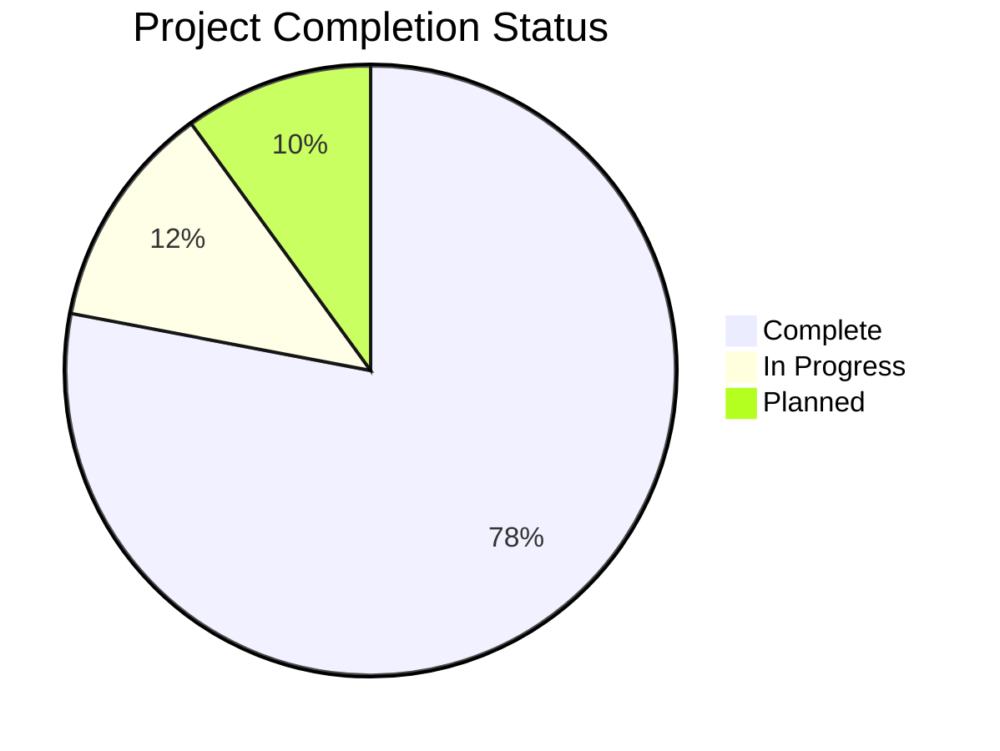
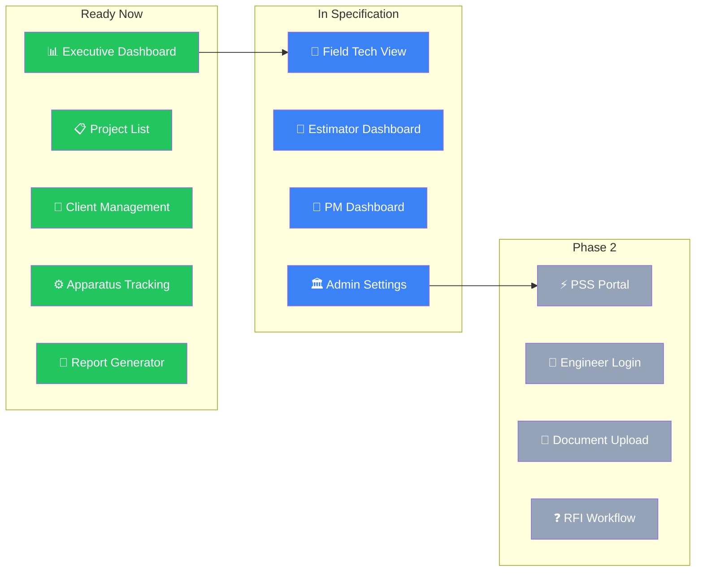
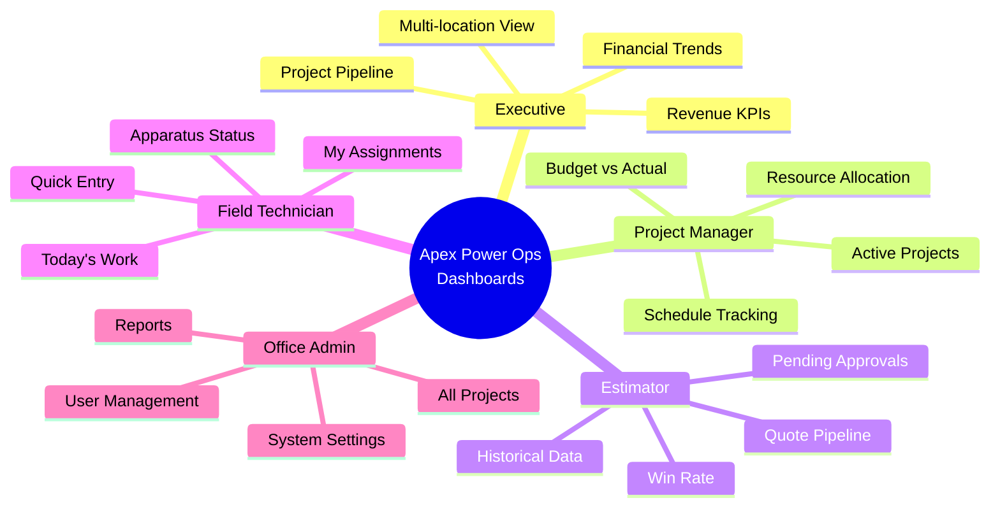
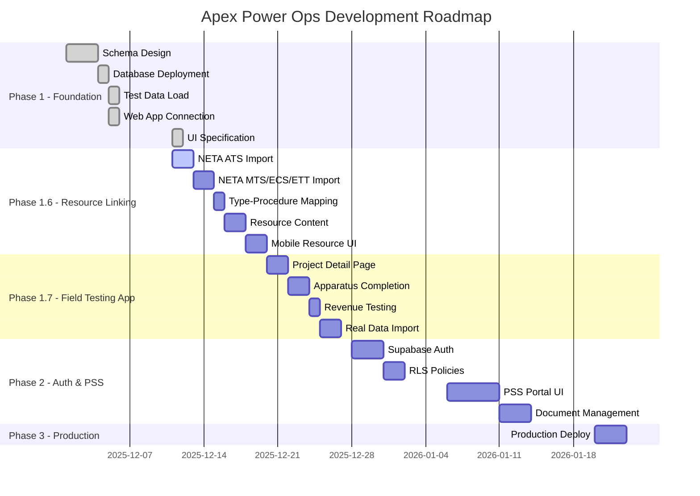

# Apex Power Ops - Project Status

> **Last Updated**: May 6, 2026 (Operations Visibility consumer set closure and AI operator regression rerun)
> **Phase**: Operations Visibility schema live with first governed runtime consumer, NETA Import Complete, Olares bounded private lane operational with daily backup automation and host-owned encrypted offsite cadence
> **See Also**: `PROJECT_OVERVIEW.md` for full system architecture

---

## 🎯 Executive Summary

## 2026 Addendum: Olares Runtime And Private Lane

This document's main body still reflects the December 2025 application and
schema program state. The addendum below records the current bounded Olares
runtime truth so the active operator posture is not left buried only in
handoffs.

### Current Olares Boundary

| Surface | Status | Notes |
|---------|--------|-------|
| Olares workstation rerun surfaces | ✅ Restored | `forms-engine`, `p6-ingest`, canary wrappers, and bounded rerun docs are back in the workspace and validated |
| Governed installed-app set | ✅ Bounded | `forms-engine` and `p6-ingest` remain the only governed installed Olares apps |
| Private personal stack | ✅ Operational | `personal-notes` runs host-only on `127.0.0.1:5230` on the real Olares host |
| Workstation mesh SSH path | ✅ Restored | trusted operator path is `olares@100.64.0.1`, not the public FRP hostname |
| Workstation browser access | ✅ Proven | bounded SSH tunnel from local `127.0.0.1:5231` to host `127.0.0.1:5230` validated the live Memos UI |
| Local backup path | ✅ Tested | backup archive created under `/home/olares/apex-backups/personal/memos/` |
| Local restore path | ✅ Tested | forced restore completed successfully with pre-restore snapshot and post-restore HTTP 200 |
| Workstation backup copy | ✅ Tested | `backup-fetch` now creates the host archive and downloads a separate workstation copy under `$HOME\OlaresPersonalBackups\memos` |
| Workstation restore path | ✅ Tested | `restore-local` now uploads a workstation-held archive back to the host and completes the same forced restore flow successfully |
| Offsite backup mirror | ✅ Tested | `backup-fetch-sync` now mirrors the workstation backup set into `$HOME\OneDrive\OlaresPersonalBackups\memos` |
| Daily backup automation | ✅ Installed | workstation helper now installs the required daily Task Scheduler path for `backup-fetch-sync`; optional logon trigger is machine-policy-blocked and reported honestly |
| One-command operator proof | ✅ Available | `infra/private/run-personal-stack-remote.ps1 -Action status` reports compose state, HTTP health, SQLite summary, latest host backups, workstation backup copies, and the offsite mirror |
| Host-owned encrypted offsite backup | ✅ Tested | helper env was completed on the host, `status` confirmed the Backblaze repository is reachable, `init` confirmed it was already initialized, `backup` saved snapshot `542e7b9f`, and `restore-drill` validated recovery in the isolated drill path |
| Host-owned encrypted offsite automation | ✅ Installed | host helper deployed `/home/olares/code/personal/run-personal-notes-offsite-backup-host.sh`, installed `apex-personal-notes-offsite-backup.timer` for the daily `03:30 UTC` window with `20m` jitter, start-limit controls, and rotated file logs, and `run-now` saved snapshot `76b8155c` with retention prune |
| Host-owned encrypted restore-drill automation | ✅ Installed | host helper deployed `/home/olares/code/personal/run-personal-notes-offsite-restore-drill-host.sh`, installed `apex-personal-notes-offsite-restore-drill.timer` for the weekly Sunday `05:00 UTC` window with `20m` jitter, and `run-now` restored snapshot `76b8155c` into isolated drill root `/home/olares/apex-restore-drills/personal/memos/20260502T182526Z` |
| Next bounded private-lane action | 📝 Optional | keep rerunning the private-lane restore drill and timer status on operator cadence; open a new packet only for wider promotion, auth change, or ingress change |
| Public ingress for the private lane | 🚫 Deferred | the service remains intentionally host-only and outside the governed Olares-installed app surface |

### Current Olares Notes

1. The trusted access route is the restored private mesh path to `100.64.0.1`.
2. The public hostname `jlswen2121.olares.com` is treated as an FRP relay path, not the controlling host SSH surface.
3. The private personal lane is intentionally separate from the governed installed-app surface and does not imply public publication or formal APEX backup posture.
4. The private lane is now operationally complete in bounded scope: runtime, mesh SSH, browser tunnel, host backup, workstation-held backup copy, workstation-mediated offsite mirror, restore, daily backup automation, and status proof are all codified and validated.
5. The host-owned encrypted offsite backup lane is now live and validated in bounded scope: the Backblaze repository is reachable from the Olares host, a fresh `personal-notes` snapshot was written, and the restore drill recovered and validated that snapshot without touching the live runtime.
6. The workstation-mediated OneDrive mirror remains preserved as a secondary off-host copy path, not the only one.
7. The current bounded backup-governance follow-on is now closed through host-owned encrypted offsite automation, recurring restore-drill cadence, and hardened timer controls; the next approved moves remain limited to maintenance reruns unless a later packet intentionally widens scope.
8. The bounded hosted public PM lane is now also closed end-to-end: `https://mutation-seam.apexpowerops.com` serves the live hosted seam over HTTPS, `https://operations.apexpowerops.com` is cut to production deployment `dpl_8kQsnU68Jjej285HbWpEEdRVHDZv`, and the public same-origin PM plus governed promoted-host proof rerun green against the intended custom-domain target.
9. Current near-term program priority is now Olares-first developer-capability hardening and AI-workflow improvement rather than defaulting immediately back to Operations Visibility delivery. This priority shift is explicitly tied to the current field-heavy workload and the goal of reducing prompt-relay and handoff overhead while preserving Olares as the durable development anchor.
10. The first bounded Olares AI-workflow slice is now live in repo-visible form: the admitted minimal MCP trio (`apex-fs`, `apex-db`, `apex-jobs`) has a PowerShell/Bash operator kit, a verification script, a runbook, and updated authority docs that explicitly treat `apex-jobs` plus packet-handoff governance as the current trust boundary.
11. Validation for that first slice passed on the current workstation against the live trio at `127.0.0.1:8710-8712`: filesystem and database MCP contracts resolved, `select 1 as ok` passed, and `apex-jobs` recorded then closed run `1778073356984-cvgk75b3` while reporting active ledger path `/apex-data/apex-jobs-ledger.json`.
12. The same first slice now also passes from the Olares host posture. Over live mesh SSH, `/home/olares/code/apex/apex-power-ops-platform` adopted the already-running trio on `127.0.0.1:8710-8712`, the repaired Bash wrapper returned `PASS`, `select 1 as ok` passed again, and `apex-jobs` recorded then closed host-side run `1778073914623-g2t2zb9j` while health again reported ledger path `/apex-data/apex-jobs-ledger.json`.
13. The host proof exposed and closed two real Bash-surface gaps in the first-slice operator kit: envless host mirrors are now tolerated, and the Bash wrapper now supports adopted-mode operation against an already-running trio instead of assuming it must always start new listeners.
14. That publication and reconciliation gate is now also closed: commit `192f0ae1ef59d4d3f66479189a1dc06d627096be` (`Publish Olares AI workflow first-slice authority`) now governs the first-slice authority set on `origin/clean-main`, and `/home/olares/code/apex` has been restored to clean parity at the same commit.
15. The next post-publication decision is also closed: no `ai_tasks` bridge or wider executor-admission lane is opened yet. The minimal MCP trio plus `apex-jobs` and packet-handoff governance remains the current operational model until a concrete insufficiency is observed.
16. That follow-on publication and reconciliation gate is now also closed: commit `b037df57a823eb4898b32897ae3e1534a9108ee5` (`Publish Olares AI workflow packet 039 and 040 authority`) now governs the Packet 039 closeout and Packet 040 decision surfaces on `origin/clean-main`, and `/home/olares/code/apex` has been restored to clean parity at the same commit.
17. The Olares-first AI workflow tranche is parked at a stable published boundary and its operating model remains the minimal MCP trio plus `apex-jobs` and packet-handoff governance.
18. A new bounded authority objective has now been selected on top of that stable base: Packet 042 reopens only the default Operations Visibility business lane as the next bounded follow-on from the Olares-resident posture.
19. Packet 043 now selects the first truthful post-041 Operations Visibility slice: a bounded schema-deployment preflight around `Supabase/schema/09_schema_additions.sql` and `Supabase/schema/09b_enum_updates.sql`.
20. Packet 044 completed that live preflight and found the `09` schema tranche not execution-ready yet: none of the target columns, operations views, or enum additions were live; the public views in `09_schema_additions.sql` lacked explicit `security_invoker` treatment; and the Supabase advisor path appeared unavailable from this session.
21. Packet 045 remediated the repo-side public-view security posture: all 11 views in `Supabase/schema/09_schema_additions.sql` now use explicit `security_invoker` treatment.
22. Packet 046 then recovered a truthful Supabase management/advisor path from this session by activating the correct Supabase MCP management surfaces: project lookup plus security and performance advisor retrieval now work again against `resa-power-db`.
23. Packet 047 is now complete and applied the bounded `09` Operations Visibility schema tranche live. The first apply attempt exposed two source-local enum dependency defects, so the tranche source was hardened in-place before retry: `apparatus_availability` creation is now rerun-safe, assessment comparisons that reference future enum labels are text-based, and `v_master_operations` no longer assumes the `project_status` enum already contains `In Progress`.
24. Live post-apply verification is complete: the `apparatus_availability` type is present, all 28 target columns landed across `apparatus`, `tasks`, `scopes`, and `projects`, all 11 Operations Visibility views are live, all 11 carry `security_invoker = true`, the three `apparatus_assessment` enum additions are present, and representative views (`v_master_operations`, `v_apparatus_operational`) return live rows.
25. A refreshed Supabase security-advisor pass does not report any of the 11 new `09` views; remaining advisor debt is preexisting legacy surface outside this bounded tranche.
26. Packet 048 is now complete as the first runtime-consumption slice on top of the live `09` schema tranche: `apps/control-plane-api` now exposes a read-only `GET /api/v1/ops/master-operations` seam against `public.v_master_operations`, the focused pytest file passes `6/6`, and `apps/operations-web` now mounts the first governed browser consumer for that seam instead of reopening direct browser-side Supabase admission.
27. Frontend validation for Packet 048 passed through the app-local TypeScript compiler at `apps/operations-web/node_modules/.bin/tsc.cmd` after `pnpm` proved unavailable on the workstation path; editor diagnostics for the touched route, test, and browser-shell files are clean.
28. Packet 049 is now complete as a source-lineage boundary decision: the tracked lineage copy at `apex-power-ops-platform/infra/database/source-lineage/apex-resa/pm-project-pss/schema/09_schema_additions.sql` is intentionally stale reference input, not active migration authority, so the correct fix was explicit drift annotation rather than overwriting the imported snapshot.
29. The lineage note and tracked lineage SQL header now point future operators back to `Supabase/schema/09_schema_additions.sql` as the authoritative executable source and explicitly preserve the imported lineage body for provenance.
30. Packet 050 is now complete as the next adjacent Operations Visibility consumer slice: `apps/control-plane-api` now exposes `GET /api/v1/ops/schedule-health` against `public.v_schedule_health`, the focused pytest file passes `6/6`, and `apps/operations-web` now mounts a governed schedule-health panel alongside the existing master-operations consumer.
31. A live Supabase shape check confirmed `public.v_schedule_health` returns real rows in the current dataset, while `v_resource_allocation` is currently empty; that is why Packet 050 selected schedule health as the truthful next consumer instead of a speculative resource-allocation panel.
32. Packet 051 is now complete as the next adjacent Operations Visibility consumer slice: `apps/control-plane-api` now exposes `GET /api/v1/ops/project-apparatus-summary` against `public.v_project_apparatus_summary`, the focused pytest file passes `6/6`, and `apps/operations-web` now mounts a governed scope-KPI panel as the third browser consumer of the live `09` tranche.
33. A live Supabase shape check confirmed `public.v_project_apparatus_summary` returns real scope-level KPI rows in the current dataset, so Packet 051 selected it ahead of the remaining grouped category and blocker views.
34. Packet 052 is now complete as the next adjacent populated Operations Visibility consumer slice: `apps/control-plane-api` now exposes `GET /api/v1/ops/apparatus-by-category` against `public.v_apparatus_by_category`, the focused pytest file passes `6/6`, and `apps/operations-web` now mounts a governed grouped-category panel as the fourth browser consumer of the live `09` tranche.
35. A live Supabase shape check confirmed `public.v_apparatus_by_category` returns grouped apparatus rows in the current dataset; a first sample query exposed a local column-name mismatch (`percent_complete` vs. `completion_percent`), which was corrected before the slice was implemented.
36. Packet 053 is now complete as the remaining adjacent populated Operations Visibility consumer slice: `apps/control-plane-api` now exposes `GET /api/v1/ops/blockers-summary` against `public.v_blockers_summary`, the focused pytest file passes `6/6`, and `apps/operations-web` now mounts a governed blocker-aggregation panel as the fifth browser consumer of the live `09` tranche.
37. A live Supabase shape check confirmed `public.v_blockers_summary` returns grouped blocker rows in the current dataset with stable fields (`project_number`, `project_name`, `apparatus_type`, `availability`, `blocked_count`, `blocked_hours`, `sample_notes`), so the final populated adjacent consumer could be landed without speculative schema widening.
38. The remaining adjacent `09` views, `public.v_resource_allocation` and `public.v_equipment_needs`, remain live but empty in the current dataset, so the truthful next follow-on is to hold them until live data exists rather than fabricate browser surfaces around zero-row seams.
39. Packet 054 is now complete as a bounded Olares AI operator regression rerun after the Operations Visibility delivery burst: the admitted minimal MCP trio (`apex-fs`, `apex-db`, `apex-jobs`) passed the existing `verify` contract locally from `C:/APEX Platform/apex-power-ops-platform` and from the authoritative host mirror at `/home/olares/code/apex/apex-power-ops-platform` under packet id `2026-05-06-olares-dev-residency-054-minimal-mcp-trio-regression-rerun`.
40. That rerun proved the current Olares-first AI boundary remains intact without widening scope: both surfaces resolved MCP tool contracts, `select 1 as ok` passed through `apex-db`, and `apex-jobs` recorded and closed fresh successful runs (`1778086844597-ehrzzbh7` locally and `1778086865409-c98q1fgl` on host) while the host mirror stayed clean and the old observe-only clone remained untouched.
41. Packet 055 is now complete as the next bounded trigger-reevaluation decision for the still-deferred Operations Visibility seams: a fresh live Supabase count check reconfirmed `public.v_resource_allocation` and `public.v_equipment_needs` both remain at `0` rows, so no new truthful browser consumer opened after Packet 054.
42. That recheck preserved the current boundary instead of fabricating work: the populated consumer set remains closed through Packet 053, the admitted minimal MCP trio remains green through Packet 054, and the empty views stay explicitly deferred on data truth rather than implementation debt.
43. The truthful next follow-on is therefore still to hold the admitted first-slice AI boundary and the empty Operations Visibility seams as-is until a concrete insufficiency, live-data change, or separately bounded admission decision justifies a new packet.



| Milestone | Status | Notes |
|-----------|--------|-------|
| Supabase Schema Design | ✅ Complete | 30 tables, 38+ ENUMs, 12+ triggers |
| Database Deployment | ✅ Complete | All migrations applied |
| Test Data Load | ✅ Complete | LASNAP16 project (47 apparatus) |
| Web App Connection | ✅ Complete | Next.js app fetching from Supabase |
| UI Specification | ✅ Complete | Full spec + v0.dev prompts |
| Role-Based Demo | ✅ Ready | 5-role interactive prototype |
| **NETA Procedures Import** | ✅ Complete | 66 procedures (ATS + MTS) |
| **NETA Test Items** | ✅ Complete | 956 test items across standards |
| **Operations Schema** | ✅ Deployed | `09` tranche live and verified on Supabase |
| Revenue Recognition Flow | ⏳ Ready | Triggers deployed, needs UI testing |
| PSS Portal | 📋 Schema Ready | 6 tables deployed, UI not started |
| Production Deployment | 🔜 Planned | Dev environment only |

---

## 🔥 Current Focus: Operations Visibility (Session 7 Output)

### Requirements Discovery Complete

Key questions answered this session - see `.claude/SESSION_2025-12-11_SCHEMA_OPERATIONS.md`:

1. **Pain Point**: Connecteam shows WHO/WHERE/WHEN, not WHAT can be worked or WHY blocked
2. **Current Workaround**: Excel trackers built to fill visibility gaps
3. **Scaling Problem**: 5→15 projects broke "fits in your head" approach
4. **Success Criteria**: Centralized real-time visibility of everything
5. **MVP**: Operations dashboard answering resource allocation questions

### Schema Additions Deployed And First Runtime Consumer Landed

| File | Contents | Status |
|------|----------|--------|
| `09_schema_additions.sql` | Operational fields + 11 views | ✅ Live on Supabase |
| `09b_enum_updates.sql` | Assessment enum alignment | ✅ Applied live |
| `apps/control-plane-api/services/ops/router.py` | Governed `v_master_operations` read seam | ✅ First consumer API landed |
| `apps/operations-web/app/master-operations-explorer.tsx` | First browser consumer of the governed seam | ✅ Mounted in browser shell |
| `apps/control-plane-api/services/ops/router.py` | Governed `v_schedule_health` read seam | ✅ Adjacent consumer API landed |
| `apps/operations-web/app/schedule-health-explorer.tsx` | Second browser consumer of the governed seam set | ✅ Mounted in browser shell |
| `apps/control-plane-api/services/ops/router.py` | Governed `v_project_apparatus_summary` read seam | ✅ Third consumer API landed |
| `apps/operations-web/app/project-apparatus-summary-explorer.tsx` | Third browser consumer of the governed seam set | ✅ Mounted in browser shell |
| `apps/control-plane-api/services/ops/router.py` | Governed `v_apparatus_by_category` read seam | ✅ Fourth consumer API landed |
| `apps/operations-web/app/apparatus-by-category-explorer.tsx` | Fourth browser consumer of the governed seam set | ✅ Mounted in browser shell |
| `apps/control-plane-api/services/ops/router.py` | Governed `v_blockers_summary` read seam | ✅ Fifth consumer API landed |
| `apps/operations-web/app/blockers-summary-explorer.tsx` | Fifth browser consumer of the governed seam set | ✅ Mounted in browser shell |
| `EXCEL_TO_DATABASE_MAPPING.md` | Field transformation guide | ✅ Complete |

### New Operational Views Designed

| View | Purpose |
|------|---------|
| `v_master_operations` | Multi-project "God View" |
| `v_project_apparatus_summary` | Per-project KPIs |
| `v_resource_allocation` | Where to send people |
| `v_equipment_needs` | Test equipment planning |
| `v_blockers_summary` | What's stopping progress |

---

## 📊 Phase 1.6 Resource Linking (Complete)



### UI Specification Documents

| Document | Location | Purpose |
|----------|----------|---------|
| `UI_SPECIFICATION_GUIDE.md` | `Documentation/07_Application_Specs/` | Complete design system, 927 lines |
| `ROLE_DEMO_PROMPT.md` | `Documentation/07_Application_Specs/` | v0.dev prompt - 5 role views, 1193 lines |
| `REPORT_GENERATOR_DEMO_PROMPT.md` | `Documentation/07_Application_Specs/` | Standalone report flow |
| `FIELD_TECH_APPLICATION_SPEC.md` | `Documentation/07_Application_Specs/` | Mobile field app requirements |

### Role-Based Dashboard Features



---

## 📊 Database Statistics (Dec 11, 2025)

### Table Counts

| Table | Records | Change |
|-------|---------|--------|
| `neta_procedures` | **33** | +33 (NEW) |
| `neta_test_items` | **77** | +77 (NEW) |
| `apparatus` | 47 | - |
| `apparatus_types` | 15 | - |
| `tasks` | 12 | - |
| `resource_assignments` | 8 | - |
| `scope_labor_details` | 6 | - |
| `pss_document_templates` | 6 | - |
| `locations` | 5 | - |
| `employees` | 5 | - |
| `scopes` | 4 | - |
| `estimators` | 2 | - |
| `projects` | 1 | - |
| `clients` | 1 | - |
| `sites` | 1 | - |

### Schema Summary

| Component | Count | Details |
|-----------|-------|---------|
| **Tables** | 30 | Core(5) + Hierarchy(4) + Equipment(3) + Financial(4) + Resource(1) + PSS(6) + NETA(7) |
| **ENUMs** | 38+ | All status types, roles, assessments |
| **Triggers** | 12+ | Rollup counts, revenue recognition, audit |
| **Views** | 15+ | Dashboard aggregations |
| **Indexes** | ~50 | Performance optimization |

---

## 🗺️ Implementation Roadmap



---

## 📋 Task Breakdown by Phase

### Phase 1.6: Resource Linking (Current)

| Task | Owner | Status | Description |
|------|-------|--------|-------------|
| Import ATS procedures | ✅ Desktop | Done | 33 procedures loaded |
| Import ATS test items | VS Code | ⚠️ 5/33 | Continuing from handoff |
| Import MTS-2023 | TBD | ⏳ | ~similar structure |
| Import ECS-2024 | TBD | ⏳ | ~similar structure |
| Import ETT-2022 | TBD | ⏳ | ~similar structure |
| Map apparatus_types | TBD | ⏳ | Populate neta_section columns |
| Create junction records | TBD | ⏳ | apparatus_type_resources |
| Add sample SOPs | TBD | ⏳ | Company procedures |
| Add safety docs | TBD | ⏳ | JSAs, bulletins |
| Resource lookup UI | TBD | ⏳ | Mobile component |

### Phase 1.7: Field Testing App

| Task | Complexity | Description |
|------|------------|-------------|
| Project detail page | Medium | Show scopes, tasks, apparatus hierarchy |
| Apparatus completion UI | Medium | Mark complete with delay hours |
| Test revenue trigger | Low | Complete apparatus, verify revenue |
| Import Garney data | Medium | Real project from Excel tracker |

### Phase 2: PSS Portal

| Task | Complexity | Description |
|------|------------|-------------|
| Engineer portal UI | High | External user interface |
| Supabase Auth setup | Medium | Email/password for engineers |
| Document upload | Medium | Storage bucket integration |
| RFI workflow | Medium | Status transitions, notifications |

---

## 🔧 Technical Reference

### Supabase Connection

```
Project:     resa-power-db
Ref:         fxoyniqnrlkxfligbxmg
API URL:     https://fxoyniqnrlkxfligbxmg.supabase.co
Environment: Development
```

### Legacy External Web App Snapshot

```
External Path: C:\Users\jjswe\Projects\resa-web-app
Framework:   Next.js 16.0.5 (App Router)
React:       19.2.0
UI:          shadcn/ui + Radix + Tailwind CSS
```

### Key Files

| Purpose | Path |
|---------|------|
| Session State | `.claude/STATE.md` |
| Task Coordination | `.claude/COORDINATION.md` |
| NETA Import Handoff | `Supabase/scripts/NETA_IMPORT_HANDOFF.md` |
| UI Specifications | `Documentation/07_Application_Specs/` |
| Schema Reference | `Supabase/SCHEMA_REFERENCE.md` |
| Supabase Client | `legacy external app: resa-web-app/src/lib/supabase.ts` |

---

## 🏷️ Version History

| Date | Version | Changes |
|------|---------|---------|
| 2025-12-05 | 1.0.0 | Initial Supabase deployment |
| 2025-12-05 | 1.0.1 | LASNAP16 test data loaded |
| 2025-12-10 | 1.1.0 | Resource Linking schema deployed |
| 2025-12-11 | 1.2.0 | UI Specification complete |
| 2025-12-11 | **1.3.0** | NETA import started (33 procedures, 77 test items) |
| 2026-05-01 | **1.4.0** | Olares bounded private lane closed operationally: host runtime, mesh SSH, tunnel access, tested backup/restore, and operator proof surface |

---

*Document Version: 1.4.0 | Last Updated: May 1, 2026*
