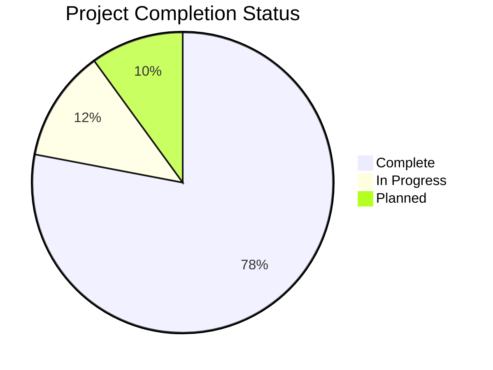
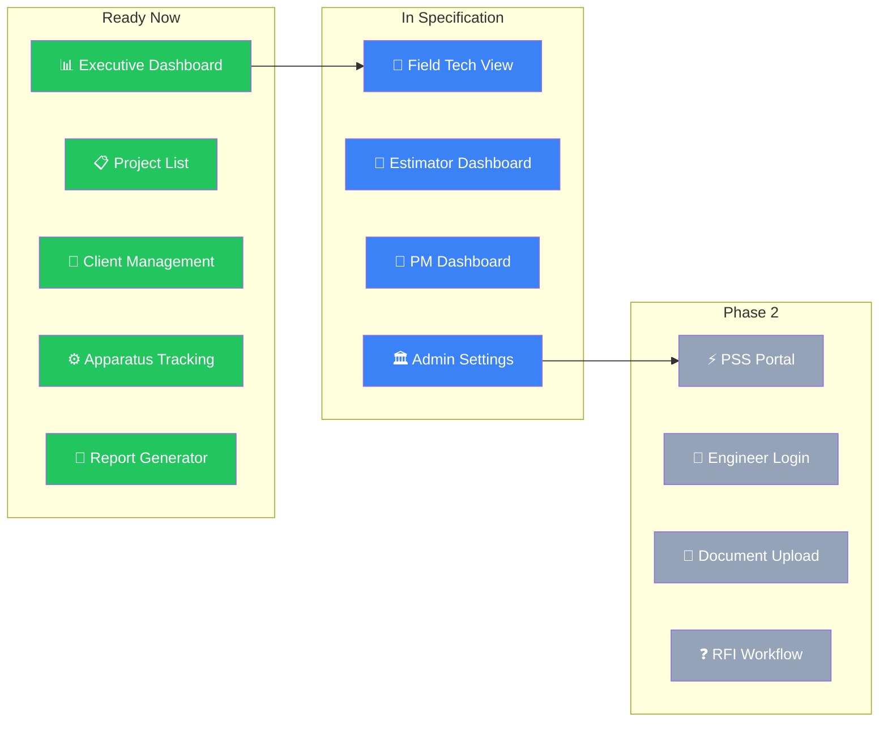
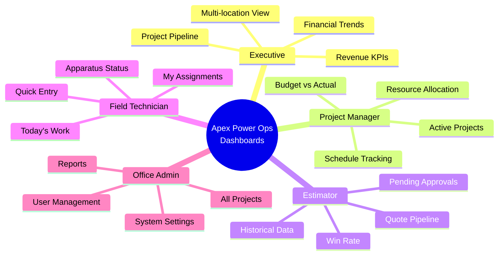
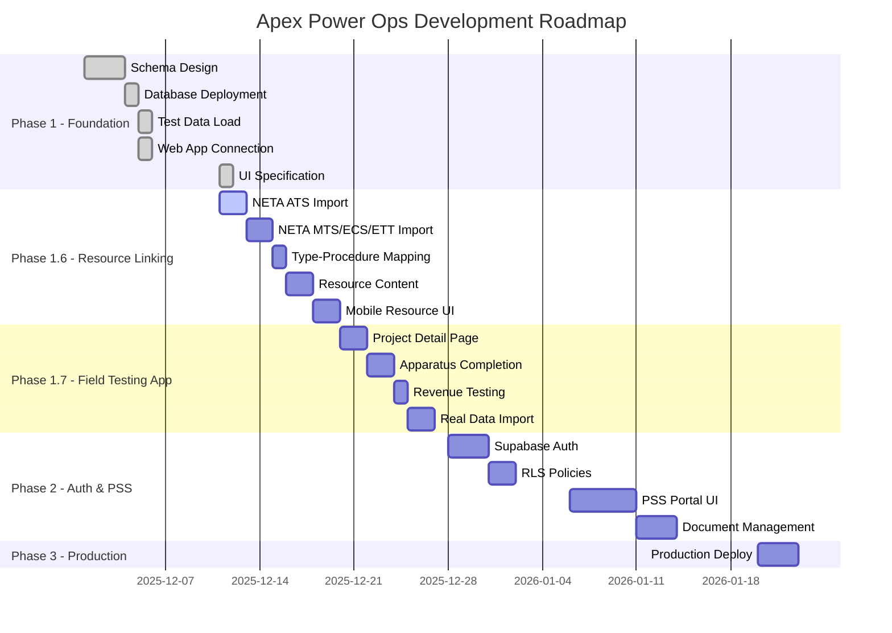

# Apex Power Ops - Project Status

> Repo-owned copy established 2026-05-07 as the canonical in-repo status surface for the future standalone `apex-power-ops-platform/` boundary. Keep the parent-root copy aligned until cutover retirement is complete.

> **Last Updated**: May 8, 2026 (standalone repo cutover complete; Packet 099 post-cutover proof recorded; operator-surface hardening and minimal-trio runtime governance closed)
> **Phase**: Standalone repo boundary live, Olares durable-host workflow active, Operations Visibility schema live with governed consumers, laptop-to-Olares migration in final governance-and-provenance normalization phase
> **See Also**: `PROJECT_OVERVIEW.md` for full system architecture

---

## 🎯 Executive Summary

## 2026-05-07 Addendum: Repo Cutover, Olares Workspace, And Migration Status

This addendum is the current stakeholder-facing status surface for the active Olares workspace and standalone repo-boundary lane.

### What Improved In The Current Cutover And Hardening Pass

| Surface | Status | Notes |
|---------|--------|-------|
| Canonical git boundary | ✅ Complete | `C:/APEX Platform/apex-power-ops-platform` is now the standalone repo root and canonical local implementation surface |
| Canonical remote posture | ✅ Complete | repo flow now targets `https://github.com/jasonlswenson-sys/apex-power-ops.git` on `clean-main` |
| Olares implementation repo root | ✅ Complete | current host execution root is `/home/olares/code/apex/apex-power-ops-platform` |
| Old host clone disposition | ✅ Preserved | `/home/olares/src/apex-power-ops-platform` remains observe-only historical evidence |
| Repo-owned operator docs | ✅ Normalized | README, operator runbook, and cutover packet surfaces now treat the standalone repo root as canonical |
| Host bootstrap git-root logic | ✅ Published | `tools/ai/run-olares-host-bootstrap-status.sh` now reports git state from the implementation repo root rather than the umbrella host path |
| Bash env portability | ✅ Published | repo-owned Bash wrappers now tolerate CRLF `.env.dev` files from the Windows workspace copy |
| Repo-local Python resolution | ✅ Published | operator wrappers and canary entrypoints now resolve Python from repo-local `.venv` or `APEX_PLATFORM_PYTHON` instead of the retired parent-root interpreter path |
| Runtime scratch normalization | ✅ Published | top-level `.tmp/` is now ignored so host and local git status no longer surface wrapper scratch residue |
| Olares host/operator task surface | ✅ Published and mirrored | the authoritative host mirror now carries the repaired repo-root task and bootstrap surfaces cleanly at commit `2122a92ef46d5b44a4f6ff2b9df5fce79ac9d21b` |

### Current Technical-Authority Readout

| Lane | Status | Current interpretation |
|------|--------|------------------------|
| Standalone repo cutover | ✅ Complete | the repo boundary is no longer a planning target; it is the live operating contract |
| Olares durable-host workspace | ✅ Active | Olares is now the intended durable development anchor for Apex Ops work |
| Active operator infrastructure | ✅ Published and mirrored | the repaired operator surfaces are live on `clean-main` and the authoritative host mirror is back to clean parity |
| Minimal MCP trio boundary | ✅ Operator-on-demand baseline | the admitted operator surface exists and validates cleanly, and `not-running` is now the explicit default steady-state posture unless a later packet admits durable runtime |
| Historical parent-root guidance | 🟡 Residual | major active docs are normalized, but historical packet/task residue still exists and must remain clearly marked as provenance, not current workflow |
| Olares roadmap and authority chain | ✅ Controlled | Olares is no longer an open-ended bring-up epic; it is a governed durable-host and migration program with bounded reopen triggers |

### Laptop-To-Olares Migration Status

| Surface | Status | Notes |
|---------|--------|-------|
| Durable host residency | ✅ Complete | Olares host path and repo boundary are established and govern current work |
| Laptop client-only posture | ✅ Substantially complete | the laptop is no longer the intended durable workstation; it is governed as client/access/fallback surface |
| Daily-development center of gravity | ✅ Olares-first and mirrored | governance, pathing, and the repaired operator surfaces now point to Olares first with live mirrored proof on the authoritative host copy |
| Publication-boundary retirement | 🟡 In progress | the standalone repo is canonical, but parent-root historical helper/task residue still exists and must continue to be demoted or clearly marked |
| Full migration closeout | 🟡 Not yet signed off | the lane is beyond topology design, live mirror proof, and the minimal-trio runtime decision; remaining work is now governance cleanup and provenance routing normalization rather than host cutover repair |

### Remaining Highest-Value Items

1. Keep the remaining migration-governance and authority-relocation surfaces aligned until the lane can be closed as fully migrated rather than structurally migrated with historical residue still pending retirement.
2. Continue treating `/home/olares/src/apex-power-ops-platform` as observe-only historical evidence until a later cleanup packet explicitly retires or archives it.
3. Keep the current authoritative host mirror clean at `/home/olares/code/apex/apex-power-ops-platform` and use the repo-owned bootstrap/status surface plus Packet 099 proof as the controlling validation baseline for future Olares operator work.
4. Reopen minimal-trio runtime admission only if a concrete unattended workflow, repeated operator insufficiency, or new validation obligation proves that operator-on-demand is no longer enough.
5. Reopen provenance-routing normalization only if a different current-looking parent-root residue surface, outside the now-relabelled task family, still risks misdirecting active repo-root execution.

### Current Recommended Next Lane

The bounded runtime-governance decision on the admitted minimal MCP trio is now closed.

Packets `2026-05-07-olares-dev-residency-096` through `2026-05-07-olares-dev-residency-098` now close the current-looking parent-root task-surface residue by selecting, executing, and then completing the repo-root task relabel slice across the full surviving task family.

Packet `2026-05-07-olares-dev-residency-099` now closes the next adjacent repo-foundation proof slice by recording fresh canonical repo-root validation and old-clone observation evidence after cutover.

Packet `2026-05-08-olares-dev-residency-100` now closes the next adjacent current-truth authority-normalization slice by updating the repo overview plus the active Olares authority framework and build guide so they no longer describe the retired parent-root boundary as live repo truth.

Packet `2026-05-08-olares-dev-residency-101` now closes the next adjacent parent-root mirror-alignment slice by updating the top-level workspace README, parent-root overview and status mirrors, and the surviving `.claude` git-task note so the umbrella shell is explicitly historical and no longer presents the retired boundary as current operator truth.

Packet `2026-05-08-olares-dev-residency-102` now closes the next adjacent parent-root `.claude` entrypoint-hardening slice by retitling the surviving master/state/decision-log entrypoints as historical parent-root records and adding explicit current-routing blocks so they no longer read like live coordination constitutions for the standalone repo boundary.

Packet `2026-05-08-olares-dev-residency-103` now closes the next adjacent historical-planning demotion slice by hard-marking the early workspace master plan, structure audit, and workspace current-status documents as pre-cutover snapshots instead of active live authority surfaces.

Packet `2026-05-08-olares-dev-residency-104` now closes the next adjacent cutover-stack closeout-normalization slice by updating the repo foundation plan, parent-root classification matrix, authority relocation plan, and publication-boundary dependency inventory so they read as executed closeout guidance rather than stale active launch plans.

Packet `2026-05-08-olares-dev-residency-105` now closes the next adjacent developer-host cutover planning-stack normalization slice by updating the milestone plan, technical plan, and Milestone 1 acceptance checklist so they read as executed cutover baselines rather than active launch surfaces and no longer preserve the retired parent-root publication boundary as current technical truth.

Packet `2026-05-08-olares-dev-residency-106` now closes the next adjacent packet-history routing-ledger demotion slice by reclassifying the old Phase 5 next-task routing handoff as a historical ledger with explicit current-routing redirects instead of a live operator queue.

Packet `2026-05-08-olares-dev-residency-107` now closes the next adjacent handoff-register demotion slice by reclassifying `ops/agents/handoffs/README.md` as a historical register with explicit current-routing redirects instead of a current operator entrypoint.

Packet `2026-05-08-olares-dev-residency-108` now closes the next adjacent individual-handoff demotion slice by reclassifying the parent-root platform-subtree zero-frontier handoff as historical provenance instead of an active subtree checkpoint.

Packet `2026-05-08-olares-dev-residency-109` now closes the next adjacent draft-publication handoff demotion slice by reclassifying the parent-root `pm-schema-001` draft-publication handoff as historical provenance instead of a still-live queue step.

Packet `2026-05-08-olares-dev-residency-110` now closes the next adjacent draft-publication handoff demotion slice by reclassifying the parent-root `pm-schema-002` draft-publication handoff as historical provenance instead of a still-live queue step.

Packet `2026-05-08-olares-dev-residency-111` now closes the next adjacent draft-publication handoff demotion slice by reclassifying the parent-root `pm-schema-003` draft-publication handoff as historical provenance instead of a still-live queue step.

Packet `2026-05-08-olares-dev-residency-112` now closes the next adjacent draft-publication handoff demotion slice by reclassifying the parent-root `pm-schema-004` draft-publication handoff as historical provenance instead of a still-live queue step.

Packet `2026-05-08-olares-dev-residency-113` now closes the next adjacent draft-publication handoff demotion slice by reclassifying the parent-root `pm-schema-005` draft-publication handoff as historical provenance instead of a still-live queue step.

Packet `2026-05-08-olares-dev-residency-114` now closes the next adjacent draft-publication handoff demotion slice by reclassifying the parent-root `pm-schema-006` draft-publication handoff as historical provenance instead of a still-live queue step.

Packet `2026-05-08-olares-dev-residency-115` now closes the next adjacent draft-publication handoff demotion slice by reclassifying the parent-root `pm-schema-007` draft-publication handoff as historical provenance instead of a still-live queue step.

Packet `2026-05-08-olares-dev-residency-116` now closes the next adjacent draft-publication handoff demotion slice by reclassifying the parent-root `pm-schema-008` draft-publication handoff as historical provenance instead of a still-live queue step.

Packet `2026-05-08-olares-dev-residency-117` now closes the next adjacent draft-publication handoff demotion slice by reclassifying the parent-root `pm-schema-009` draft-publication handoff as historical provenance instead of a still-live queue step.

Packet `2026-05-08-olares-dev-residency-118` now closes the next adjacent draft-publication handoff demotion slice by reclassifying the parent-root `pm-schema-010` draft-publication handoff as historical provenance instead of a still-live queue step.

Packet `2026-05-08-olares-dev-residency-119` now closes the next adjacent draft-publication handoff demotion slice by reclassifying the parent-root `pm-schema-011` draft-publication handoff as historical provenance instead of a still-live queue step.

Packet `2026-05-08-olares-dev-residency-120` now closes the next adjacent draft-publication handoff demotion slice by reclassifying the parent-root `pm-schema-012` draft-publication handoff as historical provenance instead of a still-live queue step.

Packet `2026-05-08-olares-dev-residency-121` now closes the next adjacent draft-publication handoff demotion slice by reclassifying the parent-root `pm-schema-013` draft-publication handoff as historical provenance instead of a still-live queue step.

Packet `2026-05-08-olares-dev-residency-122` now closes the next adjacent draft-publication handoff demotion slice by reclassifying the parent-root `pm-schema-014` draft-publication handoff as historical provenance instead of a still-live queue step.

Packet `2026-05-08-olares-dev-residency-123` now closes the next adjacent draft-publication handoff demotion slice by reclassifying the parent-root `pm-schema-015` draft-publication handoff as historical provenance instead of a still-live queue step.

Packet `2026-05-08-olares-dev-residency-124` now closes the next adjacent draft-publication handoff demotion slice by reclassifying the parent-root `pm-schema-016` draft-publication handoff as historical provenance instead of a still-live queue step.

Packet `2026-05-08-olares-dev-residency-125` now closes the next adjacent draft-publication handoff demotion slice by reclassifying the parent-root `pm-schema-017` draft-publication handoff as historical provenance instead of a still-live queue step.

Packet `2026-05-08-olares-dev-residency-126` now closes the next adjacent draft-publication handoff demotion slice by reclassifying the parent-root `pm-schema-018` draft-publication handoff as historical provenance instead of a still-live queue step.

Packet `2026-05-08-olares-dev-residency-127` now closes the next adjacent draft-publication handoff demotion slice by reclassifying the parent-root `pm-schema-019` draft-publication handoff as historical provenance instead of a still-live queue step.

Packet `2026-05-08-olares-dev-residency-128` now closes the next adjacent draft-publication handoff demotion slice by reclassifying the parent-root `pm-schema-019f` draft-publication handoff as historical provenance instead of a still-live queue step.

Packet `2026-05-08-olares-dev-residency-129` now closes the next adjacent draft-publication handoff demotion slice by reclassifying the parent-root `pm-schema-019g` draft-publication handoff as historical provenance instead of a still-live queue step.

Packet `2026-05-08-olares-dev-residency-130` now closes the next adjacent draft-publication handoff demotion slice by reclassifying the parent-root `pm-schema-019h` draft-publication handoff as historical provenance instead of a still-live queue step.

Packet `2026-05-08-olares-dev-residency-131` now closes the next adjacent draft-publication handoff demotion slice by reclassifying the parent-root `pm-schema-019i` draft-publication handoff as historical provenance instead of a still-live queue step.

Packet `2026-05-08-olares-dev-residency-132` now closes the next adjacent draft-publication handoff demotion slice by reclassifying the parent-root `pm-schema-019j` draft-publication handoff as historical provenance instead of a still-live queue step.

Packet `2026-05-08-olares-dev-residency-133` now closes the next adjacent draft-publication handoff demotion slice by reclassifying the parent-root `pm-schema-019k` draft-publication handoff as historical provenance instead of a still-live queue step.

Packet `2026-05-08-olares-dev-residency-134` now closes the next adjacent draft-publication handoff demotion slice by reclassifying the parent-root `pm-schema-ui-002g` draft-publication handoff as historical provenance instead of a still-live queue step.

Packet `2026-05-08-olares-dev-residency-135` now closes the next adjacent draft-publication handoff demotion slice by reclassifying the parent-root `pm-schema-ui-002g` host-variance draft-publication handoff as historical provenance instead of a still-live queue step.

Packet `2026-05-08-olares-dev-residency-136` now closes the next adjacent draft-publication handoff demotion slice by reclassifying the parent-root `pm-schema-ui-002e-host` draft-publication handoff as historical provenance instead of a still-live queue step.

Packet `2026-05-08-olares-dev-residency-137` now closes the next adjacent draft-publication handoff demotion slice by reclassifying the parent-root `pm-schema-ui-002f-host` draft-publication handoff as historical provenance instead of a still-live queue step.

Packet `2026-05-08-olares-dev-residency-138` now closes the next adjacent draft-publication handoff demotion slice by reclassifying the parent-root `pm-schema-ui-001` draft-publication handoff as historical provenance instead of a still-live queue step.

Packet `2026-05-08-olares-dev-residency-139` now closes the next adjacent draft-publication handoff demotion slice by reclassifying the parent-root `pm-schema-ui-002` draft-publication handoff as historical provenance instead of a still-live queue step.

Packet `2026-05-08-olares-dev-residency-140` now closes the next adjacent draft-publication handoff demotion slice by reclassifying the parent-root `pm-schema-ui-003` draft-publication handoff as historical provenance instead of a still-live queue step.

Packet `2026-05-08-olares-dev-residency-141` now closes the next adjacent draft-publication handoff demotion slice by reclassifying the parent-root `pm-schema-ui-004` draft-publication handoff as historical provenance instead of a still-live queue step.

Packet `2026-05-08-olares-dev-residency-142` now closes the next adjacent draft-publication handoff demotion slice by reclassifying the parent-root `pm-schema-ui-005` draft-publication handoff as historical provenance instead of a still-live queue step.

The next truthful repo-structure work is therefore the remaining deeper provenance-routing and residue-retirement work in older individual handoff records and packet-history index surfaces that still preserve pre-cutover operator wording without equivalent current-routing context.

## 2026 Addendum: Olares Runtime And Private Lane

This document's main body still reflects the December 2025 application and
schema program state. The addendum below records the current bounded Olares
runtime truth so the active operator posture is not left buried only in
handoffs.

### Current Olares Boundary

| Surface | Status | Notes |
|---------|--------|-------|
| Olares workstation rerun surfaces | ✅ Restored | `forms-engine`, `p6-ingest`, canary wrappers, and bounded rerun docs are back in the workspace and validated |
| Governed installed-app set | ✅ Bounded | `forms-engine` and `p6-ingest` remain the only governed installed Olares apps |
| Private personal stack | ✅ Operational | `personal-notes` runs host-only on `127.0.0.1:5230` on the real Olares host |
| Workstation mesh SSH path | ✅ Restored | trusted operator path is `olares@100.64.0.1`, not the public FRP hostname |
| Workstation browser access | ✅ Proven | bounded SSH tunnel from local `127.0.0.1:5231` to host `127.0.0.1:5230` validated the live Memos UI |
| Local backup path | ✅ Tested | backup archive created under `/home/olares/apex-backups/personal/memos/` |
| Local restore path | ✅ Tested | forced restore completed successfully with pre-restore snapshot and post-restore HTTP 200 |
| Workstation backup copy | ✅ Tested | `backup-fetch` now creates the host archive and downloads a separate workstation copy under `$HOME\OlaresPersonalBackups\memos` |
| Workstation restore path | ✅ Tested | `restore-local` now uploads a workstation-held archive back to the host and completes the same forced restore flow successfully |
| Offsite backup mirror | ✅ Tested | `backup-fetch-sync` now mirrors the workstation backup set into `$HOME\OneDrive\OlaresPersonalBackups\memos` |
| Daily backup automation | ✅ Installed | workstation helper now installs the required daily Task Scheduler path for `backup-fetch-sync`; optional logon trigger is machine-policy-blocked and reported honestly |
| One-command operator proof | ✅ Available | `infra/private/run-personal-stack-remote.ps1 -Action status` reports compose state, HTTP health, SQLite summary, latest host backups, workstation backup copies, and the offsite mirror |
| Host-owned encrypted offsite backup | ✅ Tested | helper env was completed on the host, `status` confirmed the Backblaze repository is reachable, `init` confirmed it was already initialized, `backup` saved snapshot `542e7b9f`, and `restore-drill` validated recovery in the isolated drill path |
| Host-owned encrypted offsite automation | ✅ Installed | host helper deployed `/home/olares/code/personal/run-personal-notes-offsite-backup-host.sh`, installed `apex-personal-notes-offsite-backup.timer` for the daily `03:30 UTC` window with `20m` jitter, start-limit controls, and rotated file logs, and `run-now` saved snapshot `76b8155c` with retention prune |
| Host-owned encrypted restore-drill automation | ✅ Installed | host helper deployed `/home/olares/code/personal/run-personal-notes-offsite-restore-drill-host.sh`, installed `apex-personal-notes-offsite-restore-drill.timer` for the weekly Sunday `05:00 UTC` window with `20m` jitter, and `run-now` restored snapshot `76b8155c` into isolated drill root `/home/olares/apex-restore-drills/personal/memos/20260502T182526Z` |
| Next bounded private-lane action | 📝 Optional | keep rerunning the private-lane restore drill and timer status on operator cadence; open a new packet only for wider promotion, auth change, or ingress change |
| Public ingress for the private lane | 🚫 Deferred | the service remains intentionally host-only and outside the governed Olares-installed app surface |

### Current Olares Notes

1. The trusted access route is the restored private mesh path to `100.64.0.1`.
2. The public hostname `jlswen2121.olares.com` is treated as an FRP relay path, not the controlling host SSH surface.
3. The private personal lane is intentionally separate from the governed installed-app surface and does not imply public publication or formal APEX backup posture.
4. The private lane is now operationally complete in bounded scope: runtime, mesh SSH, browser tunnel, host backup, workstation-held backup copy, workstation-mediated offsite mirror, restore, daily backup automation, and status proof are all codified and validated.
5. The host-owned encrypted offsite backup lane is now live and validated in bounded scope: the Backblaze repository is reachable from the Olares host, a fresh `personal-notes` snapshot was written, and the restore drill recovered and validated that snapshot without touching the live runtime.
6. The workstation-mediated OneDrive mirror remains preserved as a secondary off-host copy path, not the only one.
7. The current bounded backup-governance follow-on is now closed through host-owned encrypted offsite automation, recurring restore-drill cadence, and hardened timer controls; the next approved moves remain limited to maintenance reruns unless a later packet intentionally widens scope.
8. The bounded hosted public PM lane is now also closed end-to-end: `https://mutation-seam.apexpowerops.com` serves the live hosted seam over HTTPS, `https://operations.apexpowerops.com` is cut to production deployment `dpl_8kQsnU68Jjej285HbWpEEdRVHDZv`, and the public same-origin PM plus governed promoted-host proof rerun green against the intended custom-domain target.
9. Current near-term program priority is now Olares-first developer-capability hardening and AI-workflow improvement rather than defaulting immediately back to Operations Visibility delivery. This priority shift is explicitly tied to the current field-heavy workload and the goal of reducing prompt-relay and handoff overhead while preserving Olares as the durable development anchor.
10. The first bounded Olares AI-workflow slice is now live in repo-visible form: the admitted minimal MCP trio (`apex-fs`, `apex-db`, `apex-jobs`) has a PowerShell/Bash operator kit, a verification script, a runbook, and updated authority docs that explicitly treat `apex-jobs` plus packet-handoff governance as the current trust boundary.
11. Validation for that first slice passed on the current workstation against the live trio at `127.0.0.1:8710-8712`: filesystem and database MCP contracts resolved, `select 1 as ok` passed, and `apex-jobs` recorded then closed run `1778073356984-cvgk75b3` while reporting active ledger path `/apex-data/apex-jobs-ledger.json`.
12. The same first slice now also passes from the Olares host posture. Over live mesh SSH, `/home/olares/code/apex/apex-power-ops-platform` adopted the already-running trio on `127.0.0.1:8710-8712`, the repaired Bash wrapper returned `PASS`, `select 1 as ok` passed again, and `apex-jobs` recorded then closed host-side run `1778073914623-g2t2zb9j` while health again reported ledger path `/apex-data/apex-jobs-ledger.json`.
13. The host proof exposed and closed two real Bash-surface gaps in the first-slice operator kit: envless host mirrors are now tolerated, and the Bash wrapper now supports adopted-mode operation against an already-running trio instead of assuming it must always start new listeners.
14. That publication and reconciliation gate is now also closed: commit `192f0ae1ef59d4d3f66479189a1dc06d627096be` (`Publish Olares AI workflow first-slice authority`) now governs the first-slice authority set on `origin/clean-main`, and `/home/olares/code/apex` has been restored to clean parity at the same commit.
15. The next post-publication decision is also closed: no `ai_tasks` bridge or wider executor-admission lane is opened yet. The minimal MCP trio plus `apex-jobs` and packet-handoff governance remains the current operational model until a concrete insufficiency is observed.
16. That follow-on publication and reconciliation gate is now also closed: commit `b037df57a823eb4898b32897ae3e1534a9108ee5` (`Publish Olares AI workflow packet 039 and 040 authority`) now governs the Packet 039 closeout and Packet 040 decision surfaces on `origin/clean-main`, and `/home/olares/code/apex` has been restored to clean parity at the same commit.
17. The Olares-first AI workflow tranche is parked at a stable published boundary and its operating model remains the minimal MCP trio plus `apex-jobs` and packet-handoff governance.
18. A new bounded authority objective has now been selected on top of that stable base: Packet 042 reopens only the default Operations Visibility business lane as the next bounded follow-on from the Olares-resident posture.
19. Packet 043 now selects the first truthful post-041 Operations Visibility slice: a bounded schema-deployment preflight around `Supabase/schema/09_schema_additions.sql` and `Supabase/schema/09b_enum_updates.sql`.
20. Packet 044 completed that live preflight and found the `09` schema tranche not execution-ready yet: none of the target columns, operations views, or enum additions were live; the public views in `09_schema_additions.sql` lacked explicit `security_invoker` treatment; and the Supabase advisor path appeared unavailable from this session.
21. Packet 045 remediated the repo-side public-view security posture: all 11 views in `Supabase/schema/09_schema_additions.sql` now use explicit `security_invoker` treatment.
22. Packet 046 then recovered a truthful Supabase management/advisor path from this session by activating the correct Supabase MCP management surfaces: project lookup plus security and performance advisor retrieval now work again against `resa-power-db`.
23. Packet 047 is now complete and applied the bounded `09` Operations Visibility schema tranche live. The first apply attempt exposed two source-local enum dependency defects, so the tranche source was hardened in-place before retry: `apparatus_availability` creation is now rerun-safe, assessment comparisons that reference future enum labels are text-based, and `v_master_operations` no longer assumes the `project_status` enum already contains `In Progress`.
24. Live post-apply verification is complete: the `apparatus_availability` type is present, all 28 target columns landed across `apparatus`, `tasks`, `scopes`, and `projects`, all 11 Operations Visibility views are live, all 11 carry `security_invoker = true`, the three `apparatus_assessment` enum additions are present, and representative views (`v_master_operations`, `v_apparatus_operational`) return live rows.
25. A refreshed Supabase security-advisor pass does not report any of the 11 new `09` views; remaining advisor debt is preexisting legacy surface outside this bounded tranche.
26. Packet 048 is now complete as the first runtime-consumption slice on top of the live `09` schema tranche: `apps/control-plane-api` now exposes a read-only `GET /api/v1/ops/master-operations` seam against `public.v_master_operations`, the focused pytest file passes `6/6`, and `apps/operations-web` now mounts the first governed browser consumer for that seam instead of reopening direct browser-side Supabase admission.
27. Frontend validation for Packet 048 passed through the app-local TypeScript compiler at `apps/operations-web/node_modules/.bin/tsc.cmd` after `pnpm` proved unavailable on the workstation path; editor diagnostics for the touched route, test, and browser-shell files are clean.
28. Packet 049 is now complete as a source-lineage boundary decision: the tracked lineage copy at `apex-power-ops-platform/infra/database/source-lineage/apex-resa/pm-project-pss/schema/09_schema_additions.sql` is intentionally stale reference input, not active migration authority, so the correct fix was explicit drift annotation rather than overwriting the imported snapshot.
29. The lineage note and tracked lineage SQL header now point future operators back to `Supabase/schema/09_schema_additions.sql` as the authoritative executable source and explicitly preserve the imported lineage body for provenance.
30. Packet 050 is now complete as the next adjacent Operations Visibility consumer slice: `apps/control-plane-api` now exposes `GET /api/v1/ops/schedule-health` against `public.v_schedule_health`, the focused pytest file passes `6/6`, and `apps/operations-web` now mounts a governed schedule-health panel alongside the existing master-operations consumer.
31. A live Supabase shape check confirmed `public.v_schedule_health` returns real rows in the current dataset, while `v_resource_allocation` is currently empty; that is why Packet 050 selected schedule health as the truthful next consumer instead of a speculative resource-allocation panel.
32. Packet 051 is now complete as the next adjacent Operations Visibility consumer slice: `apps/control-plane-api` now exposes `GET /api/v1/ops/project-apparatus-summary` against `public.v_project_apparatus_summary`, the focused pytest file passes `6/6`, and `apps/operations-web` now mounts a governed scope-KPI panel as the third browser consumer of the live `09` tranche.
33. A live Supabase shape check confirmed `public.v_project_apparatus_summary` returns real scope-level KPI rows in the current dataset, so Packet 051 selected it ahead of the remaining grouped category and blocker views.
34. Packet 052 is now complete as the next adjacent populated Operations Visibility consumer slice: `apps/control-plane-api` now exposes `GET /api/v1/ops/apparatus-by-category` against `public.v_apparatus_by_category`, the focused pytest file passes `6/6`, and `apps/operations-web` now mounts a governed grouped-category panel as the fourth browser consumer of the live `09` tranche.
35. A live Supabase shape check confirmed `public.v_apparatus_by_category` returns grouped apparatus rows in the current dataset; a first sample query exposed a local column-name mismatch (`percent_complete` vs. `completion_percent`), which was corrected before the slice was implemented.
36. Packet 053 is now complete as the remaining adjacent populated Operations Visibility consumer slice: `apps/control-plane-api` now exposes `GET /api/v1/ops/blockers-summary` against `public.v_blockers_summary`, the focused pytest file passes `6/6`, and `apps/operations-web` now mounts a governed blocker-aggregation panel as the fifth browser consumer of the live `09` tranche.
37. A live Supabase shape check confirmed `public.v_blockers_summary` returns grouped blocker rows in the current dataset with stable fields (`project_number`, `project_name`, `apparatus_type`, `availability`, `blocked_count`, `blocked_hours`, `sample_notes`), so the final populated adjacent consumer could be landed without speculative schema widening.
38. The remaining adjacent `09` views, `public.v_resource_allocation` and `public.v_equipment_needs`, remain live but empty in the current dataset, so the truthful next follow-on is to hold them until live data exists rather than fabricate browser surfaces around zero-row seams.
39. Packet 054 is now complete as a bounded Olares AI operator regression rerun after the Operations Visibility delivery burst: the admitted minimal MCP trio (`apex-fs`, `apex-db`, `apex-jobs`) passed the existing `verify` contract locally from `C:/APEX Platform/apex-power-ops-platform` and from the authoritative host mirror at `/home/olares/code/apex/apex-power-ops-platform` under packet id `2026-05-06-olares-dev-residency-054-minimal-mcp-trio-regression-rerun`.
40. That rerun proved the current Olares-first AI boundary remains intact without widening scope: both surfaces resolved MCP tool contracts, `select 1 as ok` passed through `apex-db`, and `apex-jobs` recorded and closed fresh successful runs (`1778086844597-ehrzzbh7` locally and `1778086865409-c98q1fgl` on host) while the host mirror stayed clean and the old observe-only clone remained untouched.
41. Packet 055 is now complete as the next bounded trigger-reevaluation decision for the still-deferred Operations Visibility seams: a fresh live Supabase count check reconfirmed `public.v_resource_allocation` and `public.v_equipment_needs` both remain at `0` rows, so no new truthful browser consumer opened after Packet 054.
42. That recheck preserved the current boundary instead of fabricating work: the populated consumer set remains closed through Packet 053, the admitted minimal MCP trio remains green through Packet 054, and the empty views stay explicitly deferred on data truth rather than implementation debt.
43. The truthful next follow-on is therefore still to hold the admitted first-slice AI boundary and the empty Operations Visibility seams as-is until a concrete insufficiency, live-data change, or separately bounded admission decision justifies a new packet.
44. Packet 056 is now complete as the bounded operator-cadence follow-on to that hold boundary: `tools/ai/check_deferred_ops_view_counts.py`, `tools/ai/run-olares-hold-boundary-check.ps1`, and `tools/ai/run-olares-hold-boundary-check.sh` now give the repo a single cadence surface for the current two trigger classes, and `.vscode/tasks.json` now exposes `Olares hold-boundary cadence check` for workstation reruns.
45. Local validation for Packet 056 passed truthfully through the new PowerShell wrapper: the minimal MCP trio still returned `PASS`, while the deferred-view helper returned `UNAVAILABLE` because the committed `.env.dev` contract resolves to the local developer database rather than a live Supabase DSN with the `09` views. That is the intended honest posture, not a hidden failure.
46. The current reopen trigger remains unchanged: use the new cadence surface with an authoritative live DSN such as `SEAM_DATABASE_URL` when a real deferred-view recheck is needed, and otherwise keep the lane on explicit hold instead of fabricating consumers or widening AI admission.
47. Packet 057 is now complete as the bounded host-portability closeout for that cadence surface: the first host rerun of `bash tools/ai/run-olares-hold-boundary-check.sh` failed because the helper depended on `sqlalchemy`, which is not available on the authoritative Olares mirror.
48. The repair kept the boundary tight instead of adding host dependencies: `tools/ai/check_deferred_ops_view_counts.py` now queries through the admitted `apex-db` MCP surface, and both `run-minimal-mcp-trio` wrappers now prefer `SEAM_DATABASE_URL` so the same bounded path can target a live DSN when one is explicitly supplied.
49. Host rerun then passed truthfully from `/home/olares/code/apex/apex-power-ops-platform`: `minimal_mcp=PASS`, `deferred_ops=UNAVAILABLE`, and the new decision text now correctly states that authoritative deferred-view rechecks require `apex-db` to be running against a live DSN such as `SEAM_DATABASE_URL`, not the default development database surface.
50. Packet 058 is now complete as the governed live-DSN follow-on to that cadence surface: `.secrets/SUPABASE_CREDENTIALS.md` provided the current bounded secret source, `tools/ai/check_deferred_ops_view_counts.py` now supports an explicit direct-connection path when a live DSN is intentionally supplied, and the PowerShell wrapper reran against the live Supabase session-pooler DSN with `minimal_mcp=PASS` and `deferred_ops=HOLD`.
51. That live proof converts the boundary from generic `UNAVAILABLE` into a real defer decision on data truth: authoritative counts for `public.v_resource_allocation` and `public.v_equipment_needs` both remain `0`, so the deferred Operations Visibility seams stay on hold because they are still empty, not because the cadence surface is missing.
52. The host mirror still cannot execute the same live-DSN recheck end to end because `/home/olares/code/apex/apex-power-ops-platform` currently lacks every local live-query fallback beyond the adopted default `apex-db` surface: no `sqlalchemy`, no `psql`, no resolvable `pg`, and no repo-local `services/mcp/apex-db` tree. The Bash wrapper was therefore hardened to degrade truthfully back to `UNAVAILABLE` instead of failing when that host posture is asked to use a live DSN.
53. Packet 059 is now complete as the post-058 boundary decision: a separate host-query-engine lane is not opened now because Packet 058 already established the controlling business truth from a governed live-DSN workstation path and no current Operations Visibility trigger depends on authoritative host-side live querying.
54. That decision preserves the lower-variance Olares boundary instead of solving the wrong problem: the next truthful reopen trigger remains a live-data change in `public.v_resource_allocation` or `public.v_equipment_needs`, not the fact that the current host mirror lacks an extra live-query engine.
55. The current hold posture is therefore explicit on both axes: workstation live-DSN reruns can produce a real `HOLD` or `REOPEN` verdict when needed, while `/home/olares/code/apex/apex-power-ops-platform` continues to return a truthful `UNAVAILABLE` for that same live-DSN path until a later packet proves a concrete need to widen host query capability.
56. Packet 060 is now complete as the post-059 dormancy verdict for this bounded Olares follow-on: because Packet 059 concluded no host-query-engine lane should open now and no other current packet candidate remains inside the admitted boundary, the truthful lane state is no longer merely active hold but dormant-until-trigger.
57. That dormancy state is narrow and evidence-bound, not abandonment: the lane remains authorable immediately if either deferred view gains live rows or a concrete later requirement specifically depends on authoritative live-DSN execution from `/home/olares/code/apex` rather than the already-proven workstation path.
58. Until one of those triggers appears, no new Olares packet is required for this hold-boundary branch; the published operator surface, live-DSN workstation proof, truthful host graceful-degrade behavior, and current `HOLD` verdict are the complete closeout state.
59. Packet 061 is now complete as the post-060 continuation decision for the broader Olares-first program: both currently active bounded follow-ons are now parked on truthful dormancy rules, so the next active lane is no longer empty-view hold work or simultaneous-worker reopening by default.
60. Packet 061 selects a planning-only host-resident developer-workflow hardening lane as the next truthful Olares-first follow-on. That choice consumes the current durable-host reality instead of reopening dormant branches: `/home/olares/code/apex` is already the authoritative mirror, the minimal MCP trio plus `apex-jobs` is already the active AI/operator boundary, and the remaining Olares-first value now lies in reducing host-resident development friction rather than widening product or infrastructure scope speculatively.
61. The selected next lane is still bounded and non-executing at this packet: it authorizes a later planning surface to inventory concrete host-resident workflow friction and pick one smallest hardening slice, while keeping the deferred Operations Visibility branch trigger-bound, the simultaneous-worker branch trigger-bound, broader AI-services expansion closed, and GitHub-canonical publication unchanged.
62. Packet 062 is now complete as that planning surface. The controlling friction is not missing host authority, but fragmented host entrypoints: the durable host cutover plan, the general operator bootstrap runbook, the minimal MCP runbook, and the current tasks surface all exist, but there is still no single repo-owned host bootstrap/status surface that tells an operator whether the canonical mirror, toolchain paths, minimal MCP boundary, and current hold-boundary posture are ready from `/home/olares/code/apex`.
63. Packet 062 therefore selects one smallest hardening slice for later execution: add a bounded host-resident workflow bootstrap/status operator surface, with a matching runbook and task entry, that reports mirror path/parity, host toolchain presence, minimal MCP readiness, and hold-boundary status without widening into installs, runtime mutation, or AI-service expansion.
64. That selected slice keeps the broader Olares-first program disciplined: it hardens the already-proven durable-host workflow directly, leaves both dormant branches closed until their triggers occur, and preserves GitHub-canonical publication plus the current minimal MCP trio trust boundary.
65. Packet 063 is now complete as the execution of that selected hardening slice. The repo now includes a bounded host bootstrap/status operator surface at `apex-power-ops-platform/tools/ai/run-olares-host-bootstrap-status.sh` that composes the already-admitted durable-host checks instead of inventing new runtime behavior.
66. That new surface reports one truthful host-resident readiness view only: parent-root host commit and cleanliness, old-clone observe-only state, materialized host toolchain presence, minimal MCP trio readiness, and the current hold-boundary result from the authoritative host posture.
67. Packet 063 also closes a nearby operator-surface defect uncovered during execution: the existing VS Code task for the hold-boundary cadence surface was still pointing at a non-existent parent-root `tools/ai` path, so the task now targets the real platform-root script location and the new host bootstrap/status task is added alongside it.
68. The execution remains tightly bounded: no installs, no package or lockfile mutation, no runtime or service mutation, no AI-services expansion, no Git hosting change, and no dormant-branch reopening were required to land the new host workflow status surface.
69. Packet 064 is now complete as the bounded publication and host-mirror resync gate for Packet 062 planning authority and Packet 063 execution authority. The host bootstrap/status operator surface, its task/runbook updates, and the continuation-planning artifacts are now published on `origin/clean-main` and mirrored back onto `/home/olares/code/apex` in clean parity.
70. That closeout preserves the intended lane discipline: the new host workflow hardening surface is now real and durable in the authoritative host mirror, while the deferred Operations Visibility hold branch and the simultaneous-worker branch both remain dormant under their published trigger rules.
71. A new current stakeholder-facing authority surface now exists for the Olares workspace operating model at `apex-power-ops-platform/docs/architecture/OLARES-ONE-WORKSPACE-DESIGN-GOVERNANCE-AND-IMPLEMENTATION-PLAN-2026-05-06.md`. It consolidates the live design constraints, governance rules, approved environment and tooling posture, operator process, and remaining implementation plan that were previously split across the framework, roadmap, cutover plans, and packet chain.
72. The root `WORKSPACE_DESIGN.md` and `WORKSPACE_PROTOCOL.md` files are now explicitly historical reference surfaces rather than current Olares governance. They remain useful as early conceptual context, but the current authoritative operating model is the GitHub-canonical parent-root mirror at `C:/APEX Platform` and `/home/olares/code/apex`, with `apex-power-ops-platform` as the active implementation surface and the laptop governed as a client-only surface.
73. The next truthful Olares follow-on after Packet 064 is therefore not generic workspace redesign. It is a bounded decision on whether any additional host-resident workflow-hardening slice is still needed now that the host bootstrap/status surface exists and the current design/governance/plan are consolidated into one repo-owned authority document.
74. That authority-consolidation tranche is now also published and mirrored: commit `ecfe18015c9c15cef16f3fb668fdfc56db7c909f` (`Consolidate Olares workspace authority`) is live on `origin/clean-main`, `/home/olares/code/apex` is restored to clean parity at the same commit, and `/home/olares/src/apex-power-ops-platform` remains preserved observe-only at `2836a2622309b4e146ca24f23b5bf87312c0c857` with status count `30`.
75. Packet 068 is now complete as the post-067 follow-on decision and selects one additional bounded workflow-hardening slice at the root entrypoint layer: the new Olares authority and host bootstrap surfaces are published, but the root `README.md` and `PROJECT_OVERVIEW.md` still left operators entering through stale or unqualified routing.
76. Packet 069 is now complete as that bounded execution slice. The root `README.md` now routes readers first to the live Olares authority and operator runbook, and `PROJECT_OVERVIEW.md` now carries a concise current Olares operating note so the 2025 platform snapshot is not mistaken for the current Olares workspace operating model.
77. That root-entrypoint tranche is now also published and mirrored: commit `75cecbb6f2ce72399c290257fe8e36d3f03cf322` (`Refresh Olares root entry routing`) is live on `origin/clean-main`, `/home/olares/code/apex` is restored to clean parity at the same commit, and `/home/olares/src/apex-power-ops-platform` remains preserved observe-only at `2836a2622309b4e146ca24f23b5bf87312c0c857` with status count `30`.
78. Packet 071 is now complete as the post-070 follow-on decision for the current host-workflow-hardening lane. With the durable-host bootstrap/status surface published, the current Olares workspace authority consolidated, and the root entrypoints refreshed, no additional host-workflow-hardening slice is justified on current evidence.
79. The truthful lane state therefore returns to explicit dormancy until new friction appears. Reopen this lane only if a concrete operator-routing, durable-host validation, publication-parity, or authority-discoverability problem emerges that is not already closed by the current runbook, status surface, and root entrypoint chain.
80. That dormancy decision is now also published and mirrored: commit `5006b2348d8170ecb97e9d1e1aa5c44f7cab6f22` (`Park Olares host workflow lane`) is live on `origin/clean-main`, `/home/olares/code/apex` is restored to clean parity at the same commit, and `/home/olares/src/apex-power-ops-platform` remains preserved observe-only at `2836a2622309b4e146ca24f23b5bf87312c0c857` with status count `30`.
81. Packet 073 is now complete as the post-072 governance-alignment decision. With the host-workflow-hardening lane explicitly dormant, the next concrete friction is the older Olares roadmap still presenting several generic Phase 2 through Phase 4 items as blank open queue work rather than as current trigger-based guardrails.
82. Packet 074 is now complete as that bounded roadmap-trigger realignment slice. The Olares roadmap now reclassifies those older generic backlog items into maintained rerun surfaces, preserved limitation boundaries, and trigger-gated governance rules so the repo-visible authority no longer implies that Olares remains an always-open execution epic.
83. Packet 075 is now complete as that publication and host-mirror resync closeout for the roadmap-trigger realignment tranche.
84. Packet 075 published the governance-realignment tranche in commit `aebe4f95a9502dc30772f06bd6b977cd6d70071f` (`Realign Olares roadmap triggers`), pushed `origin/clean-main`, restored `/home/olares/code/apex` to clean parity at the same commit, and preserved `/home/olares/src/apex-power-ops-platform` observe-only at `2836a2622309b4e146ca24f23b5bf87312c0c857` with status count `30`.
85. Packet 076 is now complete as the post-075 discoverability decision surface. With Olares back to explicit trigger-based dormancy, the next concrete friction is no longer missing host workflow hardening but fragmented lane-frontier visibility: later sessions still reconstruct current lane truth across status, authority, roadmap, and packet surfaces, and the Olares roadmap still cited a non-existent top-authority file in active dependency text.
86. Packet 077 is now complete as that bounded PM operating cockpit and authority-reference realignment slice. The repo now includes `apex-power-ops-platform/docs/architecture/APEX-PM-LANE-OPERATING-COCKPIT-2026-05-06.md` as a compact current lane register, the active Olares authority doc now points to that cockpit as a companion surface, and the roadmap no longer relies on the missing `Infrastructure/APEX_Platform_Operating_Model_and_Governance.md` path in its active dependency and further-reading sections.
87. Packet 078 is now complete as the publication and host-mirror resync closeout for the PM operating cockpit tranche.
88. Packet 078 published the cockpit tranche in commit `0168bb955daa5010e9e222fbccbab3fa4f5e9aad` (`Add APEX PM lane cockpit`), pushed `origin/clean-main`, restored `/home/olares/code/apex` to clean parity at the same commit, and preserved `/home/olares/src/apex-power-ops-platform` observe-only at `2836a2622309b4e146ca24f23b5bf87312c0c857` with status count `30`.
89. Packet 079 is now complete as the smallest truthful post-078 correction slice. It records that the new compact PM cockpit briefly lagged the latest published Olares frontier by one tranche, so the Olares developer-residency row was synchronized to the Packet 078 closeout state instead of remaining implicitly parked at the earlier Packet 075 wording.
90. Packet 080 is now complete as the publication and host-mirror resync closeout for that cockpit state-sync correction.
91. Packet 080 published the correction tranche in commit `ac7b62176e8a7dcec23f8c37c88ff49034732655` (`Sync APEX PM cockpit frontier`), pushed `origin/clean-main`, restored `/home/olares/code/apex` to clean parity at the same commit, and preserved `/home/olares/src/apex-power-ops-platform` observe-only at `2836a2622309b4e146ca24f23b5bf87312c0c857` with status count `30`.
92. Packet 081 is now complete as the root-cause wording hardening for the compact PM cockpit. Rather than continuing to sync packet numbers after each bounded closeout, the Olares developer-residency row now uses durable frontier wording so it stays truthful as later Olares publication-only slices close.
93. Packet 082 is now complete as the publication and host-mirror resync closeout for that durable-wording hardening.
94. Packet 082 published the durable-wording tranche in commit `d716afca77f8159986eaf5aa80d6a1c2803a6534` (`Harden APEX PM cockpit wording`), pushed `origin/clean-main`, restored `/home/olares/code/apex` to clean parity at the same commit, and preserved `/home/olares/src/apex-power-ops-platform` observe-only at `2836a2622309b4e146ca24f23b5bf87312c0c857` with status count `30`.
95. Packet 083 is now complete as the governing migration-alignment slice for the Olares program. The controlling directive is now explicit across the active authority chain: all Apex Ops work top to bottom should migrate to Olares so governance, protocol, and execution method do not fragment back toward the field laptop.
96. Packet 083 updates the active Olares authority, cutover technical and milestone baselines, PM cockpit, roadmap, and routing surfaces so Olares is no longer framed as merely a bounded support lane. GitHub remains canonical and the current `C:/APEX Platform` publication boundary remains transitional rather than silently becoming the long-term operating model.
97. Packet 084 is now complete as the publication and host-mirror resync closeout for that governing migration alignment.
98. Packet 084 published the alignment tranche in commit `52e2de103ed51c6a944681bf47ddc4f95a1c8ed2` (`Align Olares migration governance`), pushed `origin/clean-main`, restored `/home/olares/code/apex` to clean parity at the same commit, and preserved `/home/olares/src/apex-power-ops-platform` observe-only at `2836a2622309b4e146ca24f23b5bf87312c0c857` with status count `30`.
99. Packet 085 is now complete as the first concrete follow-on from that governing alignment. It inventories the remaining dependencies that still keep `C:/APEX Platform` active as the transitional publication boundary and routes the next Olares slice to the host-native operator publication workflow as the highest-leverage retirement target.
100. Packet 085 records four active dependency classes: Windows-root publication control, Windows-first operator publication flow in the bootstrap runbook, parent-root strategic/status authority that still spans outside the platform subtree, and active lane READMEs that still normalize Windows-local execution examples.
101. Packet 086 is now complete as the publication and host-mirror resync closeout for that dependency-inventory slice.
102. Packet 086 published the dependency-inventory tranche in commit `20f8940e98b08a79fe7e77a7e7f6e31b21e422d9` (`Inventory Olares publication boundary dependencies`), pushed `origin/clean-main`, restored `/home/olares/code/apex` to clean parity at the same commit, and preserved `/home/olares/src/apex-power-ops-platform` observe-only at `2836a2622309b4e146ca24f23b5bf87312c0c857` with status count `30`.
103. Packet 087 is now complete as the first retirement-target execution slice. It adds a dedicated host-native operator publication workflow authority surface, updates the operator runbook and platform README to prefer Olares-hosted staging and staged-diff review, and adds admitted Olares-host git helper tasks without silently retiring the current transitional publication boundary.
104. Packet 087 keeps GitHub canonical, keeps `C:/APEX Platform` as the explicit transitional publication boundary, and routes the next Olares slice to the highest-traffic lane README command surfaces that still normalize Windows-local execution.
105. Packet 088 is now complete as the publication and host-mirror resync closeout for that host-native operator workflow tranche.
106. Packet 088 published the host-native operator workflow tranche in commit `14f31e67e7eed582ee328bcd913d5d9244a2c126` (`Author Olares host-native publication workflow`), pushed `origin/clean-main`, restored `/home/olares/code/apex` to clean parity at the same commit, and preserved `/home/olares/src/apex-power-ops-platform` observe-only at `2836a2622309b4e146ca24f23b5bf87312c0c857` with status count `30`.
107. Packet 089 is now complete as the next routed retirement slice. It normalizes the highest-traffic lane README command surfaces so `apps/operations-web`, `apps/control-plane-api`, and `packages/forms-engine` now present Olares-hosted execution from `/home/olares/code/apex/apex-power-ops-platform` as the default operator posture while preserving Windows client fallback.
108. Packet 089 keeps GitHub canonical, keeps `C:/APEX Platform` as the explicit transitional publication boundary, and limits this slice to documentation-only command normalization rather than runtime or package mutation.
109. Packet 090 is now complete as the publication and host-mirror resync closeout for that README-normalization tranche.
110. Packet 090 published the README-normalization tranche in commit `3c065a1e2757eaab94f0902b06a6d6240ae0fffb` (`Normalize Olares lane README commands`), pushed `origin/clean-main`, restored `/home/olares/code/apex` to clean parity at the same commit, and preserved `/home/olares/src/apex-power-ops-platform` observe-only at `2836a2622309b4e146ca24f23b5bf87312c0c857` with status count `30`.
111. Packet 091 is now complete as the original build-guide modernization execution slice. It refreshes `Infrastructure/Olares_Build_Guide.md`, `Infrastructure/Olares_Checklist.md`, `Infrastructure/VSCode_Build_Prompt.md`, and `Infrastructure/Olares_Architecture.svg` so they align with whole-project Olares governance, keep GitHub canonical, keep the laptop client-only, prefer Claude Code plus Codex monthly-plan use, and treat Ollama/local models as optional rather than mandatory.
112. Packet 091 also realigns the build-guide stack back to the admitted minimal MCP trio `apex-fs`, `apex-db`, and `apex-jobs` instead of silently reopening broader AI-service scope.
113. Packet 092 is now complete as the required publication and host-mirror resync gate for that build-guide modernization tranche.
114. Packet 092 published the build-guide modernization and visual-alignment tranche in commit `60e71c32e1196bfbec40980df7c5a71ed25610de` (`Modernize Olares build guidance`), then recorded the publication closeout in commit `3644c6d7ed218396c43d63d01a9f97693be08883` (`Close Olares build guidance publication`) so `origin/clean-main` and `/home/olares/code/apex` now both sit clean at the final durable head `3644c6d7ed218396c43d63d01a9f97693be08883`; `/home/olares/src/apex-power-ops-platform` remains observe-only at `2836a2622309b4e146ca24f23b5bf87312c0c857` with status count `30`.
115. Packet 093 is now complete as the adjacent authority/operator drift normalization slice that followed the build-guide closeout. It tightens `Infrastructure/Olares_Workspace_Authority_Framework.md`, `apex-power-ops-platform/docs/architecture/OLARES-WORKSTATION-BRING-UP-CHECKLIST-2026-04-23.md`, and `apex-power-ops-platform/docs/architecture/OLARES-AI-WORKFLOW-FIRST-SLICE-RUNBOOK-2026-05-06.md` so services-zone baseline versus deferred services is explicit, the workstation rerun checklist proves only the admitted minimal MCP trio, and Codex is treated as an approved premium-plan interactive surface without claiming wrapper-level admission.
116. Packet 094 is now complete as the required publication and host-mirror resync gate for that adjacent drift-normalization tranche. It published commit `9d6a583e15fda4e72066addb0f1744c121d2ccd7` (`Normalize Olares adjacent authority drift`), pushed `origin/clean-main`, restored `/home/olares/code/apex` to clean parity at the same commit, and preserved `/home/olares/src/apex-power-ops-platform` observe-only at `2836a2622309b4e146ca24f23b5bf87312c0c857` with status count `30`.
117. The governed PM route-promotion lane is now locally revalidated end to end on the current workstation. `apps/mutation-seam` served live reads on `127.0.0.1:8000`, `apps/operations-web` served the promoted PM surfaces on `localhost:3000`, the focused approval-context browser proof passed, and `corepack pnpm --dir "c:\APEX Platform\apex-power-ops-platform" --filter @apex/operations-web smoke:pm-live-data -- --operations-web-base-url http://127.0.0.1:3000 --mutation-seam-base-url http://127.0.0.1:8000` reran green against the local seam plus governed ingress.
118. That rerun also closed a local dev-surface warning that had started polluting the proof lane: `apps/operations-web/next.config.ts` now admits loopback dev origins (`127.0.0.1`, `::1`), so the PM smoke can use the same `127.0.0.1` operations-web base URL without emitting the Next.js `allowedDevOrigins` warning during local proof.
119. The adjacent local-runtime hygiene slice is now also closed for the governed PM proof lane. `apps/operations-web` was upgraded from Next `16.0.10` to `16.2.5`, `next.config.ts` now aligns `outputFileTracingRoot` and `turbopack.root` at the monorepo root, the stale `baseline-browser-mapping` warning no longer appears during `pnpm dev`, the earlier `util._extend` / `DEP0060` noise no longer reproduces under live `/pm-review` and `/pm-review/approval` requests on the upgraded server, and the existing `smoke:pm-live-data` proof reran green against the upgraded app plus the local seam.
120. Repo structure is now elevated to the top active platform priority. The new authority surface `apex-power-ops-platform/docs/architecture/APEX-REPO-FOUNDATION-AND-CUTOVER-PLAN-2026-05-07.md` now states the explicit target: `apex-power-ops-platform/` must become the canonical git root, `C:/APEX Platform` must be retired as the durable publication boundary, and the remaining parent-root authority, archive, and source-lane residue must be classified and cut over deliberately instead of being allowed to harden into the permanent repo shell.
121. The first executable repo-cutover artifact is now in place: `apex-power-ops-platform/docs/architecture/APEX-PARENT-ROOT-CLASSIFICATION-MATRIX-2026-05-07.md` classifies the current `C:/APEX Platform` top-level items into canonical-repo, external-source, workstation-local, archive, or retire-after-verification classes so future cutover work can proceed from an explicit promote/keep/archive map instead of broad topology debate.
122. The canonical repo-boundary execution gate now also exists: `apex-power-ops-platform/docs/architecture/APEX-CANONICAL-REPO-CUTOVER-CHECKLIST-2026-05-07.md` defines the auditable entry criteria, phased cutover steps, no-go conditions, and required evidence for retiring `C:/APEX Platform` as the durable publication boundary and promoting `apex-power-ops-platform/` into the real git root.
123. The live authority relocation map is now also in place: `apex-power-ops-platform/docs/architecture/APEX-AUTHORITY-RELOCATION-PLAN-2026-05-07.md` identifies the highest-priority parent-root authority dependencies (`Platform-Authority/`, `Infrastructure/`, `PROJECT_STATUS.md`, and `PROJECT_OVERVIEW.md`), assigns target destinations inside the canonical repo, and defines which files should be moved directly, mirrored then demoted, superseded, or retired during cutover.
124. The `services/` ambiguity is now resolved at the repo-structure level: `apex-power-ops-platform/docs/architecture/APEX-SERVICES-AND-ROOT-RESIDUE-DECISION-2026-05-07.md` defines `apex-power-ops-platform/services/` as the only canonical top-level services lane, rejects `C:/APEX Platform/services/` as a parallel steady-state namespace, and requires the parent-root `services/mcp/apex-p6` residue to be reconciled file-by-file or retired rather than silently absorbed during cutover.
125. The repo-first VS Code entry contract now also exists: `apex-power-ops-platform/APEX Power Ops Platform.code-workspace` is the new canonical workspace artifact, and `apex-power-ops-platform/docs/architecture/APEX-WORKSPACE-ENTRYPOINT-DECISION-2026-05-07.md` records that the parent-root `APEX Platform.code-workspace` is transitional retire-after-verify residue rather than the preferred steady-state entrypoint.
126. The first live authority-index re-home step is now complete inside the repo: `apex-power-ops-platform/docs/authority/README.md` no longer describes itself as a bridge-only placeholder and now acts as the repo-owned authority index, listing local authority docs first and treating `C:/APEX Platform/Platform-Authority/` as inherited strategic input until the broader relocation plan finishes.
127. The first parent-root `Infrastructure/` authority surface is now re-homed into the repo: `apex-power-ops-platform/docs/authority/OLARES-WORKSPACE-AUTHORITY-FRAMEWORK.md` now serves as the repo-owned Olares workspace authority framework, and the active README, Olares governance, PM cockpit, roadmap dependency, and private-stack surfaces now point to that repo-owned copy rather than the parent-root `Infrastructure/Olares_Workspace_Authority_Framework.md` path.
128. The adjacent Olares operator guidance surface is now also re-homed into the repo: `apex-power-ops-platform/docs/authority/OLARES-BUILD-GUIDE.md` now serves as the repo-owned build-guide copy, and the active repo README, authority index, and roadmap dependency surface now point to that repo-owned path rather than the parent-root `Infrastructure/Olares_Build_Guide.md` path.
129. The adjacent Olares operator checklist and build-session bootstrap are now also re-homed into the repo-owned operations lane: `apex-power-ops-platform/docs/operations/OLARES-CHECKLIST.md` now serves as the repo-owned provisioning checklist and `apex-power-ops-platform/docs/operations/OLARES-VSCODE-BUILD-SESSION-PROMPT.md` now serves as the repo-owned non-authority execution bootstrap, while the active README and authority framework now point to those repo-owned paths instead of the parent-root `Infrastructure/Olares_Checklist.md` and `Infrastructure/VSCode_Build_Prompt.md` files.
130. The `services/mcp/apex-p6` residue state is now explicitly recorded: parent-root `C:/APEX Platform/services/mcp/apex-p6` currently contains only a stray `package-lock.json`, while repo-owned `apex-power-ops-platform/services/mcp/apex-p6` is the live runtime lane referenced by `infra/compose.dev.yml` but currently holds only `build/` and `node_modules/` material with no visible source manifest, so future cutover work must retire the parent-root lockfile residue and separately reconcile the repo-owned lane back to an explicit source-of-truth contract.
131. The parent-root status and overview disposition is now decided: `PROJECT_STATUS.md` and `PROJECT_OVERVIEW.md` now have repo-root copies at `apex-power-ops-platform/PROJECT_STATUS.md` and `apex-power-ops-platform/PROJECT_OVERVIEW.md`, the canonical repo path is explicitly repo-root rather than `docs/architecture/`, and the parent-root copies are now transitional mirrors to keep aligned until the old publication boundary is retired.
132. The bounded `apex-p6` source-of-truth reconciliation slice is now closed: the repo-owned lane at `apex-power-ops-platform/services/mcp/apex-p6` now has a tracked `package.json`, `tsconfig.json`, `README.md`, and `src/` bridge sources, `pnpm-workspace.yaml` now admits `services/mcp/*` as workspace packages, `corepack pnpm --filter apex-p6 build` passed, and the parent-root stray `services/mcp/apex-p6/package-lock.json` residue was retired after verification.
133. The remaining active parent-root Olares roadmap dependency is now re-homed into the repo plan lane: `apex-power-ops-platform/plan/Olares_MVP_Execution_Roadmap.md` now carries the original first-run MVP sequencing baseline inside the canonical repo boundary, the repo README, authority framework, build-session prompt, and live Olares roadmap now point to that repo-owned path, and the parent-root `Infrastructure/Olares_MVP_Execution_Roadmap.md` file is now explicitly a historical aligned copy rather than the preferred reference path.
134. The remaining active Olares visual architecture asset is now re-homed into the canonical repo boundary: `apex-power-ops-platform/docs/authority/Olares_Architecture.svg` now serves as the repo-owned companion asset for the build-guide stack, the parent-root `Infrastructure/Olares_Architecture.svg` file is now explicitly an aligned historical mirror, and the repo no longer relies on a parent-root-only visual dependency for the active Olares build guidance surface.
135. The parent-root `Platform-Authority/README.md` bridge is now demoted from active entrypoint status: `apex-power-ops-platform/docs/authority/README.md` now carries the strategic authority order and interpretation rules inside the canonical repo boundary, the repo-owned index remains the first stop for active authority routing, and the parent-root README is now explicitly an aligned historical mirror while the underlying strategic documents are relocated or superseded individually.
136. The master strategic unification surface is now re-homed into the canonical repo boundary: `apex-power-ops-platform/docs/authority/PLATFORM-UNIFICATION-MASTER-AUTHORITY-2026-04-12.md` now serves as the repo-owned entry document for the inherited strategic stack, `docs/authority/README.md` lists it as a repo-owned authority surface rather than an inherited dependency, and the parent-root `Platform-Authority/PLATFORM-UNIFICATION-MASTER-AUTHORITY-2026-04-12.md` file is now explicitly an aligned historical mirror.
137. The strategic platform blueprint is now re-homed into the canonical repo boundary: `apex-power-ops-platform/docs/authority/UNIFIED-PLATFORM-BLUEPRINT-2026-04-12.md` now serves as the repo-owned future-state platform-design surface, `docs/authority/README.md` lists it as a repo-owned authority surface rather than an inherited dependency, and the parent-root `Platform-Authority/UNIFIED-PLATFORM-BLUEPRINT-2026-04-12.md` file is now explicitly an aligned historical mirror.
138. The older target-topology sketch is now formally superseded instead of inherited: `apex-power-ops-platform/docs/architecture/APEX-REPO-FOUNDATION-AND-CUTOVER-PLAN-2026-05-07.md` is now the active repo-shape authority, `docs/authority/README.md` no longer treats `Platform-Authority/MONOREPO-TARGET-TOPOLOGY-2026-04-12.md` as an inherited dependency, and the parent-root topology doc remains only as historical design input and provenance.
139. The strategic multi-agent governance surface is now re-homed into the canonical repo boundary: `apex-power-ops-platform/docs/authority/MULTI-AGENT-OPERATING-MODEL-2026-04-12.md` now serves as the repo-owned multi-agent operating model, `docs/authority/README.md` lists it as a repo-owned authority surface rather than an inherited dependency, and the parent-root `Platform-Authority/MULTI-AGENT-OPERATING-MODEL-2026-04-12.md` file is now explicitly an aligned historical mirror.
140. The platform data and schema strategy is now re-homed into the canonical repo boundary: `apex-power-ops-platform/docs/authority/PLATFORM-DATA-AND-SCHEMA-STRATEGY-2026-04-12.md` now serves as the repo-owned schema strategy surface, `docs/authority/README.md` lists it as a repo-owned authority surface rather than an inherited dependency, the PM schema draft packets now point at the repo-owned authority path, and schema review/design are now explicitly gated on technical authority review and approval before implementation-ready or SQL-authoring decisions are treated as valid.
141. The older migration roadmap is now formally superseded instead of inherited: `apex-power-ops-platform/docs/architecture/APEX-REPO-FOUNDATION-AND-CUTOVER-PLAN-2026-05-07.md` now carries the active repo-boundary migration authority, `apex-power-ops-platform/plan/infrastructure-olares-full-implementation-roadmap-1.md` now carries the live execution sequencing, `docs/authority/README.md` no longer treats `Platform-Authority/MIGRATION-ROADMAP-2026-04-12.md` as an inherited dependency, and the parent-root roadmap remains only as historical planning input and provenance.
142. The parent-root Supabase report workflow note is now verified historical-only rather than a pending operational relocation: the repo already preserves the design surface at `apex-power-ops-platform/docs/architecture/apex-lineage/automation-reporting/SUPABASE_REPORT_WORKFLOW.md`, the relocation and parent-root classification plans now record that the parent-root copy should not be treated as active workflow authority, and `C:/APEX Platform/SUPABASE_REPORT_WORKFLOW.md` is now explicitly marked as historical design input and provenance.
143. The parent-root `README.md` and repo-root onboarding chain are now aligned with the repo-first authority model: `C:/APEX Platform/README.md` now behaves as workstation-umbrella guidance rather than project authority, `apex-power-ops-platform/README.md` now routes strategic authority through `docs/authority/README.md`, the canonical-repo cutover checklist records the README/bootstrap wording fix as closed, and the platform lane READMEs under `apps/` and `packages/` no longer send operators first to `C:/APEX Platform/Platform-Authority/`.
144. The parent-root `.claude` continuity lane is now decomposed instead of treated as one unresolved bucket: `.claude/MASTER.md`, `.claude/STATE.md`, `.claude/SESSION_LOG.md`, and `.claude/BACKLOG.md` are now explicitly marked as historical coordination residue with routing notes toward repo-owned authority, status, roadmap, and packet surfaces, and the remaining extraction path was narrowed specifically to the AI orchestration decisions in `.claude/DECISION_LOG.md`.
145. The last active parent-root `.claude` dependency is now closed as a repo-owned supersession rather than a lingering authority gap: the surviving current AI orchestration decisions from `.claude/DECISION_LOG.md` Section 8 now live in `apex-power-ops-platform/docs/architecture/OLARES-AI-ORCHESTRATION-DECISION-SURFACE-2026-05-07.md`, the AI first-slice runbook now points to that repo-owned decision surface, the relocation and classification plans now treat `.claude/DECISION_LOG.md` as provenance instead of active authority, and the parent-root decision log is now explicitly a historical decision record rather than the preferred current-truth entrypoint.
146. The parent-root overview mirror is now explicitly demoted instead of merely implied: `apex-power-ops-platform/PROJECT_OVERVIEW.md` remains the canonical repo-owned overview surface, `C:/APEX Platform/PROJECT_OVERVIEW.md` now states its aligned-mirror role at the top of the file, and the relocation plus parent-root classification plans now record the overview as a verified mirror rather than an unresolved active authority dependency.
147. The parent-root workspace artifact no longer opens the mixed umbrella root: `C:/APEX Platform/APEX Platform.code-workspace` now acts as a compatibility shim that opens `apex-power-ops-platform/`, the workspace-entry decision doc records that narrowed compatibility posture, and the parent-root classification matrix now treats the file as retire-after-verify residue that no longer normalizes the umbrella root as the steady-state VS Code entry contract.
148. The parent-root status mirror is now explicitly demoted instead of merely implied: `apex-power-ops-platform/PROJECT_STATUS.md` remains the canonical repo-owned status surface, `C:/APEX Platform/PROJECT_STATUS.md` now states its aligned-mirror role at the top of the file, and the relocation plus parent-root classification plans now record the status surface as a verified mirror rather than an unresolved active authority dependency.
149. The remaining parent-root workspace-design references are now verified as historical-only instead of semi-live guidance: `C:/APEX Platform/WORKSPACE_DESIGN.md` and `C:/APEX Platform/WORKSPACE_PROTOCOL.md` already carried historical framing, but their current-routing notes now point first to the repo-owned `apex-power-ops-platform/docs/authority/OLARES-WORKSPACE-AUTHORITY-FRAMEWORK.md`, and the parent-root classification matrix now records both files as verified historical-only design/protocol context rather than generic residue awaiting later interpretation.
150. The repo-first workspace path now has a repo-owned Copilot instruction surface instead of depending only on the parent root: `apex-power-ops-platform/.github/copilot-instructions.md` now exists as the canonical repo-boundary copy, `C:/APEX Platform/.github/copilot-instructions.md` now states its aligned-mirror role, and the parent-root classification matrix now treats `.github/` as partially reconciled governance residue with workflow migration still remaining as a separate cutover sub-lane.
151. The parent-root archive notice is now explicitly historical instead of quietly stale: `C:/APEX Platform/ARCHIVE_NOTICE.md` now identifies itself as archive-boundary guidance rather than operating authority, its current-working section now routes readers to the canonical repo entry, status, overview, and authority surfaces, and the parent-root classification matrix now records it as verified historical archive guidance rather than an unresolved archive-lane ambiguity.
152. The `apex-power-ops-platform-clean-main-reconcile/` lane is now explicitly demoted from accidental entrypoint status: its root `README.md` now states that it is a bounded historical reconcile worktree rather than the canonical repo home, and the parent-root classification matrix now records that directory as a verified `clean-main` reconciliation worktree rather than a generic unresolved top-level folder.
153. The `.github/` split is now documented precisely instead of left as generic residue: the canonical workflow definitions are confirmed under `apex-power-ops-platform/.github/workflows/`, the cutover checklist now marks that presence gate complete while keeping parent-root workflow retirement as a separate unchecked step, the publication-boundary dependency inventory now states that `C:/APEX Platform/.github/workflows/` remains the publishable GitHub Actions lane until git-boundary cutover, and the parent-root classification matrix now treats the root `.github/` folder as a publishable mirror rather than an unspecified leftover.
154. The deploy-worktree shell is now explicitly marked instead of left unexplained: `C:/APEX Platform/apex-power-ops-platform-deploy-worktree/README.md` now states that the directory is bounded deploy-oriented residue and not the canonical repo home, and the parent-root classification matrix now records that lane as verified operational residue rather than a parallel topology candidate.
155. The root untracked-file snapshot is now explicitly demoted from accidental status-surface ambiguity: `C:/APEX Platform/untracked_files_root.txt` now states that it is only a point-in-time parent-root audit snapshot, and the parent-root classification matrix now records it as verified transient audit residue rather than a free-floating operational artifact.
156. The `.gitignore` split is now explicit instead of implicit: `C:/APEX Platform/.gitignore` now states that it is the active parent-root git-boundary ignore surface until cutover, while the parent-root classification matrix now records that file as verified git-boundary residue to retire once `apex-power-ops-platform/.gitignore` becomes the only active ignore contract.
157. The cutover planning surfaces are now tightened around the real remaining blockers instead of generic residue cleanup: the canonical cutover checklist now enumerates the current git-boundary blockers explicitly, the Olares publication-boundary dependency inventory now shifts from older Windows-first documentation cleanup toward standalone git-root execution, workflow-mirror retirement, ignore-contract retirement, and Olares parity reattachment, and the repo-foundation plan now states that the next repo-structure priority is cutover-only execution readiness rather than more broad classification setup.
158. The first concrete cutover-blocker reduction is now landed in operator tooling rather than only in planning: the high-traffic git helper tasks in `.vscode/tasks.json` now resolve the current parent git root dynamically from the workspace location instead of hardcoding `C:/APEX Platform`, the operator bootstrap runbook now mirrors that dynamic fallback pattern, repo-owned authority sources are now listed before parent-root provenance in the runbook, and the local validation baseline now points at `apex-power-ops-platform/apps/control-plane-api` rather than the stale parent-root app path.
159. The operator bootstrap runbook is now internally consistent about the repo-local control-plane lane instead of mixing subtree-local and parent-root-relative references: Windows bootstrap commands now install dependencies from `apex-power-ops-platform/apps/control-plane-api`, Windows fallback examples now reuse a `platformRoot` variable rather than repeating a fixed literal path string, direct script entry points now reference `apps/control-plane-api/...`, the local contract source list now points to the repo-owned control-plane docs and checklist, and the dry-run validation example now invokes the repo-local control-plane script path from the subtree root.
160. The current-boundary staging helper surface is narrower again: the remaining non-draft parent-root packet tasks in `.vscode/tasks.json` now resolve the current parent git root dynamically instead of hardcoding `C:/APEX Platform`, including the Class A scaffold packet, package source packet, operations-web runtime packet, mutation-seam runtime packet, control-plane core/support/tests packets, residual scaffold packet, infra/docs packets, knowledge-operation packets, the residual archive formula pair, and the shared `Platform subtree staged diff` helper. The remaining parent-root task debt is now concentrated in the historical draft-packet helper tail and the still-live publication boundary itself rather than in the active non-draft helper surface.
161. The repo README now matches the current operator contract instead of lagging behind the runbook: the Windows parent-root git fallback now derives the current parent git root from `platformRoot`, the README explicitly states that the remaining draft-packet task tail is historical rather than the default operator path, repo-local `apps/control-plane-api/...` references now replace older `../apps/...` references for direct scripts and contract surfaces, and the hosted rerun checklist reference now points to the repo-local control-plane lane.
162. The remaining repo-structure work now has a concrete execution surface instead of only blocker lists: `docs/architecture/APEX-GIT-BOUNDARY-CUTOVER-EXECUTION-PACKET-2026-05-07.md` now defines the standalone git-boundary cutover event with required access, prerequisite evidence capture, controlled boundary-creation and Olares-reattachment phases, explicit no-go conditions, and rollback rules, while the canonical cutover checklist now treats that packet as an entry criterion rather than an eventual placeholder.
163. The historical draft-packet helper tail in `.vscode/tasks.json` no longer hardcodes `C:/APEX Platform`: the remaining draft packet preview, stage, and staged-diff tasks now derive the current parent git root from `${workspaceFolder}` just like the active task surface, which means the residual task debt is now historical naming and publication-boundary posture rather than fixed-path Windows command assumptions.
164. The remaining parent-root publication-surface blocker is now operationalized instead of implied: `docs/architecture/APEX-PARENT-ROOT-WORKFLOW-AND-IGNORE-RETIREMENT-PACKET-2026-05-07.md` now defines the post-cutover retirement event for the parent-root workflow mirror and active ignore contract, the publication-boundary dependency inventory now reflects that the runbook’s remaining dependency is the transitional parent-root boundary rather than a fixed `Set-Location 'C:/APEX Platform'` literal, and the canonical cutover checklist now requires that retirement packet to exist before the actual boundary move closes.
165. Pre-cutover evidence has now exposed the controlling git-boundary blocker explicitly: `docs/architecture/APEX-GIT-BOUNDARY-CUTOVER-PREFLIGHT-EVIDENCE-2026-05-07.md` records that both the live local parent-root boundary and the Olares parent-root mirror still point at `https://github.com/jasonlswenson-sys/RESA-Power-Project-Management.git` on `clean-main` commit `3a5b3bb99bd581bed67cd89e739cf41c19c193d1`, not at the intended canonical repo `jasonlswenson-sys/apex-power-ops`, so the cutover execution packet and checklist now treat remote-target reconciliation as an explicit no-go condition rather than an implicit assumption.
166. The remote-target mapping is now explicitly decided rather than left as an unresolved blocker: `docs/architecture/APEX-REMOTE-TARGET-RECONCILIATION-DECISION-2026-05-07.md` records that `jasonlswenson-sys/apex-power-ops` is the standalone canonical target while the current `RESA-Power-Project-Management` remote is preserved as lineage source only, and the cutover execution packet plus checklist now require the actual boundary move to follow that mapping instead of mutating the dirty parent-root remote in place.
167. The cutover packet no longer pretends the subtree can attach directly to the current target branch: preflight checks now show that `jasonlswenson-sys/apex-power-ops` `clean-main` is reachable but resolves to the same parent-root-shaped commit tree as `C:/APEX Platform`, so the preflight evidence, remote-reconciliation decision, execution packet, and checklist now all treat subtree-rooted history generation for prefix `apex-power-ops-platform/` as a required cutover step rather than an optional implementation detail.
168. The subtree-rooted history requirement is now backed by a concrete candidate artifact instead of only theory: `git subtree split --prefix=apex-power-ops-platform clean-main` completed successfully from `C:/APEX Platform` and produced candidate commit `dd781695006f159f204ab20eaa20adf5e296772c`, which is now recorded in the preflight evidence, execution packet, and checklist as the current non-destructive re-root candidate for the standalone cutover path.
169. The cutover candidate is now published to the intended canonical repo without mutating `clean-main`: subtree commit `dd781695006f159f204ab20eaa20adf5e296772c` has been pushed to `jasonlswenson-sys/apex-power-ops` as branch `clean-main-cutover-subtree-candidate-2026-05-07`, so the remaining git-boundary work is no longer “produce subtree-rooted history” but “attach the standalone boundary and Olares mirror to that published subtree-rooted staging branch in a governed way.”
170. The local standalone repo boundary is now materially real instead of only documented: `C:/APEX Platform/apex-power-ops-platform/.git` has been initialized, `origin` now points at `https://github.com/jasonlswenson-sys/apex-power-ops.git`, and the local branch `clean-main-cutover-subtree-candidate-2026-05-07` now tracks the published subtree-root staging branch. The cutover lane is therefore past history generation and local boundary creation; the remaining boundary work is canonical-branch promotion, Olares reattachment, and retirement of the parent-root publication surfaces.
171. Olares host reattachment is now materially real instead of blocked on SSH path proof: the authenticated Control Hub terminal confirmed both `/home/olares/code/apex/apex-power-ops-platform` and `/home/olares/src/apex-power-ops-platform`, preserved the observe-only clone on `clean-main`, and initialized `/home/olares/code/apex/apex-power-ops-platform/.git` under user `olares` so the host implementation surface now tracks `origin/clean-main-cutover-subtree-candidate-2026-05-07` at `https://github.com/jasonlswenson-sys/apex-power-ops.git`. The remaining cutover work is now final canonical-branch promotion plus retirement of the parent-root publication boundary.
172. Canonical branch promotion is now materially complete instead of remaining a staging-only plan: `jasonlswenson-sys/apex-power-ops` `clean-main` now points at subtree-root commit `dd781695006f159f204ab20eaa20adf5e296772c`, backup branch `clean-main-parent-root-pre-cutover-2026-05-07` preserves the old parent-root-shaped head at `3a5b3bb99bd581bed67cd89e739cf41c19c193d1`, and both the workstation repo plus the Olares host implementation repo now track canonical `clean-main`.
173. The default operator contract now matches the post-cutover repo truth instead of the old parent-root publication boundary: `.vscode/tasks.json`, `README.md`, and `docs/OPERATOR-BOOTSTRAP-RUNBOOK.md` now treat `apex-power-ops-platform/` as the standalone repo root, repo-relative pathspec staging is now the default helper contract, and the Olares host helper tasks now execute directly from `/home/olares/code/apex/apex-power-ops-platform`.
174. The parent-root workflow and ignore retirement closeout is now materially recorded instead of remaining an open dependency: the publication-boundary retirement inventory, canonical cutover checklist, and workflow/ignore retirement packet now all treat the parent-root `.github/workflows/` file as historical mirror residue, treat the parent-root `.gitignore` as umbrella-only scope, and record that canonical Apex Ops publication now comes only from `apex-power-ops-platform/` and its Olares mirror.



| Milestone | Status | Notes |
|-----------|--------|-------|
| Supabase Schema Design | ✅ Complete | 30 tables, 38+ ENUMs, 12+ triggers |
| Database Deployment | ✅ Complete | All migrations applied |
| Test Data Load | ✅ Complete | LASNAP16 project (47 apparatus) |
| Web App Connection | ✅ Complete | Next.js app fetching from Supabase |
| UI Specification | ✅ Complete | Full spec + v0.dev prompts |
| Role-Based Demo | ✅ Ready | 5-role interactive prototype |
| **NETA Procedures Import** | ✅ Complete | 66 procedures (ATS + MTS) |
| **NETA Test Items** | ✅ Complete | 956 test items across standards |
| **Operations Schema** | ✅ Deployed | `09` tranche live and verified on Supabase |
| Revenue Recognition Flow | ⏳ Ready | Triggers deployed, needs UI testing |
| PSS Portal | 📋 Schema Ready | 6 tables deployed, UI not started |
| Production Deployment | 🔜 Planned | Dev environment only |

---

## 🔥 Current Focus: Operations Visibility (Session 7 Output)

### Requirements Discovery Complete

Key questions answered this session - see `.claude/SESSION_2025-12-11_SCHEMA_OPERATIONS.md`:

1. **Pain Point**: Connecteam shows WHO/WHERE/WHEN, not WHAT can be worked or WHY blocked
2. **Current Workaround**: Excel trackers built to fill visibility gaps
3. **Scaling Problem**: 5→15 projects broke "fits in your head" approach
4. **Success Criteria**: Centralized real-time visibility of everything
5. **MVP**: Operations dashboard answering resource allocation questions

### Schema Additions Deployed And First Runtime Consumer Landed

| File | Contents | Status |
|------|----------|--------|
| `09_schema_additions.sql` | Operational fields + 11 views | ✅ Live on Supabase |
| `09b_enum_updates.sql` | Assessment enum alignment | ✅ Applied live |
| `apps/control-plane-api/services/ops/router.py` | Governed `v_master_operations` read seam | ✅ First consumer API landed |
| `apps/operations-web/app/master-operations-explorer.tsx` | First browser consumer of the governed seam | ✅ Mounted in browser shell |
| `apps/control-plane-api/services/ops/router.py` | Governed `v_schedule_health` read seam | ✅ Adjacent consumer API landed |
| `apps/operations-web/app/schedule-health-explorer.tsx` | Second browser consumer of the governed seam set | ✅ Mounted in browser shell |
| `apps/control-plane-api/services/ops/router.py` | Governed `v_project_apparatus_summary` read seam | ✅ Third consumer API landed |
| `apps/operations-web/app/project-apparatus-summary-explorer.tsx` | Third browser consumer of the governed seam set | ✅ Mounted in browser shell |
| `apps/control-plane-api/services/ops/router.py` | Governed `v_apparatus_by_category` read seam | ✅ Fourth consumer API landed |
| `apps/operations-web/app/apparatus-by-category-explorer.tsx` | Fourth browser consumer of the governed seam set | ✅ Mounted in browser shell |
| `apps/control-plane-api/services/ops/router.py` | Governed `v_blockers_summary` read seam | ✅ Fifth consumer API landed |
| `apps/operations-web/app/blockers-summary-explorer.tsx` | Fifth browser consumer of the governed seam set | ✅ Mounted in browser shell |
| `EXCEL_TO_DATABASE_MAPPING.md` | Field transformation guide | ✅ Complete |

### New Operational Views Designed

| View | Purpose |
|------|---------|
| `v_master_operations` | Multi-project "God View" |
| `v_project_apparatus_summary` | Per-project KPIs |
| `v_resource_allocation` | Where to send people |
| `v_equipment_needs` | Test equipment planning |
| `v_blockers_summary` | What's stopping progress |

---

## 📊 Phase 1.6 Resource Linking (Complete)



### UI Specification Documents

| Document | Location | Purpose |
|----------|----------|---------|
| `UI_SPECIFICATION_GUIDE.md` | `Documentation/07_Application_Specs/` | Complete design system, 927 lines |
| `ROLE_DEMO_PROMPT.md` | `Documentation/07_Application_Specs/` | v0.dev prompt - 5 role views, 1193 lines |
| `REPORT_GENERATOR_DEMO_PROMPT.md` | `Documentation/07_Application_Specs/` | Standalone report flow |
| `FIELD_TECH_APPLICATION_SPEC.md` | `Documentation/07_Application_Specs/` | Mobile field app requirements |

### Role-Based Dashboard Features



---

## 📊 Database Statistics (Dec 11, 2025)

### Table Counts

| Table | Records | Change |
|-------|---------|--------|
| `neta_procedures` | **33** | +33 (NEW) |
| `neta_test_items` | **77** | +77 (NEW) |
| `apparatus` | 47 | - |
| `apparatus_types` | 15 | - |
| `tasks` | 12 | - |
| `resource_assignments` | 8 | - |
| `scope_labor_details` | 6 | - |
| `pss_document_templates` | 6 | - |
| `locations` | 5 | - |
| `employees` | 5 | - |
| `scopes` | 4 | - |
| `estimators` | 2 | - |
| `projects` | 1 | - |
| `clients` | 1 | - |
| `sites` | 1 | - |

### Schema Summary

| Component | Count | Details |
|-----------|-------|---------|
| **Tables** | 30 | Core(5) + Hierarchy(4) + Equipment(3) + Financial(4) + Resource(1) + PSS(6) + NETA(7) |
| **ENUMs** | 38+ | All status types, roles, assessments |
| **Triggers** | 12+ | Rollup counts, revenue recognition, audit |
| **Views** | 15+ | Dashboard aggregations |
| **Indexes** | ~50 | Performance optimization |

---

## 🗺️ Implementation Roadmap



---

## 📋 Task Breakdown by Phase

### Phase 1.6: Resource Linking (Current)

| Task | Owner | Status | Description |
|------|-------|--------|-------------|
| Import ATS procedures | ✅ Desktop | Done | 33 procedures loaded |
| Import ATS test items | VS Code | ⚠️ 5/33 | Continuing from handoff |
| Import MTS-2023 | TBD | ⏳ | ~similar structure |
| Import ECS-2024 | TBD | ⏳ | ~similar structure |
| Import ETT-2022 | TBD | ⏳ | ~similar structure |
| Map apparatus_types | TBD | ⏳ | Populate neta_section columns |
| Create junction records | TBD | ⏳ | apparatus_type_resources |
| Add sample SOPs | TBD | ⏳ | Company procedures |
| Add safety docs | TBD | ⏳ | JSAs, bulletins |
| Resource lookup UI | TBD | ⏳ | Mobile component |

### Phase 1.7: Field Testing App

| Task | Complexity | Description |
|------|------------|-------------|
| Project detail page | Medium | Show scopes, tasks, apparatus hierarchy |
| Apparatus completion UI | Medium | Mark complete with delay hours |
| Test revenue trigger | Low | Complete apparatus, verify revenue |
| Import Garney data | Medium | Real project from Excel tracker |

### Phase 2: PSS Portal

| Task | Complexity | Description |
|------|------------|-------------|
| Engineer portal UI | High | External user interface |
| Supabase Auth setup | Medium | Email/password for engineers |
| Document upload | Medium | Storage bucket integration |
| RFI workflow | Medium | Status transitions, notifications |

---

## 🔧 Technical Reference

### Supabase Connection

```
Project:     resa-power-db
Ref:         fxoyniqnrlkxfligbxmg
API URL:     https://fxoyniqnrlkxfligbxmg.supabase.co
Environment: Development
```

### Legacy External Web App Snapshot

```
External Path: C:\Users\jjswe\Projects\resa-web-app
Framework:   Next.js 16.0.5 (App Router)
React:       19.2.0
UI:          shadcn/ui + Radix + Tailwind CSS
```

### Key Files

| Purpose | Path |
|---------|------|
| Current Execution Status | `PROJECT_STATUS.md` |
| Repo Authority Entry | `docs/authority/README.md` |
| NETA Import Handoff | `Supabase/scripts/NETA_IMPORT_HANDOFF.md` |
| UI Specifications | `Documentation/07_Application_Specs/` |
| Schema Reference | `Supabase/SCHEMA_REFERENCE.md` |
| Supabase Client | `legacy external app: resa-web-app/src/lib/supabase.ts` |

---

## 🏷️ Version History

| Date | Version | Changes |
|------|---------|---------|
| 2025-12-05 | 1.0.0 | Initial Supabase deployment |
| 2025-12-05 | 1.0.1 | LASNAP16 test data loaded |
| 2025-12-10 | 1.1.0 | Resource Linking schema deployed |
| 2025-12-11 | 1.2.0 | UI Specification complete |
| 2025-12-11 | **1.3.0** | NETA import started (33 procedures, 77 test items) |
| 2026-05-01 | **1.4.0** | Olares bounded private lane closed operationally: host runtime, mesh SSH, tunnel access, tested backup/restore, and operator proof surface |

---

*Document Version: 1.4.0 | Last Updated: May 1, 2026*
