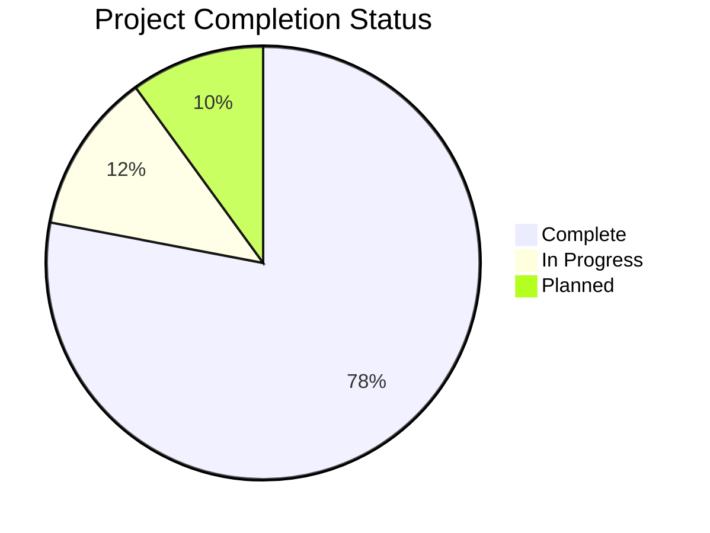
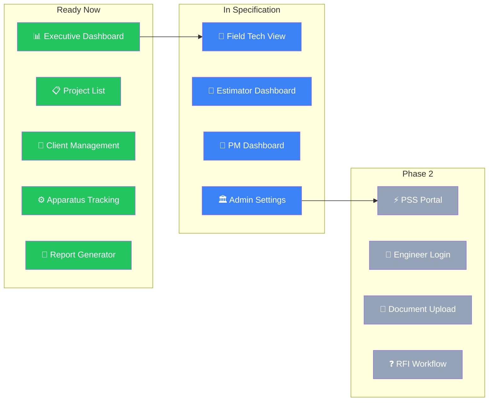
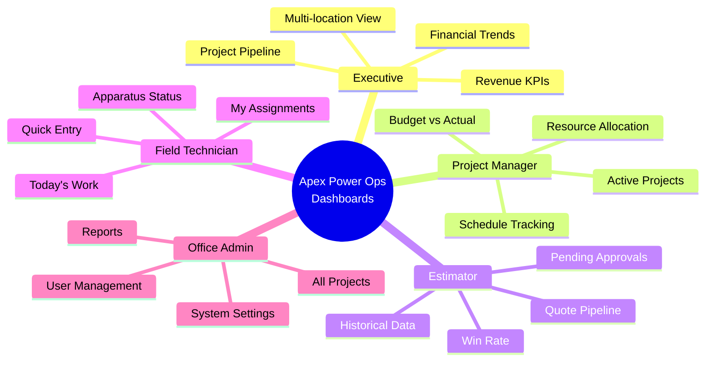
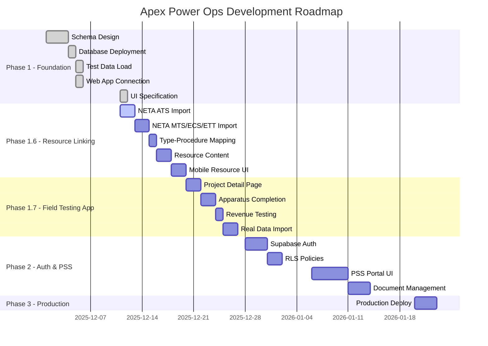

# Apex Power Ops - Project Status

> Repo-owned copy established 2026-05-07 as the canonical in-repo status surface for the live standalone `apex-power-ops-platform/` boundary. Keep the parent-root copy aligned until cutover retirement is complete.

> **Last Updated**: May 11, 2026 (relay-routing, authority-chain, Olares workspace/AI-backbone residue normalization, README operator-wording refresh, roadmap authority-path refresh, stakeholder-facing frontier refresh, retained-MVP-roadmap `.claude` refresh, current authority/status `.claude` residue refresh, status-frontmatter live-boundary wording refresh, historical workspace-roadmap title demotion, historical workspace-checklist title demotion, historical workspace-publication-plan title demotion, historical structure-audit section-heading demotion, historical workspace-governance-audit title demotion, historical workspace-current-status intro demotion, historical workspace-master-plan authority-heading demotion, active Olares workspace operating-model title/scope refresh, active Olares workspace closeout-label refresh, active operator-runbook status-board closeout wording refresh, active Olares MVP/AI status-brief and readiness-checklist authoring, active AI orchestration execution-plan authoring, active AI jobs env runtime enforcement hardening, active AI verifier promote-guard packet-id alignment repair, active AI canary example live-output alignment refresh, active AI verifier command-metadata artifact capture repair, active AI minimal-MCP unmanaged-running status truthfulness repair, active AI minimal-MCP adoption ownership-proof repair, active AI host-bootstrap unmanaged-ownership detail reporting repair, active AI hold-boundary unmanaged-detail reporting repair, active AI minimal-MCP default-port rebind repair, active AI minimal-MCP direct-service default-port alignment repair, active AI minimal-MCP compose runtime default-port alignment repair, active AI canary-runner MCP artifact endpoint refresh, active AI historical pre-rebind proof wording clarification, active AI canary entrypoint readiness hardening, active AI canary entrypoint fallback-env alignment, active AI hardening example-contract tightening, active AI MCP-boundary rule tightening, active AI evidence-routing contract tightening, active AI canary-example completeness tightening, active AI verifier-artifact path tightening, active AI jobs-tool-proof example tightening, active AI repo-visible canary artifact capture repair, active AI repo-visible deferred-ops artifact capture repair, active AI repo-visible host-bootstrap artifact capture repair, active AI truthful ad-hoc packet-id default repair, active AI direct-helper packet-id default repair, active AI operator-example packet placeholder repair, active AI operations-example packet placeholder repair, active AI bash preferred-python resolution repair, active AI host-bootstrap preferred-python reporting repair, active AI bash python-override normalization repair, active AI bash explicit-path override rejection repair, active AI bash preferred-python failure-path repair, active canary bash preferred-python alignment repair, active PowerShell python-override normalization repair, active Olares checklist canary-authoring checkbox refresh, active Olares checklist stack-data-center canary-surface refresh, active Olares checklist admitted-MCP-scaffold checkbox refresh, active Olares checklist env-template ignore refresh, active Olares checklist compose-authoring checkbox refresh, active Olares checklist forms-engine staging-path refresh, active Olares checklist AI-backbone doc-alignment refresh, active Olares checklist forms-engine manifest-declaration refresh, active AI forms-engine staging-shell path refresh, active Olares staging-root path refresh, active authority zone-lane future-tense refresh, active authority repo-state inventory refresh, active build-session prompt repo-reality inventory refresh, active authority directory-directives refresh, active publication-boundary closeout recommendation refresh, active post-closure checklist recommendation numbering repair, active post-closure checklist baseline-priority refresh, active Olares migration closeout signoff, active post-signoff baseline alignment, active workspace-authority post-signoff routing refresh, and active host-parity proof refresh through Packet 504 recorded)
> **Phase**: Standalone repo boundary live, Olares durable-host workflow active, AI orchestration bounded on the admitted MCP trio with executor-governed parallel lanes, Operations Visibility schema live with governed consumers, laptop-to-Olares migration signed off at the current repo and authoritative-host evidence floor
> **See Also**: `PROJECT_OVERVIEW.md` for full system architecture

---

## 🎯 Executive Summary

## 2026-05-07 Addendum: Repo Cutover, Olares Workspace, And Migration Status

This addendum is the current stakeholder-facing status surface for the active Olares workspace and standalone repo-boundary lane.

### What Improved In The Current Cutover And Hardening Pass

| Surface | Status | Notes |
|---------|--------|-------|
| Canonical git boundary | ✅ Complete | `C:/APEX Platform/apex-power-ops-platform` is now the standalone repo root and canonical local implementation surface |
| Canonical remote posture | ✅ Complete | repo flow now targets `https://github.com/jasonlswenson-sys/apex-power-ops.git` on `clean-main` |
| Olares implementation repo root | ✅ Complete | current host execution root is `/home/olares/code/apex/apex-power-ops-platform` |
| Old host clone disposition | ✅ Preserved | `/home/olares/src/apex-power-ops-platform` remains observe-only historical evidence |
| Repo-owned operator docs | ✅ Normalized | README, operator runbook, and cutover packet surfaces now treat the standalone repo root as canonical |
| Host bootstrap git-root logic | ✅ Published | `tools/ai/run-olares-host-bootstrap-status.sh` now reports git state from the implementation repo root rather than the umbrella host path |
| Bash env portability | ✅ Published | repo-owned Bash wrappers now tolerate CRLF `.env.dev` files from the Windows workspace copy |
| Repo-local Python resolution | ✅ Published | operator wrappers and canary entrypoints now prefer repo-local `.venv` or `APEX_PLATFORM_PYTHON`, with command-materialization on PowerShell and native `python3` or `python` fallback on Bash surfaces, instead of the retired parent-root interpreter path |
| Runtime scratch normalization | ✅ Published | top-level `.tmp/` is now ignored so host and local git status no longer surface wrapper scratch residue |
| Olares host/operator task surface | ✅ Published and mirrored | the authoritative host mirror now carries the repaired repo-root task and bootstrap surfaces cleanly at commit `2122a92ef46d5b44a4f6ff2b9df5fce79ac9d21b` |
| Olares workspace and AI backbone docs | ✅ Normalized | repo-owned framework, scaffold, execution-brief, prompt, build-guide, and checklist surfaces now point at surviving repo-owned session wiring instead of absent `.claude` files |

### Current Technical-Authority Readout

| Lane | Status | Current interpretation |
|------|--------|------------------------|
| Standalone repo cutover | ✅ Complete | the repo boundary is no longer a planning target; it is the live operating contract |
| Olares durable-host workspace | ✅ Active | Olares is now the intended durable development anchor for Apex Ops work |
| Active operator infrastructure | ✅ Published and mirrored | the repaired operator surfaces are live on `clean-main` and the authoritative host mirror is back to clean parity |
| Minimal MCP trio boundary | ✅ Operator-on-demand baseline | the admitted operator surface exists and validates cleanly, and `not-running` is now the explicit default steady-state posture unless a later packet admits durable runtime |
| Historical parent-root guidance | 🟡 Residual | major active docs are normalized, but historical packet/task residue still exists and must remain clearly marked as provenance, not current workflow |
| Olares roadmap and authority chain | ✅ Controlled | Olares is no longer an open-ended bring-up epic; it is a governed durable-host and migration program with bounded reopen triggers |

### Laptop-To-Olares Migration Status

| Surface | Status | Notes |
|---------|--------|-------|
| Durable host residency | ✅ Complete | Olares host path and repo boundary are established and govern current work |
| Laptop client-only posture | ✅ Substantially complete | the laptop is no longer the intended durable workstation; it is governed as client/access/fallback surface |
| Daily-development center of gravity | ✅ Olares-first and mirrored | governance, pathing, and the repaired operator surfaces now point to Olares first with live mirrored proof on the authoritative host copy |
| Publication-boundary retirement | ✅ Closeout baseline complete | the standalone repo is canonical and the active documentation lane is at a clean stop point; remaining parent-root residue is preserved provenance or future trigger work, not a live migration blocker |
| Full migration closeout | ✅ Signed off | active current-looking guidance is aligned to the standalone repo and Olares-first boundary, and fresh host-bootstrap proof now confirms clean authoritative-host parity at the current head; remaining work is drift-triggered validation, observe-only residue preservation, or later explicit archival packets rather than migration repair |

### AI Orchestration And Executor Status

| Surface | Status | Notes |
|---------|--------|-------|
| AI orchestration planning | ✅ Active and materially complete | the current repo-owned authority stack now defines the admitted backbone, trust rules, operator runbook, bounded next-step checklist, and one executable phase-order plan |
| AI orchestration development baseline | ✅ Active bounded baseline | `apex-fs`, `apex-db`, and `apex-jobs` are the only admitted MCP services, with host and workstation verification plus repo-visible evidence capture |
| Single-executor packet path | ✅ Enabled | one bounded executor may deliver packet-scoped work inside the admitted boundary under packet/handoff governance and `apex-jobs` promotion rules |
| Two-executor parallel path | 🟡 Enabled for disjoint lanes only | current safe split is explicit non-overlapping ownership such as scaffold maintenance versus trust hardening, with validation and publication still centrally governed |
| Wider multi-executor queue ownership | ⛔ Deferred | `ai_tasks` is not the current controller, and open-ended autonomous or shared-mutation orchestration remains out of scope pending a separate packet |

### Remaining Highest-Value Items

1. Preserve the signed-off migration baseline by reopening closeout only when a genuinely current-looking surface drifts out of alignment or a host-parity check produces new contrary evidence.
2. Continue treating `/home/olares/src/apex-power-ops-platform` as observe-only historical evidence until a later cleanup packet explicitly retires or archives it.
3. Keep the current authoritative host mirror clean at `/home/olares/code/apex/apex-power-ops-platform` and use the repo-owned bootstrap/status surface plus Packet 099 proof as the controlling validation baseline for future Olares operator work.
4. Reopen minimal-trio runtime admission only if a concrete unattended workflow, repeated operator insufficiency, or new validation obligation proves that operator-on-demand is no longer enough.
5. Keep the current executor posture explicit: one bounded executor is the default operating model, while two executors may run only when file ownership, validation order, and abort rules are written before execution starts.
6. Continue provenance-routing normalization only when a different current-looking active surface, outside the now-closed relay, authority, Olares workspace/AI-backbone, README wording, maintained-roadmap reference, retained-MVP-roadmap `.claude`, and current authority/status `.claude` residue branches, actually risks misdirecting repo-root execution rather than as a standing migration blocker.

### Current Executor-Governed Next Move

The current next move is not broader queue admission.

It is to keep the Olares-first lane on a bounded executor model:

1. use a single executor by default for packet-scoped implementation or validation,
2. open a second executor only for explicitly non-overlapping lanes,
3. keep `apex-jobs` plus packet and handoff governance as the controlling run and publication path,
4. require `env=host` evidence before any widened parallel lane is treated as complete or promotable.

### Current Recommended Next Lane

The current frontier is no longer the early minimal-trio and parent-root task-family lane recorded below.

Packets `2026-05-09-olares-dev-residency-405` through `2026-05-10-olares-dev-residency-482` now close the active TCC relay routing, authority-chain, Olares workspace, AI-backbone, retained first-run `.claude` residue, README operator-wording, maintained-roadmap reference-normalization, retained-MVP-roadmap `.claude` residue, current authority/status `.claude` residue, status-frontmatter live-boundary wording, historical workspace-roadmap title demotion, historical workspace-checklist title demotion, historical workspace-publication-plan title demotion, historical structure-audit section-heading demotion, historical workspace-governance-audit title demotion, historical workspace-current-status intro demotion, historical workspace-master-plan authority-heading demotion, active Olares workspace operating-model title/scope refresh, active Olares workspace closeout-label refresh, active operator-runbook status-board closeout wording refresh, active Olares MVP/AI status-brief and readiness-checklist authoring, active AI hardening example-contract tightening, active AI MCP-boundary rule tightening, active AI evidence-routing contract tightening, active AI canary-example completeness tightening, active AI verifier-artifact path tightening, active AI jobs-tool-proof example tightening, active AI repo-visible canary artifact capture repair, active AI repo-visible deferred-ops artifact capture repair, active AI repo-visible host-bootstrap artifact capture repair, active AI truthful ad-hoc packet-id default repair, active AI direct-helper packet-id default repair, active AI operator-example packet placeholder repair, active AI operations-example packet placeholder repair, active AI bash preferred-python resolution repair, active AI host-bootstrap preferred-python reporting repair, active AI bash python-override normalization repair, active AI bash explicit-path override rejection repair, active AI bash preferred-python failure-path repair, active canary bash preferred-python alignment repair, active PowerShell python-override normalization repair, active Olares checklist canary-authoring checkbox refresh, active Olares checklist stack-data-center canary-surface refresh, active Olares checklist admitted-MCP-scaffold checkbox refresh, active Olares checklist env-template ignore refresh, active Olares checklist compose-authoring checkbox refresh, active Olares checklist forms-engine staging-path refresh, active Olares checklist AI-backbone doc-alignment refresh, active Olares checklist forms-engine manifest-declaration refresh, active AI forms-engine staging-shell path refresh, active Olares staging-root path refresh, active authority zone-lane future-tense refresh, active authority repo-state inventory refresh, active build-session prompt repo-reality inventory refresh, active authority directory-directives refresh, active publication-boundary closeout recommendation refresh, active post-closure checklist recommendation numbering repair, active post-closure checklist baseline-priority refresh, and active migration closeout signoff branches.

Packet `2026-05-10-olares-dev-residency-480` now closes the next adjacent active post-closure checklist recommendation numbering repair slice by updating `docs/architecture/OLARES-POST-CLOSURE-EXECUTION-CHECKLIST-2026-04-25.md` so its current recommendation list now reads as a clean five-step maintained rerun guidance block instead of preserving a duplicate numbered item in the middle of active operator-facing text.

Packet `2026-05-10-olares-dev-residency-481` now closes the next adjacent active post-closure checklist baseline-priority refresh slice by updating `docs/architecture/OLARES-POST-CLOSURE-EXECUTION-CHECKLIST-2026-04-25.md` so its approved status baseline no longer implies Olares is not the current repo priority when the maintained status surface now explicitly records an Olares-first developer-capability hardening and AI-workflow improvement priority.

Packet `2026-05-10-olares-dev-residency-479` now closes the next adjacent active publication-boundary closeout recommendation refresh slice by updating `docs/architecture/OLARES-PUBLICATION-BOUNDARY-RETIREMENT-DEPENDENCY-INVENTORY-2026-05-06.md` so its remaining-target and current-recommendation blocks no longer read as if another same-family adjacent active-surface truth refresh is still open after the focused scans proved the remaining matches are historical-only or legitimately future-facing.

The current publication-boundary documentation lane is therefore at a clean stop point for this adjacent active-surface truth-refresh family. The next truthful work in that lane is now either another intentionally active baseline surface whose current queue or recommendation block has gone stale relative to the later packet trail, continued host-parity validation against `/home/olares/code/apex/apex-power-ops-platform`, or a newly discovered genuinely current-looking surface that reopens the lane on evidence rather than assumption.

Packet `2026-05-10-olares-dev-residency-482` now closes the final adjacent migration-closeout signoff slice by updating this maintained status ledger so the publication-boundary and full laptop-to-Olares migration rows match the clean-stop-point evidence already recorded in the dependency inventory, maintained rerun checklist, and latest Packet 479 through Packet 481 handoff trail.

The laptop-to-Olares migration lane is therefore now signed off at the current repo-owned evidence floor. Remaining work after this point is baseline preservation rather than open migration repair: host-parity reruns when drift justifies them, observe-only retention or later archival of the old clone, and new packetized residue cleanup only if a genuinely current-looking active surface is discovered.

Packet `2026-05-10-olares-dev-residency-483` now closes the next adjacent post-signoff baseline-alignment slice by refreshing the maintained roadmap, workspace operating-model authority, root README, and operator runbook so they no longer preserve pre-signoff migration guidance in active routing or baseline text.

That keeps the signed-off migration state coherent across the current status, roadmap, authority, and operator entry surfaces instead of limiting the signoff to `PROJECT_STATUS.md` alone.

Packet `2026-05-10-olares-dev-residency-484` now closes the next adjacent active workspace-authority post-signoff routing slice by refreshing the live Olares operating-model authority so its final routing section is framed as post-signoff and trigger-based rather than as unresolved closeout, while also repairing a duplicate numbered step in the standard host-readiness flow.

That leaves the current authority stack without another active wording defect that still reads like unfinished migration closeout.

Packet `2026-05-10-olares-dev-residency-485` now closes the remaining fresh-host-proof gap by rerunning the repo-owned host bootstrap status surface over restored `olares-mesh` access and confirming that `/home/olares/code/apex/apex-power-ops-platform` is reachable, clean, and in parity with local `HEAD` at `a6531ae8e30e7d9ccc818c3ba8a1a64fbef30b66`.

That host proof also confirmed the truthful steady-state operator posture remains intact after signoff: the old clone stays preserved at `/home/olares/src/apex-power-ops-platform`, the admitted minimal MCP trio is validly `not-running` at rest, and the hold-boundary surface truthfully reports `minimal_mcp=NOT_RUNNING` with deferred Ops checks unavailable until a bounded session intentionally brings the trio up.

Packet `2026-05-10-olares-dev-residency-444` also gives the current AI lane a compact repo-owned status brief and next-step checklist, so future sessions do not have to reconstruct the admitted five-part MVP baseline and bounded two-lane parallel-task posture from the retained roadmap and separate AI backbone briefs alone.

Packet `2026-05-10-olares-dev-residency-489` now closes the next adjacent active AI orchestration execution-plan authoring slice by adding `plan/OLARES-AI-ORCHESTRATION-EXECUTION-PLAN-2026-05-10.md` and wiring it into the status brief, readiness checklist, and decision surface so future sessions have one repo-owned execution sequence, phase model, widening gate, and stop-condition surface instead of reconstructing that order from adjacent AI docs.

Packet `2026-05-10-olares-dev-residency-490` now closes the next adjacent active AI jobs env runtime enforcement hardening slice by adding shared runtime argument validation under `services/mcp/apex-jobs/src/validation.ts` and routing both `services/mcp/apex-jobs/src/index.ts` and `services/mcp/apex-jobs/src/http.ts` through that same contract, so invalid `env`, `status`, `packet_id`, `run_id`, and `since` values are refused instead of being silently defaulted or accepted on the live ledger path.

That keeps the documented `sandbox|host` trust boundary truthful at runtime for both stdio and HTTP entrypoints without widening the admitted MCP trio, changing the promotion gate, or reopening broader orchestration scope.

Packet `2026-05-10-olares-dev-residency-491` now closes the next adjacent active AI verifier promote-guard packet-id alignment repair slice by updating `tools/ai/verify_minimal_mcp_trio.py` so its negative `promote_packet` probe inherits the already-resolved packet id instead of concatenating the raw CLI argument, which previously emitted `None-promote-guard-*` in ad hoc verifier runs even while the same summary recorded a truthful resolved `packet_id`.

That keeps the verifier's refusal evidence internally coherent for both explicit packet runs and default ad hoc runs without widening the admitted MCP trio, changing promotion semantics, or reopening broader workflow scope.

Packet `2026-05-10-olares-dev-residency-492` now closes the next adjacent active AI canary example live-output alignment refresh slice by updating `docs/operations/AI-BACKBONE-CANARY-EVIDENCE-BUNDLE-2026-05-08.md` so its example validation summary matches the current verifier artifact more closely: `jobs_tools` now includes `list_runs`, `jobs_promote_guard` now shows its packet-scoped refusal proof, `db_query` now reflects the current `rowCount` plus `rows` shape, and `jobs_start_run` or `jobs_end_run` now show the current nested run-object payloads rather than stale flattened placeholders.

That keeps the active canary evidence example truthful relative to the admitted verifier output without changing verifier behavior, MCP service behavior, or the current AI boundary.

Packet `2026-05-10-olares-dev-residency-493` now closes the next adjacent active AI verifier command-metadata artifact capture repair slice by updating `tools/ai/verify_minimal_mcp_trio.py` so its emitted JSON summary now includes the current execution command, keeping the live artifact aligned with the active evidence-bundle example and the routing contract that expects verifier command capture instead of leaving that field implicit in packet or handoff prose alone.

That keeps the repo-visible verifier artifact more self-describing without widening the admitted MCP trio, changing verifier check behavior, or reopening broader workflow scope.

Packet `2026-05-10-olares-dev-residency-494` now closes the next adjacent active AI minimal-MCP unmanaged-running status truthfulness repair slice by updating `tools/ai/run-minimal-mcp-trio.sh`, `tools/ai/run-minimal-mcp-trio.ps1`, and `tools/ai/run-olares-host-bootstrap-status.sh` so live but unmanaged MCP endpoints are surfaced explicitly as `unmanaged-running` instead of being collapsed into `not-running`, while the host bootstrap surface now treats that unmanaged condition as unavailable rather than as a valid ready state.

That keeps the operator and bootstrap status surfaces truthful when the admitted trio is live outside the wrapper-managed state file, without widening the admitted MCP trio, changing verifier behavior, or reopening broader workflow scope.

Packet `2026-05-10-olares-dev-residency-495` now closes the next adjacent active AI minimal-MCP adoption ownership-proof repair slice by adding `tools/ai/check_apex_fs_ownership.py` and updating `tools/ai/run-minimal-mcp-trio.sh`, `tools/ai/run-minimal-mcp-trio.ps1`, and the first-slice runbook so `up` only adopts already-live endpoints after `apex-fs` proves that the served `workspace` root matches the current repo root.

That keeps the admitted trio operator surface from silently binding to foreign or stale listeners that happen to answer on the admitted ports, without widening the admitted MCP trio, changing verifier semantics, or reopening broader workflow scope.

Packet `2026-05-10-olares-dev-residency-496` now closes the next adjacent active AI host-bootstrap unmanaged-ownership detail reporting repair slice by updating `tools/ai/run-olares-host-bootstrap-status.sh` so when the host bootstrap surface sees `minimal_mcp.status = unmanaged-running`, it now attaches the same `apex-fs` ownership probe details directly into the emitted `minimal_mcp` payload instead of forcing operators to run a second command to discover the stale-root cause.

That keeps the host bootstrap status surface more self-explanatory when foreign listeners occupy the admitted ports, without widening the admitted MCP trio, changing runtime control behavior, or reopening broader workflow scope.

Packet `2026-05-10-olares-dev-residency-497` now closes the next adjacent active AI hold-boundary unmanaged-detail reporting repair slice by updating `tools/ai/run-olares-host-bootstrap-status.sh` so the fallback `hold_boundary` payload now includes `minimal_mcp_detail` copied from the current minimal-MCP status surface, including the inline ownership probe when unmanaged listeners occupy the admitted ports.

That keeps status-only consumers from having to inspect the top-level `minimal_mcp` block just to learn why deferred ops are unavailable in the unmanaged-running case, without widening the admitted MCP trio, changing runtime control behavior, or reopening broader workflow scope.

Packet `2026-05-10-olares-dev-residency-498` now closes the next adjacent active AI minimal-MCP default-port rebind repair slice by moving the operator default trio from host ports `8710` through `8712` to `8810` through `8812` across `.env.dev.template`, the local workstation `.env.dev`, the minimal-trio wrappers, verifier and canary helper URL defaults, the deferred-ops DB helper default, and the current first-slice runbook.

That restores a truthful operator-at-rest baseline on the current workstation and host by moving the admitted default trio away from the Docker-contended port range, without widening the admitted MCP trio, changing the service boundary itself, or reopening broader workflow scope.

Packet `2026-05-10-olares-dev-residency-499` now closes the next adjacent active AI minimal-MCP direct-service default-port alignment repair slice by updating the direct HTTP service entrypoints in `services/mcp/apex-fs`, `services/mcp/apex-db`, and `services/mcp/apex-jobs` so their `APEX_MCP_HTTP_PORT` fallbacks now match the rebounded operator defaults `8810`, `8811`, and `8812`, while the same lane README contracts now describe those live defaults truthfully.

That keeps the operator wrappers, direct service runtime behavior, generated build outputs, and current service contract docs aligned on one admitted default trio, without widening the admitted MCP trio, changing MCP behavior beyond the fallback port constants, or reopening broader workflow scope.

Packet `2026-05-10-olares-dev-residency-500` now closes the next adjacent active AI minimal-MCP compose runtime default-port alignment repair slice by updating `infra/compose.dev.yml` so the compose-managed `apex-mcp-fs`, `apex-mcp-db`, and `apex-mcp-jobs` services now set `APEX_MCP_HTTP_PORT` to `8810`, `8811`, and `8812` and expose those same container ports through the existing `APEX_DEV_MCP_*_PORT` host bindings.

That keeps the compose-managed runtime aligned with the rebounded operator defaults and the now-updated direct service entrypoints, without widening the admitted MCP trio, changing compose service coverage, or reopening broader orchestration scope.

Packet `2026-05-10-olares-dev-residency-501` now closes the next adjacent active AI canary-runner MCP artifact endpoint refresh slice by rerunning the governed canary entry surface so `tests/canary/mcp-contract/actual/mcp-tool-lists.json` now records the current admitted trio endpoints `http://127.0.0.1:8810/mcp`, `http://127.0.0.1:8811/mcp`, and `http://127.0.0.1:8812/mcp` instead of preserving the pre-rebind `8710` through `8712` values.

That keeps the one generic repo-visible canary-runner MCP artifact referenced by active docs aligned with the current admitted trio defaults, without rewriting packet-scoped historical proof artifacts, widening the admitted boundary, or reopening broader canary semantics.

Packet `2026-05-10-olares-dev-residency-502` now closes the next adjacent active AI historical pre-rebind proof wording clarification slice by updating the current first-slice runbook so its retained Packet 038 host proof explicitly reads as historical pre-rebind evidence and points readers back to the current admitted default trio `8810`, `8811`, and `8812` instead of leaving the old `127.0.0.1:8710-8712` line to stand without context.

That preserves the historical proof itself while preventing the active runbook from reading like current operator guidance on the retired default trio, without rewriting packet evidence, widening the admitted MCP boundary, or reopening broader workflow scope.

Packet `2026-05-11-olares-dev-residency-503` now closes the next adjacent active AI canary entrypoint readiness hardening slice by updating `tools/run-canary.ps1` and `tools/run-canary.sh` so the governed canary entry surfaces no longer rely on a blind fixed sleep after launching local runtimes and MCP servers.

They now wait boundedly for the forms and P6 runtimes to answer `/health` and for the admitted MCP HTTP transports to answer on `/mcp`, which matches the readiness contract the canary runner actually consumes and avoids coupling the entrypoint to dependency-sensitive backend health checks such as `apex-db`'s live query probe.

That keeps the current repo-visible canary entry surface less timing-sensitive and more truthful about startup readiness, without widening the admitted MCP boundary, changing canary artifact semantics, or rewriting historical proof artifacts.

Packet `2026-05-11-olares-dev-residency-504` now closes the next adjacent active AI canary entrypoint fallback-env alignment slice by updating `tools/run-canary.ps1` and `tools/run-canary.sh` so the child runtimes and MCP services are launched with the same resolved port and URL values that the wrappers already compute for readiness polling.

Before this repair, the wrappers waited on resolved fallback values such as `8810` through `8812`, `8713`, `8714`, `8080`, and `8081`, but still passed raw `APEX_DEV_*` environment variables into child processes. If one of those raw values was empty or omitted in a partial operator env file, a child process could bind to an unintended port or inherit an empty upstream runtime URL even while the wrapper waited on the correct fallback surface.

That keeps the governed canary entrypoint internally coherent under sparse or partially overridden env configuration, without widening the admitted MCP boundary, changing canary artifact semantics, or reopening the Packet 503 readiness-contract slice.

Packet `2026-05-10-olares-dev-residency-445` now tightens that same active AI hardening lane by adding exact sandbox-versus-host run examples, explicit refusal text, provenance placement rules, and an example canary evidence bundle shape to the existing trust and canary docs, so the admitted contract is clearer and more testable without widening the backbone.

Packet `2026-05-10-olares-dev-residency-446` now tightens the same active AI hardening lane by documenting the exact admitted `apex-fs` roots, path-escape refusal posture, `apex-db` read-only tool surface, and expected SQL refusal details, while also updating the readiness checklist so it treats those MCP boundary rules as a maintained contract instead of an undocumented gap.

Packet `2026-05-10-olares-dev-residency-447` now tightens that same active AI hardening lane by routing canary verifier commands, results, output artifacts, and handoff references through the existing packet JSON and handoff fields already used elsewhere in the repo, so AI evidence capture is clearer and less dependent on narrative-only summaries.

Packet `2026-05-10-olares-dev-residency-448` now tightens that same active AI hardening lane by making the canary example bundle itself match the live verifier and the document's own minimum evidence list, so readers no longer see a jobs-only example where the active canary contract actually requires filesystem and database proof as well.

Packet `2026-05-10-olares-dev-residency-449` now tightens that same active AI hardening lane by routing optional verifier JSON output into the existing `tests/canary/mcp-contract/actual/` lane with an explicit example path and a do-not-overwrite rule for `mcp-tool-lists.json`, so the canary stack no longer leaves artifact placement ambiguous.

Packet `2026-05-10-olares-dev-residency-450` now tightens that same active AI hardening lane by adding the missing `jobs_tools` proof to the canary example bundle, so the example finally matches the verifier output and the document's existing requirement for MCP tool-resolution proof across `apex-fs`, `apex-db`, and `apex-jobs`.

Packet `2026-05-10-olares-dev-residency-451` now tightens that same active AI validation lane by repairing the live artifact-capture surface itself: the minimal-trio verify wrappers and the hold-boundary readers now converge on the repo-visible `tests/canary/mcp-contract/actual/verify-minimal-mcp-trio-<packet-id>.json` path instead of splitting verification output between that canary lane and the temporary `.tmp/ai-workflow/` state directory.

Packet `2026-05-10-olares-dev-residency-452` now tightens that same active AI hold-boundary validation lane by repairing the deferred-ops artifact path itself: the hold-boundary wrappers now write repo-visible deferred-view output to `tests/canary/deferred-ops-view-counts/actual/deferred-ops-view-counts-<packet-id>.json` instead of leaving that evidence in the temporary `.tmp/ai-workflow/` state directory.

Packet `2026-05-10-olares-dev-residency-453` now tightens that same active AI operator-status validation lane by repairing the host-bootstrap artifact path itself: `tools/ai/run-olares-host-bootstrap-status.sh` now writes its composed status output to `tests/canary/host-bootstrap-status/actual/host-bootstrap-status-<packet-id>.json` instead of leaving that controlling status surface as stdout-plus-temp intermediates only, and it now degrades truthfully when the historical old-clone path is absent instead of crashing.

Packet `2026-05-10-olares-dev-residency-454` now tightens that same active AI operator-validation lane by repairing the default packet-id behavior itself: the minimal-trio, hold-boundary, and host-bootstrap wrappers now resolve omitted packet IDs from `APEX_PACKET_ID` or a fresh ad-hoc timestamped ID instead of preserved historical packet IDs, and the minimal-trio verifier now reuses the active run's packet ID across no-argument `up` plus `verify` flows.

Packet `2026-05-10-olares-dev-residency-455` now tightens that same active AI direct-helper validation lane by repairing the default packet-id behavior inside `tools/ai/verify_minimal_mcp_trio.py` and `tools/ai/check_deferred_ops_view_counts.py` themselves, so omitted `--packet-id` values now resolve through `APEX_PACKET_ID` or a fresh ad-hoc timestamped ID instead of preserved historical packet names even when those Python helpers are run directly outside the wrapper layer.

Packet `2026-05-10-olares-dev-residency-456` now tightens that same active AI operator-publication lane by replacing preserved historical packet IDs in the active AI workflow runbook's copy-paste command examples with `<packet-id>` placeholders, so the current operator documentation no longer suggests stamping fresh evidence with old packet names.

Packet `2026-05-10-olares-dev-residency-457` now tightens that same active AI operations-publication lane by replacing the concrete packet `2026-05-10-olares-dev-residency-445` in active `AI-BACKBONE-CANARY-EVIDENCE-BUNDLE-2026-05-08.md` and `APEX-JOBS-TRUST-AND-PROMOTION-CONTRACT-2026-05-08.md` examples with `<packet-id>` placeholders, so those current example surfaces no longer suggest using an old packet name for fresh canary or run-ledger evidence.

Packet `2026-05-10-olares-dev-residency-458` now tightens that same active AI Bash operator lane by repairing Python interpreter resolution in the Bash wrappers themselves: `run-minimal-mcp-trio.sh`, `run-olares-hold-boundary-check.sh`, and `run-olares-host-bootstrap-status.sh` now prefer the shared repo-local Python resolver with a safe native fallback, and the shared resolver now skips Windows `python.exe` paths on Linux-style shells so those wrappers no longer fail under WSL-style Bash when handed POSIX script paths.

Packet `2026-05-10-olares-dev-residency-459` now tightens that same active AI host-status validation lane by repairing the host-bootstrap reporting surface itself: `run-olares-host-bootstrap-status.sh` now records the actual preferred Python path and version used by the Bash AI wrappers in its `toolchains` block instead of reporting only raw `python3` availability, so the emitted validation artifact no longer drifts from the interpreter contract repaired in Packet 458.

Packet `2026-05-10-olares-dev-residency-460` now tightens that same active AI Bash interpreter lane by normalizing `APEX_PLATFORM_PYTHON` overrides in the shared shell helper: bare command names such as `python3` now resolve to their materialized command path, while Windows `python.exe` overrides are rejected on Linux-style shells instead of slipping through as successful resolutions.

Packet `2026-05-10-olares-dev-residency-461` now tightens that same active AI Bash interpreter lane by repairing explicit path-style `APEX_PLATFORM_PYTHON` handling in the shared shell helper: nonexistent interpreter paths now fail at resolution time instead of being accepted as successful selections that only fail later when a wrapper tries to execute them.

Packet `2026-05-10-olares-dev-residency-462` now tightens that same active AI Bash interpreter lane by repairing the failure path inside `get_apex_preferred_python` itself: the helper now initializes `repo_root` before composing its final no-usable-Python message, so shells without a usable interpreter receive the intended truthful failure text instead of an unbound-variable crash.

Packet `2026-05-10-olares-dev-residency-463` now tightens the adjacent active canary-entrypoint lane by updating `tools/run-canary.sh` to use the shared preferred Python resolver instead of strict repo-local resolution, and by updating the active workstation bring-up checklist so its Python precondition matches the current repo-local, override, and native-Bash fallback contract rather than preserving the retired parent-root interpreter path.

Packet `2026-05-10-olares-dev-residency-464` now tightens the adjacent active PowerShell interpreter lane by normalizing `APEX_PLATFORM_PYTHON` overrides inside `tools/shell/common.ps1`: bare command names now resolve to a real executable path through `Get-Command`, while missing explicit paths or missing commands fail fast instead of being passed through as opaque strings.

Packet `2026-05-10-olares-dev-residency-465` now tightens the adjacent active Olares publication lane by refreshing `docs/operations/OLARES-CHECKLIST.md` so the Phase 10 canary-suite checklist no longer presents `tools/run-canary.sh` authoring as unfinished when that surface already exists alongside `tools/run-canary.ps1` and `tools/canary/run_canary.py`.

Packet `2026-05-10-olares-dev-residency-466` now tightens the adjacent active Olares publication lane by refreshing `docs/operations/OLARES-CHECKLIST.md` so its remaining Phase 10 stack-data-center checklist item points at the admitted input fixture and existing repo-visible known-good output lanes instead of a nonexistent `tests/canary/stack-data-center/` scaffold.

Packet `2026-05-10-olares-dev-residency-467` now tightens the adjacent active Olares publication lane by refreshing `docs/operations/OLARES-CHECKLIST.md` so its Phase 7 admitted-MCP checklist no longer presents `services/mcp/apex-fs/`, `services/mcp/apex-db/`, and `services/mcp/apex-jobs/` scaffolding as unfinished when those directories already exist in the repo.

Packet `2026-05-10-olares-dev-residency-468` now tightens the adjacent active Olares publication lane by refreshing `docs/operations/OLARES-CHECKLIST.md` so its Phase 6 env-template item names the actual `.env.dev.template` file and no longer presents real `.env.dev` ignore coverage as unfinished when `.gitignore` already covers it through `.env.*`.

Packet `2026-05-10-olares-dev-residency-469` now tightens the adjacent active Olares publication lane by refreshing `docs/operations/OLARES-CHECKLIST.md` so its Phase 6 compose authoring item no longer presents `infra/compose.dev.yml` as unfinished when that file already defines the named Postgres 16, Qdrant, MinIO-local, and Mailhog services.

Packet `2026-05-10-olares-dev-residency-470` now tightens the adjacent active Olares publication lane by refreshing `docs/operations/OLARES-CHECKLIST.md` so its Phase 9 forms-engine staging authoring item points at the actual `infra/olares/forms-engine/` path and no longer preserves the nonexistent `infra/olares/charts/forms-engine/` location.

Packet `2026-05-10-olares-dev-residency-471` now tightens the adjacent active Olares publication lane by refreshing `docs/operations/OLARES-CHECKLIST.md` so its Phase 7 backbone scaffold/execution-brief alignment item no longer presents that doc lane as unfinished when the repo-owned scaffold spec, execution brief, and backbone authority surfaces already anchor the admitted trio to `apex-fs`, `apex-db`, and `apex-jobs`.

Packet `2026-05-10-olares-dev-residency-472` now tightens the adjacent active Olares publication lane by refreshing `docs/operations/OLARES-CHECKLIST.md` so its Phase 9 middleware/entrance/OIDC declaration item points at the actual `infra/olares/forms-engine/OlaresManifest.yaml` surface rather than presenting those declarations as unfinished despite the live manifest already carrying them.

Packet `2026-05-10-olares-dev-residency-473` now tightens the adjacent active AI/Olares publication lane by refreshing the current backbone scaffold spec, session prompt, execution brief, backbone framework, and workspace-authority Phase D section so they point at the live `infra/olares/forms-engine/` staging shell instead of the retired `infra/olares/charts/forms-engine/` path.

Packet `2026-05-10-olares-dev-residency-474` now tightens the adjacent active Olares publication and authority lane by refreshing the current session prompt and staging-zone authority wording so they route service graduation through the live `infra/olares/<service>/` layout and `infra/olares/` root instead of the nonexistent `infra/olares/charts/` tree.

Packet `2026-05-10-olares-dev-residency-475` now tightens the adjacent active authority lane by refreshing the current dev-zone and services-zone routing wording so `services/mcp/`, `infra/compose.dev.yml`, `infra/olares/`, and `docs/authority/` are no longer described as future-only repo lanes when those paths already exist and govern the live boundary today.

Packet `2026-05-10-olares-dev-residency-476` now tightens the adjacent active authority lane by refreshing the current verified repo-state inventory so it matches the live standalone repo root, including `infra/`, `services/`, `tests/`, `tools/`, and `packages/p6-ingest/` instead of preserving an older narrower snapshot.

Packet `2026-05-10-olares-dev-residency-477` now tightens the adjacent active operator-prompt lane by refreshing the current repo-reality inventory sentence so it matches the live standalone repo root instead of preserving an older partial lane list.

Packet `2026-05-10-olares-dev-residency-478` now tightens the adjacent active authority lane by refreshing the current directory-directives section so it no longer narrows the authoritative root structure to an older partial list when `infra/`, `knowledge/`, and `archive/` are already part of the live standalone repo baseline recorded elsewhere in that same framework.

The next truthful repo-structure work is therefore the next adjacent active repo-owned publication, prompt, mirror, authority, operator, or maintained status surface whose top-of-file posture, current-state statement, or preserved guidance still implies a stale non-canonical dependency despite those now-closed branches.

If the lane shifts from residue retirement back to admitted AI follow-on execution, the new Olares MVP/AI brief, readiness checklist, tightened trust/canary example docs, explicit MCP boundary rules, explicit evidence-routing contract, complete canary example bundle, explicit verifier-artifact path guidance, restored `apex-jobs` tool-resolution proof in the example bundle, repaired repo-visible verifier artifact surface, repaired repo-visible deferred-ops artifact surface, repaired repo-visible host-bootstrap artifact surface, truthful ad-hoc packet-id defaults, truthful direct-helper packet-id defaults, placeholder-based operator examples, placeholder-based operations examples, repaired Bash preferred-python resolution, truthful host-bootstrap preferred-python reporting, truthful Bash Python-override normalization, truthful explicit-path override rejection, truthful preferred-python failure-path reporting, truthful Bash canary preferred-python alignment, truthful PowerShell Python-override normalization, refreshed active canary-authoring checklist truth, refreshed active stack-data-center canary-surface checklist truth, refreshed active admitted-MCP scaffold checklist truth, refreshed active env-template ignore checklist truth, refreshed active compose-authoring checklist truth, refreshed active forms-engine staging-path checklist truth, refreshed active AI-backbone doc-alignment checklist truth, refreshed active forms-engine manifest-declaration checklist truth, refreshed active AI forms-engine staging-shell path truth, refreshed active Olares staging-root path truth, refreshed active authority zone-lane truth, refreshed active authority repo-state inventory truth, refreshed active build-session prompt repo-reality inventory truth, and refreshed active authority directory-directives truth are the bounded starting point for the next scaffold-maintenance or trust-hardening slice.

Historical packet trail leading into that current frontier:

The bounded runtime-governance decision on the admitted minimal MCP trio is now closed.

Packets `2026-05-07-olares-dev-residency-096` through `2026-05-07-olares-dev-residency-098` now close the current-looking parent-root task-surface residue by selecting, executing, and then completing the repo-root task relabel slice across the full surviving task family.

Packet `2026-05-07-olares-dev-residency-099` now closes the next adjacent repo-foundation proof slice by recording fresh canonical repo-root validation and old-clone observation evidence after cutover.

Packet `2026-05-08-olares-dev-residency-100` now closes the next adjacent current-truth authority-normalization slice by updating the repo overview plus the active Olares authority framework and build guide so they no longer describe the retired parent-root boundary as live repo truth.

Packet `2026-05-08-olares-dev-residency-101` now closes the next adjacent parent-root mirror-alignment slice by updating the top-level workspace README, parent-root overview and status mirrors, and the surviving `.claude` git-task note so the umbrella shell is explicitly historical and no longer presents the retired boundary as current operator truth.

Packet `2026-05-08-olares-dev-residency-102` now closes the next adjacent parent-root `.claude` entrypoint-hardening slice by retitling the surviving master/state/decision-log entrypoints as historical parent-root records and adding explicit current-routing blocks so they no longer read like live coordination constitutions for the standalone repo boundary.

Packet `2026-05-08-olares-dev-residency-103` now closes the next adjacent historical-planning demotion slice by hard-marking the early workspace master plan, structure audit, and workspace current-status documents as pre-cutover snapshots instead of active live authority surfaces.

Packet `2026-05-08-olares-dev-residency-104` now closes the next adjacent cutover-stack closeout-normalization slice by updating the repo foundation plan, parent-root classification matrix, authority relocation plan, and publication-boundary dependency inventory so they read as executed closeout guidance rather than stale active launch plans.

Packet `2026-05-08-olares-dev-residency-105` now closes the next adjacent developer-host cutover planning-stack normalization slice by updating the milestone plan, technical plan, and Milestone 1 acceptance checklist so they read as executed cutover baselines rather than active launch surfaces and no longer preserve the retired parent-root publication boundary as current technical truth.

Packet `2026-05-08-olares-dev-residency-106` now closes the next adjacent packet-history routing-ledger demotion slice by reclassifying the old Phase 5 next-task routing handoff as a historical ledger with explicit current-routing redirects instead of a live operator queue.

Packet `2026-05-08-olares-dev-residency-107` now closes the next adjacent handoff-register demotion slice by reclassifying `ops/agents/handoffs/README.md` as a historical register with explicit current-routing redirects instead of a current operator entrypoint.

Packet `2026-05-08-olares-dev-residency-108` now closes the next adjacent individual-handoff demotion slice by reclassifying the parent-root platform-subtree zero-frontier handoff as historical provenance instead of an active subtree checkpoint.

Packet `2026-05-08-olares-dev-residency-109` now closes the next adjacent draft-publication handoff demotion slice by reclassifying the parent-root `pm-schema-001` draft-publication handoff as historical provenance instead of a still-live queue step.

Packet `2026-05-08-olares-dev-residency-110` now closes the next adjacent draft-publication handoff demotion slice by reclassifying the parent-root `pm-schema-002` draft-publication handoff as historical provenance instead of a still-live queue step.

Packet `2026-05-08-olares-dev-residency-111` now closes the next adjacent draft-publication handoff demotion slice by reclassifying the parent-root `pm-schema-003` draft-publication handoff as historical provenance instead of a still-live queue step.

Packet `2026-05-08-olares-dev-residency-112` now closes the next adjacent draft-publication handoff demotion slice by reclassifying the parent-root `pm-schema-004` draft-publication handoff as historical provenance instead of a still-live queue step.

Packet `2026-05-08-olares-dev-residency-113` now closes the next adjacent draft-publication handoff demotion slice by reclassifying the parent-root `pm-schema-005` draft-publication handoff as historical provenance instead of a still-live queue step.

Packet `2026-05-08-olares-dev-residency-114` now closes the next adjacent draft-publication handoff demotion slice by reclassifying the parent-root `pm-schema-006` draft-publication handoff as historical provenance instead of a still-live queue step.

Packet `2026-05-08-olares-dev-residency-115` now closes the next adjacent draft-publication handoff demotion slice by reclassifying the parent-root `pm-schema-007` draft-publication handoff as historical provenance instead of a still-live queue step.

Packet `2026-05-08-olares-dev-residency-116` now closes the next adjacent draft-publication handoff demotion slice by reclassifying the parent-root `pm-schema-008` draft-publication handoff as historical provenance instead of a still-live queue step.

Packet `2026-05-08-olares-dev-residency-117` now closes the next adjacent draft-publication handoff demotion slice by reclassifying the parent-root `pm-schema-009` draft-publication handoff as historical provenance instead of a still-live queue step.

Packet `2026-05-08-olares-dev-residency-118` now closes the next adjacent draft-publication handoff demotion slice by reclassifying the parent-root `pm-schema-010` draft-publication handoff as historical provenance instead of a still-live queue step.

Packet `2026-05-08-olares-dev-residency-119` now closes the next adjacent draft-publication handoff demotion slice by reclassifying the parent-root `pm-schema-011` draft-publication handoff as historical provenance instead of a still-live queue step.

Packet `2026-05-08-olares-dev-residency-120` now closes the next adjacent draft-publication handoff demotion slice by reclassifying the parent-root `pm-schema-012` draft-publication handoff as historical provenance instead of a still-live queue step.

Packet `2026-05-08-olares-dev-residency-121` now closes the next adjacent draft-publication handoff demotion slice by reclassifying the parent-root `pm-schema-013` draft-publication handoff as historical provenance instead of a still-live queue step.

Packet `2026-05-08-olares-dev-residency-122` now closes the next adjacent draft-publication handoff demotion slice by reclassifying the parent-root `pm-schema-014` draft-publication handoff as historical provenance instead of a still-live queue step.

Packet `2026-05-08-olares-dev-residency-123` now closes the next adjacent draft-publication handoff demotion slice by reclassifying the parent-root `pm-schema-015` draft-publication handoff as historical provenance instead of a still-live queue step.

Packet `2026-05-08-olares-dev-residency-124` now closes the next adjacent draft-publication handoff demotion slice by reclassifying the parent-root `pm-schema-016` draft-publication handoff as historical provenance instead of a still-live queue step.

Packet `2026-05-08-olares-dev-residency-125` now closes the next adjacent draft-publication handoff demotion slice by reclassifying the parent-root `pm-schema-017` draft-publication handoff as historical provenance instead of a still-live queue step.

Packet `2026-05-08-olares-dev-residency-126` now closes the next adjacent draft-publication handoff demotion slice by reclassifying the parent-root `pm-schema-018` draft-publication handoff as historical provenance instead of a still-live queue step.

Packet `2026-05-08-olares-dev-residency-127` now closes the next adjacent draft-publication handoff demotion slice by reclassifying the parent-root `pm-schema-019` draft-publication handoff as historical provenance instead of a still-live queue step.

Packet `2026-05-08-olares-dev-residency-128` now closes the next adjacent draft-publication handoff demotion slice by reclassifying the parent-root `pm-schema-019f` draft-publication handoff as historical provenance instead of a still-live queue step.

Packet `2026-05-08-olares-dev-residency-129` now closes the next adjacent draft-publication handoff demotion slice by reclassifying the parent-root `pm-schema-019g` draft-publication handoff as historical provenance instead of a still-live queue step.

Packet `2026-05-08-olares-dev-residency-130` now closes the next adjacent draft-publication handoff demotion slice by reclassifying the parent-root `pm-schema-019h` draft-publication handoff as historical provenance instead of a still-live queue step.

Packet `2026-05-08-olares-dev-residency-131` now closes the next adjacent draft-publication handoff demotion slice by reclassifying the parent-root `pm-schema-019i` draft-publication handoff as historical provenance instead of a still-live queue step.

Packet `2026-05-08-olares-dev-residency-132` now closes the next adjacent draft-publication handoff demotion slice by reclassifying the parent-root `pm-schema-019j` draft-publication handoff as historical provenance instead of a still-live queue step.

Packet `2026-05-08-olares-dev-residency-133` now closes the next adjacent draft-publication handoff demotion slice by reclassifying the parent-root `pm-schema-019k` draft-publication handoff as historical provenance instead of a still-live queue step.

Packet `2026-05-08-olares-dev-residency-134` now closes the next adjacent draft-publication handoff demotion slice by reclassifying the parent-root `pm-schema-ui-002g` draft-publication handoff as historical provenance instead of a still-live queue step.

Packet `2026-05-08-olares-dev-residency-135` now closes the next adjacent draft-publication handoff demotion slice by reclassifying the parent-root `pm-schema-ui-002g` host-variance draft-publication handoff as historical provenance instead of a still-live queue step.

Packet `2026-05-08-olares-dev-residency-136` now closes the next adjacent draft-publication handoff demotion slice by reclassifying the parent-root `pm-schema-ui-002e-host` draft-publication handoff as historical provenance instead of a still-live queue step.

Packet `2026-05-08-olares-dev-residency-137` now closes the next adjacent draft-publication handoff demotion slice by reclassifying the parent-root `pm-schema-ui-002f-host` draft-publication handoff as historical provenance instead of a still-live queue step.

Packet `2026-05-08-olares-dev-residency-138` now closes the next adjacent draft-publication handoff demotion slice by reclassifying the parent-root `pm-schema-ui-001` draft-publication handoff as historical provenance instead of a still-live queue step.

Packet `2026-05-08-olares-dev-residency-139` now closes the next adjacent draft-publication handoff demotion slice by reclassifying the parent-root `pm-schema-ui-002` draft-publication handoff as historical provenance instead of a still-live queue step.

Packet `2026-05-08-olares-dev-residency-140` now closes the next adjacent draft-publication handoff demotion slice by reclassifying the parent-root `pm-schema-ui-003` draft-publication handoff as historical provenance instead of a still-live queue step.

Packet `2026-05-08-olares-dev-residency-141` now closes the next adjacent draft-publication handoff demotion slice by reclassifying the parent-root `pm-schema-ui-004` draft-publication handoff as historical provenance instead of a still-live queue step.

Packet `2026-05-08-olares-dev-residency-142` now closes the next adjacent draft-publication handoff demotion slice by reclassifying the parent-root `pm-schema-ui-005` draft-publication handoff as historical provenance instead of a still-live queue step.

Packet `2026-05-08-olares-dev-residency-143` now closes the next adjacent draft-publication handoff demotion slice by reclassifying the parent-root `pm-schema-ui-006` draft-publication handoff as historical provenance instead of a still-live queue step.

Packet `2026-05-08-olares-dev-residency-144` now closes the next adjacent draft-publication handoff demotion slice by reclassifying the parent-root `pm-schema-ui-001a` draft-publication handoff as historical provenance instead of a still-live queue step.

Packet `2026-05-08-olares-dev-residency-145` now closes the next adjacent draft-publication handoff demotion slice by reclassifying the parent-root `pm-schema-ui-001b` draft-publication handoff as historical provenance instead of a still-live queue step.

Packet `2026-05-08-olares-dev-residency-146` now closes the next adjacent draft-publication handoff demotion slice by reclassifying the parent-root `pm-schema-ui-001c` draft-publication handoff as historical provenance instead of a still-live queue step.

Packet `2026-05-08-olares-dev-residency-147` now closes the next adjacent draft-publication handoff demotion slice by reclassifying the parent-root `pm-schema-ui-001d` draft-publication handoff as historical provenance instead of a still-live queue step.

Packet `2026-05-08-olares-dev-residency-148` now closes the next adjacent draft-publication handoff demotion slice by reclassifying the parent-root `pm-schema-ui-001e` draft-publication handoff as historical provenance instead of a still-live queue step.

Packet `2026-05-08-olares-dev-residency-149` now closes the next adjacent draft-publication handoff demotion slice by reclassifying the parent-root `pm-schema-ui-002a` draft-publication handoff as historical provenance instead of a still-live queue step.

Packet `2026-05-08-olares-dev-residency-150` now closes the next adjacent draft-publication handoff demotion slice by reclassifying the parent-root `pm-schema-ui-002b` draft-publication handoff as historical provenance instead of a still-live queue step.

Packet `2026-05-08-olares-dev-residency-151` now closes the next adjacent draft-publication handoff demotion slice by reclassifying the parent-root `pm-schema-ui-002c` draft-publication handoff as historical provenance instead of a still-live queue step.

Packet `2026-05-08-olares-dev-residency-152` now closes the next adjacent draft-publication handoff demotion slice by reclassifying the parent-root `pm-schema-020a` draft-publication handoff as historical provenance instead of a still-live queue step.

Packet `2026-05-08-olares-dev-residency-153` now closes the next adjacent draft-publication handoff demotion slice by reclassifying the parent-root `pm-schema-020b` draft-publication handoff as historical provenance instead of a still-live queue step.

Packet `2026-05-08-olares-dev-residency-154` now closes the next adjacent draft-publication handoff demotion slice by reclassifying the parent-root `pm-schema-020c` draft-publication handoff as historical provenance instead of a still-live queue step.

Packet `2026-05-08-olares-dev-residency-155` now closes the next adjacent draft-publication handoff demotion slice by reclassifying the parent-root `pm-schema-ui-002d` draft-publication handoff as historical provenance instead of a still-live queue step.

Packet `2026-05-08-olares-dev-residency-156` now closes the next adjacent draft-publication handoff demotion slice by reclassifying the parent-root `pm-schema-020d` draft-publication handoff as historical provenance instead of a still-live queue step.

Packet `2026-05-08-olares-dev-residency-157` now closes the next adjacent draft-publication handoff demotion slice by reclassifying the parent-root `pm-schema-020f` draft-publication handoff as historical provenance instead of a still-live queue step.

Packet `2026-05-08-olares-dev-residency-158` now closes the next adjacent draft-publication handoff demotion slice by reclassifying the parent-root `pm-schema-020e.1` draft-publication handoff as historical provenance instead of a still-live queue step.

Packet `2026-05-08-olares-dev-residency-159` now closes the next adjacent draft-publication handoff demotion slice by reclassifying the parent-root `pm-schema-020g-a` draft-publication handoff as historical provenance instead of a still-live queue step.

Packet `2026-05-08-olares-dev-residency-160` now closes the next adjacent draft-publication handoff demotion slice by reclassifying the parent-root `pm-schema-020e.2` draft-publication handoff as historical provenance instead of a still-live queue step.

Packet `2026-05-08-olares-dev-residency-161` now closes the next adjacent draft-publication handoff demotion slice by reclassifying the parent-root `pm-schema-020h` draft-publication handoff as historical provenance instead of a still-live queue step.

Packet `2026-05-08-olares-dev-residency-162` now closes the next adjacent draft-publication handoff demotion slice by reclassifying the parent-root `pm-schema-ui-002e` draft-publication handoff as historical provenance instead of a still-live queue step.

Packet `2026-05-08-olares-dev-residency-163` now closes the next adjacent draft-publication handoff demotion slice by reclassifying the parent-root `pm-schema-ui-002f` draft-publication handoff as historical provenance instead of a still-live queue step.

Packet `2026-05-08-olares-dev-residency-164` now closes the next adjacent draft-publication handoff demotion slice by reclassifying the parent-root `pm-schema-020e` draft-publication handoff as historical provenance instead of a still-live queue step.

Packet `2026-05-08-olares-dev-residency-165` now closes the next adjacent draft-publication handoff demotion slice by reclassifying the parent-root `pm-schema-020g-b` draft-publication handoff as historical provenance instead of a still-live queue step.

Packet `2026-05-08-olares-dev-residency-166` now closes the next adjacent draft-publication handoff demotion slice by reclassifying the parent-root `001af` draft-publication handoff as historical provenance instead of a still-live queue step.

Packet `2026-05-08-olares-dev-residency-167` now closes the next adjacent draft-publication handoff demotion slice by reclassifying the parent-root `apex-unification-001` draft-publication handoff as historical provenance instead of a still-live queue step.

Packet `2026-05-08-olares-dev-residency-168` now closes the next adjacent draft-publication handoff demotion slice by reclassifying the parent-root `knowledge-import-001` draft-publication handoff as historical provenance instead of a still-live queue step.

Parallel to the remaining repo-structure residue-retirement lane, Packet `2026-05-08-olares-dev-residency-169` now authors the bounded Olares AI backbone framework pack that admits Codex only for first-pass design and scaffold authoring, adds an exact scaffold specification, and defines the safe adjacent hardening slice around `apex-jobs`, provenance, MCP boundary rules, and canary evidence.

Packet `2026-05-08-olares-dev-residency-170` now converts that split into two separately executable follow-on packets: Packet `171` for bounded Codex first-pass scaffold execution and Packet `172` for adjacent backbone hardening execution, preserving the rule that scaffold expansion and trust hardening must not be collapsed into one wider runtime change set.

Packet `2026-05-08-olares-dev-residency-171` now closes the bounded Codex first-pass scaffold lane by backfilling source-owned scaffold shells for the admitted MCP trio (`apex-fs`, `apex-db`, `apex-jobs`), wiring those services into workspace package metadata and builds, and explicitly reusing the already-present `infra/olares/forms-engine` staging shell instead of inventing a duplicate chart lane.

Packet `2026-05-08-olares-dev-residency-172` now closes the adjacent backbone hardening lane by publishing the explicit `apex-jobs` trust and promotion contract, the minimum backbone canary evidence bundle, and an executable verification upgrade that proves `promote_packet` refuses without successful `env=host` evidence.

Packet `2026-05-08-olares-dev-residency-173` now converts the next remaining provenance-routing residue into two separately executable follow-on packets: Packet `174` for the remaining 2026-04-22 parent-root publication and checkpoint handoff family, and Packet `175` for the remaining 2026-04-22 parent-root reevaluation handoff family, preserving the rule that these older handoff records should be normalized by residue family rather than reopened as one broad archive rewrite.

Packet `2026-05-08-olares-dev-residency-174` now closes the remaining 2026-04-22 parent-root publication and checkpoint handoff family by hard-demoting those records into explicit historical provenance with current-routing blocks, so they no longer read like live operator publication checkpoints for the standalone repo boundary.

Packet `2026-05-08-olares-dev-residency-175` now closes the remaining 2026-04-22 parent-root reevaluation handoff family by hard-demoting those queue-selection records into explicit historical provenance with current-routing blocks, so they no longer read like a live next-packet selector for the standalone repo boundary.

Packet `2026-05-08-olares-dev-residency-176` now converts the next remaining higher-leverage packet-history residue into two separately executable follow-on packets: Packet `177` for the remaining Olares Phase 5 summary authority-publication and host-mirror gate records, and Packet `178` for the remaining Dev Residency summary gate and execution-record family, preserving the rule that these May 2026 bridge records stay separate demotion slices instead of being reopened as one broad packet-history rewrite.

Packet `2026-05-08-olares-dev-residency-178` now closes the remaining Dev Residency summary gate and execution-record family by hard-demoting those May 2026 bridge records into explicit historical provenance with current-routing context, so they no longer read like live remediation or root-entry execution guidance for the standalone repo boundary.

Packet `2026-05-08-olares-dev-residency-177` now closes the remaining Olares Phase 5 summary authority-publication and host-mirror gate family by hard-demoting those May 2026 bridge records into explicit historical provenance with current-routing context, so they no longer read like live publication guidance for the standalone repo boundary.

Packet `2026-05-08-olares-dev-residency-179` now closes the remaining 2026-05-06 Olares Dev Residency boundary-doc publication and host-mirror gate family by hard-demoting those records into explicit historical provenance with current-routing context, so they no longer read like live parent-root publication guidance for the standalone repo boundary.

Packet `2026-05-08-olares-dev-residency-180` now converts the next remaining earlier 2026-05-06 Olares Dev Residency publication-gate residue into two separately executable follow-on packets: Packet `181` for the host-workflow and workspace-authority gate family, and Packet `182` for the roadmap and PM-cockpit gate family, preserving the rule that those earlier gate records should be normalized by coherent branch rather than reopened as one broad 2026-05-06 rewrite.

Packet `2026-05-08-olares-dev-residency-181` now closes the remaining earlier 2026-05-06 Olares Dev Residency host-workflow and workspace-authority publication-gate family by hard-demoting those records into explicit historical provenance with current-routing context, so they no longer read like live parent-root publication guidance for the standalone repo boundary.

Packet `2026-05-08-olares-dev-residency-182` now closes the remaining earlier 2026-05-06 Olares Dev Residency roadmap and PM-cockpit publication-gate family by hard-demoting those records into explicit historical provenance with current-routing context, so they no longer read like live parent-root publication guidance for the standalone repo boundary.

Packet `2026-05-08-olares-dev-residency-183` now converts the next remaining earlier 2026-05-06 non-gate packet-history residue into two separately executable follow-on packets: Packet `184` for the host-workflow and workspace-authority decision/execution family, and Packet `185` for the roadmap and PM-cockpit decision/execution family, preserving the rule that those earlier records should be normalized by coherent branch rather than reopened as one broad 2026-05-06 rewrite.

Packet `2026-05-08-olares-dev-residency-184` now closes the remaining earlier 2026-05-06 Olares Dev Residency host-workflow and workspace-authority non-gate family by hard-demoting those planning, decision, execution, and dormancy records into explicit historical provenance with current-routing context, so they no longer read like live next-slice or operator guidance after standalone cutover.

Packet `2026-05-08-olares-dev-residency-185` now closes the remaining earlier 2026-05-06 Olares Dev Residency roadmap and PM-cockpit non-gate family by hard-demoting those decision and execution records into explicit historical provenance with current-routing context, so they no longer read like live next-slice or operator guidance after standalone cutover.

Packet `2026-05-08-olares-dev-residency-186` now closes the remaining earlier 2026-05-06 hold-boundary and next-active-lane non-gate family by hard-demoting those regression, hold-decision, operator-surface, portability, live-DSN proof, dormancy, and next-lane records into explicit historical provenance with current-routing context, so they no longer read like live next-slice or operator guidance after standalone cutover.

Packet `2026-05-08-olares-dev-residency-187` now converts the remaining earlier 2026-05-06 packet-history residue into two separately executable follow-on packets: Packet `188` for the mutation-seam and AI-boundary transition family across `033` through `041`, and Packet `189` for the Operations Visibility decision/execution family across `042` through `053`, preserving the rule that those earlier records should be normalized by coherent branch rather than reopened as one broad 2026-05-06 rewrite.

Packet `2026-05-08-olares-dev-residency-188` now closes the remaining earlier 2026-05-06 mutation-seam and AI-boundary transition family by hard-demoting those hosted-repair, closure, priority-reset, minimal-MCP, publication-gate, and bridge-defer records into explicit historical provenance with current-routing context, so they no longer read like live next-slice or operator guidance after standalone cutover.

Packet `2026-05-08-olares-dev-residency-189` now closes the remaining earlier 2026-05-06 Operations Visibility family by hard-demoting those re-entry, planning, schema-tranche, advisor-boundary, runtime-consumer, and lineage-boundary records into explicit historical provenance with current-routing context, so they no longer read like live next-slice or operator guidance after standalone cutover.

Packet `2026-05-08-olares-dev-residency-190` now closes the adjacent parent-root `forms-import` draft-publication handoff residue by hard-demoting that queue-style handoff into explicit historical provenance with current-routing context, so it no longer reads like a live next-packet instruction after standalone cutover.

Packet `2026-05-08-olares-dev-residency-191` now closes the adjacent parent-root `apex-unification-001a` through `001i` draft-publication handoff family by hard-demoting that queue-style unification chain into explicit historical provenance with current-routing context, so those files no longer read like live next-packet instructions after standalone cutover.

Packet `2026-05-08-olares-dev-residency-192` now converts the remaining live-looking 2026-04-18 draft packet JSON residue into two separately executable follow-on packets: Packet `193` for the PM baseline/parser chain across `pm-schema-020d` through `pm-schema-020h`, and Packet `194` for the PM UI/read-surface chain across `pm-schema-ui-002d` through `pm-schema-ui-002g`, preserving the rule that the remaining packet-definition residue should stay bounded by implementation branch rather than reopened as one broad JSON rewrite.

Packet `2026-05-08-olares-dev-residency-193` now closes the remaining PM baseline/parser draft packet JSON family by hard-demoting the `pm-schema-020d` through `pm-schema-020h` packet-definition chain into explicit historical provenance with current-routing context, so those files no longer read like live execution packets after standalone cutover.

Packet `2026-05-08-olares-dev-residency-194` now closes the remaining PM UI/read-surface draft packet JSON family by hard-demoting the `pm-schema-ui-002d` through `pm-schema-ui-002g` packet-definition chain into explicit historical provenance with current-routing context, so those files no longer read like live execution packets after standalone cutover.

Packet `2026-05-08-olares-dev-residency-195` now closes the adjacent 2026-04-19 PM UI host-browser-validation packet JSON family by hard-demoting the `pm-schema-ui-002e-host` through `pm-schema-ui-002g-host` packet-definition trio into explicit historical provenance with current-routing context, so those files no longer read like live host-validation execution packets after standalone cutover.

Packet `2026-05-08-olares-dev-residency-196` now closes the adjacent 2026-04-17 PM baseline-onramp packet JSON family by hard-demoting the `pm-schema-020a` through `pm-schema-020c` packet-definition trio into explicit historical provenance with current-routing context, so those files no longer read like live authority or persisted-baseline execution packets after standalone cutover.

Packet `2026-05-08-olares-dev-residency-197` now closes the adjacent 2026-04-17 PM UI baseline-overlay blocker packet JSON singleton by hard-demoting `pm-schema-ui-002c` into explicit historical provenance with current-routing context, so that file no longer reads like a live read-model hardening or blocker-resolution execution packet after standalone cutover.

Packet `2026-05-08-olares-dev-residency-198` now closes the adjacent 2026-04-15 PM UI read-only Gantt packet JSON singleton by hard-demoting `pm-schema-ui-002b` into explicit historical provenance with current-routing context, so that file no longer reads like a live prototype-implementation execution packet after standalone cutover.

Packet `2026-05-08-olares-dev-residency-199` now closes the adjacent 2026-04-15 PM UI schedule-context bridge packet JSON singleton by hard-demoting `pm-schema-ui-002a` into explicit historical provenance with current-routing context, so that file no longer reads like a live import-bridge execution packet after standalone cutover.

Packet `2026-05-08-olares-dev-residency-200` now closes the adjacent 2026-04-15 PM UI Gantt-layer comparison packet JSON singleton by hard-demoting `pm-schema-ui-002` into explicit historical provenance with current-routing context, so that file no longer reads like a live planning-decision execution packet after standalone cutover.

Packet `2026-05-08-olares-dev-residency-201` now closes the adjacent 2026-04-15 PM UI field-apparatus workflow packet JSON singleton by hard-demoting `pm-schema-ui-001` into explicit historical provenance with current-routing context, so that file no longer reads like a live prototype-design execution packet after standalone cutover.

Packet `2026-05-08-olares-dev-residency-202` now closes the adjacent 2026-04-15 PM UI field-and-seam implementation packet JSON singleton by hard-demoting `pm-schema-ui-001a` into explicit historical provenance with current-routing context, so that file no longer reads like a live implementation execution packet after standalone cutover.

Packet `2026-05-08-olares-dev-residency-203` now closes the adjacent 2026-04-15 PM UI lead-operations packet JSON singleton by hard-demoting `pm-schema-ui-001b` into explicit historical provenance with current-routing context, so that file no longer reads like a live lead-surface execution packet after standalone cutover.

Packet `2026-05-08-olares-dev-residency-204` now closes the adjacent 2026-04-15 PM UI approval-surface packet JSON singleton by hard-demoting `pm-schema-ui-001c` into explicit historical provenance with current-routing context, so that file no longer reads like a live PM-approval execution packet after standalone cutover.

Packet `2026-05-08-olares-dev-residency-205` now closes the adjacent 2026-04-15 PM UI cross-surface validation packet JSON singleton by hard-demoting `pm-schema-ui-001d` into explicit historical provenance with current-routing context, so that file no longer reads like a live cross-surface validation execution packet after standalone cutover.

Packet `2026-05-08-olares-dev-residency-206` now closes the adjacent 2026-04-15 PM UI Supabase persistence packet JSON singleton by hard-demoting `pm-schema-ui-001e` into explicit historical provenance with current-routing context, so that file no longer reads like a live persistence-migration execution packet after standalone cutover.

Packet `2026-05-08-olares-dev-residency-207` now closes the adjacent 2026-04-15 PM UI approval-queue planning packet JSON singleton by hard-demoting `pm-schema-ui-003` into explicit historical provenance with current-routing context, so that file no longer reads like a live approval-queue prototype-design packet after standalone cutover.

Packet `2026-05-08-olares-dev-residency-208` now closes the adjacent 2026-04-15 PM UI lead-operations planning packet JSON singleton by hard-demoting `pm-schema-ui-004` into explicit historical provenance with current-routing context, so that file no longer reads like a live lead-operations prototype-design packet after standalone cutover.

Packet `2026-05-08-olares-dev-residency-209` now closes the adjacent 2026-04-15 PM UI cross-surface integration specification packet JSON singleton by hard-demoting `pm-schema-ui-005` into explicit historical provenance with current-routing context, so that file no longer reads like a live cross-surface integration-spec packet after standalone cutover.

Packet `2026-05-08-olares-dev-residency-210` now closes the adjacent 2026-04-15 PM UI mutation-seam specification packet JSON singleton by hard-demoting `pm-schema-ui-006` into explicit historical provenance with current-routing context, so that file no longer reads like a live mutation-seam API-specification packet after standalone cutover.

Packet `2026-05-08-olares-dev-residency-211` now closes the adjacent 2026-04-12 PM domain field-matrix packet JSON singleton by hard-demoting `pm-schema-001` into explicit historical provenance with current-routing context, so that file no longer reads like a live PM-domain field-candidate authoring packet after standalone cutover.

Packet `2026-05-08-olares-dev-residency-212` now closes the adjacent 2026-04-12 PM domain lifecycle packet JSON singleton by hard-demoting `pm-schema-002` into explicit historical provenance with current-routing context, so that file no longer reads like a live PM-domain lifecycle-model authoring packet after standalone cutover.

Packet `2026-05-08-olares-dev-residency-213` now closes the adjacent 2026-04-12 PM domain P6-boundary packet JSON singleton by hard-demoting `pm-schema-003` into explicit historical provenance with current-routing context, so that file no longer reads like a live PM-domain P6-boundary authoring packet after standalone cutover.

Packet `2026-05-08-olares-dev-residency-214` now closes the adjacent 2026-04-12 PM domain apparatus-bridge packet JSON singleton by hard-demoting `pm-schema-004` into explicit historical provenance with current-routing context, so that file no longer reads like a live PM-domain apparatus-bridge authoring packet after standalone cutover.

Packet `2026-05-08-olares-dev-residency-215` now closes the adjacent 2026-04-12 PM domain review-gate packet JSON singleton by hard-demoting `pm-schema-005` into explicit historical provenance with current-routing context, so that file no longer reads like a live PM-domain review-gate authoring packet after standalone cutover.

Packet `2026-05-08-olares-dev-residency-216` now closes the adjacent 2026-04-12 PM domain implementation-ready packet JSON singleton by hard-demoting `pm-schema-006` into explicit historical provenance with current-routing context, so that file no longer reads like a live PM-domain implementation-ready authoring packet after standalone cutover.

Packet `2026-05-08-olares-dev-residency-217` now closes the adjacent 2026-04-13 PM domain first-SQL packet JSON singleton by hard-demoting `pm-schema-007` into explicit historical provenance with current-routing context, so that file no longer reads like a live PM-domain SQL-authoring packet after standalone cutover.

Packet `2026-05-08-olares-dev-residency-218` now closes the adjacent 2026-04-13 PM domain local-staging validation packet JSON singleton by hard-demoting `pm-schema-008` into explicit historical provenance with current-routing context, so that file no longer reads like a live PM-domain staging-validation packet after standalone cutover.

Packet `2026-05-08-olares-dev-residency-219` now closes the adjacent 2026-04-13 PM domain legacy-migration planning packet JSON singleton by hard-demoting `pm-schema-009` into explicit historical provenance with current-routing context, so that file no longer reads like a live PM-domain migration-planning packet after standalone cutover.

Packet `2026-05-08-olares-dev-residency-220` now closes the adjacent 2026-04-13 PM domain migration-mapping infrastructure packet JSON singleton by hard-demoting `pm-schema-009a` into explicit historical provenance with current-routing context, so that file no longer reads like a live PM-domain mapping-infrastructure packet after standalone cutover.

Packet `2026-05-08-olares-dev-residency-221` now closes the adjacent 2026-04-13 PM domain source-data population packet JSON singleton by hard-demoting `pm-schema-009b` into explicit historical provenance with current-routing context, so that file no longer reads like a live PM-domain source-data-population packet after standalone cutover.

Packet `2026-05-08-olares-dev-residency-222` now closes the adjacent 2026-04-13 PM domain staging dry-run migration packet JSON singleton by hard-demoting `pm-schema-009c` into explicit historical provenance with current-routing context, so that file no longer reads like a live PM-domain dry-run-migration packet after standalone cutover.

Packet `2026-05-08-olares-dev-residency-223` now closes the adjacent 2026-04-13 PM domain runtime-adoption planning packet JSON singleton by hard-demoting `pm-schema-010` into explicit historical provenance with current-routing context, so that file no longer reads like a live PM-domain runtime-adoption-planning packet after standalone cutover.

Packet `2026-05-08-olares-dev-residency-224` now closes the adjacent 2026-04-13 PM domain ORM-model authoring packet JSON singleton by hard-demoting `pm-schema-010a` into explicit historical provenance with current-routing context, so that file no longer reads like a live PM-domain ORM-model-authoring packet after standalone cutover.

Packet `2026-05-08-olares-dev-residency-225` now closes the adjacent 2026-04-13 PM domain read-only API packet JSON singleton by hard-demoting `pm-schema-010b` into explicit historical provenance with current-routing context, so that file no longer reads like a live PM-domain read-api packet after standalone cutover.

Packet `2026-05-08-olares-dev-residency-226` now closes the adjacent 2026-04-13 PM domain dependency-activation planning packet JSON singleton by hard-demoting `pm-schema-011` into explicit historical provenance with current-routing context, so that file no longer reads like a live PM-domain dependency-planning packet after standalone cutover.

Packet `2026-05-08-olares-dev-residency-227` now closes the adjacent 2026-04-14 PM org-domain schema-design packet JSON singleton by hard-demoting `pm-schema-011a` into explicit historical provenance with current-routing context, so that file no longer reads like a live PM org-domain design packet after standalone cutover.

Packet `2026-05-08-olares-dev-residency-228` now closes the adjacent 2026-04-14 PM org-schema DDL packet JSON singleton by hard-demoting `pm-schema-011b` into explicit historical provenance with current-routing context, so that file no longer reads like a live PM org-schema DDL packet after standalone cutover.

Packet `2026-05-08-olares-dev-residency-229` now closes the adjacent 2026-04-14 PM org seed-data population packet JSON singleton by hard-demoting `pm-schema-011c` into explicit historical provenance with current-routing context, so that file no longer reads like a live PM org seed-population packet after standalone cutover.

Packet `2026-05-08-olares-dev-residency-230` now closes the adjacent 2026-04-14 PM org foreign-key activation packet JSON singleton by hard-demoting `pm-schema-011d` into explicit historical provenance with current-routing context, so that file no longer reads like a live PM org FK-activation packet after standalone cutover.

Packet `2026-05-08-olares-dev-residency-231` now closes the adjacent 2026-04-14 PM org ORM-alignment packet JSON singleton by hard-demoting `pm-schema-011e` into explicit historical provenance with current-routing context, so that file no longer reads like a live PM org ORM-alignment packet after standalone cutover.

Packet `2026-05-08-olares-dev-residency-232` now closes the adjacent 2026-04-14 PM project write-API packet JSON singleton by hard-demoting `pm-schema-011f` into explicit historical provenance with current-routing context, so that file no longer reads like a live PM project write-surface packet after standalone cutover.

Packet `2026-05-08-olares-dev-residency-233` now closes the adjacent 2026-04-14 PM identity-domain schema-design packet JSON singleton by hard-demoting `pm-schema-012a` into explicit historical provenance with current-routing context, so that file no longer reads like a live PM identity-domain design packet after standalone cutover.

Packet `2026-05-08-olares-dev-residency-234` now closes the adjacent 2026-04-14 PM identity-schema DDL packet JSON singleton by hard-demoting `pm-schema-012b` into explicit historical provenance with current-routing context, so that file no longer reads like a live PM identity-schema DDL packet after standalone cutover.

Packet `2026-05-08-olares-dev-residency-235` now closes the adjacent 2026-04-14 PM identity seed-data population packet JSON singleton by hard-demoting `pm-schema-012c` into explicit historical provenance with current-routing context, so that file no longer reads like a live PM identity seed-population packet after standalone cutover.

Packet `2026-05-08-olares-dev-residency-236` now closes the adjacent 2026-04-14 PM identity foreign-key activation packet JSON singleton by hard-demoting `pm-schema-012d` into explicit historical provenance with current-routing context, so that file no longer reads like a live PM identity FK-activation packet after standalone cutover.

Packet `2026-05-08-olares-dev-residency-237` now closes the adjacent 2026-04-14 PM identity ORM-alignment packet JSON singleton by hard-demoting `pm-schema-012e` into explicit historical provenance with current-routing context, so that file no longer reads like a live PM identity ORM-alignment packet after standalone cutover.

Packet `2026-05-08-olares-dev-residency-238` now closes the adjacent 2026-04-14 PM identity-joined read-surface packet JSON singleton by hard-demoting `pm-schema-012f` into explicit historical provenance with current-routing context, so that file no longer reads like a live PM identity-joined read-surface packet after standalone cutover.

Packet `2026-05-08-olares-dev-residency-239` now closes the adjacent 2026-04-14 PM identity-joined read-surface integration-smoke packet JSON singleton by hard-demoting `pm-schema-012g` into explicit historical provenance with current-routing context, so that file no longer reads like a live PM identity integration-smoke packet after standalone cutover.

Packet `2026-05-08-olares-dev-residency-240` now closes the adjacent 2026-04-14 PM org-joined read-surface packet JSON singleton by hard-demoting `pm-schema-012h` into explicit historical provenance with current-routing context, so that file no longer reads like a live PM org-joined read-surface packet after standalone cutover.

Packet `2026-05-08-olares-dev-residency-241` now closes the adjacent 2026-04-14 PM org-joined read-surface integration-smoke packet JSON singleton by hard-demoting `pm-schema-012i` into explicit historical provenance with current-routing context, so that file no longer reads like a live PM org integration-smoke packet after standalone cutover.

Packet `2026-05-08-olares-dev-residency-242` now closes the adjacent 2026-04-14 PM work-package write-surface packet JSON singleton by hard-demoting `pm-schema-013` into explicit historical provenance with current-routing context, so that file no longer reads like a live PM work-package write packet after standalone cutover.

Packet `2026-05-08-olares-dev-residency-243` now closes the adjacent 2026-04-14 PM work-package write-surface integration-smoke packet JSON singleton by hard-demoting `pm-schema-013i` into explicit historical provenance with current-routing context, so that file no longer reads like a live PM work-package integration-smoke packet after standalone cutover.

Packet `2026-05-08-olares-dev-residency-244` now closes the adjacent 2026-04-14 PM work-package write-response enrichment packet JSON singleton by hard-demoting `pm-schema-013j` into explicit historical provenance with current-routing context, so that file no longer reads like a live PM work-package response-enrichment packet after standalone cutover.

Packet `2026-05-08-olares-dev-residency-245` now closes the adjacent 2026-04-14 PM task write-surface packet JSON singleton by hard-demoting `pm-schema-014` into explicit historical provenance with current-routing context, so that file no longer reads like a live PM task write packet after standalone cutover.

Packet `2026-05-08-olares-dev-residency-246` now closes the adjacent 2026-04-14 PM task write-surface integration-smoke packet JSON singleton by hard-demoting `pm-schema-014i` into explicit historical provenance with current-routing context, so that file no longer reads like a live PM task integration-smoke packet after standalone cutover.

Packet `2026-05-08-olares-dev-residency-247` now closes the adjacent 2026-04-15 PM assignment write-surface packet JSON singleton by hard-demoting `pm-schema-015` into explicit historical provenance with current-routing context, so that file no longer reads like a live PM assignment write packet after standalone cutover.

Packet `2026-05-08-olares-dev-residency-248` now closes the adjacent 2026-04-15 PM assignment write-surface integration-smoke packet JSON singleton by hard-demoting `pm-schema-015i` into explicit historical provenance with current-routing context, so that file no longer reads like a live PM assignment integration-smoke packet after standalone cutover.

Packet `2026-05-08-olares-dev-residency-249` now closes the adjacent 2026-04-15 PM dependency write-surface packet JSON singleton by hard-demoting `pm-schema-016` into explicit historical provenance with current-routing context, so that file no longer reads like a live PM dependency write packet after standalone cutover.

Packet `2026-05-08-olares-dev-residency-250` now closes the adjacent 2026-04-15 PM execution-issue write-surface packet JSON singleton by hard-demoting `pm-schema-017` into explicit historical provenance with current-routing context, so that file no longer reads like a live PM execution-issue write packet after standalone cutover.

Packet `2026-05-08-olares-dev-residency-251` now closes the adjacent 2026-04-15 PM progress-snapshot write-surface packet JSON singleton by hard-demoting `pm-schema-018` into explicit historical provenance with current-routing context, so that file no longer reads like a live PM progress-snapshot write packet after standalone cutover.

Packet `2026-05-08-olares-dev-residency-252` now closes the adjacent 2026-04-16 PM write-surface consolidation packet JSON singleton by hard-demoting `pm-schema-019` into explicit historical provenance with current-routing context, so that file no longer reads like a live PM write-surface consolidation packet after standalone cutover.

Packet `2026-05-08-olares-dev-residency-253` now closes the adjacent 2026-04-16 PM durable DB-backed idempotency-store packet JSON singleton by hard-demoting `pm-schema-019f` into explicit historical provenance with current-routing context, so that file no longer reads like a live PM durable idempotency-store packet after standalone cutover.

Packet `2026-05-08-olares-dev-residency-254` now closes the adjacent 2026-04-16 PM idempotency sweep and ops-metrics packet JSON singleton by hard-demoting `pm-schema-019g` into explicit historical provenance with current-routing context, so that file no longer reads like a live PM idempotency sweep and ops-metrics packet after standalone cutover.

Packet `2026-05-08-olares-dev-residency-255` now closes the adjacent 2026-04-16 PM sweep schedule-wiring packet JSON singleton by hard-demoting `pm-schema-019h` into explicit historical provenance with current-routing context, so that file no longer reads like a live PM sweep schedule-wiring packet after standalone cutover.

Packet `2026-05-08-olares-dev-residency-256` now closes the adjacent 2026-04-16 PM idempotency per-route ops-breakdown packet JSON singleton by hard-demoting `pm-schema-019i` into explicit historical provenance with current-routing context, so that file no longer reads like a live PM idempotency per-route ops-breakdown packet after standalone cutover.

Packet `2026-05-08-olares-dev-residency-257` now closes the adjacent 2026-04-16 PM ops-metrics export schedule-scrape packet JSON singleton by hard-demoting `pm-schema-019j` into explicit historical provenance with current-routing context, so that file no longer reads like a live PM ops-metrics export schedule-scrape packet after standalone cutover.

Packet `2026-05-08-olares-dev-residency-258` now closes the adjacent 2026-04-16 PM ops-metrics threshold-evaluation packet JSON singleton by hard-demoting `pm-schema-019k` into explicit historical provenance with current-routing context, so that file no longer reads like a live PM ops-metrics threshold-evaluation packet after standalone cutover.

Packet `2026-05-08-olares-dev-residency-259` now closes the adjacent 2026-05-03 Olares Phase 5 access-and-runtime revalidation packet JSON singleton by hard-demoting `olares-phase-5-001` into explicit historical provenance with current-routing context, so that file no longer reads like a live Olares access-and-runtime revalidation packet after standalone cutover.

Packet `2026-05-08-olares-dev-residency-260` now closes the adjacent 2026-05-03 Olares Phase 5 access-recovery and runtime-inventory packet JSON singleton by hard-demoting `olares-phase-5-002` into explicit historical provenance with current-routing context, so that file no longer reads like a live Olares access-recovery packet after standalone cutover.

Packet `2026-05-08-olares-dev-residency-261` now closes the adjacent 2026-05-03 Olares Phase 5 TermiPass NeedsLogin blocker-audit packet JSON singleton by hard-demoting `olares-phase-5-003` into explicit historical provenance with current-routing context, so that file no longer reads like a live Olares blocker-research packet after standalone cutover.

Packet `2026-05-08-olares-dev-residency-262` now closes the adjacent 2026-05-03 Olares Phase 5 interactive LarePass profile-rehydration packet JSON singleton by hard-demoting `olares-phase-5-004` into explicit historical provenance with current-routing context, so that file no longer reads like a live Olares interactive profile-rehydration packet after standalone cutover.

Packet `2026-05-08-olares-dev-residency-263` now closes the adjacent 2026-05-03 Olares Phase 5 browser-terminal host-runtime inventory fallback packet JSON singleton by hard-demoting `olares-phase-5-004b` into explicit historical provenance with current-routing context, so that file no longer reads like a live Olares browser-terminal host-inventory fallback packet after standalone cutover.

Packet `2026-05-08-olares-dev-residency-264` now closes the adjacent 2026-05-03 Olares Phase 5 SSH host-runtime inventory packet JSON singleton by hard-demoting `olares-phase-5-005` into explicit historical provenance with current-routing context, so that file no longer reads like a live Olares SSH host-runtime inventory packet after standalone cutover.

Packet `2026-05-08-olares-dev-residency-265` now closes the adjacent 2026-05-03 Olares Phase 5 host repo-clone reconciliation planning packet JSON singleton by hard-demoting `olares-phase-5-006` into explicit historical provenance with current-routing context, so that file no longer reads like a live Olares host repo-clone reconciliation planning packet after standalone cutover.

Packet `2026-05-08-olares-dev-residency-266` now closes the adjacent 2026-05-03 Olares Phase 5 canonical host dev-path preparation packet JSON singleton by hard-demoting `olares-phase-5-007` into explicit historical provenance with current-routing context, so that file no longer reads like a live Olares canonical host dev-path preparation packet after standalone cutover.

Packet `2026-05-08-olares-dev-residency-267` now closes the adjacent 2026-05-03 Olares Phase 5 canonical host dev-loop smoke-validation packet JSON singleton by hard-demoting `olares-phase-5-008` into explicit historical provenance with current-routing context, so that file no longer reads like a live Olares canonical host dev-loop smoke-validation packet after standalone cutover.

Packet `2026-05-08-olares-dev-residency-268` now closes the adjacent 2026-05-03 Olares Phase 5 post-smoke repo-parity housekeeping and migration-gate planning packet JSON singleton by hard-demoting `olares-phase-5-009` into explicit historical provenance with current-routing context, so that file no longer reads like a live Olares repo-parity housekeeping and migration-gate planning packet after standalone cutover.

Packet `2026-05-08-olares-dev-residency-269` now closes the adjacent 2026-05-03 Olares Phase 5 parent-root publication and host-mirror sync-gate packet JSON singleton by hard-demoting `olares-phase-5-010` into explicit historical provenance with current-routing context, so that file no longer reads like a live Olares parent-root publication and host-mirror sync-gate packet after standalone cutover.

Packet `2026-05-08-olares-dev-residency-270` now closes the adjacent 2026-05-03 Olares Phase 5 post-sync workstation-migration readiness reassessment packet JSON singleton by hard-demoting `olares-phase-5-011` into explicit historical provenance with current-routing context, so that file no longer reads like a live Olares post-sync workstation-migration readiness reassessment packet after standalone cutover.

Packet `2026-05-08-olares-dev-residency-271` now closes the adjacent 2026-05-03 Olares Phase 5 bounded workstation-migration trial-planning packet JSON singleton by hard-demoting `olares-phase-5-012` into explicit historical provenance with current-routing context, so that file no longer reads like a live Olares workstation-migration trial-planning packet after standalone cutover.

Packet `2026-05-08-olares-dev-residency-272` now closes the adjacent 2026-05-03 Olares Phase 5 pre-trial authority publication and host-mirror sync packet JSON singleton by hard-demoting `olares-phase-5-013` into explicit historical provenance with current-routing context, so that file no longer reads like a live Olares pre-trial authority-publication and host-mirror sync packet after standalone cutover.

Packet `2026-05-08-olares-dev-residency-273` now closes the adjacent 2026-05-03 Olares Phase 5 bounded host-editing trial-execution packet JSON singleton by hard-demoting `olares-phase-5-014` into explicit historical provenance with current-routing context, so that file no longer reads like a live Olares bounded host-editing trial-execution packet after standalone cutover.

Packet `2026-05-08-olares-dev-residency-274` now closes the adjacent 2026-05-03 Olares Phase 5 host-trial publication or second bounded trial decision packet JSON singleton by hard-demoting `olares-phase-5-015` into explicit historical provenance with current-routing context, so that file no longer reads like a live Olares host-trial publication or second bounded trial decision packet after standalone cutover.

Packet `2026-05-08-olares-dev-residency-275` now closes the adjacent 2026-05-03 Olares Phase 5 Packet 014 artifact-publication and host-mirror resync-gate packet JSON singleton by hard-demoting `olares-phase-5-016` into explicit historical provenance with current-routing context, so that file no longer reads like a live Olares Packet 014 artifact-publication and host-mirror resync-gate packet after standalone cutover.

Packet `2026-05-08-olares-dev-residency-276` now closes the adjacent 2026-05-03 Olares Phase 5 second bounded host documentation-planning trial-execution packet JSON singleton by hard-demoting `olares-phase-5-017` into explicit historical provenance with current-routing context, so that file no longer reads like a live Olares second bounded host documentation-planning trial-execution packet after standalone cutover.

Packet `2026-05-08-olares-dev-residency-277` now closes the adjacent 2026-05-03 Olares Phase 5 post-017 readiness reassessment or publication decision packet JSON singleton by hard-demoting `olares-phase-5-018` into explicit historical provenance with current-routing context, so that file no longer reads like a live Olares post-017 readiness reassessment or publication decision packet after standalone cutover.

Packet `2026-05-08-olares-dev-residency-278` now closes the adjacent 2026-05-03 Olares Phase 5 Packet 017 artifact-publication and host-mirror resync-gate packet JSON singleton by hard-demoting `olares-phase-5-019` into explicit historical provenance with current-routing context, so that file no longer reads like a live Olares Packet 017 artifact-publication and host-mirror resync-gate packet after standalone cutover.

Packet `2026-05-08-olares-dev-residency-279` now closes the adjacent 2026-05-03 Olares Phase 5 post-019 workstation-migration readiness reassessment packet JSON singleton by hard-demoting `olares-phase-5-020` into explicit historical provenance with current-routing context, so that file no longer reads like a live Olares post-019 workstation-migration readiness reassessment packet after standalone cutover.

Packet `2026-05-08-olares-dev-residency-280` now closes the adjacent 2026-05-03 Olares Phase 5 bounded non-runtime application-source host-trial planning packet JSON singleton by hard-demoting `olares-phase-5-021` into explicit historical provenance with current-routing context, so that file no longer reads like a live Olares bounded non-runtime application-source host-trial planning packet after standalone cutover.

Packet `2026-05-08-olares-dev-residency-281` now closes the adjacent 2026-05-03 Olares Phase 5 Packet 019 through Packet 021 authority publication and host mirror resync-gate packet JSON singleton by hard-demoting `olares-phase-5-022` into explicit historical provenance with current-routing context, so that file no longer reads like a live Olares Packet 019 through Packet 021 authority publication and host mirror resync-gate packet after standalone cutover.

Packet `2026-05-08-olares-dev-residency-282` now closes the adjacent 2026-05-03 Olares Phase 5 bounded host-side operations-web test-only trial execution packet JSON singleton by hard-demoting `olares-phase-5-023` into explicit historical provenance with current-routing context, so that file no longer reads like a live Olares bounded host-side operations-web test-only trial packet after standalone cutover.

Packet `2026-05-08-olares-dev-residency-283` now closes the adjacent 2026-05-03 Olares Phase 5 post-023 test-artifact publication or rollback decision packet JSON singleton by hard-demoting `olares-phase-5-024` into explicit historical provenance with current-routing context, so that file no longer reads like a live Olares post-023 test-artifact publication or rollback decision packet after standalone cutover.

Packet `2026-05-08-olares-dev-residency-284` now closes the adjacent 2026-05-03 Olares Phase 5 bounded workstation validation of Packet 023 test artifact packet JSON singleton by hard-demoting `olares-phase-5-025` into explicit historical provenance with current-routing context, so that file no longer reads like a live Olares bounded workstation validation packet after standalone cutover.

Packet `2026-05-08-olares-dev-residency-285` now closes the adjacent 2026-05-03 Olares Phase 5 Packet 023 test-artifact publication and host-mirror resync-gate packet JSON singleton by hard-demoting `olares-phase-5-026` into explicit historical provenance with current-routing context, so that file no longer reads like a live Olares Packet 023 test-artifact publication and host-mirror resync-gate packet after standalone cutover.

Packet `2026-05-08-olares-dev-residency-286` now closes the adjacent 2026-05-03 Olares Phase 5 post-026 workstation-migration readiness reassessment packet JSON singleton by hard-demoting `olares-phase-5-027` into explicit historical provenance with current-routing context, so that file no longer reads like a live Olares post-026 workstation-migration readiness reassessment packet after standalone cutover.

Packet `2026-05-08-olares-dev-residency-287` now closes the adjacent 2026-05-03 Olares Phase 5 Packet 026 and Packet 027 authority publication and host-mirror resync-gate packet JSON singleton by hard-demoting `olares-phase-5-028` into explicit historical provenance with current-routing context, so that file no longer reads like a live Olares Packet 026 and Packet 027 authority publication and host-mirror resync-gate packet after standalone cutover.

Packet `2026-05-08-olares-dev-residency-288` now closes the adjacent 2026-05-03 Olares Phase 5 post-028 narrow application-source trial-planning packet JSON singleton by hard-demoting `olares-phase-5-029` into explicit historical provenance with current-routing context, so that file no longer reads like a live Olares post-028 narrow application-source trial-planning packet after standalone cutover.

Packet `2026-05-08-olares-dev-residency-289` now closes the adjacent 2026-05-03 Olares Phase 5 Packet 028 and Packet 029 authority publication and host-mirror resync-gate packet JSON singleton by hard-demoting `olares-phase-5-030` into explicit historical provenance with current-routing context, so that file no longer reads like a live Olares Packet 028 and Packet 029 authority publication and host-mirror resync-gate packet after standalone cutover.

Packet `2026-05-08-olares-dev-residency-290` now closes the adjacent 2026-05-03 Olares Phase 5 bounded host-side relay browser selection reset source-trial execution packet JSON singleton by hard-demoting `olares-phase-5-031` into explicit historical provenance with current-routing context, so that file no longer reads like a live Olares bounded host-side relay browser selection reset source-trial packet after standalone cutover.

Packet `2026-05-08-olares-dev-residency-291` now closes the adjacent 2026-05-03 Olares Phase 5 bounded workstation validation of Packet 031 source artifact packet JSON singleton by hard-demoting `olares-phase-5-032` into explicit historical provenance with current-routing context, so that file no longer reads like a live Olares bounded workstation validation packet after standalone cutover.

Packet `2026-05-08-olares-dev-residency-292` now closes the adjacent 2026-05-03 Olares Phase 5 post-032 toolchain blocker and publication readiness decision packet JSON singleton by hard-demoting `olares-phase-5-033` into explicit historical provenance with current-routing context, so that file no longer reads like a live Olares post-032 toolchain blocker and publication readiness decision packet after standalone cutover.

Packet `2026-05-08-olares-dev-residency-293` now closes the adjacent 2026-05-03 Olares Phase 5 bounded no-install workstation pnpm path revalidation packet JSON singleton by hard-demoting `olares-phase-5-034` into explicit historical provenance with current-routing context, so that file no longer reads like a live Olares bounded no-install workstation pnpm path revalidation packet after standalone cutover.

Packet `2026-05-08-olares-dev-residency-294` now closes the adjacent 2026-05-03 Olares Phase 5 Packet 031 source artifact publication and host-mirror resync-gate packet JSON singleton by hard-demoting `olares-phase-5-035` into explicit historical provenance with current-routing context, so that file no longer reads like a live Olares Packet 031 source artifact publication and host-mirror resync-gate packet after standalone cutover.

Packet `2026-05-08-olares-dev-residency-295` now closes the adjacent 2026-05-03 Olares Phase 5 post-035 workstation-migration readiness reassessment packet JSON singleton by hard-demoting `olares-phase-5-036` into explicit historical provenance with current-routing context, so that file no longer reads like a live Olares post-035 workstation-migration readiness reassessment packet after standalone cutover.

Packet `2026-05-08-olares-dev-residency-296` now closes the adjacent 2026-05-03 Olares Phase 5 Packet 035 and Packet 036 authority publication and host-mirror resync-gate packet JSON singleton by hard-demoting `olares-phase-5-037` into explicit historical provenance with current-routing context, so that file no longer reads like a live Olares Packet 035 and Packet 036 authority publication and host-mirror resync-gate packet after standalone cutover.

Packet `2026-05-08-olares-dev-residency-297` now closes the adjacent 2026-05-03 Olares Phase 5 second bounded source/test host-trial planning packet JSON singleton by hard-demoting `olares-phase-5-038` into explicit historical provenance with current-routing context, so that file no longer reads like a live Olares second bounded source/test host-trial planning packet after standalone cutover.

Packet `2026-05-08-olares-dev-residency-298` now closes the adjacent 2026-05-03 Olares Phase 5 Packet 037 and Packet 038 authority publication and host-mirror resync-gate packet JSON singleton by recording the already-historical `olares-phase-5-039` singleton as an explicit residue-retirement closure in the standalone status ledger, so that the ledger frontier now matches the packet-history state.

Packet `2026-05-08-olares-dev-residency-299` now closes the adjacent 2026-05-03 Olares Phase 5 bounded host-side apparatus clear-state source-trial execution packet JSON singleton by hard-demoting `olares-phase-5-040` into explicit historical provenance with current-routing context, so that file no longer reads like a live Olares bounded host-side apparatus clear-state source-trial packet after standalone cutover.

Packet `2026-05-08-olares-dev-residency-300` now closes the adjacent 2026-05-03 Olares Phase 5 post-040 validation/publication or rollback decision packet JSON singleton by hard-demoting `olares-phase-5-041` into explicit historical provenance with current-routing context, so that file no longer reads like a live Olares post-040 validation/publication decision packet after standalone cutover.

Packet `2026-05-08-olares-dev-residency-301` now closes the adjacent 2026-05-03 Olares Phase 5 bounded workstation mirror validation of Packet 040 source artifact packet JSON singleton by hard-demoting `olares-phase-5-042` into explicit historical provenance with current-routing context, so that file no longer reads like a live Olares bounded workstation mirror-validation packet after standalone cutover.

Packet `2026-05-08-olares-dev-residency-302` now closes the adjacent 2026-05-03 Olares Phase 5 Packet 040 validated artifact publication reconciliation or defer decision packet JSON singleton by hard-demoting `olares-phase-5-043` into explicit historical provenance with current-routing context, so that file no longer reads like a live Olares validated-artifact publication/reconciliation decision packet after standalone cutover.

Packet `2026-05-08-olares-dev-residency-303` now closes the adjacent 2026-05-03 Olares Phase 5 Packet 040 validated artifact publication and host reconciliation packet JSON singleton by hard-demoting `olares-phase-5-044` into explicit historical provenance with current-routing context, so that file no longer reads like a live Olares validated-artifact publication and host-reconciliation packet after standalone cutover.

Packet `2026-05-08-olares-dev-residency-304` now closes the adjacent 2026-05-03 Olares Phase 5 post-044 workstation migration readiness reassessment packet JSON singleton by hard-demoting `olares-phase-5-045` into explicit historical provenance with current-routing context, so that file no longer reads like a live Olares post-044 workstation-migration readiness reassessment packet after standalone cutover.

Packet `2026-05-08-olares-dev-residency-305` now closes the adjacent 2026-05-03 Olares Phase 5 Packet 044 and Packet 045 authority publication and host-mirror resync-gate packet JSON singleton by hard-demoting `olares-phase-5-046` into explicit historical provenance with current-routing context, so that file no longer reads like a live Olares Packet 044 and Packet 045 authority publication and host-mirror resync-gate packet after standalone cutover.

Packet `2026-05-08-olares-dev-residency-306` now closes the adjacent 2026-05-03 Olares Phase 5 post-046 bounded source/test trial-planning packet JSON singleton by hard-demoting `olares-phase-5-047` into explicit historical provenance with current-routing context, so that file no longer reads like a live Olares post-046 bounded source/test trial-planning packet after standalone cutover.

Packet `2026-05-08-olares-dev-residency-307` now closes the adjacent 2026-05-03 Olares Phase 5 Packet 046 and Packet 047 authority publication and host-mirror resync-gate packet JSON singleton by hard-demoting `olares-phase-5-048` into explicit historical provenance with current-routing context, so that file no longer reads like a live Olares Packet 046 and Packet 047 authority publication and host-mirror resync-gate packet after standalone cutover.

Packet `2026-05-08-olares-dev-residency-308` now closes the adjacent 2026-05-03 Olares Phase 5 post-048 relay search reset trial authorization decision packet JSON singleton by hard-demoting `olares-phase-5-049` into explicit historical provenance with current-routing context, so that file no longer reads like a live Olares post-048 relay search reset trial authorization decision packet after standalone cutover.

Packet `2026-05-08-olares-dev-residency-309` now closes the adjacent 2026-05-03 Olares Phase 5 Packet 048 and Packet 049 authority publication and host-mirror resync-gate packet JSON singleton by hard-demoting `olares-phase-5-050` into explicit historical provenance with current-routing context, so that file no longer reads like a live Olares Packet 048 and Packet 049 authority publication and host-mirror resync-gate packet after standalone cutover.

Packet `2026-05-08-olares-dev-residency-310` now closes the adjacent 2026-05-03 Olares Phase 5 post-050 relay search reset execution readiness decision packet JSON singleton by hard-demoting `olares-phase-5-051` into explicit historical provenance with current-routing context, so that file no longer reads like a live Olares post-050 relay search reset execution readiness decision packet after standalone cutover.

Packet `2026-05-08-olares-dev-residency-311` now closes the adjacent 2026-05-03 Olares Phase 5 Packet 050 and Packet 051 authority plus execution-packet publication gate packet JSON singleton by hard-demoting `olares-phase-5-052` into explicit historical provenance with current-routing context, so that file no longer reads like a live Olares authority-plus-execution-packet publication gate after standalone cutover.

Packet `2026-05-08-olares-dev-residency-312` now closes the adjacent 2026-05-03 Olares Phase 5 bounded host-side relay search criteria reset source/test trial execution packet JSON singleton by hard-demoting `olares-phase-5-053` into explicit historical provenance with current-routing context, so that file no longer reads like a live Olares relay-search-reset source/test execution packet after standalone cutover.

Packet `2026-05-08-olares-dev-residency-313` now closes the adjacent 2026-05-03 Olares Phase 5 post-053 validation publication or rollback decision packet JSON singleton by hard-demoting `olares-phase-5-054` into explicit historical provenance with current-routing context, so that file no longer reads like a live Olares post-053 validation/publication-or-rollback decision packet after standalone cutover.

Packet `2026-05-08-olares-dev-residency-314` now closes the adjacent 2026-05-03 Olares Phase 5 bounded workstation mirror validation of Packet 053 source artifact packet JSON singleton by hard-demoting `olares-phase-5-055` into explicit historical provenance with current-routing context, so that file no longer reads like a live Olares workstation mirror-validation packet after standalone cutover.

Packet `2026-05-08-olares-dev-residency-315` now closes the adjacent 2026-05-03 Olares Phase 5 post-055 validated artifact publication reconciliation or defer decision packet JSON singleton by hard-demoting `olares-phase-5-056` into explicit historical provenance with current-routing context, so that file no longer reads like a live Olares validated-artifact publication/reconciliation-or-defer decision packet after standalone cutover.

Packet `2026-05-08-olares-dev-residency-316` now closes the adjacent 2026-05-03 Olares Phase 5 Packet 053 validated artifact publication and host reconciliation gate packet JSON singleton by recording the already-historical `olares-phase-5-057` singleton as an explicit residue-retirement closure in the standalone status ledger, so that the ledger frontier now matches the packet-history state.

Packet `2026-05-08-olares-dev-residency-317` now closes the adjacent 2026-05-03 Olares Phase 5 post-057 parallel work readiness reassessment packet JSON singleton by hard-demoting `olares-phase-5-058` into explicit historical provenance with current-routing context, so that file no longer reads like a live Olares parallel-work readiness reassessment packet after standalone cutover.

Packet `2026-05-08-olares-dev-residency-318` now closes the adjacent 2026-05-03 Olares Phase 5 bounded parallel work governance and disjoint scope planning packet JSON singleton by hard-demoting `olares-phase-5-059` into explicit historical provenance with current-routing context, so that file no longer reads like a live Olares parallel-work governance planning packet after standalone cutover.

Packet `2026-05-08-olares-dev-residency-319` now closes the adjacent 2026-05-03 Olares Phase 5 Packet 058 and Packet 059 authority publication and host-mirror resync-gate packet JSON singleton by hard-demoting `olares-phase-5-060` into explicit historical provenance with current-routing context, so that file no longer reads like a live Olares Packet 058 and Packet 059 authority publication and host-mirror resync-gate packet after standalone cutover.

Packet `2026-05-08-olares-dev-residency-320` now closes the adjacent 2026-05-03 Olares Phase 5 post-060 one mutation worker pilot decision packet JSON singleton by hard-demoting `olares-phase-5-061` into explicit historical provenance with current-routing context, so that file no longer reads like a live Olares post-060 one mutation worker pilot decision packet after standalone cutover.

Packet `2026-05-08-olares-dev-residency-321` now closes the adjacent 2026-05-03 Olares Phase 5 Packet 060 and Packet 061 authority publication and host-mirror resync-gate packet JSON singleton by recording the already-historical `olares-phase-5-062` singleton as an explicit residue-retirement closure in the standalone status ledger, so that the ledger frontier now matches the packet-history state.

Packet `2026-05-08-olares-dev-residency-322` now closes the adjacent 2026-05-03 Olares Phase 5 bounded one-mutation-worker pilot source/test execution packet JSON singleton by hard-demoting `olares-phase-5-063` into explicit historical provenance with current-routing context, so that file no longer reads like a live Olares one-mutation-worker pilot source/test execution packet after standalone cutover.

Packet `2026-05-08-olares-dev-residency-323` now closes the adjacent 2026-05-03 Olares Phase 5 post-063 validation path decision packet JSON singleton by hard-demoting `olares-phase-5-064` into explicit historical provenance with current-routing context, so that file no longer reads like a live Olares post-063 validation path decision packet after standalone cutover.

Packet `2026-05-08-olares-dev-residency-324` now closes the adjacent 2026-05-03 Olares Phase 5 bounded workstation mirror validation of Packet 063 source/test artifact packet JSON singleton by hard-demoting `olares-phase-5-065` into explicit historical provenance with current-routing context, so that file no longer reads like a live Olares workstation mirror validation packet after standalone cutover.

Packet `2026-05-08-olares-dev-residency-325` now closes the adjacent 2026-05-03 Olares Phase 5 post-065 validated artifact publication reconciliation or defer decision packet JSON singleton by hard-demoting `olares-phase-5-066` into explicit historical provenance with current-routing context, so that file no longer reads like a live Olares post-065 validated artifact publication decision packet after standalone cutover.

Packet `2026-05-08-olares-dev-residency-326` now closes the adjacent 2026-05-03 Olares Phase 5 Packet 063 validated artifact publication and host reconciliation gate packet JSON singleton by hard-demoting `olares-phase-5-067` into explicit historical provenance with current-routing context, so that file no longer reads like a live Olares publication and host reconciliation gate packet after standalone cutover.

Packet `2026-05-08-olares-dev-residency-327` now closes the adjacent 2026-05-03 Olares Phase 5 post-067 one-worker pilot publication readiness decision packet JSON singleton by hard-demoting `olares-phase-5-068` into explicit historical provenance with current-routing context, so that file no longer reads like a live Olares post-publication readiness decision packet after standalone cutover.

Packet `2026-05-08-olares-dev-residency-328` now closes the adjacent 2026-05-03 Olares Phase 5 Packet 067 and Packet 068 authority publication and host-mirror resync-gate packet JSON singleton by hard-demoting `olares-phase-5-069` into explicit historical provenance with current-routing context, so that file no longer reads like a live Olares authority-publication and host-mirror resync gate packet after standalone cutover.

Packet `2026-05-08-olares-dev-residency-329` now closes the adjacent 2026-05-03 Olares Phase 5 post-069 branch decision and disjoint-scope planning verdict packet JSON singleton by hard-demoting `olares-phase-5-070` into explicit historical provenance with current-routing context, so that file no longer reads like a live Olares branch-decision and planning-verdict packet after standalone cutover.

Packet `2026-05-08-olares-dev-residency-330` now closes the adjacent 2026-05-03 Olares Phase 5 Packet 069 and Packet 070 authority publication and host-mirror resync-gate packet JSON singleton by hard-demoting `olares-phase-5-071` into explicit historical provenance with current-routing context, so that file no longer reads like a live Olares authority-publication and host-mirror resync gate packet after standalone cutover.

Packet `2026-05-08-olares-dev-residency-331` now closes the adjacent 2026-05-03 Olares Phase 5 post-071 branch decision for validation-surface decomposition packet JSON singleton by hard-demoting `olares-phase-5-072` into explicit historical provenance with current-routing context, so that file no longer reads like a live Olares validation-surface decomposition branch-decision packet after standalone cutover.

Packet `2026-05-08-olares-dev-residency-332` now closes the adjacent 2026-05-03 Olares Phase 5 bounded validation-surface decomposition planning packet JSON singleton by hard-demoting `olares-phase-5-073` into explicit historical provenance with current-routing context, so that file no longer reads like a live Olares validation-surface decomposition planning packet after standalone cutover.

Packet `2026-05-08-olares-dev-residency-333` now closes the adjacent 2026-05-03 Olares Phase 5 Packet 071 through Packet 073 authority publication and host-mirror resync-gate packet JSON singleton by hard-demoting `olares-phase-5-074` into explicit historical provenance with current-routing context, so that file no longer reads like a live Olares authority-publication and host-mirror resync gate packet after standalone cutover.

Packet `2026-05-08-olares-dev-residency-334` now closes the adjacent 2026-05-03 Olares Phase 5 bounded one-worker validation-surface decomposition execution packet JSON singleton by hard-demoting `olares-phase-5-075` into explicit historical provenance with current-routing context, so that file no longer reads like a live Olares one-worker validation-surface decomposition execution packet after standalone cutover.

Packet `2026-05-08-olares-dev-residency-335` now closes the adjacent 2026-05-03 Olares Phase 5 bounded workstation mirror validation of Packet 075 test-surface artifact packet JSON singleton by hard-demoting `olares-phase-5-076` into explicit historical provenance with current-routing context, so that file no longer reads like a live Olares workstation validation packet for the Packet 075 artifact after standalone cutover.

Packet `2026-05-08-olares-dev-residency-336` now closes the adjacent 2026-05-03 Olares Phase 5 post-076 validated decomposition artifact publication reconciliation or defer decision packet JSON singleton by hard-demoting `olares-phase-5-077` into explicit historical provenance with current-routing context, so that file no longer reads like a live Olares publication-decision packet for the validated decomposition artifact after standalone cutover.

Packet `2026-05-08-olares-dev-residency-337` now closes the adjacent 2026-05-03 Olares Phase 5 Packet 075 validated decomposition artifact publication and host reconciliation gate packet JSON singleton by hard-demoting `olares-phase-5-078` into explicit historical provenance with current-routing context, so that file no longer reads like a live Olares publication and host-reconciliation gate packet for the validated decomposition artifact after standalone cutover.

Packet `2026-05-08-olares-dev-residency-338` now closes the adjacent 2026-05-03 Olares Phase 5 post-078 validation-surface decomposition readiness verdict packet JSON singleton by hard-demoting `olares-phase-5-079` into explicit historical provenance with current-routing context, so that file no longer reads like a live Olares readiness-verdict packet after standalone cutover.

Packet `2026-05-08-olares-dev-residency-339` now closes the adjacent 2026-05-03 Olares Phase 5 Packet 078 and Packet 079 authority publication and host-mirror resync-gate packet JSON singleton by hard-demoting `olares-phase-5-080` into explicit historical provenance with current-routing context, so that file no longer reads like a live Olares authority-publication and host-mirror resync gate packet after standalone cutover.

Packet `2026-05-08-olares-dev-residency-340` now closes the adjacent 2026-05-03 Olares Phase 5 post-080 disjoint-scope simultaneous-worker planning branch-decision packet JSON singleton by hard-demoting `olares-phase-5-081` into explicit historical provenance with current-routing context, so that file no longer reads like a live Olares disjoint-scope simultaneous-worker planning branch-decision packet after standalone cutover.

Packet `2026-05-08-olares-dev-residency-341` now closes the adjacent 2026-05-03 Olares Phase 5 bounded disjoint-scope simultaneous-worker planning packet JSON singleton by hard-demoting `olares-phase-5-082` into explicit historical provenance with current-routing context, so that file no longer reads like a live Olares disjoint-scope simultaneous-worker planning packet after standalone cutover.

Packet `2026-05-08-olares-dev-residency-342` now closes the adjacent 2026-05-03 Olares Phase 5 Packet 080 through Packet 082 authority publication and host-mirror resync-gate packet JSON singleton by hard-demoting `olares-phase-5-083` into explicit historical provenance with current-routing context, so that file no longer reads like a live Olares authority-publication and host-mirror resync gate packet after standalone cutover.

Packet `2026-05-08-olares-dev-residency-343` now closes the adjacent 2026-05-03 Olares Phase 5 post-083 disjoint-scope simultaneous-worker readiness-verdict packet JSON singleton by hard-demoting `olares-phase-5-084` into explicit historical provenance with current-routing context, so that file no longer reads like a live Olares readiness-verdict packet after standalone cutover.

Packet `2026-05-08-olares-dev-residency-344` now closes the adjacent 2026-05-03 Olares Phase 5 Packet 083 and Packet 084 authority publication and host-mirror resync-gate packet JSON singleton by hard-demoting `olares-phase-5-085` into explicit historical provenance with current-routing context, so that file no longer reads like a live Olares authority-publication and host-mirror resync gate packet after standalone cutover.

Packet `2026-05-08-olares-dev-residency-345` now closes the adjacent 2026-05-03 Olares Phase 5 post-085 simultaneous-worker execution-opening or defer decision packet JSON singleton by hard-demoting `olares-phase-5-086` into explicit historical provenance with current-routing context, so that file no longer reads like a live Olares execution-opening decision packet after standalone cutover.

Packet `2026-05-08-olares-dev-residency-346` now closes the adjacent 2026-05-03 Olares Phase 5 Packet 085 and Packet 086 authority publication and host-mirror resync-gate packet JSON singleton by hard-demoting `olares-phase-5-087` into explicit historical provenance with current-routing context, so that file no longer reads like a live Olares authority-publication and host-mirror resync gate packet after standalone cutover.

Packet `2026-05-08-olares-dev-residency-347` now closes the adjacent 2026-05-03 Olares Phase 5 concrete paired apparatus relay objective selection or no-go decision packet JSON singleton by hard-demoting `olares-phase-5-088` into explicit historical provenance with current-routing context, so that file no longer reads like a live Olares paired-objective selection decision packet after standalone cutover.

Packet `2026-05-08-olares-dev-residency-348` now closes the adjacent 2026-05-03 Olares Phase 5 Packet 087 and Packet 088 authority publication and host-mirror resync-gate packet JSON singleton by hard-demoting `olares-phase-5-089` into explicit historical provenance with current-routing context, so that file no longer reads like a live Olares authority-publication and host-mirror resync gate packet after standalone cutover.

Packet `2026-05-08-olares-dev-residency-349` now closes the adjacent 2026-05-03 Olares Phase 5 read-only paired apparatus relay objective discovery and selection decision packet JSON singleton by hard-demoting `olares-phase-5-090` into explicit historical provenance with current-routing context, so that file no longer reads like a live Olares paired-objective discovery decision packet after standalone cutover.

Packet `2026-05-08-olares-dev-residency-350` now closes the adjacent 2026-05-03 Olares Phase 5 Packet 089 and Packet 090 authority publication and host-mirror resync-gate packet JSON singleton by hard-demoting `olares-phase-5-091` into explicit historical provenance with current-routing context, so that file no longer reads like a live Olares authority-publication and host-mirror resync gate packet after standalone cutover.

Packet `2026-05-08-olares-dev-residency-351` now closes the adjacent 2026-05-03 Olares Phase 5 simultaneous-worker trigger framework and dormancy planning packet JSON singleton by hard-demoting `olares-phase-5-092` into explicit historical provenance with current-routing context, so that file no longer reads like a live Olares trigger-framework and dormancy planning packet after standalone cutover.

Packet `2026-05-08-olares-dev-residency-352` now closes the adjacent 2026-05-03 Olares Phase 5 Packet 091 and Packet 092 authority publication and host-mirror resync-gate packet JSON singleton by hard-demoting `olares-phase-5-093` into explicit historical provenance with current-routing context, so that file no longer reads like a live Olares authority-publication and host-mirror resync gate packet after standalone cutover.

Packet `2026-05-08-olares-dev-residency-353` now closes the adjacent 2026-05-03 Olares Phase 5 post-093 trigger-framework dormancy readiness-verdict packet JSON singleton by hard-demoting `olares-phase-5-094` into explicit historical provenance with current-routing context, so that file no longer reads like a live Olares dormancy-readiness verdict packet after standalone cutover.

Packet `2026-05-08-olares-dev-residency-354` now closes the adjacent 2026-05-03 Olares Phase 5 Packet 093 and Packet 094 authority publication and host-mirror resync-gate packet JSON singleton by recording the already-historical `olares-phase-5-095` singleton as an explicit residue-retirement closure in the standalone status ledger, so that the ledger frontier now matches the packet-history terminal state.

There is therefore no remaining Olares Phase 5 packet JSON residue under `ops/agents/packets/draft`; continue any further post-cutover boundary retirement from `docs/architecture/OLARES-PUBLICATION-BOUNDARY-RETIREMENT-DEPENDENCY-INVENTORY-2026-05-06.md` rather than from another Phase 5 draft packet singleton.

Packet `2026-05-08-olares-dev-residency-355` now closes the next adjacent dependency-inventory routing refresh slice by updating `docs/architecture/OLARES-PUBLICATION-BOUNDARY-RETIREMENT-DEPENDENCY-INVENTORY-2026-05-06.md` so it records the completed Phase 5 packet-history retirement and routes the remaining residue queue to legacy planning plus mirror/inventory closeout surfaces instead of the already-finished draft-packet lane.

The next truthful repo-structure work is therefore the first adjacent legacy planning or mirror/inventory surface named by the updated dependency inventory rather than another Olares Phase 5 draft packet singleton.

Packet `2026-05-08-olares-dev-residency-356` now closes the next adjacent legacy-planning baseline normalization slice by updating `plan/infrastructure-olares-full-implementation-roadmap-1.md` so its metadata, top-of-file interpretation, and next-step rule read as maintained closeout guidance rather than an active in-progress Olares launch backlog.

The next truthful repo-structure work is therefore the next adjacent legacy planning or mirror/inventory surface whose top-of-file status still reads live despite the completed post-cutover closeout baseline.

Packet `2026-05-08-olares-dev-residency-357` now closes the next adjacent post-closure checklist normalization slice by updating `docs/architecture/OLARES-POST-CLOSURE-EXECUTION-CHECKLIST-2026-04-25.md` so its status, interpretation, and recommendation text read as a maintained rerun and closeout surface rather than an active bounded follow-through queue.

The next truthful repo-structure work is therefore the next adjacent legacy planning or mirror/inventory surface whose top-of-file posture still reads like active post-cutover execution instead of maintained closeout or rerun guidance.

Packet `2026-05-08-olares-dev-residency-358` now closes the next adjacent legacy operator-reference normalization slice by updating `docs/operations/OLARES-CHECKLIST.md` and `docs/operations/OLARES-VSCODE-BUILD-SESSION-PROMPT.md` so they read as retained first-run provisioning/bootstrap references with explicit current-routing context instead of default active operator entrypoints.

The next truthful repo-structure work is therefore the next adjacent legacy planning or mirror/inventory surface whose top-of-file posture still reads like a live current operator entrypoint instead of historical reference or maintained closeout guidance.

Packet `2026-05-08-olares-dev-residency-359` now closes the next adjacent authority-order normalization slice by updating `docs/authority/OLARES-WORKSPACE-AUTHORITY-FRAMEWORK.md` so its companion references, current-routing text, and formal authority hierarchy point at the maintained post-cutover authority stack instead of the older bootstrap-era MVP stack.

The next truthful repo-structure work is therefore the next adjacent legacy planning or mirror/inventory surface whose top-of-file posture still reads like a live current operator entrypoint or authority stack despite the maintained post-cutover closeout baseline.

Packet `2026-05-08-olares-dev-residency-360` now closes the next adjacent build-guide routing normalization slice by updating `docs/authority/OLARES-BUILD-GUIDE.md` so its top section reads as retained architecture and first-run design reference with explicit current-routing context instead of a default active operator entrypoint.

The next truthful repo-structure work is therefore the next adjacent legacy planning or mirror/inventory surface whose top-of-file posture still reads like a live current operator entrypoint, authority stack, or execution guide despite the maintained post-cutover closeout baseline.

Packet `2026-05-08-olares-dev-residency-361` now closes the next adjacent retained-MVP-roadmap routing normalization slice by updating `plan/Olares_MVP_Execution_Roadmap.md` so its current-routing and authority-position sections point at the maintained post-cutover authority, roadmap, checklist, and closeout-queue surfaces instead of the older status snapshot and bootstrap-era stack.

The next truthful repo-structure work is therefore the next adjacent legacy planning or mirror/inventory surface whose top-of-file posture still reads like a live current operator entrypoint, authority stack, or execution guide despite the maintained post-cutover closeout baseline.

Packet `2026-05-08-olares-dev-residency-362` now closes the next adjacent authority-index routing normalization slice by updating `docs/authority/README.md` so its top section and repo-owned authority list route current Olares work through the maintained post-cutover authority stack instead of burying that stack behind older bootstrap-era references.

The next truthful repo-structure work is therefore the next adjacent legacy planning or mirror/inventory surface whose top-of-file posture still reads like a live current operator entrypoint, authority stack, or execution guide despite the maintained post-cutover closeout baseline.

Packet `2026-05-08-olares-dev-residency-363` now closes the next adjacent cutover-checklist closeout-normalization slice by updating `docs/architecture/APEX-CANONICAL-REPO-CUTOVER-CHECKLIST-2026-05-07.md` so its top section reads as a recorded cutover baseline and residual-tracking surface instead of a still-live execution gate.

The next truthful repo-structure work is therefore the next adjacent legacy planning or mirror/inventory surface whose top-of-file posture still reads like a live current operator entrypoint, authority stack, execution guide, or cutover gate despite the maintained post-cutover closeout baseline.

Packet `2026-05-08-olares-dev-residency-364` now closes the next adjacent cutover-packet-family closeout-normalization slice by updating `docs/architecture/APEX-GIT-BOUNDARY-CUTOVER-EXECUTION-PACKET-2026-05-07.md` and `docs/architecture/APEX-PARENT-ROOT-WORKFLOW-AND-IGNORE-RETIREMENT-PACKET-2026-05-07.md` so their top sections and prerequisite framing read as recorded cutover and retirement baselines instead of live execution packets.

The next truthful repo-structure work is therefore the next adjacent legacy planning or mirror/inventory surface whose top-of-file posture still reads like a live current operator entrypoint, authority stack, execution guide, or cutover gate despite the maintained post-cutover closeout baseline.

Packet `2026-05-08-olares-dev-residency-365` now closes the next adjacent remote-target reconciliation closeout-normalization slice by updating `docs/architecture/APEX-REMOTE-TARGET-RECONCILIATION-DECISION-2026-05-07.md` so its top section and cutover-handling language read as recorded repo-foundation baseline instead of a live cutover decision.

The next truthful repo-structure work is therefore the next adjacent legacy planning or mirror/inventory surface whose top-of-file posture still reads like a live current operator entrypoint, authority stack, execution guide, or cutover gate despite the maintained post-cutover closeout baseline.

Packet `2026-05-08-olares-dev-residency-366` now closes the next adjacent workspace-entrypoint decision closeout-normalization slice by updating `docs/architecture/APEX-WORKSPACE-ENTRYPOINT-DECISION-2026-05-07.md` so its top section and follow-through framing read as recorded repo-foundation baseline instead of a pending cutover choice.

The next truthful repo-structure work is therefore the next adjacent legacy planning or mirror/inventory surface whose top-of-file posture still reads like a live current operator entrypoint, authority stack, execution guide, or cutover gate despite the maintained post-cutover closeout baseline.

Packet `2026-05-08-olares-dev-residency-367` now closes the next adjacent services-lane disposition closeout-normalization slice by updating `docs/architecture/APEX-SERVICES-AND-ROOT-RESIDUE-DECISION-2026-05-07.md` so its top section and follow-through framing read as recorded repo-foundation baseline instead of a live cutover decision.

The next truthful repo-structure work is therefore the next adjacent legacy planning or mirror/inventory surface whose top-of-file posture still reads like a live current operator entrypoint, authority stack, execution guide, or cutover gate despite the maintained post-cutover closeout baseline.

Packet `2026-05-08-olares-dev-residency-368` now closes the next adjacent classification-matrix closeout-normalization slice by updating `docs/architecture/APEX-PARENT-ROOT-CLASSIFICATION-MATRIX-2026-05-07.md` so its remaining purpose and work-queue framing read as recorded cutover baseline instead of a future-tense planning surface.

The next truthful repo-structure work is therefore the next adjacent legacy planning or mirror/inventory surface whose top-of-file posture still reads like a live current operator entrypoint, authority stack, execution guide, or cutover gate despite the maintained post-cutover closeout baseline.

Packet `2026-05-08-olares-dev-residency-369` now closes the next adjacent repo-foundation plan-family closeout-normalization slice by updating `docs/architecture/APEX-AUTHORITY-RELOCATION-PLAN-2026-05-07.md` and `docs/architecture/APEX-REPO-FOUNDATION-AND-CUTOVER-PLAN-2026-05-07.md` so their remaining purpose, exit, execution-sequence, and priority framing read as recorded cutover baseline instead of live future-tense planning.

The next truthful repo-structure work is therefore no longer another cutover-family normalization by default; the remaining adjacent work should come from a different mirror, inventory, or authority surface only if it still presents itself as a live current operator entrypoint despite the maintained post-cutover closeout baseline.

Packet `2026-05-08-olares-dev-residency-370` now closes the next adjacent repo-owned authority-reference normalization slice by updating `docs/architecture/APEX-PM-LANE-OPERATING-COCKPIT-2026-05-06.md` and `docs/architecture/OLARES-ONE-WORKSPACE-DESIGN-GOVERNANCE-AND-IMPLEMENTATION-PLAN-2026-05-06.md` so their authority-order references point cleanly at repo-local surfaces instead of external or redundant root-qualified paths.

The next truthful repo-structure work is therefore the next adjacent mirror, inventory, or authority surface whose current-routing or authority references still imply an external or non-canonical entry contract despite the maintained post-cutover baseline.

Packet `2026-05-08-olares-dev-residency-371` now closes the next adjacent operator-entrypoint wording normalization slice by updating `docs/OPERATOR-BOOTSTRAP-RUNBOOK.md` so its title, intro, environment/setup headings, governance wording, and repo-boundary constraint describe the live standalone repo contract instead of a bootstrap subtree.

The next truthful repo-structure work is therefore the next adjacent mirror, inventory, or authority surface whose current-routing, authority references, or active operator wording still imply an external, bootstrap, or non-canonical entry contract despite the maintained post-cutover baseline.

Packet `2026-05-09-olares-dev-residency-372` now closes the next adjacent workflow-drift-audit historical-routing normalization slice by updating `docs/architecture/WORKFLOW-AND-REPO-DRIFT-AUDIT-2026-04-22.md` so its title, interpretation, purpose, and operator-rule sections read as historical parent-root provenance with explicit current-routing context instead of live workflow guidance after standalone cutover.

The next truthful repo-structure work is therefore the next adjacent mirror, inventory, prompt, or audit surface whose top-of-file posture or operator wording still implies a current bootstrap or parent-root contract despite the maintained post-cutover baseline.

Packet `2026-05-09-olares-dev-residency-373` now closes the next adjacent GPT transition-prompt wording normalization slice by updating `docs/GPT-TRANSITION-PROMPT.md` so it describes the active workspace as the standalone repo boundary instead of a bootstrap repository while preserving the same bounded start-here routing.

The next truthful repo-structure work is therefore the next adjacent prompt, mirror, inventory, or authority surface whose top-of-file posture, routing note, or operator wording still implies a current bootstrap or parent-root contract despite the maintained post-cutover baseline.

Packet `2026-05-09-olares-dev-residency-374` now closes the next adjacent authority-index path-localization follow-up slice by updating `docs/authority/README.md` so its repo-owned authority list uses repo-local in-directory references instead of absolute workstation-root paths.

The next truthful repo-structure work is therefore the next adjacent prompt, mirror, inventory, or authority surface whose top-of-file posture, routing note, or operator wording still implies a current bootstrap or parent-root contract despite the maintained post-cutover baseline.

Packet `2026-05-09-olares-dev-residency-375` now closes the next adjacent environment-contract-map bootstrap-wording normalization slice by updating `docs/authority/ENVIRONMENT-CONTRACT-MAP-2026-04-12.md` so it reads as a retained post-cutover environment-contract baseline with explicit current-routing context instead of a platform-bootstrap interpretation layer.

The next truthful repo-structure work is therefore the next adjacent prompt, mirror, inventory, or authority surface whose top-of-file posture, routing note, or operator wording still implies a current bootstrap or parent-root contract despite the maintained post-cutover baseline.

Packet `2026-05-09-olares-dev-residency-376` now closes the next adjacent runtime-validation-map current-baseline normalization slice by updating `docs/architecture/ACTIVE-APP-RUNTIME-VALIDATION-MAP-2026-04-21.md` so it reads as a stable current operator baseline with explicit current-routing context instead of a document waiting on further normalization work.

The next truthful repo-structure work is therefore the next adjacent prompt, mirror, inventory, or authority surface whose top-of-file posture, routing note, or operator wording still implies a current bootstrap or parent-root contract despite the maintained post-cutover baseline.

Packet `2026-05-09-olares-dev-residency-377` now closes the next adjacent host-native-publication-workflow baseline-wording slice by updating `docs/architecture/OLARES-HOST-NATIVE-OPERATOR-PUBLICATION-WORKFLOW-2026-05-06.md` so it reads as a standing current operator baseline with explicit current-routing context instead of a queue-opening cleanup surface.

The next truthful repo-structure work is therefore the next adjacent prompt, mirror, inventory, authority, or operator surface whose top-of-file posture, routing note, or operator wording still implies a current bootstrap or parent-root contract despite the maintained post-cutover baseline.

Packet `2026-05-09-olares-dev-residency-378` now closes the next adjacent workspace-governance-drift-audit historical-routing slice by updating `docs/architecture/WORKSPACE-GOVERNANCE-AND-RUNTIME-DRIFT-AUDIT-2026-04-28.md` so it reads as historical audit provenance with explicit current-routing context instead of a live proposed next-step packet.

The next truthful repo-structure work is therefore the next adjacent workspace-audit, roadmap, prompt, mirror, or authority surface whose top-of-file posture, routing note, or operator wording still implies a current bootstrap, parent-root, or queue-opening contract despite the maintained post-cutover baseline.

Packet `2026-05-09-olares-dev-residency-379` now closes the next adjacent workspace-implementation-roadmap historical-routing slice by updating `docs/architecture/WORKSPACE-IMPLEMENTATION-ROADMAP-2026-04-21.md` so it reads as historical pre-cutover planning provenance with explicit current-routing context instead of a live active roadmap.

The next truthful repo-structure work is therefore the next adjacent workspace-audit, roadmap, prompt, mirror, authority, or operator surface whose top-of-file posture, routing note, or operator wording still implies a current bootstrap, parent-root, or queue-opening contract despite the maintained post-cutover baseline.

Packet `2026-05-09-olares-dev-residency-380` now closes the next adjacent workspace-structure-audit routing-normalization slice by updating `docs/architecture/WORKSPACE-STRUCTURE-GOVERNANCE-AUDIT-2026-04-21.md` so its internal planning-stack and authority-order sections read as historical audit context instead of current execution guidance.

The next truthful repo-structure work is therefore the next adjacent workspace-audit, status, checklist, prompt, mirror, authority, or operator surface whose top-of-file posture, routing note, or operator wording still implies a current bootstrap, parent-root, or queue-opening contract despite the maintained post-cutover baseline.

Packet `2026-05-09-olares-dev-residency-381` now closes the next adjacent workspace-lane-checklist historical-routing slice by updating `docs/architecture/WORKSPACE-LANE-NORMALIZATION-CHECKLIST-2026-04-22.md` so it reads as historical packet-family execution context with explicit current-routing and historical git-boundary framing instead of a live active checklist.

The next truthful repo-structure work is therefore the next adjacent workspace-history, prompt, mirror, authority, or operator surface whose top-of-file posture, routing note, or preserved internal guidance still implies a current bootstrap, parent-root, or queue-opening contract despite the maintained post-cutover baseline.

Packet `2026-05-09-olares-dev-residency-382` now closes the next adjacent workspace-current-status routing-normalization slice by updating `docs/architecture/WORKSPACE-CURRENT-STATUS-2026-04-21.md` so its internal implementation-posture and immediate-status-conclusion sections read as historical snapshot context instead of live execution guidance.

The next truthful repo-structure work is therefore the next adjacent workspace-history, prompt, mirror, authority, or operator surface whose top-of-file posture, routing note, or preserved internal guidance still implies a current bootstrap, parent-root, or queue-opening contract despite the maintained post-cutover baseline.

Packet `2026-05-09-olares-dev-residency-383` now closes the next adjacent workspace-bounded-publication-plan guardrail-normalization slice by updating `docs/architecture/WORKSPACE-BOUNDED-PUBLICATION-PLAN-2026-04-22.md` so its internal publication guardrails and completion language read as historical publication evidence instead of a live parent-root operator contract.

The next truthful repo-structure work is therefore the next adjacent workspace-history, publication, prompt, mirror, authority, or operator surface whose top-of-file posture, routing note, or preserved internal guidance still implies a current bootstrap, parent-root, or queue-opening contract despite the maintained post-cutover baseline.

Packet `2026-05-09-olares-dev-residency-384` now closes the next adjacent workspace-master-plan authority-order-normalization slice by updating `docs/architecture/WORKSPACE-MASTER-PLAN-2026-04-21.md` so its internal authority-order section reads as historical planning context instead of live routing guidance.

The next truthful repo-structure work is therefore the next adjacent workspace-history, publication, prompt, mirror, authority, or operator surface whose top-of-file posture, routing note, or preserved internal guidance still implies a current bootstrap, parent-root, or queue-opening contract despite the maintained post-cutover baseline.

Packet `2026-05-09-olares-dev-residency-385` now closes the next adjacent authority-relocation-plan refactor-queue closeout slice by updating `docs/architecture/APEX-AUTHORITY-RELOCATION-PLAN-2026-05-07.md` so its repo-owned refactor-target section reads as recorded cutover-time state rather than an open current checklist.

The next truthful repo-structure work is therefore the next adjacent publication, prompt, mirror, authority, or operator surface whose top-of-file posture, routing note, or preserved internal guidance still implies a current bootstrap, parent-root, or queue-opening contract despite the maintained post-cutover baseline.

Packet `2026-05-09-olares-dev-residency-386` now closes the next adjacent parent-root-classification-matrix work-queue closeout slice by updating `docs/architecture/APEX-PARENT-ROOT-CLASSIFICATION-MATRIX-2026-05-07.md` so its initial cutover work queue reads as recorded cutover-time provenance rather than an open current checklist.

The next truthful repo-structure work is therefore the next adjacent publication, prompt, mirror, authority, or operator surface whose top-of-file posture, routing note, or preserved internal guidance still implies a current bootstrap, parent-root, or queue-opening contract despite the maintained post-cutover baseline.

Packet `2026-05-09-olares-dev-residency-387` now closes the next adjacent workspace-entrypoint follow-through closeout slice by updating `docs/architecture/APEX-WORKSPACE-ENTRYPOINT-DECISION-2026-05-07.md` so its recorded follow-through section reflects the already-closed README and runbook routing updates and leaves only final parent-root artifact retirement as separate residue work.

The next truthful repo-structure work is therefore the next adjacent publication, prompt, mirror, authority, or operator surface whose top-of-file posture, routing note, or preserved internal guidance still implies a current bootstrap, parent-root, or queue-opening contract despite the maintained post-cutover baseline.

Packet `2026-05-09-olares-dev-residency-388` now closes the next adjacent workspace-structure-audit findings historicalization slice by updating `docs/architecture/WORKSPACE-STRUCTURE-GOVERNANCE-AUDIT-2026-04-21.md` so its findings block reads as audit-time provenance instead of current bridge-era diagnosis.

The next truthful repo-structure work is therefore the next adjacent publication, prompt, mirror, authority, or operator surface whose top-of-file posture, routing note, or preserved internal guidance still implies a current bootstrap, parent-root, or queue-opening contract despite the maintained post-cutover baseline.

Packet `2026-05-09-olares-dev-residency-389` now closes the next adjacent services-decision follow-through closeout slice by updating `docs/architecture/APEX-SERVICES-AND-ROOT-RESIDUE-DECISION-2026-05-07.md` so its follow-through block records the already-closed status, matrix, and `apex-p6` reconciliation outcomes while preserving the standing future evidence rule.

The next truthful repo-structure work is therefore the next adjacent publication, prompt, mirror, authority, or operator surface whose top-of-file posture, routing note, or preserved internal guidance still implies a current bootstrap, parent-root, or queue-opening contract despite the maintained post-cutover baseline.

Packet `2026-05-09-olares-dev-residency-390` now closes the next adjacent publication-boundary-inventory frontier-refresh slice by updating `docs/architecture/OLARES-PUBLICATION-BOUNDARY-RETIREMENT-DEPENDENCY-INVENTORY-2026-05-06.md` so its recorded closed-slice list and highest-leverage remaining-targets section match the later residue-retirement packet trail.

The next truthful repo-structure work is therefore the next adjacent publication, prompt, mirror, authority, or operator surface whose top-of-file posture, routing note, or preserved internal guidance still implies a current bootstrap, parent-root, or queue-opening contract despite the maintained post-cutover baseline.

Packet `2026-05-09-olares-dev-residency-391` now closes the next adjacent workspace-entrypoint verified-state refresh slice by updating `docs/architecture/APEX-WORKSPACE-ENTRYPOINT-DECISION-2026-05-07.md` so its verified-state block reflects the already-closed README and runbook workspace-artifact routing.

The next truthful repo-structure work is therefore the next adjacent publication, prompt, mirror, authority, or operator surface whose top-of-file posture, routing note, or preserved internal guidance still implies a current bootstrap, parent-root, or queue-opening contract despite the maintained post-cutover baseline.

Packet `2026-05-09-olares-dev-residency-392` now closes the next adjacent services-decision disposition-refresh slice by updating `docs/architecture/APEX-SERVICES-AND-ROOT-RESIDUE-DECISION-2026-05-07.md` so its parent-root disposition block matches the already-recorded `apex-p6` verification and retirement outcome.

The next truthful repo-structure work is therefore the next adjacent publication, prompt, mirror, authority, or operator surface whose top-of-file posture, routing note, or preserved internal guidance still implies a current bootstrap, parent-root, or queue-opening contract despite the maintained post-cutover baseline.

Packet `2026-05-09-olares-dev-residency-393` now closes the next adjacent parent-root workspace-doc routing-refresh slice by updating `C:/APEX Platform/WORKSPACE_DESIGN.md` and `C:/APEX Platform/WORKSPACE_PROTOCOL.md` so their current-path bullets align with the post-cutover standalone repo and authoritative host implementation boundary instead of presenting the umbrella root as the active publication boundary.

The next truthful repo-structure work is therefore the next adjacent parent-root mirror, publication, prompt, authority, or operator surface whose routing note, current-path statement, or preserved internal guidance still implies a current bootstrap, umbrella-root publication boundary, or queue-opening contract despite the maintained post-cutover baseline.

Packet `2026-05-09-olares-dev-residency-394` now closes the next adjacent parent-root decision-log routing-refresh slice by updating `C:/APEX Platform/.claude/DECISION_LOG.md` so its historical current-routing note points at the repo-owned lineage copy of `AI_ORCHESTRATION_PROTOCOL.md` instead of the parent-root `Supabase/` lane.

The next truthful repo-structure work is therefore the next adjacent parent-root mirror, publication, prompt, authority, or operator surface whose routing note, current-path statement, or preserved internal guidance still implies a current bootstrap, umbrella-root publication boundary, or stale non-canonical dependency despite the maintained post-cutover baseline.

Packet `2026-05-09-olares-dev-residency-395` now closes the next adjacent Copilot-instructions routing-refresh slice by updating `apex-power-ops-platform/.github/copilot-instructions.md` and its parent-root aligned mirror so they route startup reads and schema reference checks through repo-owned authority, handoff, and schema surfaces that actually exist inside the canonical repo.

The next truthful repo-structure work is therefore the next adjacent parent-root mirror, publication, prompt, authority, or operator surface whose routing note, current-path statement, or preserved internal guidance still implies a current bootstrap, umbrella-root publication boundary, or stale non-canonical dependency despite the maintained post-cutover baseline.

Packet `2026-05-09-olares-dev-residency-396` now closes the next adjacent project-status key-files routing-refresh slice by updating `PROJECT_STATUS.md` so its `Key Files` table routes NETA-import and schema-reference rows to repo-owned knowledge-domain files and labels the surviving UI-spec reference as historical parent-root context instead of a dead pre-cutover repo-local path.

The next truthful repo-structure work is therefore the next adjacent parent-root mirror, publication, prompt, authority, or operator surface whose routing note, current-path statement, or preserved internal guidance still implies a current bootstrap, umbrella-root publication boundary, or stale non-canonical dependency despite the maintained post-cutover baseline.

Packet `2026-05-09-olares-dev-residency-397` now closes the next adjacent project-overview UI-spec location refresh slice by updating `PROJECT_OVERVIEW.md` so its UI Specification Documents section routes readers through the repo-owned lineage index and labels the preserved `Documentation/07_Application_Specs/` reference as historical parent-root context rather than a live repo-local path.

The next truthful repo-structure work is therefore the next adjacent parent-root mirror, publication, prompt, authority, or operator surface whose routing note, current-path statement, or preserved internal guidance still implies a current bootstrap, umbrella-root publication boundary, or stale non-canonical dependency despite the maintained post-cutover baseline.

Packet `2026-05-09-olares-dev-residency-398` now closes the next adjacent parent-root overview mirror alignment slice by updating `C:/APEX Platform/PROJECT_OVERVIEW.md` so its preserved UI-spec location note matches the repo-owned overview and routes that historical `Documentation/07_Application_Specs/` reference through the repo-owned lineage index.

The next truthful repo-structure work is therefore the next adjacent parent-root mirror, publication, prompt, authority, or operator surface whose routing note, current-path statement, or preserved internal guidance still implies a current bootstrap, umbrella-root publication boundary, or stale non-canonical dependency despite the maintained post-cutover baseline.

Packet `2026-05-09-olares-dev-residency-399` now closes the next adjacent lineage-root routing-refresh slice by updating `docs/architecture/apex-lineage/root/README.md`, `PROJECT_OVERVIEW.md`, and `PROJECT_STATUS.md` in that lineage family so preserved UI-spec references are explicitly historical, the schema and report routes point at repo-owned lineage or knowledge-domain files, and the dead session-state link is replaced with the canonical repo status surface.

The next truthful repo-structure work is therefore the next adjacent parent-root mirror, publication, prompt, authority, or operator surface whose routing note, current-path statement, or preserved internal guidance still implies a current bootstrap, umbrella-root publication boundary, or stale non-canonical dependency despite the maintained post-cutover baseline.

Packet `2026-05-09-olares-dev-residency-400` now closes the next adjacent lineage-documentation readme routing-refresh slice by updating `docs/architecture/apex-lineage/documentation/README.md` so it routes current readers to repo-owned overview, status, authority, schema, handoff, and runbook surfaces while explicitly demoting the old `/spec/` and `/.claude/` references to historical branch-era context.

The next truthful repo-structure work is therefore the next adjacent parent-root mirror, publication, prompt, authority, or operator surface whose routing note, current-path statement, or preserved internal guidance still implies a current bootstrap, umbrella-root publication boundary, or stale non-canonical dependency despite the maintained post-cutover baseline.

Packet `2026-05-09-olares-dev-residency-401` now closes the next adjacent AI-orchestration protocol routing-refresh slice by updating `docs/authority/ENVIRONMENT-CONTRACT-MAP-2026-04-12.md` and `docs/architecture/OLARES-AI-ORCHESTRATION-DECISION-SURFACE-2026-05-07.md` so both active authority surfaces point at the surviving repo-owned `docs/architecture/control-plane-lineage/apex-resa/AI_ORCHESTRATION_PROTOCOL.md` file instead of the dead pre-cutover `Supabase/docs` path.

The next truthful repo-structure work is therefore the next adjacent parent-root mirror, publication, prompt, authority, or operator surface whose routing note, current-path statement, or preserved internal guidance still implies a current bootstrap, umbrella-root publication boundary, or stale non-canonical dependency despite the maintained post-cutover baseline.

Packet `2026-05-09-olares-dev-residency-402` now closes the next adjacent lineage-documentation audit routing-refresh slice by updating `docs/architecture/apex-lineage/documentation/AUDIT_STATUS.md` so its current-documentation table routes readers to repo-owned overview, status, README, and schema surfaces while explicitly demoting the old `/.claude/STATE.md` and `/spec/` entries to historical branch-era context.

The next truthful repo-structure work is therefore the next adjacent parent-root mirror, publication, prompt, authority, or operator surface whose routing note, current-path statement, or preserved internal guidance still implies a current bootstrap, umbrella-root publication boundary, or stale non-canonical dependency despite the maintained post-cutover baseline.

Packet `2026-05-09-olares-dev-residency-403` now closes the next adjacent apex-lineage index routing-refresh slice by updating `docs/architecture/apex-lineage/README.md` and `docs/architecture/apex-lineage/root-working-notes/README.md` so their active-decision notes route readers through the repo-owned authority entrypoint, repo-boundary plan, and packet handoff trail instead of the raw parent-root `Platform-Authority/` lane.

The next truthful repo-structure work is therefore the next adjacent parent-root mirror, publication, prompt, authority, or operator surface whose routing note, current-path statement, or preserved internal guidance still implies a current bootstrap, umbrella-root publication boundary, or stale non-canonical dependency despite the maintained post-cutover baseline.

Packet `2026-05-09-olares-dev-residency-404` now closes the next adjacent GPT transition-prompt authority refresh slice by updating `docs/GPT-TRANSITION-PROMPT.md` so it routes startup authority through `docs/authority/README.md` first and treats `C:/APEX Platform/Platform-Authority` as historical strategic provenance instead of the default authority lane above the repo.

The next truthful repo-structure work is therefore the next adjacent parent-root mirror, publication, prompt, authority, or operator surface whose routing note, current-path statement, or preserved internal guidance still implies a current bootstrap, umbrella-root publication boundary, or stale non-canonical dependency despite the maintained post-cutover baseline.

Packet `2026-05-09-olares-dev-residency-405` now closes the next adjacent TCC relay governance-index routing refresh slice by updating `docs/architecture/TCC-RELAY-GOVERNANCE-INDEX-2026-05-03.md` so its active relay-governance stack points at the surviving repo-local handoffs and relay memos instead of dead `Platform-Authority/TCC-RELAY-*` packet paths that are no longer present in the canonical repo.

The next truthful repo-structure work is therefore the next adjacent parent-root mirror, publication, prompt, authority, or operator surface whose routing note, current-path statement, or preserved internal guidance still implies a current bootstrap, umbrella-root publication boundary, or stale non-canonical dependency despite the maintained post-cutover baseline.

Packet `2026-05-09-olares-dev-residency-406` now closes the next adjacent TCC relay memo input-routing refresh slice by updating `docs/architecture/TCC-RELAY-EXPLORATORY-COMPARE-CONCEPT-ADOPTION-MEMO-2026-05-03.md`, `TCC-RELAY-PHASE-3-WRITE-WORKFLOW-DESIGN-DECISION-MEMO-2026-05-03.md`, and `TCC-RELAY-SCHEMA-TO-UI-READ-ONLY-IMPLEMENTATION-PLAN-2026-05-03.md` so their governing-input blocks reference the surviving repo-local relay index, handoffs, and decision memos instead of dead `Platform-Authority/TCC-RELAY-*` packet paths.

The next truthful repo-structure work is therefore the next adjacent parent-root mirror, publication, prompt, authority, or operator surface whose routing note, current-path statement, or preserved internal guidance still implies a current bootstrap, umbrella-root publication boundary, or stale non-canonical dependency despite the maintained post-cutover baseline.

Packet `2026-05-09-olares-dev-residency-407` now closes the next adjacent TCC relay post-ladder closure-routing refresh slice by updating the current post-ladder relay handoffs and closure records so they add explicit repo-local routing, preserve the earlier `Platform-Authority/TCC-RELAY-*` packet names only as lineage labels, and route current readers through the surviving relay governance index plus repo-local closure records instead of dead packet paths.

The next truthful repo-structure work is therefore the next adjacent parent-root mirror, publication, prompt, authority, or operator surface whose routing note, current-path statement, or preserved internal guidance still implies a current bootstrap, umbrella-root publication boundary, or stale non-canonical dependency despite the maintained post-cutover baseline.

Packet `2026-05-09-olares-dev-residency-408` now closes the next adjacent TCC relay implementation-and-authoring handoff routing refresh slice by updating the remaining current Phase 2 implementation and Phase 3 authoring handoffs so their governing blocks and reusable prompt text point at the surviving repo-local relay index, handoffs, and memos instead of dead `Platform-Authority/TCC-RELAY-*` packet paths.

The next truthful repo-structure work is therefore the next adjacent parent-root mirror, publication, prompt, authority, or operator surface whose routing note, current-path statement, or preserved internal guidance still implies a current bootstrap, umbrella-root publication boundary, or stale non-canonical dependency despite the maintained post-cutover baseline.

Packet `2026-05-09-olares-dev-residency-409` now closes the next adjacent TCC relay deferred-enrichment handoff routing refresh slice by updating `ops/agents/handoffs/2026-04-30-tcc-relay-post-ladder-phase-4-deferred-enrichment-runtime-adoption-handoff.md` so the parked Phase 4 handoff adds explicit repo-local routing and preserves the earlier `Platform-Authority/TCC-RELAY-*` packet names only as historical lineage labels.

The next truthful repo-structure work is therefore the next adjacent parent-root mirror, publication, prompt, authority, or operator surface whose routing note, current-path statement, or preserved internal guidance still implies a current bootstrap, umbrella-root publication boundary, or stale non-canonical dependency despite the maintained post-cutover baseline.

Packet `2026-05-09-olares-dev-residency-410` now closes the next adjacent platform-unification authority-summary refresh slice by updating `docs/authority/PLATFORM-UNIFICATION-MASTER-AUTHORITY-2026-04-12.md` so its APEX Platform current-state summary describes the canonical repo-owned authority stack and parent-root authority mirror correctly instead of claiming the strategic authority stack currently lives at `C:/APEX Platform/Platform-Authority`.

The next truthful repo-structure work is therefore the next adjacent parent-root mirror, publication, prompt, authority, or operator surface whose routing note, current-path statement, or preserved internal guidance still implies a current bootstrap, umbrella-root publication boundary, or stale non-canonical dependency despite the maintained post-cutover baseline.

Packet `2026-05-09-olares-dev-residency-411` now closes the next adjacent platform-unification bootstrap-term refresh slice by updating the remaining active `docs/authority/PLATFORM-UNIFICATION-MASTER-AUTHORITY-2026-04-12.md` terminology so its forms import summary, authority-reset evidence, and section heading refer to the canonical repo boundary and repo-owned authority stack instead of the older platform-bootstrap-root wording.

The next truthful repo-structure work is therefore the next adjacent parent-root mirror, publication, prompt, authority, or operator surface whose routing note, current-path statement, or preserved internal guidance still implies a current bootstrap, umbrella-root publication boundary, or stale non-canonical dependency despite the maintained post-cutover baseline.

Packet `2026-05-09-olares-dev-residency-412` now closes the next adjacent platform-unification phase-language refresh slice by updating the remaining active `docs/authority/PLATFORM-UNIFICATION-MASTER-AUTHORITY-2026-04-12.md` external-surface summary and Phase 3 convergence section so they describe the canonical repo boundary and post-cutover convergence state instead of the older platform-bootstrap-root and pre-cutover cutover language.

The next truthful repo-structure work is therefore the next adjacent parent-root mirror, publication, prompt, authority, or operator surface whose routing note, current-path statement, or preserved internal guidance still implies a current bootstrap, umbrella-root publication boundary, or stale non-canonical dependency despite the maintained post-cutover baseline.

Packet `2026-05-09-olares-dev-residency-413` now closes the next adjacent authority-index historical-input contradiction slice by updating `docs/authority/README.md` so its historical strategic-input section no longer presents `Platform-Authority/MIGRATION-ROADMAP-2026-04-12.md` as a standing inherited dependency and instead treats it only as optional provenance behind the repo-owned cutover and roadmap surfaces.

The next truthful repo-structure work is therefore the next adjacent parent-root mirror, publication, prompt, authority, or operator surface whose routing note, current-path statement, or preserved internal guidance still implies a current bootstrap, umbrella-root publication boundary, or stale non-canonical dependency despite the maintained post-cutover baseline.

Packet `2026-05-09-olares-dev-residency-414` now closes the next adjacent Olares workspace-authority framework gap-wording refresh slice by updating `docs/authority/OLARES-WORKSPACE-AUTHORITY-FRAMEWORK.md` so its intro and former `Gap that must be closed` block read as a post-cutover governing baseline instead of a still-missing transition framework.

The next truthful repo-structure work is therefore the next adjacent parent-root mirror, publication, prompt, authority, or operator surface whose routing note, current-path statement, or preserved internal guidance still implies a current bootstrap, umbrella-root publication boundary, or stale non-canonical dependency despite the maintained post-cutover baseline.

Packet `2026-05-09-olares-dev-residency-415` now closes the next adjacent Olares workspace-authority backbone-output refresh slice by updating the Phase B and backlog blocks in `docs/authority/OLARES-WORKSPACE-AUTHORITY-FRAMEWORK.md` so they point at the surviving repo-owned AI backbone authority, scaffold, and execution-brief surfaces instead of absent repo-local `.claude` files, and so the stale first-pass backlog is preserved as historical authoring context rather than a live next-session queue.

The next truthful repo-structure work is therefore the next adjacent parent-root mirror, publication, prompt, authority, or operator surface whose routing note, current-path statement, or preserved internal guidance still implies a current bootstrap, umbrella-root publication boundary, or stale non-canonical dependency despite the maintained post-cutover baseline.

Packet `2026-05-09-olares-dev-residency-416` now closes the next adjacent AI-backbone authority allowed-surface refresh slice by updating `docs/authority/OLARES-AI-BACKBONE-FRAMEWORK-2026-05-08.md` so its allowed first-pass surfaces point at the surviving repo-owned backbone scaffold and execution-brief docs instead of absent repo-local `.claude` files.

The next truthful repo-structure work is therefore the next adjacent parent-root mirror, publication, prompt, authority, or operator surface whose routing note, current-path statement, or preserved internal guidance still implies a current bootstrap, umbrella-root publication boundary, or stale non-canonical dependency despite the maintained post-cutover baseline.

Packet `2026-05-09-olares-dev-residency-417` now closes the next adjacent AI-backbone scaffold-and-brief wiring refresh slice by updating `docs/architecture/OLARES-AI-BACKBONE-SCAFFOLD-SPEC-2026-05-08.md` and `docs/operations/CODEX-AI-BACKBONE-FIRST-PASS-EXECUTION-BRIEF-2026-05-08.md` so their session-wiring and in-scope surface lists point at surviving repo-owned backbone prompt, scaffold, and briefing docs instead of absent repo-local `.claude` files.

The next truthful repo-structure work is therefore the next adjacent parent-root mirror, publication, prompt, authority, or operator surface whose routing note, current-path statement, or preserved internal guidance still implies a current bootstrap, umbrella-root publication boundary, or stale non-canonical dependency despite the maintained post-cutover baseline.

Packet `2026-05-09-olares-dev-residency-418` now closes the next adjacent Olares build-session prompt scope refresh slice by updating `docs/operations/OLARES-VSCODE-BUILD-SESSION-PROMPT.md` so its session scope points at the surviving repo-owned backbone prompt, scaffold, and execution-brief docs instead of absent repo-local `.claude` files.

The next truthful repo-structure work is therefore the next adjacent parent-root mirror, publication, prompt, authority, or operator surface whose routing note, current-path statement, or preserved internal guidance still implies a current bootstrap, umbrella-root publication boundary, or stale non-canonical dependency despite the maintained post-cutover baseline.

Packet `2026-05-09-olares-dev-residency-419` now closes the next adjacent retained Olares reference `.claude` refresh slice by updating `docs/authority/OLARES-BUILD-GUIDE.md` and `docs/operations/OLARES-CHECKLIST.md` so their default AI-stack, workspace-tree, and minimum-viable MCP checklist sections point at surviving repo-owned prompt, scaffold, and execution-brief surfaces instead of absent repo-local `.claude` files.

The next truthful repo-structure work is therefore the next adjacent parent-root mirror, publication, prompt, authority, or operator surface whose routing note, current-path statement, or preserved internal guidance still implies a current bootstrap, umbrella-root publication boundary, or stale non-canonical dependency despite the maintained post-cutover baseline.

Packet `2026-05-09-olares-dev-residency-420` now closes the next adjacent historical Olares backlog residue slice by updating the preserved first-pass backlog in `docs/authority/OLARES-WORKSPACE-AUTHORITY-FRAMEWORK.md` so its superseded session-wiring item no longer names absent repo-local `.claude` files and instead records that lane as later satisfied through the repo-owned prompt, scaffold, and execution-brief docs.

The next truthful repo-structure work is therefore the next adjacent parent-root mirror, publication, prompt, authority, or operator surface whose routing note, current-path statement, or preserved internal guidance still implies a current bootstrap, umbrella-root publication boundary, or stale non-canonical dependency despite the maintained post-cutover baseline.

Packet `2026-05-09-olares-dev-residency-421` now closes the next adjacent stakeholder-facing status-surface refresh slice by updating the top `PROJECT_STATUS.md` header, current-hardening summary, remaining highest-value item wording, and `Current Recommended Next Lane` block so they reflect the May 9 frontier instead of the older Packet 096-100 closeout context.

The next truthful repo-structure work is therefore the next adjacent parent-root mirror, publication, prompt, authority, or operator surface whose routing note, current-path statement, or preserved internal guidance still implies a current bootstrap, umbrella-root publication boundary, or stale non-canonical dependency despite the maintained post-cutover baseline.

Packet `2026-05-09-olares-dev-residency-422` now closes the next adjacent cutover-checklist stale-checkbox refresh slice by updating `docs/architecture/APEX-CANONICAL-REPO-CUTOVER-CHECKLIST-2026-05-07.md` so its active-status, repo-owned authority-chain, Infrastructure re-home, and `.claude` split items are checked off where later packets already supplied direct proof, while the broader parent-root residue checks remain open.

The next truthful repo-structure work is therefore the next adjacent parent-root mirror, publication, prompt, authority, or operator surface whose routing note, current-path statement, or preserved internal guidance still implies a current bootstrap, umbrella-root publication boundary, or stale non-canonical dependency despite the maintained post-cutover baseline.

Packet `2026-05-09-olares-dev-residency-423` now closes the next adjacent authority-relocation plan stale-bridge wording slice by updating `docs/architecture/APEX-AUTHORITY-RELOCATION-PLAN-2026-05-07.md` so its purpose section refers to the relocation plan as the recorded bridge between the repo-foundation decision, classification matrix, and cutover checklist instead of incorrectly describing that bridge as still missing after cutover closeout.

The next truthful repo-structure work is therefore the next adjacent parent-root mirror, publication, prompt, authority, or operator surface whose routing note, current-path statement, or preserved internal guidance still implies a current bootstrap, umbrella-root publication boundary, or stale non-canonical dependency despite the maintained post-cutover baseline.

Packet `2026-05-09-olares-dev-residency-424` now closes the next adjacent repo-foundation plan stale-purpose wording slice by updating `docs/architecture/APEX-REPO-FOUNDATION-AND-CUTOVER-PLAN-2026-05-07.md` so its purpose questions and governing-decision line describe the canonical boundary as current, the cutover as executed, and repo structure as the governing residue-retirement concern instead of a still-pending active cutover priority.

The next truthful repo-structure work is therefore the next adjacent parent-root mirror, publication, prompt, authority, or operator surface whose routing note, current-path statement, or preserved internal guidance still implies a current bootstrap, umbrella-root publication boundary, or stale non-canonical dependency despite the maintained post-cutover baseline.

Packet `2026-05-09-olares-dev-residency-425` now closes the next adjacent classification-matrix stale-rehome wording slice by updating `docs/architecture/APEX-PARENT-ROOT-CLASSIFICATION-MATRIX-2026-05-07.md` so its `Platform-Authority/` and `Infrastructure/` target dispositions and recorded decision summary describe those re-home lanes as already completed closeout state rather than still-pending future relocation work.

The next truthful repo-structure work is therefore the next adjacent parent-root mirror, publication, prompt, authority, or operator surface whose routing note, current-path statement, or preserved internal guidance still implies a current bootstrap, umbrella-root publication boundary, or stale non-canonical dependency despite the maintained post-cutover baseline.

Packet `2026-05-09-olares-dev-residency-426` now closes the next adjacent repo-readme bootstrap-root wording slice by updating `README.md` so its operator quick-start section describes `apex-power-ops-platform/` as the standalone repo root and primary local operator surface instead of incorrectly calling that same post-cutover surface a bootstrap root.

The next truthful repo-structure work is therefore the next adjacent parent-root mirror, publication, prompt, authority, or operator surface whose routing note, current-path statement, or preserved internal guidance still implies a current bootstrap, umbrella-root publication boundary, or stale non-canonical dependency despite the maintained post-cutover baseline.

Packet `2026-05-09-olares-dev-residency-427` now closes the next adjacent roadmap authority-path refresh slice by updating `plan/infrastructure-olares-full-implementation-roadmap-1.md` so Task 019 points at the repo-owned Olares workspace framework and build-guide copies instead of the superseded parent-root `Infrastructure/` paths while preserving the same recorded assessment outcome.

The next truthful repo-structure work is therefore the next adjacent parent-root mirror, publication, prompt, authority, or operator surface whose routing note, current-path statement, or preserved internal guidance still implies a current bootstrap, umbrella-root publication boundary, or stale non-canonical dependency despite the maintained post-cutover baseline.

Packet `2026-05-09-olares-dev-residency-428` now closes the next adjacent roadmap AI-orchestration reference refresh slice by updating `plan/infrastructure-olares-full-implementation-roadmap-1.md` so its maintained AI-toolchain task rows, dependency inventory, file inventory, and closing reference list point at the repo-owned orchestration decision surface and lineage protocol instead of the superseded parent-root `.claude` and `Supabase/docs` paths.

The next truthful repo-structure work is therefore the next adjacent parent-root mirror, publication, prompt, authority, or operator surface whose routing note, current-path statement, or preserved internal guidance still implies a current bootstrap, umbrella-root publication boundary, or stale non-canonical dependency despite the maintained post-cutover baseline.

Packet `2026-05-09-olares-dev-residency-429` now closes the next adjacent roadmap authority-mirror inventory refresh slice by updating `plan/infrastructure-olares-full-implementation-roadmap-1.md` so its maintained file inventory and post-007 readiness-summary entry point at the repo-owned Olares build-guide and workspace-framework copies instead of the superseded parent-root `Infrastructure/` mirrors.

The next truthful repo-structure work is therefore the next adjacent parent-root mirror, publication, prompt, authority, or operator surface whose routing note, current-path statement, or preserved internal guidance still implies a current bootstrap, umbrella-root publication boundary, or stale non-canonical dependency despite the maintained post-cutover baseline.

Packet `2026-05-09-olares-dev-residency-431` now closes the next adjacent retained-MVP-roadmap `.claude` reference refresh slice by updating `plan/Olares_MVP_Execution_Roadmap.md` so its included-scope summary and Workstream C deliverables point at the surviving repo-owned session prompt and AI-backbone authority/scaffold/brief surfaces instead of absent repo-local `.claude` files.

The next truthful repo-structure work is therefore the next adjacent parent-root mirror, publication, prompt, authority, or operator surface whose routing note, current-path statement, or preserved internal guidance still implies a current bootstrap, umbrella-root publication boundary, or stale non-canonical dependency despite the maintained post-cutover baseline.

Packet `2026-05-09-olares-dev-residency-432` now closes the next adjacent current authority/status `.claude` residue slice by updating `docs/authority/OLARES-WORKSPACE-AUTHORITY-FRAMEWORK.md` and `PROJECT_STATUS.md` so the active Olares workspace directives no longer authorize a repo-local `.claude/` directory and the lingering Operations Visibility discovery note no longer routes readers to a parent-root `.claude` session file.

The next truthful repo-structure work is therefore the next adjacent parent-root mirror, publication, prompt, authority, or operator surface whose routing note, current-path statement, or preserved internal guidance still implies a current bootstrap, umbrella-root publication boundary, or stale non-canonical dependency despite the maintained post-cutover baseline.

Packet `2026-05-09-olares-dev-residency-433` now closes the next adjacent status-frontmatter live-boundary wording slice by updating `PROJECT_STATUS.md` so its top repo-owned copy note no longer contradicts the same file's live standalone-boundary posture by describing the canonical repo boundary as merely future tense.

The next truthful repo-structure work is therefore the next adjacent parent-root mirror, publication, prompt, authority, or operator surface whose routing note, current-path statement, or preserved internal guidance still implies a current bootstrap, umbrella-root publication boundary, or stale non-canonical dependency despite the maintained post-cutover baseline.

Packet `2026-05-09-olares-dev-residency-434` now closes the next adjacent historical workspace-roadmap title-demotion slice by updating `docs/architecture/WORKSPACE-IMPLEMENTATION-ROADMAP-2026-04-21.md` so its H1 matches the same file's already-historical status note and no longer reads like a live execution roadmap at first glance.

The next truthful repo-structure work is therefore the next adjacent parent-root mirror, publication, prompt, authority, or operator surface whose routing note, current-path statement, or preserved internal guidance still implies a current bootstrap, umbrella-root publication boundary, or stale non-canonical dependency despite the maintained post-cutover baseline.

Packet `2026-05-09-olares-dev-residency-435` now closes the next adjacent historical workspace-checklist title-demotion slice by updating `docs/architecture/WORKSPACE-LANE-NORMALIZATION-CHECKLIST-2026-04-22.md` so its H1 matches the same file's already-historical execution-checklist framing and no longer reads like a live lane-routing checklist at first glance.

The next truthful repo-structure work is therefore the next adjacent parent-root mirror, publication, prompt, authority, or operator surface whose routing note, current-path statement, or preserved internal guidance still implies a current bootstrap, umbrella-root publication boundary, or stale non-canonical dependency despite the maintained post-cutover baseline.

Packet `2026-05-09-olares-dev-residency-436` now closes the next adjacent historical workspace-publication-plan title-demotion slice by updating `docs/architecture/WORKSPACE-BOUNDED-PUBLICATION-PLAN-2026-04-22.md` so its H1 matches the same file's already-historical zero-frontier framing and no longer reads like a live publication plan at first glance.

The next truthful repo-structure work is therefore the next adjacent parent-root mirror, publication, prompt, authority, or operator surface whose routing note, current-path statement, or preserved internal guidance still implies a current bootstrap, umbrella-root publication boundary, or stale non-canonical dependency despite the maintained post-cutover baseline.

Packet `2026-05-09-olares-dev-residency-437` now closes the next adjacent historical structure-audit section-heading demotion slice by updating `docs/architecture/WORKSPACE-STRUCTURE-GOVERNANCE-AUDIT-2026-04-21.md` so its planning-stack and authority-order headings no longer present those preserved audit-context sections as live current guidance at first glance.

The next truthful repo-structure work is therefore the next adjacent parent-root mirror, publication, prompt, authority, or operator surface whose routing note, current-path statement, or preserved internal guidance still implies a current bootstrap, umbrella-root publication boundary, or stale non-canonical dependency despite the maintained post-cutover baseline.

Packet `2026-05-09-olares-dev-residency-438` now closes the next adjacent historical workspace-governance-audit title-demotion slice by updating `docs/architecture/WORKSPACE-GOVERNANCE-AND-RUNTIME-DRIFT-AUDIT-2026-04-28.md` so its H1 matches the same file's already-historical frontmatter and routing note instead of still reading like a live audit packet at first glance.

The next truthful repo-structure work is therefore the next adjacent parent-root mirror, publication, prompt, authority, or operator surface whose routing note, current-path statement, or preserved internal guidance still implies a current bootstrap, umbrella-root publication boundary, or stale non-canonical dependency despite the maintained post-cutover baseline.

Packet `2026-05-09-olares-dev-residency-439` now closes the next adjacent historical workspace-current-status intro demotion slice by updating `docs/architecture/WORKSPACE-CURRENT-STATUS-2026-04-21.md` so its opening status section no longer uses a live-looking executive-status heading and present-tense snapshot labels at first glance.

The next truthful repo-structure work is therefore the next adjacent parent-root mirror, publication, prompt, authority, or operator surface whose routing note, current-path statement, or preserved internal guidance still implies a current bootstrap, umbrella-root publication boundary, or stale non-canonical dependency despite the maintained post-cutover baseline.

Packet `2026-05-09-olares-dev-residency-440` now closes the next adjacent historical workspace-master-plan authority-heading demotion slice by updating `docs/architecture/WORKSPACE-MASTER-PLAN-2026-04-21.md` so its preserved planning-context authority section no longer presents itself with a plain current-looking heading at first glance.

The next truthful repo-structure work is therefore the next adjacent parent-root mirror, publication, prompt, authority, or operator surface whose routing note, current-path statement, or preserved internal guidance still implies a current bootstrap, umbrella-root publication boundary, or stale non-canonical dependency despite the maintained post-cutover baseline.

Packet `2026-05-10-olares-dev-residency-441` now closes the next adjacent active Olares workspace operating-model title/scope refresh slice by updating `docs/architecture/OLARES-ONE-WORKSPACE-DESIGN-GOVERNANCE-AND-IMPLEMENTATION-PLAN-2026-05-06.md` so its H1 and scope describe that live authority surface as the current operating model and bounded closeout-routing surface instead of leaving the same file framed as a still-open implementation plan.

The next truthful repo-structure work is therefore the next adjacent parent-root mirror, publication, prompt, authority, or operator surface whose routing note, current-path statement, or preserved internal guidance still implies a current bootstrap, umbrella-root publication boundary, or stale non-canonical dependency despite the maintained post-cutover baseline.

Packet `2026-05-10-olares-dev-residency-442` now closes the next adjacent active Olares workspace closeout-label refresh slice by updating `docs/architecture/OLARES-ONE-WORKSPACE-DESIGN-GOVERNANCE-AND-IMPLEMENTATION-PLAN-2026-05-06.md` so its remaining purpose prompt and lower closeout section no longer describe the live authority surface through future-facing implementation-plan labels.

The next truthful repo-structure work is therefore the next adjacent parent-root mirror, publication, prompt, authority, or operator surface whose routing note, current-path statement, or preserved internal guidance still implies a current bootstrap, umbrella-root publication boundary, or stale non-canonical dependency despite the maintained post-cutover baseline.

Packet `2026-05-10-olares-dev-residency-443` now closes the next adjacent active operator-runbook status-board closeout wording refresh slice by updating `docs/OPERATOR-BOOTSTRAP-RUNBOOK.md` so its opening status-board bullet points readers at `PROJECT_STATUS.md` for remaining closeout items rather than still describing the same current status surface through implementation-item wording.

The next truthful repo-structure work is therefore the next adjacent parent-root mirror, publication, prompt, authority, or operator surface whose routing note, current-path statement, or preserved internal guidance still implies a current bootstrap, umbrella-root publication boundary, or stale non-canonical dependency despite the maintained post-cutover baseline.

Packet `2026-05-10-olares-dev-residency-444` now closes a bounded Olares execution-artifact authoring slice by adding `docs/operations/OLARES-MVP-AI-ORCHESTRATION-STATUS-BRIEF-2026-05-10.md` and `docs/operations/OLARES-AI-PARALLEL-TASK-READINESS-CHECKLIST-2026-05-10.md`, and by wiring those new operator-facing summaries into `docs/architecture/OLARES-AI-ORCHESTRATION-DECISION-SURFACE-2026-05-07.md` so the admitted five-part MVP baseline and current two-lane AI execution posture are available as compact repo-owned current-truth surfaces rather than only as a distributed reading stack.

The next truthful work is therefore either the next adjacent active repo-owned publication, prompt, mirror, authority, operator, or maintained status surface whose routing note, current-path statement, or preserved internal guidance still implies a stale non-canonical dependency despite the maintained post-cutover baseline, or the next separately packetized scaffold-maintenance or parallel-hardening slice that stays inside the admitted AI backbone boundary.

Packet `2026-05-10-olares-dev-residency-445` now closes the next adjacent bounded AI hardening example-contract slice by updating `docs/operations/APEX-JOBS-TRUST-AND-PROMOTION-CONTRACT-2026-05-08.md` and `docs/operations/AI-BACKBONE-CANARY-EVIDENCE-BUNDLE-2026-05-08.md` so they include exact sandbox and host run examples, the expected promotion-refusal detail, provenance placement rules, and a concrete example evidence-bundle shape that matches the current verifier path.

The next truthful work is therefore either the next adjacent active repo-owned publication, prompt, mirror, authority, operator, or maintained status surface whose routing note, current-path statement, or preserved internal guidance still implies a stale non-canonical dependency despite the maintained post-cutover baseline, or the next separately packetized scaffold-maintenance or parallel-hardening slice that tightens MCP boundary rules or canary capture without widening the admitted backbone.

Packet `2026-05-10-olares-dev-residency-446` now closes the next adjacent bounded AI hardening MCP-boundary slice by updating `docs/operations/AI-BACKBONE-CANARY-EVIDENCE-BUNDLE-2026-05-08.md` and `docs/operations/OLARES-AI-PARALLEL-TASK-READINESS-CHECKLIST-2026-05-10.md` so they document the exact `apex-fs` roots and path-escape refusal posture, the exact `apex-db` read-only tool surface and SQL refusal details, and the fact that those boundary rules are now a maintained hardening contract rather than an unspecified future task.

The next truthful work is therefore either the next adjacent active repo-owned publication, prompt, mirror, authority, operator, or maintained status surface whose routing note, current-path statement, or preserved internal guidance still implies a stale non-canonical dependency despite the maintained post-cutover baseline, or the next separately packetized scaffold-maintenance or parallel-hardening slice that tightens canary capture or evidence-routing detail without widening the admitted backbone.

Packet `2026-05-10-olares-dev-residency-447` now closes the next adjacent bounded AI hardening evidence-routing slice by updating `docs/operations/AI-BACKBONE-CANARY-EVIDENCE-BUNDLE-2026-05-08.md` and `docs/operations/OLARES-AI-PARALLEL-TASK-READINESS-CHECKLIST-2026-05-10.md` so they route verifier commands, packet-level outcomes, attached artifacts, and handoff references through the existing packet JSON fields `validation_commands`, `validation_results` or `validation_disposition`, `output_artifacts`, and `handoff_note` rather than leaving packet evidence placement implicit.

The next truthful work is therefore either the next adjacent active repo-owned publication, prompt, mirror, authority, operator, or maintained status surface whose routing note, current-path statement, or preserved internal guidance still implies a stale non-canonical dependency despite the maintained post-cutover baseline, or the next separately packetized scaffold-maintenance or parallel-hardening slice that tightens canary capture detail beyond routing without widening the admitted backbone.

Packet `2026-05-10-olares-dev-residency-448` now closes the next adjacent bounded AI hardening canary-example completeness slice by updating `docs/operations/AI-BACKBONE-CANARY-EVIDENCE-BUNDLE-2026-05-08.md` so its example validation summary includes the `apex-fs` and `apex-db` checks already emitted by `tools/ai/verify_minimal_mcp_trio.py` and already required by the document's own minimum evidence list, along with matching minimum-capture bullets.

The next truthful work is therefore either the next adjacent active repo-owned publication, prompt, mirror, authority, operator, or maintained status surface whose routing note, current-path statement, or preserved internal guidance still implies a stale non-canonical dependency despite the maintained post-cutover baseline, or the next separately packetized scaffold-maintenance or parallel-hardening slice that tightens canary capture detail beyond example completeness without widening the admitted backbone.

Packet `2026-05-10-olares-dev-residency-449` now closes the next adjacent bounded AI hardening verifier-artifact path slice by updating `docs/operations/AI-BACKBONE-CANARY-EVIDENCE-BUNDLE-2026-05-08.md` and `docs/operations/OLARES-AI-PARALLEL-TASK-READINESS-CHECKLIST-2026-05-10.md` so optional `verify_minimal_mcp_trio.py --output` artifacts are routed into the existing `tests/canary/mcp-contract/actual/` lane, with an explicit example filename and a preserved boundary around the separate `mcp-tool-lists.json` canary-runner artifact.

The next truthful work is therefore either the next adjacent active repo-owned publication, prompt, mirror, authority, operator, or maintained status surface whose routing note, current-path statement, or preserved internal guidance still implies a stale non-canonical dependency despite the maintained post-cutover baseline, or the next separately packetized scaffold-maintenance or parallel-hardening slice that tightens canary capture detail beyond artifact placement without widening the admitted backbone.

Packet `2026-05-10-olares-dev-residency-450` now closes the next adjacent bounded AI hardening jobs-tool-proof example slice by updating `docs/operations/AI-BACKBONE-CANARY-EVIDENCE-BUNDLE-2026-05-08.md` so its example validation summary includes the `jobs_tools` check already emitted by `tools/ai/verify_minimal_mcp_trio.py` and already implied by the document's requirement for MCP tool-resolution proof across the full admitted trio.

The next truthful work is therefore either the next adjacent active repo-owned publication, prompt, mirror, authority, operator, or maintained status surface whose routing note, current-path statement, or preserved internal guidance still implies a stale non-canonical dependency despite the maintained post-cutover baseline, or the next separately packetized scaffold-maintenance or parallel-hardening slice that closes a fresh canary-capture or active-surface defect rather than another example omission inside the current canary doc.

Packet `2026-05-10-olares-dev-residency-451` now closes the next adjacent bounded AI validation-surface artifact-capture slice by updating `tools/ai/run-minimal-mcp-trio.ps1`, `tools/ai/run-minimal-mcp-trio.sh`, `tools/ai/run-olares-hold-boundary-check.ps1`, and `tools/ai/run-olares-hold-boundary-check.sh` so the live verifier output is written to and read from the repo-visible `tests/canary/mcp-contract/actual/verify-minimal-mcp-trio-<packet-id>.json` lane, and by proving that PowerShell `up` plus `verify` now produces a passing artifact at that exact path.

The next truthful work is therefore either the next adjacent active repo-owned publication, prompt, mirror, authority, operator, or maintained status surface whose routing note, current-path statement, or preserved internal guidance still implies a stale non-canonical dependency despite the maintained post-cutover baseline, or the next separately packetized scaffold-maintenance or parallel-hardening slice that closes a fresh canary-capture or active-surface defect beyond artifact-path convergence inside the admitted AI backbone.

Packet `2026-05-10-olares-dev-residency-452` now closes the next adjacent bounded AI hold-boundary validation-surface deferred-ops artifact-capture slice by updating `tools/ai/run-olares-hold-boundary-check.ps1` and `tools/ai/run-olares-hold-boundary-check.sh` so the deferred view-count helper writes repo-visible output to `tests/canary/deferred-ops-view-counts/actual/deferred-ops-view-counts-<packet-id>.json`, and by proving that PowerShell `up` plus hold-boundary execution now emits an `UNAVAILABLE` artifact at that exact path instead of leaving the only deferred-ops evidence under `.tmp/ai-workflow/`.

The next truthful work is therefore either the next adjacent active repo-owned publication, prompt, mirror, authority, operator, or maintained status surface whose routing note, current-path statement, or preserved internal guidance still implies a stale non-canonical dependency despite the maintained post-cutover baseline, or the next separately packetized scaffold-maintenance or parallel-hardening slice that closes a fresh canary-capture or active-surface defect beyond both verifier-artifact and deferred-ops-artifact path convergence inside the admitted AI backbone.

Packet `2026-05-10-olares-dev-residency-453` now closes the next adjacent bounded AI operator-status validation-surface host-bootstrap artifact-capture slice by updating `tools/ai/run-olares-host-bootstrap-status.sh` so the composed durable-host status surface writes repo-visible output to `tests/canary/host-bootstrap-status/actual/host-bootstrap-status-<packet-id>.json`, and by proving locally that the script now emits that artifact while degrading truthfully to `old_clone.exists=false` plus `deferred_ops=UNAVAILABLE` instead of crashing when the historical host-only old-clone path is absent from the current environment.

The next truthful work is therefore either the next adjacent active repo-owned publication, prompt, mirror, authority, operator, or maintained status surface whose routing note, current-path statement, or preserved internal guidance still implies a stale non-canonical dependency despite the maintained post-cutover baseline, or the next separately packetized scaffold-maintenance or parallel-hardening slice that closes a fresh canary-capture or active-surface defect beyond verifier, deferred-ops, and host-bootstrap artifact-path convergence inside the admitted AI backbone.

Packet `2026-05-10-olares-dev-residency-454` now closes the next adjacent bounded AI operator-validation truthful-default-packet-id slice by updating `tools/shell/common.ps1`, `tools/shell/common.sh`, `tools/ai/run-minimal-mcp-trio.ps1`, `tools/ai/run-minimal-mcp-trio.sh`, `tools/ai/run-olares-hold-boundary-check.ps1`, `tools/ai/run-olares-hold-boundary-check.sh`, and `tools/ai/run-olares-host-bootstrap-status.sh` so omitted packet IDs resolve to `APEX_PACKET_ID` or a fresh ad-hoc timestamped default rather than historical placeholder packet names, while `run-minimal-mcp-trio` reuses its active run packet ID across no-argument `verify` calls.

The next truthful work is therefore either the next adjacent active repo-owned publication, prompt, mirror, authority, operator, or maintained status surface whose routing note, current-path statement, or preserved internal guidance still implies a stale non-canonical dependency despite the maintained post-cutover baseline, or the next separately packetized scaffold-maintenance or parallel-hardening slice that closes a fresh canary-capture or active-surface defect beyond artifact-path convergence and truthful default packet-id routing inside the admitted AI backbone.

Packet `2026-05-10-olares-dev-residency-455` now closes the next adjacent bounded AI direct-helper truthful-default-packet-id slice by updating `tools/ai/verify_minimal_mcp_trio.py` and `tools/ai/check_deferred_ops_view_counts.py` so omitted `--packet-id` values resolve to `APEX_PACKET_ID` or a fresh ad-hoc timestamped default rather than historical placeholder packet names, and by proving both the ad-hoc and environment-driven resolution paths through direct helper execution rather than only through the wrapper layer.

The next truthful work is therefore either the next adjacent active repo-owned publication, prompt, mirror, authority, operator, or maintained status surface whose routing note, current-path statement, or preserved internal guidance still implies a stale non-canonical dependency despite the maintained post-cutover baseline, or the next separately packetized scaffold-maintenance or parallel-hardening slice that closes a fresh canary-capture or active-surface defect beyond wrapper and direct-helper packet-id truthfulness inside the admitted AI backbone.

Packet `2026-05-10-olares-dev-residency-456` now closes the next adjacent bounded AI operator-publication packet-placeholder slice by updating `docs/architecture/OLARES-AI-WORKFLOW-FIRST-SLICE-RUNBOOK-2026-05-06.md` so its active PowerShell and Bash example commands use `<packet-id>` placeholders rather than preserved packet ids `037`, `056`, and `063`, and by proving that those historical ids are no longer present in the active example block.

The next truthful work is therefore either the next adjacent active repo-owned publication, prompt, mirror, authority, operator, or maintained status surface whose routing note, current-path statement, or preserved internal guidance still implies a stale non-canonical dependency despite the maintained post-cutover baseline, or the next separately packetized scaffold-maintenance or parallel-hardening slice that closes a fresh canary-capture or active-surface defect beyond code-path packet-id truthfulness and example-surface placeholder truth inside the admitted AI backbone.

Packet `2026-05-10-olares-dev-residency-457` now closes the next adjacent bounded AI operations-publication packet-placeholder slice by updating `docs/operations/AI-BACKBONE-CANARY-EVIDENCE-BUNDLE-2026-05-08.md` and `docs/operations/APEX-JOBS-TRUST-AND-PROMOTION-CONTRACT-2026-05-08.md` so their active example command and JSON blocks use `<packet-id>` placeholders rather than the concrete packet `2026-05-10-olares-dev-residency-445`, and by proving that the touched example blocks no longer contain that preserved packet name.

The next truthful work is therefore either the next adjacent active repo-owned publication, prompt, mirror, authority, operator, or maintained status surface whose routing note, current-path statement, or preserved internal guidance still implies a stale non-canonical dependency despite the maintained post-cutover baseline, or the next separately packetized scaffold-maintenance or parallel-hardening slice that closes a fresh canary-capture or active-surface defect beyond code-path packet-id truthfulness and current example-surface placeholder truth inside the admitted AI backbone.

Packet `2026-05-10-olares-dev-residency-458` now closes the next adjacent bounded AI Bash preferred-python resolution slice by updating `tools/shell/common.sh`, `tools/ai/run-minimal-mcp-trio.sh`, `tools/ai/run-olares-hold-boundary-check.sh`, and `tools/ai/run-olares-host-bootstrap-status.sh` so Bash surfaces prefer repo-local Python when it is usable, fall back safely to native `python3` or `python`, and avoid selecting Windows `python.exe` paths on Linux-style shells where those interpreters cannot execute the wrappers' POSIX script paths.

The next truthful work is therefore either the next adjacent active repo-owned publication, prompt, mirror, authority, operator, or maintained status surface whose routing note, current-path statement, or preserved internal guidance still implies a stale non-canonical dependency despite the maintained post-cutover baseline, or the next separately packetized scaffold-maintenance or parallel-hardening slice that closes a fresh canary-capture or active-surface defect beyond current example-surface placeholder truth and Bash-path interpreter truth inside the admitted AI backbone.

Packet `2026-05-10-olares-dev-residency-459` now closes the next adjacent bounded AI host-bootstrap preferred-python reporting slice by updating `tools/ai/run-olares-host-bootstrap-status.sh` and the active AI workflow runbook so the emitted host-bootstrap artifact records the same preferred Python path and version that the Bash AI wrappers actually resolved, rather than exposing only raw `python3` availability in a way that could drift from the repaired wrapper contract.

The next truthful work is therefore either the next adjacent active repo-owned publication, prompt, mirror, authority, operator, or maintained status surface whose routing note, current-path statement, or preserved internal guidance still implies a stale non-canonical dependency despite the maintained post-cutover baseline, or the next separately packetized scaffold-maintenance or parallel-hardening slice that closes a fresh canary-capture or active-surface defect beyond current example-surface placeholder truth, Bash-path interpreter truth, and host-bootstrap preferred-Python reporting truth inside the admitted AI backbone.

Packet `2026-05-10-olares-dev-residency-460` now closes the next adjacent bounded AI Bash Python-override normalization slice by updating `tools/shell/common.sh` and the active AI workflow runbook so `APEX_PLATFORM_PYTHON=python3` resolves to the materialized command path that the wrappers and host-bootstrap artifact can report truthfully, while Windows `python.exe` overrides now fail fast on Linux-style shells instead of appearing to resolve successfully.

The next truthful work is therefore either the next adjacent active repo-owned publication, prompt, mirror, authority, operator, or maintained status surface whose routing note, current-path statement, or preserved internal guidance still implies a stale non-canonical dependency despite the maintained post-cutover baseline, or the next separately packetized scaffold-maintenance or parallel-hardening slice that closes a fresh canary-capture or active-surface defect beyond current example-surface placeholder truth, Bash-path interpreter truth, host-bootstrap preferred-Python reporting truth, and Bash override-normalization truth inside the admitted AI backbone.

Packet `2026-05-10-olares-dev-residency-461` now closes the next adjacent bounded AI Bash explicit-path override rejection slice by updating `tools/shell/common.sh` and the active AI workflow runbook so explicit `APEX_PLATFORM_PYTHON` path overrides must point to a real interpreter instead of being passed downstream as bogus successful selections.

The next truthful work is therefore either the next adjacent active repo-owned publication, prompt, mirror, authority, operator, or maintained status surface whose routing note, current-path statement, or preserved internal guidance still implies a stale non-canonical dependency despite the maintained post-cutover baseline, or the next separately packetized scaffold-maintenance or parallel-hardening slice that closes a fresh canary-capture or active-surface defect beyond current example-surface placeholder truth, Bash-path interpreter truth, host-bootstrap preferred-Python reporting truth, Bash override-normalization truth, and explicit-path override rejection truth inside the admitted AI backbone.

Packet `2026-05-10-olares-dev-residency-462` now closes the next adjacent bounded AI Bash preferred-python failure-path slice by updating `tools/shell/common.sh` so `get_apex_preferred_python` emits its intended no-usable-interpreter message instead of aborting on an undefined `repo_root` variable when the shell lacks every usable Python candidate.

The next truthful work is therefore either the next adjacent active repo-owned publication, prompt, mirror, authority, operator, or maintained status surface whose routing note, current-path statement, or preserved internal guidance still implies a stale non-canonical dependency despite the maintained post-cutover baseline, or the next separately packetized scaffold-maintenance or parallel-hardening slice that closes a fresh canary-capture or active-surface defect beyond current example-surface placeholder truth, Bash-path interpreter truth, host-bootstrap preferred-Python reporting truth, Bash override-normalization truth, explicit-path override rejection truth, and preferred-python failure-path truth inside the admitted AI backbone.

Packet `2026-05-10-olares-dev-residency-463` now closes the next adjacent bounded canary Bash preferred-python alignment slice by updating `tools/run-canary.sh` so it no longer fails immediately on POSIX shells that have a usable native Python but no repo-local `.venv/bin/python`, and by updating `docs/architecture/OLARES-WORKSTATION-BRING-UP-CHECKLIST-2026-04-23.md` so its Python precondition no longer preserves the retired `C:/APEX Platform/.venv/Scripts/python.exe` path.

The next truthful work is therefore either the next adjacent active repo-owned publication, prompt, mirror, authority, operator, or maintained status surface whose routing note, current-path statement, or preserved internal guidance still implies a stale non-canonical dependency despite the maintained post-cutover baseline, or the next separately packetized scaffold-maintenance or parallel-hardening slice that closes a fresh canary-capture or active-surface defect beyond current example-surface placeholder truth, Bash-path interpreter truth, host-bootstrap preferred-Python reporting truth, Bash override-normalization truth, explicit-path override rejection truth, preferred-python failure-path truth, and Bash canary preferred-python alignment truth inside the admitted AI backbone.

Packet `2026-05-10-olares-dev-residency-464` now closes the next adjacent bounded PowerShell Python-override normalization slice by updating `tools/shell/common.ps1` and `docs/OPERATOR-BOOTSTRAP-RUNBOOK.md` so PowerShell operator surfaces materialize bare-command overrides to a real executable path and reject missing explicit paths or missing commands instead of flowing raw strings downstream.

The next truthful work is therefore either the next adjacent active repo-owned publication, prompt, mirror, authority, operator, or maintained status surface whose routing note, current-path statement, or preserved internal guidance still implies a stale non-canonical dependency despite the maintained post-cutover baseline, or the next separately packetized scaffold-maintenance or parallel-hardening slice that closes a fresh canary-capture or active-surface defect beyond current example-surface placeholder truth, Bash-path interpreter truth, host-bootstrap preferred-Python reporting truth, Bash override-normalization truth, explicit-path override rejection truth, preferred-python failure-path truth, Bash canary preferred-python alignment truth, and PowerShell override-normalization truth inside the admitted AI backbone.

Packet `2026-05-10-olares-dev-residency-465` now closes the next adjacent bounded Olares checklist canary-authoring refresh slice by updating `docs/operations/OLARES-CHECKLIST.md` so its active Phase 10 checkbox truthfully marks `tools/run-canary.sh` as authored while leaving the separate canary execution and scheduling items open.

The next truthful work is therefore either the next adjacent active repo-owned publication, prompt, mirror, authority, operator, or maintained status surface whose routing note, current-path statement, or preserved internal guidance still implies a stale non-canonical dependency despite the maintained post-cutover baseline, or the next separately packetized scaffold-maintenance or parallel-hardening slice that closes a fresh canary-capture or active-surface defect beyond current example-surface placeholder truth, Bash-path interpreter truth, host-bootstrap preferred-Python reporting truth, Bash override-normalization truth, explicit-path override rejection truth, preferred-python failure-path truth, Bash canary preferred-python alignment truth, PowerShell override-normalization truth, and active checklist canary-authoring truth inside the admitted AI backbone.

Packet `2026-05-10-olares-dev-residency-466` now closes the next adjacent bounded Olares checklist stack-data-center canary-surface refresh slice by updating `docs/operations/OLARES-CHECKLIST.md` so its active Phase 10 fixture/output item points at the admitted stack-data-center input fixture plus the existing `tests/canary/p6-ingest-stack-fixture/actual/` and `tests/canary/apex-p6-stack-summary/actual/` known-good output lanes instead of a nonexistent `tests/canary/stack-data-center/` scaffold.

The next truthful work is therefore either the next adjacent active repo-owned publication, prompt, mirror, authority, operator, or maintained status surface whose routing note, current-path statement, or preserved internal guidance still implies a stale non-canonical dependency despite the maintained post-cutover baseline, or the next separately packetized scaffold-maintenance or parallel-hardening slice that closes a fresh canary-capture or active-surface defect beyond current example-surface placeholder truth, Bash-path interpreter truth, host-bootstrap preferred-Python reporting truth, Bash override-normalization truth, explicit-path override rejection truth, preferred-python failure-path truth, Bash canary preferred-python alignment truth, PowerShell override-normalization truth, active checklist canary-authoring truth, and active stack-data-center canary-surface checklist truth inside the admitted AI backbone.

Packet `2026-05-10-olares-dev-residency-467` now closes the next adjacent bounded Olares checklist admitted-MCP-scaffold refresh slice by updating `docs/operations/OLARES-CHECKLIST.md` so its active Phase 7 checklist truthfully marks `services/mcp/apex-fs/`, `services/mcp/apex-db/`, and `services/mcp/apex-jobs/` as scaffolded while leaving the separate compose-run, docs-alignment, and session-wiring validation items open.

The next truthful work is therefore either the next adjacent active repo-owned publication, prompt, mirror, authority, operator, or maintained status surface whose routing note, current-path statement, or preserved internal guidance still implies a stale non-canonical dependency despite the maintained post-cutover baseline, or the next separately packetized scaffold-maintenance or parallel-hardening slice that closes a fresh canary-capture or active-surface defect beyond current example-surface placeholder truth, Bash-path interpreter truth, host-bootstrap preferred-Python reporting truth, Bash override-normalization truth, explicit-path override rejection truth, preferred-python failure-path truth, Bash canary preferred-python alignment truth, PowerShell override-normalization truth, active checklist canary-authoring truth, active stack-data-center canary-surface checklist truth, and active admitted-MCP scaffold checklist truth inside the admitted AI backbone.

Packet `2026-05-10-olares-dev-residency-468` now closes the next adjacent bounded Olares checklist env-template ignore refresh slice by updating `docs/operations/OLARES-CHECKLIST.md` so its active Phase 6 env item points at `.env.dev.template` and truthfully marks the real `.env.dev` ignore coverage complete through the existing `.gitignore` wildcard rule.

The next truthful work is therefore either the next adjacent active repo-owned publication, prompt, mirror, authority, operator, or maintained status surface whose routing note, current-path statement, or preserved internal guidance still implies a stale non-canonical dependency despite the maintained post-cutover baseline, or the next separately packetized scaffold-maintenance or parallel-hardening slice that closes a fresh canary-capture or active-surface defect beyond current example-surface placeholder truth, Bash-path interpreter truth, host-bootstrap preferred-Python reporting truth, Bash override-normalization truth, explicit-path override rejection truth, preferred-python failure-path truth, Bash canary preferred-python alignment truth, PowerShell override-normalization truth, active checklist canary-authoring truth, active stack-data-center canary-surface checklist truth, active admitted-MCP scaffold checklist truth, and active env-template ignore checklist truth inside the admitted AI backbone.

Packet `2026-05-10-olares-dev-residency-469` now closes the next adjacent bounded Olares checklist compose-authoring refresh slice by updating `docs/operations/OLARES-CHECKLIST.md` so its active Phase 6 authoring item truthfully marks `infra/compose.dev.yml` complete while leaving the separate compose bring-up and seed-data validation items open.

The next truthful work is therefore either the next adjacent active repo-owned publication, prompt, mirror, authority, operator, or maintained status surface whose routing note, current-path statement, or preserved internal guidance still implies a stale non-canonical dependency despite the maintained post-cutover baseline, or the next separately packetized scaffold-maintenance or parallel-hardening slice that closes a fresh canary-capture or active-surface defect beyond current example-surface placeholder truth, Bash-path interpreter truth, host-bootstrap preferred-Python reporting truth, Bash override-normalization truth, explicit-path override rejection truth, preferred-python failure-path truth, Bash canary preferred-python alignment truth, PowerShell override-normalization truth, active checklist canary-authoring truth, active stack-data-center canary-surface checklist truth, active admitted-MCP scaffold checklist truth, active env-template ignore checklist truth, and active compose-authoring checklist truth inside the admitted AI backbone.

Packet `2026-05-10-olares-dev-residency-470` now closes the next adjacent bounded Olares checklist forms-engine staging-path refresh slice by updating `docs/operations/OLARES-CHECKLIST.md` so its active Phase 9 authoring item points at the existing `infra/olares/forms-engine/Chart.yaml` and `OlaresManifest.yaml` surfaces instead of a nonexistent `infra/olares/charts/forms-engine/` path.

The next truthful work is therefore either the next adjacent active repo-owned publication, prompt, mirror, authority, operator, or maintained status surface whose routing note, current-path statement, or preserved internal guidance still implies a stale non-canonical dependency despite the maintained post-cutover baseline, or the next separately packetized scaffold-maintenance or parallel-hardening slice that closes a fresh canary-capture or active-surface defect beyond current example-surface placeholder truth, Bash-path interpreter truth, host-bootstrap preferred-Python reporting truth, Bash override-normalization truth, explicit-path override rejection truth, preferred-python failure-path truth, Bash canary preferred-python alignment truth, PowerShell override-normalization truth, active checklist canary-authoring truth, active stack-data-center canary-surface checklist truth, active admitted-MCP scaffold checklist truth, active env-template ignore checklist truth, active compose-authoring checklist truth, and active forms-engine staging-path checklist truth inside the admitted AI backbone.

Packet `2026-05-10-olares-dev-residency-471` now closes the next adjacent bounded Olares checklist AI-backbone doc-alignment refresh slice by updating `docs/operations/OLARES-CHECKLIST.md` so its active Phase 7 checklist truthfully marks the backbone scaffold and execution-brief alignment item complete while leaving the separate compose-run and session-prompt wiring items open.

The next truthful work is therefore either the next adjacent active repo-owned publication, prompt, mirror, authority, operator, or maintained status surface whose routing note, current-path statement, or preserved internal guidance still implies a stale non-canonical dependency despite the maintained post-cutover baseline, or the next separately packetized scaffold-maintenance or parallel-hardening slice that closes a fresh canary-capture or active-surface defect beyond current example-surface placeholder truth, Bash-path interpreter truth, host-bootstrap preferred-Python reporting truth, Bash override-normalization truth, explicit-path override rejection truth, preferred-python failure-path truth, Bash canary preferred-python alignment truth, PowerShell override-normalization truth, active checklist canary-authoring truth, active stack-data-center canary-surface checklist truth, active admitted-MCP scaffold checklist truth, active env-template ignore checklist truth, active compose-authoring checklist truth, active forms-engine staging-path checklist truth, and active AI-backbone doc-alignment checklist truth inside the admitted AI backbone.

Packet `2026-05-10-olares-dev-residency-472` now closes the next adjacent bounded Olares checklist forms-engine manifest-declaration refresh slice by updating `docs/operations/OLARES-CHECKLIST.md` so its active Phase 9 declaration item points at the existing `infra/olares/forms-engine/OlaresManifest.yaml` surface and truthfully marks the middleware, entrance, and OIDC declaration lane complete while leaving the install and reachability items open.

The next truthful work is therefore either the next adjacent active repo-owned publication, prompt, mirror, authority, operator, or maintained status surface whose routing note, current-path statement, or preserved internal guidance still implies a stale non-canonical dependency despite the maintained post-cutover baseline, or the next separately packetized scaffold-maintenance or parallel-hardening slice that closes a fresh canary-capture or active-surface defect beyond current example-surface placeholder truth, Bash-path interpreter truth, host-bootstrap preferred-Python reporting truth, Bash override-normalization truth, explicit-path override rejection truth, preferred-python failure-path truth, Bash canary preferred-python alignment truth, PowerShell override-normalization truth, active checklist canary-authoring truth, active stack-data-center canary-surface checklist truth, active admitted-MCP scaffold checklist truth, active env-template ignore checklist truth, active compose-authoring checklist truth, active forms-engine staging-path checklist truth, active AI-backbone doc-alignment checklist truth, and active forms-engine manifest-declaration checklist truth inside the admitted AI backbone.

Packet `2026-05-10-olares-dev-residency-473` now closes the next adjacent bounded AI/Olares forms-engine staging-shell path refresh slice by updating `docs/architecture/OLARES-AI-BACKBONE-SCAFFOLD-SPEC-2026-05-08.md`, `docs/operations/OLARES-VSCODE-BUILD-SESSION-PROMPT.md`, `docs/operations/CODEX-AI-BACKBONE-FIRST-PASS-EXECUTION-BRIEF-2026-05-08.md`, `docs/authority/OLARES-AI-BACKBONE-FRAMEWORK-2026-05-08.md`, and the current Phase D section of `docs/authority/OLARES-WORKSPACE-AUTHORITY-FRAMEWORK.md` so those live guidance surfaces point at `infra/olares/forms-engine/` instead of a nonexistent `infra/olares/charts/forms-engine/` path.

The next truthful work is therefore either the next adjacent active repo-owned publication, prompt, mirror, authority, operator, or maintained status surface whose routing note, current-path statement, or preserved internal guidance still implies a stale non-canonical dependency despite the maintained post-cutover baseline, or the next separately packetized scaffold-maintenance or parallel-hardening slice that closes a fresh canary-capture or active-surface defect beyond current example-surface placeholder truth, Bash-path interpreter truth, host-bootstrap preferred-Python reporting truth, Bash override-normalization truth, explicit-path override rejection truth, preferred-python failure-path truth, Bash canary preferred-python alignment truth, PowerShell override-normalization truth, active checklist canary-authoring truth, active stack-data-center canary-surface checklist truth, active admitted-MCP scaffold checklist truth, active env-template ignore checklist truth, active compose-authoring checklist truth, active forms-engine staging-path checklist truth, active AI-backbone doc-alignment checklist truth, active forms-engine manifest-declaration checklist truth, and active AI forms-engine staging-shell path truth inside the admitted AI backbone.

Packet `2026-05-10-olares-dev-residency-474` now closes the next adjacent bounded Olares staging-root path refresh slice by updating `docs/operations/OLARES-VSCODE-BUILD-SESSION-PROMPT.md` and the current staging-zone section of `docs/authority/OLARES-WORKSPACE-AUTHORITY-FRAMEWORK.md` so those live surfaces route service graduation through `infra/olares/<service>/OlaresManifest.yaml` and the `infra/olares/` root instead of the nonexistent `infra/olares/charts/` tree.

The next truthful work is therefore either the next adjacent active repo-owned publication, prompt, mirror, authority, operator, or maintained status surface whose routing note, current-path statement, or preserved internal guidance still implies a stale non-canonical dependency despite the maintained post-cutover baseline, or the next separately packetized scaffold-maintenance or parallel-hardening slice that closes a fresh canary-capture or active-surface defect beyond current example-surface placeholder truth, Bash-path interpreter truth, host-bootstrap preferred-Python reporting truth, Bash override-normalization truth, explicit-path override rejection truth, preferred-python failure-path truth, Bash canary preferred-python alignment truth, PowerShell override-normalization truth, active checklist canary-authoring truth, active stack-data-center canary-surface checklist truth, active admitted-MCP scaffold checklist truth, active env-template ignore checklist truth, active compose-authoring checklist truth, active forms-engine staging-path checklist truth, active AI-backbone doc-alignment checklist truth, active forms-engine manifest-declaration checklist truth, active AI forms-engine staging-shell path truth, and active Olares staging-root path truth inside the admitted AI backbone.

Packet `2026-05-10-olares-dev-residency-475` now closes the next adjacent bounded authority zone-lane future-tense refresh slice by updating the current dev-zone and services-zone routing lists in `docs/authority/OLARES-WORKSPACE-AUTHORITY-FRAMEWORK.md` so they truthfully present the already-present `services/mcp/`, `infra/compose.dev.yml`, `infra/olares/`, and `docs/authority/` lanes as current repo structure rather than future-only placeholders.

The next truthful work is therefore either the next adjacent active repo-owned publication, prompt, mirror, authority, operator, or maintained status surface whose routing note, current-path statement, or preserved internal guidance still implies a stale non-canonical dependency despite the maintained post-cutover baseline, or the next separately packetized scaffold-maintenance or parallel-hardening slice that closes a fresh canary-capture or active-surface defect beyond current example-surface placeholder truth, Bash-path interpreter truth, host-bootstrap preferred-Python reporting truth, Bash override-normalization truth, explicit-path override rejection truth, preferred-python failure-path truth, Bash canary preferred-python alignment truth, PowerShell override-normalization truth, active checklist canary-authoring truth, active stack-data-center canary-surface checklist truth, active admitted-MCP scaffold checklist truth, active env-template ignore checklist truth, active compose-authoring checklist truth, active forms-engine staging-path checklist truth, active AI-backbone doc-alignment checklist truth, active forms-engine manifest-declaration checklist truth, active AI forms-engine staging-shell path truth, active Olares staging-root path truth, and active authority zone-lane truth inside the admitted AI backbone.

Packet `2026-05-10-olares-dev-residency-476` now closes the next adjacent bounded authority repo-state inventory refresh slice by updating the current verified repo-state block in `docs/authority/OLARES-WORKSPACE-AUTHORITY-FRAMEWORK.md` so it reflects the live standalone root lanes and shared package set instead of an older partial inventory.

The next truthful work is therefore either the next adjacent active repo-owned publication, prompt, mirror, authority, operator, or maintained status surface whose routing note, current-path statement, or preserved internal guidance still implies a stale non-canonical dependency despite the maintained post-cutover baseline, or the next separately packetized scaffold-maintenance or parallel-hardening slice that closes a fresh canary-capture or active-surface defect beyond current example-surface placeholder truth, Bash-path interpreter truth, host-bootstrap preferred-Python reporting truth, Bash override-normalization truth, explicit-path override rejection truth, preferred-python failure-path truth, Bash canary preferred-python alignment truth, PowerShell override-normalization truth, active checklist canary-authoring truth, active stack-data-center canary-surface checklist truth, active admitted-MCP scaffold checklist truth, active env-template ignore checklist truth, active compose-authoring checklist truth, active forms-engine staging-path checklist truth, active AI-backbone doc-alignment checklist truth, active forms-engine manifest-declaration checklist truth, active AI forms-engine staging-shell path truth, active Olares staging-root path truth, active authority zone-lane truth, and active authority repo-state inventory truth inside the admitted AI backbone.

Packet `2026-05-10-olares-dev-residency-477` now closes the next adjacent bounded operator-prompt repo-reality inventory refresh slice by updating the current repo reality paragraph in `docs/operations/OLARES-VSCODE-BUILD-SESSION-PROMPT.md` so it reflects the live standalone root lanes instead of an older partial inventory.

The next truthful work is therefore either the next adjacent active repo-owned publication, prompt, mirror, authority, operator, or maintained status surface whose routing note, current-path statement, or preserved internal guidance still implies a stale non-canonical dependency despite the maintained post-cutover baseline, or the next separately packetized scaffold-maintenance or parallel-hardening slice that closes a fresh canary-capture or active-surface defect beyond current example-surface placeholder truth, Bash-path interpreter truth, host-bootstrap preferred-Python reporting truth, Bash override-normalization truth, explicit-path override rejection truth, preferred-python failure-path truth, Bash canary preferred-python alignment truth, PowerShell override-normalization truth, active checklist canary-authoring truth, active stack-data-center canary-surface checklist truth, active admitted-MCP scaffold checklist truth, active env-template ignore checklist truth, active compose-authoring checklist truth, active forms-engine staging-path checklist truth, active AI-backbone doc-alignment checklist truth, active forms-engine manifest-declaration checklist truth, active AI forms-engine staging-shell path truth, active Olares staging-root path truth, active authority zone-lane truth, active authority repo-state inventory truth, and active build-session prompt repo-reality inventory truth inside the admitted AI backbone.

Packet `2026-05-10-olares-dev-residency-478` now closes the next adjacent bounded authority directory-directives refresh slice by updating the current repo design directives block in `docs/authority/OLARES-WORKSPACE-AUTHORITY-FRAMEWORK.md` so it aligns the authoritative root-directory list with the live standalone repo baseline already recorded elsewhere in that same framework.

The next truthful work is therefore either the next adjacent active repo-owned publication, prompt, mirror, authority, operator, or maintained status surface whose routing note, current-path statement, or preserved internal guidance still implies a stale non-canonical dependency despite the maintained post-cutover baseline, or the next separately packetized scaffold-maintenance or parallel-hardening slice that closes a fresh canary-capture or active-surface defect beyond current example-surface placeholder truth, Bash-path interpreter truth, host-bootstrap preferred-Python reporting truth, Bash override-normalization truth, explicit-path override rejection truth, preferred-python failure-path truth, Bash canary preferred-python alignment truth, PowerShell override-normalization truth, active checklist canary-authoring truth, active stack-data-center canary-surface checklist truth, active admitted-MCP scaffold checklist truth, active env-template ignore checklist truth, active compose-authoring checklist truth, active forms-engine staging-path checklist truth, active AI-backbone doc-alignment checklist truth, active forms-engine manifest-declaration checklist truth, active AI forms-engine staging-shell path truth, active Olares staging-root path truth, active authority zone-lane truth, active authority repo-state inventory truth, active build-session prompt repo-reality inventory truth, and active authority directory-directives truth inside the admitted AI backbone.

Packet `2026-05-10-olares-dev-residency-479` now closes the next adjacent bounded publication-boundary closeout recommendation refresh slice by updating `docs/architecture/OLARES-PUBLICATION-BOUNDARY-RETIREMENT-DEPENDENCY-INVENTORY-2026-05-06.md` so its remaining-target and current-recommendation blocks now reflect that the adjacent active-surface truth-refresh family is presently exhausted and that the remaining truthful work is stale queue/recommendation alignment, host-parity validation, or a later evidence-backed reopen.

The next truthful work is therefore either another intentionally active baseline surface whose current queue or recommendation block has gone stale relative to the later packet trail in `PROJECT_STATUS.md`, continued host-parity validation against `/home/olares/code/apex/apex-power-ops-platform`, or a later-focused scan that finds a genuinely current-looking publication, prompt, mirror, authority, or operator surface that still implies a stale bootstrap, parent-root, or queue-opening contract rather than preserved historical provenance.

Packet `2026-05-10-olares-dev-residency-480` now closes the next adjacent bounded post-closure checklist recommendation numbering repair slice by updating the maintained rerun guidance block in `docs/architecture/OLARES-POST-CLOSURE-EXECUTION-CHECKLIST-2026-04-25.md` so its current recommendation list is numerically coherent and easier to audit during future drift-trigger reruns.

The next truthful work is therefore either another intentionally active baseline surface whose current queue or recommendation block has gone stale relative to the later packet trail in `PROJECT_STATUS.md`, continued host-parity validation against `/home/olares/code/apex/apex-power-ops-platform`, or a later focused scan that finds a genuinely current-looking publication, prompt, mirror, authority, or operator surface that still implies a stale bootstrap, parent-root, or queue-opening contract rather than preserved historical provenance.

Packet `2026-05-10-olares-dev-residency-481` now closes the next adjacent bounded post-closure checklist baseline-priority refresh slice by updating the approved status baseline in `docs/architecture/OLARES-POST-CLOSURE-EXECUTION-CHECKLIST-2026-04-25.md` so it distinguishes closed generic Olares bring-up from the still-current Olares-first hardening priority instead of conflating those two ideas.

The next truthful work is therefore either another intentionally active baseline surface whose current queue or recommendation block has gone stale relative to the later packet trail in `PROJECT_STATUS.md`, continued host-parity validation against `/home/olares/code/apex/apex-power-ops-platform`, or a later focused scan that finds a genuinely current-looking publication, prompt, mirror, authority, or operator surface that still implies a stale bootstrap, parent-root, or queue-opening contract rather than preserved historical provenance.

## 2026 Addendum: Olares Runtime And Private Lane

This document's main body still reflects the December 2025 application and
schema program state. The addendum below records the current bounded Olares
runtime truth so the active operator posture is not left buried only in
handoffs.

### Current Olares Boundary

| Surface | Status | Notes |
|---------|--------|-------|
| Olares workstation rerun surfaces | ✅ Restored | `forms-engine`, `p6-ingest`, canary wrappers, and bounded rerun docs are back in the workspace and validated |
| Governed installed-app set | ✅ Bounded | `forms-engine` and `p6-ingest` remain the only governed installed Olares apps |
| Private personal stack | ✅ Operational | `personal-notes` runs host-only on `127.0.0.1:5230` on the real Olares host |
| Workstation mesh SSH path | ✅ Restored | trusted operator path is `olares@100.64.0.1`, not the public FRP hostname |
| Workstation browser access | ✅ Proven | bounded SSH tunnel from local `127.0.0.1:5231` to host `127.0.0.1:5230` validated the live Memos UI |
| Local backup path | ✅ Tested | backup archive created under `/home/olares/apex-backups/personal/memos/` |
| Local restore path | ✅ Tested | forced restore completed successfully with pre-restore snapshot and post-restore HTTP 200 |
| Workstation backup copy | ✅ Tested | `backup-fetch` now creates the host archive and downloads a separate workstation copy under `$HOME\OlaresPersonalBackups\memos` |
| Workstation restore path | ✅ Tested | `restore-local` now uploads a workstation-held archive back to the host and completes the same forced restore flow successfully |
| Offsite backup mirror | ✅ Tested | `backup-fetch-sync` now mirrors the workstation backup set into `$HOME\OneDrive\OlaresPersonalBackups\memos` |
| Daily backup automation | ✅ Installed | workstation helper now installs the required daily Task Scheduler path for `backup-fetch-sync`; optional logon trigger is machine-policy-blocked and reported honestly |
| One-command operator proof | ✅ Available | `infra/private/run-personal-stack-remote.ps1 -Action status` reports compose state, HTTP health, SQLite summary, latest host backups, workstation backup copies, and the offsite mirror |
| Host-owned encrypted offsite backup | ✅ Tested | helper env was completed on the host, `status` confirmed the Backblaze repository is reachable, `init` confirmed it was already initialized, `backup` saved snapshot `542e7b9f`, and `restore-drill` validated recovery in the isolated drill path |
| Host-owned encrypted offsite automation | ✅ Installed | host helper deployed `/home/olares/code/personal/run-personal-notes-offsite-backup-host.sh`, installed `apex-personal-notes-offsite-backup.timer` for the daily `03:30 UTC` window with `20m` jitter, start-limit controls, and rotated file logs, and `run-now` saved snapshot `76b8155c` with retention prune |
| Host-owned encrypted restore-drill automation | ✅ Installed | host helper deployed `/home/olares/code/personal/run-personal-notes-offsite-restore-drill-host.sh`, installed `apex-personal-notes-offsite-restore-drill.timer` for the weekly Sunday `05:00 UTC` window with `20m` jitter, and `run-now` restored snapshot `76b8155c` into isolated drill root `/home/olares/apex-restore-drills/personal/memos/20260502T182526Z` |
| Next bounded private-lane action | 📝 Optional | keep rerunning the private-lane restore drill and timer status on operator cadence; open a new packet only for wider promotion, auth change, or ingress change |
| Public ingress for the private lane | 🚫 Deferred | the service remains intentionally host-only and outside the governed Olares-installed app surface |

### Current Olares Notes

1. The trusted access route is the restored private mesh path to `100.64.0.1`.
2. The public hostname `jlswen2121.olares.com` is treated as an FRP relay path, not the controlling host SSH surface.
3. The private personal lane is intentionally separate from the governed installed-app surface and does not imply public publication or formal APEX backup posture.
4. The private lane is now operationally complete in bounded scope: runtime, mesh SSH, browser tunnel, host backup, workstation-held backup copy, workstation-mediated offsite mirror, restore, daily backup automation, and status proof are all codified and validated.
5. The host-owned encrypted offsite backup lane is now live and validated in bounded scope: the Backblaze repository is reachable from the Olares host, a fresh `personal-notes` snapshot was written, and the restore drill recovered and validated that snapshot without touching the live runtime.
6. The workstation-mediated OneDrive mirror remains preserved as a secondary off-host copy path, not the only one.
7. The current bounded backup-governance follow-on is now closed through host-owned encrypted offsite automation, recurring restore-drill cadence, and hardened timer controls; the next approved moves remain limited to maintenance reruns unless a later packet intentionally widens scope.
8. The bounded hosted public PM lane is now also closed end-to-end: `https://mutation-seam.apexpowerops.com` serves the live hosted seam over HTTPS, `https://operations.apexpowerops.com` is cut to production deployment `dpl_8kQsnU68Jjej285HbWpEEdRVHDZv`, and the public same-origin PM plus governed promoted-host proof rerun green against the intended custom-domain target.
9. Current near-term program priority is now Olares-first developer-capability hardening and AI-workflow improvement rather than defaulting immediately back to Operations Visibility delivery. This priority shift is explicitly tied to the current field-heavy workload and the goal of reducing prompt-relay and handoff overhead while preserving Olares as the durable development anchor.
10. The first bounded Olares AI-workflow slice is now live in repo-visible form: the admitted minimal MCP trio (`apex-fs`, `apex-db`, `apex-jobs`) has a PowerShell/Bash operator kit, a verification script, a runbook, and updated authority docs that explicitly treat `apex-jobs` plus packet-handoff governance as the current trust boundary.
11. Validation for that first slice passed on the current workstation against the live trio at `127.0.0.1:8710-8712`: filesystem and database MCP contracts resolved, `select 1 as ok` passed, and `apex-jobs` recorded then closed run `1778073356984-cvgk75b3` while reporting active ledger path `/apex-data/apex-jobs-ledger.json`.
12. The same first slice now also passes from the Olares host posture. Over live mesh SSH, `/home/olares/code/apex/apex-power-ops-platform` adopted the already-running trio on `127.0.0.1:8710-8712`, the repaired Bash wrapper returned `PASS`, `select 1 as ok` passed again, and `apex-jobs` recorded then closed host-side run `1778073914623-g2t2zb9j` while health again reported ledger path `/apex-data/apex-jobs-ledger.json`.
13. The host proof exposed and closed two real Bash-surface gaps in the first-slice operator kit: envless host mirrors are now tolerated, and the Bash wrapper now supports adopted-mode operation against an already-running trio instead of assuming it must always start new listeners.
14. That publication and reconciliation gate is now also closed: commit `192f0ae1ef59d4d3f66479189a1dc06d627096be` (`Publish Olares AI workflow first-slice authority`) now governs the first-slice authority set on `origin/clean-main`, and `/home/olares/code/apex` has been restored to clean parity at the same commit.
15. The next post-publication decision is also closed: no `ai_tasks` bridge or wider executor-admission lane is opened yet. The minimal MCP trio plus `apex-jobs` and packet-handoff governance remains the current operational model until a concrete insufficiency is observed.
16. That follow-on publication and reconciliation gate is now also closed: commit `b037df57a823eb4898b32897ae3e1534a9108ee5` (`Publish Olares AI workflow packet 039 and 040 authority`) now governs the Packet 039 closeout and Packet 040 decision surfaces on `origin/clean-main`, and `/home/olares/code/apex` has been restored to clean parity at the same commit.
17. The Olares-first AI workflow tranche is parked at a stable published boundary and its operating model remains the minimal MCP trio plus `apex-jobs` and packet-handoff governance.
18. A new bounded authority objective has now been selected on top of that stable base: Packet 042 reopens only the default Operations Visibility business lane as the next bounded follow-on from the Olares-resident posture.
19. Packet 043 now selects the first truthful post-041 Operations Visibility slice: a bounded schema-deployment preflight around `Supabase/schema/09_schema_additions.sql` and `Supabase/schema/09b_enum_updates.sql`.
20. Packet 044 completed that live preflight and found the `09` schema tranche not execution-ready yet: none of the target columns, operations views, or enum additions were live; the public views in `09_schema_additions.sql` lacked explicit `security_invoker` treatment; and the Supabase advisor path appeared unavailable from this session.
21. Packet 045 remediated the repo-side public-view security posture: all 11 views in `Supabase/schema/09_schema_additions.sql` now use explicit `security_invoker` treatment.
22. Packet 046 then recovered a truthful Supabase management/advisor path from this session by activating the correct Supabase MCP management surfaces: project lookup plus security and performance advisor retrieval now work again against `resa-power-db`.
23. Packet 047 is now complete and applied the bounded `09` Operations Visibility schema tranche live. The first apply attempt exposed two source-local enum dependency defects, so the tranche source was hardened in-place before retry: `apparatus_availability` creation is now rerun-safe, assessment comparisons that reference future enum labels are text-based, and `v_master_operations` no longer assumes the `project_status` enum already contains `In Progress`.
24. Live post-apply verification is complete: the `apparatus_availability` type is present, all 28 target columns landed across `apparatus`, `tasks`, `scopes`, and `projects`, all 11 Operations Visibility views are live, all 11 carry `security_invoker = true`, the three `apparatus_assessment` enum additions are present, and representative views (`v_master_operations`, `v_apparatus_operational`) return live rows.
25. A refreshed Supabase security-advisor pass does not report any of the 11 new `09` views; remaining advisor debt is preexisting legacy surface outside this bounded tranche.
26. Packet 048 is now complete as the first runtime-consumption slice on top of the live `09` schema tranche: `apps/control-plane-api` now exposes a read-only `GET /api/v1/ops/master-operations` seam against `public.v_master_operations`, the focused pytest file passes `6/6`, and `apps/operations-web` now mounts the first governed browser consumer for that seam instead of reopening direct browser-side Supabase admission.
27. Frontend validation for Packet 048 passed through the app-local TypeScript compiler at `apps/operations-web/node_modules/.bin/tsc.cmd` after `pnpm` proved unavailable on the workstation path; editor diagnostics for the touched route, test, and browser-shell files are clean.
28. Packet 049 is now complete as a source-lineage boundary decision: the tracked lineage copy at `apex-power-ops-platform/infra/database/source-lineage/apex-resa/pm-project-pss/schema/09_schema_additions.sql` is intentionally stale reference input, not active migration authority, so the correct fix was explicit drift annotation rather than overwriting the imported snapshot.
29. The lineage note and tracked lineage SQL header now point future operators back to `Supabase/schema/09_schema_additions.sql` as the authoritative executable source and explicitly preserve the imported lineage body for provenance.
30. Packet 050 is now complete as the next adjacent Operations Visibility consumer slice: `apps/control-plane-api` now exposes `GET /api/v1/ops/schedule-health` against `public.v_schedule_health`, the focused pytest file passes `6/6`, and `apps/operations-web` now mounts a governed schedule-health panel alongside the existing master-operations consumer.
31. A live Supabase shape check confirmed `public.v_schedule_health` returns real rows in the current dataset, while `v_resource_allocation` is currently empty; that is why Packet 050 selected schedule health as the truthful next consumer instead of a speculative resource-allocation panel.
32. Packet 051 is now complete as the next adjacent Operations Visibility consumer slice: `apps/control-plane-api` now exposes `GET /api/v1/ops/project-apparatus-summary` against `public.v_project_apparatus_summary`, the focused pytest file passes `6/6`, and `apps/operations-web` now mounts a governed scope-KPI panel as the third browser consumer of the live `09` tranche.
33. A live Supabase shape check confirmed `public.v_project_apparatus_summary` returns real scope-level KPI rows in the current dataset, so Packet 051 selected it ahead of the remaining grouped category and blocker views.
34. Packet 052 is now complete as the next adjacent populated Operations Visibility consumer slice: `apps/control-plane-api` now exposes `GET /api/v1/ops/apparatus-by-category` against `public.v_apparatus_by_category`, the focused pytest file passes `6/6`, and `apps/operations-web` now mounts a governed grouped-category panel as the fourth browser consumer of the live `09` tranche.
35. A live Supabase shape check confirmed `public.v_apparatus_by_category` returns grouped apparatus rows in the current dataset; a first sample query exposed a local column-name mismatch (`percent_complete` vs. `completion_percent`), which was corrected before the slice was implemented.
36. Packet 053 is now complete as the remaining adjacent populated Operations Visibility consumer slice: `apps/control-plane-api` now exposes `GET /api/v1/ops/blockers-summary` against `public.v_blockers_summary`, the focused pytest file passes `6/6`, and `apps/operations-web` now mounts a governed blocker-aggregation panel as the fifth browser consumer of the live `09` tranche.
37. A live Supabase shape check confirmed `public.v_blockers_summary` returns grouped blocker rows in the current dataset with stable fields (`project_number`, `project_name`, `apparatus_type`, `availability`, `blocked_count`, `blocked_hours`, `sample_notes`), so the final populated adjacent consumer could be landed without speculative schema widening.
38. The remaining adjacent `09` views, `public.v_resource_allocation` and `public.v_equipment_needs`, remain live but empty in the current dataset, so the truthful next follow-on is to hold them until live data exists rather than fabricate browser surfaces around zero-row seams.
39. Packet 054 is now complete as a bounded Olares AI operator regression rerun after the Operations Visibility delivery burst: the admitted minimal MCP trio (`apex-fs`, `apex-db`, `apex-jobs`) passed the existing `verify` contract locally from `C:/APEX Platform/apex-power-ops-platform` and from the authoritative host mirror at `/home/olares/code/apex/apex-power-ops-platform` under packet id `2026-05-06-olares-dev-residency-054-minimal-mcp-trio-regression-rerun`.
40. That rerun proved the current Olares-first AI boundary remains intact without widening scope: both surfaces resolved MCP tool contracts, `select 1 as ok` passed through `apex-db`, and `apex-jobs` recorded and closed fresh successful runs (`1778086844597-ehrzzbh7` locally and `1778086865409-c98q1fgl` on host) while the host mirror stayed clean and the old observe-only clone remained untouched.
41. Packet 055 is now complete as the next bounded trigger-reevaluation decision for the still-deferred Operations Visibility seams: a fresh live Supabase count check reconfirmed `public.v_resource_allocation` and `public.v_equipment_needs` both remain at `0` rows, so no new truthful browser consumer opened after Packet 054.
42. That recheck preserved the current boundary instead of fabricating work: the populated consumer set remains closed through Packet 053, the admitted minimal MCP trio remains green through Packet 054, and the empty views stay explicitly deferred on data truth rather than implementation debt.
43. The truthful next follow-on is therefore still to hold the admitted first-slice AI boundary and the empty Operations Visibility seams as-is until a concrete insufficiency, live-data change, or separately bounded admission decision justifies a new packet.
44. Packet 056 is now complete as the bounded operator-cadence follow-on to that hold boundary: `tools/ai/check_deferred_ops_view_counts.py`, `tools/ai/run-olares-hold-boundary-check.ps1`, and `tools/ai/run-olares-hold-boundary-check.sh` now give the repo a single cadence surface for the current two trigger classes, and `.vscode/tasks.json` now exposes `Olares hold-boundary cadence check` for workstation reruns.
45. Local validation for Packet 056 passed truthfully through the new PowerShell wrapper: the minimal MCP trio still returned `PASS`, while the deferred-view helper returned `UNAVAILABLE` because the committed `.env.dev` contract resolves to the local developer database rather than a live Supabase DSN with the `09` views. That is the intended honest posture, not a hidden failure.
46. The current reopen trigger remains unchanged: use the new cadence surface with an authoritative live DSN such as `SEAM_DATABASE_URL` when a real deferred-view recheck is needed, and otherwise keep the lane on explicit hold instead of fabricating consumers or widening AI admission.
47. Packet 057 is now complete as the bounded host-portability closeout for that cadence surface: the first host rerun of `bash tools/ai/run-olares-hold-boundary-check.sh` failed because the helper depended on `sqlalchemy`, which is not available on the authoritative Olares mirror.
48. The repair kept the boundary tight instead of adding host dependencies: `tools/ai/check_deferred_ops_view_counts.py` now queries through the admitted `apex-db` MCP surface, and both `run-minimal-mcp-trio` wrappers now prefer `SEAM_DATABASE_URL` so the same bounded path can target a live DSN when one is explicitly supplied.
49. Host rerun then passed truthfully from `/home/olares/code/apex/apex-power-ops-platform`: `minimal_mcp=PASS`, `deferred_ops=UNAVAILABLE`, and the new decision text now correctly states that authoritative deferred-view rechecks require `apex-db` to be running against a live DSN such as `SEAM_DATABASE_URL`, not the default development database surface.
50. Packet 058 is now complete as the governed live-DSN follow-on to that cadence surface: `.secrets/SUPABASE_CREDENTIALS.md` provided the current bounded secret source, `tools/ai/check_deferred_ops_view_counts.py` now supports an explicit direct-connection path when a live DSN is intentionally supplied, and the PowerShell wrapper reran against the live Supabase session-pooler DSN with `minimal_mcp=PASS` and `deferred_ops=HOLD`.
51. That live proof converts the boundary from generic `UNAVAILABLE` into a real defer decision on data truth: authoritative counts for `public.v_resource_allocation` and `public.v_equipment_needs` both remain `0`, so the deferred Operations Visibility seams stay on hold because they are still empty, not because the cadence surface is missing.
52. The host mirror still cannot execute the same live-DSN recheck end to end because `/home/olares/code/apex/apex-power-ops-platform` currently lacks every local live-query fallback beyond the adopted default `apex-db` surface: no `sqlalchemy`, no `psql`, no resolvable `pg`, and no repo-local `services/mcp/apex-db` tree. The Bash wrapper was therefore hardened to degrade truthfully back to `UNAVAILABLE` instead of failing when that host posture is asked to use a live DSN.
53. Packet 059 is now complete as the post-058 boundary decision: a separate host-query-engine lane is not opened now because Packet 058 already established the controlling business truth from a governed live-DSN workstation path and no current Operations Visibility trigger depends on authoritative host-side live querying.
54. That decision preserves the lower-variance Olares boundary instead of solving the wrong problem: the next truthful reopen trigger remains a live-data change in `public.v_resource_allocation` or `public.v_equipment_needs`, not the fact that the current host mirror lacks an extra live-query engine.
55. The current hold posture is therefore explicit on both axes: workstation live-DSN reruns can produce a real `HOLD` or `REOPEN` verdict when needed, while `/home/olares/code/apex/apex-power-ops-platform` continues to return a truthful `UNAVAILABLE` for that same live-DSN path until a later packet proves a concrete need to widen host query capability.
56. Packet 060 is now complete as the post-059 dormancy verdict for this bounded Olares follow-on: because Packet 059 concluded no host-query-engine lane should open now and no other current packet candidate remains inside the admitted boundary, the truthful lane state is no longer merely active hold but dormant-until-trigger.
57. That dormancy state is narrow and evidence-bound, not abandonment: the lane remains authorable immediately if either deferred view gains live rows or a concrete later requirement specifically depends on authoritative live-DSN execution from `/home/olares/code/apex` rather than the already-proven workstation path.
58. Until one of those triggers appears, no new Olares packet is required for this hold-boundary branch; the published operator surface, live-DSN workstation proof, truthful host graceful-degrade behavior, and current `HOLD` verdict are the complete closeout state.
59. Packet 061 is now complete as the post-060 continuation decision for the broader Olares-first program: both currently active bounded follow-ons are now parked on truthful dormancy rules, so the next active lane is no longer empty-view hold work or simultaneous-worker reopening by default.
60. Packet 061 selects a planning-only host-resident developer-workflow hardening lane as the next truthful Olares-first follow-on. That choice consumes the current durable-host reality instead of reopening dormant branches: `/home/olares/code/apex` is already the authoritative mirror, the minimal MCP trio plus `apex-jobs` is already the active AI/operator boundary, and the remaining Olares-first value now lies in reducing host-resident development friction rather than widening product or infrastructure scope speculatively.
61. The selected next lane is still bounded and non-executing at this packet: it authorizes a later planning surface to inventory concrete host-resident workflow friction and pick one smallest hardening slice, while keeping the deferred Operations Visibility branch trigger-bound, the simultaneous-worker branch trigger-bound, broader AI-services expansion closed, and GitHub-canonical publication unchanged.
62. Packet 062 is now complete as that planning surface. The controlling friction is not missing host authority, but fragmented host entrypoints: the durable host cutover plan, the general operator bootstrap runbook, the minimal MCP runbook, and the current tasks surface all exist, but there is still no single repo-owned host bootstrap/status surface that tells an operator whether the canonical mirror, toolchain paths, minimal MCP boundary, and current hold-boundary posture are ready from `/home/olares/code/apex`.
63. Packet 062 therefore selects one smallest hardening slice for later execution: add a bounded host-resident workflow bootstrap/status operator surface, with a matching runbook and task entry, that reports mirror path/parity, host toolchain presence, minimal MCP readiness, and hold-boundary status without widening into installs, runtime mutation, or AI-service expansion.
64. That selected slice keeps the broader Olares-first program disciplined: it hardens the already-proven durable-host workflow directly, leaves both dormant branches closed until their triggers occur, and preserves GitHub-canonical publication plus the current minimal MCP trio trust boundary.
65. Packet 063 is now complete as the execution of that selected hardening slice. The repo now includes a bounded host bootstrap/status operator surface at `apex-power-ops-platform/tools/ai/run-olares-host-bootstrap-status.sh` that composes the already-admitted durable-host checks instead of inventing new runtime behavior.
66. That new surface reports one truthful host-resident readiness view only: parent-root host commit and cleanliness, old-clone observe-only state, materialized host toolchain presence, minimal MCP trio readiness, and the current hold-boundary result from the authoritative host posture.
67. Packet 063 also closes a nearby operator-surface defect uncovered during execution: the existing VS Code task for the hold-boundary cadence surface was still pointing at a non-existent parent-root `tools/ai` path, so the task now targets the real platform-root script location and the new host bootstrap/status task is added alongside it.
68. The execution remains tightly bounded: no installs, no package or lockfile mutation, no runtime or service mutation, no AI-services expansion, no Git hosting change, and no dormant-branch reopening were required to land the new host workflow status surface.
69. Packet 064 is now complete as the bounded publication and host-mirror resync gate for Packet 062 planning authority and Packet 063 execution authority. The host bootstrap/status operator surface, its task/runbook updates, and the continuation-planning artifacts are now published on `origin/clean-main` and mirrored back onto `/home/olares/code/apex` in clean parity.
70. That closeout preserves the intended lane discipline: the new host workflow hardening surface is now real and durable in the authoritative host mirror, while the deferred Operations Visibility hold branch and the simultaneous-worker branch both remain dormant under their published trigger rules.
71. A new current stakeholder-facing authority surface now exists for the Olares workspace operating model at `apex-power-ops-platform/docs/architecture/OLARES-ONE-WORKSPACE-DESIGN-GOVERNANCE-AND-IMPLEMENTATION-PLAN-2026-05-06.md`. It consolidates the live design constraints, governance rules, approved environment and tooling posture, operator process, and remaining implementation plan that were previously split across the framework, roadmap, cutover plans, and packet chain.
72. The root `WORKSPACE_DESIGN.md` and `WORKSPACE_PROTOCOL.md` files are now explicitly historical reference surfaces rather than current Olares governance. They remain useful as early conceptual context, but the current authoritative operating model is the GitHub-canonical parent-root mirror at `C:/APEX Platform` and `/home/olares/code/apex`, with `apex-power-ops-platform` as the active implementation surface and the laptop governed as a client-only surface.
73. The next truthful Olares follow-on after Packet 064 is therefore not generic workspace redesign. It is a bounded decision on whether any additional host-resident workflow-hardening slice is still needed now that the host bootstrap/status surface exists and the current design/governance/plan are consolidated into one repo-owned authority document.
74. That authority-consolidation tranche is now also published and mirrored: commit `ecfe18015c9c15cef16f3fb668fdfc56db7c909f` (`Consolidate Olares workspace authority`) is live on `origin/clean-main`, `/home/olares/code/apex` is restored to clean parity at the same commit, and `/home/olares/src/apex-power-ops-platform` remains preserved observe-only at `2836a2622309b4e146ca24f23b5bf87312c0c857` with status count `30`.
75. Packet 068 is now complete as the post-067 follow-on decision and selects one additional bounded workflow-hardening slice at the root entrypoint layer: the new Olares authority and host bootstrap surfaces are published, but the root `README.md` and `PROJECT_OVERVIEW.md` still left operators entering through stale or unqualified routing.
76. Packet 069 is now complete as that bounded execution slice. The root `README.md` now routes readers first to the live Olares authority and operator runbook, and `PROJECT_OVERVIEW.md` now carries a concise current Olares operating note so the 2025 platform snapshot is not mistaken for the current Olares workspace operating model.
77. That root-entrypoint tranche is now also published and mirrored: commit `75cecbb6f2ce72399c290257fe8e36d3f03cf322` (`Refresh Olares root entry routing`) is live on `origin/clean-main`, `/home/olares/code/apex` is restored to clean parity at the same commit, and `/home/olares/src/apex-power-ops-platform` remains preserved observe-only at `2836a2622309b4e146ca24f23b5bf87312c0c857` with status count `30`.
78. Packet 071 is now complete as the post-070 follow-on decision for the current host-workflow-hardening lane. With the durable-host bootstrap/status surface published, the current Olares workspace authority consolidated, and the root entrypoints refreshed, no additional host-workflow-hardening slice is justified on current evidence.
79. The truthful lane state therefore returns to explicit dormancy until new friction appears. Reopen this lane only if a concrete operator-routing, durable-host validation, publication-parity, or authority-discoverability problem emerges that is not already closed by the current runbook, status surface, and root entrypoint chain.
80. That dormancy decision is now also published and mirrored: commit `5006b2348d8170ecb97e9d1e1aa5c44f7cab6f22` (`Park Olares host workflow lane`) is live on `origin/clean-main`, `/home/olares/code/apex` is restored to clean parity at the same commit, and `/home/olares/src/apex-power-ops-platform` remains preserved observe-only at `2836a2622309b4e146ca24f23b5bf87312c0c857` with status count `30`.
81. Packet 073 is now complete as the post-072 governance-alignment decision. With the host-workflow-hardening lane explicitly dormant, the next concrete friction is the older Olares roadmap still presenting several generic Phase 2 through Phase 4 items as blank open queue work rather than as current trigger-based guardrails.
82. Packet 074 is now complete as that bounded roadmap-trigger realignment slice. The Olares roadmap now reclassifies those older generic backlog items into maintained rerun surfaces, preserved limitation boundaries, and trigger-gated governance rules so the repo-visible authority no longer implies that Olares remains an always-open execution epic.
83. Packet 075 is now complete as that publication and host-mirror resync closeout for the roadmap-trigger realignment tranche.
84. Packet 075 published the governance-realignment tranche in commit `aebe4f95a9502dc30772f06bd6b977cd6d70071f` (`Realign Olares roadmap triggers`), pushed `origin/clean-main`, restored `/home/olares/code/apex` to clean parity at the same commit, and preserved `/home/olares/src/apex-power-ops-platform` observe-only at `2836a2622309b4e146ca24f23b5bf87312c0c857` with status count `30`.
85. Packet 076 is now complete as the post-075 discoverability decision surface. With Olares back to explicit trigger-based dormancy, the next concrete friction is no longer missing host workflow hardening but fragmented lane-frontier visibility: later sessions still reconstruct current lane truth across status, authority, roadmap, and packet surfaces, and the Olares roadmap still cited a non-existent top-authority file in active dependency text.
86. Packet 077 is now complete as that bounded PM operating cockpit and authority-reference realignment slice. The repo now includes `apex-power-ops-platform/docs/architecture/APEX-PM-LANE-OPERATING-COCKPIT-2026-05-06.md` as a compact current lane register, the active Olares authority doc now points to that cockpit as a companion surface, and the roadmap no longer relies on the missing `Infrastructure/APEX_Platform_Operating_Model_and_Governance.md` path in its active dependency and further-reading sections.
87. Packet 078 is now complete as the publication and host-mirror resync closeout for the PM operating cockpit tranche.
88. Packet 078 published the cockpit tranche in commit `0168bb955daa5010e9e222fbccbab3fa4f5e9aad` (`Add APEX PM lane cockpit`), pushed `origin/clean-main`, restored `/home/olares/code/apex` to clean parity at the same commit, and preserved `/home/olares/src/apex-power-ops-platform` observe-only at `2836a2622309b4e146ca24f23b5bf87312c0c857` with status count `30`.
89. Packet 079 is now complete as the smallest truthful post-078 correction slice. It records that the new compact PM cockpit briefly lagged the latest published Olares frontier by one tranche, so the Olares developer-residency row was synchronized to the Packet 078 closeout state instead of remaining implicitly parked at the earlier Packet 075 wording.
90. Packet 080 is now complete as the publication and host-mirror resync closeout for that cockpit state-sync correction.
91. Packet 080 published the correction tranche in commit `ac7b62176e8a7dcec23f8c37c88ff49034732655` (`Sync APEX PM cockpit frontier`), pushed `origin/clean-main`, restored `/home/olares/code/apex` to clean parity at the same commit, and preserved `/home/olares/src/apex-power-ops-platform` observe-only at `2836a2622309b4e146ca24f23b5bf87312c0c857` with status count `30`.
92. Packet 081 is now complete as the root-cause wording hardening for the compact PM cockpit. Rather than continuing to sync packet numbers after each bounded closeout, the Olares developer-residency row now uses durable frontier wording so it stays truthful as later Olares publication-only slices close.
93. Packet 082 is now complete as the publication and host-mirror resync closeout for that durable-wording hardening.
94. Packet 082 published the durable-wording tranche in commit `d716afca77f8159986eaf5aa80d6a1c2803a6534` (`Harden APEX PM cockpit wording`), pushed `origin/clean-main`, restored `/home/olares/code/apex` to clean parity at the same commit, and preserved `/home/olares/src/apex-power-ops-platform` observe-only at `2836a2622309b4e146ca24f23b5bf87312c0c857` with status count `30`.
95. Packet 083 is now complete as the governing migration-alignment slice for the Olares program. The controlling directive is now explicit across the active authority chain: all Apex Ops work top to bottom should migrate to Olares so governance, protocol, and execution method do not fragment back toward the field laptop.
96. Packet 083 updates the active Olares authority, cutover technical and milestone baselines, PM cockpit, roadmap, and routing surfaces so Olares is no longer framed as merely a bounded support lane. GitHub remains canonical and the current `C:/APEX Platform` publication boundary remains transitional rather than silently becoming the long-term operating model.
97. Packet 084 is now complete as the publication and host-mirror resync closeout for that governing migration alignment.
98. Packet 084 published the alignment tranche in commit `52e2de103ed51c6a944681bf47ddc4f95a1c8ed2` (`Align Olares migration governance`), pushed `origin/clean-main`, restored `/home/olares/code/apex` to clean parity at the same commit, and preserved `/home/olares/src/apex-power-ops-platform` observe-only at `2836a2622309b4e146ca24f23b5bf87312c0c857` with status count `30`.
99. Packet 085 is now complete as the first concrete follow-on from that governing alignment. It inventories the remaining dependencies that still keep `C:/APEX Platform` active as the transitional publication boundary and routes the next Olares slice to the host-native operator publication workflow as the highest-leverage retirement target.
100. Packet 085 records four active dependency classes: Windows-root publication control, Windows-first operator publication flow in the bootstrap runbook, parent-root strategic/status authority that still spans outside the platform subtree, and active lane READMEs that still normalize Windows-local execution examples.
101. Packet 086 is now complete as the publication and host-mirror resync closeout for that dependency-inventory slice.
102. Packet 086 published the dependency-inventory tranche in commit `20f8940e98b08a79fe7e77a7e7f6e31b21e422d9` (`Inventory Olares publication boundary dependencies`), pushed `origin/clean-main`, restored `/home/olares/code/apex` to clean parity at the same commit, and preserved `/home/olares/src/apex-power-ops-platform` observe-only at `2836a2622309b4e146ca24f23b5bf87312c0c857` with status count `30`.
103. Packet 087 is now complete as the first retirement-target execution slice. It adds a dedicated host-native operator publication workflow authority surface, updates the operator runbook and platform README to prefer Olares-hosted staging and staged-diff review, and adds admitted Olares-host git helper tasks without silently retiring the current transitional publication boundary.
104. Packet 087 keeps GitHub canonical, keeps `C:/APEX Platform` as the explicit transitional publication boundary, and routes the next Olares slice to the highest-traffic lane README command surfaces that still normalize Windows-local execution.
105. Packet 088 is now complete as the publication and host-mirror resync closeout for that host-native operator workflow tranche.
106. Packet 088 published the host-native operator workflow tranche in commit `14f31e67e7eed582ee328bcd913d5d9244a2c126` (`Author Olares host-native publication workflow`), pushed `origin/clean-main`, restored `/home/olares/code/apex` to clean parity at the same commit, and preserved `/home/olares/src/apex-power-ops-platform` observe-only at `2836a2622309b4e146ca24f23b5bf87312c0c857` with status count `30`.
107. Packet 089 is now complete as the next routed retirement slice. It normalizes the highest-traffic lane README command surfaces so `apps/operations-web`, `apps/control-plane-api`, and `packages/forms-engine` now present Olares-hosted execution from `/home/olares/code/apex/apex-power-ops-platform` as the default operator posture while preserving Windows client fallback.
108. Packet 089 keeps GitHub canonical, keeps `C:/APEX Platform` as the explicit transitional publication boundary, and limits this slice to documentation-only command normalization rather than runtime or package mutation.
109. Packet 090 is now complete as the publication and host-mirror resync closeout for that README-normalization tranche.
110. Packet 090 published the README-normalization tranche in commit `3c065a1e2757eaab94f0902b06a6d6240ae0fffb` (`Normalize Olares lane README commands`), pushed `origin/clean-main`, restored `/home/olares/code/apex` to clean parity at the same commit, and preserved `/home/olares/src/apex-power-ops-platform` observe-only at `2836a2622309b4e146ca24f23b5bf87312c0c857` with status count `30`.
111. Packet 091 is now complete as the original build-guide modernization execution slice. It refreshes `Infrastructure/Olares_Build_Guide.md`, `Infrastructure/Olares_Checklist.md`, `Infrastructure/VSCode_Build_Prompt.md`, and `Infrastructure/Olares_Architecture.svg` so they align with whole-project Olares governance, keep GitHub canonical, keep the laptop client-only, prefer Claude Code plus Codex monthly-plan use, and treat Ollama/local models as optional rather than mandatory.
112. Packet 091 also realigns the build-guide stack back to the admitted minimal MCP trio `apex-fs`, `apex-db`, and `apex-jobs` instead of silently reopening broader AI-service scope.
113. Packet 092 is now complete as the required publication and host-mirror resync gate for that build-guide modernization tranche.
114. Packet 092 published the build-guide modernization and visual-alignment tranche in commit `60e71c32e1196bfbec40980df7c5a71ed25610de` (`Modernize Olares build guidance`), then recorded the publication closeout in commit `3644c6d7ed218396c43d63d01a9f97693be08883` (`Close Olares build guidance publication`) so `origin/clean-main` and `/home/olares/code/apex` now both sit clean at the final durable head `3644c6d7ed218396c43d63d01a9f97693be08883`; `/home/olares/src/apex-power-ops-platform` remains observe-only at `2836a2622309b4e146ca24f23b5bf87312c0c857` with status count `30`.
115. Packet 093 is now complete as the adjacent authority/operator drift normalization slice that followed the build-guide closeout. It tightens `Infrastructure/Olares_Workspace_Authority_Framework.md`, `apex-power-ops-platform/docs/architecture/OLARES-WORKSTATION-BRING-UP-CHECKLIST-2026-04-23.md`, and `apex-power-ops-platform/docs/architecture/OLARES-AI-WORKFLOW-FIRST-SLICE-RUNBOOK-2026-05-06.md` so services-zone baseline versus deferred services is explicit, the workstation rerun checklist proves only the admitted minimal MCP trio, and Codex is treated as an approved premium-plan interactive surface without claiming wrapper-level admission.
116. Packet 094 is now complete as the required publication and host-mirror resync gate for that adjacent drift-normalization tranche. It published commit `9d6a583e15fda4e72066addb0f1744c121d2ccd7` (`Normalize Olares adjacent authority drift`), pushed `origin/clean-main`, restored `/home/olares/code/apex` to clean parity at the same commit, and preserved `/home/olares/src/apex-power-ops-platform` observe-only at `2836a2622309b4e146ca24f23b5bf87312c0c857` with status count `30`.
117. The governed PM route-promotion lane is now locally revalidated end to end on the current workstation. `apps/mutation-seam` served live reads on `127.0.0.1:8000`, `apps/operations-web` served the promoted PM surfaces on `localhost:3000`, the focused approval-context browser proof passed, and `corepack pnpm --dir "c:\APEX Platform\apex-power-ops-platform" --filter @apex/operations-web smoke:pm-live-data -- --operations-web-base-url http://127.0.0.1:3000 --mutation-seam-base-url http://127.0.0.1:8000` reran green against the local seam plus governed ingress.
118. That rerun also closed a local dev-surface warning that had started polluting the proof lane: `apps/operations-web/next.config.ts` now admits loopback dev origins (`127.0.0.1`, `::1`), so the PM smoke can use the same `127.0.0.1` operations-web base URL without emitting the Next.js `allowedDevOrigins` warning during local proof.
119. The adjacent local-runtime hygiene slice is now also closed for the governed PM proof lane. `apps/operations-web` was upgraded from Next `16.0.10` to `16.2.5`, `next.config.ts` now aligns `outputFileTracingRoot` and `turbopack.root` at the monorepo root, the stale `baseline-browser-mapping` warning no longer appears during `pnpm dev`, the earlier `util._extend` / `DEP0060` noise no longer reproduces under live `/pm-review` and `/pm-review/approval` requests on the upgraded server, and the existing `smoke:pm-live-data` proof reran green against the upgraded app plus the local seam.
120. Repo structure is now elevated to the top active platform priority. The new authority surface `apex-power-ops-platform/docs/architecture/APEX-REPO-FOUNDATION-AND-CUTOVER-PLAN-2026-05-07.md` now states the explicit target: `apex-power-ops-platform/` must become the canonical git root, `C:/APEX Platform` must be retired as the durable publication boundary, and the remaining parent-root authority, archive, and source-lane residue must be classified and cut over deliberately instead of being allowed to harden into the permanent repo shell.
121. The first executable repo-cutover artifact is now in place: `apex-power-ops-platform/docs/architecture/APEX-PARENT-ROOT-CLASSIFICATION-MATRIX-2026-05-07.md` classifies the current `C:/APEX Platform` top-level items into canonical-repo, external-source, workstation-local, archive, or retire-after-verification classes so future cutover work can proceed from an explicit promote/keep/archive map instead of broad topology debate.
122. The canonical repo-boundary execution gate now also exists: `apex-power-ops-platform/docs/architecture/APEX-CANONICAL-REPO-CUTOVER-CHECKLIST-2026-05-07.md` defines the auditable entry criteria, phased cutover steps, no-go conditions, and required evidence for retiring `C:/APEX Platform` as the durable publication boundary and promoting `apex-power-ops-platform/` into the real git root.
123. The live authority relocation map is now also in place: `apex-power-ops-platform/docs/architecture/APEX-AUTHORITY-RELOCATION-PLAN-2026-05-07.md` identifies the highest-priority parent-root authority dependencies (`Platform-Authority/`, `Infrastructure/`, `PROJECT_STATUS.md`, and `PROJECT_OVERVIEW.md`), assigns target destinations inside the canonical repo, and defines which files should be moved directly, mirrored then demoted, superseded, or retired during cutover.
124. The `services/` ambiguity is now resolved at the repo-structure level: `apex-power-ops-platform/docs/architecture/APEX-SERVICES-AND-ROOT-RESIDUE-DECISION-2026-05-07.md` defines `apex-power-ops-platform/services/` as the only canonical top-level services lane, rejects `C:/APEX Platform/services/` as a parallel steady-state namespace, and requires the parent-root `services/mcp/apex-p6` residue to be reconciled file-by-file or retired rather than silently absorbed during cutover.
125. The repo-first VS Code entry contract now also exists: `apex-power-ops-platform/APEX Power Ops Platform.code-workspace` is the new canonical workspace artifact, and `apex-power-ops-platform/docs/architecture/APEX-WORKSPACE-ENTRYPOINT-DECISION-2026-05-07.md` records that the parent-root `APEX Platform.code-workspace` is transitional retire-after-verify residue rather than the preferred steady-state entrypoint.
126. The first live authority-index re-home step is now complete inside the repo: `apex-power-ops-platform/docs/authority/README.md` no longer describes itself as a bridge-only placeholder and now acts as the repo-owned authority index, listing local authority docs first and treating `C:/APEX Platform/Platform-Authority/` as inherited strategic input until the broader relocation plan finishes.
127. The first parent-root `Infrastructure/` authority surface is now re-homed into the repo: `apex-power-ops-platform/docs/authority/OLARES-WORKSPACE-AUTHORITY-FRAMEWORK.md` now serves as the repo-owned Olares workspace authority framework, and the active README, Olares governance, PM cockpit, roadmap dependency, and private-stack surfaces now point to that repo-owned copy rather than the parent-root `Infrastructure/Olares_Workspace_Authority_Framework.md` path.
128. The adjacent Olares operator guidance surface is now also re-homed into the repo: `apex-power-ops-platform/docs/authority/OLARES-BUILD-GUIDE.md` now serves as the repo-owned build-guide copy, and the active repo README, authority index, and roadmap dependency surface now point to that repo-owned path rather than the parent-root `Infrastructure/Olares_Build_Guide.md` path.
129. The adjacent Olares operator checklist and build-session bootstrap are now also re-homed into the repo-owned operations lane: `apex-power-ops-platform/docs/operations/OLARES-CHECKLIST.md` now serves as the repo-owned provisioning checklist and `apex-power-ops-platform/docs/operations/OLARES-VSCODE-BUILD-SESSION-PROMPT.md` now serves as the repo-owned non-authority execution bootstrap, while the active README and authority framework now point to those repo-owned paths instead of the parent-root `Infrastructure/Olares_Checklist.md` and `Infrastructure/VSCode_Build_Prompt.md` files.
130. The `services/mcp/apex-p6` residue state is now explicitly recorded: parent-root `C:/APEX Platform/services/mcp/apex-p6` currently contains only a stray `package-lock.json`, while repo-owned `apex-power-ops-platform/services/mcp/apex-p6` is the live runtime lane referenced by `infra/compose.dev.yml` but currently holds only `build/` and `node_modules/` material with no visible source manifest, so future cutover work must retire the parent-root lockfile residue and separately reconcile the repo-owned lane back to an explicit source-of-truth contract.
131. The parent-root status and overview disposition is now decided: `PROJECT_STATUS.md` and `PROJECT_OVERVIEW.md` now have repo-root copies at `apex-power-ops-platform/PROJECT_STATUS.md` and `apex-power-ops-platform/PROJECT_OVERVIEW.md`, the canonical repo path is explicitly repo-root rather than `docs/architecture/`, and the parent-root copies are now transitional mirrors to keep aligned until the old publication boundary is retired.
132. The bounded `apex-p6` source-of-truth reconciliation slice is now closed: the repo-owned lane at `apex-power-ops-platform/services/mcp/apex-p6` now has a tracked `package.json`, `tsconfig.json`, `README.md`, and `src/` bridge sources, `pnpm-workspace.yaml` now admits `services/mcp/*` as workspace packages, `corepack pnpm --filter apex-p6 build` passed, and the parent-root stray `services/mcp/apex-p6/package-lock.json` residue was retired after verification.
133. The remaining active parent-root Olares roadmap dependency is now re-homed into the repo plan lane: `apex-power-ops-platform/plan/Olares_MVP_Execution_Roadmap.md` now carries the original first-run MVP sequencing baseline inside the canonical repo boundary, the repo README, authority framework, build-session prompt, and live Olares roadmap now point to that repo-owned path, and the parent-root `Infrastructure/Olares_MVP_Execution_Roadmap.md` file is now explicitly a historical aligned copy rather than the preferred reference path.
134. The remaining active Olares visual architecture asset is now re-homed into the canonical repo boundary: `apex-power-ops-platform/docs/authority/Olares_Architecture.svg` now serves as the repo-owned companion asset for the build-guide stack, the parent-root `Infrastructure/Olares_Architecture.svg` file is now explicitly an aligned historical mirror, and the repo no longer relies on a parent-root-only visual dependency for the active Olares build guidance surface.
135. The parent-root `Platform-Authority/README.md` bridge is now demoted from active entrypoint status: `apex-power-ops-platform/docs/authority/README.md` now carries the strategic authority order and interpretation rules inside the canonical repo boundary, the repo-owned index remains the first stop for active authority routing, and the parent-root README is now explicitly an aligned historical mirror while the underlying strategic documents are relocated or superseded individually.
136. The master strategic unification surface is now re-homed into the canonical repo boundary: `apex-power-ops-platform/docs/authority/PLATFORM-UNIFICATION-MASTER-AUTHORITY-2026-04-12.md` now serves as the repo-owned entry document for the inherited strategic stack, `docs/authority/README.md` lists it as a repo-owned authority surface rather than an inherited dependency, and the parent-root `Platform-Authority/PLATFORM-UNIFICATION-MASTER-AUTHORITY-2026-04-12.md` file is now explicitly an aligned historical mirror.
137. The strategic platform blueprint is now re-homed into the canonical repo boundary: `apex-power-ops-platform/docs/authority/UNIFIED-PLATFORM-BLUEPRINT-2026-04-12.md` now serves as the repo-owned future-state platform-design surface, `docs/authority/README.md` lists it as a repo-owned authority surface rather than an inherited dependency, and the parent-root `Platform-Authority/UNIFIED-PLATFORM-BLUEPRINT-2026-04-12.md` file is now explicitly an aligned historical mirror.
138. The older target-topology sketch is now formally superseded instead of inherited: `apex-power-ops-platform/docs/architecture/APEX-REPO-FOUNDATION-AND-CUTOVER-PLAN-2026-05-07.md` is now the active repo-shape authority, `docs/authority/README.md` no longer treats `Platform-Authority/MONOREPO-TARGET-TOPOLOGY-2026-04-12.md` as an inherited dependency, and the parent-root topology doc remains only as historical design input and provenance.
139. The strategic multi-agent governance surface is now re-homed into the canonical repo boundary: `apex-power-ops-platform/docs/authority/MULTI-AGENT-OPERATING-MODEL-2026-04-12.md` now serves as the repo-owned multi-agent operating model, `docs/authority/README.md` lists it as a repo-owned authority surface rather than an inherited dependency, and the parent-root `Platform-Authority/MULTI-AGENT-OPERATING-MODEL-2026-04-12.md` file is now explicitly an aligned historical mirror.
140. The platform data and schema strategy is now re-homed into the canonical repo boundary: `apex-power-ops-platform/docs/authority/PLATFORM-DATA-AND-SCHEMA-STRATEGY-2026-04-12.md` now serves as the repo-owned schema strategy surface, `docs/authority/README.md` lists it as a repo-owned authority surface rather than an inherited dependency, the PM schema draft packets now point at the repo-owned authority path, and schema review/design are now explicitly gated on technical authority review and approval before implementation-ready or SQL-authoring decisions are treated as valid.
141. The older migration roadmap is now formally superseded instead of inherited: `apex-power-ops-platform/docs/architecture/APEX-REPO-FOUNDATION-AND-CUTOVER-PLAN-2026-05-07.md` now carries the active repo-boundary migration authority, `apex-power-ops-platform/plan/infrastructure-olares-full-implementation-roadmap-1.md` now carries the live execution sequencing, `docs/authority/README.md` no longer treats `Platform-Authority/MIGRATION-ROADMAP-2026-04-12.md` as an inherited dependency, and the parent-root roadmap remains only as historical planning input and provenance.
142. The parent-root Supabase report workflow note is now verified historical-only rather than a pending operational relocation: the repo already preserves the design surface at `apex-power-ops-platform/docs/architecture/apex-lineage/automation-reporting/SUPABASE_REPORT_WORKFLOW.md`, the relocation and parent-root classification plans now record that the parent-root copy should not be treated as active workflow authority, and `C:/APEX Platform/SUPABASE_REPORT_WORKFLOW.md` is now explicitly marked as historical design input and provenance.
143. The parent-root `README.md` and repo-root onboarding chain are now aligned with the repo-first authority model: `C:/APEX Platform/README.md` now behaves as workstation-umbrella guidance rather than project authority, `apex-power-ops-platform/README.md` now routes strategic authority through `docs/authority/README.md`, the canonical-repo cutover checklist records the README/bootstrap wording fix as closed, and the platform lane READMEs under `apps/` and `packages/` no longer send operators first to `C:/APEX Platform/Platform-Authority/`.
144. The parent-root `.claude` continuity lane is now decomposed instead of treated as one unresolved bucket: `.claude/MASTER.md`, `.claude/STATE.md`, `.claude/SESSION_LOG.md`, and `.claude/BACKLOG.md` are now explicitly marked as historical coordination residue with routing notes toward repo-owned authority, status, roadmap, and packet surfaces, and the remaining extraction path was narrowed specifically to the AI orchestration decisions in `.claude/DECISION_LOG.md`.
145. The last active parent-root `.claude` dependency is now closed as a repo-owned supersession rather than a lingering authority gap: the surviving current AI orchestration decisions from `.claude/DECISION_LOG.md` Section 8 now live in `apex-power-ops-platform/docs/architecture/OLARES-AI-ORCHESTRATION-DECISION-SURFACE-2026-05-07.md`, the AI first-slice runbook now points to that repo-owned decision surface, the relocation and classification plans now treat `.claude/DECISION_LOG.md` as provenance instead of active authority, and the parent-root decision log is now explicitly a historical decision record rather than the preferred current-truth entrypoint.
146. The parent-root overview mirror is now explicitly demoted instead of merely implied: `apex-power-ops-platform/PROJECT_OVERVIEW.md` remains the canonical repo-owned overview surface, `C:/APEX Platform/PROJECT_OVERVIEW.md` now states its aligned-mirror role at the top of the file, and the relocation plus parent-root classification plans now record the overview as a verified mirror rather than an unresolved active authority dependency.
147. The parent-root workspace artifact no longer opens the mixed umbrella root: `C:/APEX Platform/APEX Platform.code-workspace` now acts as a compatibility shim that opens `apex-power-ops-platform/`, the workspace-entry decision doc records that narrowed compatibility posture, and the parent-root classification matrix now treats the file as retire-after-verify residue that no longer normalizes the umbrella root as the steady-state VS Code entry contract.
148. The parent-root status mirror is now explicitly demoted instead of merely implied: `apex-power-ops-platform/PROJECT_STATUS.md` remains the canonical repo-owned status surface, `C:/APEX Platform/PROJECT_STATUS.md` now states its aligned-mirror role at the top of the file, and the relocation plus parent-root classification plans now record the status surface as a verified mirror rather than an unresolved active authority dependency.
149. The remaining parent-root workspace-design references are now verified as historical-only instead of semi-live guidance: `C:/APEX Platform/WORKSPACE_DESIGN.md` and `C:/APEX Platform/WORKSPACE_PROTOCOL.md` already carried historical framing, but their current-routing notes now point first to the repo-owned `apex-power-ops-platform/docs/authority/OLARES-WORKSPACE-AUTHORITY-FRAMEWORK.md`, and the parent-root classification matrix now records both files as verified historical-only design/protocol context rather than generic residue awaiting later interpretation.
150. The repo-first workspace path now has a repo-owned Copilot instruction surface instead of depending only on the parent root: `apex-power-ops-platform/.github/copilot-instructions.md` now exists as the canonical repo-boundary copy, `C:/APEX Platform/.github/copilot-instructions.md` now states its aligned-mirror role, and the parent-root classification matrix now treats `.github/` as partially reconciled governance residue with workflow migration still remaining as a separate cutover sub-lane.
151. The parent-root archive notice is now explicitly historical instead of quietly stale: `C:/APEX Platform/ARCHIVE_NOTICE.md` now identifies itself as archive-boundary guidance rather than operating authority, its current-working section now routes readers to the canonical repo entry, status, overview, and authority surfaces, and the parent-root classification matrix now records it as verified historical archive guidance rather than an unresolved archive-lane ambiguity.
152. The `apex-power-ops-platform-clean-main-reconcile/` lane is now explicitly demoted from accidental entrypoint status: its root `README.md` now states that it is a bounded historical reconcile worktree rather than the canonical repo home, and the parent-root classification matrix now records that directory as a verified `clean-main` reconciliation worktree rather than a generic unresolved top-level folder.
153. The `.github/` split is now documented precisely instead of left as generic residue: the canonical workflow definitions are confirmed under `apex-power-ops-platform/.github/workflows/`, the cutover checklist now marks that presence gate complete while keeping parent-root workflow retirement as a separate unchecked step, the publication-boundary dependency inventory now states that `C:/APEX Platform/.github/workflows/` remains the publishable GitHub Actions lane until git-boundary cutover, and the parent-root classification matrix now treats the root `.github/` folder as a publishable mirror rather than an unspecified leftover.
154. The deploy-worktree shell is now explicitly marked instead of left unexplained: `C:/APEX Platform/apex-power-ops-platform-deploy-worktree/README.md` now states that the directory is bounded deploy-oriented residue and not the canonical repo home, and the parent-root classification matrix now records that lane as verified operational residue rather than a parallel topology candidate.
155. The root untracked-file snapshot is now explicitly demoted from accidental status-surface ambiguity: `C:/APEX Platform/untracked_files_root.txt` now states that it is only a point-in-time parent-root audit snapshot, and the parent-root classification matrix now records it as verified transient audit residue rather than a free-floating operational artifact.
156. The `.gitignore` split is now explicit instead of implicit: `C:/APEX Platform/.gitignore` now states that it is the active parent-root git-boundary ignore surface until cutover, while the parent-root classification matrix now records that file as verified git-boundary residue to retire once `apex-power-ops-platform/.gitignore` becomes the only active ignore contract.
157. The cutover planning surfaces are now tightened around the real remaining blockers instead of generic residue cleanup: the canonical cutover checklist now enumerates the current git-boundary blockers explicitly, the Olares publication-boundary dependency inventory now shifts from older Windows-first documentation cleanup toward standalone git-root execution, workflow-mirror retirement, ignore-contract retirement, and Olares parity reattachment, and the repo-foundation plan now states that the next repo-structure priority is cutover-only execution readiness rather than more broad classification setup.
158. The first concrete cutover-blocker reduction is now landed in operator tooling rather than only in planning: the high-traffic git helper tasks in `.vscode/tasks.json` now resolve the current parent git root dynamically from the workspace location instead of hardcoding `C:/APEX Platform`, the operator bootstrap runbook now mirrors that dynamic fallback pattern, repo-owned authority sources are now listed before parent-root provenance in the runbook, and the local validation baseline now points at `apex-power-ops-platform/apps/control-plane-api` rather than the stale parent-root app path.
159. The operator bootstrap runbook is now internally consistent about the repo-local control-plane lane instead of mixing subtree-local and parent-root-relative references: Windows bootstrap commands now install dependencies from `apex-power-ops-platform/apps/control-plane-api`, Windows fallback examples now reuse a `platformRoot` variable rather than repeating a fixed literal path string, direct script entry points now reference `apps/control-plane-api/...`, the local contract source list now points to the repo-owned control-plane docs and checklist, and the dry-run validation example now invokes the repo-local control-plane script path from the subtree root.
160. The current-boundary staging helper surface is narrower again: the remaining non-draft parent-root packet tasks in `.vscode/tasks.json` now resolve the current parent git root dynamically instead of hardcoding `C:/APEX Platform`, including the Class A scaffold packet, package source packet, operations-web runtime packet, mutation-seam runtime packet, control-plane core/support/tests packets, residual scaffold packet, infra/docs packets, knowledge-operation packets, the residual archive formula pair, and the shared `Platform subtree staged diff` helper. The remaining parent-root task debt is now concentrated in the historical draft-packet helper tail and the still-live publication boundary itself rather than in the active non-draft helper surface.
161. The repo README now matches the current operator contract instead of lagging behind the runbook: the Windows parent-root git fallback now derives the current parent git root from `platformRoot`, the README explicitly states that the remaining draft-packet task tail is historical rather than the default operator path, repo-local `apps/control-plane-api/...` references now replace older `../apps/...` references for direct scripts and contract surfaces, and the hosted rerun checklist reference now points to the repo-local control-plane lane.
162. The remaining repo-structure work now has a concrete execution surface instead of only blocker lists: `docs/architecture/APEX-GIT-BOUNDARY-CUTOVER-EXECUTION-PACKET-2026-05-07.md` now defines the standalone git-boundary cutover event with required access, prerequisite evidence capture, controlled boundary-creation and Olares-reattachment phases, explicit no-go conditions, and rollback rules, while the canonical cutover checklist now treats that packet as an entry criterion rather than an eventual placeholder.
163. The historical draft-packet helper tail in `.vscode/tasks.json` no longer hardcodes `C:/APEX Platform`: the remaining draft packet preview, stage, and staged-diff tasks now derive the current parent git root from `${workspaceFolder}` just like the active task surface, which means the residual task debt is now historical naming and publication-boundary posture rather than fixed-path Windows command assumptions.
164. The remaining parent-root publication-surface blocker is now operationalized instead of implied: `docs/architecture/APEX-PARENT-ROOT-WORKFLOW-AND-IGNORE-RETIREMENT-PACKET-2026-05-07.md` now defines the post-cutover retirement event for the parent-root workflow mirror and active ignore contract, the publication-boundary dependency inventory now reflects that the runbook’s remaining dependency is the transitional parent-root boundary rather than a fixed `Set-Location 'C:/APEX Platform'` literal, and the canonical cutover checklist now requires that retirement packet to exist before the actual boundary move closes.
165. Pre-cutover evidence has now exposed the controlling git-boundary blocker explicitly: `docs/architecture/APEX-GIT-BOUNDARY-CUTOVER-PREFLIGHT-EVIDENCE-2026-05-07.md` records that both the live local parent-root boundary and the Olares parent-root mirror still point at `https://github.com/jasonlswenson-sys/RESA-Power-Project-Management.git` on `clean-main` commit `3a5b3bb99bd581bed67cd89e739cf41c19c193d1`, not at the intended canonical repo `jasonlswenson-sys/apex-power-ops`, so the cutover execution packet and checklist now treat remote-target reconciliation as an explicit no-go condition rather than an implicit assumption.
166. The remote-target mapping is now explicitly decided rather than left as an unresolved blocker: `docs/architecture/APEX-REMOTE-TARGET-RECONCILIATION-DECISION-2026-05-07.md` records that `jasonlswenson-sys/apex-power-ops` is the standalone canonical target while the current `RESA-Power-Project-Management` remote is preserved as lineage source only, and the cutover execution packet plus checklist now require the actual boundary move to follow that mapping instead of mutating the dirty parent-root remote in place.
167. The cutover packet no longer pretends the subtree can attach directly to the current target branch: preflight checks now show that `jasonlswenson-sys/apex-power-ops` `clean-main` is reachable but resolves to the same parent-root-shaped commit tree as `C:/APEX Platform`, so the preflight evidence, remote-reconciliation decision, execution packet, and checklist now all treat subtree-rooted history generation for prefix `apex-power-ops-platform/` as a required cutover step rather than an optional implementation detail.
168. The subtree-rooted history requirement is now backed by a concrete candidate artifact instead of only theory: `git subtree split --prefix=apex-power-ops-platform clean-main` completed successfully from `C:/APEX Platform` and produced candidate commit `dd781695006f159f204ab20eaa20adf5e296772c`, which is now recorded in the preflight evidence, execution packet, and checklist as the current non-destructive re-root candidate for the standalone cutover path.
169. The cutover candidate is now published to the intended canonical repo without mutating `clean-main`: subtree commit `dd781695006f159f204ab20eaa20adf5e296772c` has been pushed to `jasonlswenson-sys/apex-power-ops` as branch `clean-main-cutover-subtree-candidate-2026-05-07`, so the remaining git-boundary work is no longer “produce subtree-rooted history” but “attach the standalone boundary and Olares mirror to that published subtree-rooted staging branch in a governed way.”
170. The local standalone repo boundary is now materially real instead of only documented: `C:/APEX Platform/apex-power-ops-platform/.git` has been initialized, `origin` now points at `https://github.com/jasonlswenson-sys/apex-power-ops.git`, and the local branch `clean-main-cutover-subtree-candidate-2026-05-07` now tracks the published subtree-root staging branch. The cutover lane is therefore past history generation and local boundary creation; the remaining boundary work is canonical-branch promotion, Olares reattachment, and retirement of the parent-root publication surfaces.
171. Olares host reattachment is now materially real instead of blocked on SSH path proof: the authenticated Control Hub terminal confirmed both `/home/olares/code/apex/apex-power-ops-platform` and `/home/olares/src/apex-power-ops-platform`, preserved the observe-only clone on `clean-main`, and initialized `/home/olares/code/apex/apex-power-ops-platform/.git` under user `olares` so the host implementation surface now tracks `origin/clean-main-cutover-subtree-candidate-2026-05-07` at `https://github.com/jasonlswenson-sys/apex-power-ops.git`. The remaining cutover work is now final canonical-branch promotion plus retirement of the parent-root publication boundary.
172. Canonical branch promotion is now materially complete instead of remaining a staging-only plan: `jasonlswenson-sys/apex-power-ops` `clean-main` now points at subtree-root commit `dd781695006f159f204ab20eaa20adf5e296772c`, backup branch `clean-main-parent-root-pre-cutover-2026-05-07` preserves the old parent-root-shaped head at `3a5b3bb99bd581bed67cd89e739cf41c19c193d1`, and both the workstation repo plus the Olares host implementation repo now track canonical `clean-main`.
173. The default operator contract now matches the post-cutover repo truth instead of the old parent-root publication boundary: `.vscode/tasks.json`, `README.md`, and `docs/OPERATOR-BOOTSTRAP-RUNBOOK.md` now treat `apex-power-ops-platform/` as the standalone repo root, repo-relative pathspec staging is now the default helper contract, and the Olares host helper tasks now execute directly from `/home/olares/code/apex/apex-power-ops-platform`.
174. The parent-root workflow and ignore retirement closeout is now materially recorded instead of remaining an open dependency: the publication-boundary retirement inventory, canonical cutover checklist, and workflow/ignore retirement packet now all treat the parent-root `.github/workflows/` file as historical mirror residue, treat the parent-root `.gitignore` as umbrella-only scope, and record that canonical Apex Ops publication now comes only from `apex-power-ops-platform/` and its Olares mirror.



| Milestone | Status | Notes |
|-----------|--------|-------|
| Supabase Schema Design | ✅ Complete | 30 tables, 38+ ENUMs, 12+ triggers |
| Database Deployment | ✅ Complete | All migrations applied |
| Test Data Load | ✅ Complete | LASNAP16 project (47 apparatus) |
| Web App Connection | ✅ Complete | Next.js app fetching from Supabase |
| UI Specification | ✅ Complete | Full spec + v0.dev prompts |
| Role-Based Demo | ✅ Ready | 5-role interactive prototype |
| **NETA Procedures Import** | ✅ Complete | 66 procedures (ATS + MTS) |
| **NETA Test Items** | ✅ Complete | 956 test items across standards |
| **Operations Schema** | ✅ Deployed | `09` tranche live and verified on Supabase |
| Revenue Recognition Flow | ⏳ Ready | Triggers deployed, needs UI testing |
| PSS Portal | 📋 Schema Ready | 6 tables deployed, UI not started |
| Production Deployment | 🔜 Planned | Dev environment only |

---

## 🔥 Current Focus: Operations Visibility (Session 7 Output)

### Requirements Discovery Complete

Key questions answered in this bounded Operations Visibility discovery block:

1. **Pain Point**: Connecteam shows WHO/WHERE/WHEN, not WHAT can be worked or WHY blocked
2. **Current Workaround**: Excel trackers built to fill visibility gaps
3. **Scaling Problem**: 5→15 projects broke "fits in your head" approach
4. **Success Criteria**: Centralized real-time visibility of everything
5. **MVP**: Operations dashboard answering resource allocation questions

### Schema Additions Deployed And First Runtime Consumer Landed

| File | Contents | Status |
|------|----------|--------|
| `09_schema_additions.sql` | Operational fields + 11 views | ✅ Live on Supabase |
| `09b_enum_updates.sql` | Assessment enum alignment | ✅ Applied live |
| `apps/control-plane-api/services/ops/router.py` | Governed `v_master_operations` read seam | ✅ First consumer API landed |
| `apps/operations-web/app/master-operations-explorer.tsx` | First browser consumer of the governed seam | ✅ Mounted in browser shell |
| `apps/control-plane-api/services/ops/router.py` | Governed `v_schedule_health` read seam | ✅ Adjacent consumer API landed |
| `apps/operations-web/app/schedule-health-explorer.tsx` | Second browser consumer of the governed seam set | ✅ Mounted in browser shell |
| `apps/control-plane-api/services/ops/router.py` | Governed `v_project_apparatus_summary` read seam | ✅ Third consumer API landed |
| `apps/operations-web/app/project-apparatus-summary-explorer.tsx` | Third browser consumer of the governed seam set | ✅ Mounted in browser shell |
| `apps/control-plane-api/services/ops/router.py` | Governed `v_apparatus_by_category` read seam | ✅ Fourth consumer API landed |
| `apps/operations-web/app/apparatus-by-category-explorer.tsx` | Fourth browser consumer of the governed seam set | ✅ Mounted in browser shell |
| `apps/control-plane-api/services/ops/router.py` | Governed `v_blockers_summary` read seam | ✅ Fifth consumer API landed |
| `apps/operations-web/app/blockers-summary-explorer.tsx` | Fifth browser consumer of the governed seam set | ✅ Mounted in browser shell |
| `EXCEL_TO_DATABASE_MAPPING.md` | Field transformation guide | ✅ Complete |

### New Operational Views Designed

| View | Purpose |
|------|---------|
| `v_master_operations` | Multi-project "God View" |
| `v_project_apparatus_summary` | Per-project KPIs |
| `v_resource_allocation` | Where to send people |
| `v_equipment_needs` | Test equipment planning |
| `v_blockers_summary` | What's stopping progress |

---

## 📊 Phase 1.6 Resource Linking (Complete)



### UI Specification Documents

| Document | Location | Purpose |
|----------|----------|---------|
| `UI_SPECIFICATION_GUIDE.md` | `Documentation/07_Application_Specs/` | Complete design system, 927 lines |
| `ROLE_DEMO_PROMPT.md` | `Documentation/07_Application_Specs/` | v0.dev prompt - 5 role views, 1193 lines |
| `REPORT_GENERATOR_DEMO_PROMPT.md` | `Documentation/07_Application_Specs/` | Standalone report flow |
| `FIELD_TECH_APPLICATION_SPEC.md` | `Documentation/07_Application_Specs/` | Mobile field app requirements |

### Role-Based Dashboard Features



---

## 📊 Database Statistics (Dec 11, 2025)

### Table Counts

| Table | Records | Change |
|-------|---------|--------|
| `neta_procedures` | **33** | +33 (NEW) |
| `neta_test_items` | **77** | +77 (NEW) |
| `apparatus` | 47 | - |
| `apparatus_types` | 15 | - |
| `tasks` | 12 | - |
| `resource_assignments` | 8 | - |
| `scope_labor_details` | 6 | - |
| `pss_document_templates` | 6 | - |
| `locations` | 5 | - |
| `employees` | 5 | - |
| `scopes` | 4 | - |
| `estimators` | 2 | - |
| `projects` | 1 | - |
| `clients` | 1 | - |
| `sites` | 1 | - |

### Schema Summary

| Component | Count | Details |
|-----------|-------|---------|
| **Tables** | 30 | Core(5) + Hierarchy(4) + Equipment(3) + Financial(4) + Resource(1) + PSS(6) + NETA(7) |
| **ENUMs** | 38+ | All status types, roles, assessments |
| **Triggers** | 12+ | Rollup counts, revenue recognition, audit |
| **Views** | 15+ | Dashboard aggregations |
| **Indexes** | ~50 | Performance optimization |

---

## 🗺️ Implementation Roadmap



---

## 📋 Task Breakdown by Phase

### Phase 1.6: Resource Linking (Current)

| Task | Owner | Status | Description |
|------|-------|--------|-------------|
| Import ATS procedures | ✅ Desktop | Done | 33 procedures loaded |
| Import ATS test items | VS Code | ⚠️ 5/33 | Continuing from handoff |
| Import MTS-2023 | TBD | ⏳ | ~similar structure |
| Import ECS-2024 | TBD | ⏳ | ~similar structure |
| Import ETT-2022 | TBD | ⏳ | ~similar structure |
| Map apparatus_types | TBD | ⏳ | Populate neta_section columns |
| Create junction records | TBD | ⏳ | apparatus_type_resources |
| Add sample SOPs | TBD | ⏳ | Company procedures |
| Add safety docs | TBD | ⏳ | JSAs, bulletins |
| Resource lookup UI | TBD | ⏳ | Mobile component |

### Phase 1.7: Field Testing App

| Task | Complexity | Description |
|------|------------|-------------|
| Project detail page | Medium | Show scopes, tasks, apparatus hierarchy |
| Apparatus completion UI | Medium | Mark complete with delay hours |
| Test revenue trigger | Low | Complete apparatus, verify revenue |
| Import Garney data | Medium | Real project from Excel tracker |

### Phase 2: PSS Portal

| Task | Complexity | Description |
|------|------------|-------------|
| Engineer portal UI | High | External user interface |
| Supabase Auth setup | Medium | Email/password for engineers |
| Document upload | Medium | Storage bucket integration |
| RFI workflow | Medium | Status transitions, notifications |

---

## 🔧 Technical Reference

### Supabase Connection

```
Project:     resa-power-db
Ref:         fxoyniqnrlkxfligbxmg
API URL:     https://fxoyniqnrlkxfligbxmg.supabase.co
Environment: Development
```

### Legacy External Web App Snapshot

```
External Path: C:\Users\jjswe\Projects\resa-web-app
Framework:   Next.js 16.0.5 (App Router)
React:       19.2.0
UI:          shadcn/ui + Radix + Tailwind CSS
```

### Key Files

| Purpose | Path |
|---------|------|
| Current Execution Status | `PROJECT_STATUS.md` |
| Repo Authority Entry | `docs/authority/README.md` |
| NETA Import Handoff | `docs/architecture/knowledge-domain/apex-resa/NETA_IMPORT_HANDOFF.md` |
| UI Specifications (historical parent-root context) | `docs/architecture/apex-lineage/root/README.md` |
| Schema Reference | `docs/architecture/knowledge-domain/apex-resa/SCHEMA_REFERENCE.md` |
| Supabase Client | `legacy external app: resa-web-app/src/lib/supabase.ts` |

---

## 🏷️ Version History

| Date | Version | Changes |
|------|---------|---------|
| 2025-12-05 | 1.0.0 | Initial Supabase deployment |
| 2025-12-05 | 1.0.1 | LASNAP16 test data loaded |
| 2025-12-10 | 1.1.0 | Resource Linking schema deployed |
| 2025-12-11 | 1.2.0 | UI Specification complete |
| 2025-12-11 | **1.3.0** | NETA import started (33 procedures, 77 test items) |
| 2026-05-01 | **1.4.0** | Olares bounded private lane closed operationally: host runtime, mesh SSH, tunnel access, tested backup/restore, and operator proof surface |

---

*Document Version: 1.4.0 | Last Updated: May 1, 2026*
