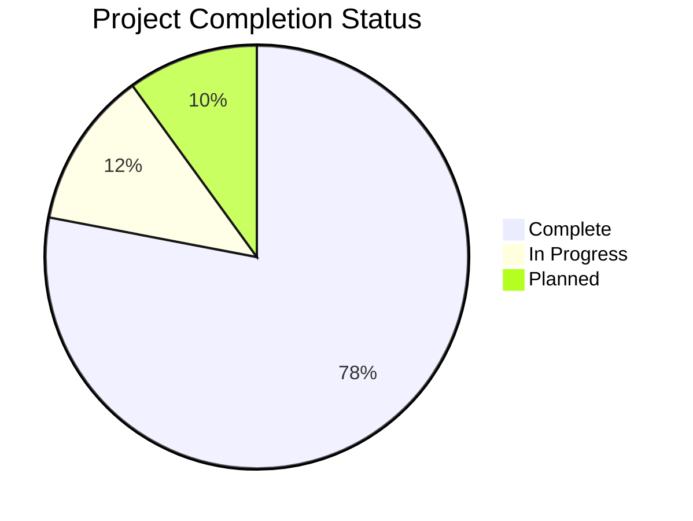
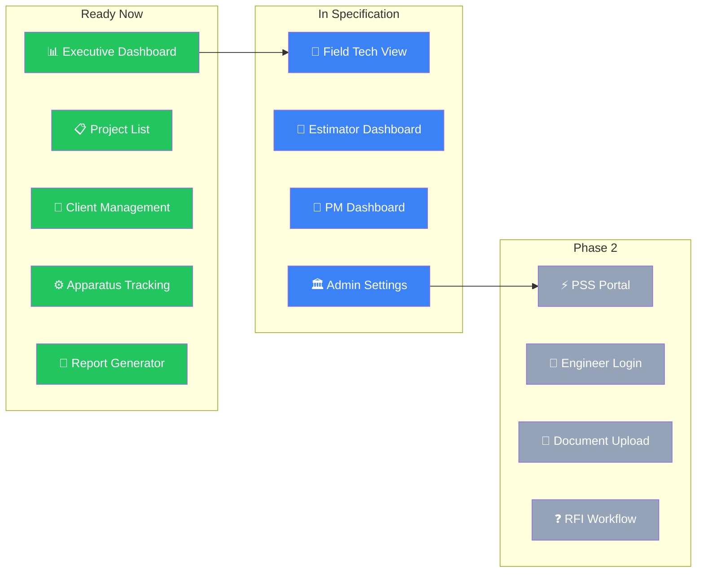
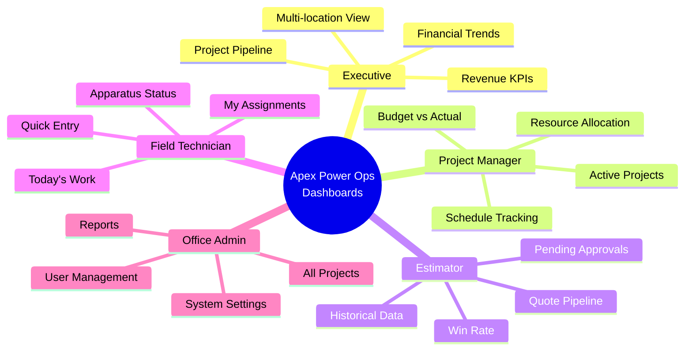
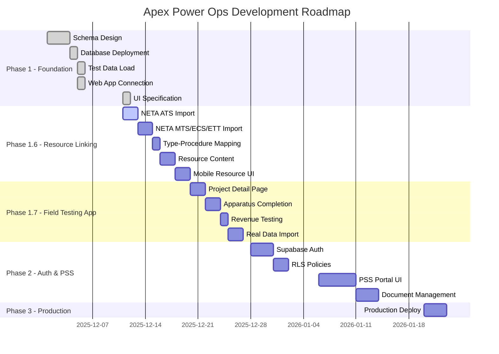

# Apex Power Ops - Project Status

> **Last Updated**: December 11, 2025 (Session 7 - VS Code Claude)  
> **Phase**: Operations Visibility Schema Ready, NETA Import Complete  
> **See Also**: `PROJECT_OVERVIEW.md` for full system architecture

---

## 🎯 Executive Summary



| Milestone | Status | Notes |
|-----------|--------|-------|
| Supabase Schema Design | ✅ Complete | 30 tables, 38+ ENUMs, 12+ triggers |
| Database Deployment | ✅ Complete | All migrations applied |
| Test Data Load | ✅ Complete | LASNAP16 project (47 apparatus) |
| Web App Connection | ✅ Complete | Next.js app fetching from Supabase |
| UI Specification | ✅ Complete | Full spec + v0.dev prompts |
| Role-Based Demo | ✅ Ready | 5-role interactive prototype |
| **NETA Procedures Import** | ✅ Complete | 66 procedures (ATS + MTS) |
| **NETA Test Items** | ✅ Complete | 956 test items across standards |
| **Operations Schema** | 📝 Ready to Deploy | 09_schema_additions.sql |
| Revenue Recognition Flow | ⏳ Ready | Triggers deployed, needs UI testing |
| PSS Portal | 📋 Schema Ready | 6 tables deployed, UI not started |
| Production Deployment | 🔜 Planned | Dev environment only |

---

## 🔥 Current Focus: Operations Visibility (Session 7 Output)

### Requirements Discovery Complete

Key questions answered this session - see `.claude/SESSION_2025-12-11_SCHEMA_OPERATIONS.md`:

1. **Pain Point**: Connecteam shows WHO/WHERE/WHEN, not WHAT can be worked or WHY blocked
2. **Current Workaround**: Excel trackers built to fill visibility gaps
3. **Scaling Problem**: 5→15 projects broke "fits in your head" approach
4. **Success Criteria**: Centralized real-time visibility of everything
5. **MVP**: Operations dashboard answering resource allocation questions

### Schema Additions Ready (Not Yet Deployed)

| File | Contents | Status |
|------|----------|--------|
| `09_schema_additions.sql` | Operational fields + 11 views | 📝 Deploy next |
| `09b_enum_updates.sql` | Assessment enum alignment | 📝 Deploy next |
| `EXCEL_TO_DATABASE_MAPPING.md` | Field transformation guide | ✅ Complete |

### New Operational Views Designed

| View | Purpose |
|------|---------|
| `v_master_operations` | Multi-project "God View" |
| `v_project_apparatus_summary` | Per-project KPIs |
| `v_resource_allocation` | Where to send people |
| `v_equipment_needs` | Test equipment planning |
| `v_blockers_summary` | What's stopping progress |

---

## 📊 Phase 1.6 Resource Linking (Complete)



### UI Specification Documents

| Document | Location | Purpose |
|----------|----------|---------|
| `UI_SPECIFICATION_GUIDE.md` | `Documentation/07_Application_Specs/` | Complete design system, 927 lines |
| `ROLE_DEMO_PROMPT.md` | `Documentation/07_Application_Specs/` | v0.dev prompt - 5 role views, 1193 lines |
| `REPORT_GENERATOR_DEMO_PROMPT.md` | `Documentation/07_Application_Specs/` | Standalone report flow |
| `FIELD_TECH_APPLICATION_SPEC.md` | `Documentation/07_Application_Specs/` | Mobile field app requirements |

### Role-Based Dashboard Features



---

## 📊 Database Statistics (Dec 11, 2025)

### Table Counts

| Table | Records | Change |
|-------|---------|--------|
| `neta_procedures` | **33** | +33 (NEW) |
| `neta_test_items` | **77** | +77 (NEW) |
| `apparatus` | 47 | - |
| `apparatus_types` | 15 | - |
| `tasks` | 12 | - |
| `resource_assignments` | 8 | - |
| `scope_labor_details` | 6 | - |
| `pss_document_templates` | 6 | - |
| `locations` | 5 | - |
| `employees` | 5 | - |
| `scopes` | 4 | - |
| `estimators` | 2 | - |
| `projects` | 1 | - |
| `clients` | 1 | - |
| `sites` | 1 | - |

### Schema Summary

| Component | Count | Details |
|-----------|-------|---------|
| **Tables** | 30 | Core(5) + Hierarchy(4) + Equipment(3) + Financial(4) + Resource(1) + PSS(6) + NETA(7) |
| **ENUMs** | 38+ | All status types, roles, assessments |
| **Triggers** | 12+ | Rollup counts, revenue recognition, audit |
| **Views** | 15+ | Dashboard aggregations |
| **Indexes** | ~50 | Performance optimization |

---

## 🗺️ Implementation Roadmap



---

## 📋 Task Breakdown by Phase

### Phase 1.6: Resource Linking (Current)

| Task | Owner | Status | Description |
|------|-------|--------|-------------|
| Import ATS procedures | ✅ Desktop | Done | 33 procedures loaded |
| Import ATS test items | VS Code | ⚠️ 5/33 | Continuing from handoff |
| Import MTS-2023 | TBD | ⏳ | ~similar structure |
| Import ECS-2024 | TBD | ⏳ | ~similar structure |
| Import ETT-2022 | TBD | ⏳ | ~similar structure |
| Map apparatus_types | TBD | ⏳ | Populate neta_section columns |
| Create junction records | TBD | ⏳ | apparatus_type_resources |
| Add sample SOPs | TBD | ⏳ | Company procedures |
| Add safety docs | TBD | ⏳ | JSAs, bulletins |
| Resource lookup UI | TBD | ⏳ | Mobile component |

### Phase 1.7: Field Testing App

| Task | Complexity | Description |
|------|------------|-------------|
| Project detail page | Medium | Show scopes, tasks, apparatus hierarchy |
| Apparatus completion UI | Medium | Mark complete with delay hours |
| Test revenue trigger | Low | Complete apparatus, verify revenue |
| Import Garney data | Medium | Real project from Excel tracker |

### Phase 2: PSS Portal

| Task | Complexity | Description |
|------|------------|-------------|
| Engineer portal UI | High | External user interface |
| Supabase Auth setup | Medium | Email/password for engineers |
| Document upload | Medium | Storage bucket integration |
| RFI workflow | Medium | Status transitions, notifications |

---

## 🔧 Technical Reference

### Supabase Connection

```
Project:     resa-power-db
Ref:         fxoyniqnrlkxfligbxmg
API URL:     https://fxoyniqnrlkxfligbxmg.supabase.co
Environment: Development
```

### Legacy External Web App Snapshot

```
External Path: C:\Users\jjswe\Projects\resa-web-app
Framework:   Next.js 16.0.5 (App Router)
React:       19.2.0
UI:          shadcn/ui + Radix + Tailwind CSS
```

### Key Files

| Purpose | Path |
|---------|------|
| Session State | `.claude/STATE.md` |
| Task Coordination | `.claude/COORDINATION.md` |
| NETA Import Handoff | `Supabase/scripts/NETA_IMPORT_HANDOFF.md` |
| UI Specifications | `Documentation/07_Application_Specs/` |
| Schema Reference | `Supabase/SCHEMA_REFERENCE.md` |
| Supabase Client | `legacy external app: resa-web-app/src/lib/supabase.ts` |

---

## 🏷️ Version History

| Date | Version | Changes |
|------|---------|---------|
| 2025-12-05 | 1.0.0 | Initial Supabase deployment |
| 2025-12-05 | 1.0.1 | LASNAP16 test data loaded |
| 2025-12-10 | 1.1.0 | Resource Linking schema deployed |
| 2025-12-11 | 1.2.0 | UI Specification complete |
| 2025-12-11 | **1.3.0** | NETA import started (33 procedures, 77 test items) |

---

*Document Version: 1.3.0 | Last Updated: December 11, 2025*
