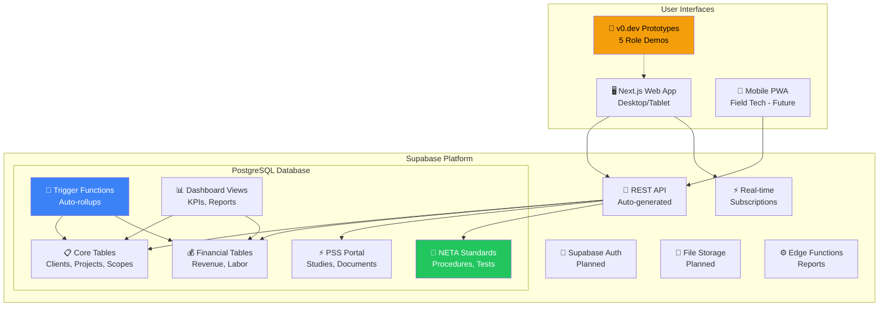
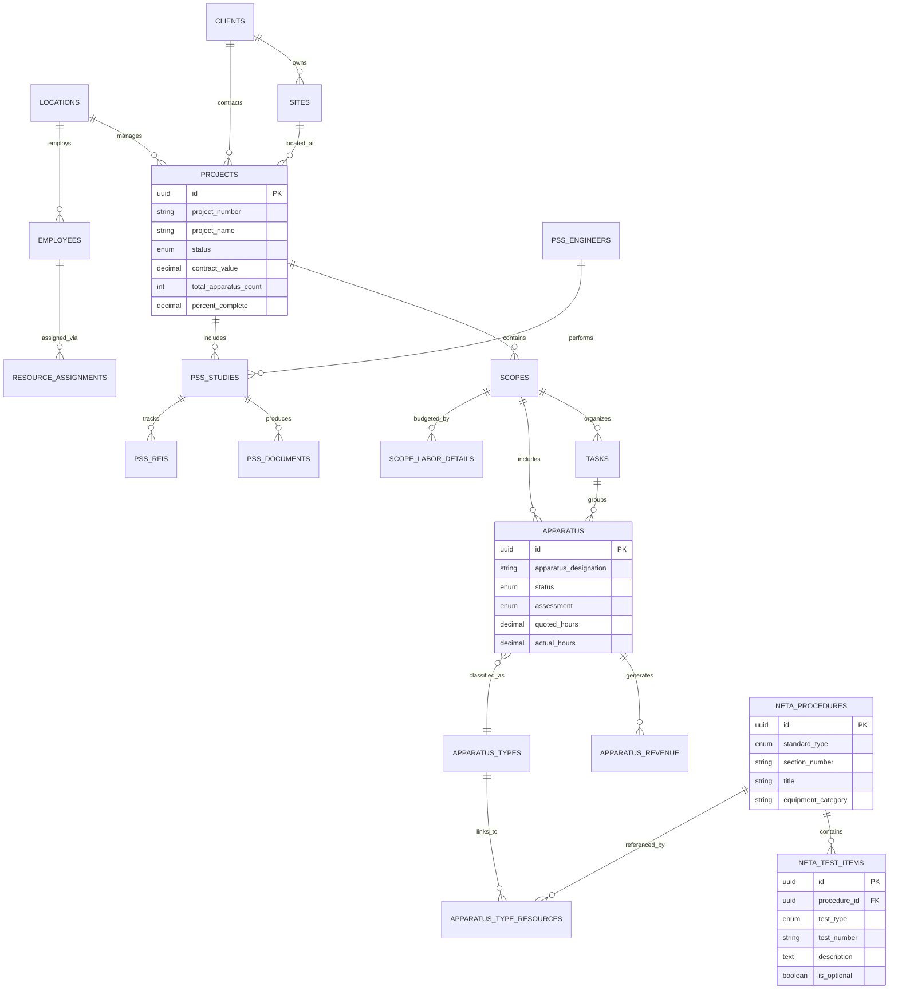
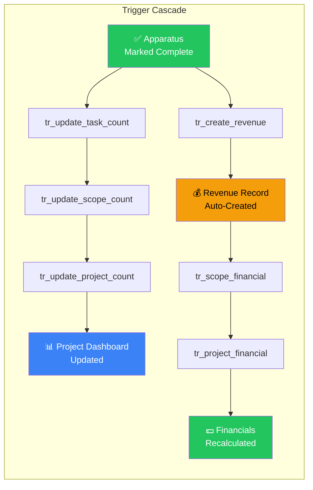
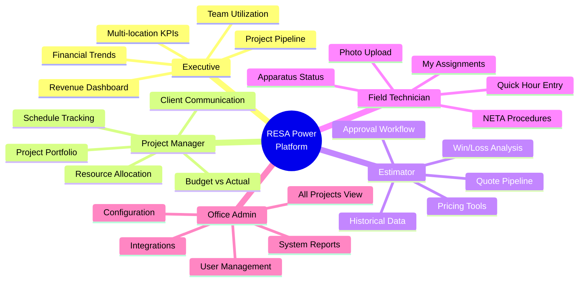
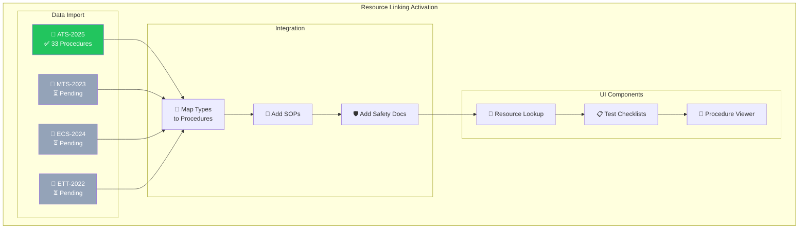

# RESA Power Project Tracker - System Overview

**Version:** 2.2.0 (Supabase)  
**Last Updated:** December 11, 2025  
**Project Lead:** Jason Swenson  
**Repository:** [github.com/jasonlswenson-sys/RESA-Power-Project-Management](https://github.com/jasonlswenson-sys/RESA-Power-Project-Management)

---

## 🎯 Executive Summary

Modern PostgreSQL/Supabase-based project management system for electrical testing projects with NETA standards compliance. **Migrated from Dataverse to Supabase in December 2025** for improved flexibility, lower cost, and better developer experience.

**Platform:**
- **Database**: Supabase (PostgreSQL) - `resa-power-db`
- **Web App**: Next.js 16 + React 19 + shadcn/ui
- **API**: Supabase REST + Real-time subscriptions
- **Auth**: Supabase Auth (planned)

**System Scale (v2.2.0):**
- **30 Tables**: Core + Financial + PSS + Reference + NETA/Resources
- **38+ ENUM Types**: Type-safe status values
- **12 Trigger Functions**: Automated rollups and workflows
- **15+ Views**: Dashboard and reporting aggregations
- **~50 Indexes**: Performance optimization
- **33 NETA Procedures**: ATS-2025 imported

---

## 📊 Platform Architecture



---

## 🏗️ Data Model

### Core Entity Relationships



---

## 📋 Table Inventory (30 Tables)

### Category 1: Organization (5 tables)

| Table | Purpose | Records | Status |
|-------|---------|---------|--------|
| `locations` | RESA branch offices | 5 | ✅ Active |
| `clients` | Customer companies | 1 | ✅ Active |
| `sites` | Client facility locations | 1 | ✅ Active |
| `employees` | RESA staff members | 5 | ✅ Active |
| `estimators` | Quote creators | 2 | ✅ Active |

### Category 2: Project Hierarchy (4 tables)

| Table | Purpose | Records | Status |
|-------|---------|---------|--------|
| `projects` | Main project tracking | 1 | ✅ Active |
| `scopes` | Project phases | 4 | ✅ Active |
| `tasks` | Work items | 12 | ✅ Active |
| `apparatus` | Equipment tested | 47 | ✅ Active |

### Category 3: Equipment (3 tables)

| Table | Purpose | Records | Status |
|-------|---------|---------|--------|
| `apparatus_types` | Equipment type master | 15 | ✅ Active |
| `equipment` | Company test equipment | 0 | 📋 Ready |
| `equipment_assignments` | Equipment tracking | 0 | 📋 Ready |

### Category 4: Financial (4 tables)

| Table | Purpose | Records | Status |
|-------|---------|---------|--------|
| `apparatus_revenue` | Revenue per apparatus | 0 | 📋 Ready |
| `scope_labor_details` | Labor line items | 6 | ✅ Active |
| `scope_financial_summaries` | Scope aggregates | - | View |
| `project_financial_summaries` | Project aggregates | - | View |

### Category 5: Resource Management (1 table)

| Table | Purpose | Records | Status |
|-------|---------|---------|--------|
| `resource_assignments` | Employee allocations | 8 | ✅ Active |

### Category 6: PSS Portal (6 tables)

| Table | Purpose | Records | Status |
|-------|---------|---------|--------|
| `pss_engineers` | External engineers | 0 | 📋 Ready |
| `pss_document_templates` | Document templates | 6 | ✅ Active |
| `pss_studies` | Power System Studies | 0 | 📋 Ready |
| `pss_documents` | Study documents | 0 | 📋 Ready |
| `pss_rfis` | Requests for Information | 0 | 📋 Ready |
| `pss_activity_log` | Audit trail | 0 | 📋 Ready |

### Category 7: NETA/Resource Linking (7 tables) ⭐ NEW

| Table | Purpose | Records | Status |
|-------|---------|---------|--------|
| `neta_procedures` | NETA test procedures | **33** | ✅ **ATS Loaded** |
| `neta_test_items` | Individual tests | **77** | ⚠️ In Progress |
| `neta_test_templates` | Hour estimates | 0 | 📋 Ready |
| `sops` | Standard Operating Procedures | 0 | 📋 Ready |
| `safety_documents` | Safety documentation | 0 | 📋 Ready |
| `datasheets` | Equipment datasheets | 0 | 📋 Ready |
| `apparatus_type_resources` | Type ↔ Resource junction | 0 | ⏳ After NETA |

---

## 🔄 Automated Workflows

### Revenue Recognition Flow



### Trigger Functions (12+)

| Function | Event | Action |
|----------|-------|--------|
| `update_updated_at_column()` | Any UPDATE | Auto-timestamp |
| `update_task_apparatus_count()` | apparatus change | Rollup to task |
| `update_scope_apparatus_counts()` | apparatus change | Rollup to scope |
| `update_project_apparatus_counts()` | scope change | Rollup to project |
| `update_scope_hours_from_apparatus()` | hours change | Sum hours |
| `create_revenue_on_apparatus_complete()` | status = Complete | Create revenue |
| `update_scope_financial_summary()` | revenue change | Recalculate |
| `update_project_financial_summary()` | scope change | Recalculate |
| `log_pss_study_status_change()` | pss status | Audit log |
| `log_pss_document_upload()` | pss doc INSERT | Audit log |

---

## 🖥️ UI Capabilities & Features

### Role-Based Access Architecture



### Feature Matrix by Role

| Feature | Exec | PM | Est | Tech | Admin |
|---------|:----:|:--:|:---:|:----:|:-----:|
| Dashboard Overview | ✅ | ✅ | ✅ | ✅ | ✅ |
| All Projects View | ✅ | ✅ | - | - | ✅ |
| My Projects Only | - | - | ✅ | ✅ | - |
| Create/Edit Projects | - | ✅ | ✅ | - | ✅ |
| Apparatus Completion | - | ✅ | - | ✅ | ✅ |
| Revenue Reports | ✅ | ✅ | - | - | ✅ |
| NETA Procedure Lookup | - | ✅ | - | ✅ | - |
| PSS Portal | - | ✅ | - | - | ✅ |
| User Management | - | - | - | - | ✅ |

### UI Specification Documents

| Document | Lines | Purpose |
|----------|-------|---------|
| `UI_SPECIFICATION_GUIDE.md` | 927 | Complete design system |
| `ROLE_DEMO_PROMPT.md` | 1193 | 5-role v0.dev prototype |
| `REPORT_GENERATOR_DEMO_PROMPT.md` | ~300 | Report generation flow |
| `FIELD_TECH_APPLICATION_SPEC.md` | ~400 | Mobile app requirements |

**Location:** `Documentation/07_Application_Specs/`

---

## 🚀 Implementation Phases

### Phase 1.6: Resource Linking (Current) ⭐



### Phase Overview

| Phase | Focus | Status |
|-------|-------|--------|
| **1.0** | Supabase Migration | ✅ Complete |
| **1.5** | Resource Linking Schema | ✅ Complete |
| **1.6** | Resource Linking Data | ⚠️ **In Progress** |
| **1.7** | Field Testing App UI | ⏳ Next |
| **2.0** | Auth + PSS Portal | 🔜 Planned |
| **3.0** | Production Deployment | 🔜 Planned |

---

## 📊 ENUM Types (38+)

### Project/Work Status
- `project_status`: Draft → Quoted → Won → Active → Complete → Cancelled
- `scope_status`: Not Started → In Progress → Complete
- `apparatus_status`: Not Started → In Progress → Complete
- `apparatus_assessment`: Pass, Fail, Marginal, Needs Repair

### NETA Standards
- `neta_standard_type`: ATS, MTS, ECS, ETT
- `neta_test_type`: visual_mechanical, electrical, optional

### Employee/Resource
- `role_type`: Field Tech, Lead Tech, Engineer, PM, Admin
- `neta_level`: Level I, II, III, IV
- `equipment_status`: Available, Assigned, Calibration

### PSS Portal
- `study_type`: Short Circuit, Arc Flash, Coordination, etc.
- `study_status`: Pending → In Progress → Review → Complete
- `document_status`: Draft → Approved → Superseded
- `rfi_status`: Open → In Progress → Answered → Closed

### Financial
- `revenue_type`: Testing, Travel, Materials, Engineering
- `labor_category`: Field Tech, Lead Tech, Engineer, PM

---

## 📁 Repository Structure

```
RESA_Power_Build/
├── PROJECT_STATUS.md           # Current status (Mermaid charts)
├── PROJECT_OVERVIEW.md         # This file - architecture
├── Supabase/
│   ├── schema/                 # 8 SQL schema files
│   ├── data/                   # Seed + test data
│   ├── scripts/
│   │   └── NETA_IMPORT_HANDOFF.md  # ⭐ NEW - import continuation
│   ├── lib/supabase.ts         # Client library
│   └── SCHEMA_REFERENCE.md     # Quick reference
├── .claude/
│   ├── STATE.md                # Session state
│   ├── COORDINATION.md         # Desktop ↔ VS Code
│   └── OPEN_DECISIONS.md       # Architecture decisions
├── Documentation/
│   └── 07_Application_Specs/   # ⭐ UI Specifications
│       ├── UI_SPECIFICATION_GUIDE.md
│       ├── ROLE_DEMO_PROMPT.md
│       ├── REPORT_GENERATOR_DEMO_PROMPT.md
│       └── FIELD_TECH_APPLICATION_SPEC.md
├── Reference_Files/
│   └── NETA/Extracted/         # ⭐ NETA JSON files
└── CSV_Templates/              # Import templates

Web App (active platform lane):
C:\APEX Platform\apex-power-ops-platform\apps\operations-web\
├── app/                        # Next.js app routes
├── lib/                        # Browser env and governed fetch clients
├── public/                     # Re-homed static operator surfaces
└── tests/                      # Browser smoke coverage
```

---

## 🔧 Technical Specifications

### Platform Stack

| Component | Technology | Version |
|-----------|-----------|---------|
| **Database** | PostgreSQL via Supabase | 17.x |
| **Backend** | Supabase REST + Realtime | Latest |
| **Web Framework** | Next.js (App Router) | 16.0.5 |
| **UI Library** | shadcn/ui + Radix | Latest |
| **Styling** | Tailwind CSS | 4.x |
| **Language** | TypeScript | 5.x |
| **Prototyping** | v0.dev | - |

### Supabase Project

| Setting | Value |
|---------|-------|
| Project Name | `resa-power-db` |
| Project Ref | `fxoyniqnrlkxfligbxmg` |
| API URL | `https://fxoyniqnrlkxfligbxmg.supabase.co` |
| Environment | Development |

---

## 🔄 Migration from Dataverse

**Why Supabase?**
- ✅ Lower cost ($25/mo vs Power Platform licensing)
- ✅ Full SQL access for complex queries
- ✅ Real-time subscriptions built-in
- ✅ Better developer experience
- ✅ Open source, no vendor lock-in
- ✅ PostgreSQL industry standard

**What's New in Supabase:**
- PSS Portal tables (6 tables)
- NETA/Resource linking tables (7 tables)
- Equipment tracking + assignments
- 38+ type-safe ENUMs (vs text fields)
- 12+ trigger functions (vs 1 Power Automate flow)

---

**Document Version:** 2.2.0  
**Last Updated:** December 11, 2025
