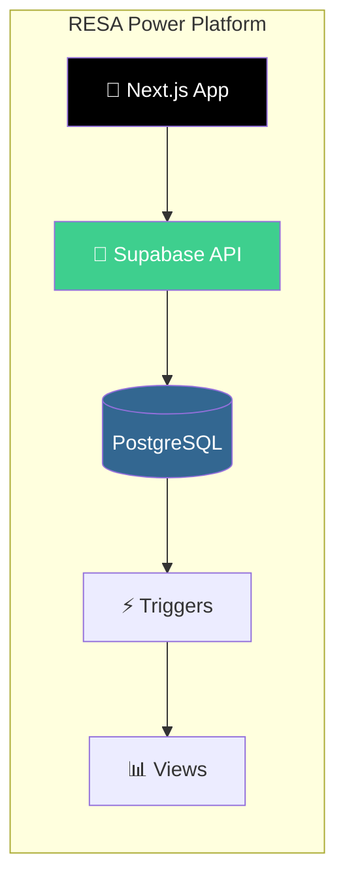
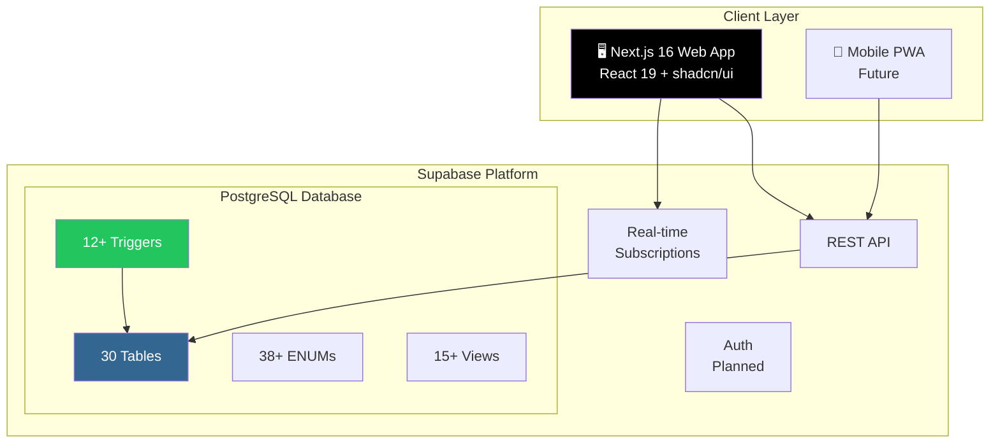
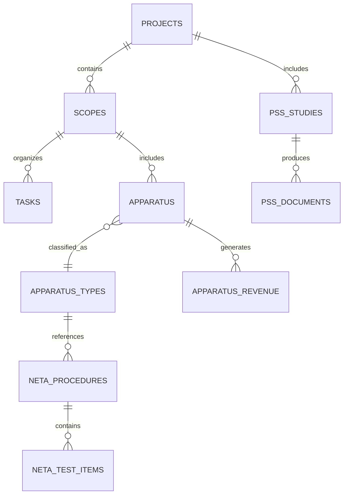
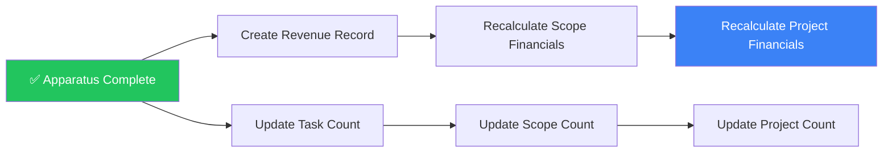
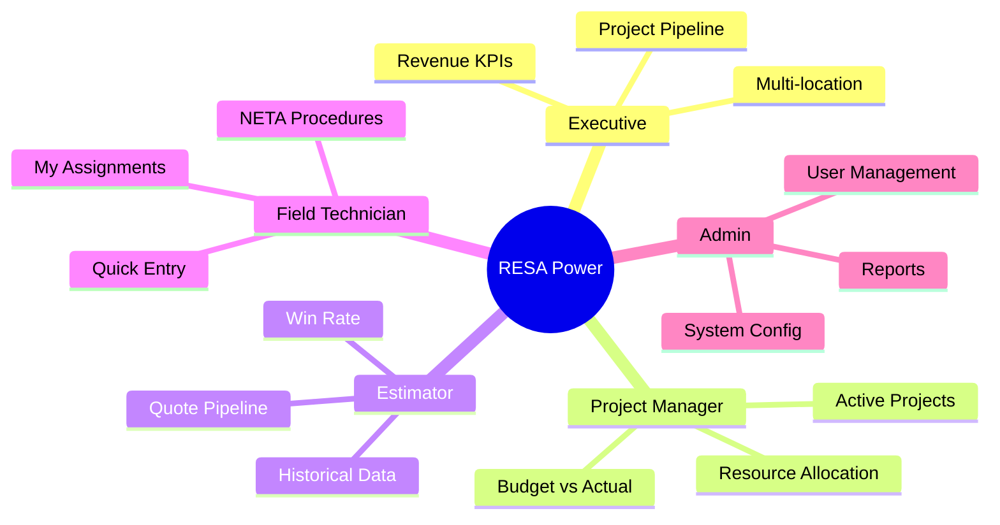
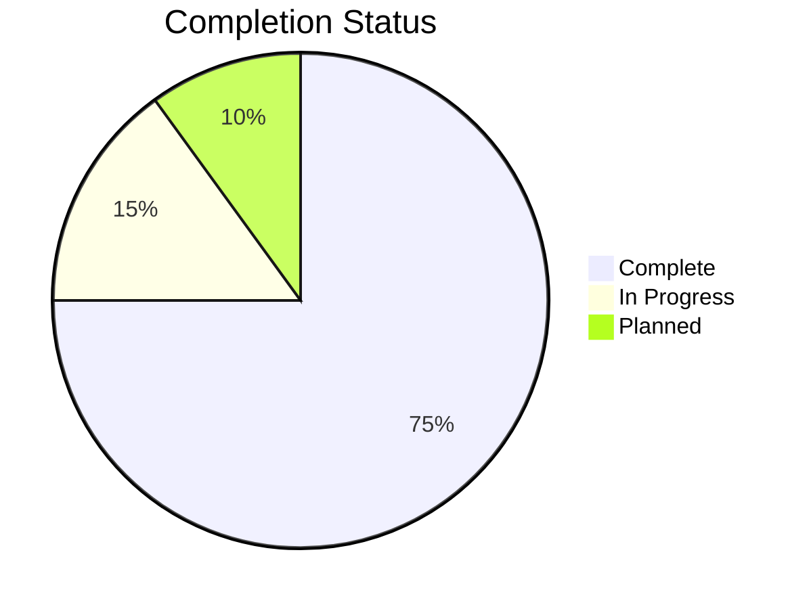
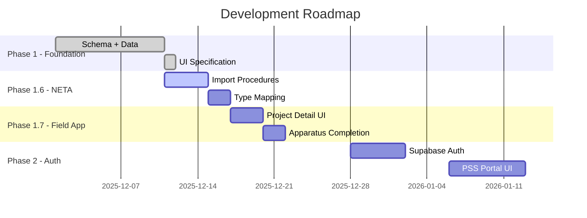

# RESA Power - Project Management Platform

> Strategic redesign note: future-state platform authority entry now starts in `apex-power-ops-platform/docs/authority/README.md`.
> Use that repo-owned index first, then consult the linked inherited blueprint documents when making repo-topology, schema, multi-agent, or platform-boundary decisions.

> **Modern PostgreSQL-based project tracking for electrical testing operations**  
> Migrated from Microsoft Dataverse to Supabase in December 2025

[](./PROJECT_STATUS.md)
[](https://supabase.com)
[](https://nextjs.org)
[]()

---

## 🎯 Overview

Full-stack project management system for RESA Power's electrical field testing operations. Tracks apparatus-level work (switchgear, transformers, breakers) through the complete project lifecycle with automated revenue recognition, NETA standards compliance, and Power System Studies (PSS) portal.



**Key Capabilities:**
- 🏗️ **Project Hierarchy**: Projects → Scopes → Tasks → Apparatus
- 💰 **Revenue Recognition**: Automatic calculation on apparatus completion
- 📋 **NETA Compliance**: 33+ test procedures with checklists
- ⚡ **PSS Portal**: Power System Studies tracking with document management
- 👥 **Multi-Role Access**: Executive, PM, Estimator, Field Tech, Admin views
- 🔄 **Real-Time Updates**: Supabase subscriptions for live dashboards

---

## 📊 System Architecture



### Tech Stack

| Layer | Technology | Version |
|-------|------------|---------|
| **Database** | PostgreSQL via Supabase | 17.x |
| **Backend** | Supabase REST + Realtime | Latest |
| **Frontend** | Next.js (App Router) | 16.0.5 |
| **UI Components** | shadcn/ui + Radix | Latest |
| **Styling** | Tailwind CSS | 4.x |
| **Language** | TypeScript | 5.x |

---

## 🗄️ Database Schema

### Table Summary (30 Tables)

| Category | Tables | Description |
|----------|--------|-------------|
| **Organization** | 5 | Locations, Clients, Sites, Employees, Estimators |
| **Project Hierarchy** | 4 | Projects, Scopes, Tasks, Apparatus |
| **Equipment** | 3 | Apparatus Types, Equipment, Assignments |
| **Financial** | 4 | Revenue, Labor Details, Financial Summaries |
| **Resource Mgmt** | 1 | Resource Assignments |
| **PSS Portal** | 6 | Studies, Documents, RFIs, Engineers, Templates, Activity Log |
| **NETA/Resources** | 7 | Procedures, Test Items, Templates, SOPs, Safety, Datasheets |

### Core Data Model



### Automated Workflows (Triggers)



---

## 🚀 Quick Start

### Prerequisites

- Node.js 18+
- npm or yarn
- Supabase account (or use existing project)

### 1. Clone Repository

```bash
git clone https://github.com/jasonlswenson-sys/RESA-Power-Project-Management.git
cd RESA-Power-Project-Management
```

### 2. Database Setup (Supabase)

```bash
# Option A: Use existing project
# Project ref: fxoyniqnrlkxfligbxmg

# Option B: Deploy to new project
# Run in Supabase SQL Editor:
cat Supabase/DEPLOY_ALL.sql | supabase db push
```

### 3. Web App Setup

```bash
cd ../../apps/operations-web

# Install dependencies
pnpm install

# Run the governed browser app
pnpm dev

# Start development server
npm run dev
```

### 4. Access Application

Open [http://localhost:3000](http://localhost:3000)

---

## 📁 Repository Structure

```
RESA_Power_Build/
├── 📄 README.md                    # This file
├── 📄 PROJECT_OVERVIEW.md          # Architecture + diagrams
├── 📄 PROJECT_STATUS.md            # Current status + roadmap
│
├── 📂 Supabase/
│   ├── schema/                     # SQL schema files (00-07)
│   │   ├── 00_enums.sql           # 38+ ENUM types
│   │   ├── 01_tables.sql          # Core tables
│   │   ├── 02_relationships.sql   # Foreign keys
│   │   ├── 03_triggers.sql        # 12+ trigger functions
│   │   ├── 04_views.sql           # Dashboard views
│   │   └── 05_indexes.sql         # Performance indexes
│   ├── data/
│   │   ├── 10_seed_data.sql       # Reference data
│   │   ├── 11_test_data.sql       # LASNAP16 test project
│   │   └── 20_neta_procedures.sql # NETA standards
│   ├── scripts/
│   │   └── NETA_IMPORT_HANDOFF.md # Import instructions
│   ├── lib/supabase.ts            # Client library
│   ├── SCHEMA_REFERENCE.md        # Quick reference
│   └── DEPLOY_ALL.sql             # Single-file deployment
│
├── 📂 .claude/
│   ├── STATE.md                   # Session state
│   ├── COORDINATION.md            # Task allocation
│   └── OPEN_DECISIONS.md          # Architecture decisions
│
├── 📂 Documentation/
│   ├── 07_Application_Specs/      # ⭐ UI Specifications
│   │   ├── UI_SPECIFICATION_GUIDE.md    # Design system (927 lines)
│   │   ├── ROLE_DEMO_PROMPT.md          # v0.dev prototype (1193 lines)
│   │   ├── REPORT_GENERATOR_DEMO_PROMPT.md
│   │   └── FIELD_TECH_APPLICATION_SPEC.md
│   └── [other documentation folders]
│
├── 📂 Reference_Files/
│   └── NETA/Extracted/            # NETA JSON source files
│       ├── ANSI_NETA_ATS-2025_Final_v2.json
│       ├── ANSI_NETA_MTS-2023_FINAL_v2.json
│       ├── ANSI_NETA_ECS-2024_v2.json
│       └── ANSI_NETA_ETT-2022_FINAL_v2.json
│
└── 📂 CSV_Templates/              # Import templates
```

---

## 🎨 UI Features

### Role-Based Dashboards



### Feature Highlights

| Feature | Status | Description |
|---------|--------|-------------|
| Project Dashboard | ✅ Ready | Overview with KPIs and project list |
| Apparatus Tracking | ✅ Ready | Status, hours, completion workflow |
| Revenue Recognition | ✅ Ready | Auto-calculation via triggers |
| NETA Procedures | ⚠️ Loading | 33 ATS procedures imported |
| PSS Portal | 📋 Schema Ready | Studies, documents, RFIs |
| Report Generator | 📋 Specified | Auto-generate PDF reports |
| Mobile Field App | 🔜 Planned | PWA for field technicians |

### UI Specification Documents

Historical parent-root location: preserved from `Documentation/07_Application_Specs/` and summarized here.

| Document | Lines | Purpose |
|----------|-------|---------|
| `UI_SPECIFICATION_GUIDE.md` | 927 | Complete design system |
| `ROLE_DEMO_PROMPT.md` | 1193 | v0.dev interactive prototype |
| `REPORT_GENERATOR_DEMO_PROMPT.md` | ~300 | Report flow specification |
| `FIELD_TECH_APPLICATION_SPEC.md` | ~400 | Mobile app requirements |

---

## 📈 Current Status

### Database Statistics

| Metric | Count |
|--------|-------|
| **Tables** | 30 |
| **ENUM Types** | 38+ |
| **Triggers** | 12+ |
| **Views** | 15+ |
| **Indexes** | ~50 |
| **NETA Procedures** | 33 (ATS-2025) |
| **Test Items** | 77+ |

### Test Data (LASNAP16 Project)

| Table | Records |
|-------|---------|
| Apparatus | 47 |
| Tasks | 12 |
| Scopes | 4 |
| Employees | 5 |
| Apparatus Types | 15 |

### Implementation Progress



---

## 🗺️ Roadmap



---

## 🔐 Security

### Planned Authentication

1. **Phase 1** (Current): Development with anon key
2. **Phase 2**: Supabase Auth with email/password
3. **Phase 3**: Row-Level Security (RLS) policies
4. **Phase 4**: Optional Azure AD SSO

### Role-Based Access

| Role | Scope |
|------|-------|
| Field Tech | Own assignments only |
| Lead Tech | Team assignments |
| Project Manager | Full project access |
| Estimator | Quotes + project creation |
| Admin | Full system access |
| Executive | Read-only dashboards |

---

## 📚 Documentation

### Essential Reading

| Document | Description |
|----------|-------------|
| [PROJECT_OVERVIEW.md](./PROJECT_OVERVIEW.md) | Architecture diagrams and data model |
| [PROJECT_STATUS.md](./PROJECT_STATUS.md) | Historical status snapshot with Mermaid charts |
| [../knowledge-domain/apex-resa/SCHEMA_REFERENCE.md](../knowledge-domain/apex-resa/SCHEMA_REFERENCE.md) | Repo-owned schema reference for the preserved lineage import set |
| [../../../../PROJECT_STATUS.md](../../../../PROJECT_STATUS.md) | Canonical current execution status superseding the old session-state surface |

### Technical Specifications

| Document | Location |
|----------|----------|
| UI Design System | Historical parent-root `Documentation/07_Application_Specs/` design system |
| Role Demo Prompt | Historical parent-root `Documentation/07_Application_Specs/` role-demo prompt |
| Report Workflow | [../automation-reporting/SUPABASE_REPORT_WORKFLOW.md](../automation-reporting/SUPABASE_REPORT_WORKFLOW.md) |

---

## 🤝 Development

### Claude AI Coordination

This project uses a dual-Claude workflow:
- **Desktop Claude**: Database schema, SQL, architecture decisions
- **VS Code Claude**: Application code, UI development

Session state is maintained in `.claude/STATE.md` and `.claude/COORDINATION.md`.

### Key Commands

```bash
# View current session state
cat .claude/STATE.md

# Deploy schema to Supabase
psql $DATABASE_URL < Supabase/DEPLOY_ALL.sql

# Run web app
pnpm --dir ../../ --filter @apex/operations-web dev
```

---

## 📞 References

| Resource | Link |
|----------|------|
| **Supabase Dashboard** | [supabase.com/dashboard](https://supabase.com/dashboard) |
| **Project API** | `https://fxoyniqnrlkxfligbxmg.supabase.co` |
| **Next.js Docs** | [nextjs.org/docs](https://nextjs.org/docs) |
| **shadcn/ui** | [ui.shadcn.com](https://ui.shadcn.com) |

---

## 🔄 Migration History

**December 2025**: Migrated from Microsoft Dataverse to Supabase

| Aspect | Before (Dataverse) | After (Supabase) |
|--------|-------------------|------------------|
| Tables | 8 | **30** |
| Triggers | 1 Power Automate | **12+ PostgreSQL** |
| UI | Power Apps | **Next.js 16** |
| Cost | Power Platform licensing | **$25/month** |
| Flexibility | Limited | **Full SQL access** |

---

## 📄 License

Private repository - RESA Power internal use only.

---

**Version:** 2.2.0  
**Last Updated:** December 11, 2025  
**Maintainer:** Jason Swenson
