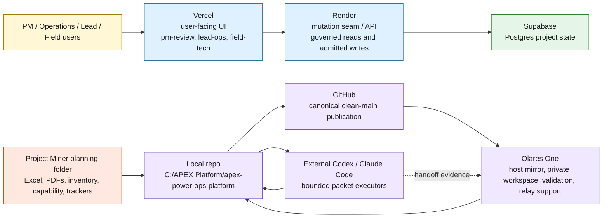
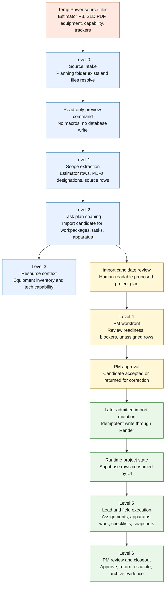
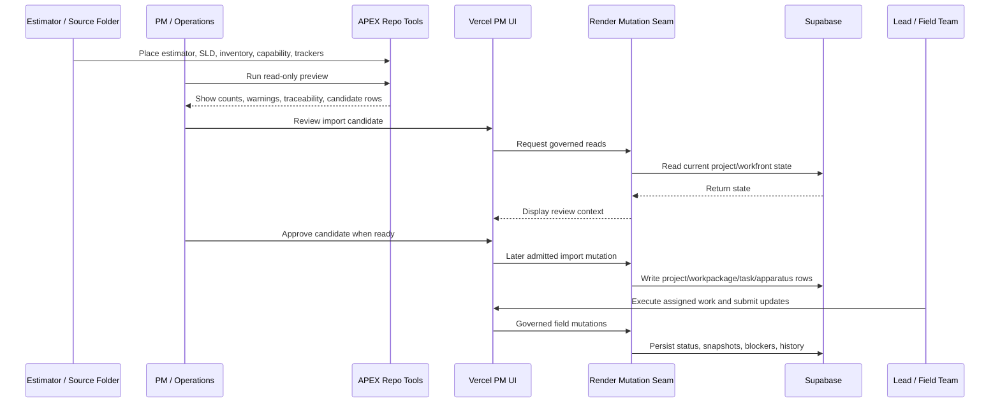
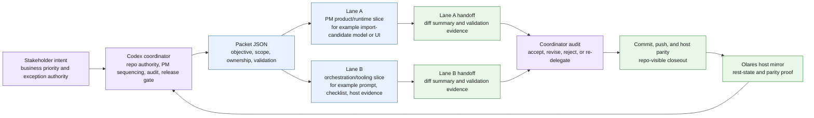
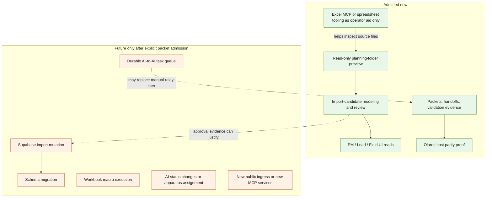

# APEX Ops Visual System Map

Date: 2026-05-15
Status: Active orientation aid
Scope: Visual explanation of the current APEX Ops, PM lane, Olares One, and AI orchestration split

## Purpose

This page is the visual starting point for understanding how the current pieces fit together.

The short version:

1. Vercel is the user-facing app.
2. Render is the governed API and mutation boundary.
3. Supabase is the database.
4. The Project Miner planning folder is the real project-intake source for Temp Power.
5. Olares One is the development, host-validation, private workspace, and AI relay support surface.
6. GitHub remains the canonical publication surface.
7. AI executors work from packets and handoffs; they do not directly own business state.

## Plain-English Legend

| Piece | What it is for | What it is not for |
| --- | --- | --- |
| Vercel | The web app people click through: PM, Lead, Field, and review screens. | Not the database and not a second backend authority. |
| Render | The API/mutation seam between the UI and Supabase. It enforces governed reads and admitted writes. | Not a duplicate of Vercel, and not a free-for-all database bridge. |
| Supabase | The durable Postgres-backed project state. | Not the primary user workflow surface. |
| Project Miner planning folder | The source packet: estimator workbooks, PDFs, inventory, capability, and tracker lineage. | Not production state until reviewed and imported through an admitted path. |
| Local repo | The active implementation surface on this workstation. | Not a place to commit unrelated residue or unreviewed generated state. |
| GitHub | Canonical repo publication and branch history. | Not the AI task queue by itself. |
| Olares One | Host mirror, private workspace, validation surface, and future orchestration home. | Not currently admitted as autonomous AI-to-AI task ownership. |
| External Codex / Claude Code | Bounded executors for clearly scoped packet work. | Not repo authority, PM authority, or release authority. |

## Current Platform Split

Read this as two connected lanes:

1. The product lane is `Users -> Vercel -> Render -> Supabase`.
2. The build/governance lane is `Planning folder -> local repo -> GitHub -> Olares -> repo-visible evidence`.

## Project Miner PM Lane Flow

The important idea: the first live Temp Power move is not "dump Excel into the database." It is "turn real source files into a reviewable import candidate, let PM/Ops approve it, then admit the narrow write path."

## Day-To-Day PM Operation

## AI Orchestration Split

The default is one executor. Two lanes are only useful when the work is clearly split and the files do not collide.

## Current Authority Boundary

This is the key safety line: AI can help explain, group, summarize, and warn. AI cannot silently mutate real PM business state.

## Where To Start

For the current Temp Power PM lane work, start here:

1. Treat the original import-candidate and PM-intake parity branches as completed background, not as the current blocker.
2. Use the controlling actuals-branch admission phrase `ADMIT_TEMP_POWER_ACTUALS_CUSTOMER_CAPTURE_REVIEW_FIRST_WRITE_PACKET_ONLY`.
3. Treat authenticated Render redeploy as completed proof, not as the current blocker.
4. Treat PM Lane 314 publication as completed proof: commit `3d47834eb32aa29b80152df3973f91d7c62a2e30` is live on the existing mutation-seam service.
5. Treat PM Lane 315 publication as completed proof: commit `666f649d020d19cc24d1a5e57b9a1796928f45d8` is live on the existing mutation-seam service.
6. Both hosted seam URLs now pass the bounded `--include-temp-power-actuals-review` and `--include-temp-power-customer-preview-review` smoke, so the admitted actuals plus customer-preview review first-write slice is complete within current scope.
7. Treat PM Lane 316 as the next-boundary marker: any follow-on lane starts with customer delivery and durable proof admission, not finance or source writeback.
8. Treat PM Lane 317 as the current design marker: the next delivery/proof work is design-first contract work, not direct implementation.
9. Treat PM Lane 318 as the current review-design marker: the next delivery/proof work is an inspection-only PM surface, while storage and runtime admission stay deferred.
10. Treat PM Lane 319 as the current storage-design marker: the next delivery/proof work is readback design, while schema and runtime admission stay deferred.
11. Treat PM Lane 320 as the current readback-design marker: the next delivery/proof work is route/payload design, while schema and runtime admission stay deferred.
12. Treat PM Lane 321 as the current request-contract marker: the next delivery/proof work is a separate execution gate, while schema and runtime admission stay deferred.

For AI orchestration work, start here:

1. Decide whether one executor is enough.
2. If two lanes are useful, declare disjoint file ownership first.
3. Put the scope, stop conditions, and validation commands into a packet.
4. Require handoff evidence.
5. Coordinator audits before publication.

## Primary Source Documents

1. `docs/operations/PM-LANE-PROJECT-MINER-INTAKE-WORKFLOW-2026-05-15.md`
2. `docs/operations/APEX-PM-TEMP-POWER-DELIVERY-AND-ORCHESTRATION-PLAN-2026-05-15.md`
3. `docs/authority/APEX-OPS-DELEGATED-AUTHORITY-AND-AI-ORCHESTRATION-PROTOCOL-2026-05-15.md`
4. `docs/authority/OLARES-WORKSPACE-AUTHORITY-FRAMEWORK.md`
5. `docs/operations/OLARES-AI-DELEGATED-DUAL-LANE-EXECUTION-CHECKLIST-2026-05-13.md`
