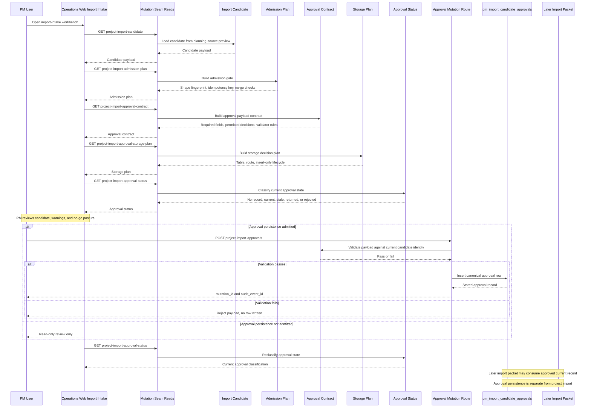

# APEX PM Import Approval Contract Sequence Diagram

Date: 2026-05-19
Status: Active reference artifact
Scope: Project Miner import candidate approval contract, persistence boundary, and later import handoff

## Purpose

This artifact captures the repo-governed Project Miner approval flow as a Mermaid sequence diagram.

It is intentionally narrower than the broader PM workflow runbook:

1. candidate read
2. admission plan
3. approval contract
4. storage plan
5. approval status readback
6. approval persistence
7. later separate import packet

Primary implementation sources:

1. `apps/mutation-seam/app/project_import_admission_plan.py`
2. `apps/mutation-seam/app/project_import_approval_contract.py`
3. `apps/mutation-seam/app/project_import_approval_storage_plan.py`
4. `apps/mutation-seam/app/project_import_approval_persistence.py`
5. `apps/mutation-seam/migrations/003_pm_import_candidate_approvals.sql`
6. `apps/operations-web/app/pm-review/import-intake/page.tsx`

## Mermaid

## Interpretation Notes

1. Approval persistence is not project import.
2. The canonical approval state lives in `seam.pm_import_candidate_approvals`, not in audit history alone.
3. Candidate identity includes candidate id, candidate version, source fingerprint, shape fingerprint, and idempotency key.
4. A later import packet may consume an approved current record, but this artifact does not admit that import write path.
5. Browser-local intake review remains a separate no-live preparation surface until the approval mutation route is explicitly admitted.